## 概述

LKS1M25005 是高压单相IPM （智能功率模块）,内部合封高压专用驱动芯片以及高性能 FR-M OSFET ，适用于直流无刷电机。低侧M OSFET 的源极接采样电阻用于电流采样。信号输入端集成施密特触发器，逻辑电平兼容 3.3V/5V/15V。

LKS1M25005 提供 $F O / { \overline { { \mathsf { S D } } } }$ ，VTS ，Vbus -sense 功能，集成 TSD 、UVLO 、DESAT 保护。

LKS1M25005 采用低热阻、小体积 EH SOP1 2 贴片封装。

## 特点

◼ IPM 自供电，无需外部VCC 供电

◼ 集成母线电压检测，高精度(±1.5% )

◼ 集成温度检测信号输出

◼ FO /SD 故障状态输出和外部关断控制

◼ 内置高性能 500V/5A FR -MOSFET

◼ 强耐瞬态负压能力

◼ 高侧 UVLO ，母线电压 UVLO

◼ 内置死区防上下管直通

◼ 高低压电气间隙大于 2mm

◼ 集成 TSD 、UVLO 、DESAT 保护功能

## 典型应用

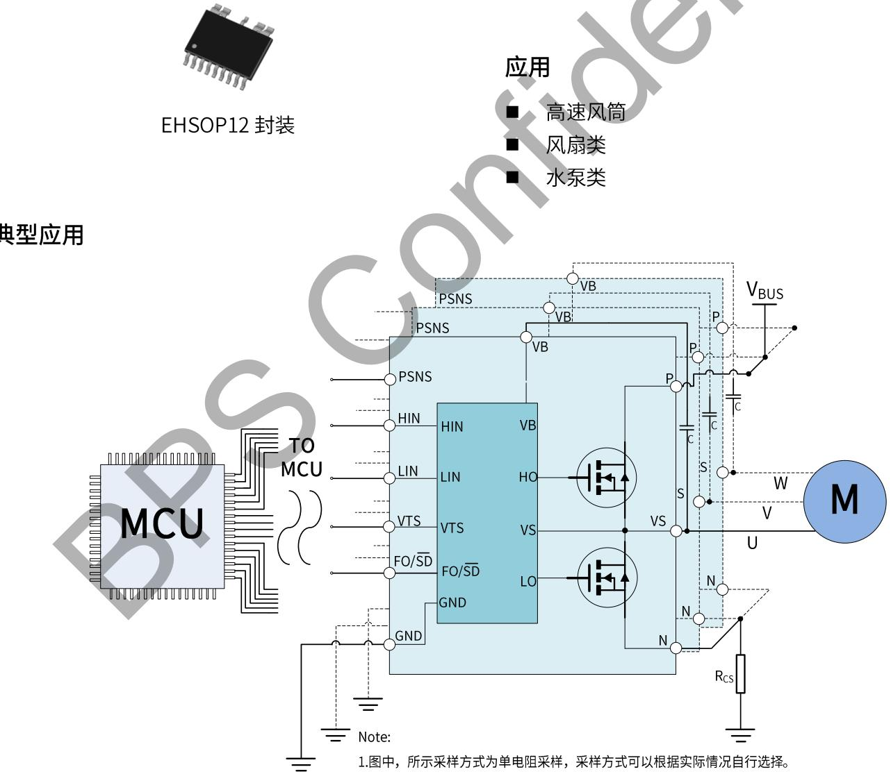  
1.图中，所示采样方式为单电阻采样，采样方式可以根据实际情况自行选择

图 1.LKS1M25005 典型应用图

## 定购信息

<table><tr><td>定购型号</td><td>封装</td><td>包装形式</td><td>印章</td></tr><tr><td>LKS1M25005</td><td>EHSOP12</td><td>编带2500 PCS/盘</td><td>LKS1M25005XXXXYXZZZZWWX</td></tr></table>

## 管脚封装

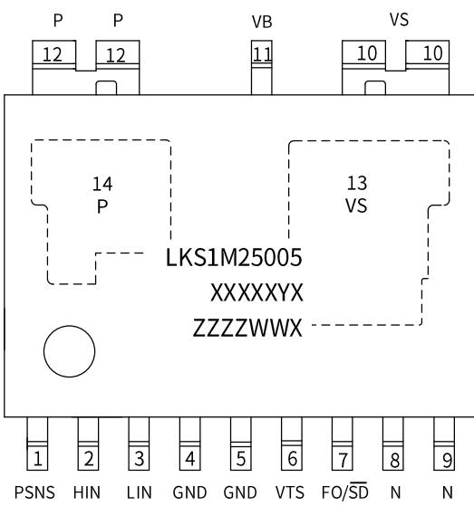  
LKS1M25005 ：产品型号  
图 2. LKS1M25005 管脚封装图

XXXXXY X：批号

ZZZZ ：标识

WW ：周号

X：特殊字符

## 管脚描述

<table><tr><td>管脚号</td><td>管脚名称</td><td>描述</td></tr><tr><td>1</td><td>PSNS</td><td>母线电压采样输出信号</td></tr><tr><td>2</td><td>HIN</td><td>高侧控制信号输入</td></tr><tr><td>3</td><td>LIN</td><td>低侧控制信号输入</td></tr><tr><td>4,5</td><td>GND</td><td>低侧参考地</td></tr><tr><td>6</td><td>VTS</td><td>温度检测输出</td></tr><tr><td>7</td><td>FO/SD</td><td>故障信号输出和外部关断控制复用引脚,内部串接1M电阻上拉到5V基准</td></tr><tr><td>8,9</td><td>N</td><td>连接低侧MOSFET的SOURCE端</td></tr><tr><td>10</td><td>VS</td><td>悬浮地,高侧参考地</td></tr><tr><td>11</td><td>VB</td><td>高侧电源供电端</td></tr><tr><td>12</td><td>P</td><td>高压端输入,内部芯片取电供电端,连接高侧MOSFET的DRAIN端</td></tr><tr><td>13(衬底)</td><td>VS</td><td>主散热焊盘,连通VS引脚(带电)</td></tr><tr><td>14(衬底)</td><td>P</td><td>主散热焊盘,连通P引脚(带电)</td></tr></table>

## 内部框图

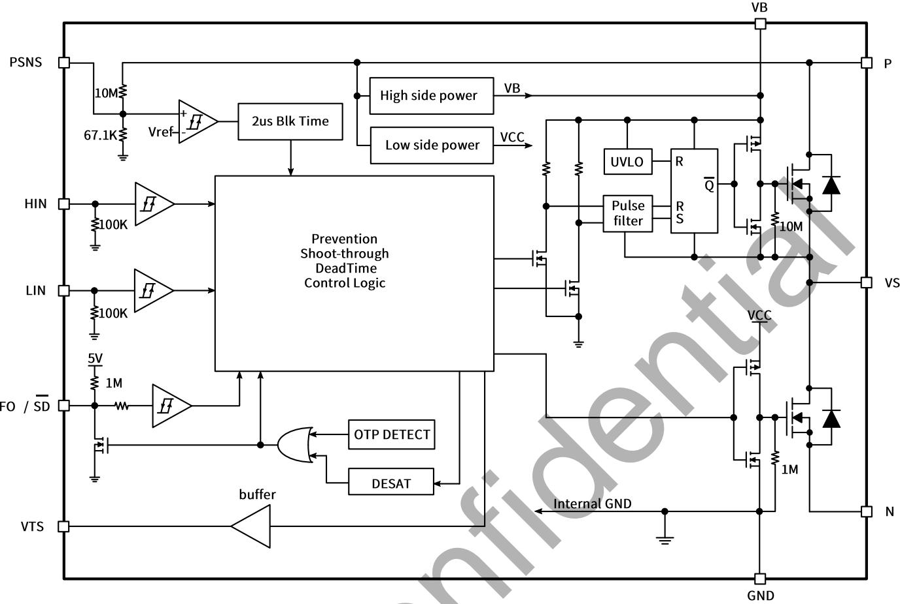  
图 3. LKS1M25005 内部框图

## 极限参数(注 1)(无特别说明情况下， $T _ { A } = 2 5 ^ { \circ } C )$

## 逆变部分

<table><tr><td>符号</td><td>参数</td><td>条件</td><td>参数范围</td><td>单位</td></tr><tr><td> $V_{DSS}$ </td><td>MOSFET 漏源电压</td><td> $I_{DSS}=250uA$ </td><td>500</td><td>V</td></tr><tr><td rowspan="2"> $I_D$ </td><td rowspan="2">MOSFET 连续工作电流 (注 2)</td><td> $T_C=25°C$ </td><td>5</td><td>A</td></tr><tr><td> $T_C=100°C$ </td><td>3.17</td><td>A</td></tr><tr><td> $P_D$ </td><td>封装最大耗散功耗</td><td>单颗 MOSFET( $T_C=100°C$ )</td><td>45</td><td>W</td></tr></table>

控制部分

<table><tr><td>符号</td><td>参数</td><td>条件</td><td>参数范围</td><td>单位</td></tr><tr><td> $V_{PSNS}$ </td><td>母线电压输出(固定比率)</td><td>PSNS和GND之间电压</td><td>-0.3~+6</td><td>V</td></tr><tr><td> $V_{BS}$ </td><td>高侧供电电压</td><td>VB和VS之间电压</td><td>-0.3~18</td><td>V</td></tr><tr><td> $V_{LIN/HIN}$ </td><td>输入信号电压</td><td>LIN/HIN和GND之间电压</td><td>-0.3~18</td><td>V</td></tr><tr><td> $V_{VTS}$ </td><td>温度检测输出</td><td>VTS和GND之间电压</td><td>-0.3~6</td><td>V</td></tr><tr><td> $V_{FO/SD}$ </td><td>故障输出和关机控制电压</td><td>FO/SD和GND之间电压</td><td>-0.3~6</td><td>V</td></tr></table>

## 封装热阻

<table><tr><td>符号</td><td>参数</td><td>条件</td><td>参数范围</td><td>单位</td></tr><tr><td> $R_{thJC\_TOP}$ </td><td>MOS 结温到其顶部外壳的热阻</td><td>同逆变部分条件</td><td>22</td><td>°C/W</td></tr><tr><td> $R_{thJC\_BOTTOM}$ </td><td>MOS 结温到散热焊盘底部的热阻</td><td>同逆变部分条件</td><td>1.1</td><td>°C/W</td></tr><tr><td> $R_{thJA}$ </td><td>MOS 结温到环境温度的热阻</td><td>同逆变部分条件</td><td>85</td><td>°C/W</td></tr></table>

## 整机系统

<table><tr><td>符号</td><td>参数</td><td>条件</td><td>参数范围</td><td>单位</td></tr><tr><td> $T_{J}$ </td><td>工作结温范围</td><td></td><td>-40~150</td><td>°C</td></tr><tr><td> $T_{STG}$ </td><td>储存温度范围</td><td></td><td>-40~125</td><td>°C</td></tr></table>

ESD 能力

<table><tr><td>符号</td><td>参数</td><td>条件</td><td>参数范围</td><td>单位</td></tr><tr><td>HBM</td><td>人体放电模型</td><td></td><td>±4000</td><td>V</td></tr><tr><td>CDM</td><td>元件充电模式</td><td></td><td>±2000</td><td>V</td></tr><tr><td>MM</td><td>机器放电模式</td><td></td><td>±300</td><td>V</td></tr></table>

注 1：极限参数是指应用超出该范围，可导致器件永久性损坏。  
注 2：受最大结温限制。

推荐工作条件(注 3)(无特别说明情况下，TA =25℃)

<table><tr><td>符号</td><td>描述</td><td>条件</td><td>最小值</td><td>典型值</td><td>最大值</td><td>单位</td></tr><tr><td> $V_{PN}$ </td><td>功率供电电压</td><td>P,N引脚之间</td><td>-</td><td>300</td><td>400</td><td>V</td></tr><tr><td> $V_{LIN/HIN(ON)}$ </td><td>高电平电压</td><td>LIN/HIN和GND之间</td><td>3.0</td><td>-</td><td>15</td><td>V</td></tr><tr><td> $V_{LIN/HIN(OFF)}$ </td><td>低电平电压</td><td>LIN/HIN和GND之间</td><td>0</td><td>-</td><td>0.4</td><td>V</td></tr><tr><td> $T_{DEAD}$ </td><td>死区时间(注4)</td><td>输入LIN与HIN之间</td><td>1.0</td><td>-</td><td>-</td><td>μs</td></tr><tr><td> $F_{PWM}$ </td><td>开关频率</td><td></td><td>-</td><td>20</td><td>-</td><td>kHz</td></tr><tr><td> $T_C$ </td><td>MOS顶部外壳温度</td><td></td><td></td><td></td><td>100</td><td>°C</td></tr><tr><td> $T_J$ </td><td>MOS器件结温</td><td></td><td></td><td></td><td>125</td><td>°C</td></tr></table>

注 3：推荐的工作条件，器件可稳定可靠的工作。  
注 4：IPM 内置预驱包含了内置死区时间(典型值参考电气参数表格中的数据)，控制算法在设置死区时间时，需考虑内置死区时间影响。

电气参数(注 5)(无特别说明情况下， $T _ { A } = 2 5 ^ { \circ } C )$

<table><tr><td>符号</td><td>描述</td><td>条件</td><td>最小值</td><td>典型值</td><td>最大值</td><td>单位</td></tr><tr><td colspan="7">逆变部分</td></tr><tr><td> $BV_{DSS}$ </td><td>MOS 漏源击穿电压</td><td> $V_{LIN/HIN}=0V, I_D=1mA$ </td><td>500</td><td></td><td></td><td>V</td></tr><tr><td> $I_{DSS}$ </td><td>MOS 额定漏电流</td><td> $V_{LIN/HIN}=0V, V_{DS}=500V$ </td><td></td><td></td><td>10</td><td>μA</td></tr><tr><td> $V_{SD}$ </td><td>MOS 体二极管正向导通压降</td><td> $V_{LIN/HIN}=0V, I_D=-0.5A$ </td><td></td><td></td><td>1</td><td>V</td></tr><tr><td> $R_{DS(ON)}$ </td><td>MOS 管导通内阻</td><td> $V_{PN}=80V, I_D=0.5A$ </td><td></td><td>2.1</td><td>2.6</td><td>Ω</td></tr><tr><td> $T_{ON}$ </td><td rowspan="8">开关过程</td><td rowspan="8"> $V_{PN}=400V, I_D=5A,$ 高侧和低侧</td><td></td><td>920</td><td></td><td>ns</td></tr><tr><td> $T_{OFF}$ </td><td></td><td>460</td><td></td><td>ns</td></tr><tr><td>Irr</td><td></td><td>3.8</td><td></td><td>A</td></tr><tr><td>Trr</td><td></td><td>90</td><td></td><td>ns</td></tr><tr><td> $T_r$ </td><td></td><td>50</td><td></td><td>ns</td></tr><tr><td> $T_f$ </td><td></td><td>20</td><td></td><td>ns</td></tr><tr><td> $E_{ON}$ </td><td></td><td>270</td><td></td><td>μJ</td></tr><tr><td> $E_{OFF}$ </td><td></td><td>30</td><td></td><td>μJ</td></tr><tr><td colspan="7">控制部分</td></tr><tr><td> $I_{QCC}$ </td><td>低侧静态供电电流</td><td> $V_{PN}=80V, V_{LIN/HIN}=0V$ </td><td>150</td><td>230</td><td>300</td><td>μA</td></tr><tr><td> $I_{QBS}$ </td><td>高侧静态供电电流</td><td> $V_{BS}=15V, V_{LIN/HIN}=0V$ </td><td>24</td><td>40</td><td>52</td><td>μA</td></tr><tr><td> $V_{P_ON}$ </td><td rowspan="2"> $V_P$ 和 $V_{BS}$ 开启阈值电压</td><td rowspan="2"></td><td>54</td><td>60</td><td>66</td><td>V</td></tr><tr><td> $V_{BS_ON}$ </td><td>11.5</td><td>13</td><td>14.5</td><td>V</td></tr><tr><td> $V_{FO/\overline{SD}_ON}$ </td><td> $V_{FO/\overline{SD}}$ 开启阈值电压</td><td></td><td>1.65</td><td>1.85</td><td>2.25</td><td>V</td></tr><tr><td> $V_{P_UVLO}$ </td><td rowspan="2"> $V_P$ 和 $V_{BS}$ 关断阈值电压</td><td rowspan="2"></td><td>38</td><td>43</td><td>50</td><td>V</td></tr><tr><td> $V_{BS_UVLO}$ </td><td>7.5</td><td>8.1</td><td>9</td><td>V</td></tr><tr><td> $V_{FO/\overline{SD}_OFF}$ </td><td> $V_{FO/\overline{SD}}$ 关断阈值电压</td><td></td><td>0.9</td><td>1.2</td><td>1.5</td><td>V</td></tr><tr><td> $V_{P_HYS}$ </td><td rowspan="2"> $V_P$ 和 $V_{BS}$ 迟滞电压</td><td rowspan="2"></td><td>10</td><td>15</td><td>20</td><td>V</td></tr><tr><td> $V_{BS_HYS}$ </td><td>3.5</td><td>5</td><td>5.5</td><td>V</td></tr><tr><td> $V_{FO/\overline{SD}_HYS}$ </td><td> $V_{FO/\overline{SD}}$ 迟滞电压</td><td></td><td>0.4</td><td>0.65</td><td>0.9</td><td>V</td></tr><tr><td> $V_{LIN/HIN(ON)}$ </td><td>HIN/LIN开启高电平</td><td>逻辑高电平</td><td>2.5</td><td>-</td><td></td><td>V</td></tr><tr><td> $V_{LIN/HIN(OFF)}$ </td><td>HIN/LIN关断低电平</td><td>逻辑低电平</td><td></td><td>-</td><td>0.6</td><td>V</td></tr><tr><td>DT</td><td>死区时间</td><td>驱动内置</td><td></td><td>300</td><td></td><td>ns</td></tr><tr><td> $V_{PSNS}$ </td><td>母线电压检测输出电压</td><td> $V_{PN}=75V$ 时输出电压</td><td>0.49</td><td>0.5</td><td>0.51</td><td>V</td></tr><tr><td> $K_{PSNS}$ </td><td>母线电压输出比例(固定)</td><td> $K_{PSNS}=V_{PSNS}/V_{PN}$ </td><td>1/147.7</td><td>1/150</td><td>1/152.3</td><td>V</td></tr><tr><td colspan="7">热关断(TSD)保护</td></tr><tr><td> $T_{TSD}$ </td><td>过热关断阈值温度</td><td></td><td></td><td>130</td><td></td><td>°C</td></tr><tr><td> $T_{HYST}$ </td><td>过热关断迟滞温度</td><td></td><td></td><td>25</td><td></td><td>°C</td></tr></table>

注 5: 电气特性定义器件的工作范围，大部分数据由测试程序保证，小部分由设计值保证，生产不会测试(举例：热关断(TSD)保护)。对于电气特性表中未定义的最大值和最小值的情况，其典型值仅用于定义器件的工作范围，规格书不保证其精度。

## 真值表

<table><tr><td>HIN</td><td>LIN</td><td>输出</td><td>描述</td></tr><tr><td>0</td><td>0</td><td>Hi-Z</td><td>输出高阻态,高侧和低侧 MOS 关断</td></tr><tr><td>0</td><td>1</td><td>0</td><td>低侧 MOS 导通,高侧 MOS 关断</td></tr><tr><td>1</td><td>0</td><td> $V_P$ </td><td>高侧 MOS 导通,低侧 MOS 关断</td></tr><tr><td>1</td><td>1</td><td>Hi-Z</td><td>禁止输入,输出高阻态,高侧和低侧 MOS 关断</td></tr><tr><td>开路</td><td>开路</td><td>Hi-Z</td><td>HIN/LIN 内部下拉电阻 100kΩ,高侧和低侧 MOS 关断</td></tr></table>

## 开关过程定义

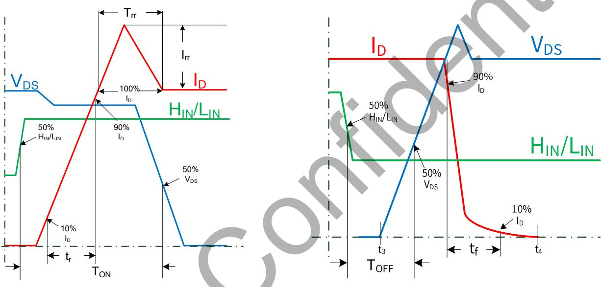  
图4.开关过程时间定义

## 典型应用电路图

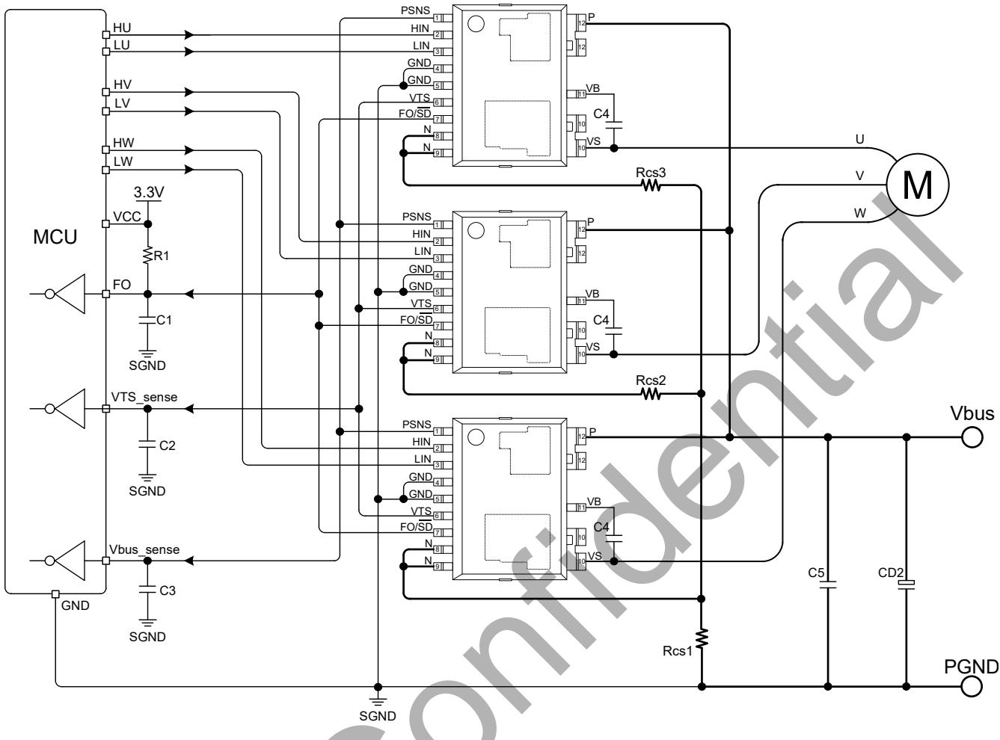

## 图 5. 典型应用电路图

设计人员可根据应用需求，选择不同的设计方案。

## 应用指南：

◆ FO /SD 复用引脚内部串接了一个1M Ω（典型值）上拉电阻连接至内部5V 电压基准，输入功能控制模块开关，输出功能用作故障信号报警，因内部上拉阻值较大，应用时需外接外部上拉电阻，阻值参考FO /SD 下拉后，流过R1 上的电流为1mA 设计上拉电阻阻值；电容C1 的值建议从 10nF-100nF 之间，值越大，FO下拉和恢复时间越长，C1 应尽可能靠近FO /SD 引脚放置。

◆ 自举供电，建议C4 容值范围100nF -1uF 之间，推荐使用1uF/X7R MLCC 电容；C4 应尽可能靠近VS 和VB 引脚；自举电容的负极应直接连接到VS 端子，并与主输出线分开。

◆ PSNS 滤波电容C3，推荐使用10nF ，C3 应尽可能靠近PSNS 引脚放置。

◆ 与电解电容CD 2 并联使用的去耦电容器C5（推荐容值范围100nF -220nF 之间，具有低ESR 和低ESL 的高耐压电容）有助于防止浪涌破坏功率管，电容器C5 和CD 2 应尽可能靠近IPM 放置（C5 优先于CD 2 靠近IPM 引脚放置）。

◆ 为避免寄生参数引起的故障，VS 引脚、分流电阻器和PGND 上的接线应尽可能短粗。

◆ SGND 与PGND 的连接仅在一点（靠近分流电阻器端子）以减少电源地波动的影响。

## DESAT 保护

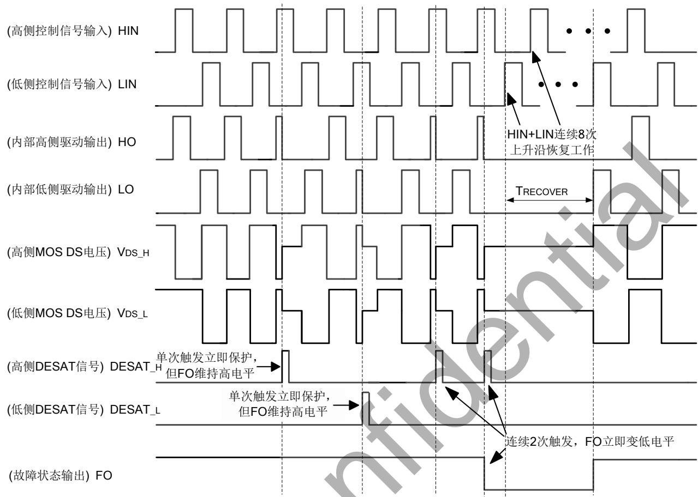

## 图 6. DESAT 保护功能

## DESAT 保护逻辑：

IPM 内部高侧和低侧MOS 在工作期间，若只检测到1次DESAT 信号，只关闭对应MOS 一个周期，等待下一周期继续工作，FO 保持高电平不变，模块不锁定，可继续工作；若检测到相邻周期2 次 DESAT 信号，同时关闭高侧低侧MOS ，FO 输出低电平， 模块锁住等待恢复。当HIN 和LIN 再次输入8个上升沿（包含单独LIN 输入8个上升沿、单独HIN 输入8个上升沿、HIN＋LIN 共计输入8个上升沿均可），FO 低电平被释放掉，模块恢复正常工作状态(高侧供电未进入欠压保护状态)。FO 保持锁定时间TRECOVER 等于8 个上升沿时间。恢复正常工作后，若再次检测到相邻2 个DESAT 信号，再次DESAT 保护。

## 外部关断控制(SD )

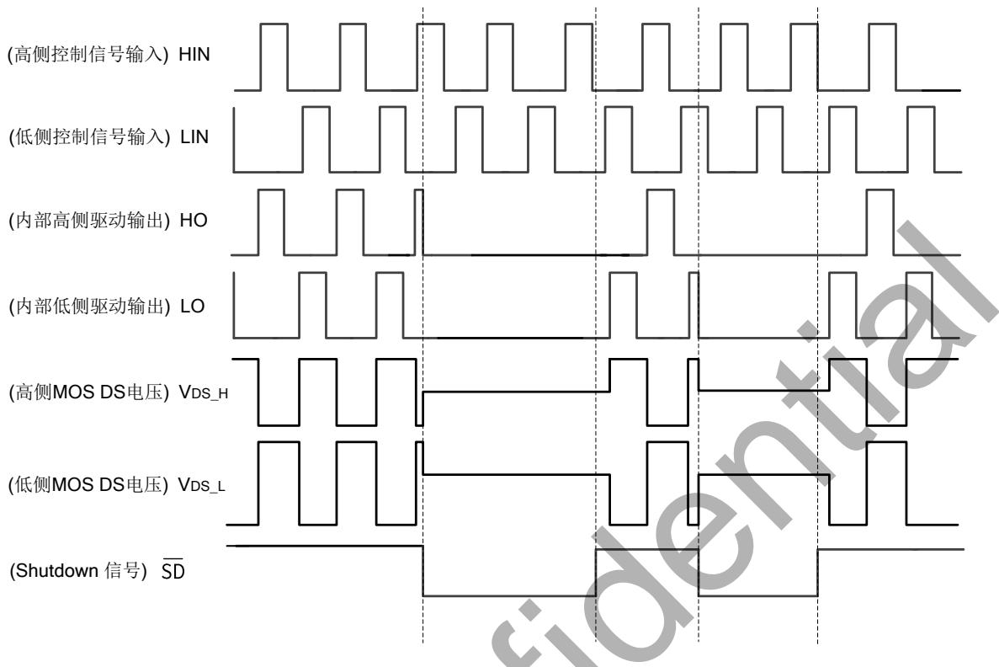  
图 7. 外部关断控制逻辑

## 外部关断控制(SD )逻辑:

复用引脚FO/ SD 输入低电平，IPM 模块立即关闭高侧和低侧MOS ；复用引脚FO/ SD 输入高电平，IPM 模块低侧MOS 立即响应LIN 输入电平的信号工作，高侧MOS 需要等待下一个HIN 周期上升沿开始工作。

## 热关断保护功能(TSD )

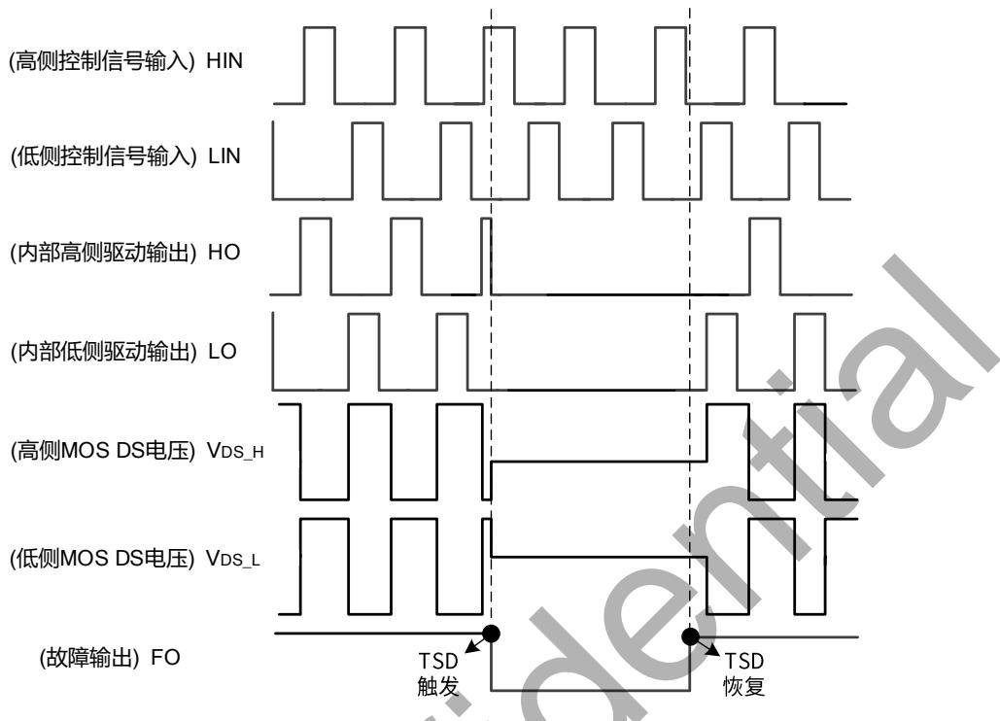  
图 8. 热关断逻辑

## 热关断保护功能(TSD)：

IPM 模块集成热关断功能，以很近的距离将功率器件MOS 和专用驱动芯片封装在一起，MOS 工作时的发热能很快的被驱动芯片检测到，驱动芯片上集成了温度检测电路，当保护电路检测点温度达到过温关断温度值130℃(典型值)时，保护电路逻辑控制高侧和低侧M OS 关断，FO 输出低电平并保持下拉；模块冷却降温，电路检测点检测到恢复温度值105℃(典型值)时，保护电路释放FO 下拉电平，模块恢复正常工作。

## VTS 输出特性曲线

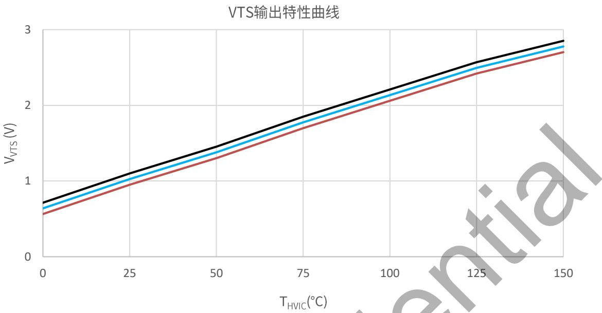  
图 9. VTS输出特性曲线

VTS 输出电压可按此公式计算： $\mathsf { V } _ { \mathsf { V T S } } ( \mathsf { m V } ) = 1 5 \times \mathsf { T } _ { \mathsf { H V I C } } + 6 5 0 \pm 7 5$

封装信息

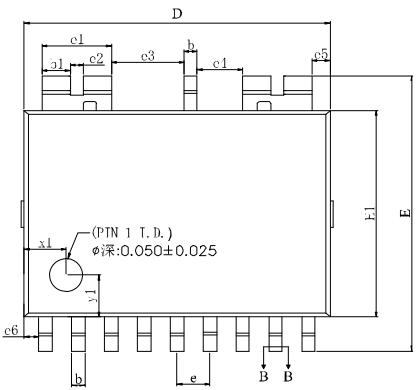  
TOP VIEW

SIDE VIEW  
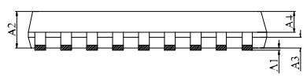

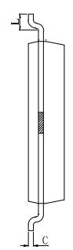  
SIDE VIEW

EH SOP 12 封装外形尺寸  
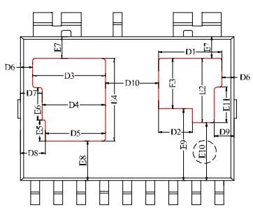

BOTTOM VIEW  
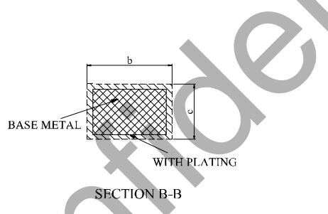

COMMON DIMENSIONS  
(UNITS OF MEASURE=MILLIMETER)

<table><tr><td>SYMBOL</td><td>MIN</td><td>NOM</td><td>MAX</td></tr><tr><td>A1</td><td>0.05</td><td>0.10</td><td>0.15</td></tr><tr><td>A2</td><td>1.35</td><td>1.40</td><td>1.45</td></tr><tr><td>A3</td><td>-</td><td>0.40</td><td>-</td></tr><tr><td>A4</td><td>-</td><td>0.80</td><td>-</td></tr><tr><td>b</td><td>0.35</td><td>-</td><td>0.49</td></tr><tr><td>b1</td><td>0.80</td><td>0.85</td><td>0.90</td></tr><tr><td>c</td><td>0.17</td><td>-</td><td>0.25</td></tr><tr><td>D</td><td>9.20</td><td>9.30</td><td>9.40</td></tr><tr><td>D1</td><td>2.69</td><td>2.74</td><td>2.79</td></tr><tr><td>D2</td><td>1.43</td><td>1.48</td><td>1.53</td></tr><tr><td>D3</td><td>3.11</td><td>3.16</td><td>3.21</td></tr><tr><td>D4</td><td>2.69</td><td>2.74</td><td>2.79</td></tr><tr><td>D5</td><td>2.57</td><td>2.62</td><td>2.67</td></tr><tr><td>D6</td><td></td><td>0.54 REF</td><td></td></tr><tr><td>D7</td><td></td><td>0.96 REF</td><td></td></tr><tr><td>D8</td><td></td><td>1.08 REF</td><td></td></tr><tr><td>D9</td><td></td><td>0.86 REF</td><td></td></tr><tr><td>D10</td><td></td><td>2.32 REF</td><td></td></tr><tr><td>E</td><td>8.38</td><td>8.43</td><td>8.48</td></tr><tr><td>E1</td><td>6.20</td><td>6.30</td><td>6.40</td></tr><tr><td>E2</td><td>2.77</td><td>2.82</td><td>2.87</td></tr><tr><td>E3</td><td>2.16</td><td>2.21</td><td>2.26</td></tr><tr><td>E4</td><td>3.56</td><td>3.61</td><td>3.66</td></tr><tr><td>E5</td><td>0.86</td><td>0.91</td><td>0.96</td></tr><tr><td>E6</td><td>1.38</td><td>1.43</td><td>1.48</td></tr><tr><td>E7</td><td></td><td>0.96 REF</td><td></td></tr><tr><td>E8</td><td></td><td>1.74 REF</td><td></td></tr><tr><td>E9</td><td></td><td>3.15 REF</td><td></td></tr><tr><td>E10</td><td></td><td>2.54 REF</td><td></td></tr><tr><td>E11</td><td></td><td>1.55 REF</td><td></td></tr><tr><td>e</td><td></td><td>1.00BSC</td><td></td></tr><tr><td>e1</td><td></td><td>2.10BSC</td><td></td></tr><tr><td>e2</td><td></td><td>0.40BSC</td><td></td></tr><tr><td>e3</td><td></td><td>2.20BSC</td><td></td></tr><tr><td>e4</td><td></td><td>1.40BSC</td><td></td></tr><tr><td>e5</td><td></td><td>0.55BSC</td><td></td></tr><tr><td>e6</td><td></td><td>0.45BSC</td><td></td></tr><tr><td>L</td><td>0.40</td><td>-</td><td>0.80</td></tr><tr><td>x1</td><td>1.18</td><td>1.28</td><td>1.38</td></tr><tr><td>y1</td><td>1.18</td><td>1.28</td><td>1.38</td></tr></table>

NOTES:  
1. ALL DIMENSIONS MEET JEDEC STANDARD MS-012E  
2 ALL DIMFNSIONS DO NOT INCLUDF MOLD FLASH OR PROTRUSIONS

## 版本信息

<table><tr><td>版本</td><td>日期</td><td>记录</td></tr><tr><td>Rev.1.0</td><td>2025/12</td><td>首次发行</td></tr></table>

## 免责声明

晶丰明源尽力确保本产品规格书内容的准确和可靠，但是保留在没有通知的情况下，修改规格书内容的权利。

本产品规格书未包含任何针对晶丰明源或第三方所有的知识产权的授权。针对本产品规格书所记载的信息，晶丰明源不做任何明示或暗示的保证，包括但不限于对规格书内容的准确性、商业上的适销性、特定目的的适用性或者不侵犯晶丰明源或任何第三人知识产权做任何明示或暗示保证，晶丰明源也不就因本规格书本身及其使用有关的偶然或必然损失承担任何责任。 。

## 电子器件报废说明

该产品在生命周期结束后，由客户按照一般电子产品的报废流程进行处理。