## 概述

LKS1M36003 是一款智能且高可靠性的半桥功率模块，内部集成一颗高压专用驱动芯片及两颗高性能快恢复 FR-MOSFET，特别适用于直流无刷电机。低侧MOSFET 源极开路用于电流采样。信号输入内部包含施密特触发器，逻辑电平兼容3.3V/5V/15V。模块同时集成了欠压保护、过温保护、硬件过流保护、输出死区、输入信号互锁等保护功能。

LKS1M36003 采用 ESOP13 封装

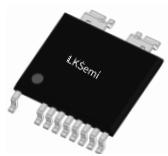  
ESOP13 封装

## 特点

◼ 集成高性能 600V/3.5A FR-MOSFET

◼ 短路时间＞5

◼ 内部集成自举二极管和限流电阻

◼ 高低压电气间隙＞2mm

◼ 抗瞬态负电压能力强

◼ 输入逻辑兼容 3.3V, 5V 及 15V 电平

◼ 高侧和低侧均集成欠压保护功能

◼ 输入信号互锁及内置死区，均防止上下管直通

◼ 异常状态输出/外部关机控制

◼ 硬件过流保护(OCP)，过温保护(OTP)

◼ ESOP13封装，低热阻，高散热能力

## 应用

空调内机工业风机

## 典型应用

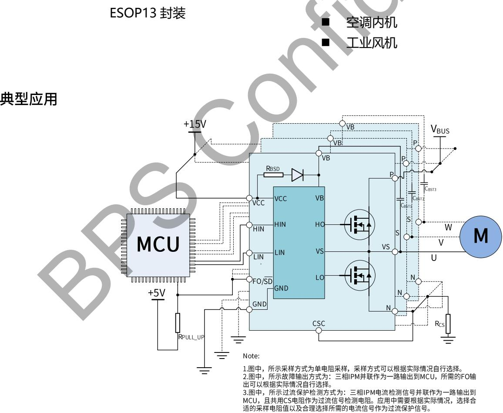  
图 1. LKS1M36003 典型应用图

## 定购信息

<table><tr><td>定购型号</td><td>封装</td><td>包装形式</td><td>印章</td></tr><tr><td>LKS1M36003</td><td>ESOP13</td><td>编带2500 PCS/盘</td><td>LKS1M36003XXXXXYZZZZWWX</td></tr></table>

## 管脚封装

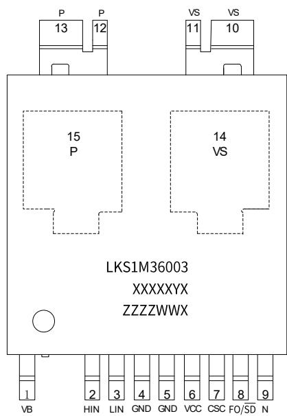  
LKS1M36003：产品型号  
XXXXXYX：批号

ZZZZ：标识

WW：周号

X：特殊代码

  
图 2. LKS1M36003 管脚封装图

## 管脚描述

<table><tr><td>管脚号</td><td>管脚名称</td><td>描述</td></tr><tr><td>1</td><td>VB</td><td>高侧桥臂供电端</td></tr><tr><td>2</td><td>HIN</td><td>高侧逻辑信号输入端</td></tr><tr><td>3</td><td>LIN</td><td>低侧逻辑信号输入端</td></tr><tr><td>4,5</td><td>GND</td><td>接地端</td></tr><tr><td>6</td><td>VCC</td><td>低侧供电端</td></tr><tr><td>7</td><td>CSC</td><td>硬件过流保护输入端,如未使用需要接地端</td></tr><tr><td>8</td><td>FO/SD</td><td>异常信号输出和关机信号输入端,内部无上拉,需要外部上拉电阻配合使用</td></tr><tr><td>9</td><td>N</td><td>低侧 MOSFET 的源极端</td></tr><tr><td>10,11</td><td>VS</td><td>相电压输出端</td></tr><tr><td>12,13</td><td>P</td><td>高压直流供电端</td></tr><tr><td>14(衬底)</td><td>VS</td><td>相电压输出端</td></tr><tr><td>15(衬底)</td><td>P</td><td>高压直流供电端</td></tr></table>

## 极限参数(注 1)(无特别说明情况下， $T _ { A } = 2 5 ^ { \circ } C )$

逆变部分

<table><tr><td>符号</td><td>参数</td><td>条件</td><td>参数范围</td><td>单位</td></tr><tr><td> $V_{DSS}$ </td><td>MOSFET的漏源电压</td><td> $I_{DSS}=250uA$ </td><td>600</td><td>V</td></tr><tr><td rowspan="2"> $I_D$ </td><td rowspan="2">MOSFET连续工作电流(注2)</td><td> $T_C=25°C$ </td><td>3</td><td>A</td></tr><tr><td> $T_C=100°C$ </td><td>1.89</td><td>A</td></tr><tr><td> $P_D$ </td><td>最大耗散功耗</td><td>单颗MOSFET( $T_C=100°C$ )</td><td>50</td><td>W</td></tr></table>

控制部分

<table><tr><td>符号</td><td>参数</td><td>条件</td><td>参数范围</td><td>单位</td></tr><tr><td> $V_{CC}$ </td><td>低侧供电电压</td><td>VCC和GND两端电压</td><td>-0.3~20</td><td>V</td></tr><tr><td> $V_{BS}$ </td><td>高侧供电电压</td><td>VB和VS两端电压</td><td>-0.3~20</td><td>V</td></tr><tr><td> $V_{LIN/HIN}$ </td><td>逻辑信号输入电压</td><td>LIN/HIN和GND两端电压</td><td>-0.3~ $V_{CC}$ +0.3</td><td>V</td></tr><tr><td> $V_{CSC}$ </td><td>过流检测信号输入</td><td>CSC和GND两端电压</td><td>-0.3~ $V_{CC}$ +0.3</td><td>V</td></tr><tr><td> $V_{FO/SD}$ </td><td>异常信号输出和关机信号输入</td><td>FO/ $\overline{SD}$ 和GND两端电压</td><td>-0.3~ $V_{CC}$ +0.3</td><td>V</td></tr></table>

热阻

<table><tr><td>符号</td><td>参数</td><td>条件</td><td>参数范围</td><td>单位</td></tr><tr><td> $R_{thJC\_TOP}$ </td><td>结到顶部壳的热阻</td><td>同逆变部分操作条件</td><td>20</td><td>°C/W</td></tr><tr><td> $R_{thJC\_BOTTOM}$ </td><td>结到底部壳的热阻</td><td>同逆变部分操作条件</td><td>1</td><td>°C/W</td></tr><tr><td> $R_{thJA}$ </td><td>结到外部环境的热阻</td><td>同逆变部分操作条件</td><td>78</td><td>°C/W</td></tr></table>

系统

<table><tr><td>符号</td><td>参数</td><td>条件</td><td>参数范围</td><td>单位</td></tr><tr><td> $T_{J}$ </td><td>工作结温</td><td></td><td>-40~150</td><td>°C</td></tr><tr><td> $T_{STG}$ </td><td>储存温度</td><td></td><td>-40~125</td><td>°C</td></tr></table>

ESD

<table><tr><td>符号</td><td>参数</td><td>条件</td><td>参数范围</td><td>单位</td></tr><tr><td>HBM</td><td>人体放电模式</td><td></td><td>±2000</td><td>V</td></tr><tr><td>CDM</td><td>元件充电模式</td><td></td><td>±2000</td><td>V</td></tr><tr><td>MM</td><td>机器放电模式</td><td></td><td>±200</td><td>V</td></tr></table>

注1：极限参数是指超出该范围，有可能导致器件永久性损坏。  
注2：受最大结温限制。

推荐工作条件(注3)(无特别说明情况下，TA=25℃)

<table><tr><td>符号</td><td>描述</td><td>条件</td><td>最小值</td><td>典型值</td><td>最大值</td><td>单位</td></tr><tr><td> $V_{PN}$ </td><td>高压供电电压</td><td>PN 脚之间</td><td>-</td><td>300</td><td>400</td><td>V</td></tr><tr><td> $V_{CC}$ </td><td>低侧供电电压</td><td>VCC 和 GND 脚之间</td><td>13.5</td><td>15.0</td><td>16.5</td><td>V</td></tr><tr><td> $V_{BS}$ </td><td>高侧供电电压</td><td>VB 和 VS 脚之间</td><td>13.5</td><td>15.0</td><td>16.5</td><td>V</td></tr><tr><td> $V_{LIN/HIN(ON)}$ </td><td>输入开通电压阈值</td><td>LIN/HIN 和 GND 脚之间</td><td>3.0</td><td>-</td><td> $V_{CC}$ </td><td>V</td></tr><tr><td> $V_{LIN/HIN(OFF)}$ </td><td>输入关断电压阈值</td><td>LIN/HIN 和 GND 脚之间</td><td>0</td><td>-</td><td>0.4</td><td>V</td></tr><tr><td> $T_{DEAD}$ </td><td>死区时间</td><td> $V_{CC}=V_{BS}=13.0\sim20.0V$ </td><td>1.0</td><td>-</td><td>-</td><td>μs</td></tr><tr><td> $F_{PWM}$ </td><td>PWM 开关频率</td><td> $T_J<150°C$ </td><td>-</td><td>20</td><td>-</td><td>kHz</td></tr><tr><td> $T_J$ </td><td>最大结温</td><td></td><td></td><td></td><td>150</td><td>°C</td></tr></table>

注3：在推荐的工作条件下，可以保证器件长期可靠的工作。

电气参数(无特别说明情况下， ${ \mathsf { T } } _ { \mathsf { A } } { = } 2 5 ^ { \circ } { \mathsf { C } } )$

<table><tr><td>符号</td><td>描述</td><td>条件</td><td>最小值</td><td>典型值</td><td>最大值</td><td>单位</td></tr><tr><td colspan="7">逆变部分</td></tr><tr><td> $BV_{DSS}$ </td><td>MOS漏源击穿电压</td><td> $V_{cc}=0V, I_D=250μA$ </td><td>600</td><td></td><td></td><td>V</td></tr><tr><td> $I_{DSS}$ </td><td>MOS漏源漏电流</td><td> $V_{cc}=0V, V_{DS}=600V$ </td><td></td><td></td><td>10</td><td>μA</td></tr><tr><td> $V_{SD}$ </td><td>体二极管正向导通电压</td><td> $V_{LIN/HIN}=0V, I_D=-0.5A$ </td><td></td><td></td><td>1</td><td>V</td></tr><tr><td> $R_{DS(ON)}$ </td><td>MOS管导通阻抗</td><td> $V_{CC}=15V, V_{LIN/HIN}=5V, I_D=0.5A$ </td><td></td><td>2.5</td><td>3.4</td><td>Ω</td></tr><tr><td> $T_{ON}$ </td><td rowspan="8">开关过程</td><td rowspan="8"> $V_{PN}=400V, I_D=3A, V_{LIN/HIN}=0~5V, \text{感性负载} L=2.8mH \text{高侧和低侧 MOSFET 开关}$ </td><td></td><td>990</td><td></td><td>ns</td></tr><tr><td> $T_{OFF}$ </td><td></td><td>610</td><td></td><td>ns</td></tr><tr><td> $Irr$ </td><td></td><td>2.3</td><td></td><td>A</td></tr><tr><td> $T_{rr}$ </td><td></td><td>150</td><td></td><td>ns</td></tr><tr><td> $T_r$ </td><td></td><td>80</td><td></td><td>ns</td></tr><tr><td> $T_f$ </td><td></td><td>20</td><td></td><td>ns</td></tr><tr><td> $E_{ON}$ </td><td></td><td>210</td><td></td><td>μJ</td></tr><tr><td> $E_{OFF}$ </td><td></td><td>10</td><td></td><td>μJ</td></tr><tr><td colspan="7">控制部分</td></tr><tr><td> $I_{QCC}$ </td><td> $V_{CC}$ 静态供电电流</td><td> $V_{CC}=15V, V_{LIN/HIN}=0V$ </td><td></td><td>300</td><td>1000</td><td>μA</td></tr><tr><td> $I_{QBS}$ </td><td> $V_{BS}$ 静态供电电流</td><td> $V_{BS}=15V, V_{LIN/HIN}=0V$ </td><td></td><td>90</td><td>150</td><td>μA</td></tr><tr><td> $V_{CC_ON}$ </td><td rowspan="2"> $V_{CC}$ 和 $V_{BS}$ 正常工作电压阈值</td><td rowspan="2"></td><td>9.4</td><td>10</td><td>10.6</td><td>V</td></tr><tr><td> $V_{BS_ON}$ </td><td>9.4</td><td>10</td><td>10.6</td><td>V</td></tr><tr><td> $V_{CC_UVLO}$ </td><td rowspan="2"> $V_{CC}$ 和 $V_{BS}$ 欠压保护电压阈值</td><td rowspan="2"></td><td>8.4</td><td>9</td><td>9.6</td><td>V</td></tr><tr><td> $V_{BS_UVLO}$ </td><td>8.4</td><td>9</td><td>9.6</td><td>V</td></tr><tr><td> $V_{CC_HYS}$ </td><td rowspan="2"> $V_{CC}$ 和 $V_{BS}$ 电压滞环</td><td rowspan="2"></td><td></td><td>1</td><td></td><td>V</td></tr><tr><td> $V_{BS_HYS}$ </td><td></td><td>1</td><td></td><td>V</td></tr><tr><td> $V_{IH}$ </td><td>HIN/LIN开通电压阈值</td><td>逻辑高电平</td><td>2.5</td><td></td><td></td><td>V</td></tr><tr><td> $V_{IL}$ </td><td>HIN/LIN关断电压阈值</td><td>逻辑低电平</td><td></td><td></td><td>0.8</td><td>V</td></tr><tr><td> $V_{SDH}$ </td><td> $\overline{SD}$ 开通电压阈值</td><td>逻辑高电平</td><td>2.5</td><td></td><td></td><td>V</td></tr><tr><td> $V_{SDL}$ </td><td> $\overline{SD}$ 关断电压阈值</td><td>逻辑低电平</td><td></td><td></td><td>0.8</td><td>V</td></tr><tr><td rowspan="2"> $I_{FO}$ </td><td rowspan="2">FO工作电流值</td><td> $T_J=25°C$ </td><td></td><td>110</td><td></td><td>μA</td></tr><tr><td> $T_J=100°C$ </td><td>266</td><td>279</td><td>292</td><td>μA</td></tr><tr><td> $V_{sc(REF)}$ </td><td>过流保护阈值</td><td></td><td>0.43</td><td>0.48</td><td>0.53</td><td>V</td></tr><tr><td> $t_{CINFLT}$ </td><td>CSC过流检测前置滤波</td><td></td><td></td><td>400</td><td></td><td>ns</td></tr><tr><td> $t_{CTFD}$ </td><td>CSC过流信号检测到FO故障输出延时</td><td></td><td></td><td>620</td><td></td><td>ns</td></tr><tr><td> $t_{FOD}$ </td><td>异常输出下拉保持时间</td><td></td><td>65</td><td></td><td></td><td>μs</td></tr><tr><td>DT</td><td>内置死区时间</td><td></td><td></td><td>500</td><td></td><td>ns</td></tr><tr><td colspan="7">自举二极管</td></tr><tr><td> $V_{F-BSD}$ </td><td>前向导通压降</td><td> $I_F=1mA$ </td><td></td><td>0.7</td><td></td><td>V</td></tr><tr><td> $R_{BSD}$ </td><td>等效导通电阻</td><td></td><td></td><td>100</td><td></td><td>Ω</td></tr><tr><td colspan="7">过温保护</td></tr><tr><td> $T_{OTP}$ </td><td>过温保护阈值</td><td></td><td></td><td>140</td><td></td><td>°C</td></tr><tr><td> $T_{HYS}$ </td><td>过温保护迟滞</td><td></td><td></td><td>30</td><td></td><td>°C</td></tr></table>

#

## 内部结构框图

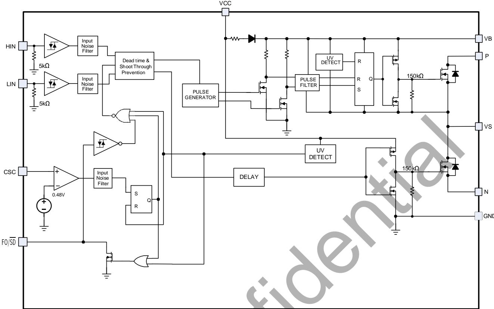  
图 3. LKS1M36003 内部结构框图

## 功能描述

## 1、输入输出真值表

<table><tr><td>HIN</td><td>LIN</td><td>输出(U/V/W)</td><td>描述</td></tr><tr><td>0</td><td>0</td><td>Hi-Z</td><td>高阻态,高低侧均关断</td></tr><tr><td>0</td><td>1</td><td>0</td><td>低侧导通,高侧关断</td></tr><tr><td>1</td><td>0</td><td> $V_P$ </td><td>高侧导通,低侧关断</td></tr><tr><td>1</td><td>1</td><td>Hi-Z</td><td>禁止输入同时为高,低侧和高侧均关断</td></tr><tr><td>开路</td><td>开路</td><td>Hi-Z</td><td>信号输入内部下拉5kΩ电阻,高低侧均关断</td></tr></table>

## 2、开关过程定义

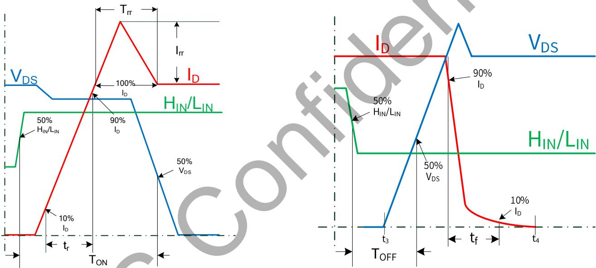  
图 4. 开关过程时间定义

## 3、过流保护功能

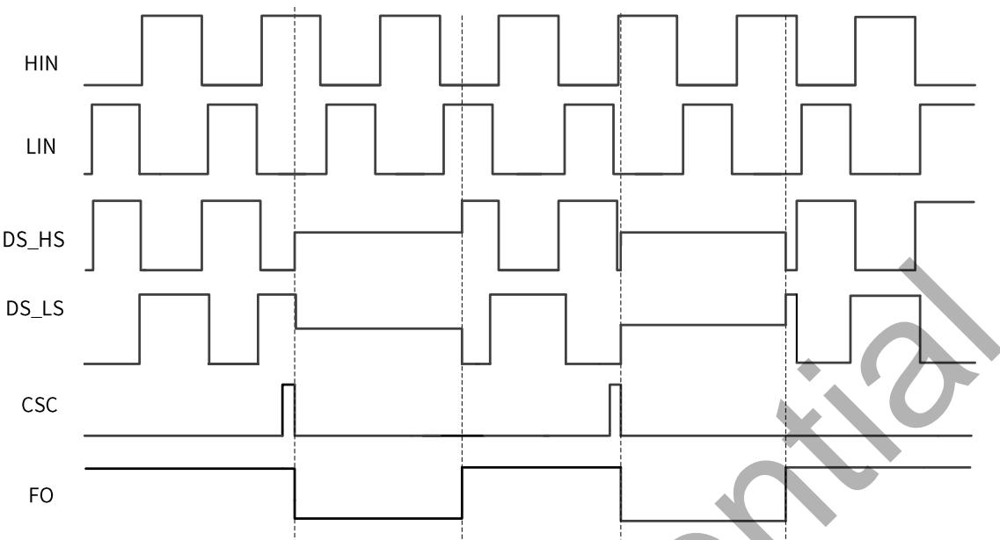  
图 5. 过流保护功能

HIN：高侧驱动输入信号

LIN：低侧驱动输入信号

DS\_HS：高侧 MOS DS 电压

DS\_LS：低侧 MOS DS 电压

CSC：过流保护检测信号

FO：故障检测输出信号

CSC引脚用于检测采样电阻两端电压，当CSC引脚上电压超过0.48V时，LKS1M36003会将FO/SD引脚拉低并保持65uS时间后恢复工作。在FO/SD持续为低期间，无论LIN与HIN引脚输入什么信号，模块高低侧输出均保持关闭状态。如果不需要使用硬件过流保护功能，则将CSC引脚就近接至模块的GND端，防止噪声干扰。

## 4、外部信号 Shutdown

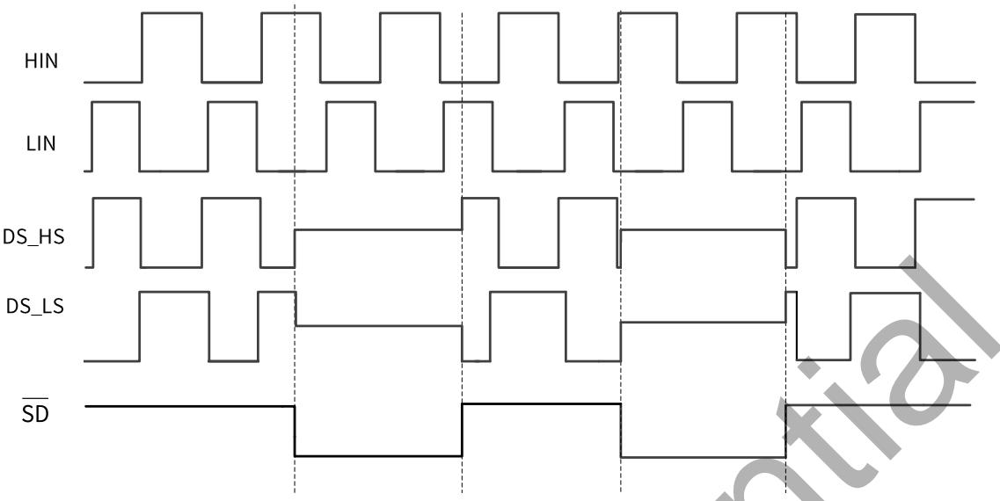  
图 6. 外部信号 Shutdown 功能

HIN：高侧驱动输入信号

LIN：低侧驱动输入信号

DS\_HS：高侧 MOS DS 电压

DS\_LS：低侧 MOS DS 电压

SD：外部 Shutdown 信号

## 5、过温保护功能

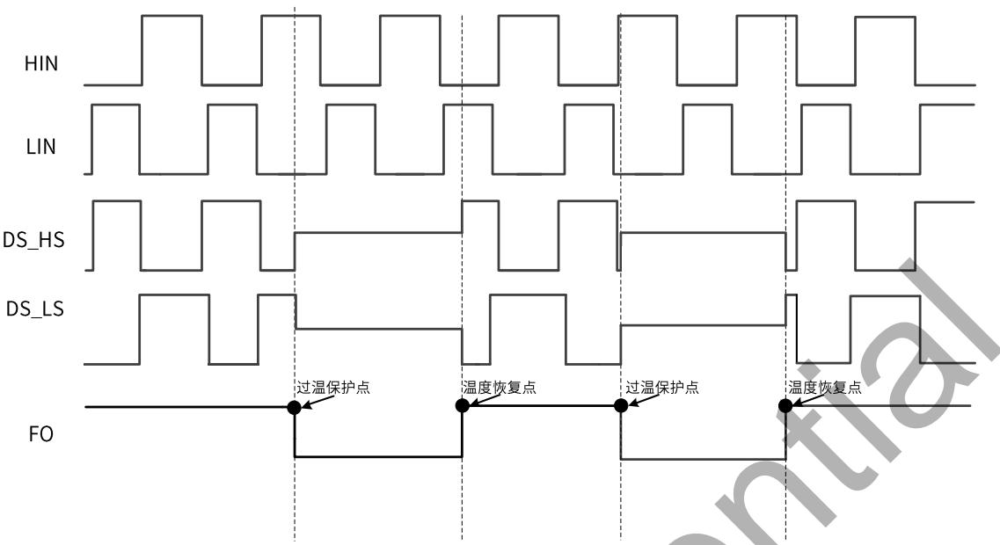  
图7. 过温保护功能

HIN：高侧驱动输入信号

LIN：低侧驱动输入信号

DS\_HS：高侧 MOS DS 电压

DS\_LS：低侧 MOS DS 电压

FO：故障检测输出信号

LKS1M36003内部集成了过温保护关断电路，触发关断功能的逻辑时序如图7所示。触发保护时(例：输出过载导致的耗散功率增加，芯片所处的环境温度上升等)，芯片同时关断高侧和低侧的功率管输出。当IPM工作时的温度达到热关断电路的触发温度(内部 HVIC 触发140C)时，热关断电路被激活，输出被关断；当HVIC电路检测到温度下降到释放温度國值(110C)或更低的温度时，IPM的输出关断状态被解除，输出会根据输入控制逻辑信号正常工作。

## 封装信息

COMMON DIMENSIONS (UNITS OF MEASURE=MILLIMETER)  
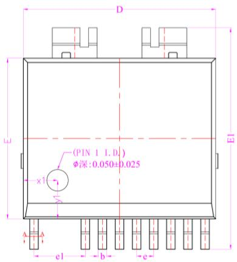

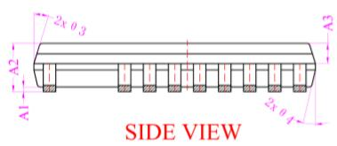

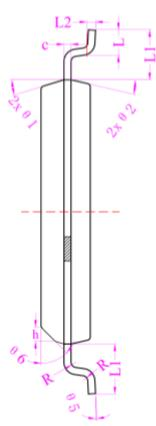  
SIDE VIEW

ESOP13封装外形尺寸  
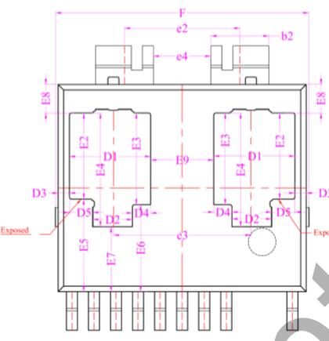  
BOTTOM VIEW  
BASE METAL  
WITH PLATING

<table><tr><td>SYMBOL</td><td>MIN</td><td>NOM</td><td>MAX</td></tr><tr><td>A1</td><td>0.020</td><td>-</td><td>0.120</td></tr><tr><td>A2</td><td>1.370</td><td>-</td><td>1.570</td></tr><tr><td>A3</td><td>0.600</td><td>0.650</td><td>0.700</td></tr><tr><td>b</td><td>0.380</td><td>-</td><td>0.460</td></tr><tr><td>b1</td><td>0.370</td><td>0.400</td><td>0.430</td></tr><tr><td>b2</td><td>2.050</td><td>2.100</td><td>2.150</td></tr><tr><td>c</td><td>0.193</td><td>-</td><td>0.253</td></tr><tr><td>c1</td><td>0.170</td><td>0.203</td><td>0.230</td></tr><tr><td>D</td><td>8.900</td><td>9.000</td><td>9.100</td></tr><tr><td>D1</td><td>2.845</td><td>2.945</td><td>3.045</td></tr><tr><td>D2</td><td>1.340</td><td>1.440</td><td>1.540</td></tr><tr><td>D3</td><td>0.310</td><td>0.410</td><td>0.510</td></tr><tr><td>D4</td><td>0.560</td><td>0.660</td><td>0.760</td></tr><tr><td>D5</td><td>0.745</td><td>0.845</td><td>0.945</td></tr><tr><td>E</td><td>7.400</td><td>7.500</td><td>7.600</td></tr><tr><td>E1</td><td>10.240</td><td>10.340</td><td>10.440</td></tr><tr><td>E2</td><td>3.018</td><td>3.118</td><td>3.218</td></tr><tr><td>E3</td><td>3.218</td><td>3.318</td><td>3.418</td></tr><tr><td>E4</td><td>4.018</td><td>4.118</td><td>4.218</td></tr><tr><td>E5</td><td>3.250</td><td>3.350</td><td>3.450</td></tr><tr><td>E6</td><td>3.050</td><td>3.150</td><td>3.250</td></tr><tr><td>E7</td><td>2.250</td><td>2.350</td><td>2.450</td></tr><tr><td>E8</td><td>0.932</td><td>1.032</td><td>1.132</td></tr><tr><td>E9</td><td>2.240</td><td>2.290</td><td>2.340</td></tr><tr><td>e</td><td>0.750</td><td>0.800</td><td>0.850</td></tr><tr><td>e1</td><td>2.350</td><td>2.400</td><td>2.450</td></tr><tr><td>e2</td><td>4.140</td><td>4.190</td><td>4.240</td></tr><tr><td>e3</td><td>4.940</td><td>4.990</td><td>5.040</td></tr><tr><td>e4</td><td>2.040</td><td>2.090</td><td>2.140</td></tr><tr><td>e5</td><td>1.950</td><td>2.000</td><td>2.050</td></tr><tr><td>e6</td><td>-0.020</td><td>0.030</td><td>0.080</td></tr><tr><td>F</td><td>9.000</td><td>-</td><td>9.400</td></tr><tr><td>L</td><td>0.620</td><td>0.720</td><td>0.820</td></tr><tr><td>L1</td><td>1.320</td><td>1.420</td><td>1.520</td></tr><tr><td></td><td colspan="3">两边L1差值: 0.15 MAX</td></tr><tr><td>L2</td><td colspan="3">0.25 BSC</td></tr><tr><td>R</td><td>0.10</td><td>-</td><td>-</td></tr><tr><td>h</td><td>0.35</td><td>0.40</td><td>0.45</td></tr><tr><td>θ1</td><td>15°</td><td>17°</td><td>19°</td></tr><tr><td>θ2</td><td>11°</td><td>13°</td><td>15°</td></tr><tr><td>θ3</td><td>15°</td><td>17°</td><td>19°</td></tr><tr><td>θ4</td><td>11°</td><td>13°</td><td>15°</td></tr><tr><td>θ5</td><td>0°</td><td>3°</td><td>6°</td></tr><tr><td>φ</td><td>0.90</td><td>1.00</td><td>1.10</td></tr><tr><td>x1</td><td>1.50</td><td>1.60</td><td>1.70</td></tr><tr><td>y1</td><td>1.70</td><td>1.80</td><td>1.90</td></tr></table>

## 版本信息

<table><tr><td>版本</td><td>日期</td><td>记录</td></tr><tr><td>Rev.0.1</td><td>2025/02</td><td>Preliminary</td></tr></table>

## 免责声明

晶丰明源尽力确保本产品规格书内容的准确和可靠，但是保留在没有通知的情况下，修改规格书内容的权利。

本产品规格书未包含任何针对晶丰明源或第三方所有的知识产权的授权。针对本产品规格书所记载的信息，晶丰明源不做任何明示或暗示的保证，包括但不限于对规格书内容的准确性、商业上的适销性、特定目的的适用性或者不侵犯晶丰明源或任何第三人知识产权做任何明示或暗示保证，晶丰明源也不就因本规格书本身及其使用有关的偶然或必然损失承担任何责任。

## 电子器件报废说明

该产品在生命周期结束后，由客户按照一般电子产品的报废流程进行处理。