## LKS1M36003产品介绍

上海晶丰明源半导体股份有限公司智慧家居事业部高压驱动产品线2024.12.

## ◆引脚定义

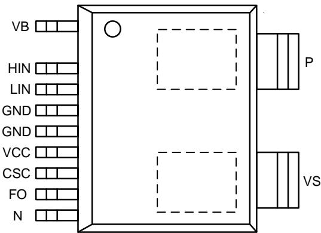

## ◆功能框图

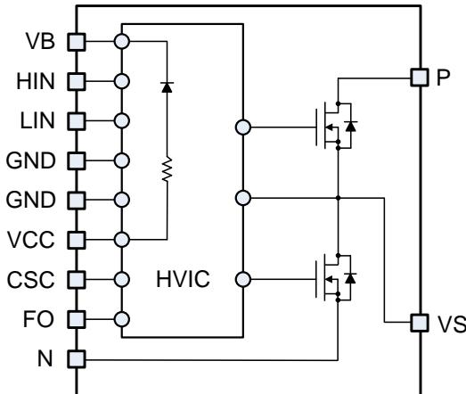

## ◆特征

 集成600V/3.5A FR-MOS,BV\_min＞650V@25℃

 短路时间＞5uS,@VDS=400V,VCC/VB=15V

 集成自举二极管及100Ω限流电阻

 VS抗负压能力＞21V@0.5-1us。

 高低压电气间隙＞2mm

 HIN、LIN内置5KΩ下拉电阻，内置互锁逻辑防直通

 过温保护

 硬件过流保护

 FO故障指示输出和SD停机功能

 ESD(HBM)，控制器＞2KV，其它＞4KV

<table><tr><td>对比类别</td><td>SIM6891M(三星IPM)</td><td>ECN30622F(日立IPM)</td><td>LAS1M0261(晶艺IPM)</td><td>LKS1M36003(晶丰IPM)</td></tr><tr><td>内置自举二极管</td><td>有分立器件合封</td><td>有电荷泵结构</td><td>有集成在同一晶圆上</td><td>有集成在同一晶圆上</td></tr><tr><td>电源欠压保护</td><td>有,高低侧均集成</td><td>有,高低侧均集成</td><td>有,高低侧均集成</td><td>有,高低侧均集成</td></tr><tr><td>防直通保护</td><td>无靠过流检测保护</td><td>无靠过流检测保护</td><td>有内部集成防直通逻辑</td><td>有内部集成防直通逻辑</td></tr><tr><td>硬件过流保护</td><td>有(集成)</td><td>有(集成)</td><td>有(集成)</td><td>有(集成)</td></tr><tr><td>温度保护功能</td><td>有(集成)</td><td>有(集成)</td><td>有(集成)</td><td>有(集成)</td></tr><tr><td>故障信号输出</td><td>有(集成)</td><td>有(集成)</td><td>有(集成)</td><td>有(集成)</td></tr><tr><td>外部使能控制功能</td><td>无</td><td>无</td><td>有(集成)</td><td>有(集成)</td></tr></table>

## 3.驱动IC电气性能对比

<table><tr><td>对比类别</td><td>SIM6891M(三星IPM)</td><td>ECN30622F(日立IPM)</td><td>LAS1M0261(晶艺IPM)</td><td>LKS1M36003(晶丰IPM)</td></tr><tr><td>电源供电最大额定电压</td><td>20</td><td>18</td><td>20</td><td>20</td></tr><tr><td>最大输入电压(HIN/LIN)</td><td>7</td><td>18</td><td>20</td><td>20</td></tr><tr><td>过流管脚最大耐压(V)</td><td>7</td><td>18</td><td>20</td><td>20</td></tr><tr><td>故障管脚最大耐压(V)</td><td>7</td><td>18</td><td>20</td><td>20</td></tr><tr><td>VCC最大静态电流(uA)</td><td>2000</td><td>10000</td><td>170</td><td>300</td></tr><tr><td>BST-SW最大静态电流(uA)</td><td>170</td><td>NA</td><td>45</td><td>90</td></tr><tr><td>自举二极管压降(V)</td><td>1</td><td>0.8</td><td>0.5</td><td>0.6</td></tr><tr><td>自举限流电阻(Ω)</td><td>60</td><td>不涉及</td><td>100</td><td>100</td></tr><tr><td>对比类别</td><td>SIM6891M(三垦IPM)</td><td>ECN30622F(日立IPM)</td><td>LAS1M0261(晶艺IPM)</td><td>LKS1M36003(晶丰IPM)</td></tr><tr><td>功率管类型</td><td>FR-MOSFET</td><td>IGBT</td><td>FR-MOSFET</td><td>FR-MOSFET</td></tr><tr><td>额定耐压(V)</td><td>600</td><td>600</td><td>600</td><td>600</td></tr><tr><td>额定持续电流(A)</td><td>2.5</td><td>2</td><td>1.5</td><td>3</td></tr><tr><td>额定脉冲电流(A)</td><td>3.75</td><td>3</td><td>3</td><td>6</td></tr><tr><td>导通阻抗(Ω)</td><td>2.0</td><td>不涉及</td><td>3.2</td><td>2.8</td></tr><tr><td>二极管导通压降(V)</td><td>1.0</td><td>1.6</td><td>0.9</td><td>0.9</td></tr><tr><td>反向恢复时间(ns)</td><td>130</td><td>NA,未提供</td><td>100</td><td>95</td></tr><tr><td>开启损耗(uJ)@25°C&amp;1.5A</td><td>160</td><td>NA,未提供</td><td>125</td><td>120</td></tr><tr><td>关断损耗(uJ)@25°C&amp;1.5A</td><td>155</td><td>NA,未提供</td><td>130</td><td>130</td></tr><tr><td>对比类别</td><td>SIM6891M(三星IPM)</td><td>ECN30622F(日立IPM)</td><td>LAS1M0261(晶艺IPM)</td><td>LKS1M36003(晶丰IPM)</td></tr><tr><td>封装类型</td><td>DIP40</td><td>SOP26</td><td>LasSOP10</td><td>ESOP13</td></tr><tr><td>器件外观</td><td>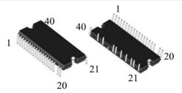</td><td>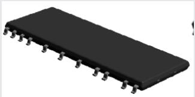</td><td>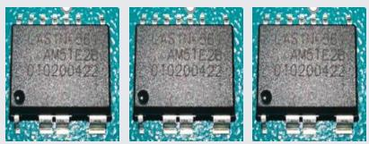</td><td>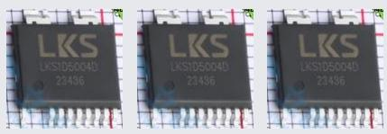</td></tr><tr><td>占板面积( $mm^2$ )</td><td>587.81</td><td>372.96</td><td>309.00</td><td>279.5</td></tr><tr><td>高低压最小间隙</td><td>3</td><td>3</td><td>2</td><td>2</td></tr><tr><td>PCB板布局适应性</td><td>差</td><td>差</td><td>强</td><td>强</td></tr><tr><td>生产效率</td><td>低,手插</td><td>高,机插</td><td>高,机插</td><td>高,机插</td></tr><tr><td>散热片</td><td>有</td><td>有</td><td>无</td><td>无</td></tr><tr><td>外围器件数(颗)</td><td>13</td><td>18</td><td>15</td><td>15</td></tr></table>

测试数据

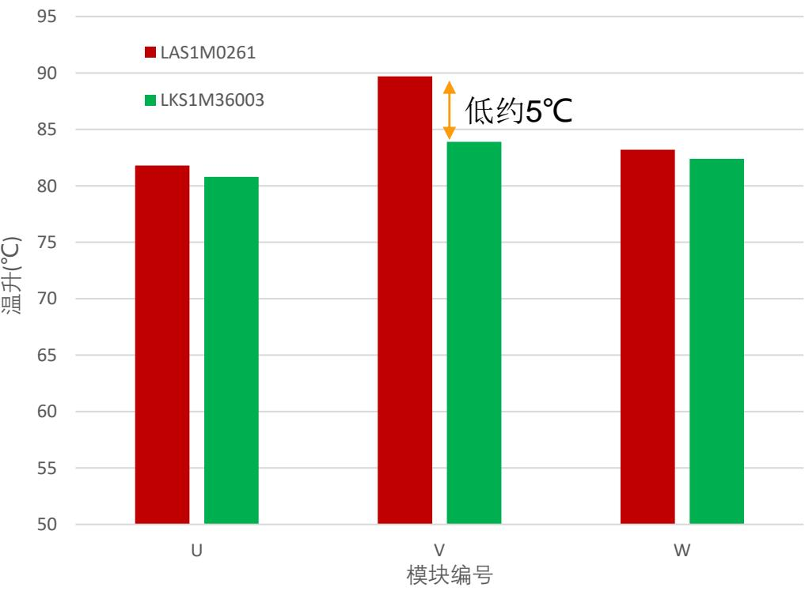

## 测试条件

测试模式：220VAC，1800RPM，84W，18kHz

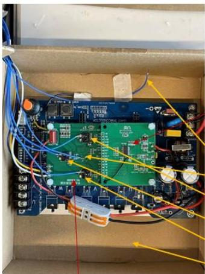  
外驱板主控板盒内环境温度PCB表面温度IPM3表面温度IPM2表面温度IPM1表面温度密闭纸盒环境  
半桥模块测试板-半桥模块规格LKS1M36003

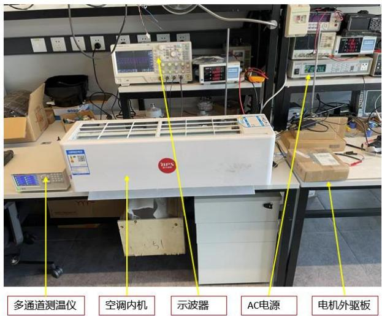

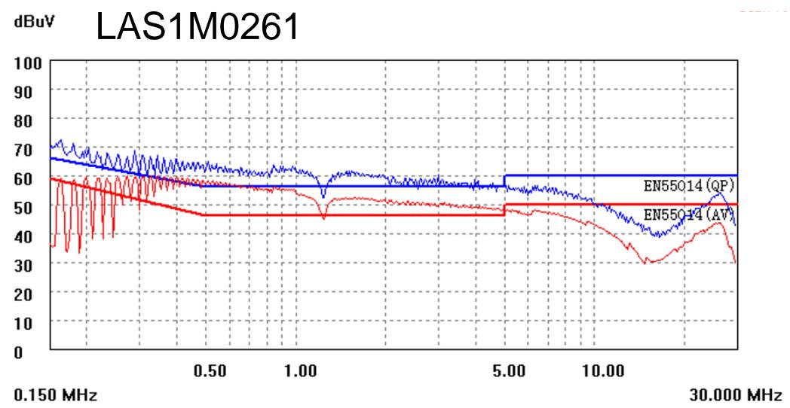

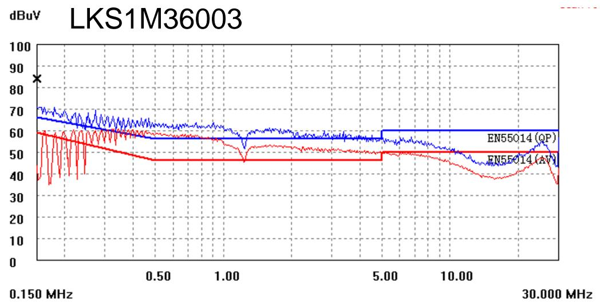

dBuv LAS1M0261  
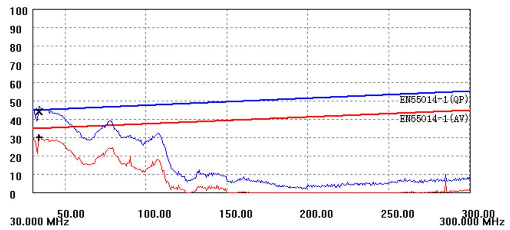

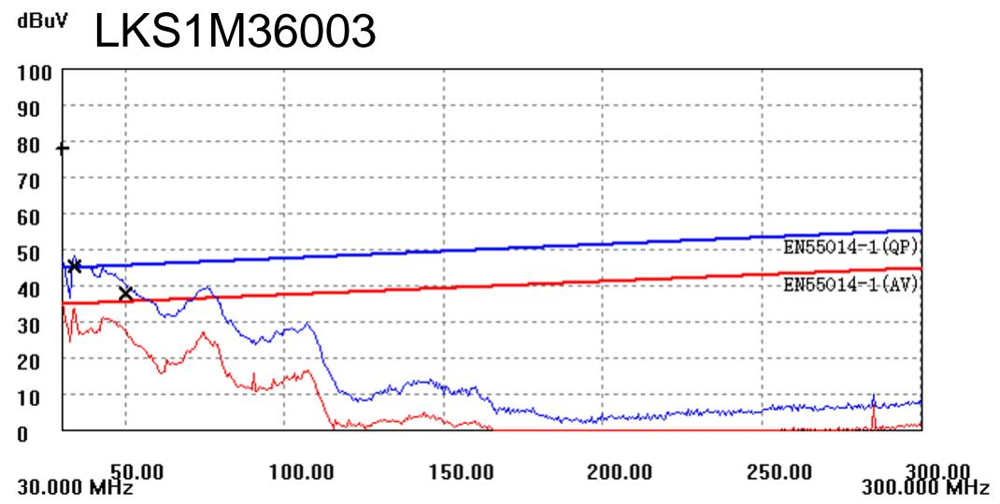

<table><tr><td>实验名称</td><td>测试条件</td></tr><tr><td>HTRB(高温反偏)</td><td>150°C,0.8*VR, 1000hrs</td></tr><tr><td>HTGB(高温栅极反偏)</td><td>150°C,Vce=0V,Vgs max, 1000Hrs</td></tr><tr><td>H3TRB(高温高湿反偏)</td><td>85°C/RH85%,VR Bias,1000hrs</td></tr><tr><td>TCT(高低温循环)</td><td>(-40°C~125°C), 500/1000 cycle</td></tr><tr><td>IOL/Power Cycle(功率循环)</td><td>ΔTj=100°C, 15000cycle,2min/on,2min/off</td></tr><tr><td>HTOL(高温工作寿命)</td><td>125°C,Vmax, 1000hrs</td></tr><tr><td>HTSL(高温存储)</td><td>150°C,1000hrs</td></tr><tr><td>NSS(盐雾)</td><td>5%NaCl, 1 ~ 2ml/80cm2.h, 48hrs</td></tr><tr><td>LTSL(低温存储)</td><td>-40°C,1000hrs</td></tr><tr><td>ESD(静电)</td><td>HBM, 控制器 &gt;2KV, 其它 &gt;4KV</td></tr></table>

## 成长超越 一起创未来