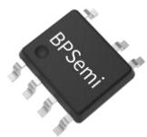
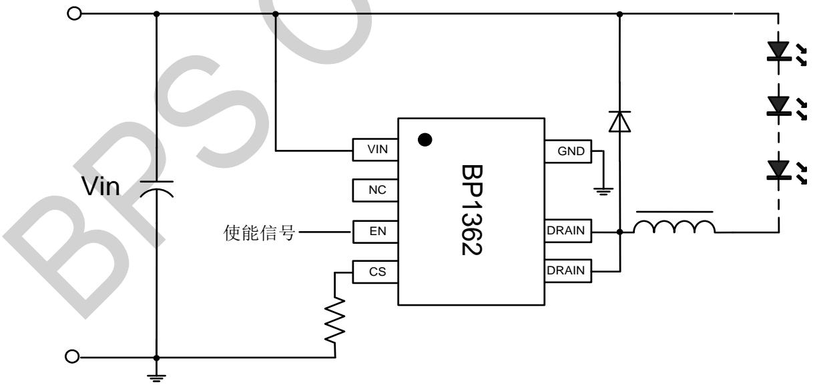
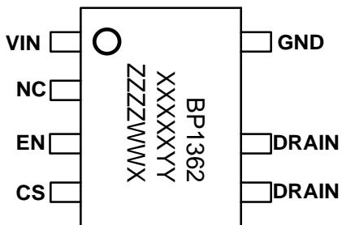
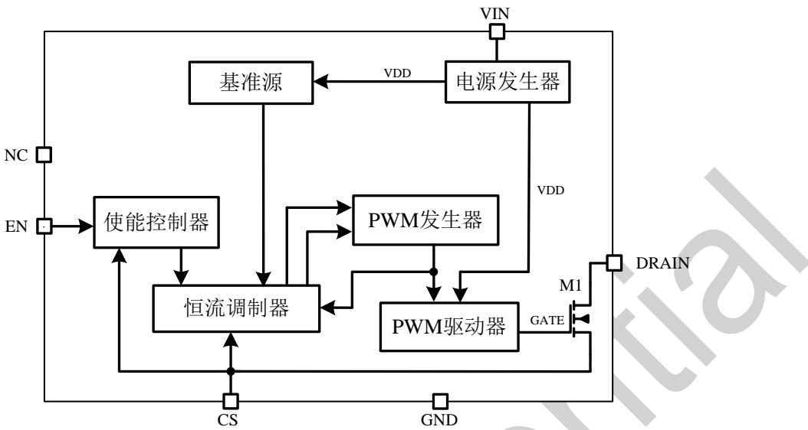
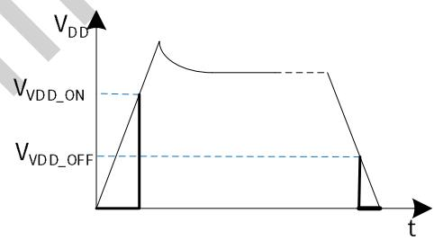
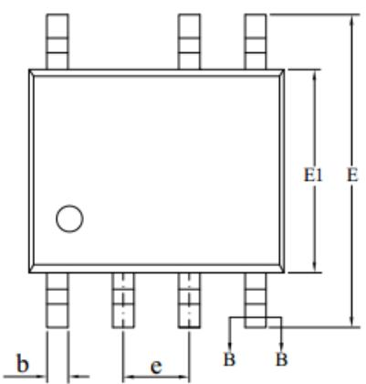
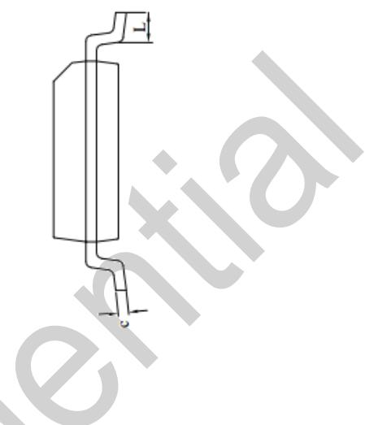
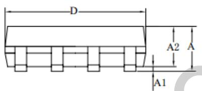
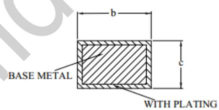

## BP1362 DC-DC 降压型 LED 恒流驱动芯片

## 概述

BP1362 是一款带有使能控制的 LED 恒流驱动芯片，适用于降压式非隔离应用场合。BP1362 工作在电感电流连续模式，相比电流断续模式，峰值电流更小，有效电流更小，因此器件损耗更低，使系统能够有更高的效率。BP1362 采用了先进的输出恒流技术，保证输出电流不随电感量和 LED 工作电压的变化而变化。BP1362 集成了输入启动和供电功能，无需启动电阻或供电绕组。

BP1362 还集成了完善的保护功能，包括输入电流的逐周期过流保护，电流检测管脚的开路保护，输出短路锁死保护，输出电流过温调节功能等。

SOP7 封装

■ CCM 工作模式

■ 前馈电流采样，不烧灯珠

■ 过温电流折返功能

■ 集成输入启动、供电功能

■ 集成前沿导通消隐功能（LEB）

■ 集成电感补偿功能

■ 超宽输出电压范围

■ 内置 100V MOS

■ 采用 SOP-7 封装

■ 保护功能

逐周期峰值电流保护

CS 电阻开路保护

芯片供电欠压保护

输出短路保护

## 应用领域

应急照明

■ 其他 DC-DC LED 照明

## 特点

## 典型应用

  
图 1 BP1362 典型 Buck 应用电路

WW: 周号

## 定购信息

<table><tr><td>定购型号</td><td>封装</td><td>包装形式</td><td>打印</td></tr><tr><td>BP1362</td><td>SOP7</td><td>卷盘4,000/盘</td><td>BP1362XXXXYYZZZZWWX</td></tr></table>

## 管脚封装

  
BP1362: 产品型号  
XXXXYYY: 批次号  
ZZZZ: 主芯、副芯版本  
图 2 SOP7 管脚封装图

X: 特殊标志

## 管脚描述

<table><tr><td>管脚号</td><td>管脚名称</td><td>描述</td></tr><tr><td>1</td><td>VIN</td><td>输入脚</td></tr><tr><td>2</td><td>NC</td><td>空脚</td></tr><tr><td>3</td><td>EN</td><td>使能脚,高电平使能</td></tr><tr><td>4</td><td>CS</td><td>电流检测脚</td></tr><tr><td>5、6</td><td>DRAIN</td><td>内部 MOSFET 的 DRAIN 端</td></tr><tr><td>7</td><td>GND</td><td>芯片地</td></tr></table>

## 极限参数(注1)

<table><tr><td>符号</td><td>参数</td><td>参数范围</td><td>单位</td></tr><tr><td> $V_{VIN}$ </td><td>输入电压</td><td>-0.3~100</td><td>V</td></tr><tr><td> $V_{DRAIN}$ </td><td>内部MOSFET漏极电压</td><td>-0.3~100</td><td>V</td></tr><tr><td> $V_{EN}$ </td><td>使能脚电压</td><td>-0.3~7</td><td>V</td></tr><tr><td> $V_{CS}$ </td><td>电流采样脚电压</td><td>-0.3~7</td><td>V</td></tr><tr><td> $P_{DMAX}$ </td><td>功耗 $^{(注2)}$ </td><td>0.45</td><td>W</td></tr><tr><td> $\theta_{JA\_}$ </td><td>SOP封装结到环境的热阻 $^{(注3)}$ </td><td>145</td><td>°C/W</td></tr><tr><td> $T_J$ </td><td>工作结温范围</td><td>-40 to 150</td><td>°C</td></tr><tr><td> $T_{STG}$ </td><td>储存温度范围</td><td>-55 to 150</td><td>°C</td></tr><tr><td>ESD</td><td>人体模型 ESD(注 4)</td><td>1</td><td>kV</td></tr></table>

注1：最大极限值是指超出该工作范围，芯片有可能损坏。推荐工作范围是指在该范围内，器件功能正常，但并不完全保证满足个别性能指标。电气参数定义了器件在工作范围内并且在保证特定性能指标的测试条件下的直流和交流电参数规范。对于未给定上下限值的参数，该规范不予保证其精度，但其典型值合理反映了器件性能。

注2：温度升高最大功耗一定会减小，这也是由 $T_{\mathrm{JMAX}}, \theta_{\mathrm{JA}}$ 和环境温度 $T_{\mathrm{A}}$ 所决定的。最大允许功耗为 $P_{\mathrm{DMAX}} = (T_{\mathrm{JMAX}} - T_{\mathrm{A}}) / \theta_{\mathrm{JA}}$ 或是极限范围给出的数字中比较低的那个值。

注3：1平方英寸双层PCB板，按照JEDEC标准测试。

注 4：按照 JEDEC 标准测试,100pF 电容通过 1.5KΩ 电阻放电。

电气参数(注5)（无特别说明情况下, $T_{A}=25^{\circ}C$ ）

<table><tr><td>符号</td><td>描述</td><td>条件</td><td>最小值</td><td>典型值</td><td>最大值</td><td>单位</td></tr><tr><td colspan="7">供电部分</td></tr><tr><td> $V_{\text{VDD_ON}}$ </td><td> $V_{\text{DD}}$ 启动电压</td><td>从低往高扫描 $V_{\text{DD}}$ 电压</td><td></td><td>6</td><td></td><td>V</td></tr><tr><td> $V_{\text{VDD_OFF}}$ </td><td> $V_{\text{DD}}$ 欠压保护电压</td><td>从高往低扫描 $V_{\text{DD}}$ 电压</td><td></td><td>3</td><td></td><td>V</td></tr><tr><td> $I_{\text{OP}}$ </td><td> $V_{\text{DD}}$ 工作电流</td><td>内部驱动浮空</td><td></td><td>160</td><td>220</td><td>μA</td></tr><tr><td colspan="7">使能部分</td></tr><tr><td> $V_{\text{H_EN}}$ </td><td>EN高电平使能</td><td></td><td>4</td><td></td><td>7</td><td>V</td></tr><tr><td> $V_{\text{L_EN}}$ </td><td>EN低电平除能</td><td></td><td>0</td><td></td><td>1.5</td><td>V</td></tr><tr><td> $V_{\text{OPEN_EN}}$ </td><td>EN悬空电压</td><td></td><td>6</td><td>6.5</td><td>7</td><td>V</td></tr><tr><td> $I_{\text{EN}}$ </td><td>EN上拉电流</td><td></td><td></td><td>50</td><td></td><td>μA</td></tr><tr><td> $T_{\text{start\_up}}$ </td><td>开机自检灯亮延迟时间</td><td></td><td></td><td>80</td><td></td><td>ms</td></tr><tr><td colspan="7">振荡器</td></tr><tr><td> $f_{\text{S\_MAX}}$ </td><td>最大开关频率</td><td></td><td></td><td>150</td><td></td><td>kHz</td></tr><tr><td>Δf</td><td>频率抖动范围</td><td></td><td></td><td>±3</td><td></td><td>%</td></tr><tr><td colspan="7">采样和时序</td></tr><tr><td> $V_{\text{TH_H}}$ </td><td>稳态CS脚电压峰值</td><td></td><td>525</td><td>540</td><td>555</td><td>mV</td></tr><tr><td> $V_{\text{TH_L}}$ </td><td>稳态CS脚电压谷值</td><td></td><td>130</td><td>135</td><td>140</td><td>mV</td></tr><tr><td> $t_{\text{LEB}}$ </td><td>前沿消隐时间</td><td></td><td></td><td>600</td><td></td><td>ns</td></tr><tr><td> $T_{\text{dem\_MIN}}$ </td><td>最小消磁时间</td><td></td><td></td><td>3</td><td></td><td>μs</td></tr><tr><td> $T_{\text{dem\_MAX}}$ </td><td>最大消磁时间</td><td></td><td></td><td>43</td><td></td><td>μs</td></tr><tr><td> $T_{\text{ON\_MIN}}$ </td><td>最小导通时间</td><td></td><td></td><td>1</td><td></td><td>μs</td></tr><tr><td> $t_{\text{SS}}$ </td><td>软启动时间</td><td></td><td></td><td>9</td><td></td><td>ms</td></tr><tr><td colspan="7">功率管</td></tr><tr><td> $R_{\text{DS_ON}}$ </td><td>功率管导通阻抗</td><td> $I_{\text{DS}}=0.2A,V_{\text{GS}}=6.5V$ </td><td></td><td></td><td>550</td><td>mΩ</td></tr><tr><td> $I_{\text{DSS}}$ </td><td>功率管关断漏电流</td><td> $V_{\text{DS}}=100V,V_{\text{GS}}=0V$ </td><td></td><td></td><td>1</td><td>μA</td></tr><tr><td> $BV_{\text{DSS}}$ </td><td>功率管的击穿电压</td><td></td><td>100</td><td></td><td></td><td>V</td></tr><tr><td colspan="7">过热保护</td></tr><tr><td> $T_{\text{OTP}}$ </td><td>过温保护阈值</td><td></td><td></td><td>130</td><td></td><td>°C</td></tr></table>

注5：规格书的最小、最大规范范围由测试保证，典型值由设计、测试或统计分析保证。

## 内部结构框图

  
图 3 BP1362 系列内部框图

## 功能描述

BP1362 是一款带有使能控制的 LED 恒流驱动芯片，适用于降压式非隔离应用场合。BP1362 工作在电感电流连续模式，相比电流断续模式，峰值电流更小，有效电流更小，因此器件损耗更低，使系统能够有更高的效率。BP1362 采用了先进的输出恒流技术，保证输出电流不随电感量和 LED 工作电压的变化而变化，实现优异的负载调整率。

## 启动和供电

BP1362 通过 VIN 脚连接输入电压，内部的输入模块提供启动电流和工作电流，并无需 VDD 电容。在启动时，芯片的 VDD 首先通过输入模块由输入电压充电，当其上的电压达到阈值 $V_{VDD\_ON}$ 后，芯片启动，并开始输出脉冲驱动内部功率开关。在启动后，由于芯片自身的耗电非常少，可直接通过输入模块供电，使 VDD 电压维持在某一值上，保证 IC 正常工作。

## 欠压锁定

BP1362 内部有一个欠压锁定迟滞比较器，其迟滞曲线如下图所示。当 VDD 电压从低于 $V_{VDD\_OFF}$ 往上升高到 $V_{VDD\_ON}$ 时，芯片才开始启动；而当 VDD 电压从高于 $V_{VDD\_ON}$ 往下降低到 $V_{VDD\_OFF}$ 时才锁定，因此形成图中所示的迟滞窗口。

## 软启动

BP1362 提供软启动功能。每次启动之后，芯片从最低工作频率逐渐建立到最终恒流所需的开关频率。整个软启动过程大约在 9mS 左右。软启动可以抑制启动时的电流过冲，以降低 LED 在启动时承受的应力，从而提升 LED 的寿命。另一方面，软启动也能抑制启动时内部 MOSFET 漏极的电压过冲，从而增加系统可靠性。

## 前沿消隐（LEB）

BP1362 内部集成了前沿消隐功能。在开关管开通前的 600nS 内，CS 引脚的干扰信号被屏蔽，从而可以很好地防止内部开关管误触发关断，保证系统稳定工作。

## 恒流操作

BP1362 通过恒流驱动技术，可以使输出电压在极宽的范围内恒流。而且可以确保输出电流和变压器感量无关，从而加大了系统设计的容差。

## 过温调节

BP1362 集成了过温调节功能，在驱动电源过热时逐渐减小输出电流，从而控制输出功率和温升，使电源温度保持在设定值，以提高系统的可靠性。芯片内部设定过热调节温度点为 $130^{\circ}$ C。

## CS 开路保护

BP1362 集成了 CS 引脚的开路保护功能，当芯片的 CS 引脚开路，开关管会关断，进入自动重启保护模式。当错误条件消失，系统自动恢复正常工作状态。

## 使能控制

在初次开机时，会有约 80ms 的开机自检，自检时间内灯亮有输出，之后无输出并处于待机状态。

BP1362 的 EN 脚输入高低电平可实现 on/off 控制功能，也可输入 PWM 信号实现调光功能，建议调光频率 1kHz 以下。为了实现更高的调光线性度，建议增加输出电解电容。

## 输出短路保护

BP1362 具有输出短路保护功能。一旦输出短路，当 CS 脚实际峰值电压连续 16 个周期超过 680mV 时，芯片就会关断内部开关，并进入锁定模式，此时系统功耗极低，保证了芯片的可靠性。当短路状态消失后，需要母线电压完全掉电，并再次上电后，系统才会恢复正常工作状态。

## 应用设计

## CS 取样电阻

BP1362 是一款专用于 LED 非隔离降压式电源芯片，系统工作在电流连续开关模式，芯片通过连接芯片内部的 CS 端，逐周期地检测电感上的峰值电流和谷值电流，并与内部的基准电压进行比较。芯片通过先进的恒流控制技术，使稳态后每周期的峰值电流和谷值电流都保持恒定，从而恒定输出电流。

电感峰值电流的计算公式： $I_{pk} = \frac{V_{TH\_H}}{R_{cs}}$

电感谷值电流的计算公式： $I_{vl} = \frac{V_{TH\_L}}{R_{cs}}$ ， $R_{cs}$ 为CS取样电阻阻值，单位 $\Omega$ 。

电源额定输出电流为： $I_{led} = 0.5 * (I_{pk} + I_{vl})$

由以上公式可以得出： $I_{led} = \frac{V_{TH\_H} + V_{TH\_L}}{2*R_{cs}}$

## 功率电感

BP1362 是采用 Buck 电路工作模式，系统上电后内部功率管导通，电感电流逐渐上升，当电感电流上升到 $I_{pk}$ 时，内部功率管关断。此时电感开始消磁，当电感电流下降到 $I_{vl}$ 时，退磁结束，内部功率管又开始导通，周而复始。芯片内部对电感的最小消磁时间做了限定，其典型值为 3uS，即正常工作时，电感的消磁时间不得低于 3uS。L 的计算公式如下： $L = \frac{V_{out} * T_{dem}}{I_{pk} - I_{vl}}$

L 为电感量， $V_{out}$ 为额定输出电压， $T_{dem}$ 为设计者设定的消磁时间(推荐取值 6\~10 uS 之间)。

## 工作频率

内部功率管的导通时间如下： $T_{on}=\frac{L*(I_{pk}-I_{vl})}{V_{in}-V_{out}}$

其中，L 为电感的电感量， $V_{in}$ 是输入电压， $V_{out}$ 是输出 LED 的正向压降。

当内部功率管关断后，电感上电流从峰值开始逐渐下降，当电感上电流下降到 $I_{\mathrm{VI}}$ 时，内部功率管开启。

功率管的关断时间如下： $T_{dem} = \frac{L*(I_{pk} - I_{vl})}{V_{out}}$

频率的计算公式如下： $f = \frac{(V_{in} - V_{out}) * V_{out}}{V_{in} * L * (I_{pk} - I_{vl})}$

其中 f 为系统的工作频率，当 L, $V_{out}$ , $I_{pk}$ , $I_{vl}$ 一定时，工作频率随 $V_{in}$ 的降低而降低。所以设计系统工作频率，在最小 $V_{in}$ 时，不能让系统进入音频范围内(一般不要低于 22kHz)。在最高 $V_{in}$ 时不能使系统的工作频率太高，否则开关损耗过大会导致芯片发热严重，建议最高工作频率小于 120kHz。

## 电感匝数

当以上计算,得出 L 和 $I_{pk}$ 后,即可计算出电感的最少匝数: $N > \frac{L^{*}I_{pk}}{B_{m}*A_{e}}$

N 为电感线圈匝数, Ae 为变压器磁芯的等效截面积, Bm 的取值需参考磁芯材质而定, 以 PC40 材质为例, 建议 Bm 取值小于 0.35T。

## 最短消磁时间与最长消磁时间

BP1362 设置了最短消磁时间和最长消磁时间，当电感过小或输出电压过高时，电感的消磁时间就有可能小于芯片的最短消磁时间，导致输出电流降低；当电感过大或输出电压过低时，电感的消磁时间就有可能大于芯片的最长消磁时间，导致系统工作异常；因此选取一个合理的电感值将非常重要，需要设计者重点考虑。需特别指出，当电源正常工作时，其设计的最小消磁时间一定不能大于芯片的最大消磁时间，并且留有足够的余量，否则电源将不能正常工作。由于该系统架构是降压式，所以输入最小直流电压不能低于输出电压，否则输出电流有跌落减小的风险。

## PCB Layout 指南

在设计 BP1362 应用 PCB 时，需要遵循以下建议：

1) 电感的充电回路和放电回路面积都要尽可能的小。

2) 芯片的 DRAIN(Pin5、Pin6)所连接的铜皮面积要尽量大，以便芯片良好散热。但是 DRAIN 脚也为动点（相对母线地电压），在满足散热的条件下铺铜面积应尽量小。

3) 芯片的 CS 电阻要尽量靠近芯片，并且 CS 电阻到芯片

脚的连线要尽量短。

# BPS Confidential

WITH PLATING

## 封装信息

  
SOP7 封装外形尺寸

  
SECTION B-B

<table><tr><td rowspan="2">SYMBOL</td><td colspan="3">MILLIMETER</td></tr><tr><td>MIN</td><td>NOM</td><td>MAX</td></tr><tr><td>A</td><td>1.30</td><td>—</td><td>1.80</td></tr><tr><td>A1</td><td>0.05</td><td>—</td><td>0.25</td></tr><tr><td>A2</td><td>1.25</td><td>—</td><td>1.65</td></tr><tr><td>b</td><td>0.33</td><td>—</td><td>0.51</td></tr><tr><td>c</td><td>0.10</td><td>—</td><td>0.25</td></tr><tr><td>D</td><td>4.70</td><td>4.90</td><td>5.10</td></tr><tr><td>E</td><td>5.80</td><td>6.00</td><td>6.24</td></tr><tr><td>E1</td><td>3.70</td><td>3.90</td><td>4.10</td></tr><tr><td>e</td><td colspan="3">1.27BSC</td></tr><tr><td>L</td><td>0.40</td><td>—</td><td>1.00</td></tr></table>

## 版本信息

<table><tr><td>版本</td><td>日期</td><td>记录</td></tr><tr><td>Rev. 1.0</td><td>2022/6</td><td>首次发行</td></tr><tr><td>Rev. 1.1</td><td>2025/4</td><td>增加开机自检描述、增加输出短路锁死保护描述,格式更新</td></tr><tr><td></td><td></td><td></td></tr><tr><td></td><td></td><td></td></tr><tr><td></td><td></td><td></td></tr></table>

## 免责声明

晶丰明源尽力确保本产品规格书内容的准确和可靠，但是保留在没有通知的情况下，修改规格书内容的权利。

本产品规格书未包含任何针对晶丰明源或第三方所有的知识产权的授权。针对本产品规格书所记载的信息，晶丰明源不做任何明示或暗示的保证，包括但不限于对规格书内容的准确性、商业上的适销性、特定目的的适用性或者不侵犯晶丰明源或任何第三人知识产权做任何明示或暗示保证，晶丰明源也不就因本规格书本身及其使用有关的偶然或必然损失承担任何责任。

## 电子器件报废说明

该产品在生命周期结束后，由客户按照一般电子产品的报废流程进行处理。