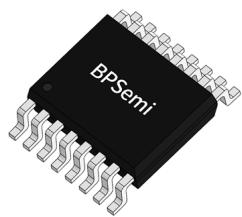
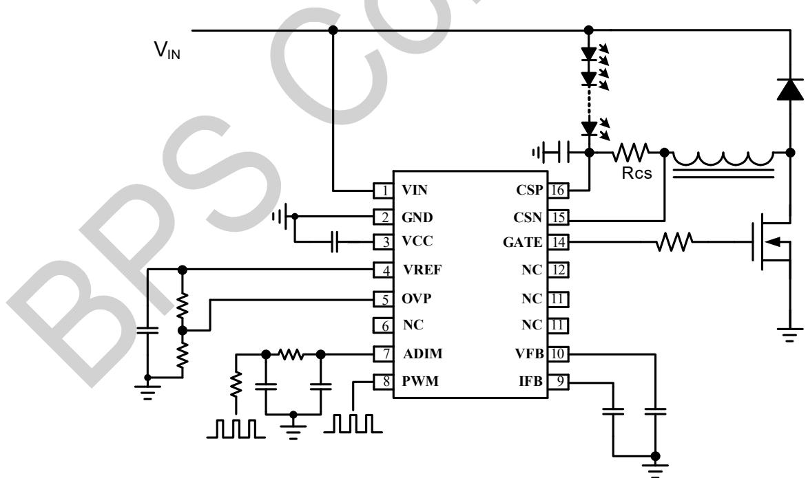
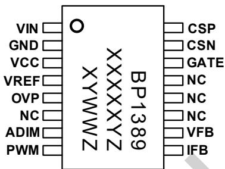
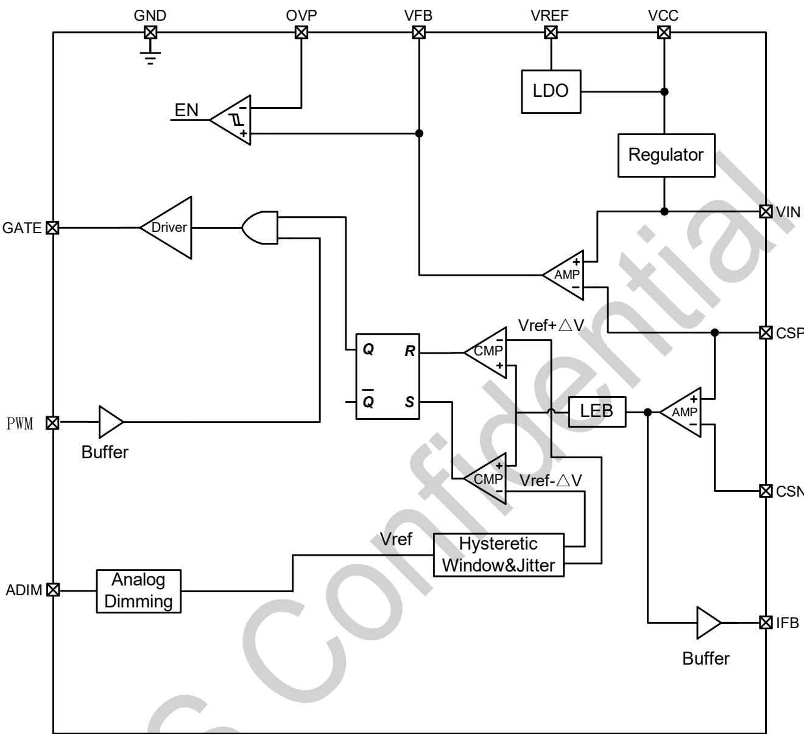
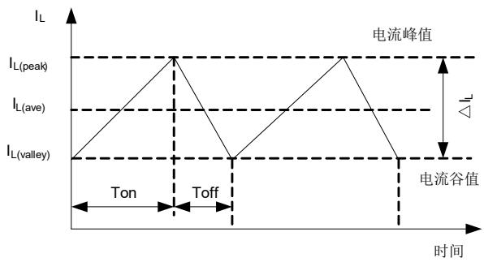
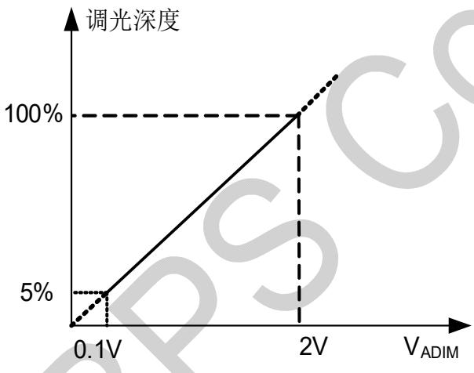
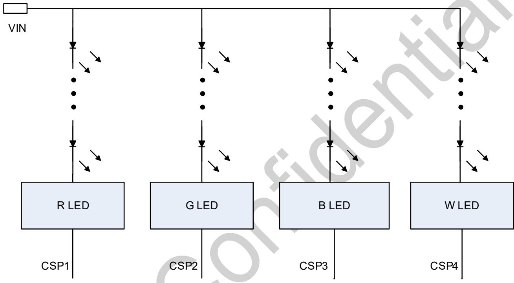
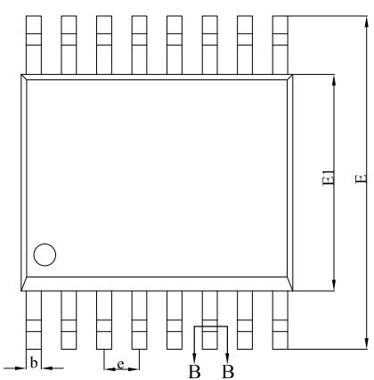
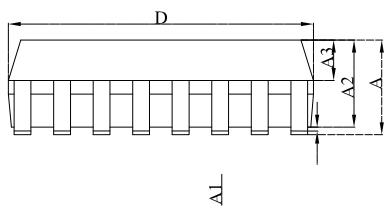
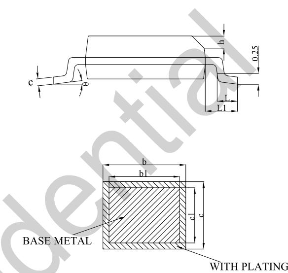

## BP1389可深度调光的降压型LED恒流控制器

## 概述

BP1389 是一款采用滞环控制的可深度调光的降压型 LED 恒流控制器，特别适合用于80V以下直流输入的DALI调光、0-10V调光和 PWM 调光等 LED 恒流应用。

BP1389 的 ADIM 引脚可接受模拟调光信号，调光范围 5%-100%。

BP1389 的 PWM 引脚接受 PWM 调光信号进行斩波调光。

BP1389提供输出电压和输出电流反馈信号，便于DALI调光应用中实现更为复杂的控制。

BP1389 采用 SSOP16L 封装。

  
SSOP16L 封装

 输入电压可达 80V

独立的 ADIM 和 PWM 双调光接口，ADIM 调光范围5%\~100%，综合调光深度低至 0.1%

 适合宽输出电压范围

 滞环控制模式，恒流精度≤±3%

 调光全程启动速度快

 高精度 5V 基准电压

 最大工作频率 1MHz

 输出过压保护、过热调节

 封装：SSOP16L

## 应用领域

 DALI 调光、0-10V 调光、无线智能调光

 LCD 背光照明

 可调光 LED 灯

## 特点典型应用

  
图 1 BP1389 典型应用电路  
注：该线路及参数仅供参考，实际应用电路和参数请通过试验充分验证。

XXXXXY：批次

## 定购信息

<table><tr><td>定购型号</td><td>封装</td><td>包装形式</td><td>打印</td></tr><tr><td>BP1389</td><td>SSOP16L</td><td>卷盘4,000/盘</td><td>BP1389XXXXXYZYWWZ</td></tr></table>

## 管脚封装

  
BP1389：产品型号  
图 2 管脚封装图

XY：标识

WW：周号

Z：预留

## 管脚描述

<table><tr><td>管脚号</td><td>管脚名称</td><td>描述</td></tr><tr><td>1</td><td>VIN</td><td>芯片供电输入端,输出电压差分采样正端</td></tr><tr><td>2</td><td>GND</td><td>芯片地</td></tr><tr><td>3</td><td>VCC</td><td>芯片工作电源</td></tr><tr><td>4</td><td>VREF</td><td>5V基准电压输出端</td></tr><tr><td>5</td><td>OVP</td><td>输出过压保护设置管脚,可接受DC电压用于设置输出空载电压峰值</td></tr><tr><td>7</td><td>ADIM</td><td>模拟调光管脚,可接受DC电压进行调光</td></tr><tr><td>8</td><td>PWM</td><td>PWM调光管脚,可接受PWM调光信号进行调光</td></tr><tr><td>9</td><td>IFB</td><td>输出电流反馈,与输出电流呈比例关系</td></tr><tr><td>10</td><td>VFB</td><td>输出电压反馈,与输出电压呈比例关系</td></tr><tr><td>6,11,12,13</td><td>NC</td><td>无连接</td></tr><tr><td>14</td><td>GATE</td><td>MOSFET栅极驱动管脚</td></tr><tr><td>15</td><td>CSN</td><td>电感电流差分采样负端</td></tr><tr><td>16</td><td>CSP</td><td>电感电流差分采样正端,同时用作输出电压差分采样输入负端</td></tr></table>

极限参数(注 1)

<table><tr><td>符号</td><td>参数</td><td>参数范围</td><td>单位</td></tr><tr><td> $V_{IN}, V_{CSP}, V_{CSN}$ </td><td>输入电源</td><td>-0.3~80</td><td>V</td></tr><tr><td> $I_{CC}$ </td><td>VCC钳位电流</td><td>5</td><td>mA</td></tr><tr><td> $V_{CC} V_{GATE}$ </td><td>GATE输入电压</td><td>-0.3~9</td><td>V</td></tr><tr><td> $V_{IFB}, V_{VFB}, V_{REF}, V_{ADIM}, V_{PWM}, V_{OVP}$ </td><td>低压管脚输入电压</td><td>-0.3~7</td><td>V</td></tr><tr><td> $P_{DMAX}$ </td><td>功耗(注2)</td><td>0.45</td><td>W</td></tr><tr><td> $\theta_{JA}$ </td><td>结到环境的热阻(注3)</td><td>145</td><td>°C/W</td></tr><tr><td> $T_J$ </td><td>工作结温范围</td><td>-40~150</td><td>°C</td></tr><tr><td> $T_{STG}$ </td><td>储存温度范围</td><td>-55~150</td><td>°C</td></tr></table>

注 1：最大极限值是指超出该工作范围，芯片有可能损坏。推荐工作范围是指在该范围内，器件功能正常，但并不完全保证满足个别性能指标。电气参数定义了器件在工作范围内并且在保证特定性能指标的测试条件下的直流和交流电参数规范。对于未给定上下限值的参数，该规范不予保证其精度，但其典型值合理反映了器件性能。

注 2：温度升高最大功耗一定会减小，这也是由 $T _ { \Delta M A X } , \theta _ { J A } ,$ 和环境温度 $\mathsf { T } _ { \mathsf { A } }$ 所决定的。最大允许功耗为 $P _ { \tt D M A X } = \left( \mathbb { T } _ { \tt J M A X } - \mathbb { T } _ { A } \right) / \theta _ { \tt J A }$ 或是极限范围给出的数字中比较低的那个值。

注 3：1平方英寸双层 PCB板，按照JEDEC 标准测试。

电气参数(注 4)（无特别说明情况下， ${ \sf T } _ { \sf A } = 2 5 ^ { \circ } { \sf C } )$

<table><tr><td>符号</td><td>描述</td><td>条件</td><td>最小值</td><td>典型值</td><td>最大值</td><td>单位</td></tr><tr><td colspan="7">电源部分</td></tr><tr><td> $V_{IN}$ </td><td>输入电压工作范围</td><td></td><td>8</td><td></td><td>80</td><td>V</td></tr><tr><td> $V_{CC_ON}$ </td><td>VCC启动电压</td><td> $V_{CC}$ 上升</td><td>6.2</td><td>6.7</td><td>7.2</td><td>V</td></tr><tr><td> $V_{CC\_UVLO}$ </td><td>VCC欠压保护阈值</td><td> $V_{CC}$ 下降</td><td>4.5</td><td>5</td><td>5.5</td><td>V</td></tr><tr><td> $V_{CC\_CLAMP}$ </td><td>VCC钳位电压</td><td> $V_{CSP}=30V$ </td><td>8.2</td><td>8.6</td><td>9</td><td>V</td></tr><tr><td> $I_Q$ </td><td>VCC静态电流</td><td> $V_{CC}=7V$ </td><td></td><td>350</td><td>900</td><td>μA</td></tr><tr><td colspan="7">电流采样(CSP,CSN)</td></tr><tr><td> $V_{CS\_REF}$ </td><td>输出电流检测基准</td><td> $V_{ADIM}=2V$ </td><td>242.5</td><td>250</td><td>257.5</td><td>mV</td></tr><tr><td> $V_{CS\_HYS}$ </td><td>CS迟滞电压</td><td> $V_{ADIM}=2V$ </td><td></td><td>75</td><td></td><td>mV</td></tr><tr><td> $T_{LEB}$ </td><td>消隐时间</td><td></td><td>100</td><td>120</td><td>140</td><td>ns</td></tr><tr><td colspan="7">基准电压(VREF)</td></tr><tr><td> $V_{REF}$ </td><td>VREF基准电压</td><td></td><td>4.85</td><td>5</td><td>5.15</td><td>V</td></tr><tr><td colspan="7">模拟调光(ADIM)</td></tr><tr><td> $V_{ADIM}$ </td><td>模拟调光范围</td><td>推荐外加电压范围</td><td>0.2</td><td></td><td>2</td><td>V</td></tr><tr><td colspan="7">PWM调光(PWM)</td></tr><tr><td> $V_{PWM_ON}$ </td><td>PWM高电平有效</td><td></td><td>2.5</td><td></td><td></td><td>V</td></tr><tr><td> $V_{PWM_OFF}$ </td><td>PWM低电平有效</td><td></td><td></td><td></td><td>1</td><td>V</td></tr><tr><td> $T_{STD}$ </td><td>PWM低电平待机计时</td><td></td><td></td><td>15</td><td></td><td>ms</td></tr><tr><td colspan="7">输出电压/电流反馈(VFB,IFB)</td></tr><tr><td> $K_{IFB1}$ </td><td>IFB电压放大倍数1</td><td>CSP=20V CSN=19.75V(模拟调光深度100%)</td><td>9.5</td><td>10</td><td>10.5</td><td></td></tr><tr><td> $K_{IFB2}$ </td><td>IFB电压放大倍数2</td><td>CSP=20V CSN=19.975V(模拟调光深度10%)</td><td>7.5</td><td>9.4</td><td>11.3</td><td></td></tr><tr><td> $K_{VFB1}$ </td><td>VFB电压缩小倍数1</td><td> $V_{IN}=45V,V_{OUT}=40V$ </td><td>19</td><td>20</td><td>21</td><td></td></tr><tr><td> $K_{VFB2}$ </td><td>VFB电压缩小倍数2</td><td> $V_{IN}=45V,V_{OUT}=5V$ </td><td>17.5</td><td>20</td><td>22.5</td><td></td></tr><tr><td colspan="7">输出过压保护(OVP)</td></tr><tr><td> $K_{OVP}$ </td><td>OVP电压放大倍数</td><td></td><td>95</td><td>100</td><td>105</td><td></td></tr><tr><td colspan="7">GATE驱动</td></tr><tr><td> $I_{SOURCE}$ </td><td>GATE上拉电流</td><td></td><td></td><td>250</td><td></td><td>mA</td></tr><tr><td> $I_{SINK}$ </td><td>GATE下拉电流</td><td></td><td></td><td>350</td><td></td><td>mA</td></tr><tr><td> $T_{ON\_MAX}$ </td><td>满载MOS最大导通时间</td><td> $V_{ADIM}=2V$ </td><td>30</td><td>35</td><td>42</td><td>μs</td></tr><tr><td colspan="7">过温保护</td></tr><tr><td> $T_{OTP}$ </td><td>过温降电流阈值</td><td></td><td></td><td>140</td><td></td><td>°C</td></tr></table>

注 4：规格书的最小、最大规范范围由测试保证，典型值由设计、测试或统计分析保证。

## 内部结构框图

  
图 3 BP1389 内部框图

## 功能描述

BP1389 是一款采用滞环控制的可深度调光的降压型 LED 恒流控制器，特别适合用于 80V以下直流输入的 DALI 调光、0-10V 调光和 PWM 调光等 LED 恒流应用。

## 芯片启动

系统上电后通过 $V _ { \sf I N }$ 引脚的供电电路对 $\mathsf { V } _ { \mathsf { C C } }$ 电容充电，当 $\mathsf { V } _ { \mathsf { C C } }$ 电压高于 V 以后，芯片开始工作，GATE 引脚输出驱动信号。 $\mathsf { V } _ { \mathsf { C C } }$ 端口的钳位电压为 8.7V 左右。 $\mathsf { V } _ { \mathsf { C C } }$ 电压经过芯片内部 LDO 产生高精度的 5V 基准电压，并从 V 引脚输出。

## 输出电流

最大输出电流可通过连接在 CSP 和 CSN 之间的电阻进行设定。非调光状态时输出电流计算公式如下：

$$
I _ {O M A X} = \frac {V _ {R E F}}{R _ {S E N S E}} = \frac {V _ {A D I M}}{8 R _ {S E N S E}}
$$

其中 I 为最大输出电流平均值，R 为系统的电流检测电阻，V 为 ADIM 电压。

BP1389 是采用滞环方式控制的 Buck电路。当 $\mathsf { V } _ { \mathsf { C C } }$ 被充电到$V _ { C C \_ O N }$ ，GATE 输出高电平，电感电流线性上升。当电感电流上升到 $\mathsf { I } _ { \mathsf { L } ( \mathsf { p e a k } ) }$ ，MOS 关断，电感电流线性下降。当 MOS 电感电流下降至 $\mathsf { l } _ { \mathsf { L } ( \mathsf { v a l l e y } ) }$ ，MOS 再次导通。 $\mathsf { I } _ { \mathsf { L } ( \mathsf { p e a k } ) }$ 和 $\mathsf { l } _ { \mathsf { L } ( \mathsf { v a l l e y } ) }$ 的差值会随着 ADIM 电压变化而变化。

电感电流波形如下图所示：

  
图 4电感电流波形

## 模拟调光

BP1389 的ADIM 脚接受模拟电压来调节输出电流，芯片对模拟电压的最大和最小值不做限制。推荐 ADIM 电压范围放在 0.1V-2V，对应调光深度 5%-100%。

  
图 5 模拟调光曲线

## PWM 调光

PWM 脚可接收 PWM 信号进行斩波调光。输出电流的斩波频率和占空比分别等于 PWM 调光信号的频率和占空比。

## 电感选择

由于芯片原理设定，不同的电感值，会影响到驱动的开关频率。电感值决定了电感电流在开关时的升降斜率，而电流斜率决定了MOSFET开关时电流从波谷到波峰和波峰到波谷消耗的时间。

$$
\begin{array}{r l} t _ {O N} & = \frac {L \times \Delta I}{V I N - V _ {L E D} - I _ {O U T} \times (F E T _ {R _ {D S} (O N)} + D C R _ {L} + R _ {S E N S E})} \\ & t _ {O F F} = \frac {L \times \Delta I}{V _ {L E D} + V _ {\text {DIODE}} + I _ {O U T} \times D C R _ {L}} \end{array}
$$

DCR 是电感的直流电阻值， $V _ { L E D }$ 是 LED 的压降，FETR\_DS (ON)是功率 MOSFET的导通电阻， $V _ { \mathsf { D } | \mathsf { O D E } }$ 为续流二极管的压降。开关频率可由以下公式计算：

$$
f _ {S W} = \frac {1}{t _ {O N} + t _ {O F F}}
$$

电感值越大，电感电流的变化越缓慢。由于从 CS 检测到MOSFET 的开关之间存在传播延时，使得期望值和真实的纹波电流之间存在细微的差异。为补偿该差异，BP1389 内置闭环补偿，使得 LED 电流具有良好的一致性。选择电感时，不应使电流峰值超过电感的额定饱和电流。

## 续流二极管

注意续流二极管的额定平均电流应大于流过二极管的平均电流 平均电流计算公式如下：

$$
I _ {a v g \_ d i o d e} = I _ {O U T} \times \frac {t _ {O F F}}{t _ {O N} + t _ {O F F}}
$$

注意，二极管应具有承受反向峰值电压的能力。建议选择反向额定电压大于输入电压的二极管。为了提高效率，建议选择肖特基二极管。

## VCC旁路电容

VCC 引脚需要并联一个 1μF以上的旁路电容，电容的大小选择和驱动 MOS 的大小有关系，MOS 越大，需要的旁路电容也越大。PCB布板的时候 VCC 电容需要紧挨着端口布局。

## OVP 保护

BP1389 具有OVP 保护功能。空载电压峰值为 OVP 引脚电压的 100 倍。OVP 回差固定为3.8V 左右。

## 输出电流和电压反馈

BP1389 支持输出电流和电压反馈。VFB引脚电压为输出电压的 $1 / { \mathsf { K } } { \mathsf { v } } { \mathsf { F B } }$ ，IFB引脚电压与输出电流的关系如下：

$$
V _ {I F B} = I _ {O U T} \cdot R _ {C S} \cdot K _ {I F B}
$$

## PCB Layout 指南

在设计 BP1389 应用电路 PCB时，需要遵循以下建议：

MOSFET Drain 端与续流二极管、功率电感和 CS 检流电阻的布线覆铜尽可能长度短、线宽大。

 CS检流电阻与芯片CSP和CSN端口之间的连接线应尽量短。

 芯片的VCC电容靠近芯片布局，且VCC电容的GND端与芯片的 GND 端保持单点连接。

 系统的输入电容尽可能靠近 BP1389 系统布局，保证输入电容达到尽量好的滤波效果。

  
图6四路共阳连接电路示意图

## 封装信息

SSOP16L 封装外形尺寸  
  
SECTION B-B

<table><tr><td rowspan="2">SYMBOL</td><td colspan="3">MILLIMETER</td></tr><tr><td>MIN</td><td>NOM</td><td>MAX</td></tr><tr><td>A</td><td>--</td><td>--</td><td>1.75</td></tr><tr><td>A1</td><td>0.10</td><td>--</td><td>0.23</td></tr><tr><td>A2</td><td>1.30</td><td>1.40</td><td>1.50</td></tr><tr><td>A3</td><td>0.60</td><td>0.65</td><td>0.70</td></tr><tr><td>b</td><td>0.23</td><td>--</td><td>0.31</td></tr><tr><td>b1</td><td>0.22</td><td>0.25</td><td>0.28</td></tr><tr><td>c</td><td>0.20</td><td>--</td><td>0.24</td></tr><tr><td>c1</td><td>0.19</td><td>0.20</td><td>0.21</td></tr><tr><td>D</td><td>4.80</td><td>4.90</td><td>5.00</td></tr><tr><td>E</td><td>5.80</td><td>6.00</td><td>6.20</td></tr><tr><td>E1</td><td>3.80</td><td>3.90</td><td>4.00</td></tr><tr><td>e</td><td colspan="3">0.635 BSC</td></tr><tr><td>h</td><td>0.25</td><td>--</td><td>0.50</td></tr><tr><td>L</td><td>0.50</td><td>0.65</td><td>0.80</td></tr><tr><td>L1</td><td colspan="3">1.05 REF</td></tr><tr><td>θ</td><td>0</td><td>--</td><td>8°</td></tr></table>

## 版本信息

<table><tr><td>版本</td><td>日期</td><td>记录</td></tr><tr><td>Rev.1.0</td><td>2023/10</td><td>首次发行</td></tr><tr><td>Rev.1.1</td><td>2025/5</td><td>增加 Tonmax 上下限</td></tr></table>

## 免责声明

晶丰明源尽力确保本产品规格书内容的准确和可靠，但是保留在没有通知的情况下，修改规格书内容的权利。

本产品规格书未包含任何针对晶丰明源或第三方所有的知识产权的授权。针对本产品规格书所记载的信息，晶丰明源不做任何明示或暗示的保证，包括但不限于对规格书内容的准确性、商业上的适销性、特定目的的适用性或者不侵犯晶丰明源或任何第三人知识产权做任何明示或暗示保证，晶丰明源也不就因本规格书本身及其使用有关的偶然或必然损失承担任何责任。