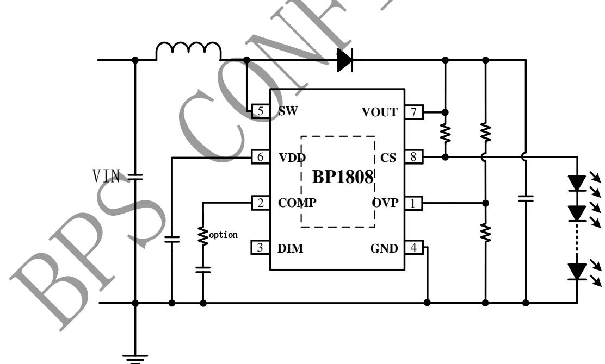
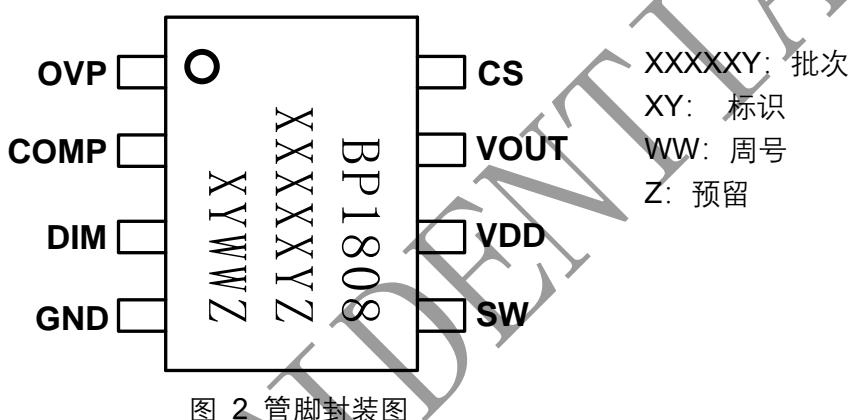
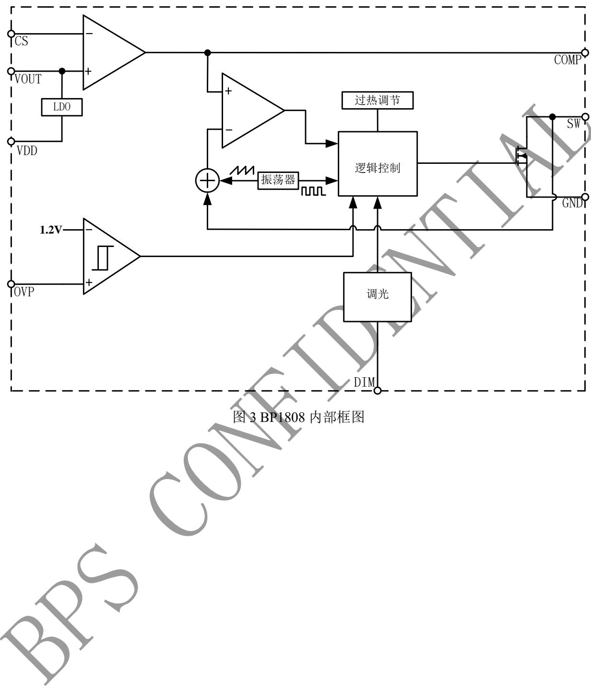
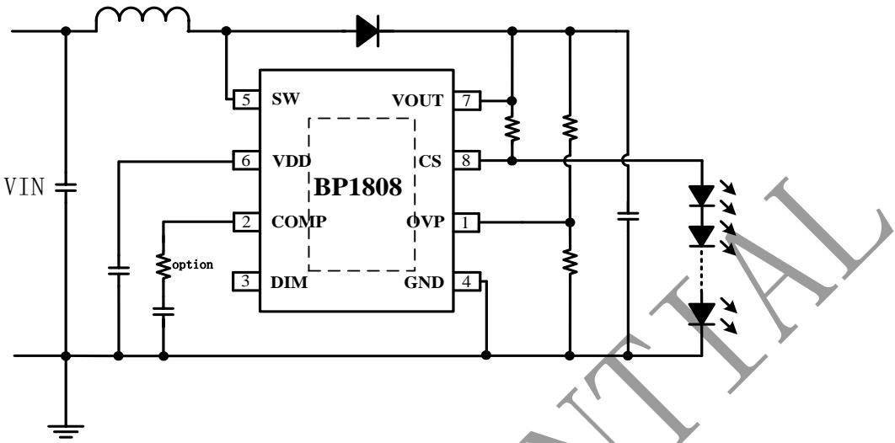
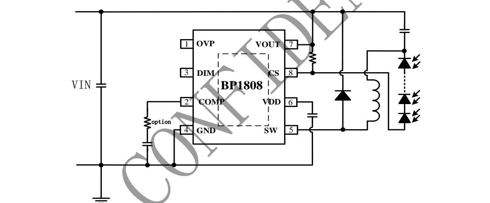
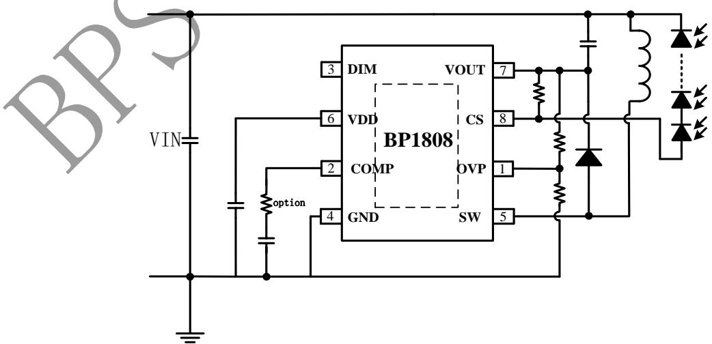
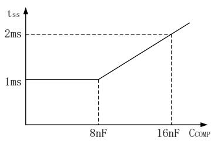
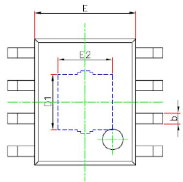
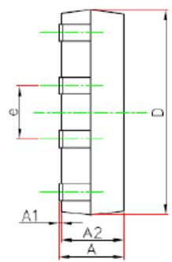
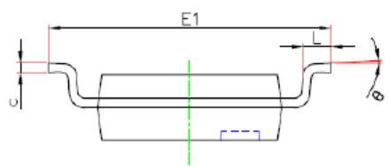

## 概述

BP1808 是一款多工作模式、宽输入/输出范围的高压 DC-DC LED 驱动芯片，内部集成 70V/300mΩ功率开关。BP1808 可以工作于升压、降压、和升降压模式，其输入/输出电压范围可达 3V—60VDC。

BP1808 可通过外置采样电阻调节输出电流的大小，其输出电流的精度可达±3%。BP1808 可通过 DIMPin 进行PWM和模拟调光。

BP1808采用420kHz固定开关频率，可使用小尺寸的电感和输入/输出电容。电流模式控制使其拥有出色的响应速度，并使环路补偿更为简单。

BP1808 具有多重保护功能，包括过流保护、输入欠压保护、输出过压保护、芯片过热调节等。

BP1808 采用散热增强的 SOP8-EP 封装。

## 特点

◼ 3V 到 60VDC 输入/输出范围

◼ 支持升压、降压、和升降压模式

◼ 内置 70V/300mΩ 功率 MOSFET

◼ ±3%输出电流精度

◼ 支持PWM调光及模拟调光

◼ 420kHz 固定工作频率

◼ 内置软启动

◼ 逐周期的峰值电流限制

◼ 输入欠压保护

◼ 输出过压保护

◼ 过温调节功能

◼ 散热增强的 SOP8-EP 封装

## 应用

◼ MR16 LED 射灯

## 典型应用(升压)

智能调光 LED 灯

车载 LED 灯

太阳能 LED 灯

  
图 1 BP1808 典型应用图(升压)

## 定购信息

<table><tr><td>定购型号</td><td>封装</td><td>温度范围</td><td>包装形式</td><td>打印</td></tr><tr><td>BP1808</td><td>SOP8-EP</td><td>-40 °C到105 °C</td><td>编带4,000颗/盘</td><td>BP1808XXXXXYZXYWWZ</td></tr></table>

## 管脚封装

  
图 2 管脚封装图

## 管脚描述

<table><tr><td>管脚号</td><td>管脚名称</td><td>描述</td></tr><tr><td>1</td><td>OVP</td><td>过压保护端,连接至输出脚和地之间的分压电阻。</td></tr><tr><td>2</td><td>COMP</td><td>环路补偿端,连接补偿电阻(可选)串联补偿电容到地。</td></tr><tr><td>3</td><td>DIM</td><td>调光输入端,不调光时悬空。</td></tr><tr><td>4</td><td>GND</td><td>芯片地。</td></tr><tr><td>5</td><td>SW</td><td>开关端,连接内部 MOSFET 漏极及外部整流二极管阳极,保持 PCB 板上连线尽可能短。</td></tr><tr><td>6</td><td>VDD</td><td>芯片内部电源输出端,连接 1uF 旁路电容到地。</td></tr><tr><td>7</td><td>VOUT</td><td>输出电压连接点,并提供芯片电源</td></tr><tr><td>8</td><td>CS</td><td>LED 电流采样端,连接采样电阻到 VOUT 端。</td></tr></table>

## 极限参数(注 1)

<table><tr><td>符号</td><td>参数</td><td>参数范围</td><td>单位</td></tr><tr><td>SW</td><td>开关管漏极峰值电压</td><td>-0.3~70</td><td>V</td></tr><tr><td>VOUT</td><td>输出电压采样端电压</td><td>-0.3~70</td><td>V</td></tr><tr><td>CS</td><td>LED电流采样端电压</td><td>-0.3~70</td><td>V</td></tr><tr><td>OVP</td><td>过压保护端电压</td><td>-0.3~70</td><td>V</td></tr><tr><td>VDD</td><td>芯片内部电源输出电压</td><td>-0.3~6</td><td>V</td></tr><tr><td>COMP</td><td>环路补偿端电压</td><td>-0.3~6</td><td>V</td></tr><tr><td>DIM</td><td>调光端电压</td><td>-0.3~6</td><td>V</td></tr><tr><td> $P_{DMAX}$ </td><td>功耗(注2)</td><td>1</td><td>W</td></tr><tr><td> $\theta_{JA}$ </td><td>PN结到环境的热阻</td><td>60</td><td>°C/W</td></tr><tr><td> $T_J$ </td><td>工作结温范围</td><td>-40 to 150</td><td>°C</td></tr><tr><td> $T_{STG}$ </td><td>储存温度范围</td><td>-55 to 150</td><td>°C</td></tr><tr><td></td><td>ESD(注3)</td><td>2</td><td>kV</td></tr></table>

注 1：最大极限值是指超出该工作范围，芯片有可能损坏。推荐工作范围是指在该范围内，器件功能正常，但并不完全保证满足个别性能指标。电气参数定义了器件在工作范围内并且在保证特定性能指标的测试条件下的直流和交流电参数规范。对于未给定上下限值的参数，该规范不予保证其精度，但其典型值合理反映了器件性能。

注 2：温度升高最大功耗一定会减小，这也是由 TJMAX,θJA,和环境温度 TA所决定的。最大允许功耗为 PDMAX = (TJMAX - TA)/θJA或是极限范围给出的数字中比较低的那个值。

注 3：人体模型，100pF 电容通过 1.5kΩ 电阻放电。

电气参数(注 4, 5) （无特别说明情况下， $\mathtt { V _ { 0 0 T } = 1 5 V } , \mathtt { T _ { A } = 2 5 ^ { \circ } C } )$

<table><tr><td>符号</td><td>描述</td><td>条件</td><td>最小值</td><td>典型值</td><td>最大值</td><td>单位</td></tr><tr><td colspan="7">电源电压</td></tr><tr><td> $V_{IN}$ </td><td>输入电压</td><td></td><td>3</td><td></td><td>60</td><td>V</td></tr><tr><td> $V_{DD_ON}$ </td><td> $V_{DD}$ 启动电压</td><td> $V_{DD}$ 上升</td><td></td><td>2.5</td><td></td><td>V</td></tr><tr><td> $V_{DD\_UVLO,HYS}$ </td><td> $V_{DD}$ 欠压保护迟滞电压</td><td> $V_{DD}$ 下降</td><td></td><td>200</td><td></td><td>mV</td></tr><tr><td> $V_{DD\_Reg}$ </td><td>芯片内部电源输出电压</td><td> $V_{OUT}=6V$ </td><td></td><td>4.9</td><td></td><td>V</td></tr><tr><td colspan="7">工作电流及频率</td></tr><tr><td> $I_{SD}$ </td><td>静态电流(关机)</td><td> $V_{DIM}=0V$ </td><td></td><td>80</td><td></td><td>μA</td></tr><tr><td> $I_Q$ </td><td>静态电流(无开关动作)</td><td> $V_{COMP}=0V$ </td><td></td><td>200</td><td></td><td>μA</td></tr><tr><td> $f_{SW}$ </td><td>开关频率</td><td></td><td></td><td>420</td><td></td><td>kHz</td></tr><tr><td> $D_{max}$ </td><td>最大占空比</td><td> $V_{OUT}-V_{CS}=0.1V$ </td><td>85</td><td></td><td></td><td>%</td></tr><tr><td colspan="7">过压保护</td></tr><tr><td> $V_{OVP}$ </td><td>过压保护电压</td><td></td><td></td><td>1.2</td><td></td><td>V</td></tr><tr><td colspan="7">使能/调光</td></tr><tr><td> $V_{EN}$ </td><td>使能电压</td><td>DIM上升</td><td></td><td>0.4</td><td></td><td>V</td></tr><tr><td> $V_{EN\_HYS}$ </td><td>使能迟滞</td><td></td><td></td><td>200</td><td></td><td>mV</td></tr><tr><td> $I_{DIM}$ </td><td>DIM端上拉电流</td><td>DIM=0V</td><td></td><td>1.3</td><td></td><td>μA</td></tr><tr><td> $V_{DIM\_LOW}$ </td><td>DIM模拟调光下限电压</td><td></td><td></td><td>0.55</td><td></td><td>V</td></tr><tr><td> $V_{DIM\_HIGH}$ </td><td>DIM模拟调光上限电压</td><td></td><td></td><td>1.75</td><td></td><td>V</td></tr><tr><td> $f_{DIM}$ </td><td>PWM调光频率范围</td><td></td><td>0.1</td><td></td><td>10</td><td>kHz</td></tr><tr><td> $T_{ShutDown}$ </td><td>DIM关机延时</td><td>DIM为低</td><td></td><td>15</td><td></td><td>ms</td></tr><tr><td colspan="7">电流采样</td></tr><tr><td> $V_{OUT}-V_{CS}$ </td><td>采样电压</td><td></td><td></td><td>200</td><td></td><td>mV</td></tr><tr><td colspan="7">功率管</td></tr><tr><td> $R_{dson}$ </td><td>功率管导通电阻</td><td> $I_D=200mA$ </td><td></td><td>300</td><td></td><td>mΩ</td></tr><tr><td> $I_{lim}$ </td><td>限流保护</td><td></td><td></td><td>3</td><td></td><td>A</td></tr><tr><td> $BV_{DSS}$ </td><td>功率管的击穿电压</td><td> $V_{GS}=0V/I_{DS}=10uA$ </td><td>70</td><td></td><td></td><td>V</td></tr><tr><td colspan="7">过热调节</td></tr><tr><td> $T_{Thermal}$ </td><td>过热调节起始温度</td><td></td><td></td><td>140</td><td></td><td>°C</td></tr></table>

注 4：典型参数值为 25˚C 下测得的参数标准。  
注 5：规格书的最小、最大规范范围由测试保证，典型值由设计、测试或统计分析保证。

## 内部结构框图

图 3 BP1808 内部框图

## 应用信息

图 1 典型应用—升压（VIN<VLED）  

图 2典型应用—降压 $( \mathrm { \Delta V _ { I N } > V _ { L E D } } )$  
  
图3典型应用—升/降压 $( \mathrm { { V } _ { I N } { < } V _ { L E D } }$ 或 $\mathrm { V } _ { \mathrm { I N } } { > } \mathrm { V } _ { \mathrm { L E D } } )$

BP1808 是一款多工作模式、宽输入/输出范围的高压 DC-DC LED驱动芯片，可以工作于升压、降压、和升降压模式。

## 启动与关机

BP1808 内置软启动功能，当 COMP 电压上升至 1V时，软启动结束，内置MOSFET开始开关。

当 COMP电容值小于8nF时，COMP电压以最大斜率1V/ms上升，软启动时间为1ms；若需要更长的软启动时间，可适当加大COMP 端的电容，当COMP电容大于 8nF 时，软启动充电电流以最大值 8uA 给COMP 电容充电，直到 COMP 电压上升至 1V，此时的软启动时间为 ${ { t } _ { s s } }$ :

$$
t _ {s s} = \frac {1 V * C _ {C O M P}}{8 u A}
$$

  
软启动时间与 COMP 电容关系曲线

当 DIM 端电压持续小于 0.2V 超过 15ms 时，BP1808进入关机状态。在此状态下静态电流减小至 80μA，COMP电容被放电至零。

## LED 电流设置

LED 电流可通过连接在 CS 端和 VOUT 端之间外部采样电阻设置。

该电阻值可通过下式计算：

$$
\mathrm{R} _ {C S} = \frac {0 . 2}{I _ {L E D}}
$$

ILED为LED的电流平均值。

## 模拟和 PWM调光

BP1808 支持模拟和 PWM 调光。当 DIM 电压小于0.2V，芯片处于关机状态。在模拟调光模式下，当DIM 电压在 0.55V—1.75V 范围内变化时，LED 电流将在 0%—100%范围内线性变化。当 DIM 电压大于 1.75V时，LED电流为最大值。在PWM调光模式下，DIM端高电平须大于1.75V。在DIM端施加一100Hz—10kHz PWM 信号，LED 平均电流将根据 PWM占空比从 0%—100%变化。

## 过压保护

在升压和升/降压型应用中，LED 开路将触发过压保护。过压保护点可通过外部分压电阻设置，OVP比较器参考电压为 1.2V，迟滞 100mV。建议将过压保护电压设置比正常VOUT电压高30%以上。

## 过温调节功能

BP1808 具有过热调节功能，在驱动电源过热时逐渐减小输出电流，从而控制输出功率和温升，使电源温度保持在设定值，以提高系统的可靠性。芯片内部设定过热调节温度点为 140℃。

## 电容选择

输入电容典型值为10μF，输出电容典型值为1μF，若需进一步减小输入/输出纹波，可选用更大的电容。在开关频率下，输入/输出电容的容抗需尽可能的小，建议使用X5R或X7R 的陶瓷电容。 $\mathrm { C _ { \mathrm { { C O M P } } } }$ 被用于环路补偿和软启动，推荐使用 1nF的电容。

## 电感选择

常用电感范围为10μH—47μH。为避免磁芯饱和，建议选取电感饱和电流超过正常工作时电感电流峰值 30%—40%的电感。

## 二极管选择

由于 BP1808开关频率较高，为了提高效率，建议使用具有快恢复时间和低导通压降的肖特基二极管作为整流二极管。肖特基二极管的平均电流等级需大于平均输出电流。二极管反向击穿电压需大于输出电压。

## PCB 设计

在设计 BP1808 PCB 时，COMP 和 VDD 的旁路电容需要紧靠各自的引脚和芯片地,尤其是VDD电容的地必须紧靠芯片电容的地。输入/输出电容的地尽可能靠近芯片地，连线尽可能的粗，可以大块铺铜连接。流过大电流的走线一定要短且粗，尽量缩短R 、电感、二极管、输入/输出电容到芯片的连线。使SW 线尽可能远离 $\mathrm { R _ { C S } }$ 。

## 封装

ESOP-8(90\*90) PACKAGE OUTLINE DIMENSIONS  

<table><tr><td rowspan="2">Symbol</td><td colspan="2">Dimensions In Millimeters</td><td colspan="2">Dimensions In Inches</td></tr><tr><td>Min.</td><td>Max.</td><td>Min.</td><td>Max.</td></tr><tr><td>A</td><td>1.300</td><td>1.700</td><td>0.051</td><td>0.067</td></tr><tr><td>A1</td><td>0.000</td><td>0.100</td><td>0.000</td><td>0.004</td></tr><tr><td>A2</td><td>1.350</td><td>1.550</td><td>0.053</td><td>0.061</td></tr><tr><td>b</td><td>0.330</td><td>0.510</td><td>0.013</td><td>0.020</td></tr><tr><td>c</td><td>0.170</td><td>0.250</td><td>0.007</td><td>0.010</td></tr><tr><td>D</td><td>4.700</td><td>5.100</td><td>0.185</td><td>0.201</td></tr><tr><td>D1</td><td>2.034</td><td>2.234</td><td>0.080</td><td>0.088</td></tr><tr><td>E</td><td>3.800</td><td>4.000</td><td>0.150</td><td>0.157</td></tr><tr><td>E1</td><td>5.800</td><td>6.200</td><td>0.228</td><td>0.244</td></tr><tr><td>E2</td><td>2.034</td><td>2.234</td><td>0.080</td><td>0.088</td></tr><tr><td>e</td><td colspan="2">1.270(BSC)</td><td colspan="2">0.050(BSC)</td></tr><tr><td>L</td><td>0.400</td><td>1.270</td><td>0.016</td><td>0.050</td></tr><tr><td>θ</td><td> $0^{\circ}$ </td><td> $8^{\circ}$ </td><td> $0^{\circ}$ </td><td> $8^{\circ}$ </td></tr></table>

## 重要声明

晶丰明源尽力确保本产品规格书内容的准确和可靠，但是保留在没有通知的情况下，修改规格书内容的权利。

本产品规格书未包含任何针对晶丰明源或第三方所有的知识产权的授权。针对本产品规格书所记载的信息，晶丰明源不做任何明示或暗示的保证，包括但不限于对规格书内容的准确性、商业上的适销性，特定目的的适用性或者不侵犯晶丰明源或任何第三人知识产权做任何明示或暗示保证，晶丰明源也不就因本规格书本身及其使用有关的偶然或必然损失承担任何责任。