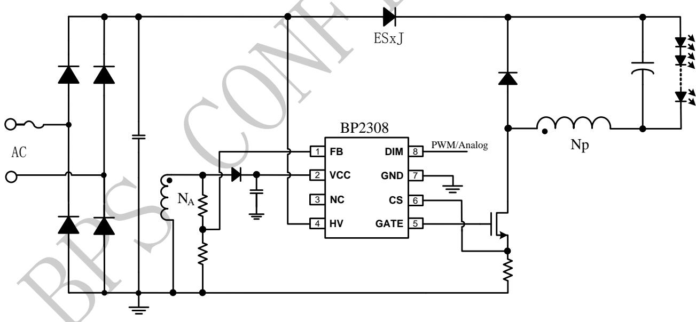
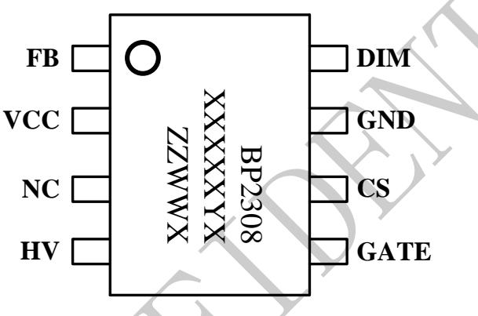
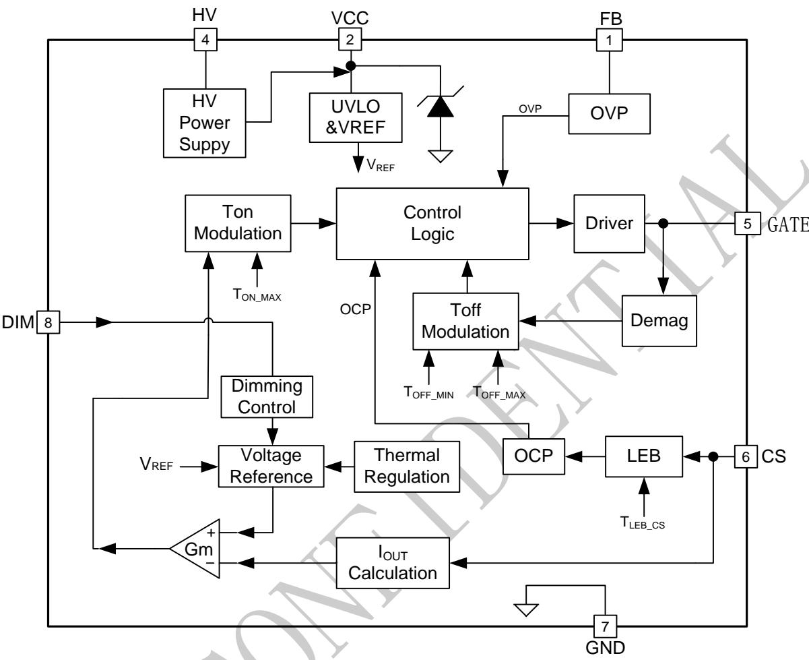
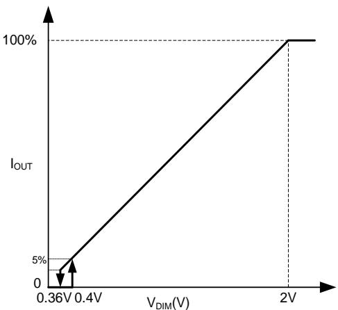
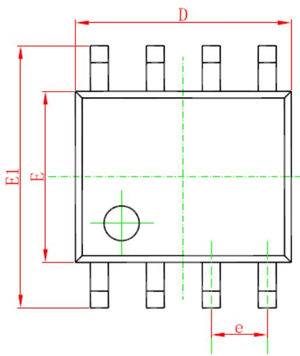
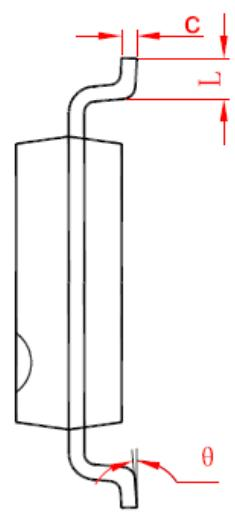
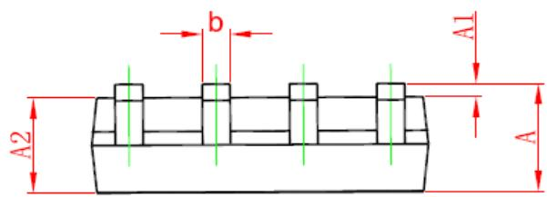

## 概述

BP2308 是一款兼容 PWM/模拟调光的高 PF BUCKLED 恒流控制芯片,适用于 90Vac-265Vac 全范围输入电压。

BP2308 采用高压启动，内置COMP 补偿电容，降低成本。芯片采用专利的电流控制机制，用极少的外部元件达到高精度的输出电流，实现了优异的线性调整率和负载调整率。

BP2308 提供多种保护功能，包含 LED 负载短路保护，VCC欠压保护和温度调节功能，增强了系统可靠性。

BP2308 采用 SOP-8 封装。

## 特点

◼ 兼容 PWM/模拟调光

◼ PWM 调光范围 1%\~100%

◼ 模拟调光范围 5%\~100%

◼ 高 PF，低 THD

◼ 超低待机功耗

◼ 内置 COMP 电容

◼ 高精度输出电流(+/-3%)

◼ 优异的线性、负载调整率

◼ VCC 欠压锁定

◼ 逐周期限流

◼ 输出短路保护

◼ 过温降电流

◼ SOP-8 封装

## 应用

智能 LED 球泡灯

## 典型应用

◼ 其他 LED 智能照明

  
图 1 BP2308 典型应用图

## 定购信息

<table><tr><td>定购型号</td><td>封装</td><td>温度范围</td><td>包装形式</td><td>打印</td></tr><tr><td>BP2308</td><td>SOP-8</td><td>-40 °C到105 °C</td><td>4000pcs/盘</td><td>BP2308XXXXXYZZWWX</td></tr></table>

## 管脚封装

  
图2 管脚封装图

XXXXX：Lot Number

ZZZZ：标记

WW：周号

## 管脚描述

<table><tr><td>管脚号</td><td>管脚名称</td><td>描述</td></tr><tr><td>1</td><td>FB</td><td>反馈信号采样脚</td></tr><tr><td>2</td><td>VCC</td><td>芯片供电</td></tr><tr><td>3</td><td>NC</td><td>无连接</td></tr><tr><td>4</td><td>HV</td><td>高压启动和供电</td></tr><tr><td>5</td><td>GATE</td><td>连接 MOSFET 的栅极</td></tr><tr><td>6</td><td>CS</td><td>电流采样信号输入端,通过电阻接到 GND 来检测电流。</td></tr><tr><td>7</td><td>GND</td><td>芯片地</td></tr><tr><td>8</td><td>DIM</td><td>PWM/模拟调光信号输入端</td></tr></table>

## 极限参数（注 1）

<table><tr><td>符号</td><td>参数</td><td>参数范围</td><td>单位</td></tr><tr><td> $V_{GATE}$ </td><td>GATE引脚电压范围</td><td>-0.3~20</td><td>V</td></tr><tr><td> $V_{HV}$ </td><td>芯片高压供电</td><td>-0.3~600</td><td>V</td></tr><tr><td> $V_{VCC}$ </td><td>芯片供电范围</td><td>-0.3~16</td><td>V</td></tr><tr><td> $V_{IO}$ </td><td>CS、FB引脚电压范围</td><td>-0.3~8</td><td>V</td></tr><tr><td> $V_{DIM}$ </td><td>DIM引脚电压范围</td><td>-0.3~24</td><td>V</td></tr><tr><td> $P_{DMAX}$ </td><td>功耗(注2)</td><td>0.45</td><td>W</td></tr><tr><td> $\theta_{JA}$ </td><td>PN结到环境的热阻</td><td>145</td><td>°C/W</td></tr><tr><td> $T_J$ </td><td>工作结温范围</td><td>-40 to 150</td><td>°C</td></tr><tr><td> $T_{STG}$ </td><td>储存温度范围</td><td>-55 to 150</td><td>°C</td></tr><tr><td></td><td>ESD(注3)</td><td>2</td><td>KV</td></tr></table>

注 1：最大极限值是指超出该工作范围，芯片有可能损坏。推荐工作范围是指在该范围内，器件功能正常，但并不完全保证满足个别性能指标。电气参数定义了器件在工作范围内并且在保证特定性能指标的测试条件下的直流和交流电参数规范。对于未给定上下限值的参数，该规范不予保证其精度，但其典型值合理反映了器件性能。

注 2：温度升高最大功耗一定会减小，这也是由 TJMAX, $\mathrm { { P _ { D M A X } } \ = \ \left( T _ { \mathrm { { J M A X } } } \ - \ \bar { \ T } _ { \mathrm { { A } } } \right) / }$ θJA或是极限范围给出的数字中比较低的那个值。

注 3：人体模型，100pF 电容通过 1.5KΩ 电阻放电。

规格参数 $( \yen 4,5)$ ：（无特别说明情况下， $\scriptstyle \mathtt { V } _ { \infty } = 1 2 \mathtt { V } , \ \mathtt { T } _ { \mathtt { A } } = 2 5 \ \mathtt { C } )$

<table><tr><td>符号</td><td>描述</td><td>条件</td><td>最小值</td><td>典型值</td><td>最大值</td><td>单位</td></tr><tr><td colspan="7">高压供电(HV)</td></tr><tr><td> $V_{HV\_BR}$ </td><td></td><td></td><td>600</td><td></td><td></td><td>V</td></tr><tr><td colspan="7">电源电压(VCC)</td></tr><tr><td> $V_{CC\_ON}$ </td><td> $V_{CC}$ 启动电压</td><td> $V_{CC}$ 上升</td><td></td><td>12</td><td></td><td>V</td></tr><tr><td> $V_{CC\_UVLO}$ </td><td> $V_{CC}$ 欠压保护阈值</td><td> $V_{CC}$ 下降</td><td></td><td>8</td><td></td><td>V</td></tr><tr><td> $V_{CC\_HIGH}$ </td><td> $V_{CC}$ 充电截止电压</td><td> $V_{CC}$ 上升</td><td></td><td>12</td><td></td><td>V</td></tr><tr><td> $V_{CC\_CLAMP}$ </td><td> $V_{CC}$ 钳位电压</td><td> $I_{CC}=1mA$ </td><td></td><td>15</td><td></td><td>V</td></tr><tr><td> $I_{CC}$ </td><td> $V_{CC}$ 工作电流</td><td> $F_{SW}=50KHz$ </td><td></td><td>0.4</td><td>0.55</td><td>mA</td></tr><tr><td> $I_{ST}$ </td><td>芯片待机电流</td><td>DIM=0</td><td></td><td>15</td><td>30</td><td>μA</td></tr><tr><td colspan="7">电流采样(CS)</td></tr><tr><td> $V_{REF}$ </td><td>内部参考电压</td><td></td><td>0.291</td><td>0.3</td><td>0.309</td><td>V</td></tr><tr><td> $V_{CS\_LIMIT}$ </td><td>逐周期限流阈值</td><td></td><td></td><td>1.8</td><td></td><td>V</td></tr><tr><td> $T_{LEB}$ </td><td>前沿消隐时间</td><td></td><td></td><td>300</td><td></td><td>ns</td></tr><tr><td> $T_{DELAY}$ </td><td>芯片关断延迟</td><td></td><td></td><td>200</td><td></td><td>ns</td></tr><tr><td colspan="7">模拟调光(DIM)</td></tr><tr><td> $V_{DIM\_ON}$ </td><td>调光使能阈值</td><td></td><td></td><td>0.4</td><td></td><td>V</td></tr><tr><td> $V_{DIM\_OFF}$ </td><td>调光关断阈值</td><td></td><td></td><td>0.36</td><td></td><td>V</td></tr><tr><td> $V_{DIM}$ </td><td>调光线性范围</td><td></td><td>0.4</td><td></td><td>2</td><td>V</td></tr><tr><td> $R_{PD\_DIM}$ </td><td>DIM内部下拉电阻</td><td></td><td></td><td>180</td><td></td><td>kΩ</td></tr><tr><td colspan="7">PWM调光(DIM)</td></tr><tr><td> $V_{PWM\_ON}$ </td><td>PWM高电平有效</td><td>PWM上升</td><td>2.2</td><td></td><td></td><td>V</td></tr><tr><td> $V_{PWM\_OFF}$ </td><td>PWM低电平有效</td><td>PWM下降</td><td></td><td></td><td>0.25</td><td>V</td></tr><tr><td> $F_{PWM}$ </td><td>PWM频率范围</td><td></td><td>500</td><td></td><td>4000</td><td>Hz</td></tr><tr><td colspan="7">电压反馈(FB)</td></tr><tr><td> $V_{FB\_OVP}$ </td><td>FB过压保护阈值</td><td></td><td></td><td>1.5</td><td></td><td>V</td></tr><tr><td colspan="7">内部时间控制</td></tr><tr><td> $T_{ON\_MAX}$ </td><td>最大开通时间</td><td></td><td></td><td>27</td><td></td><td>us</td></tr><tr><td> $T_{OFF\_MIN}$ </td><td>最小关断时间</td><td></td><td></td><td>3.5</td><td></td><td>us</td></tr><tr><td> $T_{OFF\_MAX}$ </td><td>最大关断时间</td><td> $V_{CS}>0.5V$ </td><td></td><td>170</td><td></td><td>us</td></tr><tr><td colspan="7">过热调节部分</td></tr><tr><td> $T_{REG}$ </td><td>过热调节温度</td><td></td><td></td><td>150</td><td></td><td>°C</td></tr></table>

注 4：典型参数值为 25˚C 下测得的参数标准。  
注 5：规格书的最小、最大规范范围

## 内部结构框图

  
图 3 BP2308 内部框图

## 应用信息

BP2308 是一款兼容 PWM/模拟调光的高 PF BUCKLED 恒流控制芯片,适用于 90Vac-265Vac 全范围输入电压。

## 1 启动

系统上电以后，芯片先检测到 DIM信号，再通过HV对VCC电容充电，当VCC电压达到芯片开启阈值时，芯片内部控制电路开始工作。然后输出电压逐步上升，电感电流也上升，LED电流由于软启动，无过冲。

## 2 恒流控制，输出电流设置

BP2308 采用专有的电流检测机制，极少的外部元 件就可达到高精度的输出电流，优异的线性调整 率和负载调整率。

最大亮度时 LED输出电流计算方法：

$$
I _ {O U T} \approx \frac {V _ {R E F}}{R _ {C S}}
$$

其中，

$\mathrm { V } _ { \mathrm { R E F } }$ 是内部基准电压

$\mathrm { R _ { C S } }$ 是电流采样电阻的值

## 3 调光

BP2308 可以接受PWM信号或模拟信号进行调光。模拟调光电压范围为 0.4V-2V，可参考如下调光曲线。当 VDIM＜0.36V，控制器关闭 MOSFET;当VDIM≥2V，LED电流达到100%输出并保持恒流。

PWM 调光信号频率范围 500Hz-4KHz，PWM 调光逻辑低电平需＜0.24V，逻辑高电平需＞2.2V。如果 PWM低电平持续时间达到20mS，芯片会进入待机模式。

  
图 4 BP2308 模拟调光曲线

## 4 反馈网络

FB引脚可以用来探测输出过压保护（OVP），阈值为 1.5V。FB 的上下分压电阻比例可以设置为：

$$
\frac {R _ {F B L}}{R _ {F B L} + R _ {F B H}} \approx \frac {1 . 5 V}{V _ {O V P}} \times \frac {N _ {P}}{N _ {A}}
$$

其中，

$\mathrm { R } _ { \mathrm { F B L } }$ 是反馈网络的下分压电阻

$\mathrm { R } _ { \mathrm { F B H } }$ 是反馈网络的上分压电阻

VOVP是输出电压过压保护设定点

$\mathrm { N _ { P } }$ 是变压器原边绕组的匝数

$\mathrm { N _ { A } }$ 是变压器辅助绕组的匝数

## 5 过温调节功能

BP2308 具有过热调节功能，在驱动电源过热时逐渐减小输出电流，从而控制输出功率和温升，使电源温度保持在设定值，以提高系统的可靠性。芯片内部设定过热调节温度点为 $1 5 0 \mathrm { { ‰} }$

## 6 保护功能

BP2308 内置多重保护功能，保证了系统可靠性。

当 LED 短路时，系统工作频率低于 6kHz。

系统进入故障保护状态后， VCC电压开始下降，当 VCC 到达欠压阈值时，系统将重启。 同时系统不断的检测系统状态，如果故障解除，系统会重新开始正常工作。

当输出短路或者电感饱和时， CS 峰值电压将会比较高。当 CS 电压上升到内部限制值（1.8V）时，开关周期马上停止。 此逐周期限流功能可以保护功率 MOSFET、电感和输出续流二极管。

## 7 PCB 设计

在设计 BP2308 PCB 板时，需要注意以下事项：

## 旁路电容

VCC 的旁路电容需要紧靠芯片 VCC和 GND 引

## 地线

电流采样电阻的功率地线尽可能粗，且要离芯片的地尽量近，以保证电流采样的准确性，否则可能会影响输出电流精度。

## 功率环路的面积

减小大电流环路的面积，以减小 EMI 辐射。

## FB 引脚

接到 FB 的分压电阻必须靠近FB 引脚，且节点要远离变压器的动点，否则系统噪声容易误触发 FBOVP 保护功能

## 封装信息

<table><tr><td rowspan="2">Symbol</td><td colspan="2">Dimensions In Millimeters</td><td colspan="2">Dimensions In Inches</td></tr><tr><td>Min</td><td>Max</td><td>Min</td><td>Max</td></tr><tr><td>A</td><td>1.350</td><td>1.750</td><td>0.053</td><td>0.069</td></tr><tr><td>A1</td><td>0.100</td><td>0.250</td><td>0.004</td><td>0.010</td></tr><tr><td>A2</td><td>1.350</td><td>1.550</td><td>0.053</td><td>0.061</td></tr><tr><td>b</td><td>0.330</td><td>0.510</td><td>0.013</td><td>0.020</td></tr><tr><td>c</td><td>0.170</td><td>0.250</td><td>0.006</td><td>0.010</td></tr><tr><td>D</td><td>4.700</td><td>5.100</td><td>0.185</td><td>0.200</td></tr><tr><td>E</td><td>3.800</td><td>4.000</td><td>0.150</td><td>0.157</td></tr><tr><td>E1</td><td>5.800</td><td>6.200</td><td>0.228</td><td>0.244</td></tr><tr><td>e</td><td colspan="2">1.270 (BSC)</td><td colspan="2">0.050 (BSC)</td></tr><tr><td>L</td><td>0.400</td><td>1.270</td><td>0.016</td><td>0.050</td></tr><tr><td>θ</td><td> $0^{\circ}$ </td><td> $8^{\circ}$ </td><td> $0^{\circ}$ </td><td> $8^{\circ}$ </td></tr></table>