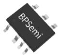
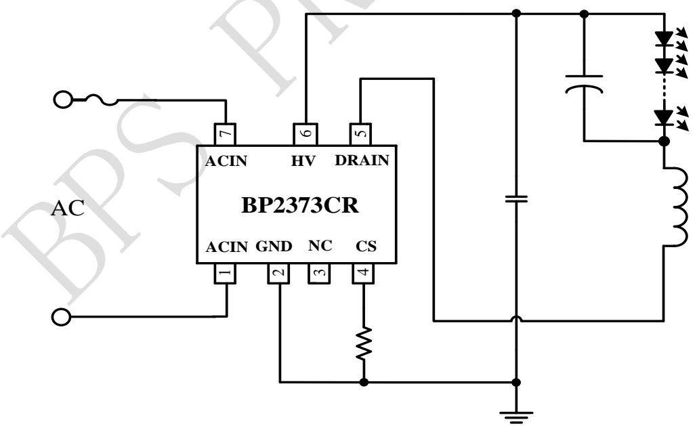
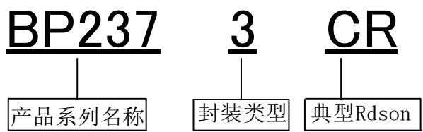
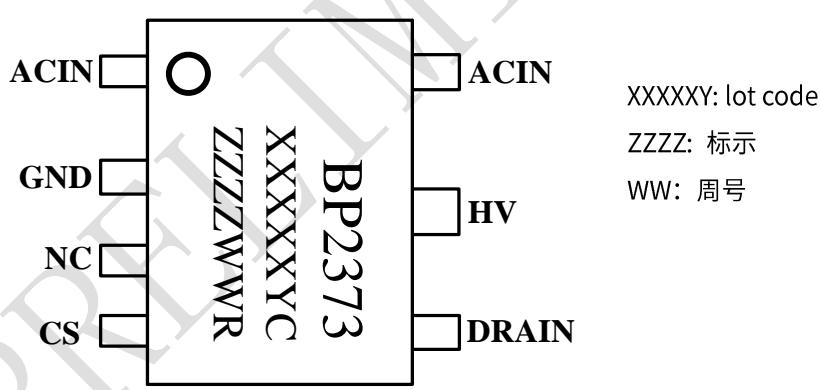
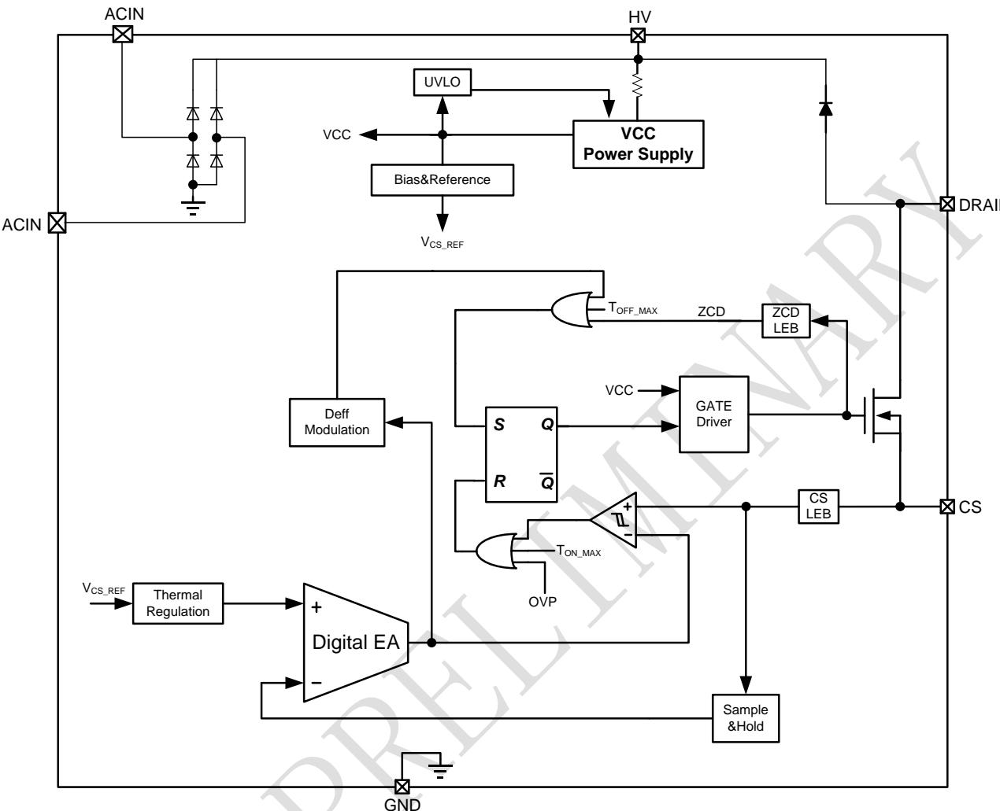
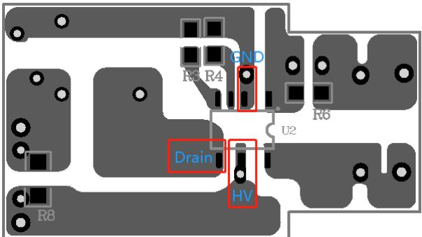
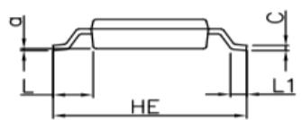
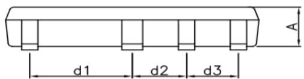
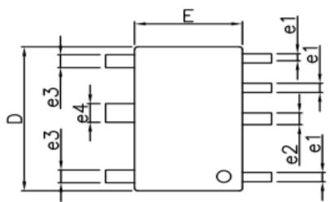
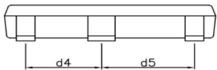

## 概述

BP2373CR 是一款带有源功率因素校正的高精度非隔离型降压型 PFC LED 驱动芯片，专为通用电源设计且具有恒流控制作用。且 BP2373CR 工作在临界导通模式，减小了开关损耗并优化了 EMI。

BP2373CR 集成整流桥，续流二极管，VCC,COMP 电容以此简化外部电路。它采用了特有的电流检测技术，减少了外部元件的同时可实现高精度输出电流，且拥有良好的线性调整率和负载调整率。

BP2373CR 具有多重保护功能以加强系统可靠性,包括 LED 短路保护,另外，BP2373CR 具有过热调节功能，在驱动电源过热时减小输出电流，以提高系统的可靠性。

## 特点

■ 有源功率因数校正，0.7 PF

■ 无 VCC 和 COMP 电容

■ 集成 600V 超快恢复二极管

■ 集成 800V 整流桥

■ 外置电流采样电阻

■ 电感电流临界连续模式

■ LED 短路保护

逐周期电流限流

■ 过热调节功能

■ 采用 ASOP7 封装

## 应用

■ LED 球泡灯

■ LED 灯管

■ 其它LED照明

## 典型应用

ASOP7 封装

  
图 1 BP2373CR 典型应用图

## 芯片名称

## 定购信息

<table><tr><td>定购型号</td><td>封装</td><td>包装形式</td><td>打印</td></tr><tr><td>BP2373CR</td><td>ASOP7</td><td>编带5,000 颗/盘</td><td>BP2373XXXXYCZZZWWR</td></tr></table>

## 管脚封装

  
图 2 管脚封装图

## 管脚描述

<table><tr><td>管脚号</td><td>管脚名称</td><td>描述</td></tr><tr><td>1,7</td><td>ACIN</td><td>输入电压端</td></tr><tr><td>2</td><td>GND</td><td>芯片地</td></tr><tr><td>3</td><td>NC</td><td>无连接</td></tr><tr><td>4</td><td>CS</td><td>电流采样端,采样电阻接在 CS 和 GND 端之间</td></tr><tr><td>5</td><td>DRAIN</td><td>内部高压功率管漏极</td></tr><tr><td>6</td><td>HV</td><td>整流桥输出正极端(Vbus)</td></tr></table>

## 非隔离降压型有源 PFC LED 驱动芯片

## 极限参数(注 1)

<table><tr><td>符号</td><td>参数</td><td colspan="2">参数范围</td><td>单位</td></tr><tr><td>DRAIN</td><td>内部高压功率管漏极到源极峰值电压</td><td>C</td><td>-0.3~500</td><td>V</td></tr><tr><td>HV</td><td>整流桥后正极端,高压供电端</td><td colspan="2">-0.3~600</td><td>V</td></tr><tr><td>ACIN</td><td>输入电压端</td><td colspan="2">-0.3~800</td><td>V</td></tr><tr><td>CS</td><td>电流采样端</td><td colspan="2">-0.3~6</td><td>V</td></tr><tr><td> $P_{DMAX}$ </td><td>功耗(注2)</td><td colspan="2">0.45</td><td>W</td></tr><tr><td> $T_J$ </td><td>工作结温范围</td><td colspan="2">-40 to 150</td><td>°C</td></tr><tr><td> $T_{STG}$ </td><td>存储温度范围</td><td colspan="2">-55 to 150</td><td>°C</td></tr></table>

注1：最大极限值是指超出该工作范围，芯片有可能损坏。推荐工作范围是指在该范围内，器件功能正常，但并不完全保证满足个别性能指标。电气参数定义了器件在工作范围内并且在保证特定性能指标的测试条件下的直流和交流电参数规范。对于未给定上下限值的参数，该规范不予保证其精度，但其典型值合理反映了器件性能。  
注2：温度升高最大功耗一定会减小，这也是由 $T_{JMAX}, \theta_{JA}$ ，和环境温度 $T_A$ 所决定的。最大允许功耗为 $P_{DMAX} = (T_{JMAX} - T_A) / \theta_{JA}$ 或是极限范围给出的数字中比较低的那个值。

## 非隔离降压型有源 PFC LED 驱动芯片

电气参数(注3,4)（无特别说明情况下，HV=100V, $T_{A}=25^{\circ}C$ ）

<table><tr><td>符号</td><td>参数描述</td><td>条件</td><td>最小值</td><td>典型值</td><td>最大值</td><td>单位</td></tr><tr><td colspan="7">高压电源(HV)</td></tr><tr><td> $I_{CC}$ </td><td>IC工作电流</td><td></td><td></td><td>0.3</td><td>0.6</td><td>mA</td></tr><tr><td colspan="7">内部控制</td></tr><tr><td> $T_{ON\_MAX}$ </td><td>最大导通时间</td><td></td><td></td><td>20</td><td></td><td>us</td></tr><tr><td> $T_{OFF\_MIN}$ </td><td>最小关断时间</td><td></td><td></td><td>1.8</td><td></td><td>us</td></tr><tr><td> $T_{OFF\_MAX}$ </td><td>最大关断时间</td><td></td><td></td><td>260</td><td></td><td>us</td></tr><tr><td colspan="7">电流采样</td></tr><tr><td> $V_{CS\_LIMIT}$ </td><td>CS峰值电压限制</td><td></td><td></td><td>1.3</td><td></td><td>V</td></tr><tr><td> $T_{LEB\_CS}$ </td><td>电流采样前沿消隐时间</td><td></td><td></td><td>300</td><td></td><td>ns</td></tr><tr><td> $T_{DELAY}$ </td><td>芯片关断延迟</td><td></td><td></td><td>200</td><td></td><td>ns</td></tr><tr><td> $V_{REF}$ </td><td>内部基准电压</td><td></td><td>291</td><td>300</td><td>309</td><td>mV</td></tr><tr><td colspan="7">续流二极管</td></tr><tr><td> $V_R$ </td><td>击穿电压</td><td>IR=10uA</td><td>600</td><td></td><td></td><td>V</td></tr><tr><td> $I_{F(AV)}$ </td><td>最大平均导通电流</td><td>Tj≤150°C</td><td colspan="3">0.5</td><td>A</td></tr><tr><td> $V_F$ </td><td>导通压降</td><td>IF=0.5A</td><td></td><td></td><td>1.68</td><td>V</td></tr><tr><td> $T_{rr}$ </td><td>恢复时间</td><td>IF=0.5A, IR=1A, $I_{rr}$ =0.25A</td><td></td><td></td><td>35</td><td>ns</td></tr><tr><td colspan="7">功率MOSFET</td></tr><tr><td> $C_{RDS\_ON}$ </td><td>功率MOSFET导通电阻</td><td> $V_{GS}$ =10V/ $I_{DS}$ =0.5A</td><td></td><td>5.8</td><td></td><td>Ω</td></tr><tr><td> $BV_{DSS}$ </td><td>功率MOSFET击穿电压</td><td> $V_{GS}$ =0V/ $I_{DS}$ =250uA</td><td>500</td><td></td><td></td><td>V</td></tr><tr><td> $I_{DSS}$ </td><td>功率MOSFET漏电流</td><td> $V_{GS}$ =0V/ $V_{DS}$ =500V</td><td></td><td></td><td>1</td><td>uA</td></tr><tr><td colspan="7">过热调节部分</td></tr><tr><td> $T_{REG}$ </td><td>过热调节温度</td><td>IC Surface</td><td></td><td>140</td><td></td><td>°C</td></tr></table>

注3：典型参数值为 $25^{\circ} \mathrm{C}$ 下测得的参数标准。  
注4：规格书的最小、最大规范范围由测试保证，典型值由设计、测试或统计分析保证。

## 内部结构框图

  
图 3 BP2373CR 内部框图

## 应用信息

BP2373CR是一款带有有源功率因素校正的高精度非隔离降压PFC LED驱动芯片，专为具有恒流控制的通用电源而设计。系统工作在电感电流临界连续模式，可以实现0.7功率因数、较低的总谐波失真和高效率。

## 1 启动

在系统上电后，母线电压通过 HV 对芯片内部供电，当内部供电达到芯片开启阈值时，芯片内部控制电流开始工作，输出电压逐渐上升，电感峰值电流随之上升，从而实现输出 LED 电流的软启动，有效防止输出电流过冲。

## 2 恒流控制

BP2373CR 采用特有恒流算法，在 CS 端电压采样后与芯片内部基准电压进行比较，可以实现高精度输出恒流控制。

LED 输出电流计算方法：

$$
I _ {L E D} = \frac {V _ {R E F}}{R c s}
$$

其中，

$V_{REF}$ 是内部基准电压

$R_{cs}$ 是电流采样电阻的值

## 3 过热调节

BP2373CR 具有过热调节功能，在驱动电源过热时逐渐减小输出电流，从而控制输出功率和温升，使电源温度保持在设定值，以提高系统的可靠性。

## 4 保护功能

BP2373CR 内置多重保护功能，保证了系统可靠性。

当 LED 输出短路时，芯片工作开关频率将工作在 3kHz 左右。

## 非隔离降压型有源 PFC LED 驱动芯片

当输出短路或变压器饱和时，CS 峰值电压将会比较高。当 CS 电压上升到内部限制值（1.3V）时，该功率 MOS 管马上停止工作。此逐周期限流功能可以保护功率 MOS 管、功率电感和输出续流二极管。

## 5 PCB 设计

在设计 BP2373CR PCB 板时，需要注意以下事项：

尽量加大 GND Pin 铺铜，增强散热能力，电流采样电阻的功率地线尽可能短而粗。

## a) GND Pin

## b) 功率环路的面积

尽可能减小大电流环路的面积，以减小 EMI 辐射。

尽量加大 HV Pin 铺铜，以增强散热能力。

## d) DRAIN Pin

## c) HV Pin

尽量加大 DRAIN Pin 铺铜，以增强散热能力。

## Layout 布局

## 非隔离降压型有源 PFC LED 驱动芯片

## 封装信息(ASOP7)

<table><tr><td>Unit</td><td colspan="3">mm</td><td>Unit</td><td colspan="3">mm</td></tr><tr><td>/</td><td>min</td><td>typ</td><td>max</td><td>/</td><td>min</td><td>typ</td><td>max</td></tr><tr><td>A</td><td>1.05</td><td>1.15</td><td>1.25</td><td>d1</td><td>2.46</td><td>2.51</td><td>2.56</td></tr><tr><td>C</td><td>0.15</td><td>0.20</td><td>0.22</td><td>d2</td><td>1.28</td><td>1.33</td><td>1.38</td></tr><tr><td>D</td><td>6.0</td><td>6.2</td><td>6.4</td><td>d3</td><td>1.22</td><td>1.27</td><td>1.32</td></tr><tr><td>E</td><td>3.70</td><td>3.9</td><td>4.1</td><td>d4</td><td>2.18</td><td>2.23</td><td>2.28</td></tr><tr><td>HE</td><td>5.9</td><td>6.0</td><td>6.1</td><td>d5</td><td>2.68</td><td>2.73</td><td>2.78</td></tr><tr><td>L</td><td>0.95</td><td>1.05</td><td>1.15</td><td>e1</td><td>0.35</td><td>0.40</td><td>0.45</td></tr><tr><td>L1</td><td>0.40</td><td>/</td><td>0.80</td><td>e2</td><td>0.46</td><td>0.51</td><td>0.56</td></tr><tr><td rowspan="2">a</td><td rowspan="2" colspan="3">0.2 (ref)</td><td>e3</td><td>0.50</td><td>0.55</td><td>0.60</td></tr><tr><td>e4</td><td>0.75</td><td>0.80</td><td>0.85</td></tr></table>

## 免责声明

晶丰明源尽力确保本产品规格书内容的准确和可靠，但是保留在没有通知的情况下，修改规格书内容的权利。

本产品规格书未包含任何针对晶丰明源或第三方所有的知识产权的授权。针对本产品规格书所记载的信息，晶丰明源不做任何明示或暗示的保证，包括但不限于对规格书内容的准确性、商业上的适销性，特定目的的适用性或者不侵犯晶丰明源或任何第三人知识产权做任何明示或暗示保证，晶丰明源也不就因本规格书本身及其使用有关的偶然或必然损失承担任何责任。