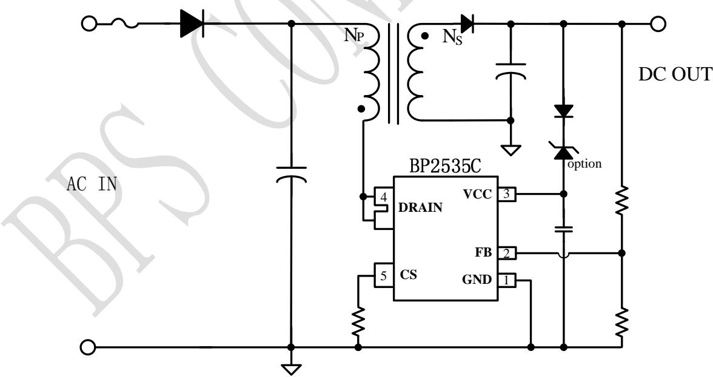
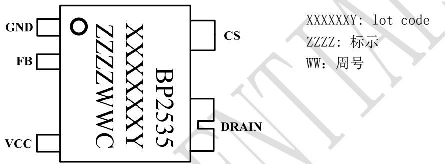
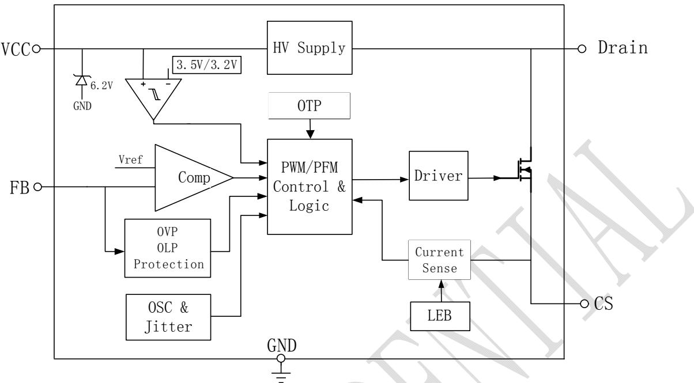
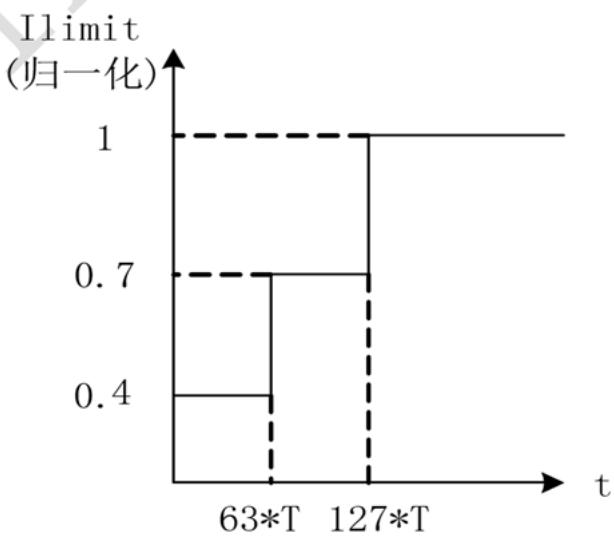

## 概述

BP2535C 是一款专利的超低待机功耗的恒压驱动芯片，待机功耗仅 1mW，能有效消除单火线应用中灯具关断时的微亮或闪烁问题。该芯片能够在85-265Vac 宽范围输入电压下正常工作，特别适用于单火线智能面板电源应用。

BP2535C 芯片内部集成 700V 功率开关，采用独有的电压电流控制技术，不需要外部环路补偿电容即可实现优异的恒压特性，极大的节约了系统成本和体积。

BP2535C 芯片采用多模式控制技术，有效降低系统待机功耗，提高效率和动态性能，并减小系统工作在轻载时的噪声。

BP2535C 采用 SOT33-5A 封装。

## 特点

 1mW 超低待机功耗@Vin=230Vac

 85-265Vac 宽范围输入电压

 内部集成 700V 功率管

 集成高压启动功能

 优异的动态响应

 减小音频噪声的降幅调制技术

 改善 EMI的抖频技术

 ±3%输出电压精度

 保护功能

 过载保护

 输出过压保护

 过温保护

 逐周期限流

## 应用

 单火线智能应用

 其他应用

## 典型应用

  
图 1 BP2535C 典型应用

## 定购信息

<table><tr><td>定购型号</td><td>封装</td><td>温度范围</td><td>包装形式</td><td>打印</td></tr><tr><td>BP2535C</td><td>SOT33-5A</td><td>-40°C 到 105°C</td><td>编带7,500 颗/盘</td><td>BP2535XXXXXYZZZZWWC</td></tr></table>

## 管脚封装

  
图 2 管脚封装图

## 管脚描述

<table><tr><td>管脚号</td><td>管脚名称</td><td>描述</td></tr><tr><td>1</td><td>GND</td><td>芯片地</td></tr><tr><td>2</td><td>FB</td><td>输出电压采样端。</td></tr><tr><td>3</td><td>VCC</td><td>芯片电源端</td></tr><tr><td>4</td><td>DRAIN</td><td>芯片内部高压功率管的漏极</td></tr><tr><td>5</td><td>CS</td><td>电流采样端,采样电阻接在CS和GND端之间</td></tr></table>

## 极限参数(注 1)

<table><tr><td>符号</td><td>参数</td><td>参数范围</td><td>单位</td></tr><tr><td> $V_{DS}$ </td><td>内部高压功率管漏极到源极峰值电压</td><td>-0.3~700</td><td>V</td></tr><tr><td> $I_{DMAX}$ </td><td>内部高压功率管峰值电流@  $T_J=100°C$ </td><td>500</td><td>mA</td></tr><tr><td>VCC</td><td>VCC电压</td><td>-0.3~7</td><td>V</td></tr><tr><td> $I_{CC\_MAX}$ </td><td>VCC引脚最大电源电流</td><td>10</td><td>mA</td></tr><tr><td>FB</td><td>输出电压选择端</td><td>-0.3~6</td><td>V</td></tr><tr><td>CS</td><td>电流采样端</td><td>-0.3~6</td><td>V</td></tr><tr><td> $P_{DMAX}$ </td><td>功耗(注2)</td><td>0.4</td><td>W</td></tr><tr><td> $θ_{JA}$ </td><td>PN结到环境的热阻</td><td>155</td><td>°C/W</td></tr><tr><td> $T_J$ </td><td>工作结温范围</td><td>-40 to 150</td><td>°C</td></tr><tr><td> $T_{STG}$ </td><td>储存温度范围</td><td>-55 to 150</td><td>°C</td></tr></table>

注 1：最大极限值是指超出该工作范围，芯片有可能损坏。推荐工作范围是指在该范围内，器件功能正常，但并不完全保证满足个别性能指标。电气参数定义了器件在工作范围内并且在保证特定性能指标的测试条件下的直流和交流电参数规范。对于未给定上下限值的参数，该规范不予保证其精度，但其典型值合理反映了器件性能。

注 2：温度升高最大功耗一定会减小，这也是由 TJMAX, θ 和环境温度T 所决定的。最大允许功耗为 $\mathrm { \Delta P _ { D M A X } \ = \Delta \left( T _ { J M A X } \mathrm { \Delta - \Delta T _ { A } } \right) / \Omega }$ θJA或是极限范围给出的数字中比较低的那个值。

## 芯片最大功率

<table><tr><td>型号</td><td>测试条件描述</td><td>限值范围</td><td>单位</td></tr><tr><td>BP2535C</td><td>输入电压 85Vac-265Vac</td><td>2</td><td>W</td></tr></table>

电气参数(注 3, 4)（无特别说明情况下， $\mathrm { T } _ { \mathrm { A } } = 2 5 ^ { \circ } \mathrm { C } )$

<table><tr><td>符号</td><td>描述</td><td>条件</td><td>最小值</td><td>典型值</td><td>最大值</td><td>单位</td></tr><tr><td colspan="7">电源电压 VCC</td></tr><tr><td> $V_{CC_ON}$ </td><td> $V_{CC}$ 开启电压</td><td>Rising</td><td>3.8</td><td>4.3</td><td>4.8</td><td>V</td></tr><tr><td> $V_{CC_OFF}$ </td><td> $V_{CC}$ 关断电压</td><td>Falling</td><td>2.7</td><td>3.2</td><td>3.7</td><td>V</td></tr><tr><td> $\begin{array}{c}V_{CC\_CHRG}^{(注5)}\\ \end{array}$ </td><td> $V_{CC}$ 充电开启电压</td><td>Falling</td><td></td><td>3.5</td><td>4.0</td><td>V</td></tr><tr><td> $V_{CC\_CLAMP}$ </td><td> $V_{CC}$ 引脚箝位电压</td><td> $I_{CLAMP}=1mA$ </td><td>6.0</td><td>6.4</td><td>6.8</td><td>V</td></tr><tr><td> $\begin{array}{c}V_{CC\_OVP}^{(注5)}\\ \end{array}$ </td><td> $V_{CC}$ 过压保护阈值</td><td></td><td>6.3</td><td>6.7</td><td>7.1</td><td>V</td></tr><tr><td> $I_{CC\_OP}$ </td><td> $V_{CC}$ 工作电流</td><td> $V_{CC}=5V,V_{FB}=1V,V_{DRAIN}=2V$ </td><td></td><td>350</td><td>500</td><td>uA</td></tr><tr><td> $I_{Q\_SKIP\_MODE}$ </td><td> $V_{CC}$ Skip Mode 静态电流</td><td> $V_{CC}=5V,V_{FB}=1.4V,V_{DRAIN}=2V$ </td><td></td><td>30</td><td>50</td><td>uA</td></tr><tr><td> $I_{CC\_ST}$ </td><td> $V_{CC}$ 启动电流</td><td></td><td></td><td>2</td><td></td><td>mA</td></tr><tr><td colspan="7">电压反馈 FB</td></tr><tr><td> $V_{FB_EA\_REF}$ </td><td>内部误差放大器基准</td><td></td><td>1.18</td><td>1.22</td><td>1.27</td><td>V</td></tr><tr><td> $V_{FB\_OVP}$ </td><td>输出过压阈值</td><td></td><td></td><td>1.4</td><td></td><td>V</td></tr><tr><td> $V_{FB\_OLP}$ </td><td>输出过载阈值</td><td></td><td></td><td>0.8</td><td></td><td>V</td></tr><tr><td colspan="7">振荡器</td></tr><tr><td> $F_{OSC\_MAX}$ </td><td>最大开关频率</td><td></td><td>58</td><td>68</td><td>78</td><td>kHz</td></tr><tr><td> $D_{MAX}$ </td><td>最大占空比</td><td></td><td></td><td>80</td><td></td><td>%</td></tr><tr><td colspan="7">电流采样</td></tr><tr><td> $V_{CS\_TH}$ </td><td>电流检测阈值</td><td></td><td>250</td><td>300</td><td>350</td><td>mV</td></tr><tr><td> $T_{LEB}$ </td><td>前沿消隐时间</td><td></td><td></td><td>240</td><td></td><td>ns</td></tr><tr><td> $T_{ILD}$ </td><td>电流限流延迟</td><td></td><td></td><td>100</td><td></td><td>ns</td></tr><tr><td colspan="7">功率管</td></tr><tr><td> $R_{DS\_ON}$ </td><td>功率管导通阻抗</td><td> $I_{DS}=10mA$ </td><td></td><td>17</td><td>21</td><td>Ω</td></tr><tr><td> $I_{DSS}$ </td><td>功率管关断漏极漏电流</td><td> $V_{CC}=5V/V_{DS}=700V$ </td><td></td><td></td><td>50</td><td>uA</td></tr><tr><td> $BV_{DSS}$ </td><td>功率管的击穿电压</td><td> $V_{GS}=0V/I_{DS}=250uA$ </td><td>700</td><td></td><td></td><td>V</td></tr><tr><td> $\begin{array}{c}V_{DS\_SUP}^{(注5)}\\ \end{array}$ </td><td>漏极供电电压</td><td></td><td>30</td><td></td><td></td><td>V</td></tr><tr><td colspan="7">过热保护</td></tr><tr><td> $T_{SD}$ </td><td>过热调节温度</td><td></td><td></td><td>150</td><td></td><td>°C</td></tr></table>

注 3：典型参数值为25˚C下测得的参数标准。  
注 4：规格书的最小、最大规范范围由测试保证，典型值由设计、测试或统计分析保证。  
注 5：设计或统计分析保证。

## 内部结构框图

  
图 3 BP2535C 内部框图

## 应用信息

BP2535C 是一款专利的超低待机功耗的恒压驱动芯片，能够在 85-265Vac 宽范围输入电压下正常工作。芯片内部集成 700V功率开关，只需要极少的外围组件就可以达到优异的恒压特性。特别适用于单火线智能面板电源应用。 o

## 启动

系统上电后，母线电压直接通过 Drain 端对 VCC电容充电，当 $\mathrm { V _ { C C } }$ 电压达到芯片开启阈值时，芯片内部控制电路开始工作。BP2535C 内置6.2V 稳压管，用于钳位 $\mathrm { V _ { C C } }$ 电压。芯片正常工作时，需要的 VCC电流极低，可以直接从输出通过二极管给 VCC供电。

## 软启动

芯片具有软启动功能，在软启动过程中，会分段增加原边峰值电流以减小开关应力，每一次重启都会经历软启动的过程。

## 输出电压设置

BP2535C 通过 FB 分压电阻直接反馈输出电压，采样电压与内部基准比较形成闭环后，来恒定输出电压Vo。

$$
V O = \frac {1 . 2 * (R _ {F B L} + R _ {F B H})}{R _ {F B L}}
$$

其中，RFBL是FB 下拉电阻，RFBH是FB上拉电阻。

## 峰值电流设置

芯片逐周期检测电感的峰值电流，CS 端连接到内部的峰值电流比较器的输入端，与内部阈值电压进行比较，当 CS外部电压达到内部检测阈值时，功率管关断。

满载时电感峰值电流的表达式为：

$$
I _ {\mathrm {P\_PK}} = \frac {3 0 0}{R _ {C S}} (m A)
$$

CS 比较器的输出还包括一个 240nS 前沿消隐时间。副边峰值电流计算方法：

$$
I _ {\mathrm {S\_PK}} = I _ {\mathrm {P\_PK}} \times \frac {N _ {P}}{N _ {S}}
$$

其中， $\mathrm { N p }$ 是变压器主级的匝数，Ns是变压器次级的匝数， $I _ { \mathrm { P \_ P K } }$ 是主级侧的峰值电流， $I _ { \mathrm { S , P K } }$ 是次级侧的峰值电流。

## 变压器设计

BP2535C 可工作于 CCM、DCM 等多种工作模式，对于变压器的选择包括感量、峰值电流、磁芯尺寸以及线径等。最终根据变压器价格、尺寸以及系统效率来决定变压器的大小。小感量变压器可以减小尺寸、降低价格，但会增大电感的峰值电流和输出纹波并且降低系统效率，相反的，大感量变压器可以提高效率。根据原边电感纹波电流系数 $K _ { R P }$ 来设定工作模式， $K _ { R P } = 1$ 为 DCM 模式， $K _ { R P } < 1$ 为 CCM 模式。然后根据输入/输出电压、系统最大 Ton 时间、电感纹波电流 $\Delta I _ { P L }$ 估算电感感量。

$$
\begin{array}{c} T _ {O N M A X} = \frac {V _ {O R}}{(V _ {I N M I N} + V _ {O R}) * F _ {S W M A X}} \\ \mathrm{Lp} = \frac {V _ {I N M I N} \times T _ {O N M A X}}{\Delta I _ {P L}} \end{array}
$$

其中

$$
\begin{array}{r l} & {V _ {O R} \text {为反射电压}} \\ & {\Delta I _ {P L} = I _ {P K 1} * K _ {R P}} \\ & {K _ {R P} = \frac {I _ {P K 1} - I _ {P K 2}}{I _ {P K 1}}} \end{array}
$$

## 输入电容的选择

输入电容的选取与输入电压范围以及输出带载能力有关。一个总的原则是此电容越大，带载能力越强，但体积和成本会增加，需要折衷考虑。

另外电解电容存在漏电流，尤其高温下会更明显，此漏电流会经过灯泡引起微亮。为了减小漏电流，建议输入电容选择 CBB电容。

## 输出电容的选择

输出电容的作用是输出电压的滤波以及输出动态电流的供应。当输出电流恒定时，输出纹波主要由输出电容的 ESR 以及容量决定。

$$
\begin{array}{r l} & V _ {R I P P L E} = V _ {R I P P L E \_ E S R} + V _ {R I P P L E \_ C} \\ & V _ {R I P P L E \_ E S R} = \Delta I _ {S L} \times E S R \\ & V _ {R I P P L E \_ C} = \frac {\Delta I _ {S L} \times T o n}{C _ {O U T}} \end{array}
$$

## 二极管选择

为了提高效率，尽量使用具有快恢复时间和低导通压降的二极管作为续流二极管。

## 多模式控制

BP2535C 芯片采用 PWM/PFM 多模式控制技术，能有效降低系统待机功耗，提高效率，并减小系统工作在轻载时的噪声。

## 输出电压过压/过载、短路保护

BP2535C 通过 FB 引脚来实现输出电压的过压与过载、短路保护,当 FB 电压高于 1.4V，芯片即实现输出过压保护，停止开关动作。当 FB 电压下降到低于1.4V，芯片会继续开关动作。

当 FB 电压低于 0.8V，且保持 100ms，芯片即实现输出过载保护。过载保护后，功率 MOSFET 关断，芯片振荡器工作在最低频率为 1.5KHz，保护发生后，芯片会定时 1.4s 重新检测 FB 电压，如果过载、短路解除，则正常工作，如未解除，继续保护。

## 其它保护功能

BP2535C 内置多种保护功能，包括过温保护，逐周期限流等。

## PCB 设计

在设计 BP2535C PCB 时，需要遵循以下建议：

## ·旁路电容

VCC的旁路电容需要紧靠芯片 VCC和GND 引脚。

## ·芯片 GND

电流采样电阻的功率地线尽可能短，且要和芯片的地线及其它小信号的地线分头接到母线电容的地端。

## ·FB 引脚

接到 FB 的分压电阻必须靠近 FB 引脚，且节点要远离输出电压、整流桥地和母线电压,防止 FB 采样信号受到干扰。FB 引脚需要加贴片电容到 GND 做滤

波，来减小噪声干扰。

## ·功率环路的面积

减小功率环路的面积，如输入母线电容、变压器原边、芯片 DRAIN 引脚、CS 电阻以及 GND 之间的环路，输出电容、变压器副边、输出整流管之间的环路以减小 EMI 辐射。

## ·DRAIN 引脚

增加 DRAIN引脚的敷铜面积以提高芯片散热，但是过大的铺铜面积会使 EMI辐射变差。DRAIN 引脚尽量远离低压引脚和元器件。

<table><tr><td rowspan="2">SYMBOL</td><td colspan="3">MILLIMETER</td></tr><tr><td>MIN</td><td>NOM</td><td>MAX</td></tr><tr><td>A</td><td>—</td><td>—</td><td>1.30</td></tr><tr><td>A1</td><td>0.05</td><td>—</td><td>0.15</td></tr><tr><td>A2</td><td>1.05</td><td>1.10</td><td>1.15</td></tr><tr><td>A3</td><td>0.50</td><td>0.55</td><td>0.65</td></tr><tr><td>a</td><td>0.52</td><td>—</td><td>0.60</td></tr><tr><td>a1</td><td>0.51</td><td>0.54</td><td>0.57</td></tr><tr><td>b</td><td>0.58</td><td>—</td><td>0.66</td></tr><tr><td>b1</td><td>0.57</td><td>0.60</td><td>0.63</td></tr><tr><td>c</td><td>0.15</td><td>—</td><td>0.19</td></tr><tr><td>c1</td><td>0.14</td><td>0.15</td><td>0.16</td></tr><tr><td>d</td><td>0.38</td><td>—</td><td>0.46</td></tr><tr><td>d1</td><td>0.37</td><td>0.40</td><td>0.43</td></tr><tr><td>D</td><td>3.80</td><td>3.90</td><td>4.00</td></tr><tr><td>E1</td><td>2.50</td><td>2.60</td><td>2.70</td></tr><tr><td>E</td><td>3.80</td><td>4.00</td><td>4.20</td></tr><tr><td>e</td><td colspan="3">0.90BSC</td></tr><tr><td>e1</td><td colspan="3">0.81 BSC</td></tr><tr><td>e2</td><td colspan="3">1.25 BSC</td></tr><tr><td>L</td><td>0.40</td><td>0.50</td><td>0.60</td></tr><tr><td>L1</td><td colspan="3">0.70REF.</td></tr><tr><td>θ</td><td>0</td><td>—</td><td>8°</td></tr></table>