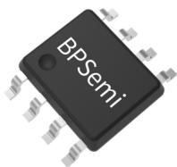
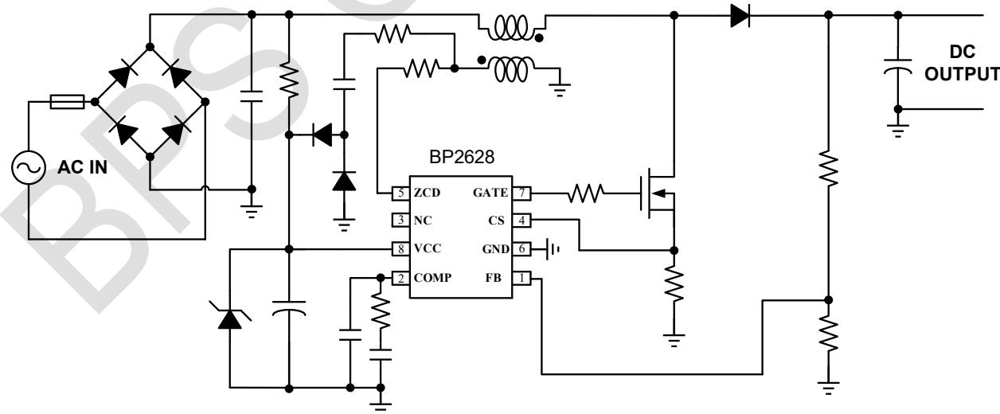
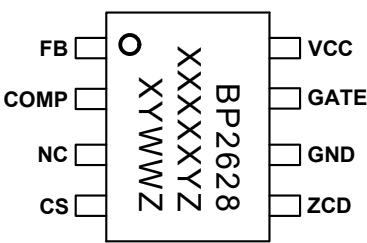
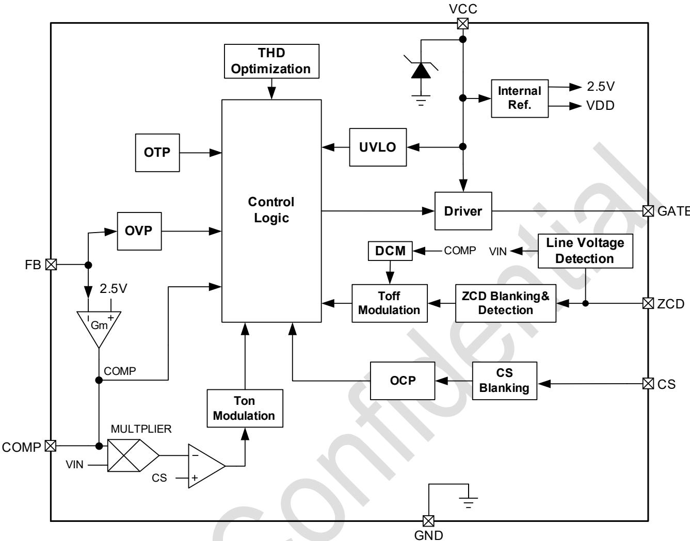
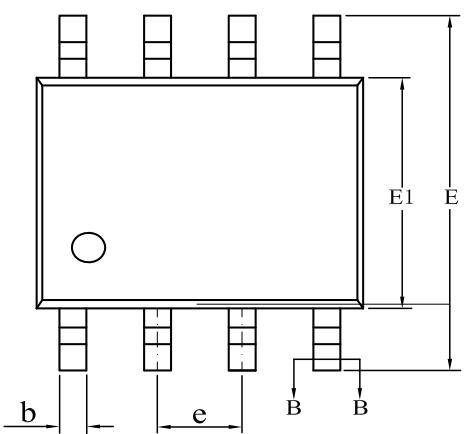
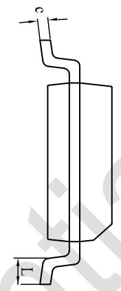
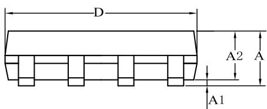
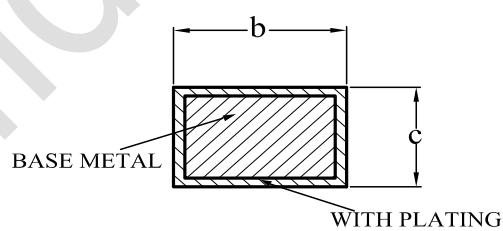

## 高 PF、低谐波的 Boost PFC 控制器

## 概述

BP2628 是一款具有极低谐波的 PFC 恒压控制芯片，专为中大功率 LED 照明领域的应用而设计。

BP2628 内置 THD 补偿功能，即使轻载条件下也能提供优异的 PF 和 THD，同时采用了增强型 EA，动态特性好，负载突变输出电压变化少，特别适用于 LED 调光灯具等应用。

BP2628 控制的 Boost PFC 电路工作于电感电流临界连续模式（BCM）或断续模式（DCM），因此功率二极管零电流关断，不存在反向恢复问题，有助于实现更高的转换效率，同时抑制电磁干扰(EMI)。

BP2628 内置多重保护功能，包括 UVLO 保护、输出过压保护、逐周期限流保护、芯片温度过温保护等。

BP2628 采用 SOP-8 封装。

  
SOP-8 封装

## 特点

■ 低谐波和高 PF，满足 IEC61000-3-2 标准

■ BCM 和 DCM 混合模式控制，轻负载下输出电压稳定。DCM 模式下功率管存在非谷底导通。

■ 采用增强型 EA，动态特性好，负载突变输出电压变化少

■ 开机启动/负载切换无噪声

■ 图腾柱式输出，高达-1000mA/+500mA 的驱动能力

■ 高精度内部参考电压(+/-2%)

■ 宽 VCC 电压范围

■ 低启动电流消耗

■ 内部集成保护功能

逐周期峰值过流保护

\- 输出过压保护

\- 集成式过温保护

采用 SOP-8 封装

## 应用领域

非调光LED驱动电源

■ 固定负载开关电源

## 典型应用

  
图 1 BP2628 典型应用电路  
注：该线路及参数仅供参考，实际应用电路和参数请通过试验充分验证。仅建议用作输出为固定负载的应用场合，如负载可变，请使用BP2628D。

## 定购信息

<table><tr><td>定购型号</td><td>封装</td><td>包装形式</td><td>打印</td></tr><tr><td>BP2628</td><td>SOP-8</td><td>卷盘4,000/盘</td><td>BP2628XXXXXYZYWWZ</td></tr></table>

## 管脚封装

  
BP2628: 产品型号  
XXXXXY: 批次  
XY: 标识  
图 2 SOP-8 管脚封装图

WW: 周号

Z: 预留

## 管脚描述

<table><tr><td>管脚号</td><td>管脚名称</td><td>描述</td></tr><tr><td>1</td><td>FB</td><td>输出电压采样引脚,与电压误差放大器反相输入端相连。</td></tr><tr><td>2</td><td>COMP</td><td>电压环路补偿引脚,与内部误差放大器的输出端相连。</td></tr><tr><td>3</td><td>NC</td><td>悬空</td></tr><tr><td>4</td><td>CS</td><td>电流采样引脚,当CS电压达到控制电压或过流保护值时,停止开关导通。</td></tr><tr><td>5</td><td>ZCD</td><td>过零检测引脚,当GATE电压高时,通过流出ZCD引脚的电流检测输入电压。当GATE电压低时,通过检测ZCD的电平实现电感退磁检测。</td></tr><tr><td>6</td><td>GND</td><td>芯片地</td></tr><tr><td>7</td><td>GATE</td><td>驱动信号输出引脚,与功率MOSFET的栅极连接。</td></tr><tr><td>8</td><td>VCC</td><td>芯片供电引脚,当 $V_{CC}$ 电压大于 $V_{CC\_ON}$ 后开始工作。当 $V_{CC}$ 电压低于 $V_{CC\_UVLO}$ 后停止工作。</td></tr></table>

## 极限参数(注1)

<table><tr><td>符号</td><td>参数</td><td>参数范围</td><td>单位</td></tr><tr><td> $V_{CC}$ </td><td>VCC引脚电压范围</td><td>-0.3~30</td><td>V</td></tr><tr><td> $V_{GATE}$ </td><td>GATE引脚电压范围</td><td>-0.3~30</td><td>V</td></tr><tr><td> $V_{IO}$ </td><td>FB/CS/COMP/ZCD等引脚电压范围</td><td>-0.3~6</td><td>V</td></tr><tr><td> $P_{DMAX}$ </td><td>功耗(注2)</td><td>0.45</td><td>W</td></tr><tr><td> $\theta_{JA}$ </td><td>PN结到环境的热阻(注3)</td><td>145</td><td>°C/W</td></tr><tr><td> $T_J$ </td><td>工作结温范围</td><td>-40~150</td><td>°C</td></tr><tr><td> $T_{STG}$ </td><td>储存温度范围</td><td>-55~150</td><td>°C</td></tr></table>

注 1：最大极限值是指超出该工作范围，芯片有可能损坏。推荐工作范围是指在该范围内，器件功能正常，但并不完全保证满足个别性能指标。电气参数定义了器件在工作范围内并且在保证特定性能指标的测试条件下的直流和交流电参数规范。对于未给定上下限值的参数，该规范不予保证其精度，但其典型值合理反映了器件性能。

注2：温度升高最大功耗一定会减小，这也是由 $T_{\mathrm{JMAX}}$ ， $\theta_{\mathrm{JA}}$ 和环境温度 $T_{\mathrm{A}}$ 所决定的。最大允许功耗为 $P_{\mathrm{DMAX}} = (T_{\mathrm{JMAX}} - T_{\mathrm{A}}) / \theta_{\mathrm{JA}}$ 或是极限范围给出的数字中比较低的那个值。

注3：1 平方英寸双层 PCB 板，按照 JEDEC 标准测试。

电气参数(注 4)（无特别说明情况下， $T_{A}=25^{\circ}C$ ）

<table><tr><td>符号</td><td>描述</td><td>条件</td><td>最小值</td><td>典型值</td><td>最大值</td><td>单位</td></tr><tr><td colspan="7">电源电压</td></tr><tr><td> $V_{CC\_CLAMP}$ </td><td> $V_{CC}$ 箱位电压</td><td> $I_{CC}=1mA$ </td><td>23.4</td><td>26</td><td>28.6</td><td>V</td></tr><tr><td> $V_{CC\_ON}$ </td><td> $V_{CC}$ 启动电压</td><td> $V_{CC}$ 上升</td><td>9.8</td><td>10.5</td><td>11.2</td><td>V</td></tr><tr><td> $V_{CC\_UVLO}$ </td><td> $V_{CC}$ 欠压保护阈值</td><td> $V_{CC}$ 下降</td><td>7.2</td><td>8.4</td><td>9.5</td><td>V</td></tr><tr><td> $I_{ST}$ </td><td> $V_{CC}$ 启动电流消耗</td><td> $V_{CC}=V_{CC\_ON}-1V$ </td><td>65</td><td>95</td><td>90</td><td>μA</td></tr><tr><td> $I_{QUIESCENT}$ </td><td> $V_{CC}$ 静态工作电流</td><td>无开关动作</td><td>420</td><td>570</td><td>700</td><td>μA</td></tr><tr><td colspan="7">误差放大器(COMP)</td></tr><tr><td>Gm</td><td>误差放大器跨导</td><td></td><td>51</td><td>64</td><td>77</td><td>μA/V</td></tr><tr><td> $V_{BURST}$ </td><td>BURST模式COMP电压</td><td></td><td>0.45</td><td>0.5</td><td>0.56</td><td>V</td></tr><tr><td> $I_{COMP}$ </td><td>误差放大器电流能力</td><td></td><td>6.5</td><td>9</td><td>11.5</td><td>μA</td></tr><tr><td colspan="7">电流采样(CS)</td></tr><tr><td> $V_{OCP1}$ </td><td>逐周期限流阈值(注5)</td><td></td><td></td><td>1</td><td></td><td>V</td></tr><tr><td> $T_{LEB1}$ </td><td>前沿消隐时间(注5)</td><td></td><td></td><td>200</td><td></td><td>ns</td></tr><tr><td> $V_{OCP2}$ </td><td>过流保护阈值(注5)</td><td></td><td></td><td>2.4</td><td></td><td>V</td></tr><tr><td> $V_{CS\_MIN}$ </td><td>CS峰值最小电压</td><td></td><td>28</td><td>40</td><td>52</td><td>mV</td></tr><tr><td colspan="7">电压检测(FB)</td></tr><tr><td> $V_{FB\_REF}$ </td><td>内部电压基准</td><td></td><td>2.45</td><td>2.5</td><td>2.55</td><td>V</td></tr><tr><td> $V_{FB\_OVP1}$ </td><td>过压保护阈值</td><td>FB上升</td><td>2.56</td><td>2.69</td><td>2.82</td><td>V</td></tr><tr><td> $V_{FB\_OVP2}$ </td><td>快速调节OVP阈值</td><td>FB上升</td><td>2.5</td><td>2.63</td><td>2.76</td><td>V</td></tr><tr><td> $V_{FB\_UVP1}$ </td><td>快速调节UVP阈值1</td><td>FB下降</td><td>2.12</td><td>2.3</td><td>2.48</td><td>V</td></tr><tr><td> $V_{FB\_UVP2}$ </td><td>快速调节UVP阈值2</td><td>FB下降</td><td>2.09</td><td>2.27</td><td>2.45</td><td>V</td></tr><tr><td> $V_{FB\_EN}$ </td><td>FB使能检测阈值电压</td><td>FB上升</td><td>0.45</td><td>0.5</td><td>0.56</td><td>V</td></tr><tr><td> $V_{FB\_HYS}$ </td><td>FB使能检测退出电压</td><td>FB下降</td><td>0.34</td><td>0.42</td><td>0.5</td><td>V</td></tr><tr><td colspan="7">过零检测(ZCD)</td></tr><tr><td> $V_{ZCD\_TH}$ </td><td> $V_{ZCD}$ 下降沿阈值(注5)</td><td></td><td></td><td>0.5</td><td></td><td>V</td></tr><tr><td> $V_{ZCD\_HYS}$ </td><td> $V_{ZCD}$ 检测回差(注5)</td><td></td><td></td><td>0.2</td><td></td><td>V</td></tr><tr><td colspan="7">内部时间控制</td></tr><tr><td> $F_{SW\_MAX}$ </td><td>最大开关频率</td><td></td><td>360</td><td>450</td><td>540</td><td>kHz</td></tr><tr><td> $T_{ON\_MIN}$ </td><td>最小开通时间</td><td></td><td>100</td><td>200</td><td>300</td><td>ns</td></tr><tr><td> $T_{ON\_MAX}$ </td><td>最大开通时间</td><td></td><td>22</td><td>30</td><td>38</td><td>μs</td></tr><tr><td> $T_{OFF\_MIN}$ </td><td>最小关断时间(注5)</td><td></td><td></td><td>1</td><td></td><td>μs</td></tr><tr><td> $T_{OFF\_MAX1}$ </td><td>最大关断时间1</td><td>FB&lt;2.3V</td><td>18</td><td>25</td><td>32</td><td>μs</td></tr><tr><td> $T_{OFF\_MAX2}$ </td><td>最大关断时间2</td><td>FB&gt;2.3V</td><td>38</td><td>50</td><td>62</td><td>μs</td></tr><tr><td colspan="7">栅极驱动(GATE)</td></tr><tr><td> $I_{SOURCE}$ </td><td>最大驱动上拉电流(注5)</td><td> $V_{GATE}=5V$ </td><td></td><td>500</td><td></td><td>mA</td></tr><tr><td> $I_{SINK}$ </td><td>最大驱动下拉电流(注5)</td><td> $V_{GATE}=5V$ </td><td></td><td>1000</td><td></td><td>mA</td></tr><tr><td colspan="7">OTP保护</td></tr><tr><td> $T_{OTP}$ </td><td>过温保护阈值(注5)</td><td></td><td>140</td><td>150</td><td>160</td><td>°C</td></tr><tr><td> $T_{OTP\_HYS}$ </td><td>过温保护迟滞(注5)</td><td></td><td>20</td><td>25</td><td>30</td><td>°C</td></tr></table>

注4：规格书的部分最小、最大规范范围由测试保证，典型值由设计、测试或统计分析保证。  
注5：设计保证。

## 内部结构框图

  
图 3 BP2628 内部框图

## 功能描述

BP2628 是一款具有低谐波的 PFC 恒压控制芯片，专为中大功率 LED 照明领域的应用而设计。BP2628 内置 THD 补偿功能，即使轻载条件下也能提供优异的 PF 和 THD，特别适用于 LED 调光灯具等应用。

## 启动

系统上电以后，当 VCC 电压达到芯片开启阈值时，若 FB 电压大于 $V_{FB\_EN}$ ，则芯片内部控制电路开始工作，COMP 电压开始快速上升，同时 BP2628 开始输出驱动信号，输出电压开始快速上升。

## VCC 设计

在实际应用中，若VCC引脚会进入到钳位工作状态，则必须在VCC引脚并联稳压管，且稳压管的稳压值 $\mathrm{V_Z}$ 应小于VCC内部钳位电压最小值（23.4V），一般选择 18-22V。

## 输出电压设置

BP2628 采用了闭环反馈机制对输出电压进行稳压，可实现高精度输出恒压控制。

Boost 稳态输出电压计算方法：

$$
V _ {o u t} \approx V _ {R E F} \times \left(\frac {R _ {U P}}{R _ {D O W N}} + 1\right)
$$

其中，

$V_{REF}$ 是内部基准电压。

$R_{UP}$ 是 FB 采样上电阻。

$R_{DOWN}$ 是 FB 采样下电阻。

## 过零检测和输入电压检测

BP2628 通过 ZCD 引脚检测电感电流过零的状态。当 GATE 关断且续流二极管续流结束时，负载绕组电压开始下降，ZCD 电压也随之下降。当 ZCD 电压低于退磁检测阈值时，BP2628 检测到退磁信号，并开始下一个导通周期。

ZCD 引脚还用来探测输入电压，用于 THD 补偿和导通时间控制。当 GATE 高电平时，辅助绕组电压变负，通过 ZCD 限流电阻的负向电流从 ZCD 往外流出。BP2628 通过检测该电流实现输入电压检测，用于 THD 补偿。

## 谐波补偿

BP2628 内置 THD 补偿，它通过 ZCD 引脚检测输入电压。当 MOS 导通时，ZCD 引脚流出电流。通过对该电流进行采样和保持可以检测到输入电压大小。当输入电压低时，BP2628 通过设置最小 CS 电压 $V_{CS\_MIN}$ 来加大 Ton 时间，从而减小整流桥的导通死区时间，改善 Boost PFC 因整流桥后薄膜电容引起的 THD 恶化。

由于 BP2628 设置的最小 CS 电压 $V_{CS\_MIN}$ 可跟随输入电压变化，因此当负载变轻、系统进入 DCM 模式后，输入电压波形也可得到改善，从而降低轻载时的输入电流谐波。

## BCM 和 DCM 模式

BP2628 在负载较重时工作于电感电流临界连续模式（BCM），能够降低导通损耗和 EMI，具有良好的重载效率。但是轻载时，BCM 模式受制于芯片的最小 Ton 限制，必须进入间歇工作模式才能保持输出电压稳定，否则系统会进入 OVP 保护模式，给深度调光的 LED 驱动设计带来很大的稳定性问题。进入间歇工作模式的 Boost PFC 系统，PF 和 THD 都会严重变差。

此外，BCM 模式的 Boost PFC 系统，当负载变轻以后，开关频率升高，系统的轻载效率急剧下降，EMI 也会变差。

BP2628 轻载工作时进入 DCM 模式，有助于限制开关频率，降低开关损耗。BP2628 通过检测 COMP 电压，能够在轻载时自动进入 DCM 模式，从而保持 Boost 输出电压维持稳定，同时保证良好的 PF 和极低的输入电流谐波。

## 增强型 EA

BP2628 采用增强型 EA 优化动态特性。当 FB 电压大于 $V_{FB\_OVP2}$ 时，COMP 对地接入 33kΩ 的等效电阻，加快对 COMP 电压放电。当 FB 电压下降到 $V_{FB\_OVP2}$ 时，33kΩ 电阻断开。

当 FB 电压低于 $V_{FB\_UVP2}$ 时，COMP 通过 39kΩ 的等效电阻上拉到内部 VDD 电压，加快环路响应速度。当 FB 电压介于 $V_{FB\_UVP2}$ 和 $V_{FB\_UVP1}$ 之间时，COMP 与 VDD 的上拉电阻变为 77kΩ。当 FB 电压大于 $V_{FB\_UVP1}$ 时，上拉电阻断开。

增强型 EA 有助于减小负载突变时的输出电压过冲和跌落，提高系统的稳定性，降低器件应力，对后级调节器更加有利。

## 保护功能

BP2628 内置多种保护功能，保证了系统可靠性。保护功能包括：输出过压保护（OVP）、VCC 欠压保护、逐周期限流保护、FB 短路保护、芯片过热保护等。

## 输出过压保护

Boost 过压保护电压基准为 $V_{FB\_OVP10}$ 。一旦因负载或输入电压突变导致 FB 电压达到 $V_{FB\_OVP1}$ ，芯片立即停止开关动作。当 FB 电压下降 50mV 后，芯片又重新开始进行开关动作。当 FB 电压大于 $V_{FB\_OVP1}$ 时，内部增强型 EA 会对 COMP 电压加速放电，若 COMP 电压低于 $V_{BURST}$ ，BP2628 也不会进行开关动作。

当负载持续变轻以后，COMP 电压会逐渐下降，一旦低于 $V_{BURST}$ ，BP2628 立即停止开关。此后输出电压开始下降，在补偿环路的调节作用下，COMP 又上升到 $V_{BURST}$ 以上，BP2628 又开始开关动作，输出电压开始上升。这种打嗝机制可以有效避免轻载和空载时输出电压飘高。

## VCC 欠压保护

当VCC电压低于 $\mathrm{V_{CC\_UVLO}}$ 时，BP2628立即停止开关动作，随后进入停止工作状态，此时芯片消耗的电流相对也较少。

## 逐周期峰值过流保护

BP2628 逐周期检测功率管的峰值电流，CS 端连接到芯片内部峰值电流比较器的输入端，与内部阈值电压进行比较，当 CS 电压达到内部检测阈值时，功率管关断。

逐周期保护电感峰值电流的计算公式为：

$$
\mathrm{I} _ {\mathrm{PK}} = \frac {\mathrm{V} _ {O C P 1}}{R _ {C S}}
$$

其中：

$V_{OCP1}$ 为逐周期过流保护阈值；

$R_{CS}$ 是电流采样电阻；

## FB 短路保护

BP2628 的 FB 引脚具有短路保护功能。若 FB 电压低于 $V_{FB\_EN}$ ,

BP2628 立即停止开关动作，GATE 引脚不输出开关信号。对于智能调光系统，用户也可通过 FB 脚的短路保护功能对 BP2628 进行 ON/OFF 控制，从而降低系统的待机功耗。

## 芯片过热保护

BP2628 具有过温保护功能，在驱动电源过温时会停止工作，从而降低电源温度，以提高系统的可靠性。芯片内部设定过温保护温度点为 $150^{\circ}$ C。

## PCB Layout 指南

在设计 BP2628 PCB 板时，需要注意以下事项：

1) VCC 的旁路电容需要紧靠芯片 VCC 和 GND 引脚。

2) Boost 输出电解电容的功率地走线尽可能粗且尽量靠近芯片地，以保证输出电压采样的准确性。功率管电流采样电阻的地必须尽量靠近芯片 CS 引脚。另外，信号地应单点连接到功率地。

3) 减小功率环路的面积，如母线电容、Boost 电感、功率管的环路面积以及母线电容、Boost 电感、续流二极管和输出电容的环路面积。芯片不应放置在功率环路内。

4) 连接 FB 引脚的分压电阻必须靠近 FB 引脚，且节点要远离变压器的动点，否则系统噪声容易误触发 FB OVP 保护功能。为防止误触发，可在 FB 引脚并联瓷片电容增强抗干扰性。

5) 连接 ZCD 引脚的电阻必须靠近 ZCD 引脚，且节点要远离变压器的动点，否则系统噪声容易影响过零信号的检测。

WITH PLATING

## 封装信息

  
SOP-8 封装外形尺寸

  
SECTION B-B

<table><tr><td rowspan="2">SYMBOL</td><td colspan="3">MILLIMETER</td></tr><tr><td>MIN</td><td>NOM</td><td>MAX</td></tr><tr><td>A</td><td>1.30</td><td>—</td><td>1.80</td></tr><tr><td>A1</td><td>0.10</td><td>—</td><td>0.25</td></tr><tr><td>A2</td><td>1.25</td><td>1.40</td><td>1.65</td></tr><tr><td>b</td><td>0.33</td><td>—</td><td>0.51</td></tr><tr><td>c</td><td>0.17</td><td>—</td><td>0.25</td></tr><tr><td>D</td><td>4.70</td><td>4.90</td><td>5.10</td></tr><tr><td>E</td><td>5.80</td><td>6.00</td><td>6.20</td></tr><tr><td>E1</td><td>3.70</td><td>3.90</td><td>4.10</td></tr><tr><td>e</td><td colspan="3">1.27BSC</td></tr><tr><td>L</td><td>0.40</td><td>—</td><td>1.00</td></tr></table>

## 版本信息

<table><tr><td>版本</td><td>日期</td><td>记录</td></tr><tr><td>Rev. 1.0</td><td>2021/04</td><td>首次发行</td></tr><tr><td>Rev. 1.1</td><td>2021/10</td><td>更改所涉 IEC 标准号;更新典型应用图</td></tr><tr><td>Rev. 1.2</td><td>2024/06</td><td> $I_{CC\_MAX}$ 参数“VCC 引脚最大电流”更新为“VCC 引脚最大电流@  $V_{CC\_CLAMP}$ ”</td></tr><tr><td>Rev. 1.3</td><td>2024/06</td><td>1、“典型应用电路”增加稳压二极管 2、“功能描述”增加“VCC 设计”部分,当 VCC 工作在钳位状态时,电路外围必须添加稳压二极管 3、删除  $I_{CC\_MAX}$ 参数。</td></tr><tr><td>Rev.1.4</td><td>2026/04</td><td>由于 DCM 模式存在非谷底开通,首页“特点”、“应用领域”及“典型应用电路”部分,建议仅用作固定负载驱动电源。如负载为可变负载,请使用 BP2628D。</td></tr><tr><td></td><td></td><td></td></tr></table>

## 免责声明

晶丰明源尽力确保本产品规格书内容的准确和可靠，但是保留在没有通知的情况下，修改规格书内容的权利。

本产品规格书未包含任何针对晶丰明源或第三方所有的知识产权的授权。针对本产品规格书所记载的信息，晶丰明源不做任何明示或暗示的保证，包括但不限于对规格书内容的准确性、商业上的适销性、特定目的的适用性或者不侵犯晶丰明源或任何第三人知识产权做任何明示或暗示保证，晶丰明源也不就因本规格书本身及其使用有关的偶然或必然损失承担任何责任。