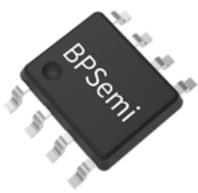
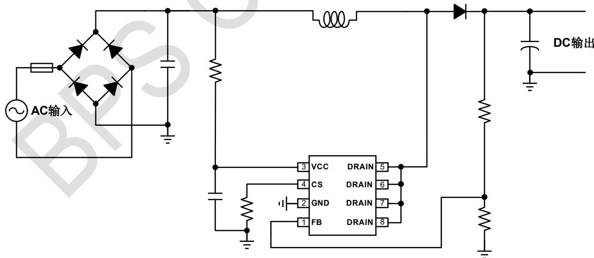
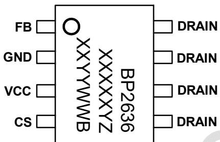
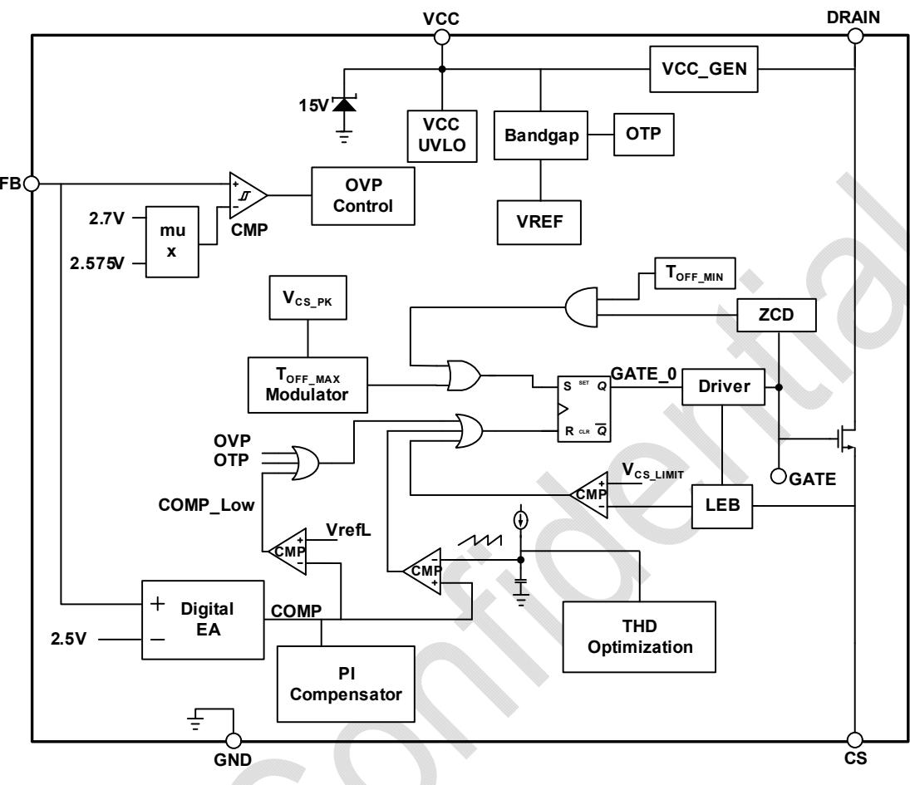
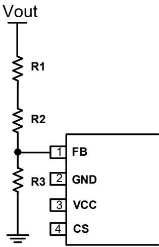
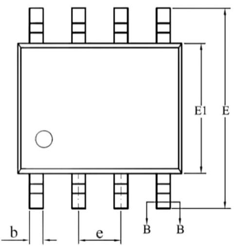
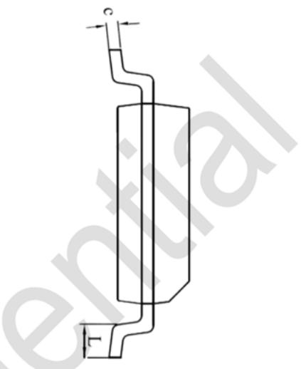
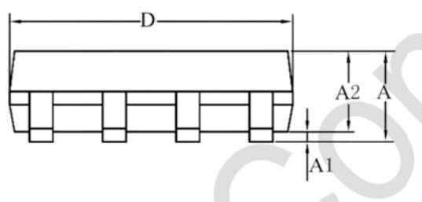
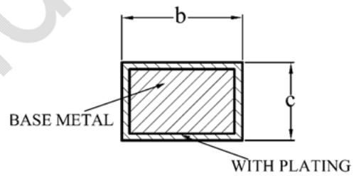

## 概述

BP2636B 是一款高效率、高 PF 值、低 THD 的升压型 PFC 恒压驱动芯片。芯片工作在电感电流临界连续模式，有助于优化 EMI 和效率。

BP2636B 通过 MOSFET 的栅极检测过零,无需辅助绕组。同时采用高压供电，内置环路补偿、内置 MOSFET，只需要很少的外围元件，即可实现优异的恒压特性，极大的节约了系统成本和体积。

BP2636B 具有多重保护功能, 包括输出过压保护 (OVP)、MOSFET 过流保护、芯片温度过热保护等。

BP2636B 采用 SOP-8 封装，引脚排布优化了散热能力。

  
SOP-8 封装

## 特点

■ 全压范围内 PF>0.9, THD<10%

■ 单绕组电感，外围精简

■ 内置 500V MOSFET

■ 临界连续电流控制模式

■ 高压快速启动

■ ±2%输出电压精度

■ 内部集成保护功能

\- 输出过压保护

\- MOSFET 过流保护

芯片供电欠压保护

\- 芯片温度过热保护

■ 采用 SOP-8 封装

## 应用领域

BOOST APFC 恒压电路

## 典型应用

  
图 1 BP2636B 典型应用电路

## 定购信息

<table><tr><td>定购型号</td><td>封装</td><td>包装形式</td><td>打印</td></tr><tr><td>BP2636B</td><td>SOP-8</td><td>卷盘4,000/盘</td><td>BP2636XXXXXYZXYYWWB</td></tr></table>

## 管脚封装

  
BP2636B: 产品型号  
XXXXXY: 批次  
图 2 管脚封装图

## 管脚描述

<table><tr><td>管脚号</td><td>管脚名称</td><td>描述</td></tr><tr><td>1</td><td>FB</td><td>Boost 输出电压和过压保护设置脚</td></tr><tr><td>2</td><td>GND</td><td>芯片地</td></tr><tr><td>3</td><td>VCC</td><td>芯片供电脚</td></tr><tr><td>4</td><td>CS</td><td>Boost 开关管电流采样脚</td></tr><tr><td>5, 6, 7, 8</td><td>DRAIN</td><td>内置 MOSFET 漏极</td></tr></table>

## 极限参数(注1)

<table><tr><td>符号</td><td>参数</td><td>参数范围</td><td>单位</td></tr><tr><td>VCC</td><td>芯片供电</td><td>-0.3~20</td><td>V</td></tr><tr><td> $V_{CC\_CLAMP}$ </td><td>VCC内部钳位电压</td><td>15</td><td>V</td></tr><tr><td>CS</td><td>电流采样端</td><td>-0.3~6</td><td>V</td></tr><tr><td>FB</td><td>输出电压和过压保护信号采样端</td><td>-0.3~6</td><td>V</td></tr><tr><td>DRAIN</td><td>内置 MOSFET 漏极</td><td>-0.3~500</td><td>V</td></tr><tr><td> $P_{DMAX}$ </td><td>功耗(注 2)</td><td>0.45</td><td>W</td></tr><tr><td> $\theta_{JA}$ </td><td>结到环境的热阻(注3)</td><td>145</td><td>°C/W</td></tr><tr><td> $T_J$ </td><td>工作结温范围</td><td>-40~150</td><td>°C</td></tr><tr><td> $T_{STG}$ </td><td>储存温度范围</td><td>-55~150</td><td>°C</td></tr><tr><td>ESD</td><td>人体模型 ESD(注 4)</td><td>2</td><td>kV</td></tr></table>

注1：最大极限值是指超出该工作范围，芯片有可能损坏。推荐工作范围是指在该范围内，器件功能正常，但并不完全保证满足个别性能指标。电气参数定义了器件在工作范围内并且在保证特定性能指标的测试条件下的直流和交流电参数规范。对于未给定上下限值的参数，该规范不予保证其精度，但其典型值合理反映了器件性能。

注2：温度升高最大功耗一定会减小，这也是由 $T_{JMAX}, \theta_{JA}$ ，和环境温度 $T_A$ 所决定的。最大允许功耗为 $P_{DMAX} = (T_{JMAX} - T_A) / \theta_{JA}$ 或是极限范围给出的数字中比较低的那个值。

注3：1平方英寸双层PCB板，按照JEDEC标准测试。

注4：按照JEDEC标准测试，100pF电容通过 $1.5\mathrm{K}\Omega$ 电阻放电。

电气参数(注5)（无特别说明情况下， $T_{A}=25^{\circ}C$ ）

<table><tr><td>符号</td><td>描述</td><td>条件</td><td>最小值</td><td>典型值</td><td>最大值</td><td>单位</td></tr><tr><td colspan="7">输入部分</td></tr><tr><td> $V_{CC\_CLAMP}$ </td><td> $V_{CC}$ 钳位电压</td><td> $I_{CC}=1mA$ </td><td>14</td><td>15</td><td>16</td><td>V</td></tr><tr><td> $V_{CC\_ON}$ </td><td> $V_{CC}$ 启动电压</td><td> $V_{CC}$ 上升</td><td>11</td><td>12.5</td><td>14</td><td>V</td></tr><tr><td> $V_{CC\_UVLO}$ </td><td> $V_{CC}$ 欠压保护阈值</td><td> $V_{CC}$ 下降</td><td>7</td><td>8</td><td>9</td><td>V</td></tr><tr><td> $I_{OP}$ </td><td>静态工作电流</td><td>无开关动作</td><td>285</td><td>380</td><td>475</td><td>uA</td></tr><tr><td colspan="7">MOSFET过流保护</td></tr><tr><td> $V_{CS\_LIM}$ </td><td>CS限流电压</td><td></td><td>450</td><td>500</td><td>550</td><td>mV</td></tr><tr><td colspan="7">输出电压控制</td></tr><tr><td> $V_{FB\_REF}$ </td><td>FB引脚基准电压</td><td></td><td>2.45</td><td>2.5</td><td>2.55</td><td>V</td></tr><tr><td> $V_{OVP\_REF}$ </td><td>OVP过压保护阈值</td><td></td><td>2.64</td><td>2.7</td><td>2.76</td><td>V</td></tr><tr><td> $V_{OVP\_REL}$ </td><td>退出OVP阈值</td><td></td><td>2.5</td><td>2.575</td><td>2.65</td><td>V</td></tr><tr><td colspan="7">内部时间控制</td></tr><tr><td> $T_{OFF\_MIN}$ </td><td>最小关断时间</td><td></td><td></td><td>3.3</td><td></td><td>us</td></tr><tr><td> $T_{OFF\_MAX1}$ </td><td>最大关断时间1</td><td> $V_{FB} \leqslant 1.7V$ </td><td></td><td>25</td><td></td><td>us</td></tr><tr><td> $T_{OFF\_MAX2}$ </td><td>最大关断时间2</td><td> $V_{FB}>1.7V$ </td><td>35</td><td>50</td><td>65</td><td>us</td></tr><tr><td> $T_{LEB}$ </td><td>前沿消隐时间</td><td></td><td></td><td>350</td><td></td><td>ns</td></tr><tr><td> $T_{ON\_MAX}$ </td><td>最大开通时间</td><td></td><td>30</td><td>35</td><td>40</td><td>us</td></tr><tr><td> $T_{DET\_BLANKING}$ </td><td>退磁检测屏蔽时间</td><td></td><td></td><td>1.3</td><td></td><td>us</td></tr><tr><td colspan="7">功率管</td></tr><tr><td> $R_{DS\_ON}$ </td><td>内置MOS导通阻抗</td><td> $V_{GS}=10V/ I_{DS}=1.0A$ </td><td></td><td>5.8</td><td>7</td><td>Ω</td></tr><tr><td> $BV_{DSS}$ </td><td>内置MOS击穿电压</td><td> $V_{GS}=0V/ I_{DS}=250uA$ </td><td>500</td><td></td><td></td><td>V</td></tr><tr><td colspan="7">过热保护</td></tr><tr><td> $T_{OTP}$ </td><td>过热保护温度</td><td></td><td></td><td>160</td><td></td><td>°C</td></tr><tr><td> $T_{OTP\_HYS}$ </td><td>过热保护迟滞</td><td></td><td></td><td>15</td><td></td><td>°C</td></tr></table>

注5：规格书的最小、最大规范范围由测试保证，典型值由设计、测试或统计分析保证。

## 内部结构框图

  
图 3 BP2636B 内部框图

## 功能描述

BP2636B 是一款高效率、高 PF 值、低 THD 的升压型 PFC 恒压驱动芯片。芯片工作在电感电流临界连续模式，有助于优化 EMI 和效率。

BP2636B 通过 MOSFET 的栅极检测过零，无需辅助绕组。同时采用高压供电，内置环路补偿、内置 MOS 管，只需要很少的外围元件，即可实现优异的恒压特性，极大的节约了系统成本和体积。

## 启动

系统上电后，母线电压通过内部高压 JFET 给 VCC 电容充电，当 VCC 电压达到芯片开启阈值时，芯片内部控制电路开始工作。BP2636B 内置 15V 稳压管，用于钳位 VCC 电压。为了降低芯片功耗，也可以外加电阻从输入母线给 VCC补电，减小 JFET 的供电电流。

## 输出恒压&输出 OVP 设置

输出电压由 FB 直接采样控制,芯片通过调节导通时间将 FB 电压控制在 2.5V。输出过压保护 (OVP) 也由 FB 采样控制,当 FB 电压达到 2.7V 时,系统触发 OVP。图 4 显示的是 FB 引脚外围电路。

  
图 4 FB 引脚应用示意图

输出电压平均值和过压保护值可以设置为：

$$
V _ {O U T} = \frac {R _ {1} + R _ {2} + R _ {3}}{R _ {3}} \times 2. 5 V
$$

$$
V _ {O V P} = \frac {R _ {1} + R _ {2} + R _ {3}}{R _ {3}} \times 2. 7 V
$$

其中：

$R_{3}$ 是反馈网络的下分压电阻；

$R_{1}$ 和 $R_{2}$ 是反馈网络的上分压电阻；

$V_{OUT}$ 是输出电压；

$V_{OVP}$ 是输出电压过压保护设定点；

为了提高系统效率，FB 下分压电阻可以设置在 5\~10KΩ 左右。为提高抗干扰性，FB 引脚可并联滤波电容。

## MOSFET 过流保护

芯片逐周期检测电感的峰值电流，CS 端连接到内部的峰值电流比较器的输入端，与内部阈值电压进行比较，当 CS 电压达到内部检测阈值时，功率管保护并关断。

电感峰值限流保护值的计算公式为：

$$
I _ {\mathrm{PK} \_ \mathrm{LMT}} = \frac {5 0 0}{R _ {C S}} (m A)
$$

其中， $R_{cs}$ 为电流采样电阻阻值。

CS 过流保护比较器的输出还包括一个 300ns 前沿消隐时间。

## Boost 电感

BP2636B 工作在电感电流临界模式，当功率管导通时，流过 Boost 电感的电流从零开始上升，导通时间为：

$$
t _ {o n} = \frac {L \times I _ {P K}}{V _ {I N}}
$$

其中，L 是电感量；

$I_{PK}$ 是电感电流的峰值；

$V_{IN}$ 是经整流后的母线电压。

芯片内部设定最大导通时间为 35us。

当功率管关断时，流过 Boost 电感的电流从峰值开始往下降，当电感电流下降到零时，芯片内部逻辑再次将功率管开通。功率管的关断时间为：

$$
t _ {o f f} = \frac {L \times I _ {P K}}{V _ {\mathrm{OUT}} - V _ {I N}}
$$

Boost 电感的计算公式为:

$$
L = \frac {\left(V _ {\mathrm{OUT}} - V _ {I N}\right) \times V _ {I N}}{f \times I _ {P K} \times V _ {\mathrm{OUT}}}
$$

其中：

f 为系统最小开关频率。BP2636B 的开关频率和输入电压有关。一般情况下，选择在输入电压有效值最低时的波峰处来设置系统的最低工作频率。

## 保护功能

BP2636B 内置多种保护功能，包括输出过压保护（OVP）、VCC 欠压保护、MOSFET 过流保护、芯片过热保护、FB 短路保护等。

## 输出过压保护

当输出负载开路时，随着输出电压的上升，OVP引脚电压同时上升。当OVP引脚电压达到2.7V时以上，会触发芯片过压保护逻辑并停止开关工作。当OVP电压降低到2.575V以下，芯片重新开始工作。

## MOSFET 过流保护

当输入电压降低时，电感峰值电流上升，电压越低峰值电流越大，芯片通过设置 CS 电阻来限制电感电流峰值，防止电流过大。

## 过温保护

当芯片结温超过 $160^{\circ}$ C，会触发过温保护，芯片停止工作，当结温低于 $145^{\circ}$ C 时，芯片恢复工作。

## FB 短路保护

当 FB 短路时， $V_{FB}$ 掉到 0.5V 以下，会触发芯片 FB 短路保护逻辑，并停止开关动作。故障撤除后，芯片恢复正常工作。

## PCB Layout 指南

在设计 BP2636B 应用 PCB 时，需要遵循以下建议：

1) VCC 的旁路电容需要紧靠芯片 VCC 和 GND 引脚。

2) FB 采样电阻需要尽量靠近芯片 FB 引脚，且 FB 节点要远离高压节点和噪声源。

3) 电流采样电阻的功率地线尽可能粗，且要离芯片的 GND 脚尽量近。另外，CS, FB 引脚的电阻到芯片 GND 脚的连线应尽可能短。

4) CS 引脚与采样电阻的连线需要尽量短，且靠近芯片，远离高压节点和噪声源。

5) 减小功率环路的面积，如功率管、母线电容和续流二极管的环路面积，以减小 EMI 辐射。

## 封装信息

SOP-8 封装外形尺寸  

<table><tr><td rowspan="2">SYMBOL</td><td colspan="3">MILLIMETER</td></tr><tr><td>MIN</td><td>NOM</td><td>MAX</td></tr><tr><td>A</td><td>1.30</td><td>—</td><td>1.80</td></tr><tr><td>A1</td><td>0.05</td><td>—</td><td>0.25</td></tr><tr><td>A2</td><td>1.25</td><td>1.40</td><td>1.65</td></tr><tr><td>b</td><td>0.33</td><td>—</td><td>0.51</td></tr><tr><td>c</td><td>0.17</td><td>—</td><td>0.25</td></tr><tr><td>D</td><td>4.70</td><td>4.90</td><td>5.10</td></tr><tr><td>E</td><td>5.80</td><td>6.00</td><td>6.20</td></tr><tr><td>E1</td><td>3.70</td><td>3.90</td><td>4.10</td></tr><tr><td>e</td><td colspan="3">1.27BSC</td></tr><tr><td>L</td><td>0.40</td><td>—</td><td>1.00</td></tr></table>

SECTION B-B

  
WITH PLATING

## 版本信息

<table><tr><td>版本</td><td>日期</td><td>记录</td></tr><tr><td>Rev.1.0</td><td>2021/04</td><td>首次发行</td></tr><tr><td></td><td></td><td></td></tr><tr><td></td><td></td><td></td></tr><tr><td></td><td></td><td></td></tr><tr><td></td><td></td><td></td></tr><tr><td></td><td></td><td></td></tr></table>

## 免责声明

晶丰明源尽力确保本产品规格书内容的准确和可靠，但是保留在没有通知的情况下，修改规格书内容的权利。

本产品规格书未包含任何针对晶丰明源或第三方所有的知识产权的授权。针对本产品规格书所记载的信息，晶丰明源不做任何明示或暗示的保证，包括但不限于对规格书内容的准确性、商业上的适销性、特定目的的适用性或者不侵犯晶丰明源或任何第三人知识产权做任何明示或暗示保证，晶丰明源也不就因本规格书本身及其使用有关的偶然或必然损失承担任何责任。