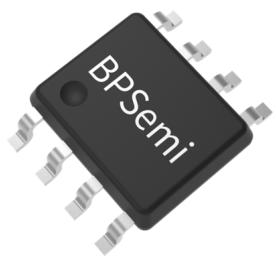
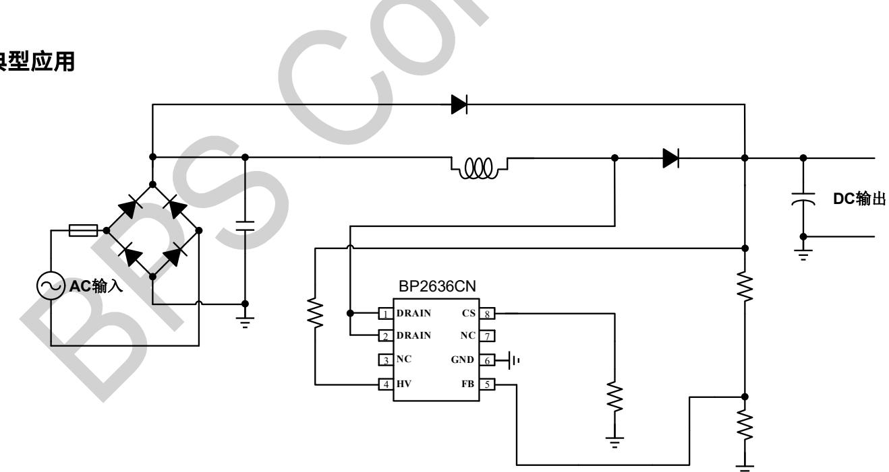
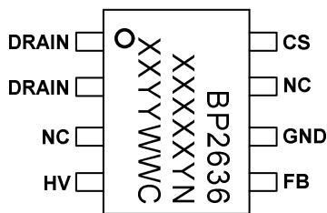
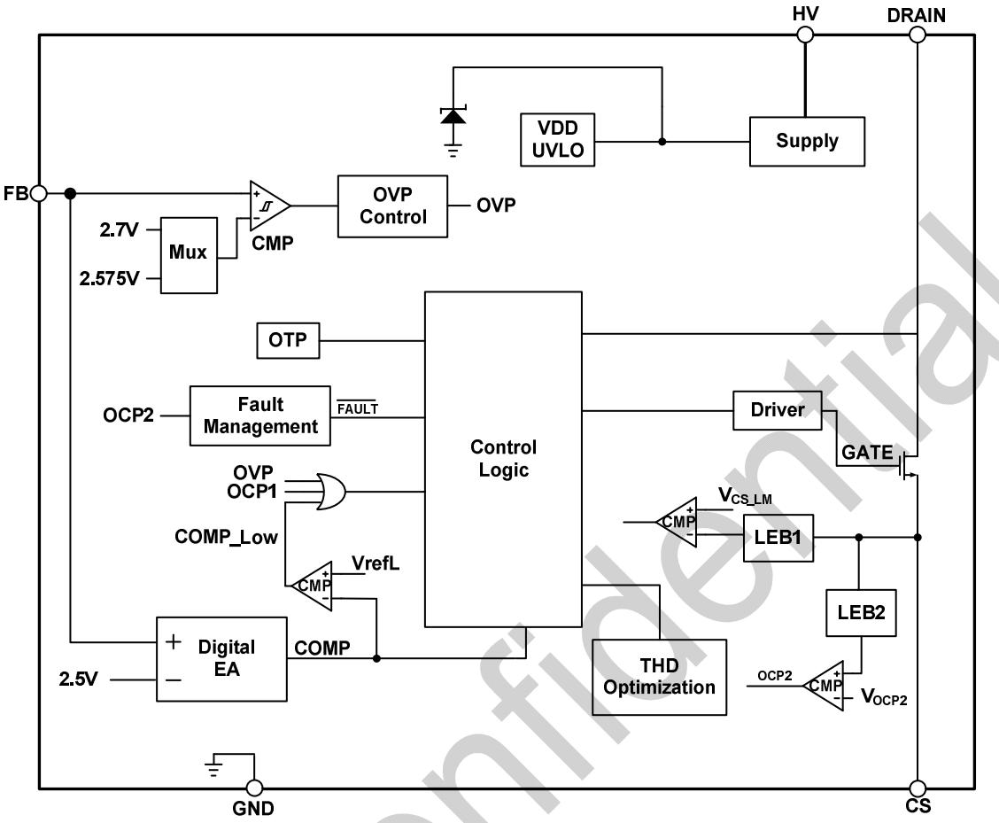
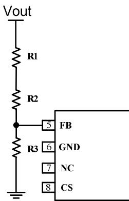
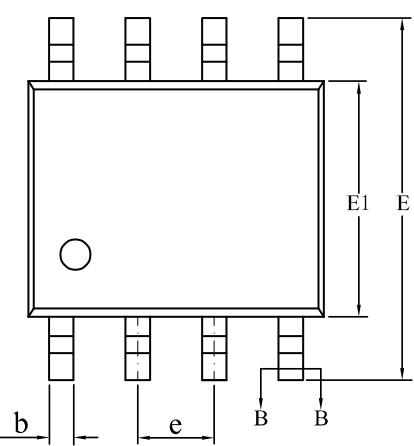
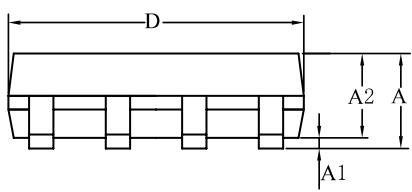
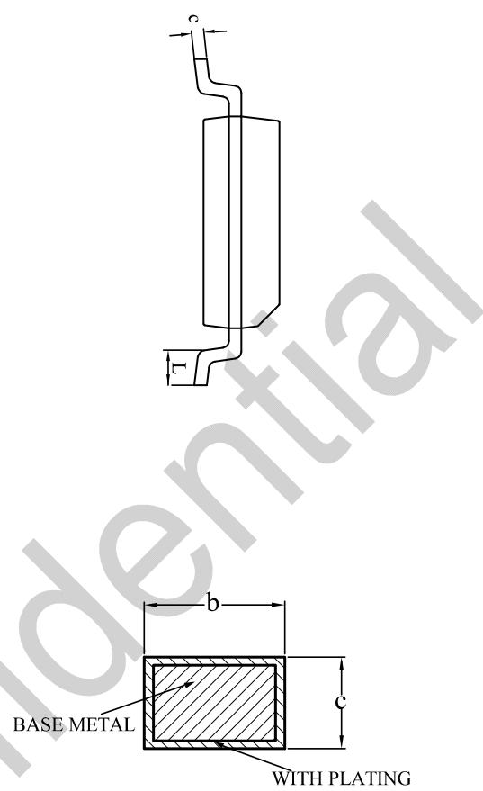

## 概述

BP2636CN 是一款高效率、高 PF 值、低 THD 的升压型 PFC恒压驱动芯片。芯片采用导通时间控制，同时工作在谷底开通模式，有助于优化 EMI 和效率。

BP2636CN 无需辅助绕组实现退磁检测；并且采用高压启动和供电，无需 Vcc 电容。同时内置环路补偿，只需要很少的外围元件，即可实现优异的恒压特性，极大地节约了系统成本和体积。

BP2636CN 具有多重保护功能，包括输出过压保护、FB 短路保护、功率开关管过流保护、芯片温度过热调节等。

BP2636CN 采用 SOP-8 封装

  
SOP-8 封装

## 特点

 无 Vcc 电容，节省成本

 230Vac，PF>0.9, THD<10%

 单绕组电感，外围精简

 谷底开通模式

 高压快速启动

 ±2%输出电压精度

 支持直流工作

 内部集成保护功能

 输出过压保护

 逐周期限流保护

 过温保护

## 应用领域

Boost APFC 恒压电路

## 典型应用

  
注：该线路及参数仅供参考，实际应用电路和参数请通过试验充分验证。  
图 1. BP2636CN 典型应用电路

## 定购信息

<table><tr><td>定购型号</td><td>封装</td><td>包装形式</td><td>打印</td></tr><tr><td>BP2636CN</td><td>SOP-8</td><td>卷盘4000颗/盘</td><td>BP2636XXXXYNXYYWWC</td></tr></table>

## 管脚封装

  
BP2636CN：产品型号  
XXXXXY: 批次号  
XXYY: 内部标示  
WW：周号  
图 2.SOP-8 管脚封装图

## 管脚描述

<table><tr><td>管脚号</td><td>管脚名称</td><td>描述</td></tr><tr><td>1, 2</td><td>DRAIN</td><td>内置 MOSFET 漏极</td></tr><tr><td>3, 7</td><td>NC</td><td>无连接</td></tr><tr><td>4</td><td>HV</td><td>芯片高压启动和供电引脚</td></tr><tr><td>5</td><td>FB</td><td>输出电压和过压保护设置引脚</td></tr><tr><td>6</td><td>GND</td><td>芯片地</td></tr><tr><td>8</td><td>CS</td><td>电流采样端,采样电阻接在 CS 与 GND 端之间</td></tr></table>

## 极限参数(注 1)

<table><tr><td>符号</td><td>参数</td><td>参数范围</td><td>单位</td></tr><tr><td>HV</td><td>高压启动和供电</td><td>-0.3~700</td><td>V</td></tr><tr><td>CS</td><td>电流采样端</td><td>-0.3~6</td><td>V</td></tr><tr><td>FB</td><td>输出电压和过压保护信号采样端</td><td>-0.3~6</td><td>V</td></tr><tr><td>DRAIN</td><td>内置 MOSFET 漏极</td><td>-0.3~500</td><td>V</td></tr><tr><td> $P_{DMAX}$ </td><td>功耗(注2)</td><td>0.45</td><td>W</td></tr><tr><td> $\theta_{JA}$ </td><td>结到环境的热阻(注3)</td><td>145</td><td>°C/W</td></tr><tr><td> $T_J$ </td><td>工作结温范围</td><td>-40~150</td><td>°C</td></tr><tr><td> $T_{STG}$ </td><td>储存温度范围</td><td>-55~150</td><td>°C</td></tr></table>

注 1：极限参数是指超出该范围，有可能导致器件永久性损坏。极限参数为器件应力的额定值，长期工作在极限参数条件可能会影响器件的可靠性。  
注 2：温度升高最大功耗一定会减小，这也是由 $T _ { \Delta M A X } , \theta _ { J A } ,$ 和环境温度TA所决定的。最大允许功耗为 $P _ { D M A X } = ( T _ { J M A X } - T _ { A } ) / \theta _ { J A }$ 或是极限范围给出的数字中比较低的那个值。  
注 3：1平方英寸双层 PCB板，按照JEDEC 标准测试。

## 推荐工作范围(注4)

<table><tr><td>符号</td><td>参数</td><td>参数范围</td><td>单位</td></tr><tr><td> $P_{OUT}$ </td><td>输出功率(输入电压230V±15%)</td><td>≤30</td><td>W</td></tr></table>

注 4：开放式条件下，50℃环境温度、芯片表面温升为60℃时对应的最大连续输出功率。若实际应用中散热条件更优，则允许的最大功率可以更大。

电气参数(注 5)（无特别说明情况下，TA=25℃）

<table><tr><td>符号</td><td>描述</td><td>条件</td><td>最小值</td><td>典型值</td><td>最大值</td><td>单位</td></tr><tr><td colspan="7">电流采样(CS)</td></tr><tr><td> $V_{CS\_LIM}$ </td><td>逐周期限流阈值</td><td></td><td>0.45</td><td>0.5</td><td>0.55</td><td>V</td></tr><tr><td> $T_{LEB1}$ </td><td>前沿消隐时间 1</td><td></td><td>250</td><td>350</td><td>480</td><td>ns</td></tr><tr><td> $V_{OCP2}$ </td><td>故障过流保护阈值</td><td></td><td></td><td>1</td><td></td><td>V</td></tr><tr><td> $T_{LEB2}$ </td><td>前沿消隐时间 2</td><td></td><td></td><td>200</td><td></td><td>ns</td></tr><tr><td colspan="7">输出电压控制 (FB)</td></tr><tr><td> $V_{FB\_REF}$ </td><td>FB 引脚基准电压</td><td></td><td>2.45</td><td>2.5</td><td>2.55</td><td>V</td></tr><tr><td> $V_{OVP\_REF}$ </td><td>FB OVP 保护阈值</td><td></td><td>2.64</td><td>2.7</td><td>2.76</td><td>V</td></tr><tr><td> $V_{OVP\_REL}$ </td><td>FB OVP 保护退出阈值</td><td></td><td>2.5</td><td>2.575</td><td>2.65</td><td>V</td></tr><tr><td> $V_{FB\_EN}$ </td><td>FB 使能阈值</td><td></td><td>0.45</td><td>0.5</td><td>0.55</td><td>V</td></tr><tr><td> $V_{FB\_DIS}$ </td><td>FB 关闭阈值</td><td></td><td>0.2</td><td>0.25</td><td>0.3</td><td>V</td></tr><tr><td colspan="7">内部时间控制</td></tr><tr><td> $T_{ON\_MAX}$ </td><td>最大开通时间</td><td></td><td>20</td><td>24</td><td>28</td><td>μs</td></tr><tr><td> $T_{OFF\_MAX}$ </td><td>最大关断时间</td><td></td><td>42.5</td><td>56</td><td>71.5</td><td>μs</td></tr><tr><td> $T_{FAULT}$ </td><td>故障保护重启间隔时间</td><td></td><td></td><td>450</td><td></td><td>ms</td></tr><tr><td colspan="7">过热保护</td></tr><tr><td> $T_{OTP}$ </td><td>过热保护温度(6)</td><td></td><td>145</td><td>150</td><td>155</td><td>°C</td></tr><tr><td> $T_{HYS}$ </td><td>过热保护回差</td><td></td><td></td><td>15</td><td></td><td>°C</td></tr></table>

注 5：电气参数定义了器件在工作范围内并且在保证特定性能指标的测试条件下的直流和交流电参数规范。最小值和最大值由测试保证，典型值由设计、测试或统计分析保证。对于未给定上下限值的参数，该规范不予保证其精度，但其典型值合理反映了器件性能。注 6：设计保证。

## 内部结构框图

  
图 3. BP2636CN 内部框图

## 功能描述

BP2636CN 是一款高效率、高PF值、低 THD 的升压型PFC 驱动芯片。芯片采用导通时间控制，同时工作在谷底开通模式，有助于优化 EMI 和效率。

## 启动

系统上电后，母线电压直接通过 HV 引脚对芯片内部供电，当内部供电电压达到芯片开启阈值时，芯片内部控制电路开始工作。芯片正常工作时，所需的工作电流仍然由 HV 提供。

## 输出电压设置

输出电压由 FB 直接采样控制，芯片通过调节导通时间将 FB电压控制在 2.5V。输出过压保护（OVP）也由 FB 采样控制，当 FB 电压达到 2.7V 时，系统触发 OVP。触发 OVP 后，当FB电压低于 2.575V，芯片退出 OVP 保护。图 4 显示的是输出外围电路。

  
图4 FB引脚应用示意图

输出电压平均值和过压保护值可以设置为：

其中：

$$
\begin{array}{r} V _ {O U T} = \frac {R _ {1} + R _ {2} + R _ {3}}{R _ {3}} \times 2. 5 V \\ V _ {O V P} = \frac {R _ {1} + R _ {2} + R _ {3}}{R _ {3}} \times 2. 7 V \end{array}
$$

R3 是反馈网络的下分压电阻；

R1 和R2 是反馈网络的上分压电阻；

VOUT是输出电压；

$\mathsf { V o v p }$ 是输出电压过压保护设定点。

为了提高抗干扰性，FB引脚可并联滤波电容。

## MOSFET 过流保护

芯片逐周期检测电感的峰值电流，CS 端连接到内部的峰值电流比较器的输入端，与内部阈值电压进行比较，当 CS 电压达到内部检测阈值时，功率管关断。

电感峰值电流值的计算公式为：

$$
I _ {\mathrm {PK\_LMT}} = \frac {5 0 0}{R _ {C S}} (m A)
$$

其中：

$\mathsf { R c s }$ 为电流采样电阻阻值。

CS 比较器的输出还包括一个 350ns 前沿消隐时间。

## 电流检测

BP2636CN 在波峰处一般工作在电感电流临界模式，当功率管导通时，流过 Boost 电感的电流从零开始上升，导通时间为：

$$
t _ {o n} = \frac {L \times I _ {P K}}{V _ {I N}}
$$

其中：

L 是电感量；

$\mathsf { I } _ { \mathsf { P K } }$ 是电感电流的峰值；

$V _ { \parallel N }$ 是经整流后的母线电压。

芯片内部设定最大导通时间为 $2 4 \mu \ s _ { \circ }$

当功率管关断时，流过 Boost 电感的电流从峰值开始往下降，当电感电流下降到零时，芯片内部逻辑再次将功率管开通。

功率管的关断时间为：

$$
t _ {\text {off}} = \frac {L \times I _ {P K}}{V _ {\mathrm{OUT}} - V _ {I N}}
$$

BP2636CN 的开关频率和输入电压有关。一般情况下，选择在输入电压有效值最低时的波峰处来设置系统的最低工作频率。

## 保护功能

BP2636CN 内置多种保护功能，包括输出过压保护（OVP）、MOS 过流保护、芯片过温保护、FB短路保护等。

## 输出过压保护（OVP）

当输出负载开路时，随着输出电压的上升，FB引脚电压同时上升。当 FB 引脚电压达到 2.7V 时以上，会触发芯片过压保片重新开始工作。

## MOSFET 逐周期过流保护(OCP)

当输入电压降低时，电感峰值电流上升 ， 电压越低峰值电流越大，芯片通过设置 CS 电阻来限制电感电流峰值，防止电流过大。

## FB 短路保护

VFB 掉到0.25V以下，会触发芯片FB短路保，芯片重新恢复正常工作。

## 过温保护

当芯片结温超过过温保护阈值时，会触发过温保护，芯片停止工作，当结温降低 15℃时，芯片恢复工作。

## PCB Layout 指南

在设计 BP2636CNPCB时，需要遵循以下指南：

1) FB 采样电阻需要尽量靠近芯片 FB 引脚，且 FB 节点要远离高压节点和噪声源。FB 采样下电阻需要并联电容到地。

2) 电流采样电阻的功率地线尽可能粗，且要离芯片的GND 脚尽量近。另外，CS、FB 引脚的电阻到芯片GND 脚的连线应尽可能短。

3) CS 引脚与采样电阻的连线需要尽量短，且靠近芯片，远离高压节点和噪声源。

4) 减小功率环路的面积，如功率管、母线电容和续流二极管的环路面积，以减小 EMI 辐射。

## 封装信息

SOP-8封装外形尺寸  
  
SECTION B-B

<table><tr><td rowspan="2">SYMBOL</td><td colspan="3">MILLIMETER</td></tr><tr><td>MIN</td><td>NOM</td><td>MAX</td></tr><tr><td>A</td><td>1.30</td><td>—</td><td>1.80</td></tr><tr><td>A1</td><td>0.05</td><td>—</td><td>0.25</td></tr><tr><td>A2</td><td>1.25</td><td>1.40</td><td>1.65</td></tr><tr><td>b</td><td>0.33</td><td>—</td><td>0.51</td></tr><tr><td>c</td><td>0.17</td><td>—</td><td>0.25</td></tr><tr><td>D</td><td>4.70</td><td>4.90</td><td>5.10</td></tr><tr><td>E</td><td>5.80</td><td>6.00</td><td>6.30</td></tr><tr><td>E1</td><td>3.70</td><td>3.90</td><td>4.10</td></tr><tr><td>e</td><td colspan="3">1.27BSC</td></tr><tr><td>L</td><td>0.40</td><td>—</td><td>1.00</td></tr></table>

## 版本信息

<table><tr><td>版本</td><td>日期</td><td>记录</td></tr><tr><td></td><td></td><td></td></tr><tr><td></td><td></td><td></td></tr></table>

## 免责声明

晶丰明源尽力确保本产品规格书内容的准确和可靠，但是保留在没有通知的情况下，修改规格书内容的权利。

本产品规格书未包含任何针对晶丰明源或第三方所有的知识产权的授权。针对本产品规格书所记载的信息，晶丰明源不做任何明示或暗示的保证，包括但不限于对规格书内容的准确性、商业上的适销性、特定目的的适用性或者不侵犯晶丰明源或任何第三人知识产权做任何明示或暗示保证，晶丰明源也不就因本规格书本身及其使用有关的偶然或必然损失承担任何责任 。