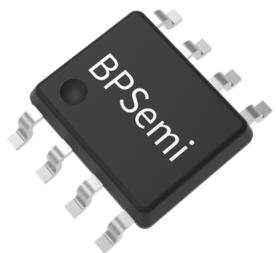
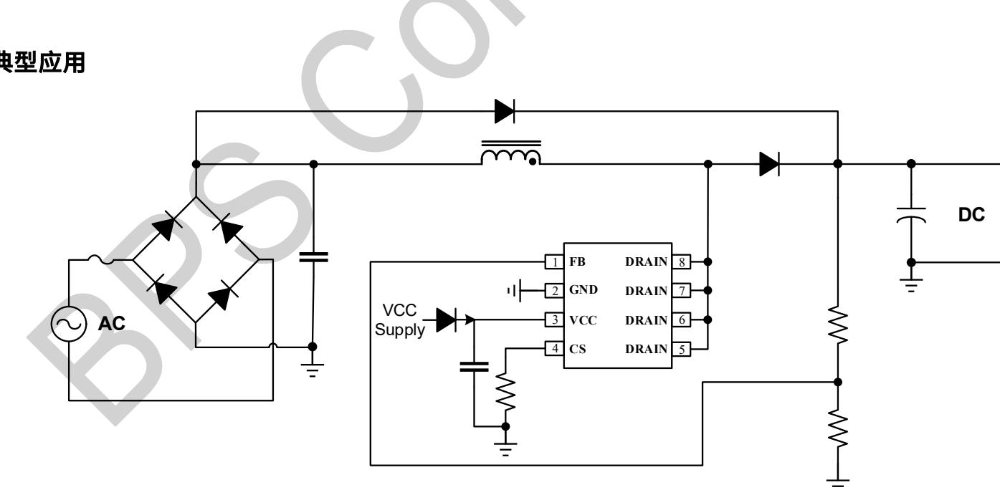
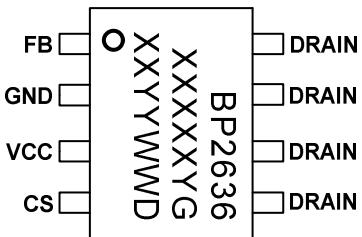
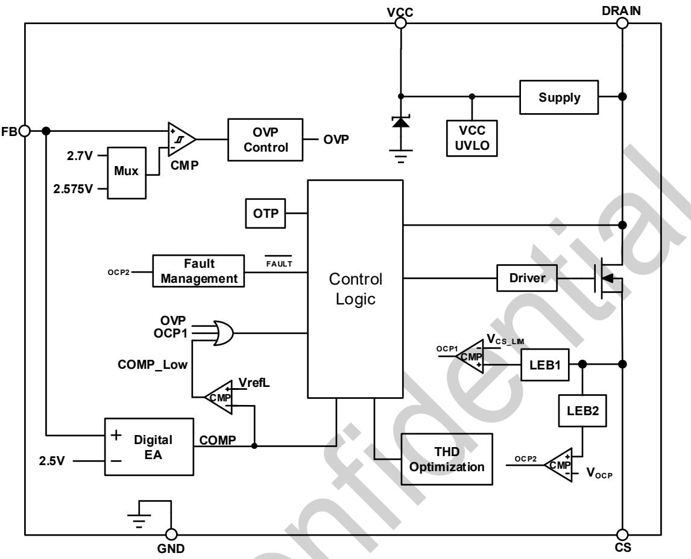
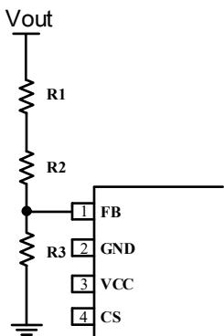
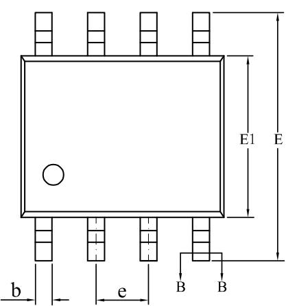
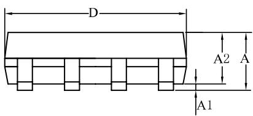
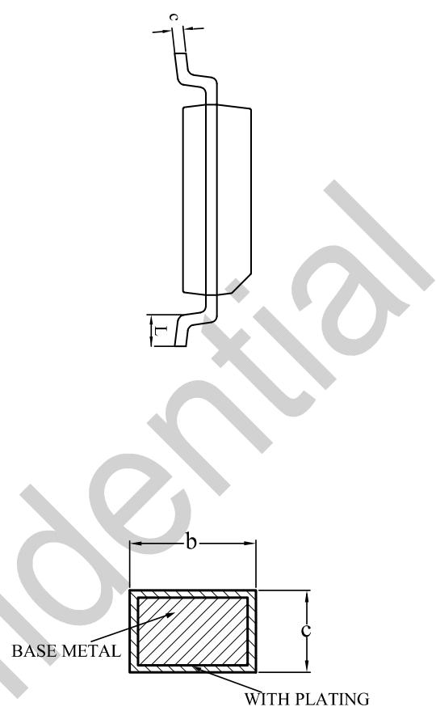

## 概述

BP2636DG 是一款高效率、高 PF 值、低 THD 的升压型 PFC驱动芯片。芯片采用导通时间控制，同时工作在谷底开通模式，有助于优化 EMI 和效率。

BP2636DG 无需辅助绕组实现退磁检测。同时采用高压启动和 供电，内置环路补偿，只需要很少的外围元件，即可实现优异 的恒压特性，极大地节约了系统成本和体积。

BP2636DG 具有多重保护功能，包括输出过压保护（OVP）、FB短路保护、功率开关管过流保护、芯片温度过热保护等。

BP2636DG 采用 SOP-8 封装。

  
SOP-8 封装

## 特点

 全压范围内 PF>0.9, THD<10%

 单绕组电感，外围精简

 全程谷底开通

 高压快速启动

 高输出电压精度

 支持 DC 输入

 内部集成保护功能

 输出过压保护

 逐周期限流保护

 VCC 欠压保护

 过温保护

## 应用领域

Boost APFC 恒压电路

## 典型应用

  
图 1. BP2636DG 典型应用电路

## 定购信息

<table><tr><td>定购型号</td><td>封装</td><td>包装形式</td><td>打印</td></tr><tr><td>BP2636DG</td><td>SOP-8</td><td>卷盘4000颗/盘</td><td>BP2636XXXXXYGXXYYWWD</td></tr></table>

## 管脚封装

  
BP2636DG：产品型号  
XXXXXY: 批次号  
XXYY: 内部标示  
WW：周号  
图 2.SOP-8 管脚封装图

## 管脚描述

<table><tr><td>管脚号</td><td>管脚名称</td><td>描述</td></tr><tr><td>1</td><td>FB</td><td>Boost 输出电压设定和过压保护设置引脚</td></tr><tr><td>2</td><td>GND</td><td>芯片地</td></tr><tr><td>3</td><td>VCC</td><td>芯片供电引脚</td></tr><tr><td>4</td><td>CS</td><td>电流采样端,采样电阻接在 CS 与 GND 端之间</td></tr><tr><td>5,6,7,8</td><td>DRAIN</td><td>功率管漏极</td></tr></table>

## 极限参数(注 1)

<table><tr><td>符号</td><td>参数</td><td>参数范围</td><td>单位</td></tr><tr><td>DRAIN</td><td>DRAIN 电压范围</td><td>-0.3~500</td><td>V</td></tr><tr><td>VCC</td><td>VCC 电压范围</td><td>-0.3~30</td><td>V</td></tr><tr><td> $I_{CC\_MAX}$ </td><td>VCC 最大电流@  $V_{CC\_CLAMP}$ </td><td>10</td><td>mA</td></tr><tr><td>CS</td><td>CS 电压范围</td><td>-0.3~6</td><td>V</td></tr><tr><td>FB</td><td>FB 电压范围</td><td>-0.3~6</td><td>V</td></tr><tr><td> $P_{DMAX}$ </td><td>功耗(注2)</td><td>0.45</td><td>W</td></tr><tr><td> $\theta_{JA}$ </td><td>结到环境的热阻(注3)</td><td>145</td><td>°C/W</td></tr><tr><td> $T_J$ </td><td>工作结温范围</td><td>-40~150</td><td>°C</td></tr><tr><td> $T_{STG}$ </td><td>储存温度范围</td><td>-55~150</td><td>°C</td></tr><tr><td>ESD</td><td>HBM(注4)</td><td>2</td><td>kV</td></tr></table>

注 1：极限参数是指超出该范围，有可能导致器件永久性损坏。极限参数为器件应力的额定值，长期工作在极限参数条件可能会影响器件的可靠性。  
注 2：温度升高最大功耗一定会减小，这也是由 ${ \mathsf { T } } _ { \mathsf { J M A X } } ,$ θ ,和环境温度T 所决定的。最大允许功耗为 $\mathsf { P } _ { \mathsf { D M A X } } = ( \mathsf { T } _ { \mathsf { J M A X } } - \mathsf { T } _ { \mathsf { A } } ) /$ θ 或是极限范围给出的数字中比较低的那个值。  
注 3：1平方英寸双层 PCB板，按照JEDEC 标准测试。  
注 4：人体模型，100pF电容通过1.5kΩ 电阻放电。

## 推荐工作范围(注 5)

<table><tr><td>符号</td><td>参数</td><td>参数范围</td><td>单位</td></tr><tr><td> $P_{OUT}$ </td><td>输出功率(输入电压 230V±15%)</td><td>≤45</td><td>W</td></tr></table>

注 5：开放式条件下，50℃环境温度、芯片表面温升为60℃时对应的最大连续输出功率。若实际应用中散热条件更优，则允许的最大功率可以更大。

电气参数(注 6)（无特别说明情况下， ${ \sf T } _ { \sf A } = 2 5 ^ { \circ } { \sf C } )$

<table><tr><td>符号</td><td>描述</td><td>条件</td><td>最小值</td><td>典型值</td><td>最大值</td><td>单位</td></tr><tr><td colspan="7">电源电压(VCC)</td></tr><tr><td> $V_{CC\_CLAMP}$ </td><td> $V_{CC}$ 钳位电压</td><td>2mA</td><td>20.5</td><td>22</td><td>23.5</td><td>V</td></tr><tr><td> $V_{CC\_ON}$ </td><td> $V_{CC}$ 启动电压</td><td> $V_{CC}$ 上升</td><td>13.5</td><td>15</td><td>16.5</td><td>V</td></tr><tr><td> $V_{CC\_UVLO}$ </td><td> $V_{CC}$ 欠压保护阈值</td><td> $V_{CC}$ 下降</td><td>7.5</td><td>8.5</td><td>9</td><td>V</td></tr><tr><td> $I_{QUIESCENT}$ </td><td> $V_{CC}$ 静态工作电流</td><td>无开关动作</td><td></td><td>250</td><td></td><td>μA</td></tr><tr><td> $I_{ST}$ </td><td> $V_{CC}$ 启动电流</td><td> $V_{CC}<4V$ </td><td></td><td>100</td><td></td><td>μA</td></tr><tr><td> $V_{CC\_JFETON}$ </td><td>JFET供电 $V_{CC}$ 电压</td><td></td><td>11</td><td>12</td><td>13</td><td>V</td></tr><tr><td colspan="7">电流采样(CS)</td></tr><tr><td> $V_{CS\_LIM}$ </td><td>逐周期限流阈值</td><td></td><td>0.45</td><td>0.5</td><td>0.55</td><td>V</td></tr><tr><td> $T_{LEB1}$ </td><td>前沿消隐时间1</td><td></td><td>250</td><td>350</td><td>480</td><td>ns</td></tr><tr><td> $V_{OCP}$ </td><td>故障过流保护阈值</td><td></td><td></td><td>1</td><td></td><td>V</td></tr><tr><td> $T_{LEB2}$ </td><td>前沿消隐时间2</td><td></td><td></td><td>200</td><td></td><td>ns</td></tr><tr><td colspan="7">输出电压控制(FB)</td></tr><tr><td> $V_{FB\_REF}$ </td><td>FB引脚基准电压</td><td></td><td>2.45</td><td>2.5</td><td>2.55</td><td>V</td></tr><tr><td> $V_{OVP1\_REF}$ </td><td>FB OVP保护阈值</td><td>FB上升</td><td>2.64</td><td>2.7</td><td>2.76</td><td>V</td></tr><tr><td> $V_{OVP1\_REL}$ </td><td>FB OVP保护退出阈值</td><td>FB下降</td><td>2.5</td><td>2.575</td><td>2.65</td><td>V</td></tr><tr><td> $V_{FB\_EN}$ </td><td>FB使能阈值</td><td>FB上升</td><td>0.45</td><td>0.5</td><td>0.55</td><td>V</td></tr><tr><td> $V_{FB\_DIS}$ </td><td>FB关闭阈值</td><td>FB下降</td><td>0.2</td><td>0.25</td><td>0.3</td><td>V</td></tr><tr><td colspan="7">内部时间控制</td></tr><tr><td> $T_{ZCD\_MASK}$ </td><td>退磁检测屏蔽时间</td><td></td><td></td><td>0.6</td><td></td><td>μs</td></tr><tr><td> $T_{ST\_DELAY}$ </td><td>开机启动延时</td><td></td><td></td><td>10</td><td></td><td>ms</td></tr><tr><td> $T_{ON\_MAX1}$ </td><td>最大开通时间1(7)</td><td>Vin&lt;140V</td><td>20.8</td><td>24</td><td>27.2</td><td>μs</td></tr><tr><td> $T_{ON\_MAX2}$ </td><td>最大开通时间2(7)</td><td>140V10.41213.6μs</td><td>10.4</td><td>12</td><td>13.6</td><td>μs</td></tr><tr><td> $T_{ON\_MAX3}$ </td><td>最大开通时间3(7)</td><td>Vin&gt;170Vac</td><td>7.8</td><td>9</td><td>10.2</td><td>μs</td></tr><tr><td> $T_{OFF\_MAX}$ </td><td>最大关断时间(7)</td><td></td><td>42.5</td><td>56</td><td>71.5</td><td>μs</td></tr><tr><td> $T_{FAULT}$ </td><td>故障保护重启间隔时间</td><td></td><td></td><td>450</td><td></td><td>ms</td></tr><tr><td colspan="7">过热保护</td></tr><tr><td> $T_{OTP}$ </td><td>过热保护温度(7)</td><td></td><td>145</td><td>150</td><td>155</td><td>°C</td></tr><tr><td> $T_{HYS}$ </td><td>过热保护回差</td><td></td><td></td><td>15</td><td></td><td>°C</td></tr></table>

## 内部结构框图

  
图 3. BP2636DG 内部框图

## 功能描述

BP2636DG 是一款高效率、高 PF 值、低 THD 的升压型 PFC驱动芯片。芯片采用导通时间控制，同时工作在谷底开通模式，有助于优化 EMI 和效率。

## 启动

系统上电后，母线电压直接通过 DRAIN 引脚对 VCC 电容充电，VCC 缓慢上升。当 VCC 电压达到芯片开启阈值 $\mathsf { V } _ { \mathsf { C C } }$ \_ON时，芯片内部控制电路开始工作。

## 输出电压设置

输出电压由 FB 直接采样控制，芯片通过调节导通时间将 FB电压控制在 2.5V。输出过压保护（OVP）也由 FB 采样控制，当 FB 电压达到 2.7V 时，系统触发 OVP。触发 OVP 后，当FB电压低于 2.575V，芯片退出 OVP 保护。图 4 显示的是输出外围电路。

  
图4 FB引脚应用示意图

输出电压平均值和过压保护值可以设置为：

$$
\begin{array}{r} V _ {O U T} = \frac {R _ {1} + R _ {2} + R _ {3}}{R _ {3}} \times 2. 5 V \\ V _ {O V P} = \frac {R _ {1} + R _ {2} + R _ {3}}{R _ {3}} \times 2. 7 V \end{array}
$$

其中：

R3是反馈网络的下分压电阻；

${ \sf R } _ { 1 }$ 和 R 是反馈网络的上分压电阻；

$\mathsf { V } _ { \mathsf { O U T } }$ 是输出电压；

VOVP是输出电压过压保护设定点；

为了提高系统效率，FB 下分压电阻可以设置在 5\~10KΩ 左右。为了提高抗干扰性，FB引脚可并联滤波电容。

## VCC 供电设计

VCC 供电电压建议在 $\mathsf { V } _ { \mathsf { C C \_ J F E I O N } } - \mathsf { V } _ { \mathsf { C C \_ C L A M P } }$ 之间。当 VCC 电压高于 $V _ { C C \_ C L A M P }$ 时，芯片会工作在钳位状态，会增加芯片钳位损耗，造成芯片发热，并影响整机效率。VCC 电压低于$V _ { C C \_ J F E T O N }$ 时，芯片内部 JFET 会介入供电，造成芯片发热，也会影响整机效率。

## 功率管过流保护

芯片逐周期检测电感的峰值电流，CS 端连接到内部的峰值电流比较器的输入端，与内部阈值电压进行比较，当 CS 电压达到内部检测阈值时，功率管关断。

电感峰值电流值的计算公式为：

$$
I _ {\mathrm{PK} \_ \mathrm{LMT}} = \frac {5 0 0}{R _ {C S}} (m A)
$$

其中：

RCS为电流采样电阻阻值。

CS 比较器的输出还包括一个 350ns 前沿消隐时间。

## Boost 电感

BP2636DG 在输入 AC 电压波峰处一般工作在电感电流临界模式，当功率管导通时，流过 Boost 电感的电流从零开始上升，导通时间为：

$$
t _ {o n} = \frac {L \times I _ {P K}}{V _ {I N}}
$$

其中：

L 是电感量；

$\mathsf { I } _ { \mathsf { P K } }$ 是电感电流的峰值；

$V _ { \parallel N }$ 是经整流后的母线电压。

当功率管关断时，流过 Boost 电感的电流从峰值开始往下降，当电感电流下降到零时，芯片内部逻辑再次将功率管开通。

功率管的关断时间为：

$$
t _ {o f f} = \frac {L \times I _ {P K}}{V _ {\mathrm{OUT}} - V _ {I N}}
$$

BP2636DG 的开关频率和输入电压有关。一般情况下，选择在输入电压有效值最低时的波峰处来设置系统的最低工作频率。

## 保护功能

BP2636DG 内置多种保护功能，包括输出过压保护（OVP）、VCC欠压保护、功率管过流保护、芯片过热保护、FB短路保护等。

## 输出过压保护（OVP）

当输出负载开路时，随着输出电压的上升，FB引脚电压同时上升。当 FB 引脚电压达到 $2 . 7 \lor$ 时以上，会触发芯片过压保护逻辑并停止开关工作。当 FB 电压降低到 2.575V 以下，芯片重新开始工作。

## 功率管逐周期过流保护(OCP)

当输入电压降低时，电感峰值电流上升，电压越低峰值电流越大， 芯片通过设置 CS 电阻来限制电感电流峰值，防止电流过大。

## FB 短路保护

当 FB 短路时， $V _ { \mathsf { F B } }$ 掉到 0.25V 以下，会触发芯片 FB 短路保护逻辑，并停止开关动作。故障撤除后，当 V 大于 0.5V 以后，芯片重新恢复正常工作。

## 过温保护

当芯片结温超过过温保护阈值时，会触发过温保护，芯片停止工作，当结温降低 15℃时，芯片恢复工作。

## PCB Layout 指南

在设计 BP2636DGPCB时，需要遵循以下指南：

1) VCC 的旁路电容需要紧靠芯片VCC 和 GND 引脚。

2) FB 采样电阻需要尽量靠近芯片 FB 引脚，且 FB 节点要远离高压节点和噪声源。FB 采样下电阻需要并联电容到地。

3) 电流采样电阻的功率地线尽可能粗，且要离芯片的GND 脚尽量近。另外，CS、FB 引脚的电阻到芯片GND 脚的连线应尽可能短。

4) CS 引脚与采样电阻的连线需要尽量短，且靠近芯片，远离高压节点和噪声源。

5) 减小功率环路的面积，如功率管、母线电容和续流二极管的环路面积，以减小 EMI 辐射。

## 封装信息

SOP-8封装外形尺寸  
  
SECTION B-B

<table><tr><td rowspan="2">SYMBOL</td><td colspan="3">MILLIMETER</td></tr><tr><td>MIN</td><td>NOM</td><td>MAX</td></tr><tr><td>A</td><td>1.30</td><td>—</td><td>1.80</td></tr><tr><td>A1</td><td>0.05</td><td>—</td><td>0.25</td></tr><tr><td>A2</td><td>1.25</td><td>1.40</td><td>1.65</td></tr><tr><td>b</td><td>0.33</td><td>—</td><td>0.51</td></tr><tr><td>c</td><td>0.17</td><td>—</td><td>0.25</td></tr><tr><td>D</td><td>4.70</td><td>4.90</td><td>5.10</td></tr><tr><td>E</td><td>5.80</td><td>6.00</td><td>6.30</td></tr><tr><td>E1</td><td>3.70</td><td>3.90</td><td>4.10</td></tr><tr><td>e</td><td colspan="3">1.27BSC</td></tr><tr><td>L</td><td>0.40</td><td>—</td><td>1.00</td></tr></table>

## 版本信息

<table><tr><td>版本</td><td>日期</td><td>记录</td></tr><tr><td>Rev.1.0</td><td>2024/11</td><td>首次发行</td></tr><tr><td>Rev.1.1</td><td>2025/01</td><td>修改电气参数</td></tr><tr><td>Rev.1.2</td><td>2025/08</td><td>增加电子报废说明,增加电气参数,修改内部框图</td></tr></table>

## 免责声明

晶丰明源尽力确保本产品规格书内容的准确和可靠，但是保留在没有通知的情况下，修改规格书内容的权利。

本产品规格书未包含任何针对晶丰明源或第三方所有的知识产权的授权。针对本产品规格书所记载的信息，晶丰明源不做任何明示或暗示的保证，包括但不限于对规格书内容的准确性、商业上的适销性、特定目的的适用性或者不侵犯晶丰明源或任何第三人知识产权做任何明示或暗示保证，晶丰明源也不就因本规格书本身及其使用有关的偶然或必然损失承担任何责任 。

## 电子器件报废说明

该产品在生命周期结束后，由客户按照一般电子产品的报废流程进行处理。