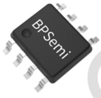
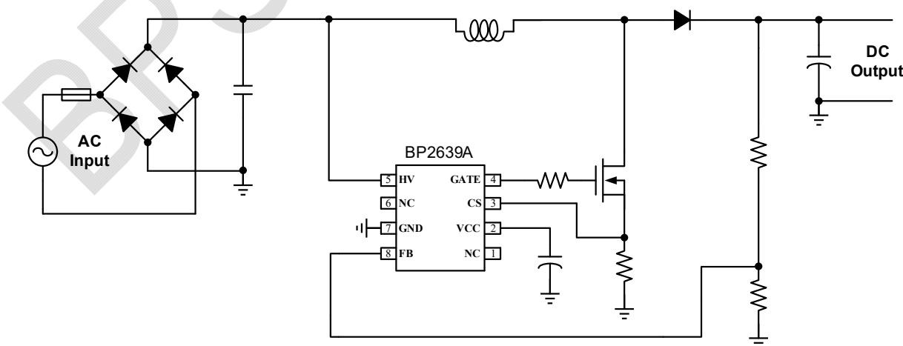
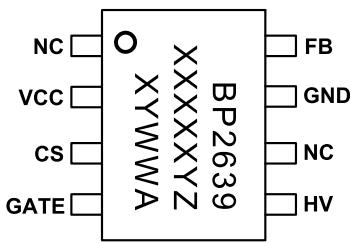
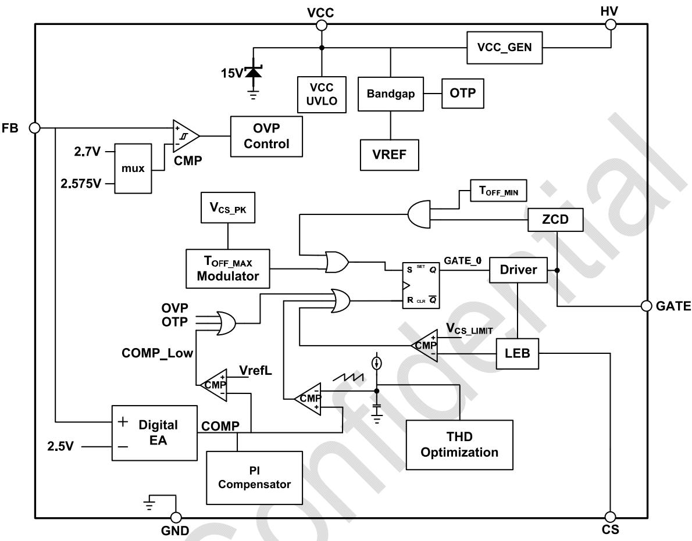
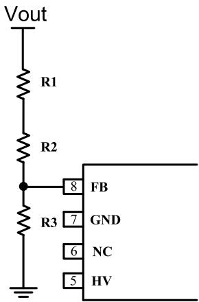
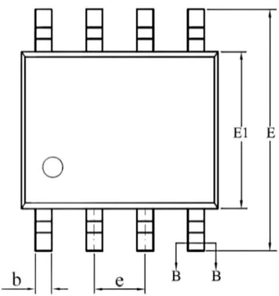
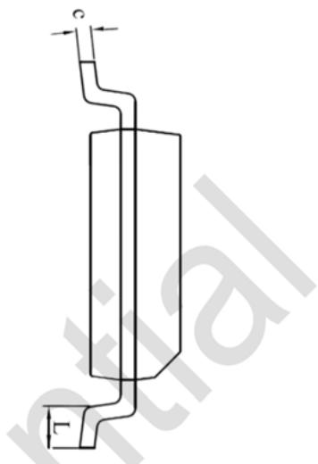
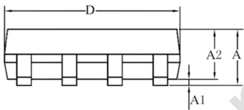
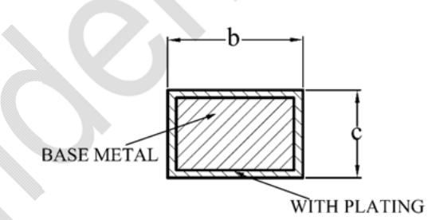

## Description

The BP2639A is a Boost PFC driver with high efficiency, high PF and low THD. The device operates in critical conduction mode and is better for EMI and Efficiency improvement.

The BP2639A utilizes MOSFET gate driving technique for zero current detection without any auxiliary winding. HV startup circuit and loop compensation is integrated in the device. With very few external components count, it can achieve excellent constant voltage performance, so as to reduce the system cost and size greatly.

The BP2639A offers rich protection functions to improve the system reliability, including load open circuit protection (Over Voltage Protection), MOSFET over current limit and thermal regulation function.

The BP2639A is available in SOP-8 package.

  
SOP-8 package

## Features

 PF>0.9, THD<10% at Universal Input

 Single-winding inductor for simple design

 Critical Conduction Mode

 HV JFET for fast startup

 Voltage reference accuracy of up to ±2%

 Integrated protections:

 Output Over Voltage

 MOSFET Over Current

 VCC UVLO

 Over Temperature Protection

 Available in SOP-8 Package

## Applications

 BOOST APFC pre-converter

## Typical Application

  
Figure 1 Typical Application of BP2639A

## Ordering Information

<table><tr><td>Part Number</td><td>Package</td><td>Package Method</td><td>Marking</td></tr><tr><td>BP2639A</td><td>SOP-8</td><td>Tape4,000pcs/Reel</td><td>BP2639XXXXXYZXYWWA</td></tr></table>

Pin Configuration and Marking Information

  
BP2639A: Part Number  
XXXXXY: Lot Code  
XY: Sign  
WW: Week  
Z: Reserved  
Figure 2 Pin Configuration

## Pin Definition

<table><tr><td>Pin No.</td><td>Name</td><td>Parameter</td></tr><tr><td>1</td><td>NC</td><td>Not connected.</td></tr><tr><td>2</td><td>VCC</td><td>IC power supply</td></tr><tr><td>3</td><td>CS</td><td>Boost MOSFET Current Sensing, connecting a sampling resistor to GND</td></tr><tr><td>4</td><td>GATE</td><td>MOSFET gate driving</td></tr><tr><td>5</td><td>HV</td><td>HV Start-up and VCC Power Supply</td></tr><tr><td>6</td><td>NC</td><td>Not connected.</td></tr><tr><td>7</td><td>GND</td><td>IC Ground</td></tr><tr><td>8</td><td>FB</td><td>Boost output voltage sensing and feedback</td></tr></table>

## Absolute Maximum Ratings (Note 1)

<table><tr><td>Symbol</td><td>Parameters</td><td>Range</td><td>Units</td></tr><tr><td>HV</td><td>HV pin voltage</td><td>-0.3~700</td><td>V</td></tr><tr><td>VCC</td><td>IC power supply</td><td>-0.3~20</td><td>V</td></tr><tr><td> $V_{CC\_CLAMP}$ </td><td>VCC internal clamping voltage</td><td>15</td><td>V</td></tr><tr><td>CS</td><td>Current sensing pin</td><td>-0.3~6</td><td>V</td></tr><tr><td>FB</td><td>Output voltage sensing and feedback</td><td>-0.3~6</td><td>V</td></tr><tr><td> $P_{DMAX}$ </td><td>Power dissipation (Note 2)</td><td>0.45</td><td>W</td></tr><tr><td> $θ_{JA}$ </td><td>Thermal resistance of Junction to Ambient (Note 3)</td><td>145</td><td>°C/W</td></tr><tr><td> $T_J$ </td><td>Operating junction temperature</td><td>-40~150</td><td>°C</td></tr><tr><td> $T_{STG}$ </td><td>Storage temperature range</td><td>-55~150</td><td>°C</td></tr></table>

Note 1: Stresses beyond those listed under absolute maximum ratings may cause permanent damage to the device. Under recommended operating conditions the device operation is assured, but some particular parameter may not be achieved. The electrical characteristics table defines the operation range of the device, the electrical characteristics is assured on DC and AC voltage by test program. For the parameters without minimum and maximum value in the EC table, the typical value defines the operation range, the accuracy is not guaranteed by spec.

Note 2: The maximum power dissipation decrease if temperature rise, it is decided by TJMAX, θJA, and environment temperature (TA). The maximum power dissipation is the lower one between $P _ { \tt D M A X } = \left( \mathbb { T } _ { \tt J M A X } - \mathbb { T } _ { A } \right) / \theta _ { \tt J A }$ and the number listed in the maximum table

Note 3: Tested on 1 in.² double-sided board according to JEDEC standard.

## Electrical Characteristics(Note 4)Unless otherwise specified $T _ { \mathsf { A } } { = } 2 5 ^ { \circ } \mathsf { C } )$

<table><tr><td>Symbol</td><td>Parameter</td><td>Conditions</td><td>Min</td><td>Typ</td><td>Max</td><td>Units</td></tr><tr><td colspan="7">VCC power supply</td></tr><tr><td> $V_{CC\_CLAMP}$ </td><td> $V_{CC}$  Clamping Voltage</td><td> $I_{CC}=1mA$ </td><td>14</td><td>15</td><td>16</td><td>V</td></tr><tr><td> $V_{CC\_ON}$ </td><td> $V_{CC}$  Turn on threshold</td><td> $V_{CC}$  Rising</td><td>11</td><td>12.5</td><td>14</td><td>V</td></tr><tr><td> $V_{CC\_UVLO}$ </td><td> $V_{CC}$  UVLO threshold</td><td> $V_{CC}$  Falling</td><td>7</td><td>8</td><td>9</td><td>V</td></tr><tr><td> $I_{OP}$ </td><td>IC quiescent current</td><td></td><td>285</td><td>380</td><td>475</td><td>μA</td></tr><tr><td colspan="7">MOSFET Over Current Protection</td></tr><tr><td> $V_{CS\_LIM}$ </td><td>CS Current Limiting</td><td></td><td>435</td><td>485</td><td>535</td><td>mV</td></tr><tr><td colspan="7">Output Voltage Regulation</td></tr><tr><td> $V_{FB\_REF}$ </td><td>FB Reference Voltage</td><td></td><td>2.45</td><td>2.5</td><td>2.55</td><td>V</td></tr><tr><td> $V_{FB\_OVP}$ </td><td>OVP threshold</td><td></td><td>2.64</td><td>2.7</td><td>2.76</td><td>V</td></tr><tr><td> $V_{OB\_OVP\_EXIT}$ </td><td>OVP release threshold</td><td></td><td>2.5</td><td>2.575</td><td>2.65</td><td>V</td></tr><tr><td colspan="7">Gate Driving</td></tr><tr><td> $I_{SOURCE}$ </td><td>Max. pull up current</td><td></td><td></td><td>180</td><td></td><td>mA</td></tr><tr><td> $I_{SINK}$ </td><td>Max. pull down current</td><td></td><td></td><td>250</td><td></td><td>mA</td></tr><tr><td colspan="7">Internal Time Control</td></tr><tr><td> $T_{OFF\_MIN}$ </td><td>Min. OFF time</td><td></td><td></td><td>3</td><td></td><td>μs</td></tr><tr><td> $T_{OFF\_MAX1}$ </td><td>Max. OFF time 1</td><td> $FB \leqslant 1.7V$ </td><td></td><td>25</td><td></td><td>μs</td></tr><tr><td> $T_{OFF\_MAX2}$ </td><td>Max. OFF time 2</td><td> $FB > 1.7V$ </td><td>35</td><td>50</td><td>65</td><td>μs</td></tr><tr><td> $T_{LEB}$ </td><td>CS LEB Time</td><td></td><td></td><td>350</td><td></td><td>ns</td></tr><tr><td> $T_{ON\_MAX}$ </td><td>Maximum ON Time</td><td></td><td>30</td><td>35</td><td>40</td><td>μs</td></tr><tr><td> $T_{DET\_BLANKING}$ </td><td>ZCD blanking time</td><td></td><td></td><td>1.3</td><td></td><td>μs</td></tr><tr><td colspan="7">Over Temperature Protection</td></tr><tr><td> $T_{OTP}$ </td><td>OTP Threshold</td><td></td><td></td><td>160</td><td></td><td>°C</td></tr><tr><td> $T_{OTP\_HYS}$ </td><td>OTP Hysteresis</td><td></td><td></td><td>15</td><td></td><td>°C</td></tr></table>

Note 4: The maximum and minimum parameters specified are guaranteed by test, the typical value are guaranteed by design, characterization and statistical analysis

Internal Block Diagram

  
Figure 3 Internal Block Diagram of BP2639A

## Application Information

The BP2639A is a Boost PFC driver with high efficiency, high PF and low THD. The device operates in critical conduction mode and is better for EMI and Efficiency improvement.

The BP2639A utilizes MOSFET gate driving technique for zero current detection without any auxiliary winding. HV startup circuit and loop compensation is integrated in the device. With very few external components count, it can achieve excellent constant voltage performance, so as to reduce the system cost and size greatly.

## Start-up

After system is powered up, the VCC pin capacitor is charged up by internal HV JFET. After VCC voltage is higher than turn on threshold, the internal circuits start operating. The BP2639A integrates a 15V clamper inside for clamping VCC voltage. In order to reduce the power dissipation of the device, additional resistors can be connected to the rectified input voltage, to reduce the supply current through JFET.

## Out Voltage Regulation & OVP Setting

Output voltage is sensed by FB pin and ON time of MOSFET is regulated to keep FB voltage at 2.5V as a closed loop control. Output Voltage Protection (OVP) is also implemented by FB pin. When FB voltage reaches

2.7V, OVP is triggered. OVP is released when FB voltage is lower than 2.575V. See Figure 4 below for the wiring diagram of FB pin.

  
Figure 4 FB pin wiring diagram

Regulated output voltage and OVP voltage is set as:

$$
V _ {O U T} = \frac {R _ {1} + R _ {2} + R _ {3}}{R _ {3}} \times 2. 5 V
$$

$$
V _ {O V P} = \frac {R _ {1} + R _ {2} + R _ {3}}{R _ {3}} \times 2. 7 V
$$

Where:

R3 is the resistance of lower resistor;

R1 and R2 is the resistance of upper resistor;

VOUT is output voltage;

VOVP is the output voltage over voltage protection set point;

In order to improve system efficiency, FB lower resistance can be sized to about 5\~10kΩ. In order to increase system anti-interference ability, connect one capacitor to FB pin.

## MOSFET Over Current Protection

Cycle by cycle current sensing is adopted in the BP2639A. The CS pin is connected to the current sense comparator, and the voltage on CS pin is compared with the internal reference voltage. The MOSFET will be switched off when the voltage on CS pin reaches the threshold.

The peak inductor current is given by:

$$
I _ {\mathrm {PK\_LMT}} = \frac {5 0 0}{R _ {C S}} (m A)
$$

Where:

RCS is current sensing resistance.

CS comparator includes a leading edge blanking time of 350ns.

## Boost Inductor

The BP2639A works under inductor current critical conduction mode. When the power MOSFET is switched on, the current in the inductor rises up from zero, the on time of the MOSFET can be calculated by the equation:

$$
t _ {o n} = \frac {L \times I _ {P K}}{V _ {I N}}
$$

Where:

L is the inductance value;

IPK is the peak current;

VIN is rectified voltage;

Max. on time of the device is 35μs.

After the power MOSFET is switched off, the current of the inductor decreases. When the inductor current reaches zero, the power MOSFET is turned on again by internal logic of the controller. The off time of the MOSFET is given by:

$$
t _ {o f f} = \frac {L \times I _ {P K}}{V _ {\mathrm{OUT}} - V _ {I N}}
$$

The inductance is calculated by:

$$
L = \frac {\left(V _ {\mathrm{OUT}} - V _ {I N}\right) \times V _ {I N}}{f \times I _ {P K} \times V _ {\mathrm{OUT}}}
$$

Where:

F is Min. operating frequency of the system The minimum switching frequency Switching frequency of the BP2639A is related to input voltage and output power. Usually, minimum switching frequency occurs at peak voltage over one cycle at low line voltage.

## Protections

The BP2639A offers rich protection functions to improve the system reliability, including output Over Voltage Protection (OVP), VCC UVLO, MOSFET cycle-by-cycle Over Current Protection (OCP), Over Temperature Protection (OTP) and FB Short Protection.

## Output Over Voltage

When the load is open, FB pin voltage will rise with output voltage. When the FB pin voltage reaches 2.7V, the device will trigger Over Voltage Protection and stop switching. When FB pin voltage is lower than 2.575V, the system will recover to normal operation.

## MOSFET Over Current Protection

The peak current of the inductor will rise as input voltage decreases. At lower input voltage, inductor peak current is higher. Fine tuning CS resistance is useful to limit inductor current.

## Over-temperature Protection

When the junction temperature is over 160˫, the system will trigger the Over Temperature Protection and stop switching. When the junction temperature is lower than 145 ˫, the system will recover to normal operation.

## PCB Layouts

The following rules should be followed BP2639A PCB layout:

1) The bypass capacitor of VCC should be close to VCC and GND pins.

2) The FB resistor should be as close to the chip's FB pin as possible, and the FB node should be far away from the high voltage node and noise source.

3) Trace of current sensing resistor should be as wide as possible and kept close to GND. The IC signal ground for CS and FB resistors should be connected to the IC GND pin with short traces and should be away from the power ground path.

4) current sensing resistor should be as close to away from the high voltage node and noise source.

5) The area of main current loop should be as small as possible to reduce EMI radiation, such as the power MOSFET, the output diode and the bus capacitor loop.

## Physical Dimensions

  
SOP-8 PACKAGE OUTLINE DIMENSIONS

<table><tr><td rowspan="2">SYMBOL</td><td colspan="3">MILLIMETER</td></tr><tr><td>MIN</td><td>NOM</td><td>MAX</td></tr><tr><td>A</td><td>1.30</td><td>—</td><td>1.80</td></tr><tr><td>A1</td><td>0.10</td><td>—</td><td>0.25</td></tr><tr><td>A2</td><td>1.25</td><td>1.40</td><td>1.65</td></tr><tr><td>b</td><td>0.33</td><td>—</td><td>0.51</td></tr><tr><td>c</td><td>0.17</td><td>—</td><td>0.25</td></tr><tr><td>D</td><td>4.70</td><td>4.90</td><td>5.10</td></tr><tr><td>E</td><td>5.80</td><td>6.00</td><td>6.20</td></tr><tr><td>E1</td><td>3.70</td><td>3.90</td><td>4.10</td></tr><tr><td>e</td><td colspan="3">1.27BSC</td></tr><tr><td>L</td><td>0.40</td><td>—</td><td>1.00</td></tr></table>

SECTION B-B

  
WITH PLATING

## Revision Information

<table><tr><td>Revision Information</td><td>Date</td><td>Notes</td></tr><tr><td>Rev. 1.0</td><td>2022/12</td><td>First Issue</td></tr><tr><td></td><td></td><td></td></tr><tr><td></td><td></td><td></td></tr><tr><td></td><td></td><td></td></tr><tr><td></td><td></td><td></td></tr><tr><td></td><td></td><td></td></tr></table>

## Disclaimer

The information provided in this datasheet is believed to be accurate and reliable. However, Bright Power Semiconductor (BPS) reserves the right to make changes at any time without prior notice.

No license, to any intellectual property right owned by BPS or any other third party, is granted under this document. BPS provides information in this datasheet AS IS and with all faults, and makes no warranty, express or implied, including but not limited to, the accuracy of the information provided in this datasheet, merchantability, fitness of a specific purpose, or non-infringement of intellectual property rights of BPS or any other third party. BPS disclaims any and all liabilities arising out of this datasheet or use of this datasheet, including without limitation consequential or incidental damages.