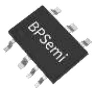
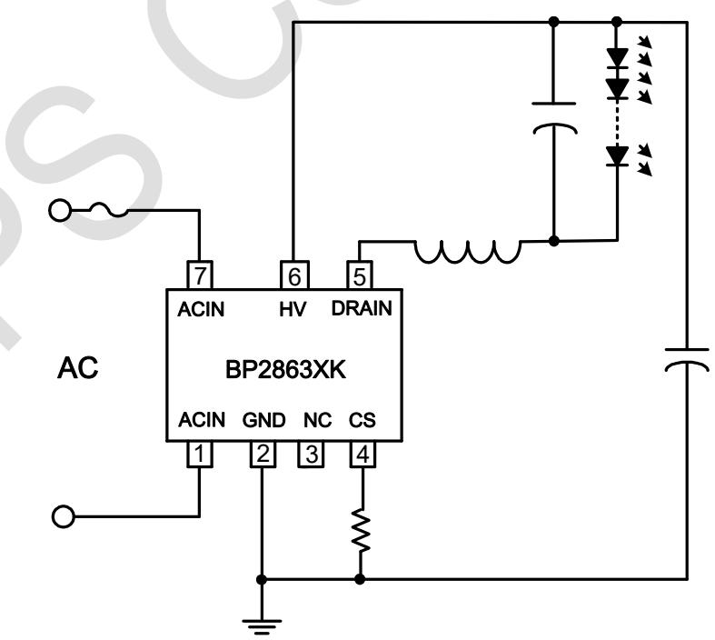
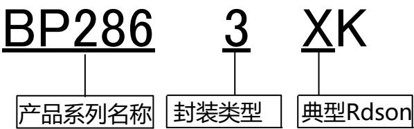
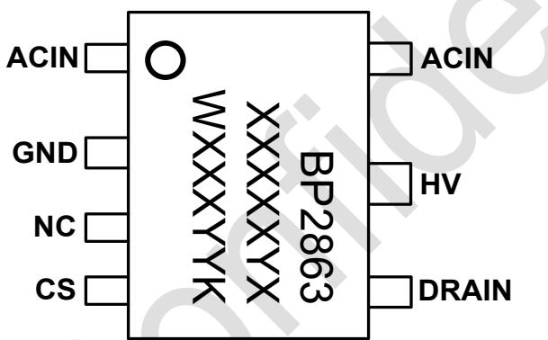
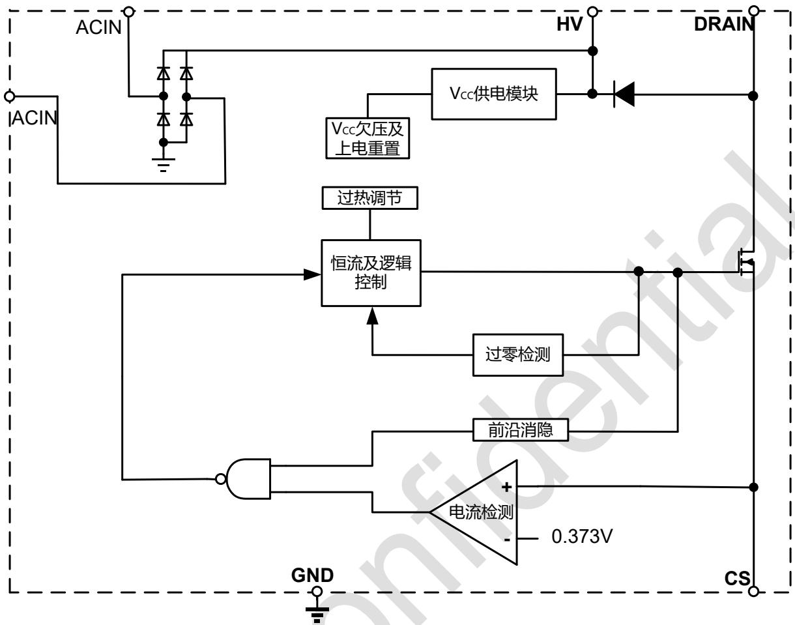
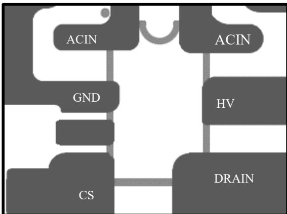
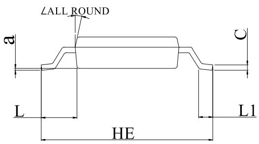
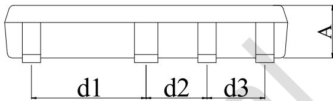
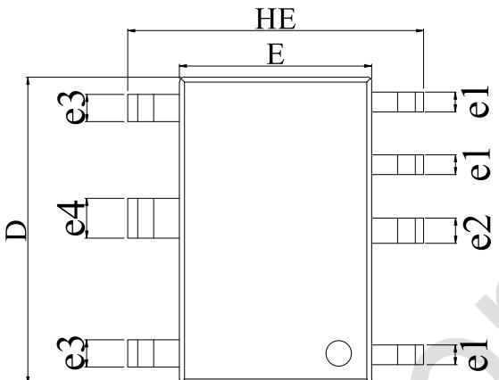
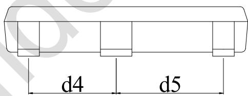

## BP2863XK 非隔离降压型 LED 恒流驱动芯片

## 概述

BP2863XK 是一款降压型 LED 恒流驱动芯片。芯片工作在电感电流临界连续模式，适用于 85Vac\~265Vac 全范围输入电压的非隔离降压型 LED 恒流电源。

BP2863XK 芯片内部集成 500V 功率开关，采用栅极退磁检测技术和高压 JFET 供电技术，无需 VCC 电容和启动电阻，使其外围器件更简单，节约了外围的成本和体积。

BP2863XK 芯片采用内置高精度的电流采样电路和恒流控制技术，实现高精度的 LED 恒流输出和优异的线电压调整率。芯片工作在电感电流临界模式，输出电流不随电感量和 LED 工作电压的变化而变化，实现优异的负载调整率。BP2863XK 具有多重保护功能，包括 LED 短路保护，芯片供电欠压保护，芯片温度过热调节等。

BP2863XK 采用 ASOP7 封装。

## 特点

■ 集成 800V 整流桥

■ 集成 600V 超快恢复二极管

■ 无VCC电容、无启动电阻

■ 集成高压供电功能

■ 低母线电压下不闪灯

■ 多灯并联无闪烁

■ ±5% LED 输出电流精度

■ LED 短路保护

■ 过热调节功能

■ 采用 ASOP7 封装

## 应用

LED 蜡烛灯

■ LED 球泡灯

■ 其它 LED 照明

## 典型应用

  
图 1 BP2863XK 典型应用图

## 芯片名称

定购信息

<table><tr><td>定购型号</td><td>封装</td><td>包装形式</td><td>打印</td></tr><tr><td>BP2863XK</td><td>ASOP7</td><td>编带5,000 颗/盘</td><td>BP2863XXXXXYWXXXYYK</td></tr></table>

## 管脚封装

  
图 2 管脚封装图

XXXXXY: lot code
WXXX: 标示
YY: 周号
X:L/M/S/A
(第二行末)

## 管脚描述

<table><tr><td>管脚号</td><td>管脚名称</td><td>描述</td></tr><tr><td>1,7</td><td>ACIN</td><td>AC 输入</td></tr><tr><td>2</td><td>GND</td><td>芯片地</td></tr><tr><td>3</td><td>NC</td><td>空脚</td></tr><tr><td>4</td><td>CS</td><td>电流采样端,采样电阻接在 CS 和 GND 端之间</td></tr><tr><td>5</td><td>DRAIN</td><td>内部高压功率管漏极</td></tr><tr><td>6</td><td>HV</td><td>芯片高压供电端</td></tr></table>

## 极限参数(注1)

<table><tr><td>符号</td><td>参数</td><td colspan="3">参数范围</td><td>单位</td></tr><tr><td>ACIN</td><td>整流桥最大耐压值</td><td colspan="3">-0.3~800</td><td>V</td></tr><tr><td>HV</td><td>500V芯片高压供电接口</td><td colspan="3">-0.3~500</td><td>V</td></tr><tr><td>DRAIN</td><td>内部高压功率管漏极到源极峰值电压</td><td colspan="3">-0.3~500</td><td>V</td></tr><tr><td>CS</td><td>电流采样端</td><td colspan="3">-0.3~8</td><td>V</td></tr><tr><td rowspan="2"> $I_{DMAX}$ </td><td rowspan="2">漏极最大电流@ $T_J$ =100°C</td><td>MK</td><td>SK</td><td>AK</td><td rowspan="2">mA</td></tr><tr><td>280</td><td>320</td><td>440</td></tr><tr><td> $P_{DMAX}$ </td><td>功耗(注2)</td><td colspan="3">0.45</td><td>W</td></tr><tr><td> $T_J$ </td><td>工作结温范围</td><td colspan="3">-40 to 150</td><td>°C</td></tr><tr><td> $T_{STG}$ </td><td>储存温度范围</td><td colspan="3">-55 to 150</td><td>°C</td></tr></table>

注1：最大极限值是指超出该工作范围，芯片有可能损坏。推荐工作范围是指在该范围内，器件功能正常，但并不完全保证满足个别性能指标。电气参数定义了器件在工作范围内并且在保证特定性能指标的测试条件下的直流和交流电参数规范。对于未给定上下限值的参数，该规范不予保证其精度，但其典型值合理反映了器件性能。  
注2：温度升高最大功耗一定会减小，这也是由 $T_{\mathrm{JMAX}}$ ， $\theta_{\mathrm{JA}}$ 和环境温度 $T_{\mathrm{A}}$ 所决定的。最大允许功耗为 $P_{DMAX} = (T_{JMAX} - T_A) / \theta_{\mathrm{JA}}$ 或是极限范围给出的数字中比较低的那个值。

## 工作范围

<table><tr><td>符号</td><td colspan="3">参数范围</td><td>单位</td></tr><tr><td colspan="5">Vin=176Vac~265Vac,腔体温度 60°C</td></tr><tr><td rowspan="2">ILED max最大输出电流</td><td>MK</td><td>SK</td><td>AK</td><td rowspan="2">mA</td></tr><tr><td>120</td><td>160</td><td>220</td></tr><tr><td rowspan="2">POMTmax最大输出功率</td><td>M</td><td>S</td><td>A</td><td rowspan="2">W</td></tr><tr><td>14</td><td>16</td><td>17</td></tr><tr><td colspan="5">Vin=176Vac~265Vac,腔体温度 90°C</td></tr><tr><td rowspan="2">ILED max最大输出电流</td><td>MK</td><td>SK</td><td>AK</td><td rowspan="2">mA</td></tr><tr><td>100</td><td>140</td><td>190</td></tr><tr><td rowspan="2">POMTmax最大输出功率</td><td>M</td><td>S</td><td>A</td><td rowspan="2">W</td></tr><tr><td>10</td><td>12</td><td>13</td></tr><tr><td colspan="5"></td></tr><tr><td rowspan="2">VLED min最小负载电压</td><td>MK</td><td>SK</td><td>AK</td><td rowspan="2">V</td></tr><tr><td>&gt;15</td><td>&gt;20</td><td>&gt;20</td></tr></table>

电气参数(注 3) （无特别说明情况下， $T_{A}=25^{\circ}C$ )

<table><tr><td>符号</td><td>描述</td><td>条件</td><td>最小值</td><td>典型值</td><td>最大值</td><td>单位</td></tr><tr><td colspan="7">电源电压</td></tr><tr><td> $I_{CC}$ </td><td>芯片工作电流</td><td> $F_{OP}=4kHz$ </td><td></td><td>160</td><td></td><td>μA</td></tr><tr><td colspan="7">电流采样</td></tr><tr><td> $V_{CS\_TH}$ </td><td>电流检测阈值</td><td></td><td>360</td><td>373</td><td>386</td><td>mV</td></tr><tr><td> $T_{LEB}$ </td><td>前沿消隐时间</td><td></td><td></td><td>500</td><td></td><td>ns</td></tr><tr><td> $T_{DELAY}$ </td><td>芯片关断延迟</td><td></td><td></td><td>200</td><td></td><td>ns</td></tr><tr><td colspan="7">内部时间控制</td></tr><tr><td> $T_{OFF\_MIN}$ </td><td>最小关断时间</td><td></td><td></td><td>1.3</td><td></td><td>μs</td></tr><tr><td> $T_{OFF\_MAX}$ </td><td>最大关断时间</td><td></td><td></td><td>400</td><td></td><td>μs</td></tr><tr><td> $T_{ON\_MAX}$ </td><td>最大开通时间</td><td></td><td></td><td>50</td><td></td><td>μs</td></tr><tr><td colspan="7">续流二极管</td></tr><tr><td>Vbr</td><td>击穿电压</td><td>IR=5μA</td><td>600</td><td></td><td></td><td>V</td></tr><tr><td>VF</td><td>导通压降</td><td>IF=0.5A</td><td></td><td></td><td>1.8</td><td>V</td></tr><tr><td>IF(av)</td><td>最大平均导通电流</td><td></td><td></td><td>0.5</td><td></td><td>A</td></tr><tr><td>Trr</td><td>反向恢复时间</td><td>IF=0.5A IR=1AIrr=0.25A</td><td></td><td></td><td>35</td><td>ns</td></tr><tr><td colspan="7">整流桥</td></tr><tr><td>Vbr</td><td>击穿电压</td><td>IR=5μA</td><td>800</td><td></td><td></td><td>V</td></tr><tr><td>VF</td><td>导通压降</td><td>IF=1A</td><td></td><td></td><td>1.1</td><td>V</td></tr><tr><td colspan="7">功率管</td></tr><tr><td> $BV_{DSS}$ </td><td>功率管的击穿电压</td><td> $V_{GS}=0V/ I_{DS}=250μA$ </td><td>500</td><td></td><td></td><td>V</td></tr><tr><td> $I_{DSS}$ </td><td>功率管漏电流</td><td> $V_{GS}=0V/V_{DS}=500V$ </td><td></td><td></td><td>1</td><td>μA</td></tr><tr><td>MK  $R_{DS\_ON}$ </td><td rowspan="3">功率管导通阻抗</td><td rowspan="3"> $V_{GS}=10V/ I_{DS}=0.1A$ </td><td></td><td>22</td><td></td><td rowspan="3">Ω</td></tr><tr><td>SK  $R_{DS\_ON}$ </td><td></td><td>16.5</td><td></td></tr><tr><td>AK  $R_{DS\_ON}$ </td><td></td><td>11</td><td></td></tr><tr><td colspan="7">过热调节</td></tr><tr><td> $T_{REG}$ </td><td>过热调节温度</td><td>IC Surface</td><td></td><td>120</td><td></td><td>°C</td></tr></table>

注3：典型参数值为 $25^{\circ} \mathrm{C}$ 下测得的参数标准。

## 内部结构框图

  
图 3 BP2863XK 内部框图

## 应用信息

BP2863XK 是一款专用于 LED 照明的恒流驱动芯片，应用于非隔离降压型 LED 驱动电源。采用栅极退磁检测技术和高压 JFET 供电技术，无需 Vcc 电容和启动电阻，使其外围器件更简单，节约了外围的成本和体积。

## 启动

系统上电后，母线电压通过 HV 脚对芯片内部供电，当内部供电电压达到芯片开启阈值时，芯片内部控制电路开始工作。芯片正常工作时，所需的工作电流仍然通过内部的 JFET 对其提供。

## 恒流控制，输出电流设置

芯片逐周期检测电感的峰值电流，CS 端连接到内部的峰值电流比较器的输入端，与内部 373mV 阈值电压进行比较，当 CS 电压达到内部检测阈值时，功率管关断。

电感峰值电流的计算公式为：

$$
I _ {P K} = \frac {0 . 3 7 3}{R _ {C S}}
$$

其中， $R_{cs}$ 为电流采样电阻阻值。

CS 比较器的输出还包括一个 500ns 前沿消隐时间。

LED 输出电流计算公式为:

$$
\mathrm{I} _ {\mathrm{LED}} = \frac {\mathrm{I} _ {\mathrm{PK}}}{2}
$$

其中， $I_{PK}$ 是电感的峰值电流。

## 储能电感

BP2863XK 工作在电感电流临界模式，当功率管导通时，

流过储能电感的电流从零开始上升，导通时间为：

$$
t _ {\mathrm{on}} = \frac {L \times I _ {\mathrm{PK}}}{V _ {\mathrm{IN}} - V _ {\mathrm{LED}}}
$$

其中，L 是电感量； $I_{PK}$ 是电感电流的峰值； $V_{IN}$ 是经整流后的母线电压； $V_{LED}$ 是输出 LED 上的电压。

当功率管关断时，流过储能电感的电流从峰值开始往下降，当电感电流下降到零时，芯片内部逻辑再次将功率管开通。功率管的关断时间为：

$$
t _ {\mathrm{off}} = \frac {L \times I _ {\mathrm{PK}}}{V _ {\mathrm{LED}}}
$$

储能电感的计算公式为：

$$
\mathrm{L} = \frac {\mathrm{V} _ {\mathrm{LED}} \times \left(\mathrm{V} _ {\mathrm{IN}} - \mathrm{V} _ {\mathrm{LED}}\right)}{\mathrm{f} \times \mathrm{I} _ {\mathrm{PK}} \times \mathrm{V} _ {\mathrm{IN}}}
$$

其中，f 为系统工作频率。BP2863XK 的系统工作频率和输入电压成正比关系，设置 BP2863XK 系统工作频率时，选择在输入电压最低时设置系统的最低工作频率，而当输入电压最高时，系统的工作频率也最高。

BP2863XK 设置了系统的最小关断时间和最大关断时间，分别为 $1.3\mu s$ 和 $400\mu s$ 。由 $t_{OFF}$ 的计算公式可知，如果电感量很小， $t_{OFF}$ 很可能会小于芯片的最小关断时间，系统就会进入电感电流断续模式，LED 输出电流会背离设计值；而当电感量很大时， $t_{OFF}$ 又可能会超出芯片的最大关断时间，这时系统就会进入电感电流连续模式，输出 LED 电流同样也会背离设计值。所以选择合适的电感值很重要。

## 保护功能

BP2863XK 内置多种保护功能，包括 LED 短路保护，芯片供电电压欠压保护，芯片温度过热调节等。当 LED 短路时，系统工作在 4kHz 低频，所以功耗很低。

BP2863XK 通过过温调节电路检测芯片温度，当芯片温度超过温保护点时，芯片进入过温调节状态，逐渐减小输出电流，从而控制输出功率和温升，使芯片温度控制在一定

值，以提高系统的可靠性。

## PCB 设计

在设计 BP2863XK PCB 时，需要遵循以下指南：

## CS 采样电阻

电流采样电阻的功率地线尽可能短，且要和芯片的地线及其它小信号地线分头接到母线电容的地。另外加大CS引脚的铺铜面积可以加强芯片散热。

## HV引脚

在焊接允许的情况下，HV引脚尽量远离CS引脚和其他低压引脚。使用时尽量加大HV引脚的铺铜面积以辅助内置续流二极管散热。

## 功率环路的面积

减小功率环路的面积，如功率电感、功率管、母线电容的环路面积，以及功率电感、输出电容的环路面积，以减小EMI辐射。

## DRAIN 引脚

增加 DRAIN 引脚的铺铜面积以提高芯片散热,但是过大的铺铜面积会使 EMI 变差。

## GND 引脚

增加GND引脚的铺铜面积以提高芯片散热能力。

  
图 4 PCB 铺铜面积优化图

## 封装信息(ASOP7)

<table><tr><td>Unit</td><td></td><td>A</td><td>C</td><td>D</td><td>E</td><td>HE</td><td>d1</td><td>d2</td><td>d3</td><td>d4</td><td>d5</td><td>e1</td><td>e2</td><td>e3</td><td>e4</td><td>L</td><td>L1</td><td>a</td><td>∠</td></tr><tr><td rowspan="3">mm</td><td>max</td><td>1.25</td><td>0.22</td><td>6.40</td><td>4.10</td><td>6.10</td><td>2.56</td><td>1.38</td><td>1.32</td><td>2.28</td><td>2.78</td><td>0.50</td><td>0.56</td><td>0.60</td><td>0.85</td><td>1.15</td><td>0.80</td><td rowspan="3">0.2 (ref)</td><td rowspan="6">12°</td></tr><tr><td>typ</td><td>1.15</td><td>0.20</td><td>6.20</td><td>3.90</td><td>6.00</td><td>2.51</td><td>1.33</td><td>1.27</td><td>2.23</td><td>2.73</td><td>0.40</td><td>0.51</td><td>0.55</td><td>0.80</td><td>1.05</td><td>/</td></tr><tr><td>min</td><td>1.05</td><td>0.15</td><td>6.00</td><td>3.70</td><td>5.90</td><td>2.46</td><td>1.28</td><td>1.22</td><td>2.18</td><td>2.68</td><td>0.35</td><td>0.46</td><td>0.50</td><td>0.75</td><td>0.95</td><td>0.40</td></tr><tr><td rowspan="3">mil</td><td>max</td><td>49</td><td>9</td><td>252</td><td>161</td><td>240</td><td>101</td><td>54</td><td>52</td><td>90</td><td>109</td><td>18</td><td>22</td><td>24</td><td>33</td><td>45</td><td>31</td><td rowspan="3">8 (ref)</td></tr><tr><td>typ</td><td>45</td><td>8</td><td>244</td><td>154</td><td>236</td><td>99</td><td>52</td><td>50</td><td>88</td><td>107</td><td>16</td><td>20</td><td>22</td><td>31</td><td>41</td><td>/</td></tr><tr><td>min</td><td>41</td><td>6</td><td>236</td><td>146</td><td>232</td><td>97</td><td>50</td><td>48</td><td>86</td><td>106</td><td>14</td><td>18</td><td>20</td><td>30</td><td>37</td><td>16</td></tr></table>

## 版本信息

<table><tr><td>版本</td><td>日期</td><td>记录</td></tr><tr><td>Rev.1.0</td><td>2020/12</td><td>首次发行</td></tr><tr><td>Rev.1.1</td><td>2022/09</td><td>修改 Rdson 参数</td></tr><tr><td>Rev.1.2</td><td>2024/06</td><td>修改 A 档最小带载参数</td></tr><tr><td></td><td></td><td></td></tr><tr><td></td><td></td><td></td></tr><tr><td></td><td></td><td></td></tr></table>

## 免责声明

晶丰明源尽力确保本产品规格书内容的准确和可靠，但是保留在没有通知的情况下，修改规格书内容的权利。

本产品规格书未包含任何针对晶丰明源或第三方所有的知识产权的授权。针对本产品规格书所记载的信息，晶丰明源不做任何明示或暗示的保证，包括但不限于对规格书内容的准确性、商业上的适销性、特定目的的适用性或者不侵犯晶丰明源或任何第三人知识产权做任何明示或暗示保证，晶丰明源也不就因本规格书本身及其使用有关的偶然或必然损失承担任何责任。