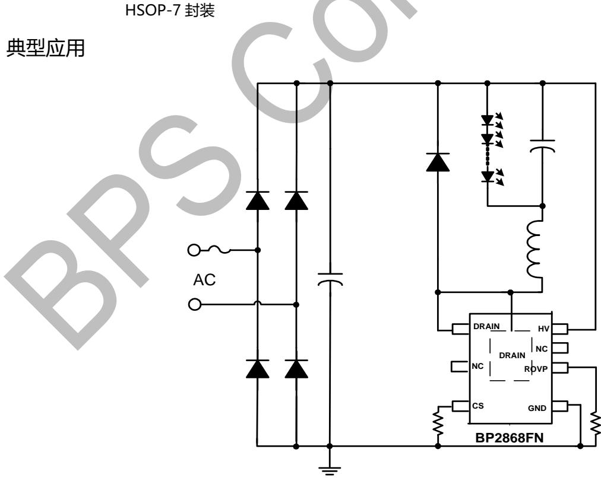
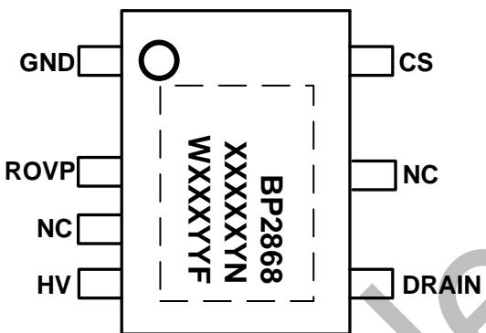
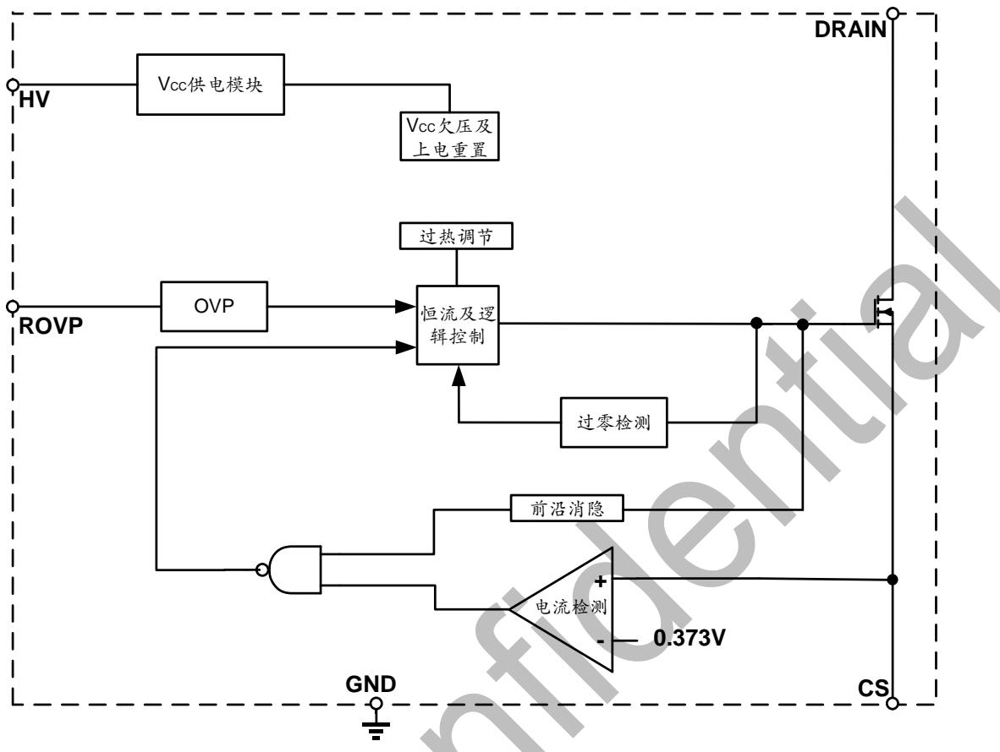
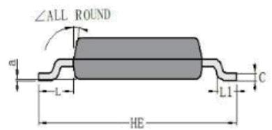
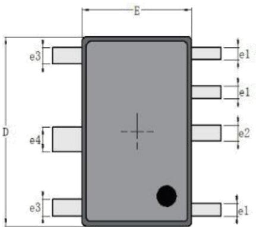
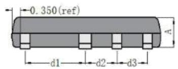
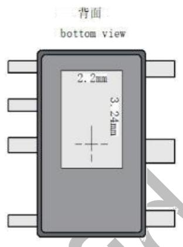
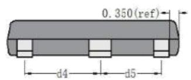
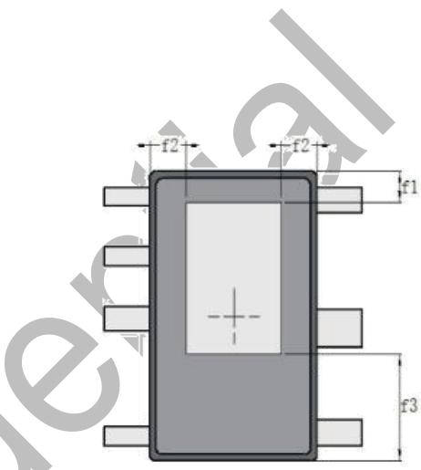

## 概述

BP2868FN 是一款高精度降压型 LED 恒流驱动芯片。芯片工作在电感电流临界连续模式，适用 85Vac\~265Vac全范围输入电压的非隔离降压型 LED 恒流电源。芯片ROVP 引脚带 Enable 功能，适用于开关调色和感应灯应用。

BP2868FN 芯片内部集成 500V 功率开关，采用特有的退磁检测技术和高压 JFET 供电技术，无需 VCC 电容和启动电阻，使其外围器件更简单，节约了外围的成本和体积。

BP2868FN 芯片内置高精度的电流采样电路，实现高精度的 LED 恒流输出和优异的线电压调整率。芯片工作在电感电流临界模式，输出电流不随电感量和 LED 工作电压的变化而变化，实现优异的负载调整率。

BP2868FN 具有多重保护功能，包括 LED 短路保护，外置 OVP，芯片温度过热调节等。

BP2868FN 采用 HSOP-7 封装。

## 特点

◼ OVP 抗干扰能力强

◼ Enable 功能兼容开关调色和感应灯

◼ 无 VCC 电容、无启动电阻

◼ 集成高压供电功能

◼ 外置防潮 OVP 功能

◼ 低母线电压下不闪灯

◼ ±5% LED 输出电流精度

◼ LED 短路保护

◼ 过热调节功能

◼ 采用 HSOP-7 封装

## 应用

◼ LED 蜡烛灯

◼ LED 球泡灯

◼ 其它 LED 照明

## 典型应用

HSOP-7 封装  
  
图 1 BP2868FN 典型应用图

YY：周号

## 定购信息

<table><tr><td>定购型号</td><td>封装</td><td>包装形式</td><td>打印</td></tr><tr><td>BP2868FN</td><td>HSOP-7</td><td>卷盘5,000 颗/盘</td><td>BP2868XXXXYNXXXXYYF</td></tr></table>

## 管脚封装

  
图 2 管脚封装图

## 管脚描述

<table><tr><td>管脚号</td><td>管脚名称</td><td>描述</td></tr><tr><td>1</td><td>GND</td><td>芯片地</td></tr><tr><td>2</td><td>ROVP</td><td>OVP 设置引脚</td></tr><tr><td>3</td><td>NC</td><td>无连接</td></tr><tr><td>4</td><td>HV</td><td>芯片高压供电端</td></tr><tr><td>5</td><td>DRAIN</td><td>内部高压功率管漏极</td></tr><tr><td>6</td><td>NC</td><td>无连接</td></tr><tr><td>7</td><td>CS</td><td>电流采样端,采样电阻接在 CS 和 GND 端之间</td></tr><tr><td>衬底</td><td>DRAIN</td><td>内部高压功率管漏极</td></tr></table>

极限参数(注 1)

<table><tr><td>符号</td><td>参数</td><td>参数范围</td><td>单位</td></tr><tr><td>HV</td><td>500V芯片高压供电接口</td><td>-0.3~500</td><td>V</td></tr><tr><td>DRAIN</td><td>内部高压功率管漏极到源极峰值电压</td><td>-0.3~500</td><td>V</td></tr><tr><td>ROVP</td><td>开路保护电压设置端,接电阻到地</td><td>-0.3~8</td><td>V</td></tr><tr><td>CS</td><td>电流采样端</td><td>-0.3~8</td><td>V</td></tr><tr><td rowspan="2"> $I_{DMAX}$ </td><td rowspan="2">漏极最大电流@TJ=100°C</td><td>F</td><td rowspan="2">mA</td></tr><tr><td>1100</td></tr><tr><td> $P_{DMAX}$ </td><td>功耗(注2)</td><td>1.25</td><td>W</td></tr><tr><td> $\theta_{JA}$ </td><td>PN结到环境的热阻</td><td>90</td><td>°C/W</td></tr><tr><td> $T_J$ </td><td>工作结温范围</td><td>-40 to 150</td><td>°C</td></tr><tr><td> $T_{STG}$ </td><td>储存温度范围</td><td>-55 to 150</td><td>°C</td></tr><tr><td></td><td>ESD(注3)</td><td>2</td><td>kV</td></tr></table>

注 1：最大极限值是指超出该工作范围，芯片有可能损坏。推荐工作范围是指在该范围内，器件功能正常，但并不完全保证满足个别性能指标。  
注 2：温度升高最大功耗一定会减小，这也是由 T , $\mathsf { \theta } _ { \mathsf { J A } _ { r } }$ 和环境温度 T 所决定的。最大允许功耗为 $P _ { \mathsf { D M A X } } = ( { \mathsf { T } } _ { \mathsf { J M A X } } - { \mathsf { T } } _ { \mathsf { A } } ) / \oplus _ { \mathsf { J A } }$ 或是极限范围给出的数字中比较低的那个值。  
注 3：人体模型，100pF电容通过 1.5kΩ 电阻放电。

工作范围

<table><tr><td>符号</td><td>参数范围</td><td>单位</td></tr><tr><td colspan="3">Vin=176Vac~265Vac,腔体温度 60°C</td></tr><tr><td rowspan="2">ILED max最大输出电流</td><td>FN</td><td rowspan="2">mA</td></tr><tr><td>500</td></tr><tr><td rowspan="2">POUT max最大输出功率</td><td>FN</td><td rowspan="2">W</td></tr><tr><td>43W</td></tr><tr><td colspan="3">Vin=176Vac~265Vac,腔体温度 90°C</td></tr><tr><td rowspan="2">ILED max最大输出电流</td><td>FN</td><td rowspan="2">mA</td></tr><tr><td>450</td></tr><tr><td rowspan="2">POUT max最大输出功率</td><td>FN</td><td rowspan="2">W</td></tr><tr><td>37W</td></tr><tr><td rowspan="2">VLED min最小负载电压</td><td>FN</td><td rowspan="2">V</td></tr><tr><td>&gt;30</td></tr></table>

电气参数(注 4, 5) （无特别说明情况下， ${ \mathsf { T A } } = 2 5 { \mathsf { \Omega } } ^ { \circ } { \mathsf { C } } { \mathsf { ) } }$

<table><tr><td>符号</td><td>描述</td><td>条件</td><td>最小值</td><td>典型值</td><td>最大值</td><td>单位</td></tr><tr><td colspan="7">电源电压</td></tr><tr><td> $I_{CC}$ </td><td>芯片工作电流</td><td> $F_{OP}=4kHz$ </td><td></td><td>200</td><td></td><td>μA</td></tr><tr><td colspan="7">电流采样</td></tr><tr><td> $V_{CS\_TH}$ </td><td>电流检测阈值</td><td></td><td></td><td>373</td><td></td><td>mV</td></tr><tr><td> $T_{LEB}$ </td><td>前沿消隐时间</td><td></td><td></td><td>500</td><td></td><td>ns</td></tr><tr><td> $T_{DELAY}$ </td><td>芯片关断延迟</td><td></td><td></td><td>200</td><td></td><td>ns</td></tr><tr><td colspan="7">内部时间控制</td></tr><tr><td> $T_{OFF\_MIN}$ </td><td>最小退磁时间</td><td></td><td></td><td>1.7</td><td></td><td>μs</td></tr><tr><td> $T_{OFF\_MAX}$ </td><td>最大退磁时间</td><td></td><td></td><td>400</td><td></td><td>μs</td></tr><tr><td> $T_{ON\_MAX}$ </td><td>最大开通时间</td><td></td><td></td><td>50</td><td></td><td>μs</td></tr><tr><td> $T_{OVP\_RST}$ </td><td>OVP重启时间</td><td></td><td></td><td>10</td><td></td><td>ms</td></tr><tr><td colspan="7">ROVP</td></tr><tr><td> $V_{EN}$ </td><td>ROVP引脚开机阈值</td><td></td><td></td><td>0.3</td><td></td><td>V</td></tr><tr><td> $I_{OVP}$ </td><td>OVP引脚电流</td><td></td><td></td><td>95</td><td></td><td>μA</td></tr><tr><td colspan="7">功率管</td></tr><tr><td> $BV_{DSS}$ </td><td>功率管的击穿电压</td><td> $V_{GS}=0V/ I_{DS}=250μA$ </td><td>500</td><td></td><td></td><td>V</td></tr><tr><td> $I_{DSS}$ </td><td>功率管漏电流</td><td> $V_{GS}=0V/V_{DS}=500V$ </td><td></td><td></td><td>1</td><td>μA</td></tr><tr><td> $R_{DS\_ON}$ </td><td>功率管导通阻抗</td><td> $V_{GS}=10V/ I_{DS}=0.1A$ </td><td></td><td>3</td><td></td><td>Ω</td></tr><tr><td colspan="7">过热调节</td></tr><tr><td> $T_{REG}$ </td><td>过热调节温度</td><td></td><td></td><td>140</td><td></td><td>°C</td></tr></table>

注 4：典型参数值为25˚C 下测得的参数标准。  
注 5：规格书的最小、最大规范范围由测试保证，典型值由设计、测试或统计分析保证。

## 内部结构框图

## 图 3 BP2868FN 内部框图

## 应用信息

BP2868FN 是一款专用于 LED 照明的恒流驱动芯片，应用于非隔离降压型 LED 驱动电源。采用特有的退磁检测技术和高压 JFET 供电技术，无需 VCC 电容和启动电阻，使其外围器件更简单，节约了外围的成本和体积。

## 1 启动

系统上电后，母线电压通过 HV 脚对芯片内部供电，当内部供电电压达到芯片开启阈值时，芯片内部控制电路开始工作。芯片正常工作时，所需的工作电流仍然通过内部的JFET 对其提供。

## 2 恒流控制，输出电流设置

芯片逐周期检测电感的峰值电流，CS 端连接到内部的峰值电流比较器的输入端，与内部 0.373V 阈值电压进行比较，当 CS电压达到内部检测阈值时，功率管关断。电感峰值电流的计算公式为：

$$
I _ {\mathrm{PK}} = \frac {0 . 3 7 3}{R _ {C S}}
$$

其中，RCS为电流采样电阻阻值。

CS 比较器的输出还包括一个 500ns 前沿消隐时间。

LED 输出电流计算公式为：

$$
\mathrm{I} _ {\mathrm{LED}} = \frac {\mathrm{I} _ {\mathrm{PK}}}{2}
$$

其中， IPK 是电感的峰值电流。

## 3 储能电感

BP2868FN 工作在电感电流临界模式，当功率管导通时，

流过储能电感的电流从零开始上升，导通时间为：

$$
t _ {\text { on }} = \frac {L \times I _ {\mathrm{PK}}}{V _ {\mathrm{IN}} - V _ {\mathrm{LED}}}
$$

其中，L 是电感量；IPK 是电感电流的峰值；VIN 是经整流后的母线电压；VLED 是输出 LED 上的电压。

当功率管关断时，流过储能电感的电流从峰值开始往下降，当电感电流下降到零时，芯片内部逻辑再次将功率管开通。功率管的关断时间为：

$$
t _ {\mathrm{off}} = \frac {L \times I _ {\mathrm{PK}}}{V _ {\mathrm{LED}}}
$$

储能电感的计算公式为：

$$
L = \frac {V _ {L E D} \times (V _ {I N} - V _ {L E D})}{f \times I _ {P K} \times V _ {I N}}
$$

其中，f 为系统工作频率。BP2868FN 的系统工作频率和输入电压成正比关系，设置 BP2868FN 系统工作频率时，入电压最高时，系统的工作频率也最高。

BP2868FN 设置了系统的最小退磁时间和最大退磁时间，分别为 1.7μs 和 $4 0 0 \mu \ s$ 。由 t 的计算公式可知，如果电感量很小时，t 很可能会小于芯片的最小退磁时间，系统就会进入电感电流断续模式，LED 输出电流会背离设计值；而当电感量很大时，tOFF 又可能会超出芯片的最大退磁时间，这时系统就会进入电感电流连续模式，输出 LED电流同样也会背离设计值。所以选择合适的电感值很重要。

## 4 过压保护电阻设置

开路保护电压可以通过 ROVP引脚电阻来设置，ROVP 引脚流出的电流约为 $9 5 \mu \mathsf { A } .$

当 LED 开路时，输出电压逐渐上升，退磁时间变短,当芯片连续三个周期都检测到退磁时间变短时，芯片进入开路保护状态。因此可以根据需要设定的开路保护电压，来计算退磁时间 Tovp。

$$
T o v p \approx \frac {L \times V c s}{R c s \times V o v p}
$$

其中，

Vcs 是 CS 关断阈值（373mV）

Vovp 是需要设定的过压保护点

然后根据 Tovp 时间来计算 Rovp 的电阻值，公式如下：

$$
\mathrm{Rovp} \approx \frac {5 0}{\mathrm{Tovp}} * 1 0 ^ {- 3}
$$

注：ROVP 脚有 EN 功能， ROVP 电压高于 0.3V，芯片芯于 5k；如不需要 OVP 功能，

## 5 保护功能

BP2868FN 内置多种保护功能，包括 LED 短路保护，LED开路保护，芯片温度过热调节等。

当 LED 短路时，系统工作在 4kHz 低频，所以功耗很低。BP2868FN 通过过温调节电路检测芯片温度，当温度超过140℃时，芯片进入过温调节状态，逐渐减小输出电流，从而控制输出功率和温升，使芯片温度控制在一定值，以提高系统的可靠性。

## 6 PCB 设计

在设计 PCB 时，需要遵循以下指南：

## CS 采样电阻

电流采样电阻的功率地线尽可能短，且要和芯片 的地线及其它小信号的地线分头接到母线电容的地，此外加大CS引脚的铺铜面积可以增强芯片散热。

## HV 引脚

在焊接允许的情况下，HV 引脚尽量远离 CS 引脚和其他低压引脚

## 功率环路的面积

减小功率环路的面积，如功率电感、功率管、母线电容的环路面积，以及功率电感、续流二极管、输出电容的环路面积，以减小 EMI 辐射。

## ROVP 引脚

开路保护电压设置电阻要尽可能靠近芯片 ROVP 引脚，同时此引脚的走线要尽量远离高压引脚和噪声源。

## DRAIN 引脚

增加 DRAIN 引脚的铺铜面积以提高芯片散热。

## 封装信息

<table><tr><td>Unit</td><td></td><td>A</td><td>C</td><td>D</td><td>E</td><td>HE</td><td>d1</td><td>d2</td><td>d3</td><td>d4</td><td>d5</td><td>e1</td><td>e2</td><td>e3</td><td>e4</td><td>L</td><td>L1</td><td>a</td><td>∠</td><td>f1</td><td>f2</td><td>f3</td></tr><tr><td rowspan="3">mm</td><td>max</td><td>1.25</td><td>0.22</td><td>6.4</td><td>4.1</td><td>6.1</td><td>2.56</td><td>1.38</td><td>1.32</td><td>2.28</td><td>2.78</td><td>0.45</td><td>0.56</td><td>0.60</td><td>0.85</td><td>1.15</td><td>0.7</td><td rowspan="3">0.2(ref)</td><td rowspan="6">12°</td><td>0.71</td><td>0.9</td><td>2.35</td></tr><tr><td>typ</td><td>1.15</td><td>0.20</td><td>6.2</td><td>3.9</td><td>6.0</td><td>2.51</td><td>1.33</td><td>1.27</td><td>2.23</td><td>2.73</td><td>0.40</td><td>0.51</td><td>0.55</td><td>0.80</td><td>1.05</td><td>0.5</td><td>0.66</td><td>0.85</td><td>2.3</td></tr><tr><td>min</td><td>1.05</td><td>0.15</td><td>6.0</td><td>3.70</td><td>5.9</td><td>2.46</td><td>1.28</td><td>1.22</td><td>2.18</td><td>2.68</td><td>0.35</td><td>0.46</td><td>0.50</td><td>0.75</td><td>0.95</td><td>0.3</td><td>0.61</td><td>0.8</td><td>2.25</td></tr><tr><td rowspan="3">mil</td><td>max</td><td>49</td><td>9</td><td>252</td><td>161</td><td>240</td><td>101</td><td>54</td><td>52</td><td>90</td><td>109</td><td>18</td><td>22</td><td>24</td><td>33</td><td>45</td><td>28</td><td rowspan="3">8(ref)</td><td>28</td><td>35</td><td>93</td></tr><tr><td>typ</td><td>45</td><td>8</td><td>244</td><td>154</td><td>236</td><td>99</td><td>52</td><td>50</td><td>88</td><td>107</td><td>16</td><td>20</td><td>22</td><td>31</td><td>41</td><td>20</td><td>26</td><td>33</td><td>91</td></tr><tr><td>min</td><td>41</td><td>6</td><td>236</td><td>146</td><td>232</td><td>97</td><td>50</td><td>48</td><td>86</td><td>106</td><td>14</td><td>18</td><td>20</td><td>30</td><td>37</td><td>12</td><td>24</td><td>31</td><td>89</td></tr></table>

## 版本信息

<table><tr><td>版本</td><td>日期</td><td>记录</td></tr><tr><td>Rev. 1.0</td><td>2025/04</td><td>首次发行</td></tr><tr><td></td><td></td><td></td></tr><tr><td></td><td></td><td></td></tr></table>

#

## 免责声明

晶丰明源尽力确保本产品规格书内容的准确和可靠，但是保留在没有通知的情况下，修改规格书内容的权利。

本产品规格书未包含任何针对晶丰明源或第三方所有的知识产权的授权。针对本产品规格书所记载的信息，晶丰明源不做任何明示或暗示的保证，包括但不限于对规格书内容的准确性、商业上的适销性、特定目的的适用性或者不侵犯晶丰明源或任何第三人知识产权做任何明示或暗示保证，晶丰明源也不就因本规格书本身及其使用有关的偶然或必然损失承担任何责任。

## 电子器件报废说明

该产品在生命周期结束后，由客户按照一般电子产品的报废流程进行处理。