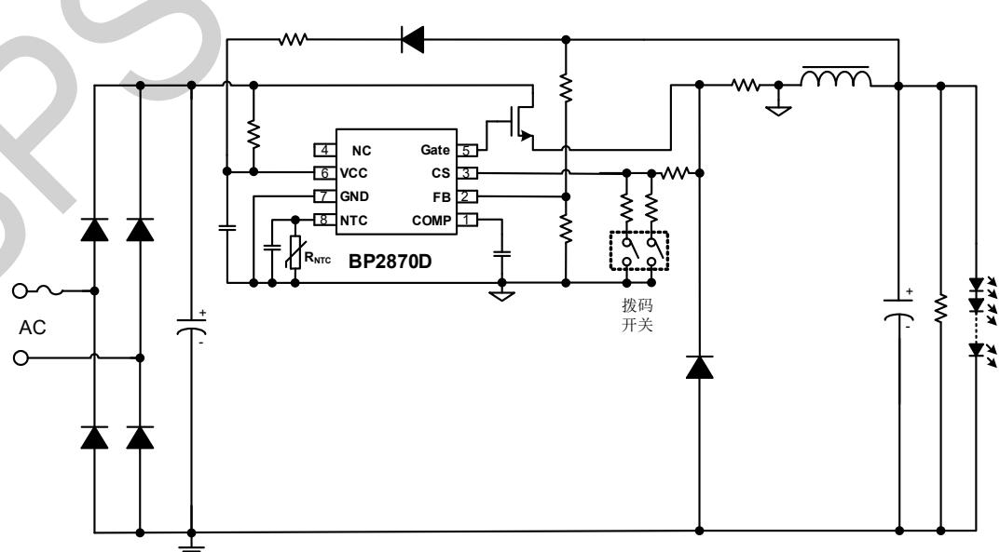
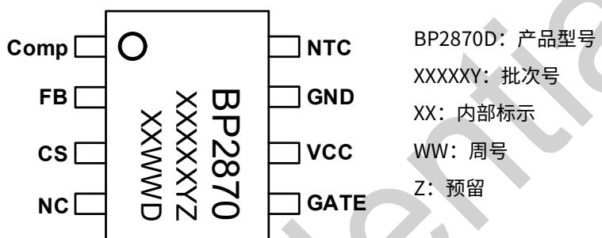
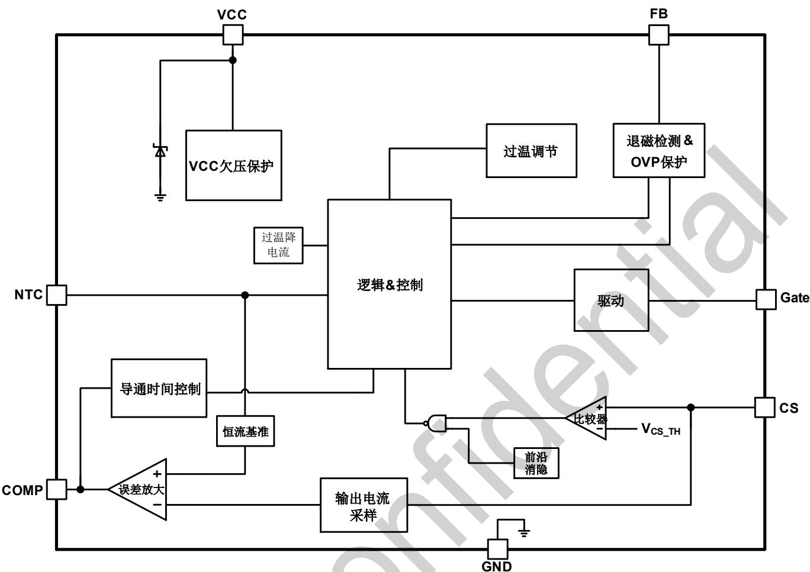
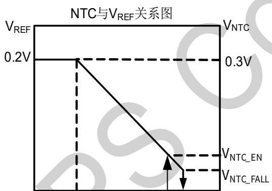
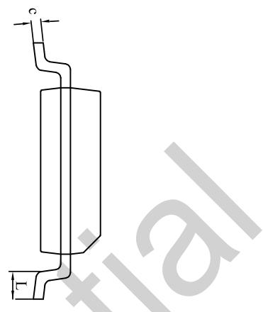
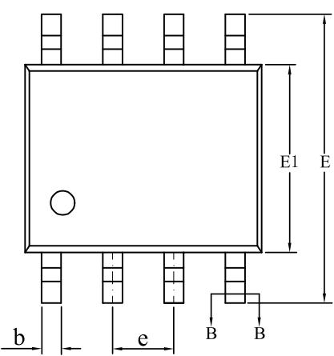
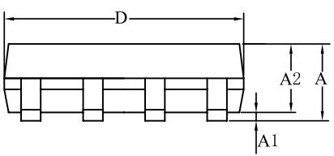
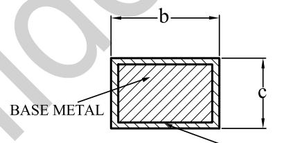

## BP2870D低PF 非隔离降压型 LED 恒流驱动芯片

## 概述

BP2870D 是⼀款专⻔⽤于低 PF 浮地 Buck LED 的恒流驱动芯片，采⽤全周期闭环采样，在输出宽范围下提高了恒流精度。

BP2870D可通过独立的CS电流信号采样脚，实现拨码调电流功能，选择不同电阻进⾏输出电流设置，可避免拨码开关流经大电流，延⻓使⽤寿命，也可避免功率回路⾛线过⻓。

BP2870D 通过拨码开关调电流时，OVP 电压不受输出电流档位影响，提高了系统的可靠性和安全性。

BP2870D 全周期采样电感电流，对电感电流平均值进⾏闭环控制，从而实现高精度恒流，在很宽的负载范围内实现优异的负载调整率。

BP2870D 提供完善的保护功能，包括 VCC 欠压锁定、输出开路保护、输出短路保护、逐周期限流保护、内置过温降电流和外置 NTC 过温降电流等。

BP2870D 采⽤ SOP-8 封装。

## 特点

 全周期采样电感电流，恒流精度高

 优异的负载调整率

 支持超宽输出电压负载

 外置 NTC 过温降电流

 高精度电流参考(+/-3%)

 临界导通和限频模式，优化了 EMC

 VCC 低启动电流

 保护功能

 VCC 欠压锁定(UVLO)

 逐周期限流（OCP）

输出开路保护（OVP）

 输出短路保护（SCP）

 内置过温降电流保护（OTP）

## 应用领域

 LED 三防灯

 LED 线条灯

## 典型应用

SOP-8 封装  
  
图 1. BP2870D 典型应⽤电路  
注：该线路及参数仅供参考，实际应⽤电路和参数请通过试验充分验证。

XXXXXY：批次号

## 定购信息

<table><tr><td>定购型号</td><td>封装</td><td>包装形式</td><td>打印</td></tr><tr><td>BP2870D</td><td>SOP-8</td><td>卷盘4,000PCS/盘</td><td>BP2870XXXXXYZXXWWD</td></tr></table>

## 管脚封装

  
图 2. SOP-8 管脚封装图

## 管脚描述

<table><tr><td>管脚号</td><td>管脚名称</td><td>描述</td></tr><tr><td>1</td><td>COMP</td><td>环路补偿脚</td></tr><tr><td>2</td><td>FB</td><td>反馈信号采样脚</td></tr><tr><td>3</td><td>CS</td><td>原边电流采样脚</td></tr><tr><td>4</td><td>NC</td><td>未连接</td></tr><tr><td>5</td><td>GATE</td><td>驱动脚</td></tr><tr><td>6</td><td>VCC</td><td>芯片供电脚</td></tr><tr><td>7</td><td>GND</td><td>芯片地</td></tr><tr><td>8</td><td>NTC</td><td>外接 NTC 引脚实现外置过温降电流,拉低到地可关闭芯片</td></tr></table>

极限参数(注 1)

<table><tr><td>符号</td><td>参数</td><td>参数范围</td><td>单位</td></tr><tr><td> $V_{Gate}$ </td><td>驱动引脚电压</td><td>-0.3~20</td><td>V</td></tr><tr><td> $I_{VCC\_MAX}$ </td><td>VCC 引脚最大钳位电流</td><td>5</td><td>mA</td></tr><tr><td> $V_{CS}$ </td><td>CS 引脚电压</td><td>-0.3~6</td><td>V</td></tr><tr><td> $V_{FB}$ </td><td>FB 引脚电压</td><td>-0.3~6</td><td>V</td></tr><tr><td> $V_{NTC}$ </td><td>NTC 引脚电压</td><td>-0.3~6</td><td>V</td></tr><tr><td> $V_{COMP}$ </td><td>COMP 引脚电压</td><td>-0.3~6</td><td>V</td></tr><tr><td> $P_{DMAX}$ </td><td>功耗(注 2)</td><td>0.45</td><td>W</td></tr><tr><td> $\theta_{JA}$ </td><td>结到环境的热阻(注 3)</td><td>150</td><td>°C/W</td></tr><tr><td> $T_J$ </td><td>工作结温范围</td><td>-40~150</td><td>°C</td></tr><tr><td> $T_{STG}$ </td><td>储存温度范围</td><td>-55~150</td><td>°C</td></tr></table>

注 1：极限参数是指超出该范围，有可能导致器件永久性损坏。极限参数为器件应⼒的额定值，⻓期工作在极限参数条件可能会影响器件的可靠性。  
注 2：温度升高最大功耗⼀定会减小，这也是由 TJMAX, θJA,和环境温度TA所决定的。最大允许功耗为 $\mathsf { P } _ { \mathsf { D M A X } } = ( \mathsf { T } _ { \mathsf { J M A X } } - \mathsf { T } _ { \mathsf { A } } ) /$ θ 或是极限范围给出的数字中比较低的那个值。  
注 3：1平方英寸双层 PCB板，按照JEDEC 标准测试。

电气参数(注 4) （无特别说明情况下， ${ \sf T } _ { \sf A } = 2 5 ^ { \circ } { \sf C } )$

<table><tr><td>符号</td><td>描述</td><td>条件</td><td>最小值</td><td>典型值</td><td>最大值</td><td>单位</td></tr><tr><td colspan="7">芯片供电 (VCC)</td></tr><tr><td> $V_{CC\_CLAMP}$ </td><td> $V_{CC}$ 钳位电压</td><td>1mA</td><td>15</td><td>17</td><td>19</td><td>V</td></tr><tr><td> $V_{CC\_ON}$ </td><td> $V_{CC}$ 启动阈值电压</td><td> $V_{CC}$ 上升至IC开启</td><td>13.5</td><td>15</td><td>16.5</td><td>V</td></tr><tr><td> $V_{CC\_UVLO}$ </td><td> $V_{CC}$ 欠压保护开启电压</td><td> $V_{CC}$ 下降至IC关闭</td><td>6.7</td><td>7.5</td><td>8.3</td><td>V</td></tr><tr><td> $I_{ST}$ </td><td> $V_{CC}$ 启动电流</td><td> $V_{CC}=13V$ </td><td>70.5</td><td>94</td><td>117.5</td><td>μA</td></tr><tr><td> $I_{QUIESCENT}$ </td><td> $V_{CC}$ 静态工作电流</td><td>无开关动作</td><td>0.1</td><td>0.15</td><td>0.27</td><td>mA</td></tr><tr><td colspan="7">误差放大器 (COMP)</td></tr><tr><td> $G_m$ </td><td>误差放大器跨导</td><td></td><td></td><td>60</td><td></td><td>μA/V</td></tr><tr><td> $V_{COMP}$ </td><td>COMP线性工作范围</td><td></td><td>1.5</td><td></td><td>4.5</td><td>V</td></tr><tr><td> $V_{REF}$ </td><td>内部基准电压</td><td></td><td></td><td>200</td><td></td><td>mV</td></tr><tr><td colspan="7">内部时间控制</td></tr><tr><td> $T_{ON\_MAX}$ </td><td>功率管最大导通时间</td><td></td><td></td><td>15</td><td></td><td>μs</td></tr><tr><td> $T_{OFF\_MAX}$ </td><td>功率管最大关断时间</td><td></td><td>114</td><td>170</td><td>266</td><td>μs</td></tr><tr><td> $T_{ZCD\_MASK}$ </td><td>退磁检测屏蔽时间</td><td></td><td></td><td>1.6</td><td></td><td>μs</td></tr><tr><td> $T_{OVP\_MASK}$ </td><td>OVP保护屏蔽时间</td><td></td><td></td><td>1.3</td><td></td><td>μs</td></tr><tr><td> $T_{ON\_MIN}$ </td><td>功率管最小导通时间</td><td></td><td>228</td><td>380</td><td>532</td><td>ns</td></tr><tr><td colspan="7">电流采样 (CS)</td></tr><tr><td> $V_{CS\_TH1}$ </td><td>逐周期限流阈值1</td><td>FB&gt;0.25V</td><td></td><td>500</td><td></td><td>mV</td></tr><tr><td> $V_{CS\_TH2}$ </td><td>逐周期限流阈值2</td><td>FB≤0.25V</td><td></td><td>200</td><td></td><td>mV</td></tr><tr><td> $T_{LEB}$ </td><td>前沿消隐时间</td><td></td><td></td><td>300</td><td></td><td>ns</td></tr><tr><td colspan="7">外置NTC降电流 (NTC)</td></tr><tr><td> $V_{NTC}$ </td><td>NTC引脚开始降电流</td><td></td><td></td><td>0.3</td><td></td><td>V</td></tr><tr><td> $V_{NTC\_EN}$ </td><td>NTC使能电压</td><td>NTC上升</td><td></td><td>75</td><td>95</td><td>mV</td></tr><tr><td> $V_{NTC\_FALL}$ </td><td>NTC下降关断电压</td><td>NTC下降</td><td>17</td><td>37.5</td><td></td><td>mV</td></tr><tr><td colspan="7">保护功能</td></tr><tr><td> $V_{FB\_FALL}$ </td><td>FB下降阈值电压</td><td>FB下降</td><td></td><td>0.1</td><td></td><td>V</td></tr><tr><td> $V_{FB\_RISE}$ </td><td>FB上升阈值电压</td><td>FB上升</td><td></td><td>0.2</td><td></td><td>V</td></tr><tr><td> $V_{FB\_OVP}$ </td><td>FB过压保护阈值</td><td></td><td>1.92</td><td>2.025</td><td>2.13</td><td>V</td></tr><tr><td colspan="7">栅极驱动(GATE)</td></tr><tr><td> $I_{SOURCE}$ </td><td>最大驱动上拉电流</td><td></td><td></td><td>200</td><td></td><td>mA</td></tr><tr><td> $I_{Sink}$ </td><td>最大驱动下拉电流</td><td></td><td></td><td>600</td><td></td><td>mA</td></tr><tr><td colspan="7">内置过温保护</td></tr><tr><td> $T_{REG}$ </td><td>过温降电流阈值</td><td></td><td></td><td>145</td><td></td><td>°C</td></tr></table>

## 内部结构框图

  
图 3. BP2870D 内部框图

## 功能描述

BP2870D 是⼀款专⻔⽤于低 $\mathsf { P F }$ 浮地 Buck 的 LED 恒流驱动芯片，采⽤全周期闭环采样，提高恒流精度。BP2870D 的CS 引脚支持通过拨码开关选择不同电阻进⾏输出电流设置，可避免拨码开关流经大电流，延⻓使⽤寿命，也可避免

## 启动

系统上电以后，输入电压通过启动电阻对 $\mathsf { V } _ { \mathsf { C C } }$ 电容充电，当$\mathsf { V } _ { \mathsf { C C } }$ 电压达到芯片开启阈值时，芯片内部控制电路开始工作，COMP 电压快速建立。然后 BP2870D 开始输出脉冲信号，当 FB 电压低于 0.2V 时，系统工作在 $\mathsf { T o F F m a x }$ 状态。当 FB 引脚检测到正向电平大于0.25V以后，BP2870D转为闭环工作。

## 恒流控制与输出电流设置

BP2870D采⽤了电感电流全周期电流采样机制，在很宽的负

载电压范围内都可实现高精度输出恒流控制。

LED 输出电流计算方法：

$$
I _ {o u t} \approx \frac {V _ {R E F}}{R _ {c s}}
$$

其中：

$V _ { \mathsf { R E F } }$ F是内部基准电压

$\mathsf { R c s }$ 是电流采样电阻的值

## FB反馈控制

BP2870D 通过 FB 引脚检测电感电流过零的状态，上升阈值电压为 $V _ { F B \_ R 1 S E } \_ F B$ 的下降阈值电压设置在 $V _ { F B \_ F A L L }$ 。FB引脚也可以⽤来探测输出电压进⾏输出过压保护，当 FB 电压触发过压保护阈值 $V _ { F B \_ O \vee P }$ 时，芯片进入保护。FB 的上下分压电阻比例可以按下式计算：

$$
\frac {R _ {F B L}}{R _ {F B L} + R _ {F B H}} \approx \frac {V _ {\mathrm {FB\_OVP}}}{V _ {O V P}}
$$

其中：

$\mathsf { R } _ { \mathsf { F B L } }$ 是反馈网络的下分压电阻$\mathsf { R } _ { \mathsf { F B H } }$ 是反馈网络的上分压电阻$\mathsf { V o v p }$ 是输出电压过压保护设定值

## 内置过温调节功能

BP2870D 具有过热调节功能，在驱动电源过热时逐渐减小输出电流，从而控制输出功率和温升，使驱动电源温度保持在设定值，以提高系统的可靠性。芯片内部设定过热调节温度点为 $\mathsf { T } _ { \mathsf { R E G c } }$

## 外置NTC过温降电流功能

BP2870D 支持外接 NTC，实现过温点可调。当 NTC 电压为VNTC及以上时，过温调节为 TREG，当 NTC 电压开始小于 VNTC时，外部 NTC 过温降电流功能开始工作。NTC 引脚与内部恒流基准的关系如下图所示。当NTC电压低于 $V _ { N T C \_ F A L L } ,$ ,停止开关动作。当 NTC 电压恢复到 $V _ { \mathsf { N T C } } \mathsf { \_ E N }$ 以上时，系统恢复工作。

  
（开始进入过温降电流）12K ${ \sf R N T C }$ 2.5K 1.23K

## 保护功能

BP2870D 内置多重保护功能，保证了系统可靠性。

FB 检测加强了抗干扰性，增强了系统的可靠性，当 LED 开路时，输出电压逐渐上升，FB检测到的电压也会跟随上升。当 FB 检测到的电压升高到 VFB\_OVP 阈值时，会触发保护逻辑并停止开关工作， $\mathsf { V } _ { \mathsf { C C } }$ 被芯片放电至UVLO电压以下，进入故障保护状态。

当 LED 短路时，FB 检测不到退磁信号，系统工作在 TOFFmax状态，同时内部过流保护电压阈值被降低至VCS\_TH2,从而降低系统功耗。

当输出短路或者变压器饱和时，CS 峰值电压将会比较高。该开关周期⻢上停止。此逐周期限流功能可以保护功率 MOS 管、变压器和输出续流二极管。

## PCB Layout 指南

在设计 BP2870DPCB 板时，需要注意以下事项：

1) VCC的旁路电容需要紧靠芯片VCC和GND 引脚。

2) 电流采样电阻的功率地线尽可能粗，且要离芯片的地尽量近，以保证电流采样的准确性。拨码电阻应靠近芯片放置。另外，信号地需要单独连接到芯片的地引脚。

3) 减小大电流环路的⾯积，如⺟线电容、功率管、功率电感和输出电容的环路⾯积，以及功率电感、续流二极管、输出电容的环路⾯积，以减小 EMI 辐射。

4) 接到 FB 的分压电阻必须靠近 FB 引脚，且节点要远离变压器的动点，否则系统噪声容易误触发 FB OVP保护功能。建议在 FB 和芯片 GND 之间放置滤波电容，避免系统噪声干扰。

5) NTC 引脚与芯片 GND 之间放置滤波电容，避免系统开关噪声影响

BASE METAL

## 封装信息

  
SOP-8 封装外形尺寸

  
WITH PLATING

SECTION B-B

<table><tr><td rowspan="2">SYMBOL</td><td colspan="3">MILLIMETER</td></tr><tr><td>MIN</td><td>NOM</td><td>MAX</td></tr><tr><td>A</td><td>1.30</td><td>—</td><td>1.80</td></tr><tr><td>A1</td><td>0.05</td><td>—</td><td>0.25</td></tr><tr><td>A2</td><td>1.25</td><td>1.40</td><td>1.65</td></tr><tr><td>b</td><td>0.33</td><td>—</td><td>0.51</td></tr><tr><td>c</td><td>0.17</td><td>—</td><td>0.25</td></tr><tr><td>D</td><td>4.70</td><td>4.90</td><td>5.10</td></tr><tr><td>E</td><td>5.80</td><td>6.00</td><td>6.30</td></tr><tr><td>E1</td><td>3.70</td><td>3.90</td><td>4.10</td></tr><tr><td>e</td><td colspan="3">1.27BSC</td></tr><tr><td>L</td><td>0.40</td><td>—</td><td>1.00</td></tr></table>

## 版本信息

<table><tr><td>版本</td><td>日期</td><td>记录</td></tr><tr><td></td><td></td><td></td></tr><tr><td></td><td></td><td></td></tr></table>

## 免责声明

晶丰明源尽⼒确保本产品规格书内容的准确和可靠，但是保留在没有通知的情况下，修改规格书内容的权利。

本产品规格书未包含任何针对晶丰明源或第三方所有的知识产权的授权。针对本产品规格书所记载的信息，晶丰明源不做任何明示或暗示的保证，包括但不限于对规格书内容的准确性、商业上的适销性、特定⽬的的适⽤性或者不侵犯晶丰明源或任何第三⼈知识产权做任何明示或暗示保证，晶丰明源也不就因本规格书本⾝及其使⽤有关的偶然或必然损失承担任何责任。