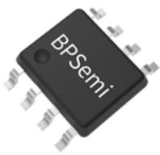
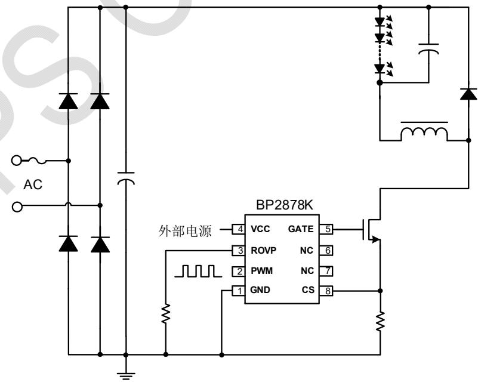
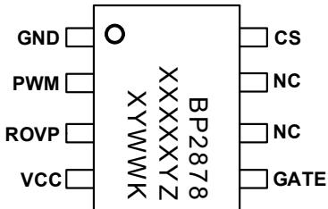
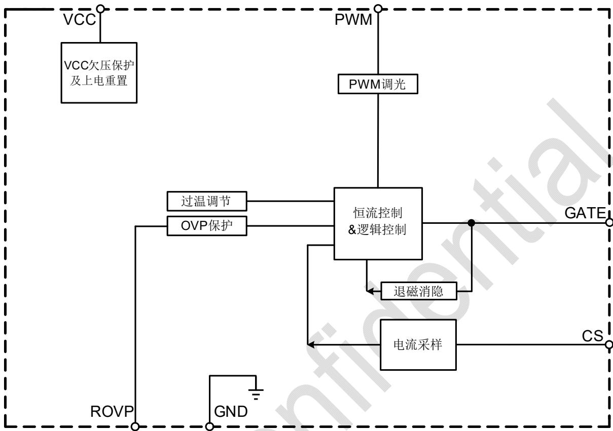
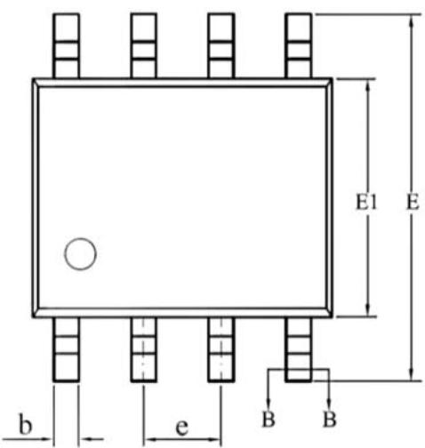
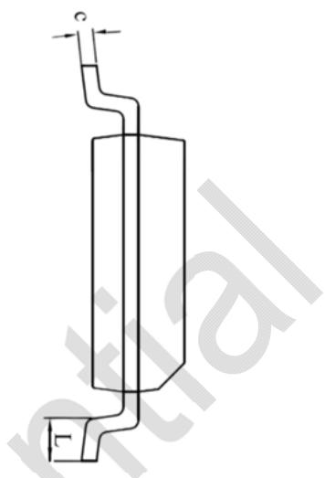
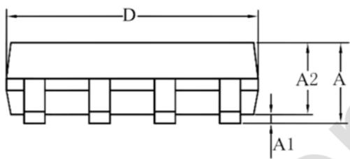
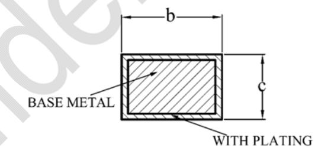

## 概述

BP2878K 是一款支持 PWM 调光的高精度降压型 LED 恒流驱动芯片，全程采用模拟调光控制模式，专为无频闪无噪声 LED 智能照明应用而设计。BP2878K 能够达到优异的调光线性度和输出电流一致性，适用于 85Vac\~265Vac 全压输入的非隔离降压型 LED 恒流电源。

BP2878K 芯片集成度高，无需辅助绕组，只需要很少的外围元件，即可实现优异的恒流特性，极大的节约了系统成本和体积。

BP2878K 芯片内部带有高精度的电流采样电路, 来实现精确的 LED 恒流输出和优异的线电压调整率。

BP2878K 具有多重保护功能，包括 LED 开路保护、LED 短路保护、芯片温度过热调节等。

BP2878K 采用 SOP-8 的封装。

## 特点

■ 支持 1%-100% 模拟调光

全程模拟调光无频闪

■ ±5% LED 输出电流精度

■ VCC 外部供电，支持低待机功耗设计

■ LED 开路保护

■ LED 短路保护

■ 过热调节功能

■ 采用 SOP-8 封装

## 应用领域

■ 高性能智能灯具

■ 大功率吸顶灯

■ 其它LED照明

## 典型应用

SOP-8 封装  
  
图 1 BP2878K 典型应用电路

## 定购信息

<table><tr><td>定购型号</td><td>封装</td><td>包装形式</td><td>打印</td></tr><tr><td>BP2878K</td><td>SOP-8</td><td>卷盘4,000/盘</td><td>BP2878XXXXYZXYWWK</td></tr></table>

## 管脚封装

  
BP2878K: 产品型号  
XXXXXY: 批次  
XY: 标识  
WW: 周号  
Z: 预留  
图 2 管脚封装图

## 管脚描述

<table><tr><td>管脚号</td><td>管脚名称</td><td>描述</td></tr><tr><td>1</td><td>GND</td><td>芯片地</td></tr><tr><td>2</td><td>PWM</td><td>PWM 调光信号输入端</td></tr><tr><td>3</td><td>ROVP</td><td>开路保护电压调节端,接电阻到地。电阻越大,OVP 电压越高</td></tr><tr><td>4</td><td>VCC</td><td>芯片电源</td></tr><tr><td>5</td><td>GATE</td><td>驱动信号输出脚</td></tr><tr><td>6,7</td><td>NC</td><td>无连接</td></tr><tr><td>8</td><td>CS</td><td>电流采样脚</td></tr></table>

## 极限参数(注1)

<table><tr><td>符号</td><td>参数</td><td>参数范围</td><td>单位</td></tr><tr><td> $I_{CC\_MAX}$ </td><td>VCC 引脚最大电源电流</td><td>5</td><td>mA</td></tr><tr><td>CS</td><td>电流采样端</td><td>-0.3~6</td><td>V</td></tr><tr><td>ROVP</td><td>开路保护电压调节端</td><td>-0.3~6</td><td>V</td></tr><tr><td>PWM</td><td>PWM 调光信号输入端</td><td>-0.3~24</td><td>V</td></tr><tr><td>GATE</td><td>驱动信号输出脚</td><td>-0.3~24</td><td>V</td></tr><tr><td> $P_{DMAX}$ </td><td>功耗(注 2)</td><td>0.45</td><td>W</td></tr><tr><td> $\theta_{JA}$ </td><td>结到环境的热阻(注3)</td><td>145</td><td>°C/W</td></tr><tr><td> $T_J$ </td><td>工作结温范围</td><td>-40~150</td><td>°C</td></tr><tr><td> $T_{STG}$ </td><td>储存温度范围</td><td>-55~150</td><td>°C</td></tr><tr><td>ESD</td><td>人体模型ESD(注4)</td><td>2</td><td>kV</td></tr></table>

注1：最大极限值是指超出该工作范围，芯片有可能损坏。推荐工作范围是指在该范围内，器件功能正常，但并不完全保证满足个别性能指标。电气参数定义了器件在工作范围内并且在保证特定性能指标的测试条件下的直流和交流电参数规范。对于未给定上下限值的参数，该规范不予保证其精度，但其典型值合理反映了器件性能。

注2：温度升高最大功耗一定会减小，这也是由 $T_{JMAX}, \theta_{JA}$ ，和环境温度 $T_A$ 所决定的。最大允许功耗为 $P_{DMAX} = (T_{JMAX} - T_A) / \theta_{JA}$ 或是极限范围给出的数字中比较低的那个值。

注3：1平方英寸双层PCB板，按照JEDEC标准测试。

注 4：按照 JEDEC 标准测试，100pF 电容通过 1.5kΩ 电阻放电。

## 电气参数(注5)（无特别说明情况下， $T_{A}=25^{\circ}C$ ）

<table><tr><td>符号</td><td>描述</td><td>条件</td><td>最小值</td><td>典型值</td><td>最大值</td><td>单位</td></tr><tr><td colspan="7">电源电压(VCC)</td></tr><tr><td> $V_{CC\_ON}$ </td><td>芯片启动电压</td><td> $V_{CC}$ 上升</td><td>9.3</td><td>10.4</td><td>11.5</td><td>V</td></tr><tr><td> $V_{CC\_UVLO}$ </td><td>芯片欠压保护阈值</td><td> $V_{CC}$ 下降</td><td>7.5</td><td>8.4</td><td>9.3</td><td>V</td></tr><tr><td> $V_{CC\_CLAMP}$ </td><td>芯片 VCC 钳位电压</td><td></td><td>12.7</td><td>14</td><td>17</td><td>V</td></tr><tr><td> $I_{CC}$ </td><td>芯片工作电流</td><td> $F_{OP}=3kHz$ </td><td></td><td>335</td><td>450</td><td>μA</td></tr><tr><td colspan="7">电流采样(CS)</td></tr><tr><td> $V_{REF}$ </td><td>恒流电压基准</td><td></td><td>291</td><td>300</td><td>309</td><td>mV</td></tr><tr><td> $T_{LEB}$ </td><td>前沿消隐时间</td><td></td><td></td><td>350</td><td></td><td>ns</td></tr><tr><td> $T_{DELAY}$ </td><td>芯片关断延迟</td><td></td><td></td><td>200</td><td></td><td>ns</td></tr><tr><td colspan="7">过压保护(ROVP)</td></tr><tr><td> $K_{OVP}$ </td><td>OVP 设置系数</td><td></td><td></td><td>12.5</td><td></td><td>V/H</td></tr><tr><td> $V_{OVP}$ </td><td>ROVP 引脚电压</td><td> $R_{OVP}=10kΩ$ </td><td></td><td>1</td><td></td><td>V</td></tr><tr><td colspan="7">内部时间控制</td></tr><tr><td> $T_{ZCD\_LEB}$ </td><td>退磁检测消隐时间</td><td></td><td></td><td>2.5</td><td></td><td>μs</td></tr><tr><td> $T_{OFF\_MAX}$ </td><td>最大退磁时间</td><td></td><td>225</td><td>375</td><td>525</td><td>μs</td></tr><tr><td> $T_{ON\_MAX}$ </td><td>最大开通时间</td><td></td><td></td><td>40</td><td></td><td>μs</td></tr><tr><td colspan="7">栅极驱动(GATE)</td></tr><tr><td> $I_{SOURCE}$ </td><td>最大驱动上拉电流</td><td></td><td></td><td>40</td><td></td><td>mA</td></tr><tr><td> $I_{SINK}$ </td><td>最大驱动下拉电流</td><td></td><td></td><td>100</td><td></td><td>mA</td></tr><tr><td colspan="7">PWM 调光(PWM)</td></tr><tr><td> $V_{PWM\_ON}$ </td><td>PWM 检测高电平</td><td> $V_{PWM}$ 上升</td><td></td><td>2</td><td>2.2</td><td>V</td></tr><tr><td> $V_{PWM\_OFF}$ </td><td>PWM 检测低电平</td><td> $V_{PWM}$ 下降</td><td>0.9</td><td>1.3</td><td></td><td>V</td></tr><tr><td> $T_{PWM\_ON\_MIN}$ </td><td>PWM 检测高电平最小时间</td><td></td><td></td><td>1.3</td><td></td><td>μs</td></tr><tr><td> $F_{DIM}$ </td><td>PWM 调光频率范围</td><td></td><td>0.5</td><td></td><td>4</td><td>kHz</td></tr><tr><td colspan="7">过温调节</td></tr><tr><td> $T_{REG}$ </td><td>过热调节温度</td><td></td><td></td><td>140</td><td></td><td>°C</td></tr></table>

注5：规格书的最小、最大规范范围由测试保证，典型值由设计、测试或统计分析保证。

## 内部结构框图

  
图 3 BP2878K 内部框图

## 功能描述

BP2878K 是一款专用于 LED 照明的恒流驱动芯片，应用于 PWM 调光非隔离降压型 LED 驱动电源。采用先进的恒流架构和控制方法，无需辅助绕组，只需要很少的外围元件，即可实现优异的恒流特性，极大的节约了系统成本和体积。

## 启动和供电

BP2878K 采用外部电源供电，当 VCC 供电电压达到芯片开启阈值时，芯片内部控制电路开始工作。芯片正常工作时，所需的工作电流由外部电源供电，便于降低系统的待机功耗。

## 恒流控制，输出电流设置

BP2878K 采用先进的恒流算法，将 CS 端电压采样后输入到电流控制电路，与内部基准电压进行比较，可以实现高精度输出恒流控制。

LED 满载输出电流计算方法：

$$
I _ {O U T} \approx \frac {V _ {\mathrm{REF}}}{R c s}
$$

其中：

$V_{REF}$ 是内部基准电压，

$R_{cs}$ 为电流采样电阻阻值。

电感峰值电流 $I_{PK}$ 约为 LED 输出电流的 2 倍。

## 储能电感

BP2878K 在功率管导通时，流过储能电感的电流从零开始上升，导通时间为：

$$
t _ {\mathrm{on}} = \frac {\mathrm{L} \times \mathrm{I} _ {\mathrm{PK}}}{\mathrm{V} _ {\mathrm{IN}} - \mathrm{V} _ {\mathrm{LED}}}
$$

其中：

L 是电感量；

$I_{PK}$ 是电感电流的峰值；

$V_{IN}$ 是经整流后的母线电压；

$V_{LED}$ 是输出 LED 上的电压。

当功率管关断时,流过储能电感的电流从峰值开始往下降到零。功率管的关断时间为:

$$
t _ {\text { off }} = \frac {L \times I _ {\mathrm{PK}}}{V _ {\mathrm{LED}}}
$$

储能电感的计算公式为：

$$
\mathrm{L} = \frac {\mathrm{V} _ {\mathrm{LED}} \times \left(\mathrm{V} _ {\mathrm{IN}} - \mathrm{V} _ {\mathrm{LED}}\right)}{\mathrm{f} \times \mathrm{I} _ {\mathrm{PK}} \times \mathrm{V} _ {\mathrm{IN}}}
$$

其中：

f 为系统工作频率。

BP2878K 的系统工作频率和输入电压成正比关系，设置 BP2878K 系统工作频率时，选择在输入电压最低时设置系统的最低工作频率，而当输入电压最高时，系统的工作频率也最高。

BP2878K 设置了系统的最小退磁时间和最大退磁时间，分别为 $2.5\mu s$ 和 $375\mu s$ 。由 $t_{OFF}$ 的计算公式可知，如果电感量很小， $t_{OFF}$ 很可能会小于芯片的最小退磁时间，系统就会进入电感电流断续模式；而当电感量很大时， $t_{OFF}$ 又可能会超出芯片的最大退磁时间，这时系统就会进入电感电流连续模式。所以选择合适的电感值很重要。

## 过压保护电阻设置

开路保护电压可以通过 ROVP 引脚电阻来设置，ROVP 引脚输出电流 $100 \mu A$ 。

当 LED 开路时，输出电压逐渐上升，退磁时间变短。因此可以根据需要设定的开路保护电压，来计算退磁时间 Tovp。

$$
V o v p \approx \frac {L ^ {*} R o v p}{R c s} * K _ {o v p}
$$

其中：

Kovp 是 OVP 系数;

Rcs 是 CS 采样电阻;

Vovp 是需要设定的过压保护点；

L 是功率电感感量；

Rovp 是设置 OVP 电压的电阻；

## 保护功能

BP2878K 内置多种保护功能，包括 LED 开路/短路保护，芯片温度过热调节等。当输出 LED 开路时，系统会触发过压保护逻辑并停止开关工作。系统进入开路保护状态后，芯片内部开始计时 80ms，然后系统重启。同时系统不断的检测负载状态，如果故障解除，系统会重新开始正常工作。

当 LED 短路时，系统工作在 3kHz 低频，所以功耗很低。同时系统不断地检测负载状态，如果故障解除，系统会重新开始正常工作。

## 过温调节功能

BP2878K 具有过热调节功能，在驱动电源过热时逐渐减小输出电流，从而控制输出功率和温升，使电源温度保持在设定值，以提高系统的可靠性。芯片内部设定的过热调节温度值为 $140^{\circ}$ C。

## PWM 调光

BP2878K 支持 500Hz-4kHz PWM 信号调光，LED 平均电流将根据 PWM 占空比从 1%-100% 变化，PWM 输入无需 RC 滤波。

## PCB Layout 指南

在设计 BP2878K 应用 PCB 时，需要遵循以下建议：

1) 电流采样电阻的功率地线尽可能短，且要和芯片的地线及其它小信号的地线分别接到母线电容的地端。

2) 开路保护电压设置电阻需要尽量靠近芯片 ROVP 引脚，远离外置 MOS 的 DRAIN 等噪声走线。

3) 减小功率环路的面积，如功率电感、功率管、母线电容的环路面积，以及功率电感、续流二极管、输出电容的环路面积，以减小EMI辐射。

## 封装信息

SOP-8 封装外形尺寸  

  
WITH PLATING

SECTION B-B

<table><tr><td rowspan="2">SYMBOL</td><td colspan="3">MILLIMETER</td></tr><tr><td>MIN</td><td>NOM</td><td>MAX</td></tr><tr><td>A</td><td>1.30</td><td>—</td><td>1.80</td></tr><tr><td>A1</td><td>0.05</td><td>—</td><td>0.25</td></tr><tr><td>A2</td><td>1.25</td><td>1.40</td><td>1.65</td></tr><tr><td>b</td><td>0.33</td><td>—</td><td>0.51</td></tr><tr><td>c</td><td>0.17</td><td>—</td><td>0.25</td></tr><tr><td>D</td><td>4.70</td><td>4.90</td><td>5.10</td></tr><tr><td>E</td><td>5.80</td><td>6.00</td><td>6.20</td></tr><tr><td>E1</td><td>3.70</td><td>3.90</td><td>4.10</td></tr><tr><td>e</td><td colspan="3">1.27BSC</td></tr><tr><td>L</td><td>0.40</td><td>—</td><td>1.00</td></tr></table>

## 版本信息

<table><tr><td>版本</td><td>日期</td><td>记录</td></tr><tr><td>Rev. 1.0</td><td>2020/09</td><td>首次发行</td></tr><tr><td>Rev.1.1</td><td>2021/05</td><td>更新格式;增加 VCC 参数上下限</td></tr><tr><td></td><td></td><td></td></tr><tr><td></td><td></td><td></td></tr><tr><td></td><td></td><td></td></tr><tr><td></td><td></td><td></td></tr></table>

## 免责声明

晶丰明源尽力确保本产品规格书内容的准确和可靠，但是保留在没有通知的情况下，修改规格书内容的权利。

本产品规格书未包含任何针对晶丰明源或第三方所有的知识产权的授权。针对本产品规格书所记载的信息，晶丰明源不做任何明示或暗示的保证，包括但不限于对规格书内容的准确性、商业上的适销性、特定目的的适用性或者不侵犯晶丰明源或任何第三人知识产权做任何明示或暗示保证，晶丰明源也不就因本规格书本身及其使用有关的偶然或必然损失承担任何责任。