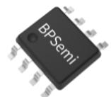
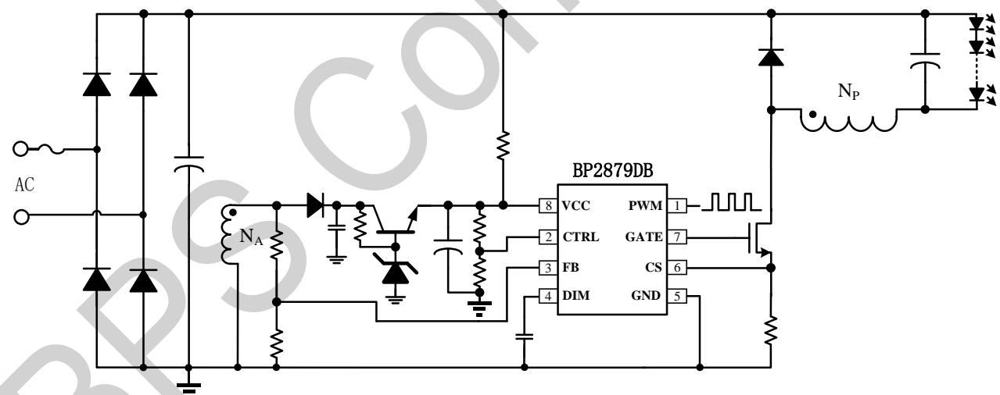
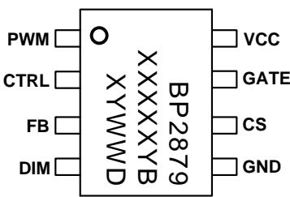
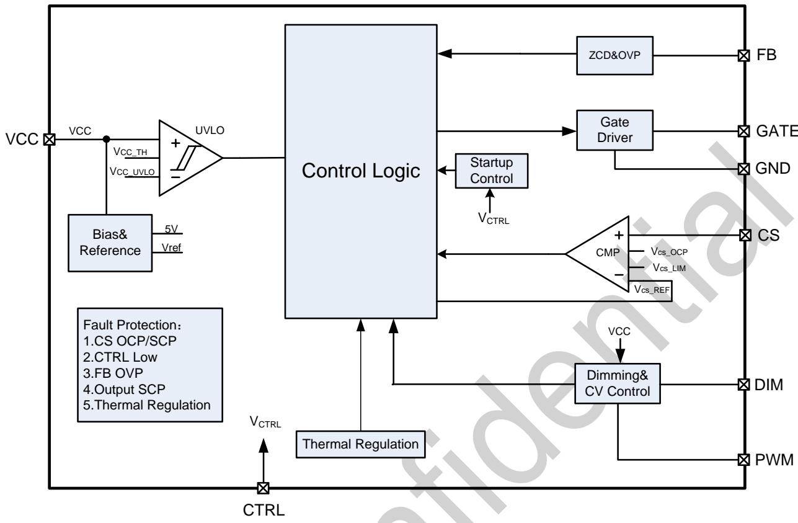
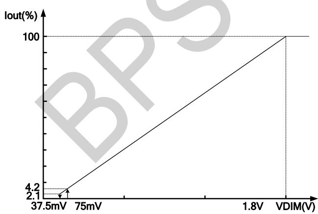
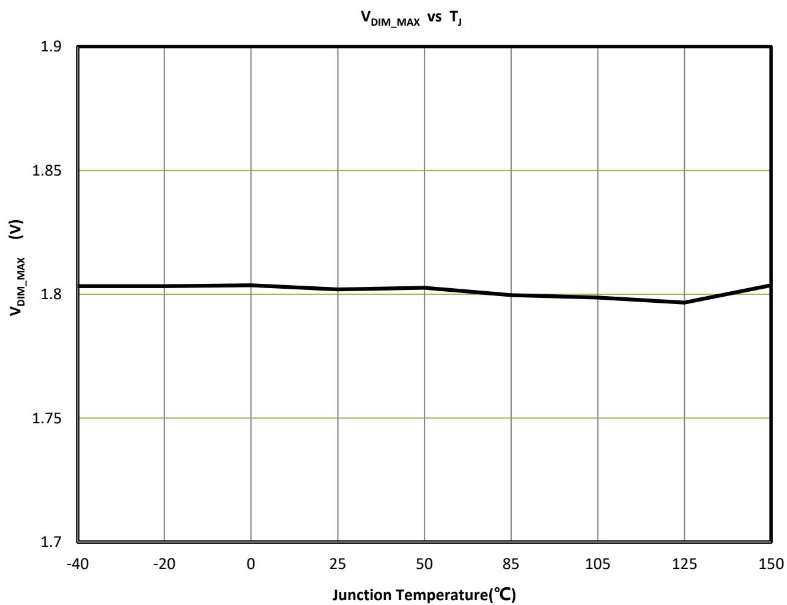
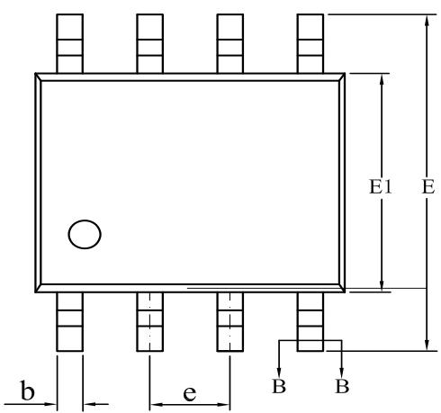
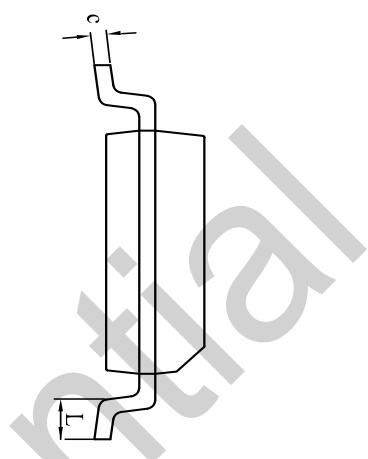
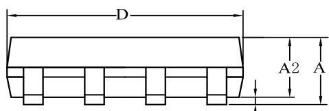
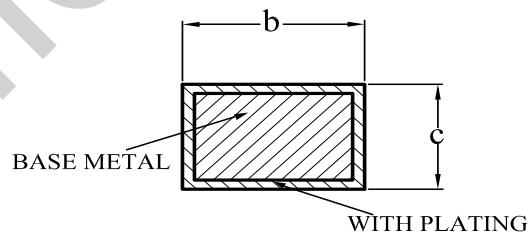

## Non-isolated Low PF Dimmable LED Driver

## Description

The BP2879DB is a non-isolated low PF dimmable LED driver controller, compatible with PWM or full range analog dimming signal, and supports dimming to off, to provide high-precision and flicker-less light output.

BP2879DB works in BCM and QR mode to improve system efficiency and reduce EMI as well as the size of transformer. The BP2879DB adopts advanced primaryside constant current algorithm to provide with excellent line and load regulation.

The BP2879DB provides with multiple protections to assure reliability of LED driver power.

BP2879DB adopts SOP-8 package.

## Features

Wide dimmable range from 5% to 100%, compatible with PWM or analog dimming signal, and support dimming to off

◼ High accuracy of current reference (±3%)

◼ Good current tolerance in deep dimming

No output current overshoot

Built-in compensation for line and load regulation

◼ Integrated multiple protections

⚫ Output open and short protection

⚫ CS short circuit protection

⚫ Over current protection

⚫ Over temperature protection

  
SOP-8 Package

Applications

LED Panel Light

◼ LED Street Lamp

## Typical Application

  
Figure 1 Typical Application of BP2879DB PWM dimming  
Note: The parameters of components and schematic are only for reference. The actual application schematic and parameters must be fully verified.

## Ordering Information

<table><tr><td>Part Number</td><td>Package</td><td>Package Method</td><td>Marking</td></tr><tr><td>BP2879DB</td><td>SOP-8</td><td>Tape4,000/Reel</td><td>BP2879XXXXYBXYWWD</td></tr></table>

## Pin Configuration and Marking Information

  
BP2879DB：Part Number  
XXXXXY：Lot Code  
XY：Sign

WW：Week

Figure 2 Pin Configuration  
Pin Definition

<table><tr><td>Pin No.</td><td>Name</td><td>Parameter</td></tr><tr><td>1</td><td>PWM</td><td>PWM dimming signal input pin, internally pulled up to VCC by default</td></tr><tr><td>2</td><td>CTRL</td><td>Control pin to enable or disable the controller, the voltage should be above 0.35V for normal operation</td></tr><tr><td>3</td><td>FB</td><td>Zero current detection and output voltage sensing for OVP</td></tr><tr><td>4</td><td>DIM</td><td>Analog dimming signal input pin</td></tr><tr><td>5</td><td>GND</td><td>IC Ground</td></tr><tr><td>6</td><td>CS</td><td>MOSFET current sensing</td></tr><tr><td>7</td><td>GATE</td><td>MOSFET gate driving</td></tr><tr><td>8</td><td>VCC</td><td>IC Power Supply</td></tr></table>

## Absolute Maximum Ratings (Note1)

<table><tr><td>Symbol</td><td>Parameters</td><td>Range</td><td>Units</td></tr><tr><td>VCC</td><td>Voltage of VCC pin</td><td>-0.3~40</td><td>V</td></tr><tr><td>GATE,PWM</td><td>Input &amp; output pin</td><td>-0.3~40</td><td>V</td></tr><tr><td>CS,CTRL,FB,DIM</td><td>Input &amp; output pin</td><td>-0.3~8</td><td>V</td></tr><tr><td> $P_{DMAX}$ </td><td>Power dissipation (Note 2)</td><td>0.45</td><td>W</td></tr><tr><td> $\theta_{JA}$ </td><td>Thermal resistance of junction to ambient (Note 3)</td><td>145</td><td>°C/W</td></tr><tr><td> $T_J$ </td><td>Operating junction temperature</td><td>-40~150</td><td>°C</td></tr><tr><td> $T_{STG}$ </td><td>Storage temperature range</td><td>-55~150</td><td>°C</td></tr></table>

Note 1: Stresses beyond those listed under “absolute maximum ratings” may cause permanent damage to the device. Under “recommended operating conditions” the device operation is assured, but some particular parameter may not be achieved. The electrical characteristics table defines the operation range of the device, the electrical characteristics is assured on DC and AC voltage by test program. For the parameters without minimum and maximum value in the EC table, the typical value defines the operation range, the accuracy is not guaranteed by spec. Note 2: The maximum power dissipation decreases if temperature rise, it is decided by TJMAX, $\mathsf { \theta } _ { \mathsf { J } \mathsf { A } _ { t } }$ and environment temperature (TA). The maximum power dissipation is the lower one between PDMAX = (TJMAX - TA)/ θJA and the number listed in the maximum table.

Note 3: Tested on 1 in.² double-sided board according to JEDEC standard.

Electrical Characteristics (Note 4)（Unless otherwise specified, ${ \mathsf { T A } } = 2 5 ^ { \circ } { \mathsf { C } } )$

<table><tr><td>Symbol</td><td>Parameter</td><td>Condition</td><td>Min</td><td>Typ</td><td>Max</td><td>Units</td></tr><tr><td colspan="7">Power Supply (VCC)</td></tr><tr><td> $V_{CC\_TH}$ </td><td> $V_{CC}$  turn on threshold</td><td> $V_{CC}$  rising</td><td>10</td><td>12.7</td><td>14</td><td>V</td></tr><tr><td> $V_{CC\_UVLO}$ </td><td> $V_{CC}$  UVLO threshold</td><td> $V_{CC}$  rising</td><td>6.6</td><td>7.8</td><td>8.8</td><td>V</td></tr><tr><td> $V_{CC\_CLAMP}$ </td><td> $V_{CC}$  Clamp voltage</td><td> $I_{CC}=2mA$ </td><td>30</td><td>35</td><td>40</td><td>V</td></tr><tr><td> $V_{CC\_DIMOFF}$ </td><td> $V_{CC}$  dimming to off threshold (5)</td><td> $V_{DIM}=0V$ </td><td>8.3</td><td>8.9</td><td>9.5</td><td>V</td></tr><tr><td> $I_{CC\_ST}$ </td><td> $V_{CC}$  start up current</td><td> $V_{CC\_TH}-0.5V$ </td><td>95</td><td>120</td><td>135</td><td>μA</td></tr><tr><td> $I_{CC\_QUIESCENT}$ </td><td> $V_{CC}$  quiescent current</td><td>No switching</td><td>200</td><td>430</td><td>700</td><td>μA</td></tr><tr><td colspan="7">Current sensing (CS)</td></tr><tr><td> $V_{CS\_LIM}$ </td><td>CS cycle by cycle limit(5)</td><td></td><td>0.74</td><td>0.82</td><td>0.9</td><td>V</td></tr><tr><td> $V_{CS\_OCP}$ </td><td>CS open circuit protection threshold</td><td></td><td>1</td><td>1.26</td><td>1.4</td><td>V</td></tr><tr><td colspan="7">Time control</td></tr><tr><td> $T_{LEB1}$ </td><td>LEB time at normal switching(5)</td><td></td><td>250</td><td>460</td><td>650</td><td>ns</td></tr><tr><td> $T_{LEB2}$ </td><td>LEB time for OCP(5)</td><td></td><td>160</td><td>280</td><td>400</td><td>ns</td></tr><tr><td> $T_{ON\_MAX}$ </td><td>Max. ON time</td><td></td><td>35</td><td>45</td><td>55</td><td>μs</td></tr><tr><td> $T_{OFF\_MAX}$ </td><td>Max. OFF time</td><td></td><td>200</td><td>255</td><td>360</td><td>μs</td></tr><tr><td rowspan="4"> $T_{QRTMO}$ </td><td rowspan="4">Internal delay time after ZCD(5)</td><td></td><td>4</td><td>4.5</td><td>5</td><td>μs</td></tr><tr><td>-40°C</td><td colspan="3">4.4</td><td>μs</td></tr><tr><td>27°C</td><td colspan="3">4.495</td><td>μs</td></tr><tr><td>105°C</td><td colspan="3">5.05</td><td>μs</td></tr><tr><td colspan="7">Gate Driving</td></tr><tr><td> $I_{SOURCE}$ </td><td>Max. sourcing current(5)</td><td> $V_{GATE}=2V$ </td><td>90</td><td>150</td><td>250</td><td>mA</td></tr><tr><td> $I_{SINK}$ </td><td>Max. sinking current</td><td> $V_{GATE}=2V$ </td><td>125</td><td>230</td><td>325</td><td>mA</td></tr><tr><td colspan="7">ZCD and OVP(FB)</td></tr><tr><td> $V_{FB\_FALL}$ </td><td>FB falling edge threshold(5)</td><td>FB falling</td><td>0.12</td><td>0.15</td><td>0.18</td><td>V</td></tr><tr><td> $V_{FB\_HYS}$ </td><td>FB hysteresis voltage(5)</td><td></td><td>0.075</td><td>0.09</td><td>0.105</td><td>V</td></tr><tr><td> $V_{FB\_OVP}$ </td><td>FB OVP threshold</td><td></td><td>1.9</td><td>2</td><td>2.1</td><td>V</td></tr><tr><td colspan="7">Dimming section(PWM,DIM)</td></tr><tr><td> $V_{DIM\_ON}$ </td><td>DIM to on threshold(5)</td><td>PWM rising</td><td>60</td><td>75</td><td>90</td><td>mV</td></tr><tr><td> $V_{DIM\_OFF}$ </td><td>DIM to off threshold(5)</td><td>PWM falling</td><td>16</td><td>37.5</td><td>58</td><td>mV</td></tr><tr><td> $V_{DIM\_MAX}$ </td><td>Max. Current Reference</td><td></td><td>1.746</td><td>1.8</td><td>1.854</td><td>V</td></tr><tr><td> $V_{PWM\_ON}$ </td><td>PWM output high(5)</td><td>PWM rising</td><td>1.74</td><td>1.8</td><td>1.854</td><td>V</td></tr><tr><td> $V_{PWM\_OFF}$ </td><td>PWM output low(5)</td><td>PWM falling</td><td>1.68</td><td>1.75</td><td>1.82</td><td>V</td></tr><tr><td colspan="7">External control (CTRL)</td></tr><tr><td> $V_{CTRL\_ST\_TH}$ </td><td>Turn on threshold(5)</td><td></td><td>325</td><td>350</td><td>375</td><td>mV</td></tr><tr><td> $V_{CTRL\_TH}$ </td><td>Turn off threshold(5)</td><td></td><td>325</td><td>350</td><td>375</td><td>mV</td></tr><tr><td> $T_{CTRL\_TH}$ </td><td>Turn off detect time(5)</td><td>After start-up</td><td>14</td><td>18</td><td>22</td><td>ms</td></tr><tr><td> $T_{CTRL\_ST\_DELLY}$ </td><td>Turn on delay time(5)</td><td>Before start-up</td><td>1.76</td><td>2.2</td><td>2.64</td><td>ms</td></tr><tr><td colspan="7">Over Temperature protection</td></tr><tr><td> $T_{REG}$ </td><td>OTP threshold(5)</td><td></td><td>135</td><td>145</td><td>155</td><td>°C</td></tr></table>

Note 4: The maximum and minimum parameters specified are guaranteed by test, the typical value are guaranteed by design, characterization and statistical analysis.

Note 5:Guaranteed by design.

Internal Block Diagram  
  
Figure 3 BP2879DB Internal Block Diagram

## Application Information

The BP2879DB is a non-isolated low PF dimmable LED driver controller, compatible with PWM or full range analog dimming signal, and supports dimming to off, to provide high-precision and flicker-less light output.

## Start-up

After system is powered on, when VCC voltage reaches the turn on threshold, the controller begins to work. If the voltage on CTRL pin is higher than V and it lasts for more than 2.2ms,the controller begins to switch MOSFET, and the output current increases rapidly.

VCC pin is integrated with an internal Zener to protect VCC pin. If VCC voltage is lower than UVLO(7.8V),The controller stops switching.

## ON/OFF Control

CTRL pin can be used to turn on/off controller. After VCC power on, if CTRL voltage is lower than VCTRL\_TH for than 18ms,the controller will stop working, and enters into fault protection mode until CTRL voltage returns to be normal. After 600ms,the controller detects CTRL voltage again. If CRTL voltage is higher than VCTRL\_TH, and it lasts for more than 2.2ms,the controller returns to normal operation. CTRL pin also be used for input voltage brown out protection.

## Constant Current Control

The BP2879DB adopts peak current control, and it works in quasi-resonant mode to improve efficiency of system.

⚫ BP2879DB internal constant current algorithm assure high precision of output current, which

can be set as:

$$
I _ {o u t} = \frac {1}{8} * \frac {V _ {D I M \_ M A X}}{R _ {c s}}
$$

## Where：

VDIM\_MAX is the maximum voltage of DIM pin

$\mathsf { R c s }$ is the resistance of CS resistor.

Cycle by cycle OCP threshold of CS pin is $V _ { C S \_ L I M }$ . when CS voltage reaches to $\mathsf { V } _ { \mathsf { C S \_ O C P } } ,$ , MOSFET will be shut down immediately and the controller enters into fault protection mode.

## Dim control

The BP2879DB can accept analog signal from DIM pin to change LED current. For non-dimming application, only connect a ceramic capacitor from DIM pin to GND. Internal current reference voltage of DIM pin is 1.8V.

The BP2879DB also can accept PWM dimming signal and transfers it to an analog signal through internal resistor and DIM capacitor. The internal filter resistance is about 75K.

If DIM voltage is less than 37.5mV/75mV(with hysteresis voltage),MOSFET will be turned off.

Dimming curve of BP2879DB is as below:

Constant voltage with dimming to off

After BP2879DB start up, If DIM voltage is less than

37.5mV, BP2879DB will stop switching and VCC voltage drops since the auxiliary winding stops to supply the VCC pin. Once VCC voltage drops below VCC\_DIMOFF (8.9V), the controller begins to switch immediately and VCC voltage increases again. So VCC voltage is kept around VCC\_DIMOFF (8.9V), and output voltage is also kept below LED threshold voltage.

## OVP/LED Open Protection

OVP is triggered via FB pin. If FB voltage is still higher than 2V after blanking time of 1.2μs, the BP2879DB enters fault protection mode and GATE is kept as low. After about 600ms, the controller detects FB voltage again, if fault condition is removed, the BP2879DB restarts. Otherwise, if fault remains, protection is enabled continuously. The OVP voltage is set as:

$$
V _ {\mathrm {OUT\_OVP}} = \frac {N _ {P}}{N _ {A U X}} * \frac {R _ {F B L} + R _ {F B H}}{R _ {F B L}} * V _ {F B \_ O V P} (\mathrm{V})
$$

Np is turns of primary winding and $\mathsf { N } _ { \mathsf { A U X } }$ is turns of auxiliary winding. $\mathsf { R } _ { \mathsf { F B H } }$ is higher resistor of FB divider, while $\mathsf { R } _ { \mathsf { F B L } }$ is lower resistor. V is FB OVP threshold.

## Output short Protection

When output is shorted, the system works in TOFF\_MAX. Since output voltage is very low, the auxiliary winding can not supply enough energy to VCC. If VCC power supply is insufficient, VCC voltage will drop to UVLO threshold.

## Over Temperature Protection

The BP2879DB integrates with over temperature protection. If junction temperature of BP2879DB is higher than $1 5 0 \%$ , BP2879DB will decrease output current.

## Other Protection

The BP2879DB also integrates with other protections, such as CS pin open protection, CS resistor short protection and brown out protection (CTRL pin).

## Valley turn-on

The controller(BP2879DB) detects FB threshold voltage during dimming to turn on MOSFET at drain voltage valley, to optimize the dimming curve and decrease temperature rise of MOSFET and improve efficiency of system at light load.

## PCB Layouts

The following rules should be followed in BP2879DB PCB layout:

1) The bypass capacitor of DIM pin and VCC pin should be placed as close to the controller and GND

Pin as possible, especially the DIM pin, which must be close to the IC ground.

2) The resistor divider and filter capacitor of FB pin should be close to the controller, and far away from switching node, to avoid mis-triggering of OVP by system noise.

3) The trace of current sensing resistor should be as wide as possible and keep closed to GND for better current sensing precision. Otherwise output current regulation will be affected. should be connected to ground by independent path.

4) The area of main current loop , including area of primary side of transformer, and MOSFET, and the area of secondary side of transformer, as small as possible, to reduce EMI noise.

Characteristic Curve  

## Physical Dimensions

SOP-8 PACKAGE OUTLINE DIMENSIONS  

  
SECTION B-B

<table><tr><td rowspan="2">SYMBOL</td><td colspan="3">MILLIMETER</td></tr><tr><td>MIN</td><td>NOM</td><td>MAX</td></tr><tr><td>A</td><td>1.30</td><td>—</td><td>1.80</td></tr><tr><td>A1</td><td>0.10</td><td>—</td><td>0.25</td></tr><tr><td>A2</td><td>1.25</td><td>1.40</td><td>1.65</td></tr><tr><td>b</td><td>0.33</td><td>—</td><td>0.51</td></tr><tr><td>c</td><td>0.17</td><td>—</td><td>0.25</td></tr><tr><td>D</td><td>4.70</td><td>4.90</td><td>5.10</td></tr><tr><td>E</td><td>5.80</td><td>6.00</td><td>6.20</td></tr><tr><td>E1</td><td>3.70</td><td>3.90</td><td>4.10</td></tr><tr><td>e</td><td colspan="3">1.27BSC</td></tr><tr><td>L</td><td>0.40</td><td>—</td><td>1.00</td></tr></table>

Revision Information

<table><tr><td>Revision</td><td>Date</td><td>Notes</td></tr><tr><td>Rev. 1.0</td><td>2023/09</td><td>First Issue</td></tr><tr><td></td><td></td><td></td></tr><tr><td></td><td></td><td></td></tr><tr><td></td><td></td><td></td></tr><tr><td></td><td></td><td></td></tr><tr><td></td><td></td><td></td></tr></table>

## Disclaimer

The information provided in this datasheet is believed to be accurate and reliable. However, Bright Power Semiconductor (BPS) reserves the right to make changes at any time without prior notice.

No license, to any intellectual property right owned by BPS or any other third party, is granted under this document. BPS provides information in this datasheet “AS IS” and with all faults, and makes no warranty, express or implied, including but not limited to, the accuracy of the information provided in this datasheet, merchantability, fitness of a specific purpose, or non-infringement of intellectual property rights of BPS or any other third party. BPS disclaims any and all liabilities arising out of this datasheet or use of this datasheet, including without limitation consequential or incidental damages.