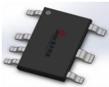
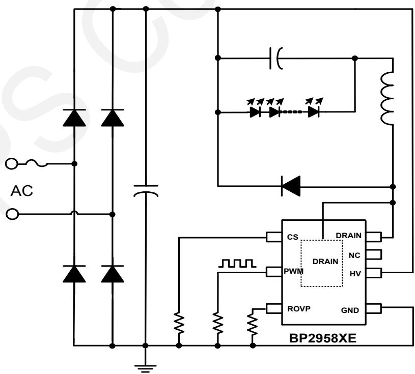
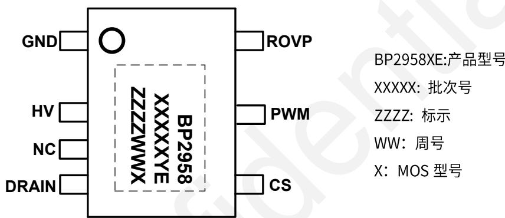
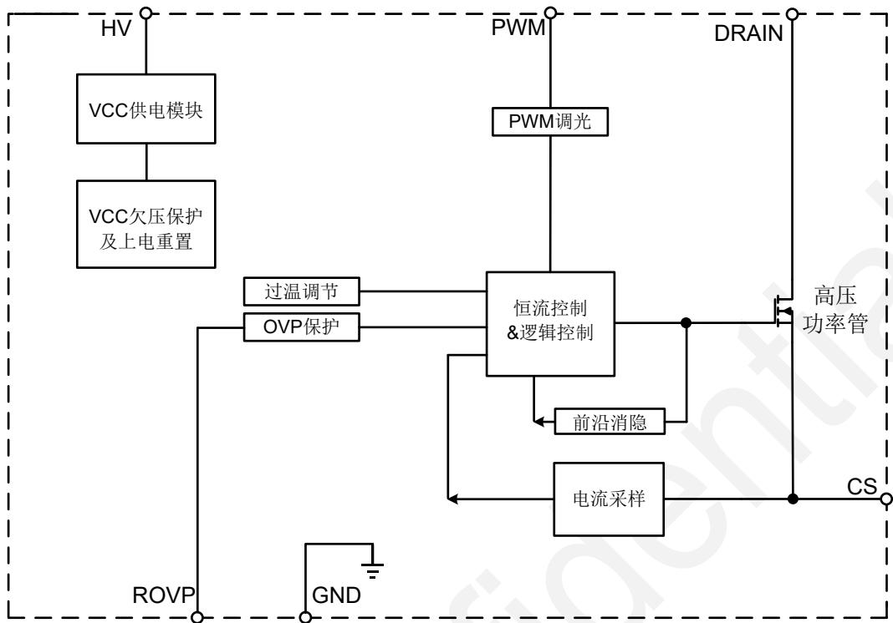
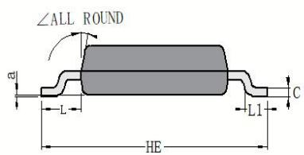
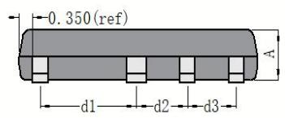
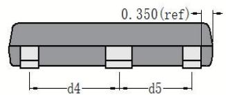
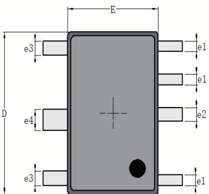
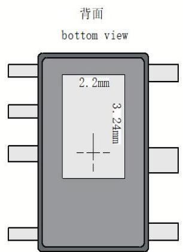
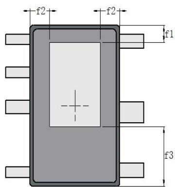

## 概述

BP2958XE 是一款支持 PWM 输入调光的高精度降压型 LED 恒流驱动芯片，全程采用模拟调光控制模式，专为无频闪无噪声 LED 智能照明应用而设计。BP2958XE 能够达到优异的调光线性度和输出电流一致性，适用于 85Vac\~265Vac 全范围输入电压的非隔离降压型 LED 恒流电源。

BP2958XE 芯片集成高压启动电路和 500V 功率管，无需 VCC 电容和辅助绕组，只需要很少的外围元件，即可实现优异的恒流特性，极大的节约了系统成本和体积。

BP2958XE 芯片内部带有高精度的电流采样电路，来实现精确的 LED 恒流输出和优异的线电压调整率。

BP2958XE 具有多重保护功能，包括 LED 开路保护，LED 短路保护，芯片温度过热调节等。

BP2958XE 采用 HSOP7 封装。

## 特点

■ 支持 1%-100% PWM 调光

全程模拟调光无频闪

■ 无需启动电阻和 VCC 电容

■ 内部集成 500V 功率管

■ ±5% LED 输出电流精度

■ LED 开路保护

■ LED 短路保护

■ 过热调节功能

■ 采用 HSOP7 封装

## 应用

■ LED 吸顶灯

■ LED 球泡灯

■ 其它 LED 照明

## 典型应用

HSOP7 封装  
  
图 1 BP2958XE 典型应用图

## 定购信息

<table><tr><td>定购型号</td><td>封装</td><td>包装形式</td><td>打印</td></tr><tr><td>BP2958XE</td><td>HSOP7</td><td>编带5000颗/管</td><td>BP2958XXXXXYEZZZZWWX</td></tr></table>

## 管脚封装

  
图 2 管脚封装图

## 管脚描述

<table><tr><td>管脚号</td><td>管脚名称</td><td>描述</td></tr><tr><td>1</td><td>GND</td><td>芯片地</td></tr><tr><td>2</td><td>HV</td><td>芯片高压供电端</td></tr><tr><td>3</td><td>NC</td><td>空</td></tr><tr><td>4</td><td>DRAIN</td><td>内部高压功率管漏极</td></tr><tr><td>5</td><td>CS</td><td>电流采样端,采样电阻接在CS和GND端之间</td></tr><tr><td>6</td><td>PWM</td><td>PWM调光信号输入端</td></tr><tr><td>7</td><td>ROVP</td><td>开路保护电压调节端,接电阻到地。电阻越大,OVP电压越高</td></tr></table>

## 极限参数(注1)

<table><tr><td>符号</td><td>参数</td><td colspan="2">参数范围</td><td>单位</td></tr><tr><td>HV</td><td>芯片高压供电端</td><td colspan="2">-0.3~500</td><td>V</td></tr><tr><td>DRAIN</td><td>内部高压功率管漏极到源极峰值电压</td><td colspan="2">-0.3~500</td><td>V</td></tr><tr><td rowspan="2"> $I_{DMAX}$ </td><td rowspan="2">漏极最大电流 @  $T_J=100°C$ </td><td>D</td><td>F</td><td rowspan="2">mA</td></tr><tr><td>900</td><td>1000</td></tr><tr><td>CS</td><td>电流采样端</td><td colspan="2">-0.3~6</td><td>V</td></tr><tr><td>ROVP</td><td>开路保护电压调节端</td><td colspan="2">-0.3~6</td><td>V</td></tr><tr><td>PWM</td><td>PWM 调光信号输入端</td><td colspan="2">-0.3~6</td><td>V</td></tr><tr><td> $T_J$ </td><td>工作结温范围</td><td colspan="2">-40 to 150</td><td>°C</td></tr><tr><td> $T_{STG}$ </td><td>储存温度范围</td><td colspan="2">-55 to 150</td><td>°C</td></tr><tr><td></td><td>ESD (注 3)</td><td colspan="2">2</td><td>kV</td></tr></table>

注1：最大极限值是指超出该工作范围，芯片有可能损坏。推荐工作范围是指在该范围内，器件功能正常，但并不完全保证满足个别性能指标。电气参数定义了器件在工作范围内并且在保证特定性能指标的测试条件下的直流和交流电参数规范。对于未给定上下限值的参数，该规范不予保证其精度，但其典型值合理反映了器件性能。

注2：温度升高最大功耗一定会减小，这也是由 $T_{JMAX}, \theta_{JA}$ 和环境温度 $T_A$ 所决定的。最大允许功耗为 $P_{DMAX} = (T_{JMAX} - T_A) / \theta_{JA}$ 或是极限范围给出的数字中比较低的那个值。

注3：人体模型，100pF电容通过 $1.5\mathrm{k}\Omega$ 电阻放电。

工作范围

<table><tr><td>符号</td><td colspan="2">参数范围</td><td>单位</td></tr><tr><td colspan="4">Vin=176Vac~265Vac,腔体温度60°C</td></tr><tr><td rowspan="2">ILEDMAX最大输出电流</td><td>D</td><td>F</td><td rowspan="2">mA</td></tr><tr><td>450</td><td>500</td></tr><tr><td rowspan="2">POUTMAX最大输出功率</td><td>D</td><td>F</td><td rowspan="2">W</td></tr><tr><td>30</td><td>43</td></tr><tr><td colspan="4">Vin=176Vac~265Vac,腔体温度90°C</td></tr><tr><td rowspan="2">ILEDMAX最大输出电流</td><td>D</td><td>F</td><td rowspan="2">mA</td></tr><tr><td>380</td><td>450</td></tr><tr><td rowspan="2">POUTMAX最大输出功率</td><td>D</td><td>F</td><td rowspan="2">W</td></tr><tr><td>25</td><td>37</td></tr><tr><td colspan="4"></td></tr><tr><td rowspan="2">VLEDMIN最小负载电压</td><td>D</td><td>F</td><td rowspan="2">V</td></tr><tr><td colspan="2">&gt;30V</td></tr></table>

电气参数(注4,5)（无特别说明情况下， $T_{A}=25^{\circ}C$ ）

<table><tr><td>符号</td><td>描述</td><td>条件</td><td>最小值</td><td>典型值</td><td>最大值</td><td>单位</td></tr><tr><td colspan="7">电源电压</td></tr><tr><td> $I_{CC}$ </td><td>芯片工作电流</td><td> $F_{OP}=3kHz$ </td><td>250</td><td>340</td><td>450</td><td>μA</td></tr><tr><td colspan="7">电流采样</td></tr><tr><td> $V_{REF}$ </td><td>恒流电压基准</td><td></td><td>288</td><td>297</td><td>306</td><td>mV</td></tr><tr><td> $T_{LEB}$ </td><td>前沿消隐时间</td><td></td><td></td><td>350</td><td></td><td>ns</td></tr><tr><td> $T_{DELAY}$ </td><td>芯片关断延迟</td><td></td><td></td><td>200</td><td></td><td>ns</td></tr><tr><td colspan="7">过压保护</td></tr><tr><td> $K_{OVP}$ </td><td>OVP设置系数</td><td></td><td></td><td>12.5</td><td></td><td>V/H</td></tr><tr><td> $V_{ROVP}$ </td><td>ROVP引脚电压</td><td>ROVP=10kΩ</td><td></td><td>1</td><td></td><td>V</td></tr><tr><td colspan="7">内部时间控制</td></tr><tr><td> $T_{ZCD\_LEB}$ </td><td>退磁检测消隐时间</td><td></td><td></td><td>2.5</td><td></td><td>μs</td></tr><tr><td> $T_{OFF\_MAX}$ </td><td>最大退磁时间</td><td></td><td></td><td>410</td><td></td><td>μs</td></tr><tr><td> $T_{ON\_MAX1}$ </td><td>最大开通时间</td><td> $V_{CS}=0.2V$ </td><td>8</td><td>13</td><td>18</td><td>μs</td></tr><tr><td> $T_{ON\_MAX2}$ </td><td>最大开通时间</td><td> $V_{CS}=0.6V$ </td><td>24</td><td>40</td><td>56</td><td>μs</td></tr><tr><td colspan="7">功率管</td></tr><tr><td> $D_{RDS\_ON}$ </td><td rowspan="2">功率管导通阻抗</td><td rowspan="2"> $V_{GS}=10V/IDS=0.5A$ </td><td></td><td>4.8</td><td></td><td rowspan="2">Ω</td></tr><tr><td> $F_{RDS\_ON}$ </td><td></td><td>3</td><td></td></tr><tr><td> $BV_{DSS}$ </td><td>功率管的击穿电压</td><td> $V_{GS}=0V/IDS=250uA$ </td><td>500</td><td></td><td></td><td>V</td></tr><tr><td> $I_{DSS}$ </td><td>功率管漏电流</td><td> $V_{GS}=0V/V_{DS}=500V$ </td><td></td><td></td><td>1</td><td>μA</td></tr><tr><td colspan="7">PWM调光</td></tr><tr><td> $V_{PWM\_ON}$ </td><td>PWM检测高电平</td><td> $V_{PWM}$ 上升</td><td></td><td>2</td><td>2.2</td><td>V</td></tr><tr><td> $V_{PWM\_OFF}$ </td><td>PWM检测低电平</td><td> $V_{PWM}$ 下降</td><td>0.9</td><td>1.3</td><td></td><td>V</td></tr><tr><td> $T_{PWM\_ON\_min}$ </td><td>PWM检测高电平最小时间</td><td></td><td></td><td>3.8</td><td>4.5</td><td>μs</td></tr><tr><td> $F_{DIM}$ </td><td>PWM调光频率范围</td><td></td><td>0.5</td><td></td><td>2</td><td>kHz</td></tr><tr><td colspan="7">过热调节</td></tr><tr><td> $T_{REG}$ </td><td>过热调节温度</td><td></td><td></td><td>140</td><td></td><td>°C</td></tr></table>

注 4: 典型参数值为 $25^{\circ}$ C 下测得的参数标准。  
注5：规格书的最小、最大规范范围由测试保证，典型值由设计、测试或统计分析保证。

## 内部结构框图

  
图 3 BP2958XE 内部框图

## 应用信息

BP2958XE 是一款专用于 LED 照明的恒流驱动芯片，应用于 PWM 调光非隔离降压型 LED 驱动电源。采用特有的恒流架构和控制方法，芯片内部集成高压启动电路和 500V 功率管，无需 VCC 电容和辅助绕组，只需要很少的外围元件，即可实现优异的恒流特性，极大的节约了系统成本和体积。

## 启动

系统上电后，母线电压通过 HV 引脚对芯片内部供电，当内部供电电压达到芯片开启阈值时，芯片内部控制电路开始工作。芯片正常工作时，所需的工作电流仍然通过 HV 引脚的 JFET 对其提供。

## 恒流控制，输出电流设置

BP2958XE 采用特有的恒流算法，将 CS 端电压采样后输入到电流控制电路，与内部基准电压进行比较，可以实现高精度输出恒流控制。

LED 满载输出电流计算方法：

$$
I _ {O U T} \approx \frac {V _ {\mathrm{REF}}}{R c s}
$$

其中，VREF 是内部基准电压，

RCS 为电流采样电阻阻值。

电感峰值电流 $I_{PK}$ 约为 LED 输出电流的 2 倍。

## 储能电感

BP2958XE在功率管导通时，流过储能电感的电流从零开始上升，导通时间为：

$$
t _ {\mathrm{on}} = \frac {\mathrm{L} \times \mathrm{I} _ {\mathrm{PK}}}{\mathrm{V} _ {\mathrm{IN}} - \mathrm{V} _ {\mathrm{LED}}}
$$

其中，L 是电感量； $I_{PK}$ 是电感电流的峰值； $V_{IN}$ 是经整流后的母线电压；VLED 是输出 LED 上的电压。

当功率管关断时，流过储能电感的电流从峰值开始往下降

到零。功率管的关断时间为：

$$
\mathrm{t} _ {\text { off }} = \frac {\mathrm{L} \times \mathrm{I} _ {\mathrm{PK}}}{\mathrm{V} _ {\mathrm{LED}}}
$$

储能电感的计算公式为：

$$
\mathrm{L} = \frac {\mathrm{V} _ {\mathrm{LED}} \times \left(\mathrm{V} _ {\mathrm{IN}} - \mathrm{V} _ {\mathrm{LED}}\right)}{\mathrm{f} \times \mathrm{I} _ {\mathrm{PK}} \times \mathrm{V} _ {\mathrm{IN}}}
$$

其中，f 为系统工作频率。BP2958XE 的系统工作频率和输入电压成正比关系，设置 BP2958XE 系统工作频率时，选择在输入电压最低时设置系统的最低工作频率，而当输入电压最高时，系统的工作频率也最高。

BP2958XE 设置了系统的最小退磁时间和最大退磁时间，分别为 $2.5\mu s$ 和 $410\mu s$ 。由 $t_{OFF}$ 的计算公式可知，如果电感量很小时， $t_{OFF}$ 很可能会小于芯片的最小退磁时间，系统就会进入电感电流断续模式；而当电感量很大时， $t_{OFF}$ 又可能会超出芯片的最大退磁时间，这时系统就会进入电感电流连续模式。所以选择合适的电感值很重要。

## 过压保护电阻设置

开路保护电压可以通过 ROVP 引脚电阻来设置，ROVP 引脚输出电流 $100\mu A$ 。

当 LED 开路时，输出电压逐渐上升，退磁时间变短。

$$
V o v p \approx \frac {L ^ {*} R o v p}{R c s} * K _ {o v p}
$$

## 其中

Kovp 是 OVP 系数(Kovp=12.5)

Rcs 是 CS 采样电阻

Vovp 是需要设定的过压保护点

L 是功率电感感量

Rovp 是设置 OVP 电压的电阻

## 保护功能

BP2958XE 内置多种保护功能，包括 LED 开路/短路保护，芯片温度过热调节等。当输出 LED 开路时，系统会触发过压保护逻辑并停止开关工作。系统进入开路保护状态后，芯片内部开始计时 80ms，然后系统重启。同时系统不断的检测负载状态，如果故障解除，系统会重新开始正常工作。

当 LED 短路时，系统工作在 3kHz 低频，所以功耗很低。同时系统不断的检测负载状态，如果故障解除，系统会重新开始正常工作。

## 过温调节功能

BP2958XE 具有过热调节功能，在驱动电源过热时逐渐减小输出电流，从而控制输出功率和温升，使电源温度保持在设定值，以提高系统的可靠性。芯片内部设定的过热调节温度值为 $140^{\circ}$ C。

## PWM 调光

BP2958XE 支持 500Hz—2kHz PWM 信号调光，LED 平均电流将根据 PWM 占空比从 1%—100% 变化，PWM 引脚需要加外部下拉电阻，建议下拉电阻 10kΩ。

## PCB 设计

在设计 BP2958XE PCB 时，需要遵循以下指南：

## 地线

电流采样电阻的功率地线尽可能短，且要和芯片的地线及其它小信号的地线分头接到母线电容的地端。

## HV引脚

在焊接允许的情况下，HV 引脚尽量远离 CS、PWM、Rovp 等低压引脚和元器件。

## ROVP电阻

开路保护电压设置电阻需要尽量靠近芯片ROVP引脚，远离DRAIN等噪声走线。

## DRAIN 引脚

增加 DRAIN 引脚的铺铜面积以提高芯片散热能力,但是过大的铺铜面积会使 EMI 辐射变差。

## 功率环路的面积

减小功率环路的面积，如功率电感、功率管、母线电容的环路面积，以及功率电感、续流二极管、输出电容的环路面积，以减小 EMI 辐射。

## 封装信息

<table><tr><td>Unit</td><td></td><td>A</td><td>C</td><td>D</td><td>E</td><td>HE</td><td>d1</td><td>d2</td><td>d3</td><td>d4</td><td>d5</td><td>e1</td><td>e2</td><td>e3</td><td>e4</td><td>L</td><td>L1</td><td>a</td><td>∠</td><td>f1</td><td>f2</td><td>f3</td></tr><tr><td rowspan="3">mm</td><td>max</td><td>1.25</td><td>0.22</td><td>6.4</td><td>4.1</td><td>6.1</td><td>2.56</td><td>1.38</td><td>1.32</td><td>2.28</td><td>2.78</td><td>0.45</td><td>0.56</td><td>0.60</td><td>0.85</td><td>1.15</td><td>0.7</td><td rowspan="3">0.2 (ref)</td><td rowspan="6">12°</td><td>0.71</td><td>0.9</td><td>2.35</td></tr><tr><td>typ</td><td>1.15</td><td>0.20</td><td>6.2</td><td>3.9</td><td>6.0</td><td>2.51</td><td>1.33</td><td>1.27</td><td>2.23</td><td>2.73</td><td>0.40</td><td>0.51</td><td>0.55</td><td>0.80</td><td>1.05</td><td>0.5</td><td>0.66</td><td>0.85</td><td>2.3</td></tr><tr><td>min</td><td>1.05</td><td>0.15</td><td>6.0</td><td>3.70</td><td>5.9</td><td>2.46</td><td>1.28</td><td>1.22</td><td>2.18</td><td>2.68</td><td>0.35</td><td>0.46</td><td>0.50</td><td>0.75</td><td>0.95</td><td>0.3</td><td>0.61</td><td>0.8</td><td>2.25</td></tr><tr><td rowspan="3">mil</td><td>max</td><td>49</td><td>9</td><td>252</td><td>161</td><td>240</td><td>101</td><td>54</td><td>52</td><td>90</td><td>109</td><td>18</td><td>22</td><td>24</td><td>33</td><td>45</td><td>28</td><td rowspan="3">8 (ref)</td><td>28</td><td>35</td><td>93</td></tr><tr><td>typ</td><td>45</td><td>8</td><td>244</td><td>154</td><td>236</td><td>99</td><td>52</td><td>50</td><td>88</td><td>107</td><td>16</td><td>20</td><td>22</td><td>31</td><td>41</td><td>20</td><td>26</td><td>33</td><td>91</td></tr><tr><td>min</td><td>41</td><td>6</td><td>236</td><td>146</td><td>232</td><td>97</td><td>50</td><td>48</td><td>86</td><td>106</td><td>14</td><td>18</td><td>20</td><td>30</td><td>37</td><td>12</td><td>24</td><td>31</td><td>89</td></tr></table>

## 版本信息

<table><tr><td>版本</td><td>日期</td><td>记录</td></tr><tr><td>Rev. 1.0</td><td>2022/04</td><td>首次发行</td></tr><tr><td>Rev. 1.1</td><td>2023/04</td><td>格式更新</td></tr><tr><td>Rev. 1.2</td><td>2024/12</td><td>修正应用参数描述错误,增加电子器件报废说明</td></tr><tr><td></td><td></td><td></td></tr><tr><td></td><td></td><td></td></tr><tr><td></td><td></td><td></td></tr></table>

## 免责声明

晶丰明源尽力确保本产品规格书内容的准确和可靠，但是保留在没有通知的情况下，修改规格书内容的权利。

本产品规格书未包含任何针对晶丰明源或第三方所有的知识产权的授权。针对本产品规格书所记载的信息，晶丰明源不做任何明示或暗示的保证，包括但不限于对规格书内容的准确性、商业上的适销性、特定目的的适用性或者不侵犯晶丰明源或任何第三人知识产权做任何明示或暗示保证，晶丰明源也不就因本规格书本身及其使用有关的偶然或必然损失承担任何责任。

## 电子器件报废说明

该产品在生命周期结束后，由客户按照一般电子产品的报废流程进行处理。