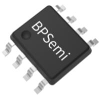
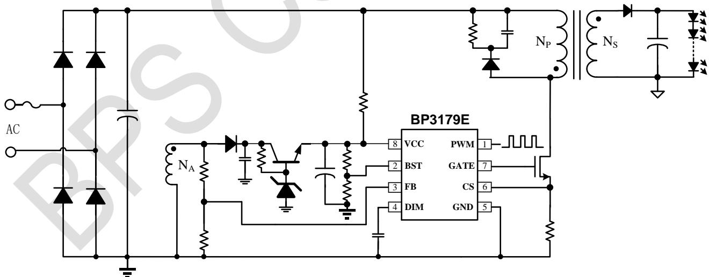
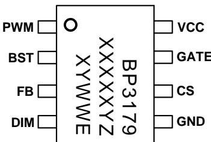
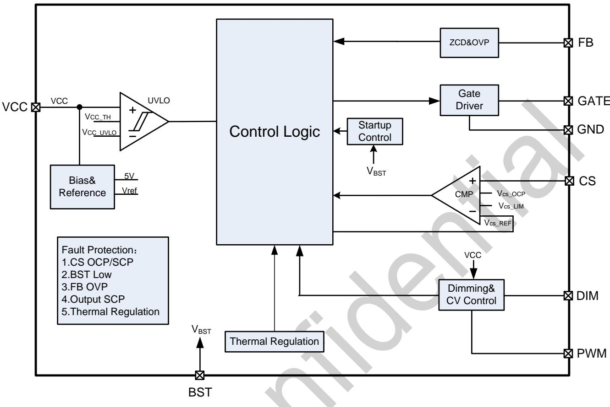
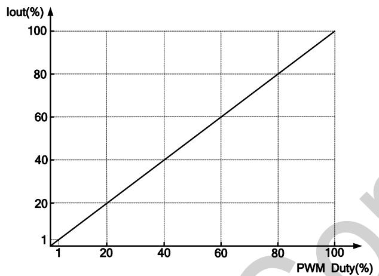
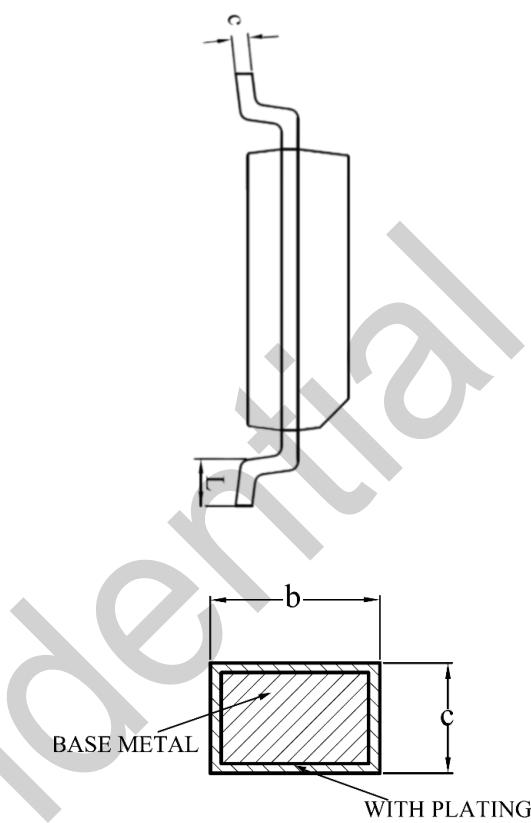
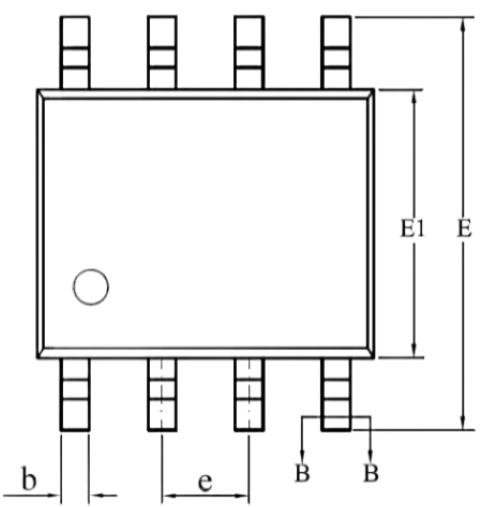
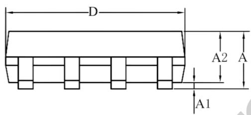

## 概述

BP3179E 是一款适用于反激电路的隔离低 PF LED 驱动器，支持 PWM 和模拟调光信号，全程模拟调光且支持调光调灭，可以实现高精度、无频闪的照明。

BP3179E 控制的反激电路工作在电感电流临界导通和准谐振模式，从而实现更高的转换效率和更低的电磁干扰(EMI)，提高变压器的利用率。

BP3179E采用了先进的原边采样恒流算法，可实现优异的线性调整率和负载调整率，同时省去了副边反馈元件，简化了 BOM元器件数量，降低系统成本。

BP3179E 提供丰富的保护功能，保证电源设计的可靠性。BP3179E 采用 SOP-8 的封装。

  
SOP-8 封装

## 特点

◼ 支持 PWM 调光和模拟调光信号，调光深度低至 1%且支持调光调灭

◼ 输出电流基准精度±3%

◼ 深度调光时良好的批量一致性

◼ 支持宽输出负载电压范围

◼ 内置软启动功能，输出电流无过冲

◼ 内置线电压补偿和负载补偿

◼ 各种保护功能

⚫ LED 负载开路/短路保护

⚫ CS 短路保护、OCP 保护

⚫ 过温降电流

## 应用领域

◼ LED 面板灯、格栅灯

◼ LED 路灯

## 典型应用

  
图 1 BP3179E PWM 调光典型应用电路

## 定购信息

<table><tr><td>定购型号</td><td>封装</td><td>包装形式</td><td>打印</td></tr><tr><td>BP3179E</td><td>SOP-8</td><td>卷盘4,000/盘</td><td>BP3179XXXXYZXYWWE</td></tr></table>

## 管脚封装

  
BP3179E：产品型号  
XXXXXY：批次  
图 2 管脚封装图

XY：标识

WW：周号

Z：预留

## 管脚描述

<table><tr><td>管脚号</td><td>管脚名称</td><td>描述</td></tr><tr><td>1</td><td>PWM</td><td>PWM 调光引脚,悬空默认上拉至 VCC</td></tr><tr><td>2</td><td>BST</td><td>芯片模式控制引脚,正常工作应大于 0.35V</td></tr><tr><td>3</td><td>FB</td><td>过零检测及 OVP 检测</td></tr><tr><td>4</td><td>DIM</td><td>模拟调光引脚</td></tr><tr><td>5</td><td>GND</td><td>芯片地</td></tr><tr><td>6</td><td>CS</td><td>MOSFET 电流采样</td></tr><tr><td>7</td><td>GATE</td><td>MOSFET 栅极驱动信号</td></tr><tr><td>8</td><td>VCC</td><td>芯片供电</td></tr></table>

## 极限参数(注 1)

<table><tr><td>符号</td><td>参数</td><td>参数范围</td><td>单位</td></tr><tr><td>VCC</td><td>芯片电源端口电压</td><td>-0.3~40</td><td>V</td></tr><tr><td>GATE, PWM</td><td>引脚最大电压</td><td>-0.3~40</td><td>V</td></tr><tr><td>CS, BST, FB, DIM</td><td>芯片低压接口</td><td>-0.3~8</td><td>V</td></tr><tr><td> $P_{DMAX}$ </td><td>功耗(注2)</td><td>0.45</td><td>W</td></tr><tr><td> $\theta_{JA}$ </td><td>结到环境的热阻(注3)</td><td>145</td><td>°C/W</td></tr><tr><td> $T_J$ </td><td>工作结温范围</td><td>-40~150</td><td>°C</td></tr><tr><td> $T_{STG}$ </td><td>储存温度范围</td><td>-55~150</td><td>°C</td></tr></table>

注 1：最大极限值是指超出该工作范围，芯片有可能损坏。推荐工作范围是指在该范围内，器件功能正常，但并不完全保证满足个别性能指标。电气参数定义了器件在工作范围内并且在保证特定性能指标的测试条件下的直流和交流电参数规范。对于未给定上下限值的参数，该规范不予保证其精度，但其典型值合理反映了器件性能。

注 2：温度升高最大功耗一定会减小，这也是由 T ,θ ,和环境温度 T 所决定的。最大允许功耗为P = (T -T )/ θ 或是极限范围给出的数字中比较低的那个值。

注 3：1 平方英寸双层PCB 板，按照JEDEC标准测试。

电气参数(注 4)（无特别说明情况下， ${ \bar { \mathsf { T } } } _ { \mathsf { A } } = 2 5 ^ { \circ } { \mathsf { C } } )$

<table><tr><td>符号</td><td>描述</td><td>条件</td><td>最小值</td><td>典型值</td><td>最大值</td><td>单位</td></tr><tr><td colspan="7">供电部分(VCC)</td></tr><tr><td> $V_{CC\_TH}$ </td><td>VCC启动电压</td><td> $V_{CC}$ 上升</td><td>10</td><td>12</td><td>14</td><td>V</td></tr><tr><td> $V_{CC\_UVLO}$ </td><td>VCC欠压保护</td><td> $V_{CC}$ 下降</td><td>6.6</td><td>7.5</td><td>8.6</td><td>V</td></tr><tr><td> $V_{CC\_CLAMP}$ </td><td>VCC钳位电压</td><td> $I_{CC}=2mA$ </td><td>30</td><td>35</td><td>40</td><td>V</td></tr><tr><td> $I_{CC\_ST}$ </td><td>VCC启动电流</td><td> $V_{CC\_TH}-0.5V$ </td><td>95</td><td>115</td><td>135</td><td>μA</td></tr><tr><td> $I_{CC\_QUSIESCENT}$ </td><td>VCC静态工作电流</td><td>无开关动作</td><td>200</td><td>400</td><td>600</td><td>μA</td></tr><tr><td colspan="7">电流采样(CS)</td></tr><tr><td> $V_{CS\_LIM}$ </td><td>CS逐周期限流阈值</td><td></td><td></td><td>0.82</td><td></td><td>V</td></tr><tr><td> $V_{CS\_OCP}$ </td><td>CS开路保护阈值</td><td></td><td>1.6</td><td>1.8</td><td>2</td><td>V</td></tr><tr><td colspan="7">时间控制</td></tr><tr><td> $T_{LEB1}$ </td><td>正常工作前沿消隐时间</td><td></td><td>250</td><td>410</td><td>650</td><td>ns</td></tr><tr><td> $T_{LEB2}$ </td><td>过流保护前沿消隐时间</td><td></td><td></td><td>280</td><td></td><td>ns</td></tr><tr><td> $T_{ON\_MAX}$ </td><td>最大导通时间</td><td></td><td>35</td><td>45</td><td>55</td><td>μs</td></tr><tr><td> $T_{OFF\_MAX}$ </td><td>最大关断时间</td><td></td><td>200</td><td>250</td><td>360</td><td>μs</td></tr><tr><td colspan="7">驱动部分(GATE)</td></tr><tr><td> $I_{SOURCE}$ </td><td>GATE供给电流能力</td><td> $V_{GATE}=2V$ </td><td></td><td>150</td><td></td><td>mA</td></tr><tr><td> $I_{SINK}$ </td><td>GATE吸收电流能力</td><td> $V_{GATE}=2V$ </td><td>125</td><td>220</td><td>325</td><td>mA</td></tr><tr><td colspan="7">退磁检测和过压保护(FB)</td></tr><tr><td> $V_{FB\_FALL}$ </td><td>FB下降阈值电压</td><td>FB下降</td><td></td><td>0.15</td><td></td><td>V</td></tr><tr><td> $V_{FB\_HYS}$ </td><td>FB迟滞电压</td><td></td><td></td><td>0.09</td><td></td><td>V</td></tr><tr><td> $V_{FB\_OVP}$ </td><td>FB过压保护阈值</td><td></td><td>1.9</td><td>2</td><td>2.1</td><td>V</td></tr><tr><td colspan="7">调光部分(PWM, DIM)</td></tr><tr><td> $V_{DIM\_MAX}$ </td><td>模拟调光最大值</td><td></td><td>1.746</td><td>1.8</td><td>1.854</td><td>V</td></tr><tr><td> $V_{PWM\_ON}$ </td><td>PWM高电平有效</td><td>PWM上升</td><td></td><td>1.8</td><td></td><td>V</td></tr><tr><td> $V_{PWM\_OFF}$ </td><td>PWM低电平有效</td><td>PWM下降</td><td></td><td>1.75</td><td></td><td>V</td></tr><tr><td colspan="7">模式控制(BST)</td></tr><tr><td> $V_{BST\_ST\_TH}$ </td><td>BST 上电启动阈值</td><td></td><td></td><td>350</td><td></td><td>mV</td></tr><tr><td> $V_{BST\_TH}$ </td><td>BST 欠压检测阈值</td><td></td><td></td><td>350</td><td></td><td>mV</td></tr><tr><td> $T_{BST\_TH}$ </td><td>BST 欠压检测时间</td><td>启动后</td><td></td><td>18</td><td></td><td>ms</td></tr><tr><td colspan="7">过温降电流</td></tr><tr><td> $T_{REG}$ </td><td>过温降电流阈值</td><td></td><td></td><td>145</td><td></td><td>°C</td></tr></table>

注 4：规格书的最小、最大规范范围由测试保证，典型值由设计、测试或统计分析保证。

## 内部结构框图

  
图 3 BP3179E 内部框图

## 功能描述

BP3179E是一款适用于反激电路的隔离低 PF LED 驱动器，支持 PWM 和模拟调光信号，全程模拟调光且支持调光调灭，可以实现高精度、无频闪的照明。

## 启动

系统上电后，当 VCC 电压超过 $\mathsf { V } _ { \mathsf { C C } , \mathsf { T H } }$ 之后芯片开始工作。芯片工作后首先检测BST上的电压，若 $V _ { B S T }$ 高于 $\mathsf { V } _ { \mathsf { B S T } , \mathsf { S T } , \mathsf { T H } } ,$ GATE 开始输出开关信号，芯片开始软启动，输出电流快速上升。

芯片内部 VCC 引脚集成箝位管进行额外的箝位保护。当VCC 的电压跌至 UVLO 阈值以下时，芯片停止工作。

## BST引脚模式控制

利用 BST 引脚可控制芯片的工作模式。在芯片启动后，如果 BST 引脚的电压低于 $V _ { B S T , T H }$ 并保持超过 18ms，芯片工作 18ms 后停止工作，等待约 600ms 后重新检测 BST 引脚电压，进入 Hiccup 故障保护。当 BST 引脚的电压大于$V _ { B S T , T H }$ 后芯片重新开始正常工作。

## 原边恒流控制

BP3179E 采用原边恒流控制，消除副边反馈元件，令外围电路更加简单。BP3179E 控制的驱动器，电感电流工作于临界导通模式，MOSFET 工作于准谐振模式，从而实现了高效率转换。

BP3179E 内部的恒流算法确保输出电流的高精度，对于Flyback，其计算公式如下：

$$
I _ {o u t} = \frac {1}{8} * \frac {V _ {D I M \_ M A X}}{R _ {c s}} * N _ {p s}
$$

$N _ { p s }$ 是原副边的线圈匝数比， $V _ { D I M \_ M A X }$ 是 DIM 脚的最大电平信号， $\mathsf { R c s }$ 是CS电阻。CS的逐周期限流阈值设置成 $V _ { C S \_ L I M _ { 1 } }$ 当 CS 电压达到 $\mathsf { V } _ { \mathsf { C S } \mathsf { \mathsf { O C P } } }$ 的开路保护阈值时，芯片立即关断GATE，同时进入故障保护状态。

## 调光功能

BP3179E可以接受 DIM引脚信号进行模拟调光。不调光时DIM脚接一颗电容到地，内部控制DIM最大电平为1.8V。BP3179E 也可以接受 PWM 调光信号，通过 DIM 脚的外接电容转换成模拟信号。

当 PWM 调光信号为 0 并持续 18ms 后，芯片停止开关动作。当检测到PWM信号有占空比输出(高电平高于1.8V)，芯片开始执行开关动作。

BP3179E的调光曲线如下图所示：

## 输出过压/LED 开路保护

输出电压过压保护是通过 FB 引脚来实现的。当 FB 电压在屏蔽时间后仍然高于 2V 时，BP3179E 会进入故障保护状态，GATE 保持关断。计时 600ms 后，重新检测，如果故障消除，则正常工作， 如果未消除，则继续保护。

输出过压保护点设置如下：

$$
V _ {\text {OUT\_OVP}} = \frac {N _ {S}}{N _ {A U X}} * \frac {R _ {F B L} + R _ {F B H}}{R _ {F B L}} * V _ {F B \_ O V P} (\mathrm{V})
$$

$N _ { S }$ 是副边的匝数， $N _ { A U X }$ 是辅助绕组的匝数， $R _ { F B H }$ 是 FB 引脚的分压上电阻， $R _ { F B L }$ 是 FB 引脚的分压下电阻。 $V _ { F B \_ O V P }$ 是 FB

过压保护阈值。

## 输出短路保护

当输出发生短路时，系统以 T 工作。由于输出电压很低，辅助绕组无法给 VCC 供电，若 VCC 供电不足，VCC 电压逐渐下降直至欠压保护阈值。

## 过温降电流

芯片内部集成过温度保护。当芯片内部温度超过 TREG 后，芯片开始降低输出电流，从而提高系统可靠性。

## 其它保护

BP3179E 还集成了其他保护，包括 CS 电阻开路和短路保护。

## 谷底导通

BP3179E在调光过程中，通过 FB 检测阈值电压，实现谷底

## PCB Layout 指南

在设计 BP3179E应用 PCB 时，需要遵循以下建议：

1) DIM 和 VCC 的旁路电容需要紧靠各自的引脚和芯片地,尤其是 DIM电容的地必须紧靠芯片电容的地。

2) FB 的分压电阻和滤波电容尽可能靠近芯片，且节点要远离变压器的动点，否则系统噪声容易误触发 FB 引脚的 OVP 保护功能。

3) 电流采样电阻的功率地线尽可能粗，且要离芯片的地尽量近，以保证电流采样的准确性，否则可能会影响输出电流的调整率。另外，信号地需要单独连接到芯片的地引脚。

4) 减小大电流环路的面积，如变压器初级、功率管及吸收网络的环路面积，以及变压器次级、次级二极管、输出电容的环路面积，以减小 EMI 辐射。

## 封装信息

SOP-8封装外形尺寸  

  
WITH PLATING

SECTION B-B

<table><tr><td rowspan="2">SYMBOL</td><td colspan="3">MILLIMETER</td></tr><tr><td>MIN</td><td>NOM</td><td>MAX</td></tr><tr><td>A</td><td>1.30</td><td>—</td><td>1.80</td></tr><tr><td>A1</td><td>0.10</td><td>—</td><td>0.25</td></tr><tr><td>A2</td><td>1.25</td><td>1.40</td><td>1.65</td></tr><tr><td>b</td><td>0.33</td><td>—</td><td>0.51</td></tr><tr><td>c</td><td>0.17</td><td>—</td><td>0.25</td></tr><tr><td>D</td><td>4.70</td><td>4.90</td><td>5.10</td></tr><tr><td>E</td><td>5.80</td><td>6.00</td><td>6.20</td></tr><tr><td>E1</td><td>3.70</td><td>3.90</td><td>4.10</td></tr><tr><td>e</td><td colspan="3">1.27BSC</td></tr><tr><td>L</td><td>0.40</td><td>—</td><td>1.00</td></tr></table>

## 版本信息

<table><tr><td>版本</td><td>日期</td><td>记录</td></tr><tr><td>Rev.0.1</td><td>2023.02.03</td><td>首次发行</td></tr><tr><td></td><td></td><td></td></tr><tr><td></td><td></td><td></td></tr><tr><td></td><td></td><td></td></tr><tr><td></td><td></td><td></td></tr><tr><td></td><td></td><td></td></tr></table>

## 免责声明

晶丰明源尽力确保本产品规格书内容的准确和可靠，但是保留在没有通知的情况下，修改规格书内容的权利。

本产品规格书未包含任何针对晶丰明源或第三方所有的知识产权的授权。针对本产品规格书所记载的信息，晶丰明源不做任何明示或暗示的保证，包括但不限于对规格书内容的准确性、商业上的适销性、特定目的的适用性或者不侵犯晶丰明源或任何第三人知识产权做任何明示或暗示保证，晶丰明源也不就因本规格书本身及其使用有关的偶然或必然损失承担任何责任。