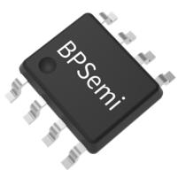
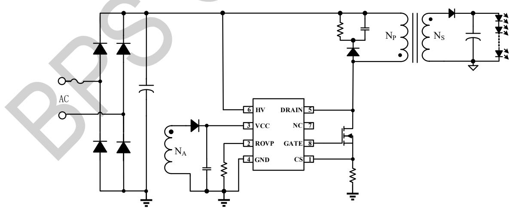
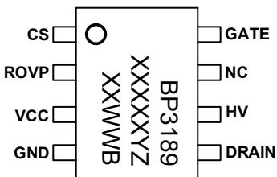
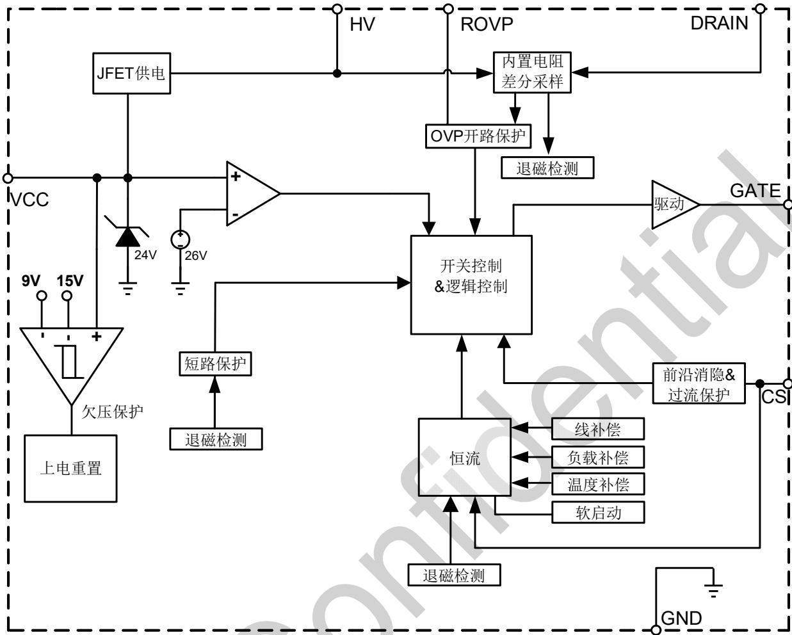
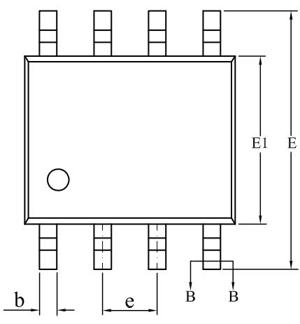
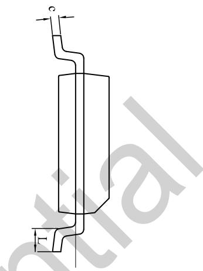
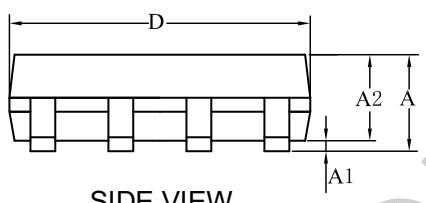
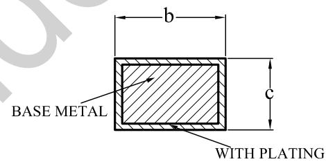

## BP3189B低 PF 隔离反激原边恒流控制器

## 概述

BP3189B 是一款高精度的两绕组、低 PF 原边反馈恒流驱动器，适合搭配前级 APFC 升压电路，实现两级隔离⽆频闪应⽤。

BP3189B 芯片采⽤差分采样检测输出电压和退磁信号，可以实现两绕组隔离应⽤（VCC 独立电源供电），同时确保优异的OVP 精度。

BP3189B 芯片采⽤先进的原边恒流控制技术，不需要副边反馈回路和环路补偿电容，即可实现优异的恒流特性，极⼤的节约了系统成本和体积。

BP3189B 工作在电感电流临界连续模式和准谐振模式，降低了开关损耗及 EMI，从而提升变压器的利⽤率。

BP3189B 提供完善的保护功能，包括输出开路保护、输出短路保护、逐周期限流保护、过温降电流保护等。

BP3189B 采⽤ SOP-8 封装。

## 特点

 内置高压启动和供电，启动速度快

 高精度电流参考

 低工作电流

 高精度空载电压基准

 优异的负载调整率和线性调整率

 临界连续导通模式和准谐振模式，EMC 优化

 VCC 欠压锁定

 逐周期限流

 完善的保护功能

 输出开路保护

 输出短路保护

 逐周期限流保护

过温降电流保护

 电感和输出⼆极管短路保护

## 应用领域

LED 面板灯

SOP-8 封装

LED 筒灯

## 典型应用

  
图 1 BP3189B 典型应⽤电路  
注：该线路及参数仅供参考，实际应⽤电路和参数请通过试验充分验证。

## 定购信息

<table><tr><td>定购型号</td><td>封装</td><td>包装形式</td><td>打印</td></tr><tr><td>BP3189B</td><td>SOP-8</td><td>卷盘4,000PCS/盘</td><td>BP3189XXXXYZXXWWB</td></tr></table>

## 管脚封装

  
BP3189B：产品型号  
XXXXXY：批次

Z：预留

XX：标识

WW：周号

图 2 管脚封装图

## 管脚描述

<table><tr><td>管脚号</td><td>管脚名称</td><td>描述</td></tr><tr><td>1</td><td>CS</td><td>电流采样端,采样电阻接在 CS 与 GND 端之间</td></tr><tr><td>2</td><td>ROVP</td><td>OVP电压设置</td></tr><tr><td>3</td><td>VCC</td><td>芯片供电</td></tr><tr><td>4</td><td>GND</td><td>芯片地</td></tr><tr><td>5</td><td>DRAIN</td><td>内置高压采样电阻</td></tr><tr><td>6</td><td>HV</td><td>高压启动和供电及输入电压检测</td></tr><tr><td>7</td><td>NC</td><td>无连接</td></tr><tr><td>8</td><td>GATE</td><td>功率管驱动输出</td></tr></table>

## 极限参数(注 1)

<table><tr><td>符号</td><td>参数</td><td>参数范围</td><td>单位</td></tr><tr><td>DRAIN</td><td>内置高压采样电阻</td><td>-0.3~700</td><td>V</td></tr><tr><td>HV</td><td>高压启动和供电及输入电压检测</td><td>-0.3~700</td><td>V</td></tr><tr><td>CS</td><td>CS引脚电压</td><td>-0.3~6</td><td>V</td></tr><tr><td>ROVP</td><td>ROVP引脚电压</td><td>-0.3~6</td><td>V</td></tr><tr><td>VCC</td><td>芯片供电VCC电压</td><td>-0.3~30</td><td>V</td></tr><tr><td> $P_{DMAX}$ </td><td>功耗(注2)</td><td>0.45</td><td>W</td></tr><tr><td> $\theta_{JA}$ </td><td>PN结到环境的热阻(注3)</td><td>145</td><td>°C/W</td></tr><tr><td> $T_J$ </td><td>工作结温范围</td><td>-40~150</td><td>°C</td></tr><tr><td> $T_{STG}$ </td><td>储存温度范围</td><td>-55~150</td><td>°C</td></tr></table>

注 1：最⼤极限值是指超出该工作范围，芯片有可能损坏。推荐工作范围是指在该范围内，器件功能正常，但并不完全保证满⾜个别性能指标。电⽓参数定义了器件在工作范围内并且在保证特定性能指标的测试条件下的直流和交流电参数规范。对于未给定上下限值的参数，该规范不予保证其精度，但其典型值合理反映了器件性能。

注 2：温度升高最⼤功耗一定会减小，这也是由 T , θ ,和环境温度 T 所决定的。最⼤允许功耗为 $P _ { D M A X } = ( T _ { J M A X } - T _ { A } ) / \theta _ { J A }$ 或是极限范围给出的数字中比较低的那个值。

注 3：1平方英寸双层 PCB板，按照JEDEC 标准测试。

电气参数(注 4)（⽆特别说明情况下， ${ \mathsf { T A } } = 2 5 ^ { \circ } { \mathsf { C } } )$

<table><tr><td>符号</td><td>描述</td><td>条件</td><td>最小值</td><td>典型值</td><td>最大值</td><td>单位</td></tr><tr><td colspan="7">电源电压(VCC)</td></tr><tr><td> $V_{CC\_CLAMP}$ </td><td> $V_{CC}$ 钳位电压</td><td>1mA</td><td>23</td><td>24.2</td><td>25.4</td><td>V</td></tr><tr><td> $V_{CC\_ON}$ </td><td> $V_{CC}$ 启动电压</td><td> $V_{CC}$ 上升</td><td>13.5</td><td>15</td><td>16.5</td><td>V</td></tr><tr><td> $V_{CC\_UVLO}$ </td><td> $V_{CC}$ 欠压保护阈值</td><td> $V_{CC}$ 下降</td><td>8.1</td><td>9</td><td>9.9</td><td>V</td></tr><tr><td> $V_{CC\_OVP}$ </td><td> $V_{CC}$ 过压保护阈值</td><td> $I_{CC}>10mA$ </td><td>25.3</td><td>26.5</td><td>27.7</td><td>V</td></tr><tr><td> $I_{ST}$ </td><td> $V_{CC}$ 启动电流</td><td></td><td>140</td><td>200</td><td>260</td><td>μA</td></tr><tr><td> $I_{QUIESCENT}$ </td><td> $V_{CC}$ 静态工作电流</td><td>无开关动作</td><td>240</td><td>350</td><td>550</td><td>μA</td></tr><tr><td> $V_{CC\_JFETON}$ </td><td>JFET供电 $V_{CC}$ 电压</td><td></td><td>10</td><td>11</td><td>12</td><td>V</td></tr><tr><td colspan="7">JFET启动和供电</td></tr><tr><td> $I_{HV\_CHRG1}$ </td><td>JFET充电电流1</td><td> $V_{HV}=50V,V_{CC}=0V$ </td><td>5</td><td>10</td><td>15</td><td>mA</td></tr><tr><td> $I_{HV\_CHRG2}$ </td><td>JFET充电电流2</td><td> $V_{HV}=50V,V_{CC}=2.5V$ </td><td>0.4</td><td>0.6</td><td>0.8</td><td>mA</td></tr><tr><td> $I_{HV\_CHRG3}$ </td><td>JFET充电电流3</td><td> $V_{HV}=50V,V_{CC}=4.8V$ </td><td>5</td><td>10</td><td>15</td><td>mA</td></tr><tr><td colspan="7">电流采样(CS)</td></tr><tr><td> $V_{REF}$ </td><td>内部恒流基准电压</td><td></td><td>194</td><td>200</td><td>206</td><td>mV</td></tr><tr><td> $V_{CS\_TH1}$ </td><td>逐周期限流阈值</td><td></td><td>0.3</td><td>0.35</td><td>0.4</td><td>V</td></tr><tr><td> $T_{LEB}$ </td><td>前沿消隐时间</td><td></td><td></td><td>300</td><td></td><td>ns</td></tr><tr><td> $V_{CS\_TH2}$ </td><td>过流保护阈值</td><td></td><td></td><td>1.2</td><td></td><td>V</td></tr><tr><td colspan="7">零电流检测及输出开路保护</td></tr><tr><td> $V_{OVP}$ </td><td>Drain与HV差分电压</td><td> $R_{OVP}=10kΩ$  $HV=10V$ </td><td>95</td><td>100</td><td>105</td><td>V</td></tr><tr><td colspan="7">内部时间控制</td></tr><tr><td> $T_{ON\_MAX}$ </td><td>最大开通时间</td><td></td><td>20</td><td>35</td><td>45</td><td>μs</td></tr><tr><td> $T_{OFF\_MAX}$ </td><td>最大关断时间</td><td></td><td>70</td><td>115</td><td>160</td><td>μs</td></tr><tr><td> $T_{ZCD\_MASK}$ </td><td>退磁检测屏蔽时间</td><td></td><td>2.4</td><td>3.5</td><td>4.6</td><td>μs</td></tr><tr><td> $F_{MAX}$ </td><td>最大工作频率</td><td></td><td>105</td><td>130</td><td>160</td><td>kHz</td></tr><tr><td> $T_{OVP\_MASK}$ </td><td>空载保护屏蔽时间</td><td></td><td>2.4</td><td>3.5</td><td>4.6</td><td>μs</td></tr><tr><td> $T_{SHORT}$ </td><td>短路保护时间</td><td></td><td></td><td>35</td><td></td><td>ms</td></tr><tr><td> $T_{FAULT}$ </td><td>短路保护重启间隔时间</td><td></td><td></td><td>350</td><td></td><td>ms</td></tr><tr><td> $T_{SS}$ </td><td>软启动时间</td><td></td><td></td><td>100</td><td></td><td>ms</td></tr><tr><td colspan="7">GATE 驱动能力</td></tr><tr><td> $I_{SOURCE}$ </td><td>最大驱动上拉电流</td><td></td><td></td><td>35</td><td></td><td>mA</td></tr><tr><td> $I_{SINK}$ </td><td>最大驱动下拉电流</td><td></td><td></td><td>200</td><td></td><td>mA</td></tr><tr><td colspan="7">过热调节部分</td></tr><tr><td> $T_{REG}$ </td><td>过热调节温度</td><td></td><td></td><td>145</td><td></td><td>°C</td></tr></table>

注 4：规格书的最小、最⼤规范范围由测试保证，典型值由设计、测试或统计分析保证。

## 内部结构框图

  
图 3 BP3189B 内部框图

## 功能描述

BP3189B是一款高精度原边反馈LED恒流驱动器，适合搭配前级Boost APFC升压电路，实现两级隔离⽆频闪应⽤。

## 启动

系统上电后，当VCC电压<2.5V时，⺟线电压直接通过HV引脚以电流 IHV\_CHRG1 对 VCC 电容充电；当 $2 . 5 V { < } V C C < 4 . 8 V$ 时，HV 引脚以电流 I 对 VCC 电容充电；当$4 . 8 \mathsf { V } < \mathsf { V C C } < \mathsf { V } \mathsf { c c } \_ { 0 \mathsf { N } }$ 时，HV 引脚以电流 I 对 VCC 电容充电。电压达到芯片开启阈值 $V _ { C C \_ O N }$ 时，芯片内部控制电路开始工作。

## 软启动

每次 VCC 从 UVLO 电压以下充电到 $V _ { C C \_ O N }$ 以后，系统都会经历软启动过程。在软起动过程中，CS 峰值电压分段线性增加，从而控制电感峰值电流限值以减小开关应⼒，每次重启和故障保护复位都会经历软启动过程，软起动时间持续约 100ms。

恒流控制，输出电流设置

BP3189B 采⽤了特有的电流采样机制，工作于原边反馈模式，⽆需次级反馈电路，即可实现高精度输出恒流控制。

LED 输出电流计算方法：

$$
I _ {o u t} \approx \frac {V _ {R E F}}{2 \times R _ {c s}} \times \frac {N _ {P}}{N _ {S}}
$$

其中：

$V _ { \mathsf { R E F } }$ 是内部基准电压

N 是变压器主级绕组的匝数 ${ \sf N } _ { \sf S }$ 是变压器次级绕组的匝数 $\mathsf { R c s }$ 是电流采样电阻的值

输出过压保护

$R _ { O V P }$ 引脚⽤于设置输出空载保护电压。

$$
R _ {O V P} \approx \frac {3 6 . 7 5 k \Omega}{\frac {5 V * 9 0}{N _ {P S} * V _ {O V P}} - 1}
$$

其中：

$R _ { O V P }$ 是反馈网络的 OVP电压设置电阻

$N _ { P S }$ 是变压器的初次级匝比

$V _ { O V P }$ 是输出开路电压

5V 是芯片内部基准

## 过温降电流

BP3189B 具有过热调节功能，在驱动电源过热时逐渐减小输出电流，从而控制输出功率和温升，避免芯片温度上升，以提高系统的可靠性。进入过温调节点 TREG 以后，输出电流逐渐下降。在过温降电流过程中，Toff 时间也逐渐加⻓，系统进入DCM模式工作。过温降电流过程中，保护功能仍然保持有效。

为防止高温时因为CS采样电阻温漂 、变压器感量变化和输出⼆极管漏电流增加导致输出电流下降，BP3189B 内置温度补偿。

## 线性调整率补偿

由于存在信号传播延时和 MOSFET 关断延时，输出电流会随输入电压变化而变化。 为此，BP3189B 内置了线性调整率补偿功能。采样输入⺟线电压转换成电压叠加在采样到的 Vcs电压上，实现实时线电压补偿。

## 短路保护

BP3189B 连续 35ms 检测不到退磁信号，则进入短路保护状态。等待 T 以后重新检测故障状态。

## 电感短路、输出⼆极管短路故障

当电感或输出⼆极管短路时，CS 电压迅速上升。若 CS 电压⼤于 $\mathsf { V } _ { \mathsf { C S \_ T H 2 } }$ ，系统进入故障保护状态。等待TFAULT以后重新检测故障状态。

## PCB Layout 指南

在设计 BP3189B应⽤ PCB时，需要遵循以下建议：

1) VCC 的旁路电容需要紧靠芯片 VCC 和 GND 引脚。

电流采样电阻的功率地线尽可能粗，且要离芯片的地量近，以保证电流采样的准确性，否则可能会影响出电流的调整率。线电压补偿⽤的电阻必须尽量靠芯片 CS 引脚。另外，信号地需要单独连接到芯片的地引脚。

3) 减小⼤电流环路的面积，如变压器初级、功率管及吸收网络的环路面积，以及变压器次级、次级⼆极管、输出电容的环路面积，以减小 EMI 辐射。

4) 接到 ROVP 的电阻必须靠近 ROVP 引脚，且节点要远离变压器的动点，否则系统噪声容易误触发 ROVP 的OVP保护功能。

## 封装信息

SOP-8 封装外形尺寸  
  
TOP VIEW

  
SIDE VIEW

  
SIDE VIEW

  
SECTION B-B

<table><tr><td rowspan="2">SYMBOL</td><td colspan="3">MILLIMETER</td></tr><tr><td>MIN</td><td>NOM</td><td>MAX</td></tr><tr><td>A</td><td>1.30</td><td>—</td><td>1.80</td></tr><tr><td>A1</td><td>0.10</td><td>—</td><td>0.25</td></tr><tr><td>A2</td><td>1.25</td><td>1.40</td><td>1.65</td></tr><tr><td>b</td><td>0.33</td><td>—</td><td>0.51</td></tr><tr><td>c</td><td>0.17</td><td>—</td><td>0.25</td></tr><tr><td>D</td><td>4.70</td><td>4.90</td><td>5.10</td></tr><tr><td>E</td><td>5.80</td><td>6.00</td><td>6.20</td></tr><tr><td>E1</td><td>3.70</td><td>3.90</td><td>4.10</td></tr><tr><td>e</td><td colspan="3">1.27BSC</td></tr><tr><td>L</td><td>0.40</td><td>—</td><td>1.00</td></tr></table>

## 版本信息

<table><tr><td>版本</td><td>日期</td><td>记录</td></tr><tr><td>Rev. 1.0</td><td>2022/09</td><td>首次发行</td></tr><tr><td>Rev. 1.1</td><td>2023/04</td><td>更新电气参数</td></tr><tr><td>Rev. 1.2</td><td>2023/09</td><td>更新电气参数</td></tr><tr><td></td><td></td><td></td></tr><tr><td></td><td></td><td></td></tr></table>

## 免责声明

晶丰明源尽⼒确保本产品规格书内容的准确和可靠，但是保留在没有通知的情况下，修改规格书内容的权利。

本产品规格书未包含任何针对晶丰明源或第三方所有的知识产权的授权。针对本产品规格书所记载的信息，晶丰明源不做任何明⽰或暗⽰的保证，包括但不限于对规格书内容的准确性、商业上的适销性、特定⽬的的适⽤性或者不侵犯晶丰明源或任何第三⼈知识产权做任何明⽰或暗⽰保证，晶丰明源也不就因本规格书本⾝及其使⽤有关的偶然或必然损失承担任何责任。