## BP3276CL升压闭环可控硅调光 LED驱动芯片

## 概述

BP3276CL是一款高效率、高PF值，支持可控硅调光的LED驱动芯片。芯片工作在电感电流临界连续模式，适用于Boost结构的LED驱动电源。

BP3276CL芯片内部集成 500V功率开关，采用栅极驱动和高压供电方式，只需要很少的外围元件，即可实现优异的恒流特性，极大的节约了系统成本和体积。

BP3276CL具有多重保护功能，包括LED 开路保护（过压保护)，芯片温度过热调节等。

BP3276CL 采用 SOP-8 封装。

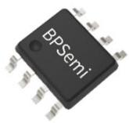  
SOP-8 封装

## 特点

支持可控硅调光

内置COMP闭环恒流控制

内部集成 500V功率管

临界连续电流控制模式

集成 600V 高压 JFET 供电，无 VCC 电容

±5% LED 输出电流精度

精准的LED 开路保护

RTH 设定过热调节功能

支持 NTC 保护线路

采用 SOP-8 封装

## 应用领域

LED球泡灯

LED蜡烛灯

其他LED照明

## 典型应用

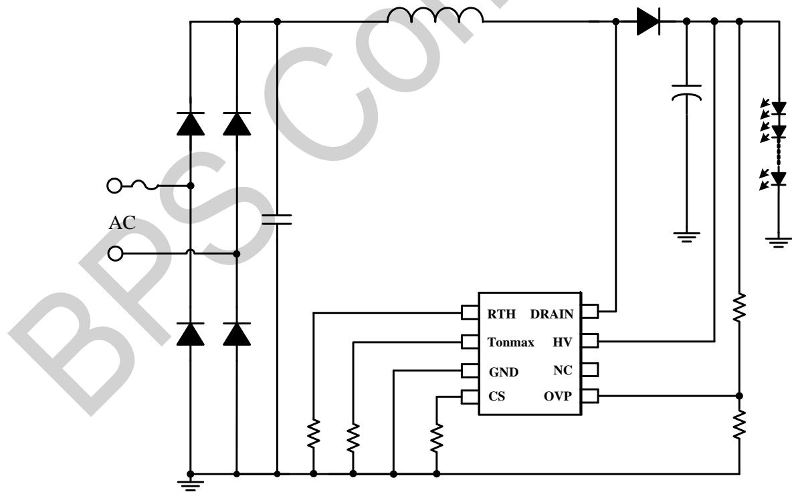  
图 1. BP3276CL 典型应用图(Boost)

## 定购信息

<table><tr><td>定购型号</td><td>封装</td><td>包装形式</td><td>打印</td></tr><tr><td>BP3276CL</td><td>SOP-8</td><td>编带4,000颗/盘</td><td>BP3276CXXXXYZXXYYWWL</td></tr></table>

## 管脚封装

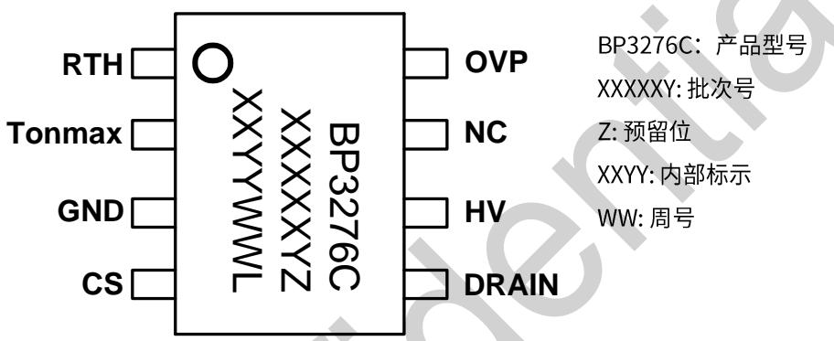  
图 2. SOP-8 管脚封装图

## 管脚描述

<table><tr><td>管脚号</td><td>管脚名称</td><td>描述</td></tr><tr><td>1</td><td>RTH</td><td>过温调节起始温度设置及 NTC 功能</td></tr><tr><td>2</td><td>Tonmax</td><td>最大导通时间设置</td></tr><tr><td>3</td><td>GND</td><td>芯片地</td></tr><tr><td>4</td><td>CS</td><td>电流采样端</td></tr><tr><td>5</td><td>DRAIN</td><td>内置功率 MOS 管的漏极</td></tr><tr><td>6</td><td>HV</td><td>高压供电输入端</td></tr><tr><td>7</td><td>NC</td><td>悬空</td></tr><tr><td>8</td><td>OVP</td><td>过压保护信号采样端</td></tr></table>

## 极限参数(注1)

<table><tr><td>符号</td><td>参数</td><td>参数范围</td><td>单位</td></tr><tr><td>HV</td><td>高压供电输入端</td><td>-0.3~600</td><td>V</td></tr><tr><td>DRAIN</td><td>内置功率 MOS 管的漏极</td><td>-0.3~500</td><td>V</td></tr><tr><td>RTH</td><td>过温调节起始温度设置及 NTC 功能</td><td>-0.3~7.5</td><td>V</td></tr><tr><td>CS</td><td>电流采样端</td><td>-0.3~6</td><td>V</td></tr><tr><td>OVP</td><td>过压保护信号采样端</td><td>-0.3~6</td><td>V</td></tr><tr><td>Tonmax</td><td>最大导通时间设置</td><td>-0.3~6</td><td>V</td></tr><tr><td> $P_{DMAX}$ </td><td>功耗(注 2)</td><td>0.45</td><td>W</td></tr><tr><td> $\theta_{JA}$ </td><td>PN 结到环境的热阻</td><td>145</td><td>°C/W</td></tr><tr><td> $T_J$ </td><td>工作结温范围</td><td>-40 to 150</td><td>°C</td></tr><tr><td> $T_{STG}$ </td><td>储存温度范围</td><td>-55 to 150</td><td>°C</td></tr><tr><td></td><td>ESD(注 3)</td><td>2</td><td>KV</td></tr></table>

注1：最大极限值是指超出该工作范围，芯片有可能损坏。推荐工作范围是指在该范围内，器件功能正常，但并不完全保证满足个别性能指标。电气参数定义了器件在工作范围内并且在保证特定性能指标的测试条件下的直流和交流电参数规范。对于未给定上下限值的参数，该规范不予保证其精度，但其典型值合理反映了器件性能。

注2:温度升高最大功耗一定会减小，这也是由TJMAX.θ.JA,和环境温度TA所决定的。最大允许功耗为PDMAX=(TJMAX-TA)/θJA或是极限范围给出的数字中比较低的那个值。

注3：人体模型，100pF电容通过1.5KΩ电阻放电。

电气参数(注4，5)（无特别说明情况下，HV=30V，TA=25°C)

<table><tr><td>符号</td><td>描述</td><td>条件</td><td>最小值</td><td>典型值</td><td>最大值</td><td>单位</td></tr><tr><td colspan="7">电源</td></tr><tr><td> $I_{ST}$ </td><td>HV启动电流</td><td></td><td></td><td>1</td><td></td><td>mA</td></tr><tr><td> $I_{OP}$ </td><td>HV工作电流</td><td></td><td>211</td><td>281</td><td>351</td><td>μA</td></tr><tr><td colspan="7">电流采样</td></tr><tr><td> $V_{CS\_REF}$ </td><td>电流检测基准电压</td><td></td><td>388</td><td>400</td><td>412</td><td>mV</td></tr><tr><td> $V_{CS\_LIMIT}$ </td><td>电流峰值限流阈值</td><td></td><td></td><td>1.4</td><td></td><td>V</td></tr><tr><td> $T_{LEB}$ </td><td>前沿消隐时间</td><td></td><td></td><td>350</td><td></td><td>ns</td></tr><tr><td> $T_{DELAY}$ </td><td>芯片关断延迟</td><td></td><td></td><td>200</td><td></td><td>ns</td></tr><tr><td colspan="7">内部时间控制</td></tr><tr><td> $T_{OFF\_MIN}$ </td><td>最小退磁时间</td><td></td><td></td><td>2.5</td><td></td><td>μs</td></tr><tr><td> $T_{OFF\_MAX}$ </td><td>最大退磁时间</td><td></td><td>28</td><td>37</td><td>52</td><td>μs</td></tr><tr><td> $T_{ON\_MAX}$ </td><td>最大导通时间</td><td>Tonmax接51K</td><td>10.8</td><td>11.5</td><td>13.2</td><td>μs</td></tr><tr><td colspan="7">RTH</td></tr><tr><td> $I_{RTH}$ </td><td>RTH上拉电流</td><td> $V_{RTH}<2V$ </td><td>46</td><td>50</td><td>54</td><td>μA</td></tr><tr><td colspan="7">开路保护</td></tr><tr><td> $V_{OVP\_H}$ </td><td>过压保护触发阈值</td><td></td><td>0.48</td><td>0.5</td><td>0.52</td><td>V</td></tr><tr><td> $V_{OVP\_L}$ </td><td>过压保护退出阈值</td><td></td><td></td><td>0.4</td><td></td><td>V</td></tr><tr><td colspan="7">功率MOSFET</td></tr><tr><td> $R_{DS\_ON}$ </td><td>MOSFET导通电阻</td><td>VGS=10V/IDS=0.5A</td><td>2</td><td>3</td><td>3.6</td><td>Ω</td></tr><tr><td> $BV_{DSS}$ </td><td>MOSFET击穿电压</td><td>VGS=0V/IDS=250uA</td><td>500</td><td></td><td></td><td>V</td></tr><tr><td> $I_{DSS}$ </td><td>MOSFET漏电流</td><td>VGS=0V/VDS=500V</td><td></td><td></td><td>1</td><td>μA</td></tr><tr><td colspan="7">过热调节</td></tr><tr><td> $T_{REG1}$ </td><td>过热调节温度 1</td><td>RTH=75K</td><td></td><td>150</td><td></td><td>°C</td></tr><tr><td> $T_{REG2}$ </td><td>过热调节温度 2</td><td>RTH=300K</td><td></td><td>120</td><td></td><td>°C</td></tr><tr><td> $T_{REG3}$ </td><td>过热调节温度 3</td><td>RTH 悬空</td><td></td><td>130</td><td></td><td>°C</td></tr></table>

注4：典型参数值为25℃下测得的参数标准。  
注5：规格书的最小、最大规范范围由测试保证，典型值由设计、测试或统计分析保证。

## 内部结构框图

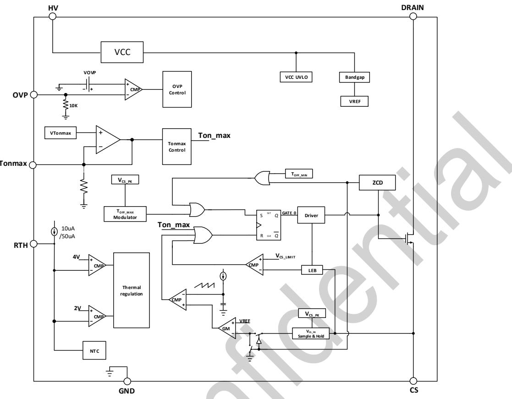  
图 3. BP3276CL 内部框图

## 功能描述

BP3276CL 是一款高效率支持可控硅调光的LED 驱动芯片应用于 Boost 结构的 LED 驱动电源。电路采用无 VCC电容的高压供电架构，只需要极少的外围组件就可以达到优异的恒流特性，极大的节约了系统成本和体积。在外接调光器时，BP3276CL 通过内部Tonmax限制，使输出电流跟随调光角度同步调节，改善调光范围和调光兼容性。

## 启动

系统上电后，母线电压通过HV引脚给芯片供电，当芯片内部电压达到芯片开启阈值时，芯片控制电路开始工作。

## 恒流控制

芯片CS端连接到内部的基准运放反向输入端，运放正向输出端为CS基准电压，运放输出端误差信号通过内部补偿自动调节占空比实现输出恒流。

输出电流的计算公式为：

$$
I _ {\mathrm{LED}} = \frac {V _ {C S \_ R E F}}{2 * R _ {C S}} (m A)
$$

其中，RCS为电流采样电阻阻值。

## 储能电感

BP3276CL工作在电感电流临界模式，当功率管导通时，流过储能电感的电流从零开始上升，BOOST导通时间为

$$
t _ {o n} = \frac {L \times I _ {P K}}{V _ {I N}}
$$

其中，L是电感量；

IpK是电感电流的峰值：

Vi是经整流后的母线电压：

当功率管关断时，流过储能电感的电流从峰值开始往下降，当电感电流下降到零时，芯片内部逻辑再次将功率管开通。BOOST功率管的关断时间为：

$$
t _ {o f f} = \frac {L \times I _ {P K}}{V _ {L E D} - V _ {I N}}
$$

BOOST储能电感的计算公式为：

$$
L = \frac {(V _ {L E D} - V _ {I N}) \times V _ {I N}}{f \times I _ {P K} \times V _ {L E D}}
$$

其中，f为系统最大工作频率。设置BP3276CL系统工作频率时，选择在输入电压最低时设置系统的工作频率和最大导通时间，而当输入电压最高时，系统的导通时间最小。

## 最大导通时间设置

BP3276CL 具有最大导通时间调节功能，通过调节 Tonmax引脚对地电阻调节芯片最大导通时间，可以很好的兼容不同系统工作频率和调光曲线。Tonmax引脚不允许悬空。

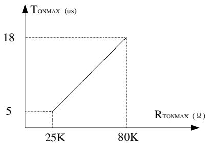  
图 4. Tonmax 设置曲线

## 过压保护电阻设置

OVP引脚用来探测输出过压保护。OVP的上下分压电阻比例可以设置为：

$$
V _ {O V P} = \frac {R 1 + (R 2 / / 1 0 K)}{\mathrm{R} 2 / / 1 0 \mathrm{K}} \times V _ {O V P \_ H}
$$

其中，

R2 是反馈网络的下分压电阻：

R1 是反馈网络的上分压电阻；

VOVP\_H 是芯片检测 OVP 保护阈值；

VOVP 是输出电压过压保护设定点；

为了提高OVP精度，OVP下分压电阻推荐1KΩ左右。

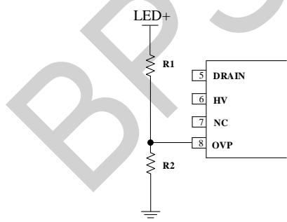  
图 5.OVP 线路示意图

## 过温调节功能

BP3276CL具有过热调节功能，在驱动电源过热时逐渐减小输出电流，从而控制输出功率和温升，使电源温度保持在设定值，以提高系统的可靠性。芯片内部设定的过热调节温度点可通过 RTH 引脚对地电阻设定，RTH 引脚对地建议并联330pF电容滤掉高频开关噪声干扰。

RTH 引脚兼容 NTC 功能，当使用 NTC 功能时，建议在 RTH对地并联一个100K 以下电阻将芯片过温调节设为 150℃。当NTC 引脚电压低于0.5V时，芯片基准开始下降，当NTC引脚电压低于0.34V时，芯片基准电压降到60%。

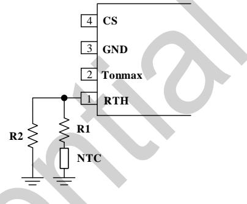  
图6.NTC 参考线路

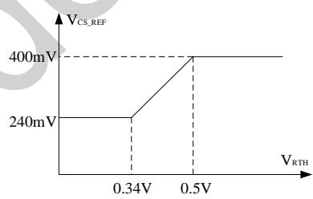  
图 7. NTC 降功率曲线

## 保护功能

BP3276CL 内置多种保护功能，包括LED 开路保护，芯片过热调节等。

## 过压保护功能

当输出LED负载开路时，随着输出电压的上升，当输出电压达到设定的过压保护点，会触发芯片过压保护逻辑并停止开关工作。

## PCB 设计

在设计 BP3276CL PCB 时，需要遵循以下指南：

## RTH 引脚

RTH 电阻需要尽量靠近芯片 RTH 引脚，且 RTH 节点需要远离高压节点和噪声源。

## Tonmax 引脚

Tonmax 电阻需要尽量靠近芯片 Tonmax 引脚，且 Tonmax节点需要远离高压节点和噪声源。

## 地线

电流采样电阻的功率地线尽可能粗，且要离芯片的GND脚尽量近。另外，RTH脚和 OVP 脚的电阻到芯片 GND 脚的连线应尽可能短。

DRAIN 引脚

增加DRAIN引脚的铺铜面积可以提高芯片散热，但是铺铜会影响EMI性能。

功率环路的面积

减小功率环路的面积，如功率管、母线电容和续流二极管的环路面积，以减小EMI辐射。

## 封装信息

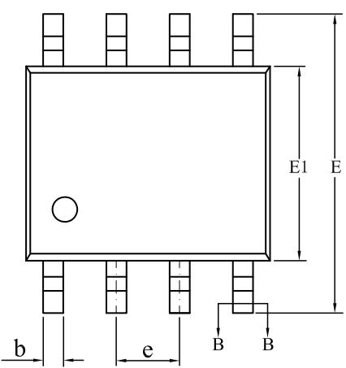

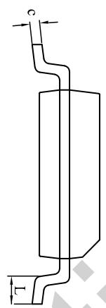

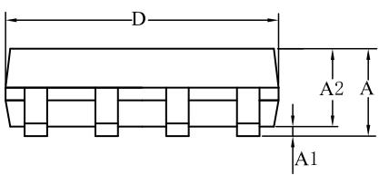

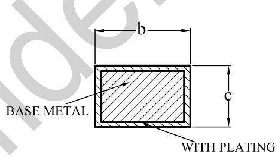  
SECTION B-B

<table><tr><td rowspan="2">SYMBOL</td><td colspan="3">MILLIMETER</td></tr><tr><td>MIN</td><td>NOM</td><td>MAX</td></tr><tr><td>A</td><td>1.30</td><td>—</td><td>1.80</td></tr><tr><td>A1</td><td>0.05</td><td>—</td><td>0.25</td></tr><tr><td>A2</td><td>1.25</td><td>1.40</td><td>1.65</td></tr><tr><td>b</td><td>0.33</td><td>—</td><td>0.51</td></tr><tr><td>c</td><td>0.17</td><td>—</td><td>0.25</td></tr><tr><td>D</td><td>4.70</td><td>4.90</td><td>5.10</td></tr><tr><td>E</td><td>5.80</td><td>6.00</td><td>6.30</td></tr><tr><td>E1</td><td>3.70</td><td>3.90</td><td>4.10</td></tr><tr><td>e</td><td colspan="3">1.27BSC</td></tr><tr><td>L</td><td>0.40</td><td>—</td><td>1.00</td></tr></table>

## 版本信息

<table><tr><td>版本</td><td>日期</td><td>记录</td></tr><tr><td>Rev. 1.0</td><td>2024/08</td><td>首次发行</td></tr><tr><td></td><td></td><td></td></tr></table>

## 免责声明

晶丰明源尽力确保本产品规格书内容的准确和可靠，但是保留在没有通知的情况下，修改规格书内容的权利。

本产品规格书未包含任何针对晶丰明源或第三方所有的知识产权的授权。针对本产品规格书所记载的信息，晶丰明源不做任何明示或暗示的保证，包括但不限于对规格书内容的准确性，商业上的适销性，特定目的的适用性或者不侵犯晶丰明源或任何第三人知识产权做任何明示或暗示保证，晶丰明源也不就因本规格书本身及其使用有关的偶然或必然损失承担任何责任。

## 电子器件报废说明

该产品在生命周期结束后，由客户按照一般电子产品的报废流程进行处理。