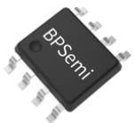
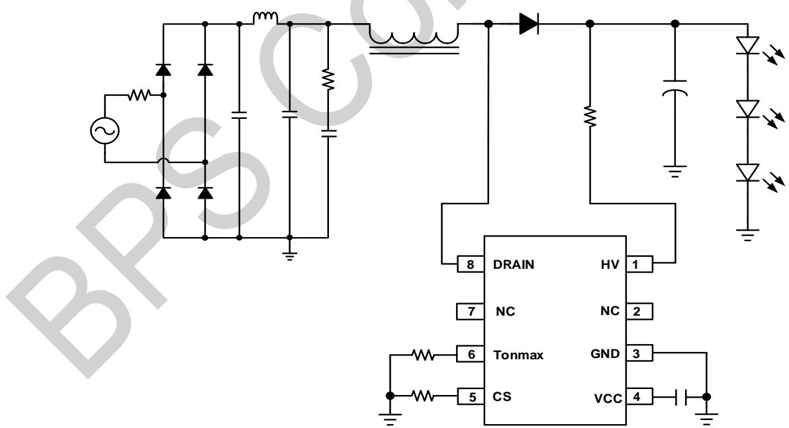
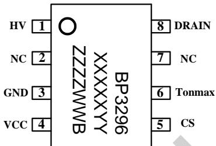
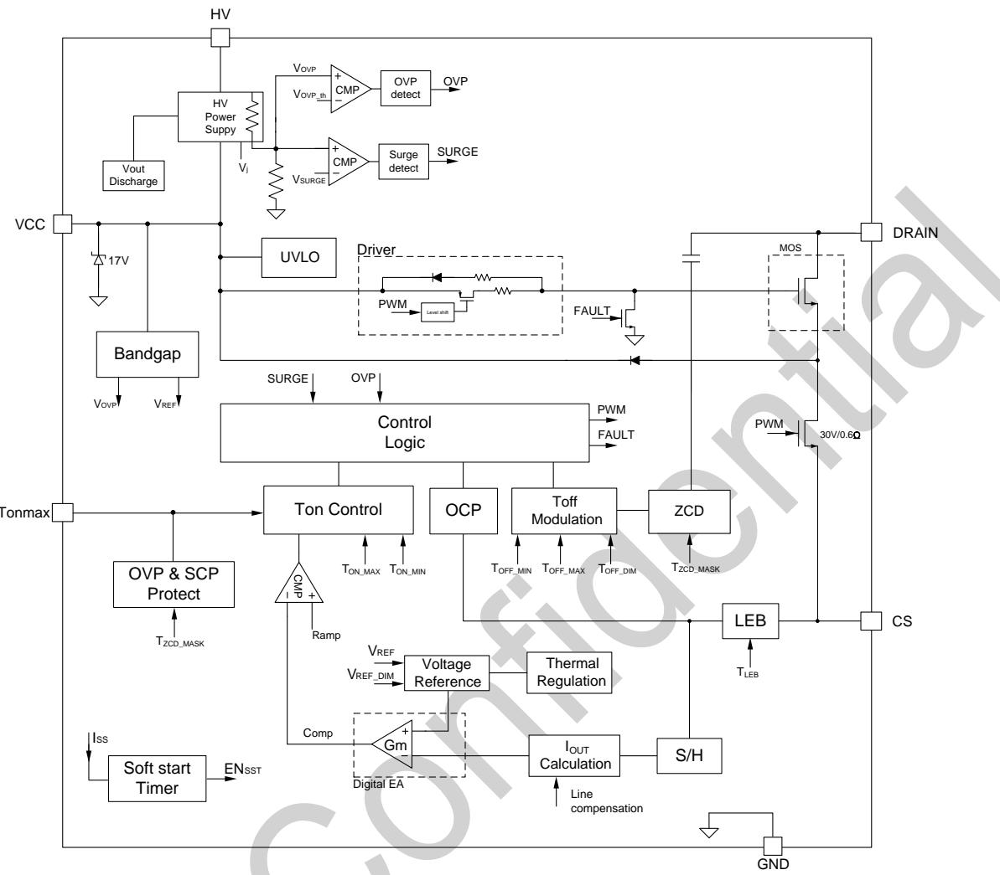
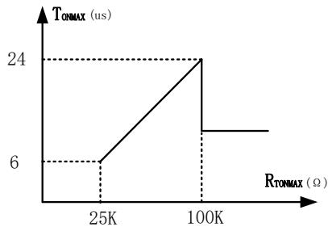
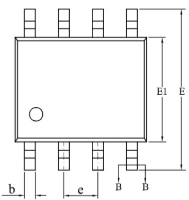
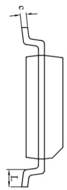
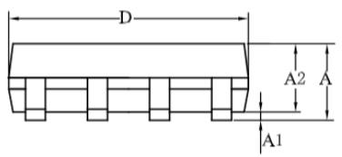
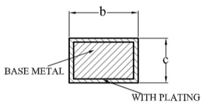

## BP3296B升压闭环可控硅调光 LED 驱动芯片

## 概述

BP3296B是一款高效率、高PF值，支持可控硅调光的LED驱动芯片。芯片工作在电感电流临界连续模式，适用于Boost结构的LED驱动电源。

BP3296B芯片采用源极驱动和高压供电方式，只需要很少的外围元件，即可实现优异的恒流特性，极大的节约了系统成本和体积。

BP3296B 具有多重保护功能，包括 LED 开路保护（过压保护），芯片温度过热调节等。

BP3296B 采用 SOP-8 封装。

  
SOP-8 封装

## 特点

支持可控硅调光

源极驱动

集成 650V 高压 JFET 供电，外置VCC 电容

高压差分采样 OVP

内置COMP闭环恒流控制

临界连续电流控制模式

高精度Tonmax

± 3% LED 输出电流精度

采用 SOP-8封装性

逐周期限流(OCP)

开路保护（OVP)

过温保护(OTP)

## 应用领域

LED 球泡灯

LED 灯丝灯

其他 LED 照明

## 典型应用

  
图 1. BP3296B 典型应用电路

## 定购信息

<table><tr><td>定购型号</td><td>封装</td><td>包装形式</td><td>打印</td></tr><tr><td>BP3296B</td><td>SOP8</td><td>编带4,000颗/盘</td><td>BP3296XXXXYYZZZZWWB</td></tr></table>

## 管腳封装

  
图 2. SOP-8 管脚封装图

BP3296：产品型号

XXXXXYY:批次号

ZZZZ: 内部标示

WW：周号

## 管脚描述

<table><tr><td>管脚号</td><td>管脚名称</td><td>描述</td></tr><tr><td>1</td><td>HV</td><td>高压供电端</td></tr><tr><td>2,7</td><td>NC</td><td>悬空</td></tr><tr><td>3</td><td>GND</td><td>芯片地</td></tr><tr><td>4</td><td>VCC</td><td>芯片供电端</td></tr><tr><td>5</td><td>CS</td><td>电流采样端</td></tr><tr><td>6</td><td>Tonmax</td><td>最大导通时间设置</td></tr><tr><td>8</td><td>DRAIN</td><td>内置功率 MOS 管的漏极</td></tr></table>

## 输出功率

<table><tr><td>型号</td><td>工作特点</td><td>输出功率(175~265 VAC)开放式(注 2)</td></tr><tr><td>BP3296B</td><td>恒功率输出</td><td>8W</td></tr></table>

## 极限参数(注1)

<table><tr><td>符号</td><td>参数</td><td>参数范围</td><td>单位</td></tr><tr><td> $V_{DRAIN}$ </td><td>内部高压功率管耐压</td><td>-0.3~500</td><td>V</td></tr><tr><td> $V_{HV}$ </td><td>HV引脚电压</td><td>-0.3~650</td><td>V</td></tr><tr><td> $V_{Vcc}$ </td><td>芯片供电端</td><td>-0.3~20</td><td>V</td></tr><tr><td> $V_{Tonmax}$ </td><td>最大导通时间设置</td><td>-0.3~6</td><td>V</td></tr><tr><td> $V_{CS}$ </td><td>CS引脚电压</td><td>-0.3~6</td><td>V</td></tr><tr><td> $P_{DMAX}$ </td><td>功耗(注2)</td><td>0.45</td><td>W</td></tr><tr><td> $\theta_{JA}$ </td><td>结到环境的热阻(注3)</td><td>145</td><td>°C/W</td></tr><tr><td> $T_J$ </td><td>工作结温范围</td><td>-40~150</td><td>°C</td></tr><tr><td> $T_{STG}$ </td><td>储存温度范围</td><td>-55~150</td><td>°C</td></tr></table>

注1：极限参数是指超出该范围，有可能导致器件永久性损坏。极限参数为器件应力的额定值，长期工作在极限参数条件可能会影响器件的可靠性。  
注2：温度升高最大功耗一定会减小，这也是由TJMAx，θJA,和环境温度TA所决定的。最大允许功耗为 $P _ { D M A X } = ( T _ { J M A X } - T _ { A } ) /$ θA或是极限范围给出的数字中比较低的那个值。  
注3：1平方英寸双层PCB 板，按照JEDEC 标准测试。  
注4：人体模型，100pF电容通过1.5kΩ电阻放电。

电气参数(注5)

<table><tr><td>符号</td><td>描述</td><td>条件</td><td>最小值</td><td>典型值</td><td>最大值</td><td>单位</td></tr><tr><td colspan="7">电源</td></tr><tr><td> $I_{HV}$ </td><td>HV充电电流</td><td>VCC=VCC $_{JFET-0.1V}$ </td><td>2</td><td>5</td><td>12</td><td>mA</td></tr><tr><td> $I_{VCCQ}$ </td><td>VCC静态电流</td><td>无开关动作</td><td>98</td><td>141</td><td>184</td><td>μA</td></tr><tr><td> $VCC_{ST}$ </td><td>VCC启动阈值</td><td>-</td><td>13.5</td><td>15</td><td>16.5</td><td>V</td></tr><tr><td> $VCC_{CLAMPHYS}$ </td><td>VCC钳位电压迟滞</td><td> $VCC_{CLAMP}-VCC_{ST}$ </td><td></td><td>2</td><td></td><td>V</td></tr><tr><td> $VCC_{JFET}$ </td><td>JFET供电VCC电压</td><td>-</td><td>9.9</td><td>11</td><td>12.1</td><td>V</td></tr><tr><td> $VCC_{UVLO}$ </td><td>VCC欠压阈值</td><td>-</td><td>7.2</td><td>8</td><td>8.8</td><td>V</td></tr><tr><td colspan="7">基准电压</td></tr><tr><td> $V_{CS\_REF}$ </td><td>输出电流检测阈值</td><td> $T_J$ =25°C</td><td>388</td><td>400</td><td>412</td><td>mV</td></tr><tr><td> $V_{CS\_LIMIT}$ </td><td>CS逐周期限流阈值</td><td> $T_J$ =25°C</td><td>1.26</td><td>1.4</td><td>1.54</td><td>V</td></tr><tr><td colspan="7">时间</td></tr><tr><td> $T_{OFF\_MIN}$ </td><td>最小关断时间</td><td> $V_{cs}$ =0V</td><td></td><td>1.6</td><td>3</td><td>μs</td></tr><tr><td> $T_{OFF\_MAX}$ </td><td>最大关断时间</td><td>-</td><td>28</td><td>40</td><td>52</td><td>μs</td></tr><tr><td> $T_{ZCD\_MASK}$ </td><td>退磁检测屏蔽时间</td><td>-</td><td></td><td>1</td><td>1.4</td><td>μs</td></tr><tr><td> $T_{LEB}$ </td><td>前沿消隐时间</td><td>-</td><td></td><td>390</td><td></td><td>ns</td></tr><tr><td rowspan="2"> $T_{ON\_MAX}$ </td><td rowspan="2">最大导通时间</td><td>Tonmax悬空</td><td>12</td><td>13.5</td><td>15</td><td>μs</td></tr><tr><td>Tonmax接50K到地</td><td>12</td><td>12.8</td><td>14</td><td>μs</td></tr><tr><td colspan="7">1.28开路保护</td></tr><tr><td> $V_{OVP\_TRIG}$ </td><td>开路保护电压</td><td> $T_J$ =25°C</td><td>465.6</td><td>480</td><td>494.4</td><td>V</td></tr><tr><td colspan="7">源级驱动</td></tr><tr><td> $R_{DS\_ON}$ </td><td>源级驱动MOS内阻</td><td>-</td><td></td><td>0.6</td><td></td><td>Ω</td></tr><tr><td> $V_{BV\_SW}$ </td><td>源级驱动MOS耐压</td><td>-</td><td>30</td><td></td><td></td><td>V</td></tr><tr><td colspan="7">功率管</td></tr><tr><td>Rdson</td><td>功率管导通阻抗</td><td>VGS=10V, ID=0.5A</td><td></td><td></td><td>10</td><td>Ω</td></tr><tr><td>BVDSS</td><td>功率管的击穿电压</td><td>VGS=0V, ID=250uA</td><td>500</td><td></td><td></td><td>V</td></tr><tr><td>IDSS</td><td>功率管漏电流</td><td>VDS=500V,VGS=0V</td><td></td><td></td><td>10</td><td>μA</td></tr><tr><td colspan="7">过热调节</td></tr><tr><td> $T_{REG}$ </td><td>过热调节温度</td><td>-</td><td>140</td><td>150</td><td>160</td><td>°C</td></tr></table>

## 内部结构框图

  
图 3. BP3296B 内部框图

## 功能描述

BP3296B 是一款适用于Boost结构的高效率、高 PE值LED驱动芯片，采用源极驱动和高压供电方式，只需要很少的外围元件，即可实现优异的恒流特性。

## 启动

BP3296B 系统上电后通过 HV引脚给VCC 电容供电，当内部电源达到开启阈值，芯片以预设导通时间开始输出PWM信号控制功率管开通，满载工作时VCC供电由源极驱动提供。

## 恒流控制

BP3296B芯片逐周期采样电感峰值电流，与内部基准比较实现闭环控制，实现高精度恒流输出。可通过采样电阻Rcs设定IED输出电流。

LED 输出电流计算方法：

$$
I o u t = \frac {V c s \_ r e f}{2 * R c s}
$$

其中，

VRFE是内部基准电压

Rcs 是电流采样电阻的值

## 开路保护

BP3296B 内置高压电阻分压采样OVP 电压，HV引脚检测输出正端，LED开路电压默认在480V，不受电感影响。

## Tonmax 电阻可调

BP3296B 芯片采样 Tonmax 电阻电流，与内部基准比较实现 Tonmax 控制。当MOS 导通时间达到 Tonmax 时，芯片进入开环工作状态，此时无法实现闭环恒流。为保证芯片设定可靠性和批量一致性，Tonmax引脚对地电阻应小于80k。

  
图 4. Tonmax 调节斜率

## 过温调节功能

BP3296B具有过热调节功能，在驱动电源过热时逐渐减小输出电流，从而控制输出功率和温升，使电源温度保持在设定值，以提高系统的可靠性。

## 封装信息

SOP-8 封装外形尺寸  

  
SECTION B-B

<table><tr><td rowspan="2">SYMBOL</td><td colspan="3">MILLIMETER</td></tr><tr><td>MIN</td><td>NOM</td><td>MAX</td></tr><tr><td>A</td><td>1.30</td><td>—</td><td>1.80</td></tr><tr><td>A1</td><td>0.05</td><td>—</td><td>0.25</td></tr><tr><td>A2</td><td>1.25</td><td>1.40</td><td>1.65</td></tr><tr><td>b</td><td>0.33</td><td>—</td><td>0.51</td></tr><tr><td>c</td><td>0.17</td><td>—</td><td>0.25</td></tr><tr><td>D</td><td>4.70</td><td>4.90</td><td>5.10</td></tr><tr><td>E</td><td>5.80</td><td>6.00</td><td>6.20</td></tr><tr><td>E1</td><td>3.70</td><td>3.90</td><td>4.10</td></tr><tr><td>e</td><td colspan="3">1.27BSC</td></tr><tr><td>L</td><td>0.40</td><td>—</td><td>1.00</td></tr></table>

## 版本信息

<table><tr><td>版本</td><td>日期</td><td>记录</td></tr><tr><td></td><td></td><td></td></tr><tr><td></td><td></td><td></td></tr></table>

## 免责声明

晶丰明源尽力确保本产品规格书内容的准确和可靠，但是保留在没有通知的情况下，修改规格书内容的权利。

本产品规格书未包含任何针对晶丰明源或第三方所有的知识产权的授权。针对本产品规格书所记载的信息，晶丰明源不做任何明示或暗示的保证，包括但不限于对规格书内容的准确性，商业上的适销性，特定目的的适用性或者不侵犯晶丰明源或任何第三人知识产权做任何明示或暗示保证，晶丰明源也不就因本规格书本身及其使用有关的偶然或必然损失承担任何责任。