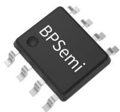
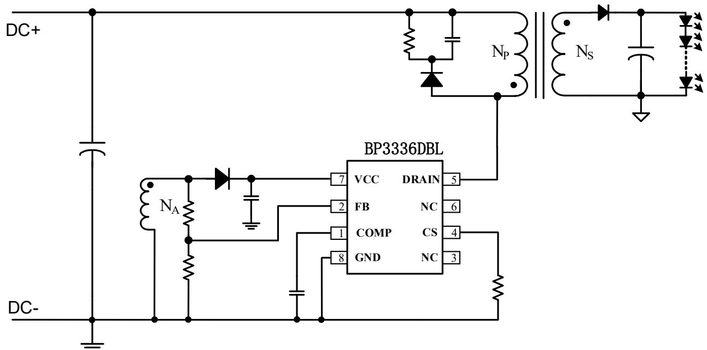
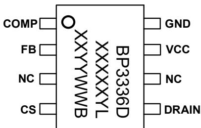
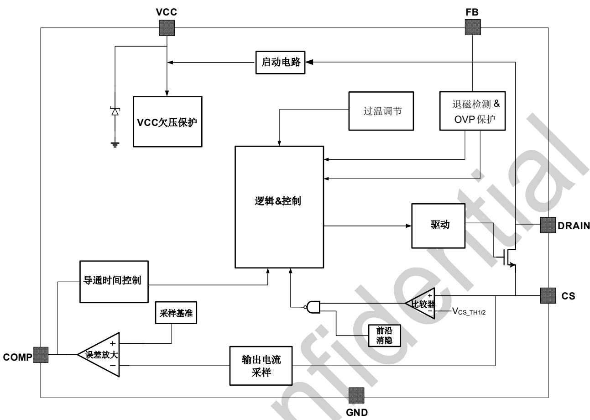
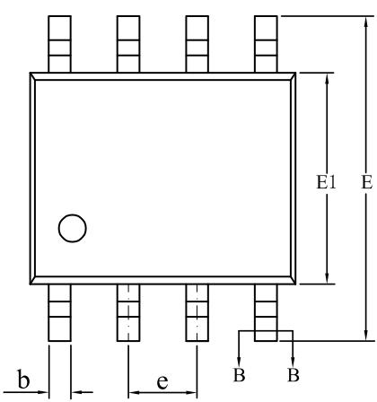
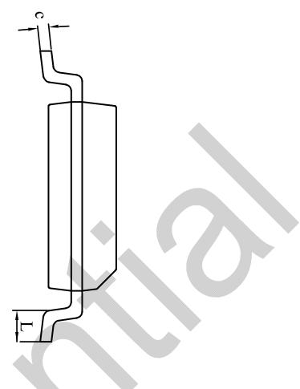
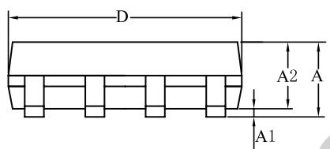
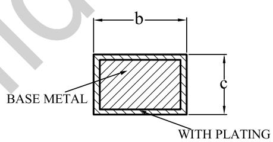

## 概述

BP3336DBL 是一款高精度的低 PF原边反馈 LED 恒流驱动芯片，适合搭配前级 APFC 升压电路，实现两级隔离无频闪应用。

BP3336DBL 内置精确的导通时间限制和过流保护功能，在输入电压下降的时候可以有效限制电感电流上升，防止电感饱和，提升系统可靠性。

BP3336DBL 工作在电感电流临界连续模式，降低开关损耗及EMI，提升变压器的利用率。

BP3336DBL 提供完善的保护功能，包括输出开路保护、输出短路保护、逐周期限流保护、过温保护等。

BP3336DBL 采用 SOP-8 封装。

  
SOP-8 封装

## 特点

 内置高压启动，启动速度快

 高精度电流参考(+/-3%)

 优秀的负载调整率

 临界导通模式，EMC 优化

 低工作电流

 VCC 欠压锁定(UVLO)

 保护功能

 逐周期限流（OCP）

 输出短路保护（SCP）

 输出开路保护（OVP）

 过温保护（OTP）

## 应用领域

 LED 筒灯

 LED 面板灯

## 典型应用

  
图 1. BP3336DBL 典型应用电路  
注：该线路及参数仅供参考，实际应用电路和参数请通过试验充分验证。

## 定购信息

<table><tr><td>定购型号</td><td>封装</td><td>包装形式</td><td>打印</td></tr><tr><td>BP3336DBL</td><td>SOP-8</td><td>卷盘4,000PCS/盘</td><td>BP3336DXXXXXYLXXYYWWB</td></tr></table>

## 管脚封装

  
BP3336DBL：产品型号  
XXXXXY: 批次号  
XXYY: 内部标示  
WW：周号  
图 2. SOP-8 管脚封装图

## 管脚描述

<table><tr><td>管脚号</td><td>管脚名称</td><td>描述</td></tr><tr><td>1</td><td>COMP</td><td>环路补偿脚</td></tr><tr><td>2</td><td>FB</td><td>环反馈信号采样脚</td></tr><tr><td>3、6</td><td>NV</td><td>无连接</td></tr><tr><td>4</td><td>CS</td><td>原边电流采样脚,采样电阻接在 CS 和 GND 之间</td></tr><tr><td>5</td><td>DRAIN</td><td>内置 MOS 管漏极</td></tr><tr><td>7</td><td>VCC</td><td>芯片供电脚</td></tr><tr><td>8</td><td>GND</td><td>芯片地</td></tr></table>

## 极限参数(注 1)

<table><tr><td>符号</td><td>参数</td><td>参数范围</td><td>单位</td></tr><tr><td> $V_{DRAIN}$ </td><td>内置 MOS 管漏极</td><td>-0.3~650</td><td>V</td></tr><tr><td> $I_{VCC\_MAX}$ </td><td>VCC 引脚最大电流</td><td>10</td><td>mA</td></tr><tr><td> $V_{CS}$ </td><td>CS 引脚电压</td><td>-0.3~6</td><td>V</td></tr><tr><td> $V_{FB}$ </td><td>FB 引脚电压</td><td>-0.3~6</td><td>V</td></tr><tr><td> $V_{COMP}$ </td><td>COMP 引脚电压</td><td>-0.3~6</td><td>V</td></tr><tr><td> $P_{DMAX}$ </td><td>功耗(注 2)</td><td>0.45</td><td>W</td></tr><tr><td> $\theta_{JA}$ </td><td>结到环境的热阻(注 3)</td><td>145</td><td>°C/W</td></tr><tr><td> $T_J$ </td><td>工作结温范围</td><td>-40~150</td><td>°C</td></tr><tr><td> $T_{STG}$ </td><td>储存温度范围</td><td>-55~150</td><td>°C</td></tr></table>

注 1：极限参数是指超出该范围，有可能导致器件永久性损坏。极限参数为器件应力的额定值，长期工作在极限参数条件可能会影响器件的可靠性。  
注 2：温度升高最大功耗一定会减小，这也是由 TJMAX, θJA,和环境温度TA所决定的。最大允许功耗为PDMAX = (TJMAX - TA)/ θJA或是极限范围给出的数字中比较低的那个值。  
注 3：1平方英寸双层 PCB板，按照JEDEC 标准测试。

电气参数(注 4)（无特别说明情况下， ${ \sf T } _ { \sf A } { = } 2 5 ^ { \circ } { \sf C } )$

<table><tr><td>符号</td><td>描述</td><td>条件</td><td>最小值</td><td>典型值</td><td>最大值</td><td>单位</td></tr><tr><td colspan="7">VCC供电</td></tr><tr><td> $V_{CC\_CLAMP}$ </td><td>VCC钳位电压</td><td> $I_{CC}=1mA$ </td><td>15</td><td>17</td><td>19</td><td>V</td></tr><tr><td> $V_{CC\_ON}$ </td><td>VCC启动阈值电压</td><td>VCC上升至IC开启</td><td>13.5</td><td>15</td><td>16.5</td><td>V</td></tr><tr><td> $V_{CC\_UVLO}$ </td><td>VCC欠压保护开启电压</td><td>VCC下降至IC关闭</td><td>6.7</td><td>7.5</td><td>8.3</td><td>V</td></tr><tr><td> $I_{QUIESCENT}$ </td><td>VCC静态工作电流</td><td>无开关动作</td><td>0.1</td><td>0.18</td><td>0.27</td><td>mA</td></tr><tr><td colspan="7">误差放大器</td></tr><tr><td> $G_m$ </td><td>误差放大器跨导</td><td></td><td></td><td>60</td><td></td><td>μA/V</td></tr><tr><td> $V_{COMP}$ </td><td>COMP线性工作范围</td><td></td><td>1.5</td><td></td><td>4.5</td><td>V</td></tr><tr><td> $V_{REF}$ </td><td>内部基准电压</td><td></td><td>194</td><td>200</td><td>206</td><td>mV</td></tr><tr><td colspan="7">控制功能</td></tr><tr><td> $T_{ON\_MAX}$ </td><td>功率管最大导通时间</td><td></td><td>7</td><td>9.5</td><td>12</td><td>μs</td></tr><tr><td> $T_{OFF\_MIN}$ </td><td>功率管最小关断时间</td><td></td><td></td><td>4.5</td><td></td><td>μs</td></tr><tr><td> $T_{OFF\_MAX}$ </td><td>功率管最大关断时间</td><td></td><td></td><td>130</td><td></td><td>μs</td></tr><tr><td colspan="7">电流采样</td></tr><tr><td> $V_{CS\_TH1}$ </td><td>逐周期限流阈值1</td><td>FB≤0.4V</td><td></td><td>200</td><td></td><td>mV</td></tr><tr><td> $V_{CS\_TH2}$ </td><td>逐周期限流阈值2</td><td>FB&gt;0.4V</td><td>250</td><td>300</td><td>350</td><td>mV</td></tr><tr><td> $T_{DELAY}$ </td><td>芯片关断延迟时间</td><td></td><td></td><td>200</td><td></td><td>ns</td></tr><tr><td> $T_{LEB}$ </td><td>前沿消隐时间</td><td></td><td></td><td>300</td><td></td><td>ns</td></tr><tr><td colspan="7">保护功能</td></tr><tr><td> $V_{FB\_FALL}$ </td><td>FB下降阈值电压</td><td>FB下降</td><td></td><td>0.1</td><td></td><td>V</td></tr><tr><td> $V_{FB\_HYS}$ </td><td>FB迟滞电压</td><td>FB上升</td><td></td><td>0.1</td><td></td><td>V</td></tr><tr><td> $V_{FB\_OVP}$ </td><td>FB过压保护阈值</td><td></td><td>1.4</td><td>1.5</td><td>1.6</td><td>V</td></tr><tr><td colspan="7">功率管</td></tr><tr><td> $R_{DS\_ON}$ </td><td>功率管导通阻抗</td><td> $I_D=0.5A, V_{GS}=10V$ </td><td></td><td>1.7</td><td>2.2</td><td>Ω</td></tr><tr><td> $BV_{DSS}$ </td><td>功率管击穿电压</td><td> $I_D=250μA, V_{GS}=0V$ </td><td>650</td><td></td><td></td><td>V</td></tr><tr><td colspan="7">过热调节部分</td></tr><tr><td> $T_{OTP}$ </td><td>过温保护阈值</td><td></td><td></td><td>150</td><td></td><td>°C</td></tr></table>

## 内部结构框图

  
图 3. BP3336DBL 内部框图

## 功能描述

BP3336DBL是一款支持高效率设计的低PF原边反馈LED恒流驱动器。BP3336DBL 内置 650V MOSFET，适合搭配前级APFC 升压电路，实现两级隔离无频闪应用。

## 启动

系统上电以后，母线电压通过芯片 DRAIN 端对 VCC 电容充电，当 VCC 电压达到芯片开启阈值时，芯片内部控制电路开始 工 作 ， COMP 电 压 被 快 速 上 拉 到 1.7V 左 右 。 然 后BP3336DBL 开始输出脉冲信号，系统刚开始工作在 7kHz。当 FB 引脚检测到正向电平大于 0.4V 以后，BP3336DBL 转为闭环工作。

## 恒流控制，输出电流设置

BP3336DBL 采用了特有的电流采样机制，工作于原边反馈模式，无需次级反馈电路，即可实现高精度输出恒流控制。LED 输出电流计算方法：

$$
I _ {o u t} \approx \frac {V _ {R E F}}{2 \times R _ {c s}} \times \frac {N _ {P}}{N _ {S}}
$$

其中：

$V _ { R E F }$ 是内部基准电压

$N _ { P }$ 是变压器主级绕组的匝数

${ \sf N } _ { \sf S }$ 是变压器次级绕组的匝数

$\mathsf { R c s }$ 是电流采样电阻的值

## 反馈网络

BP3336DBL 通过 FB 引脚检测输出电流过零的状态，FB 的下降阈值电压设置在 0.1V，迟滞电压为 0.1V。FB 引脚也可以用来探测输出过压保护（OVP），阈值为 1.5V。FB 的上下分压电阻比例可以设置为：

$$
\frac {R _ {F B L}}{R _ {F B L} + R _ {F B H}} \approx \frac {1 . 5 V}{V _ {O V P}} \times \frac {N _ {S}}{N _ {A}}
$$

## 其中：

RFBL是反馈网络的下分压电阻

RFBH是反馈网络的上分压电阻

VOVP是输出电压过压保护设定值

N 是变压器次级绕组的匝数

N 是变压器辅助绕组的匝数

## 过温调节功能

BP3336DBL 具有过热调节功能，在驱动电源过热时逐渐减小输出电流，从而控制输出功率和温升，使电源温度保持在设定值，以提高系统的可靠性。芯片内部设定过热调节温度点约为 150°C。

## 保护功能

BP3336DBL 内置多重保护功能，保证了系统可靠性。

当 LED 开路时，输出电压逐渐上升，FB 检测到的电压也会跟随上升。当 FB检测到的电压升高到 1.5V OVP 阈值时，会触发保护逻辑并停止开关工作，芯片进入故障保护状态。

当 LED 短路时，FB 检测不到退磁信号，系统工作在 7 kHz低频。若经过 100 个连续的开关周期后仍未解除输出短路故障状态，芯片进入故障保护状态。

系统进入故障保护状态后，芯片以约 42μA 左右的电流对VCC电压放电，当VCC到达欠压保护阈值时，系统将重启。同时系统不断的检测系统状态，如果故障解除，系统会重新开始正常工作。

当输出短路或者变压器饱和时，CS峰值电压将会比较高。当CS 电压上升到内部限制值时，该开关周期马上停止。此逐周期限流功能可以保护功率 MOS 管、变压器和输出续流二极管。

## PCB Layout 指南

在设计 BP3336DBL 应用 PCB 板时，需要注意以下事项：

1) VCC 的旁路电容需要紧靠芯片VCC 和GND 引脚。

2) 电流采样电阻的功率地线尽可能粗，且要离芯片的地尽量近， 保证电流采样的准确性，否则可能会影响输出电流的调整率。线电压补偿用的电阻必须尽量靠近芯片，信号地需要单独连接到芯片的地引脚。

) 减小大电流环路的面积，如变压器主级、功率管及吸收网络的环路面积，以及变压器次级、次级二极管、输出电容的环路面积，以减小 EMI 辐射。

4 接到 FB 的分压电阻必须靠近 FB 引脚，且节点要远离变压器的动点，并且接滤波电容，否则系统噪声容易误触发 FB OVP保护功能。

## 封装信息

  
SOP-8 封装外形尺寸

  
WITH PLATING

SECTION B-B  

<table><tr><td rowspan="2">SYMBOL</td><td colspan="3">MILLIMETER</td></tr><tr><td>MIN</td><td>NOM</td><td>MAX</td></tr><tr><td>A</td><td>1.30</td><td>—</td><td>1.80</td></tr><tr><td>A1</td><td>0.05</td><td>—</td><td>0.25</td></tr><tr><td>A2</td><td>1.25</td><td>1.40</td><td>1.65</td></tr><tr><td>b</td><td>0.33</td><td>—</td><td>0.51</td></tr><tr><td>c</td><td>0.17</td><td>—</td><td>0.25</td></tr><tr><td>D</td><td>4.70</td><td>4.90</td><td>5.10</td></tr><tr><td>E</td><td>5.80</td><td>6.00</td><td>6.30</td></tr><tr><td>E1</td><td>3.70</td><td>3.90</td><td>4.10</td></tr><tr><td>e</td><td colspan="3">1.27BSC</td></tr><tr><td>L</td><td>0.40</td><td>—</td><td>1.00</td></tr></table>

## 版本信息

<table><tr><td>版本</td><td>日期</td><td>记录</td></tr><tr><td>Rev.1.0</td><td>2026/01</td><td>首次发行</td></tr><tr><td></td><td></td><td></td></tr><tr><td></td><td></td><td></td></tr><tr><td></td><td></td><td></td></tr><tr><td></td><td></td><td></td></tr></table>

## 免责声明

晶丰明源尽力确保本产品规格书内容的准确和可靠，但是保留在没有通知的情况下，修改规格书内容的权利。

本产品规格书未包含任何针对晶丰明源或第三方所有的知识产权的授权。针对本产品规格书所记载的信息，晶丰明源不做任何明示或暗示的保证，包括但不限于对规格书内容的准确性、商业上的适销性、特定目的的适用性或者不侵犯晶丰明源或任何第三人知识产权做任何明示或暗示保证，晶丰明源也不就因本规格书本身及其使用有关的偶然或必然损失承担任何责任。

## 电子器件报废说明

该产品在生命周期结束后，由客户按照一般电子产品的报废流程进行处理。