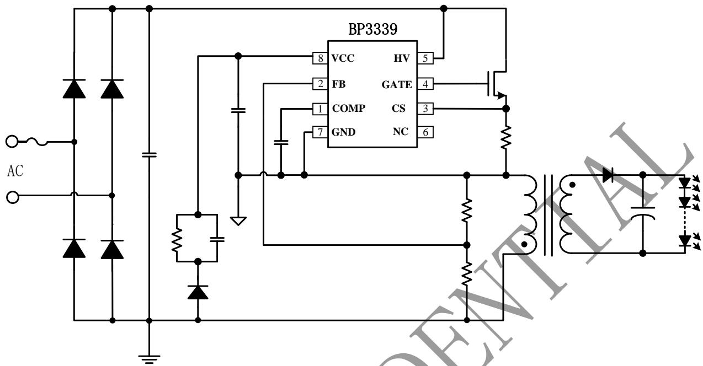
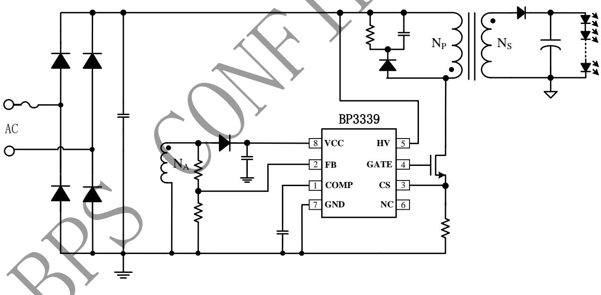
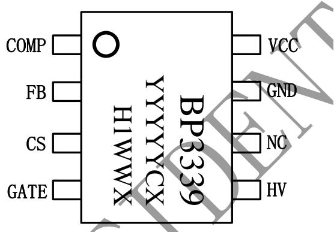
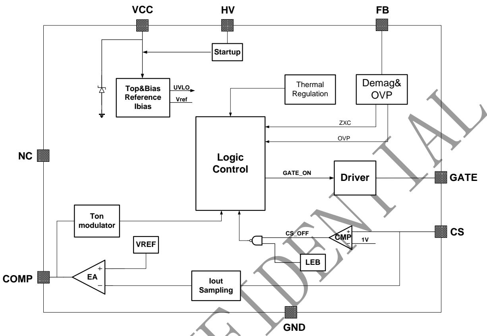
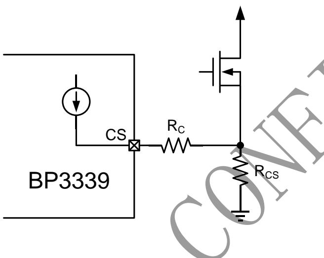
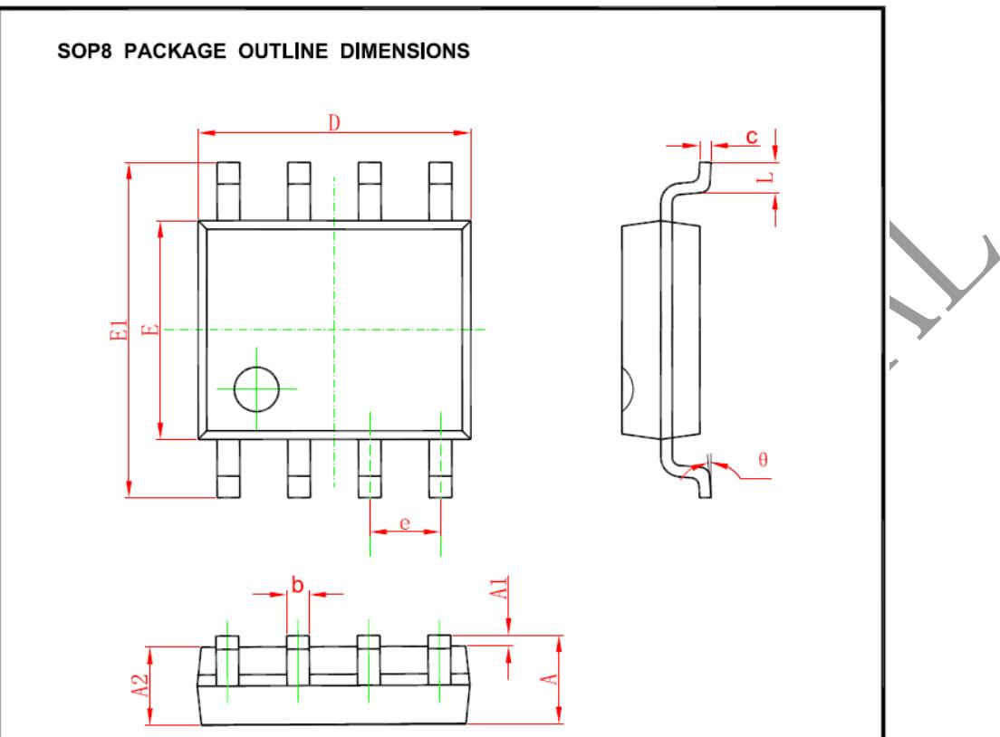

## 晶丰明源半导体

## 概述

BP3339 是一款单级 APFC 的高精度原边反馈LED 恒流控制芯片，适用于 90Vac-277Vac 全范围输入电压。

BP3339 芯片采用固定导通时间的控制机制，能够实现功率因数校正的高 PF。内置 THD 优化模块进一步降低了 THD。开关工作在临界导通模式，降低开关损耗及 EMI，提升变压器的利用率。

BP3339 采用 SOP-8 封装。

## 特点

◼ 输入 90-277Vac

◼ 高 PF 低 THD(PF>0.9，THD<15%)

◼ 支持双绕组Flyback拓扑，无需辅助绕组

◼ 内置高压启动，启动时间<500mS

◼ 高精度电流参考(+/-3%)

◼ 优异的线性、负载调整率

◼ 临界导通模式

◼ 低工作电流

◼ VCC 欠压锁定

◼ 逐周期限流

◼ 输出开路/短路保护

◼ 过温降电流

◼ 支持 SOP-8 封装

## 应用

◼ LED 内置/外置电源

◼ 高性能灯具

## 典型应用

  
图 1 BP3339 浮地双绕组 Flyback 典型应用图

  
图 2 BP3339 实地三绕组 Flyback 典型应用图

## 定购信息

<table><tr><td>定购型号</td><td>封装</td><td>温度范围</td><td>包装形式</td><td>打印</td></tr><tr><td>BP3339</td><td>SOP-8</td><td>-40 °C到105 °C</td><td>4000pcs/盘</td><td>BP3339YYYYYCXH1WWX</td></tr></table>

## 管脚封装

YYYYY：Lot NumberC：供应商WW：周号X：补位

图 3 管脚封装图

## 管脚描述

<table><tr><td>管脚号</td><td>管脚名称</td><td>描述</td></tr><tr><td>1</td><td>COMP</td><td>环路补偿脚</td></tr><tr><td>2</td><td>FB</td><td>反馈信号采样脚</td></tr><tr><td>3</td><td>CS</td><td>原边电流采样脚,接采样电阻到地</td></tr><tr><td>4</td><td>GATE</td><td>驱动信号输出脚</td></tr><tr><td>5</td><td>HV</td><td>高压启动脚</td></tr><tr><td>6</td><td>NC</td><td>悬空</td></tr><tr><td>7</td><td>GND</td><td>芯片地</td></tr><tr><td>8</td><td>VCC</td><td>芯片供电脚</td></tr></table>

## 极限参数(注 1)

<table><tr><td>符号</td><td>参数</td><td>参数范围</td><td>单位</td></tr><tr><td> $I_{VCC\_MAX}$ </td><td>VCC引脚最大电流</td><td>10</td><td>mA</td></tr><tr><td> $V_{HV}$ </td><td>HV脚电压范围</td><td>-0.3~600</td><td>V</td></tr><tr><td> $V_{GATE}$ </td><td>GATE引脚电压范围</td><td>-0.3~20</td><td>V</td></tr><tr><td> $V_{IO}$ </td><td>CS/FB/COMP/DIM等引脚电压范围</td><td>-0.3~6</td><td>V</td></tr><tr><td> $P_{DMAX}$ </td><td>功耗(注2)</td><td>0.45</td><td>W</td></tr><tr><td> $\theta_{JA}$ </td><td>PN结到环境的热阻</td><td>150</td><td>°C/W</td></tr><tr><td> $T_J$ </td><td>工作结温范围</td><td>-40 to 150</td><td>°C</td></tr><tr><td> $T_{STG}$ </td><td>储存温度范围</td><td>-55 to 150</td><td>°C</td></tr></table>

注 1：最大极限值是指超出该工作范围，芯片有可能损坏。推荐工作范围是指在该范围内，器件功能正常，但并不完全保证满足个别性能指标。电气参数定义了器件在工作范围内并且在保证特定性能指标的测试条件下的直流和交流电参数规范。对于未给定上下限值的参数，该规范不予保证其精度，但其典型值合理反映了器件性能。

注 2：温度升高最大功耗一定会减小，这也是由 TJMAX,θJA,和环境温度 TA所决定的。最大允许功耗为 PDMAX= (TJMAX-TA)/θJA或是极限范围给出的数字中比较低的那个值。

规格参数(注 4,5)：

<table><tr><td>符号</td><td>描述</td><td>条件</td><td>最小值</td><td>典型值</td><td>最大值</td><td>单位</td></tr><tr><td colspan="7">电源电压(VCC)</td></tr><tr><td> $V_{CC\_CLAMP}$ </td><td> $V_{CC}$ 钳位电压</td><td> $I_{VCC}=1mA$ </td><td></td><td>17</td><td>19</td><td>V</td></tr><tr><td> $V_{CC\_ON}$ </td><td> $V_{CC}$ 启动电压</td><td> $V_{CC}$ 上升</td><td>13.5</td><td>15</td><td>16.5</td><td>V</td></tr><tr><td> $V_{CC\_UVLO}$ </td><td> $V_{CC}$ 欠压保护阈值</td><td> $V_{CC}$ 下降</td><td></td><td>7.5</td><td></td><td>V</td></tr><tr><td> $I_{QUIESCENT}$ </td><td> $V_{CC}$ 静态工作电流</td><td>无开关动作</td><td></td><td></td><td>0.27</td><td>mA</td></tr><tr><td colspan="7">误差放大器(COMP)</td></tr><tr><td> $G_m$ </td><td>误差放大器跨导</td><td></td><td></td><td>60</td><td></td><td>uA/V</td></tr><tr><td> $V_{COMP}$ </td><td>COMP线性工作范围</td><td></td><td>1.5</td><td></td><td>4.5</td><td>V</td></tr><tr><td> $V_{REF}$ </td><td>内部基准电压</td><td></td><td>194</td><td>200</td><td>206</td><td>mV</td></tr><tr><td colspan="7">电流采样(CS)</td></tr><tr><td> $V_{CS\_TH}$ </td><td>逐周期限流阈值</td><td></td><td></td><td>1</td><td></td><td>V</td></tr><tr><td> $T_{LEB}$ </td><td>前沿消隐时间</td><td></td><td></td><td>300</td><td></td><td>ns</td></tr><tr><td> $T_{DELAY}$ </td><td>芯片关断延迟</td><td></td><td></td><td>200</td><td></td><td>ns</td></tr><tr><td colspan="7">零电流检测及输出开路保护(FB)</td></tr><tr><td> $V_{FB\_FALL}$ </td><td>FB下降阈值电压</td><td>FB下降</td><td></td><td>0.1</td><td></td><td>V</td></tr><tr><td> $V_{FB\_HYS}$ </td><td>FB迟滞电压</td><td>FB上升</td><td></td><td>0.1</td><td></td><td>V</td></tr><tr><td> $V_{FB\_OVP}$ </td><td>FB过压保护阈值</td><td></td><td>1.4</td><td>1.5</td><td>1.6</td><td>V</td></tr><tr><td colspan="7">内部时间控制</td></tr><tr><td> $T_{ON\_MAX}$ </td><td>最大开通时间</td><td></td><td></td><td>20</td><td></td><td>us</td></tr><tr><td> $T_{OFF\_MIN}$ </td><td>最小关断时间</td><td></td><td></td><td>4.5</td><td></td><td>us</td></tr><tr><td> $T_{OFF\_MAX}$ </td><td>最大关断时间</td><td></td><td></td><td>130</td><td></td><td>us</td></tr><tr><td colspan="7">栅极驱动(GATE)</td></tr><tr><td> $I_{SOURCE}$ </td><td>最大驱动上拉电流</td><td></td><td></td><td>200</td><td></td><td>mA</td></tr><tr><td> $I_{SINK}$ </td><td>最大驱动下拉电流</td><td></td><td></td><td>600</td><td></td><td>mA</td></tr><tr><td colspan="7">过热调节部分</td></tr><tr><td> $T_{REG}$ </td><td>过热调节温度</td><td></td><td></td><td>150</td><td></td><td>°C</td></tr></table>

注 4：典型参数值为 25˚C下测得的参数标准。  
注 5：规格书的最小、最大规范范围

## 内部结构框图

  
图 4 BP3339 内部框图

## 应用信息

BP3339 是一款单级APFC 的高精度原边反馈LED 恒流控制芯片，适用于 90Vac-277Vac 全范围输入电压，支持隔离/非隔离Buck-Boost电路。

## 1 启动

系统上电以后，母线电压通过芯片内部JFET对VCC电容充电，当 VCC电压达到芯片开启阈值时，芯片内部控制电路开始工作，COMP 电压被快速上拉到 1.7V左右。然后BP3339开始输出脉冲信号，系统刚开始工作在 7kHz。当 FB引脚检测到正向电平大于 0.4V 以后，BP3339转为闭环工作，内部跨导放大器对COMP电容进行缓慢充电，实现软启动。

## 2 恒流控制，输出电流设置

BP3339采用了专有的电流采样机制，工作于原边反馈模式，无需次级反馈电路，即可实现高精度

输出恒流控制。

LED 输出电流计算方法：

$$
I _ {o u t} \approx \frac {V _ {R E F}}{2 \times R _ {c s}} \times \frac {N _ {P}}{N _ {S}}
$$

其中，

V 是内部基准电压 Np 是变压器主级绕组的匝数 Ns 是变压器次级绕组的匝数 Rcs 是电流采样电阻的值

## 3 反馈网络

BP3339 通过 FB引脚检测输出电流过零的状态，FB的下降阈值电压设置在 0.1V，迟滞电压为 0.1V。FB 引脚还用来探测输入电压，并根据输入电压大小延长开关的开通时间。

FB 引脚也可以用来探测输出过压保护（OVP），阈值为 1.5V。FB的上下分压电阻比例可以设置为：

$$
\frac {R _ {F B L}}{R _ {F B L} + R _ {F B H}} \approx \frac {1 . 5 V}{V _ {O V P \_ F B}} \times \frac {N _ {S}}{N _ {A}}
$$

其中，

$\mathrm { R } _ { \mathrm { F B L } }$ 是反馈网络的下分压电阻

$\mathrm { R } _ { \mathrm { F B H } }$ 是反馈网络的上分压电阻

$\mathrm { V _ { 0 V P \_ F B } }$ 是输出电压过压保护设定点

Ns 是变压器次级绕组的匝数

NA 是变压器辅助绕组的匝数

## 4 线电压补偿

BP3339 内置线电压补偿功能，对于宽电压输入的应用，可以通过CS引脚的电阻R 进行线电压补偿。

## 5 过温调节功能

BP3339具有过热调节功能，在驱动电源过热时逐渐减小输出电流，从而控制输出功率和温升，使电源温度保持在设定值，以提高系统的可靠性。芯片内部设定过热调节温度点为 150℃。

## 6 保护功能

BP3339内置多重保护功能，保证了系统可靠性。

当 LED 开路时，输出电压逐渐上升，FB检测到的电压也会跟随上升。当 FB检测到的电压升高到1.5V OVP 阈值时，会触发保护逻辑并停止开关工作，芯片进入故障保护状态。

当 LED 短路时，FB检测不到退磁信号，系统工作在 7 kHz 低频。若经过100个连续的开关周期后仍未解除输出短路故障状态，芯片进入故障保护状态。

系统进入故障保护状态后，芯片以约42uA左右的电流对 VCC电压放电，当 VCC 到达欠压保护阈值时，系统将重启。同时系统不断的检测系统状态，如果故障解除，系统会重新开始正常工作。

当输出短路或者变压器饱和时，CS 峰值电压将会比较高。当 CS 电压上升到内部限制值（1V）时，该开关周期马上停止。此逐周期限流功能可以保护功率 MOS 管、变压器和输出续流二极管。

## 7 PCB 设计

在设计 BP3339 PCB 板时，需要注意以下事项：

## 旁路电容

VCC 的旁路电容需要紧靠芯片 VCC 和 GND 引脚。

## 地线

电流采样电阻的功率地线尽可能粗，且要离芯片的地(Pin4)尽量近，以保证电流采样的准确性，否则可能会影响输出电流的调整率。线电压补偿用的电阻必须尽量靠近芯片CS引脚。另外，信号地需要单独连接到芯片的地引脚。

## 功率环路的面积

减小大电流环路的面积，如变压器主级、功率管及吸收网络的环路面积，以及变压器次级、 次级二极管、输出电容的环路面积，以减小 EMI 辐射。

## FB 引脚

接到 FB 的分压电阻必须靠近FB 引脚，且节点要远离变压器的动点，否则系统噪声容易误触发 FBOVP 保护功能。

## 封装信息

<table><tr><td rowspan="2">Symbol</td><td colspan="2">Dimensions In Millimeters</td><td colspan="2">Dimensions In Inches</td></tr><tr><td>Min</td><td>Max</td><td>Min</td><td>Max</td></tr><tr><td>A</td><td>1.350</td><td>1.750</td><td>0.053</td><td>0.069</td></tr><tr><td>A1</td><td>0.100</td><td>0.250</td><td>0.004</td><td>0.010</td></tr><tr><td>A2</td><td>1.350</td><td>1.550</td><td>0.053</td><td>0.061</td></tr><tr><td>b</td><td>0.330</td><td>0.510</td><td>0.013</td><td>0.020</td></tr><tr><td>c</td><td>0.170</td><td>0.250</td><td>0.006</td><td>0.010</td></tr><tr><td>D</td><td>4.700</td><td>5.100</td><td>0.185</td><td>0.200</td></tr><tr><td>E</td><td>3.800</td><td>4.000</td><td>0.150</td><td>0.157</td></tr><tr><td>E1</td><td>5.800</td><td>6.200</td><td>0.228</td><td>0.244</td></tr><tr><td>e</td><td colspan="2">1.270 (BSC)</td><td colspan="2">0.050 (BSC)</td></tr><tr><td>L</td><td>0.400</td><td>1.270</td><td>0.016</td><td>0.050</td></tr><tr><td>θ</td><td> $0^{\circ}$ </td><td> $8^{\circ}$ </td><td> $0^{\circ}$ </td><td> $8^{\circ}$ </td></tr></table>

## 重要声明

晶丰明源尽力确保本产品规格书内容的准确和可靠，但是保留在没有通知的情况下，修改规格书内容的权利。

本产品规格书未包含任何针对晶丰明源或第三方所有的知识产权的授权。针对本产品规格书所记载的信息，晶丰明源不做任何明示或暗示的保证，包括但不限于对规格书内容的准确性、商业上的适销性，特定目的的适用性或者不侵犯晶丰明源或任何第三人知识产权做任何明示或暗示保证，晶丰明源也不就因本规格书本身及其使用有关的偶然或必然损失承担任何责任。