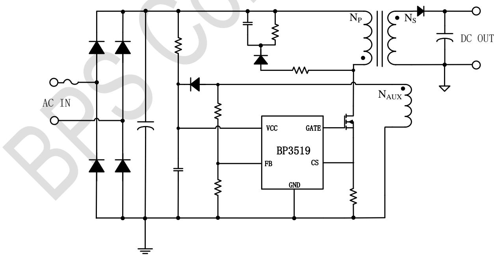
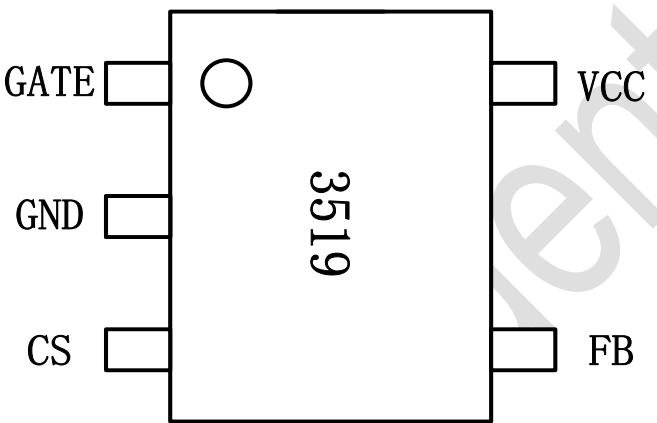
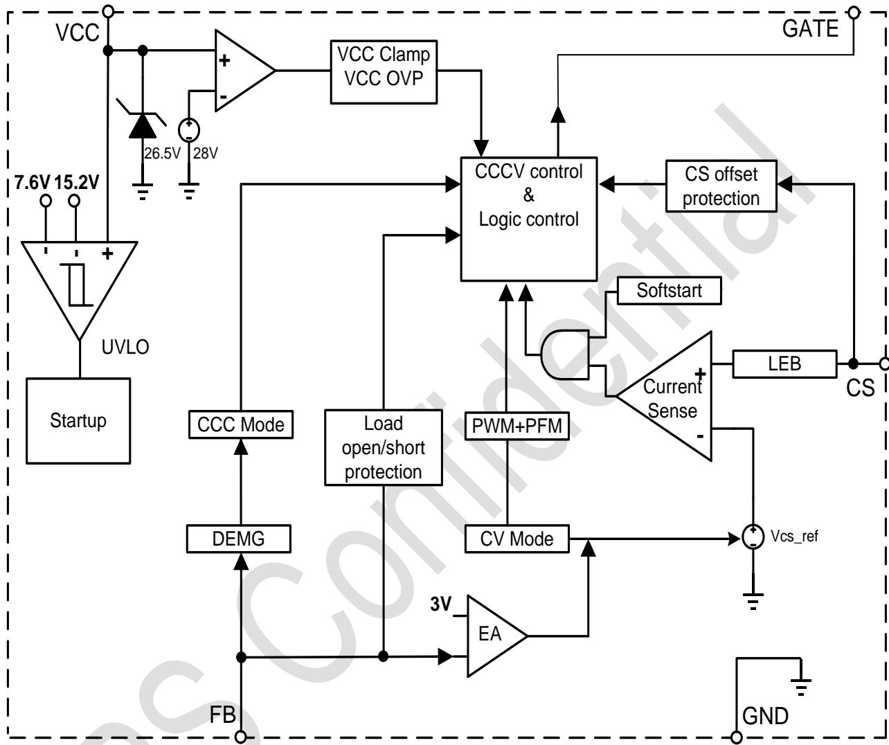
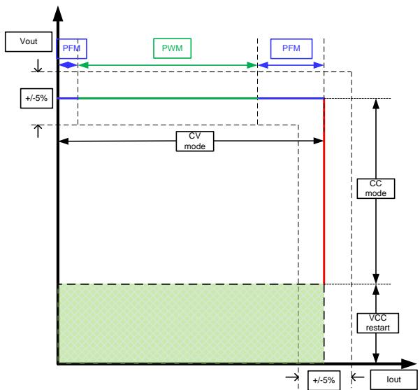
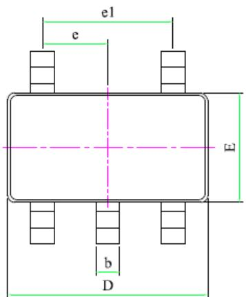
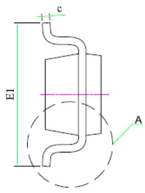
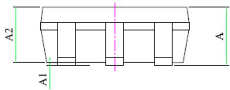
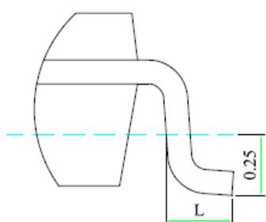

## Description

BP3519 is PSR isolated CCCV driver IC. The device operates in discontinued conduction mode and is suitable for 85Vac\~265Vac universal input offline LED lighting. The BP3519 can perform in high accurate CCCV without external compensation capacitor, benefit to save the BOM size and cost.

The BP3519 supports multiple control mode of PWM and PFM, which contribute to very low standby power, high efficiency and minimum no load noise.

The BP3519 offers rich protection functions to improve the system reliability, including cycle by cycle peak current control, load open/short protection, VCC under/over voltage protection, and over temperature protection.

## Features

■ PSR Isolated CCCV control

■ PWM/PFM multiple mode control

■ Standby power <100mW

■ ±5% Output Accuracy

■ Internal soft startup

\- Load open protection

\- Load short protection

■ VCC under voltage protection

■ Over temperature protection

■ Cycle by cycle peak current control

■ Available in SOT23-5L package

## Applications

■ Chargers

■ Standby/auxiliary power

■ LED driving model

## Typical Application

  
Fig1 Typical application circuit for BP3519

## Ordering Information

<table><tr><td>Part Number</td><td>Package</td><td>Operating Temperature</td><td>Packing Method</td><td>Marking</td></tr><tr><td>BP3519</td><td>SOT23-5L</td><td>-40°C to 105°C</td><td>Tape3,000 Piece/Reel</td><td>3519</td></tr></table>

## Pin Configuration and Marking Information

Fig2 Pin configuration

Pin Definition

<table><tr><td>Pin No.</td><td>Name</td><td>Description</td></tr><tr><td>1</td><td>GATE</td><td>Gate Driver Pin. Connect it to the gate of external power MOSFET</td></tr><tr><td>2</td><td>GND</td><td>Ground</td></tr><tr><td>3</td><td>CS</td><td>Current Sense Pin. Connect a sense resistor between this pin and GND pin.</td></tr><tr><td>4</td><td>FB</td><td>Feedback pin</td></tr><tr><td>5</td><td>VCC</td><td>Power Supply Pin</td></tr></table>

## Absolute Maximum Ratings (note1)

<table><tr><td>Symbol</td><td>Parameters</td><td>Range</td><td>Units</td></tr><tr><td> $V_{CC}$ </td><td>VCC pin voltage</td><td>-0.3~30</td><td>V</td></tr><tr><td> $I_{CC\_MAX}$ </td><td>VCC pin maximum sink current</td><td>10</td><td>mA</td></tr><tr><td> $V_{FB}$ </td><td>Feedback Voltage detection Pin</td><td>-0.3~6</td><td>V</td></tr><tr><td> $V_{CS}$ </td><td>Voltage on Current sense pin</td><td>-0.3~6</td><td>V</td></tr><tr><td> $V_{GATE}$ </td><td>Gate driver of external power MOSFET</td><td>-0.3~30</td><td>V</td></tr><tr><td> $P_{DMAX}$ </td><td>Power dissipation (note2)</td><td>0.3</td><td>W</td></tr><tr><td> $\theta_{JA}$ </td><td>Thermal resistance (Junction to Ambient)</td><td>240</td><td>°C/W</td></tr><tr><td> $T_J$ </td><td>Operating junction temperature</td><td>-40 to 150</td><td>°C</td></tr><tr><td> $T_{STG}$ </td><td>Storage temperature range</td><td>-55 to 150</td><td>°C</td></tr><tr><td></td><td>ESD (note3)</td><td>2</td><td>kV</td></tr></table>

Note 1: Stresses beyond those listed under “absolute maximum ratings” may cause permanent damage to the device. Under “recommended operating conditions” the device operation is assured, but some particular parameter may not be achieved. The electrical characteristics table defines the operation range of the device, the electrical characteristics is assured on DC and AC voltage by test program. For the parameters without minimum and maximum value in the EC table, the typical value defines the operation range, the accuracy is not guaranteed by spec.

Note 2: The maximum power dissipation decrease if temperature rise, it is decided by $T_{JMAX}$ , $\theta_{JA}$ , and environment temperature ( $T_{A}$ ). The maximum power dissipation is the lower one between $P_{DMAX} = (T_{JMAX} - T_{A}) / \theta_{JA}$ and the number listed in the maximum table.

Note 3: Human Body mode, 100pF capacitor discharge on 1.5kΩ resistor.

Recommended Operation Conditions

<table><tr><td>Symbol</td><td>Parameter</td><td>Range</td><td>Unit</td></tr><tr><td> $V_{CC}$ </td><td>Supply voltage</td><td>10~25</td><td>V</td></tr><tr><td> $F_{OSC\_MAX}$ </td><td>Max. operation frequency</td><td>65k</td><td>Hz</td></tr></table>

Electrical Characteristics (Notes 4, 5) (Unless otherwise specified, $V_{CC} = 16V$ and $T_A = 25^{\circ}C$ )

<table><tr><td>Symbol</td><td>Parameter</td><td>Conditions</td><td>Min</td><td>Typ</td><td>Max</td><td>Units</td></tr><tr><td colspan="7">Supply Voltage Section</td></tr><tr><td> $V_{CC\_CLAMP}$ </td><td> $V_{CC}$  Clamp Voltage</td><td>5mA</td><td></td><td>27</td><td></td><td>V</td></tr><tr><td> $V_{CC\_OVP}$ </td><td> $V_{CC}$  OVP Threshold</td><td></td><td></td><td>29</td><td></td><td>V</td></tr><tr><td> $V_{CC\_ON}$ </td><td> $V_{CC}$  Turn On Threshold</td><td> $V_{CC}$  Rising</td><td></td><td>15.3</td><td></td><td>V</td></tr><tr><td> $V_{CC\_UVLO}$ </td><td> $V_{CC}$  Turn Off Threshold</td><td> $V_{CC}$  Falling</td><td></td><td>7.6</td><td></td><td>V</td></tr><tr><td> $I_{ST}$ </td><td> $V_{CC}$  Startup Current</td><td> $V_{CC}=V_{CC-ON}-1V$ </td><td></td><td>12</td><td></td><td>uA</td></tr><tr><td> $I_{OP}$ </td><td> $V_{CC}$  Operating Current</td><td> $V_{FB}=3V,V_{CS}=0$ </td><td></td><td>240</td><td></td><td>uA</td></tr><tr><td colspan="7">Current Sense Section</td></tr><tr><td> $V_{CS\_TH}$ </td><td>CS Peak Threshold</td><td></td><td>582</td><td>600</td><td>618</td><td>mV</td></tr><tr><td> $T_{LEB}$ </td><td>Leading Edge Blanking</td><td></td><td></td><td>500</td><td></td><td>ns</td></tr><tr><td colspan="7">Feedback Section</td></tr><tr><td> $V_{FB\_EA\_REF}$ </td><td>Internal EA Reference Voltage</td><td></td><td>2.91</td><td>3</td><td>3.09</td><td>V</td></tr><tr><td> $V_{FB\_OVP}$ </td><td>FB OVP Threshold</td><td></td><td></td><td>4</td><td></td><td>V</td></tr><tr><td> $V_{FB\_DEM}$ </td><td>FB ZCD Threshold</td><td></td><td></td><td>0.1</td><td></td><td>V</td></tr><tr><td> $V_{FB\_SHORT}$ </td><td>Output short protection Threshold</td><td></td><td></td><td>0.58</td><td></td><td>V</td></tr><tr><td> $F_{OSC\_SHORT}$ </td><td>Clamp frequency for output short</td><td></td><td></td><td>20</td><td></td><td>kHz</td></tr><tr><td> $T_{SAMPLE\_BIG}$ </td><td>Samples time</td><td> $V_{CS\_TH}=600mV$ </td><td></td><td>5.8</td><td></td><td>us</td></tr><tr><td> $T_{OFF\_MAX}$ </td><td>Max. OFF time</td><td></td><td></td><td>1</td><td></td><td>ms</td></tr><tr><td> $T_{DEM}/T_{SW}$ </td><td>Time ratio of CC mode</td><td></td><td></td><td>0.5</td><td></td><td></td></tr><tr><td colspan="7">Driver Section</td></tr><tr><td> $V_{GATE-CLAMP}$ </td><td>Gate clamping voltage</td><td></td><td></td><td>13</td><td></td><td>V</td></tr><tr><td> $I_{SOURCE\_MAX}$ </td><td>GATE pin Maximum Sourcing Current</td><td></td><td></td><td>60</td><td></td><td>mA</td></tr><tr><td> $I_{SINK\_MAX}$ </td><td>GATE pin Maximum Sinking Current</td><td></td><td></td><td>300</td><td></td><td>mA</td></tr><tr><td colspan="7">Thermal Regulation Section</td></tr><tr><td> $T_{SD}$ </td><td>Thermal shunt down</td><td></td><td></td><td>150</td><td></td><td>°C</td></tr><tr><td> $T_{SD\_HYS}$ </td><td>Hysteretic temperature for thermal recover</td><td></td><td></td><td>30</td><td></td><td>°C</td></tr></table>

Note 4: production testing of the chip is performed at $25^{\circ}$ C.

Note 5: the maximum and minimum parameters specified are guaranteed by test, the typical value are guaranteed by design, characterization and statistical analysis

Internal Block Diagram

  
Fig3 BP3519 Internal Block Diagram

## Application Information

BP3519 is primary side regulation isolated CCCV driver IC, operating in DCM mode. BP3519 can work in multiple control mode of PFM and PWM providing high accurate constant current control and constant voltage control. There is very few external components required in bill of material. BP3519 provides the popular solutions for chargers, standby power, LED drivers and any CCCV request.

## Start Up

After system powered on, the capacitor on VCC pin is charged up by the startup resistor. When the VCC pin voltage reaches the turn on threshold, the internal circuits start working. Once the start level has been reached the start-up current source is switched off. During switching operation it is supplied by the regulated source from auxiliary winding.

Soft start is also implemented during startup within 1ms timeslot, and activated to increase the primary side peak current in steps. The soft start is available in every restart cycle.

## Constant Current Control

The peak current of primary side inductor is sensed cycle by cycle. The CS pin monitors the peak level and inputs into the internal comparator with converted voltage of the switching status; once the voltage above the reference threshold, the switching would be stopped.

The peak current for full load is defined as:

$$
I _ {\mathrm {P\_PK}} = \frac {6 0 0}{R _ {C S}} (m A)
$$

The peak detection has a fixed 500ns lead edge blanking time on CS.

The LED current is defined as:

Where,

$$
I _ {O U T} = \frac {I _ {\mathrm{P} \_ \mathrm{PK}}}{4} \times \frac {N _ {P}}{N _ {S}}
$$

Np is the primary side windings;

Ns is the secondary side windings.

$I_{P\_PK}$ is the primary side peak current.

## Constant Voltage Control

BP3519 senses the reflection voltage from auxiliary winding by divider resistor on FB pin. The constant output voltage is ensured by this sense voltage and internal reference in close loop.

The output voltage $V_{OUT}$ is defined as:

$$
V _ {O U T} = \frac {3 * \left(R _ {F B L} + R _ {F B H}\right)}{R _ {F B L}} * \frac {N _ {S}}{N _ {\text {aux}}}
$$

Where,

$R_{FBL}$ is pull down resistor on FB pin;

$R_{FBH}$ is pull high resistor on FB pin;

Naux is the auxiliary winding.

## Multiple mode control: PWM/PFM

BP3519 is to use multiple mode control to improve the performance on efficiency, standby power, and audible noise in low load condition.

## Protections

BP3519 offers rich protections to improve the system reliability, including output overvoltage protection, load short protection, Vcc under voltage lock out protection, over temperature protection.

This sense voltage on FB is also serve for load over voltage protection. The detection threshold is 4V on FB, and the Vovp defined as:

$$
V _ {O V P} = \frac {4 * (R _ {F B L} + R _ {F B H})}{R _ {F B L}} * \frac {N _ {s}}{N _ {a u x}}
$$

Where Vovp is the design expectation on OVP.

When the sense voltage on FB is under 0.58V, as default the system would open guard for short protection and operating frequency clamped to 20kHz, which could save the stress on MOSFET. The system will restart after 48ms timeout.

During any fault condition, the Vcc voltage would be discharged. As well the Vcc voltage under UVLO threshold, the system will restart till shift to normal condition once the fault condition removed.

## PCB Design Guide

Suggestions for PCB layout of BP3519 application: 1. Bypass Capacitor on Vcc:

The bypass capacitor on $V_{cc}$ pin should be as close as possible to the $V_{cc}$ Pin and GND pin.

## 2. Divider resistor for FB pin

Put the divider resistor close to the FB pin as possible, and keep the trace away to the switching node.

## 3. GND

Keep a short and wide ground path for current sense resistor, especially for the main current loop. The IC signal ground for FB components should be connected to the IC GND.

## 4. The Area of Power Loop

The area of main current loop should be as small as

possible to reduce EMI radiation.

## Physical Dimensions

  
DETAIL A

<table><tr><td rowspan="2">SYMBOL</td><td colspan="3">MILLIMETER</td></tr><tr><td>MIN</td><td>NOM</td><td>MAX</td></tr><tr><td>A</td><td>-</td><td>-</td><td>1.45</td></tr><tr><td>A1</td><td>0.00</td><td>-</td><td>0.15</td></tr><tr><td>A2</td><td>0.90</td><td>-</td><td>1.30</td></tr><tr><td>D</td><td>2.82</td><td>-</td><td>3.03</td></tr><tr><td>E</td><td>1.50</td><td>-</td><td>1.73</td></tr><tr><td>E1</td><td>2.60</td><td>-</td><td>3.00</td></tr><tr><td>L</td><td>0.30</td><td>-</td><td>0.60</td></tr><tr><td>b</td><td>0.33</td><td>-</td><td>0.50</td></tr><tr><td>c</td><td>0.10</td><td>-</td><td>0.20</td></tr><tr><td>e</td><td>0.85</td><td>-</td><td>1.05</td></tr><tr><td>e1</td><td>1.80</td><td>-</td><td>2.00</td></tr></table>

## Revision Information

<table><tr><td>Revision</td><td>Date</td><td>Notes</td></tr><tr><td>Rev.1.0</td><td>2018/7</td><td>Preliminary</td></tr><tr><td>Rev.1.1</td><td>2021/5</td><td>Format adjustment</td></tr><tr><td></td><td></td><td></td></tr><tr><td></td><td></td><td></td></tr><tr><td></td><td></td><td></td></tr></table>

## Disclaimer

The information provided in this datasheet is believed to be accurate and reliable. However, Bright Power Semiconductor (BPS) reserves the right to make changes at any time without prior notice.

No license, to any intellectual property right owned by BPS or any other third party, is granted under this document. BPS provides information in this datasheet “AS IS” and with all faults, and makes no warranty, express or implied, including but not limited to, the accuracy of the information provided in this datasheet, merchantability, fitness of a specific purpose, or non-infringement of intellectual property rights of BPS or any other third party. BPS disclaims any and all liabilities arising out of this datasheet or use of this datasheet, including without limitation consequential or incidental damages.