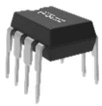
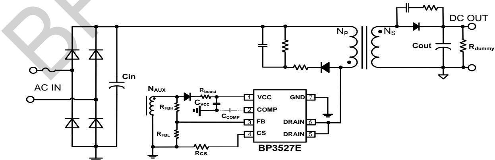
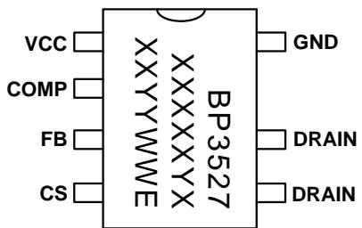
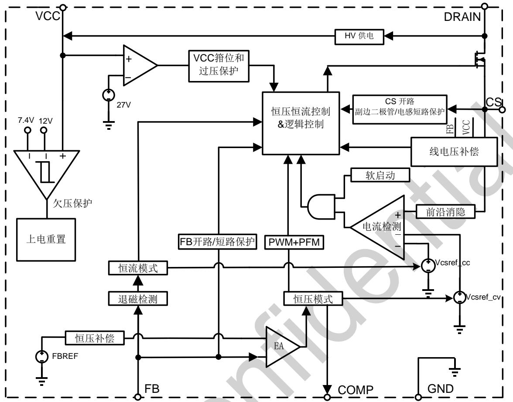
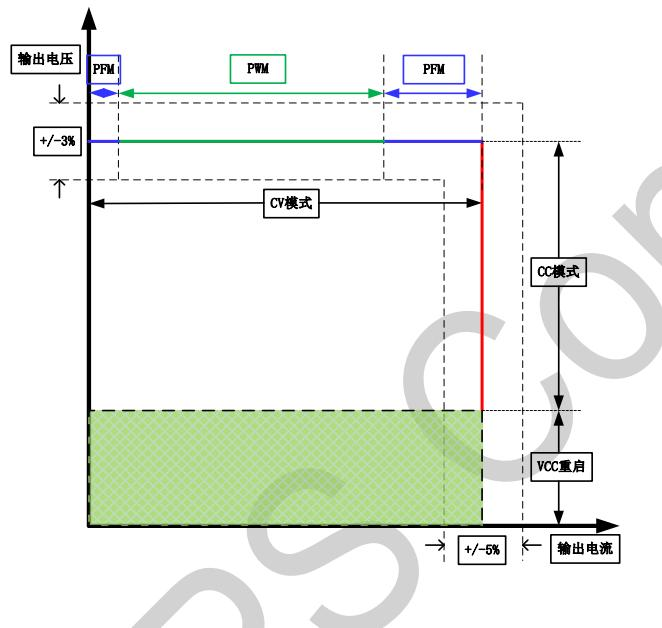
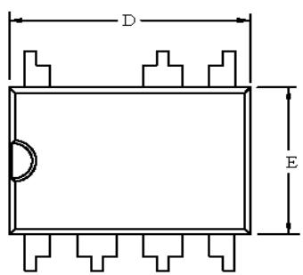
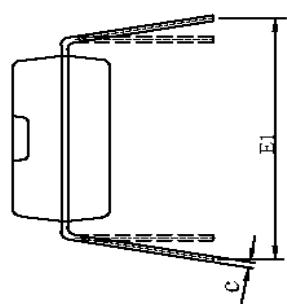
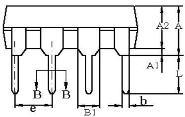
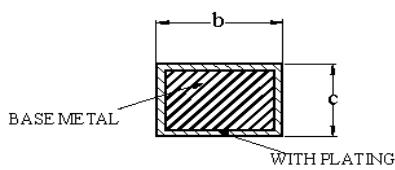

## BP3527E 低功耗PSR隔离恒压恒流驱动芯片

## 概述

BP3527E是一款低功耗恒压恒流驱动芯片。恒流状态下芯片工作在电感电流临界连续模式，恒压状态下芯片工作在电感电流断续导通模式，适用于85Vac\~265Vac 全范围输入电压的隔离电源。

BP3527E芯片集成高压启动和供电电路，集成 650V功率开关，采用 PWM/PFM 多模式控制技术，从辅助绕组给 VCC 供电，能有效降低系统待机功耗，提高效率和动态性能，并减小系统工作在轻载时的噪声。

BP3527E具有多重保护功能，包括输出开路/短路保护，芯片供电欠压/过压保护，CS开路/短路保护，副边二极管短路保护，逐周期限流，过温保护等。

BP3527E 采用 DIP-7 封装。

  
DIP-7封装

## 特点

低待机功耗

斩波调光无闪烁

全程负载范围低噪声

集成高压启动和供电电路

集成 650V功率管

PSR 隔离系统恒压恒流输出

PWM/PFM、准谐振多模式控制

±3%输出电压精度

±5%输出电流精度

内置软启动

线电压补偿

逐周期限流

保护功能

过温保护

FB 开路保护

输出短路保护

芯片供电欠压/过压保护

CS 开路/短路保护

➢ 副边电感和副边二极管短路保护

## 应用领域

辅助电源

小家电电源

电机驱动电源

LED 驱动电源

## 典型应用

  
图 1. BP3527E 典型应用电路

## 定购信息

<table><tr><td>定购型号</td><td>封装</td><td>包装形式</td><td>打印</td></tr><tr><td>BP3527E</td><td>DIP-7</td><td>管装50颗/管</td><td>BP3527XXXXXXXYYYWWE</td></tr></table>

## 管脚封装

  
图 2. 管脚封装图

BP3527：产品型号

XXXXXY: 批次号

XXYY:内部标示

WW：周号

## 管脚描述

<table><tr><td>管脚号</td><td>管脚名称</td><td>描述</td></tr><tr><td>1</td><td>VCC</td><td>芯片电源,必须就近接旁路电容</td></tr><tr><td>2</td><td>COMP</td><td>环路补偿脚</td></tr><tr><td>3</td><td>FB</td><td>反馈电压输入端</td></tr><tr><td>4</td><td>CS</td><td>电流采样输入端,电流采样电阻接 CS 引脚和地之间</td></tr><tr><td>5</td><td>DRAIN</td><td>芯片内部高压功率管漏极</td></tr><tr><td>6</td><td>DRAIN</td><td>芯片内部高压功率管漏极</td></tr><tr><td>7</td><td>GND</td><td>芯片地</td></tr></table>

## 极限参数(注1)

<table><tr><td>符号</td><td>参数</td><td>参数范围</td><td>单位</td></tr><tr><td> $V_{DRAIN}$ </td><td>芯片 DRAIN 端口电压范围</td><td>-0.3~650</td><td>V</td></tr><tr><td> $V_{CC}$ </td><td>VCC 电压</td><td>-0.3~30</td><td>V</td></tr><tr><td> $I_{CC\_MAX}$ </td><td>VCC 引脚最大电源电流</td><td>50</td><td>mA</td></tr><tr><td> $V_{FB}$ </td><td>反馈输入端电压</td><td>-0.3~6</td><td>V</td></tr><tr><td> $V_{CS}$ </td><td>电流采样端电压</td><td>-0.3~6</td><td>V</td></tr><tr><td> $P_{DMAX}$ </td><td>功耗(注2)</td><td>0.9</td><td>W</td></tr><tr><td> $\theta_{JA}$ </td><td>PN 结到环境的热阻(注3)</td><td>80</td><td>°C/W</td></tr><tr><td> $T_J$ </td><td>工作结温范围</td><td>-40~150</td><td>°C</td></tr><tr><td> $T_{STG}$ </td><td>储存温度范围</td><td>-55~150</td><td>°C</td></tr></table>

注1：极限参数是指超出该范围，有可能导致器件永久性损坏。极限参数为器件应力的额定值，长期工作在极限参数条件可能会影响器件的可靠性。  
注2：温度升高最大功耗一定会减小，这也是由TJMAx，θJA,和环境温度TA所决定的。最大允许功耗为 $P _ { D M A X } = ( T _ { J M A X } - T _ { A } ) /$ θ或是极限范围给出的数字中比较低的那个值。  
注3：1平方英寸双层PCB板，按照JEDEC 标准测试。

电气参数(注4,5)

<table><tr><td>符号</td><td>描述</td><td>条件</td><td>最小值</td><td>典型值</td><td>最大值</td><td>单位</td></tr><tr><td colspan="7">电源电压</td></tr><tr><td> $V_{CC\_OVP}$ </td><td> $V_{CC}$ 过压保护阈值</td><td></td><td></td><td>27</td><td></td><td>V</td></tr><tr><td> $V_{CC\_ON}$ </td><td> $V_{CC}$ 启动电压</td><td> $V_{CC}$ 上升</td><td>10.4</td><td>12.0</td><td>13.6</td><td>V</td></tr><tr><td> $V_{CC\_UVLO}$ </td><td> $V_{CC}$ 欠压保护阈值</td><td> $V_{CC}$ 下降</td><td>6.5</td><td>7.4</td><td>8.7</td><td>V</td></tr><tr><td> $I_{ch}$ </td><td> $V_{CC}$ 启动电流</td><td> $V_{CC}=0V$ </td><td>1.2</td><td>3</td><td>5.8</td><td>mA</td></tr><tr><td> $I_{OP}$ </td><td> $V_{CC}$ 工作电流</td><td> $V_{FB}=1.9V,V_{CS}=1V$ </td><td>0.885</td><td>1</td><td>1.315</td><td>mA</td></tr><tr><td> $I_q$ </td><td> $V_{CC}$ 静态电流</td><td> $V_{FB}=2.2V,V_{CS}=1V$ </td><td>625</td><td>860</td><td>925</td><td>uA</td></tr><tr><td colspan="7">FB反馈</td></tr><tr><td> $V_{FB\_EA\_REF}$ </td><td>内部误差放大器基准</td><td></td><td>1.99</td><td>2.02</td><td>2.05</td><td>V</td></tr><tr><td> $V_{FB\_OVP}$ </td><td>FB过压保护阈值</td><td></td><td></td><td>2.5</td><td></td><td>V</td></tr><tr><td> $V_{FB\_DEM}$ </td><td>FB过零检测阈值</td><td></td><td></td><td>0.1</td><td></td><td>V</td></tr><tr><td> $V_{FB\_SHORT}$ </td><td>输出短路阈值</td><td></td><td></td><td>1.2</td><td></td><td>V</td></tr><tr><td> $F_{OSC\_SHORT}$ </td><td>输出短路钳位频率</td><td></td><td></td><td>20</td><td></td><td>kHz</td></tr><tr><td> $T_{SAMPLE\_BIG}$ </td><td>采样时间(BCM)</td><td> $T_{CS\_TH}=1V$ </td><td></td><td>5.12</td><td>7</td><td>us</td></tr><tr><td> $T_{SAMPLE\_SMALL}$ </td><td>采样时间(DCM)</td><td> $T_{CS\_TH}=0.1V$ </td><td>1.29</td><td>2</td><td>3</td><td>us</td></tr><tr><td> $T_{DEMAG\_MAX}$ </td><td>最大退磁时间</td><td></td><td>38</td><td>45</td><td>68</td><td>us</td></tr><tr><td> $T_{ON\_MAX}$ </td><td>最大开通时间</td><td></td><td>20</td><td>23</td><td>35</td><td>us</td></tr><tr><td colspan="7">电流采样</td></tr><tr><td> $V_{REF\_CC}$ </td><td>恒流基准(BCM)</td><td></td><td>1.944</td><td>1.98</td><td>2.024</td><td>V</td></tr><tr><td> $T_{LEB}$ </td><td>前沿消隐时间</td><td></td><td></td><td>300</td><td></td><td>ns</td></tr><tr><td colspan="7">功率MOS管</td></tr><tr><td> $BV_{DSS}$ </td><td>功率管的击穿电压</td><td> $V_{GS}=0V/ I_{DS}=250uA$ </td><td>650</td><td></td><td></td><td>V</td></tr><tr><td> $I_{DSS}$ </td><td>功率管的漏电流</td><td> $V_{GS}=0V/V_{DS}=650V$ </td><td></td><td></td><td>1</td><td>uA</td></tr><tr><td> $R_{ds\_on}$ </td><td>功率管导通阻抗</td><td> $VGS=10V, ID=1.3A$ </td><td>1.2</td><td>1.85</td><td>2.5</td><td>Ω</td></tr><tr><td colspan="7">过温保护</td></tr><tr><td>TSD</td><td>过热保护温度</td><td></td><td></td><td>145</td><td></td><td>°C</td></tr></table>

注4：典型参数值为25℃下测得的参数标准。

注5：电气参数定义了器件在工作范围内并且在保证特定性能指标的测试条件下的直流和交流电参数规范。最小值和最大值由测试保证，典型值由设计、测试或统计分析保证。对于未给定上下限值的参数，该规范不予保证其精度，但其典型值合理反映了器件性能

## 内部结构框图

  
图 3. BP3527E 内部框图

## 功能描述

BP3527E 是一款原边控制隔离具有恒压恒流输出特性的驱动芯片，恒压状态下系统工作于断续导通模式、恒流状态下系统工作干临界连续导通模式。采用特有的多模式准谐振控制，芯片内部集成650V功率开关，只需要极少的外围组件就可以达到优异的恒压恒流特性。特别适合于有恒压恒流需求的LED驱动器，中功率适配器以及小家电辅助电源。

## 启动

BP3527E 系统上电后，芯片内部 DRAIN 通过 HV对 VCC电容充电，当 Vcc 电压达到芯片开启阈值 12V时，芯片内部控制电路开始工作。系统正常后，Vcc由辅助绕组通过二极管进行供电。

## 软启动

芯片具有软启动功能，软启动过程中，逐渐增加原边峰值电流以减小开关应力，每一次重启都会经历软启动的过程。

## 恒流控制，输出电流设置

BP3527E 芯片逐周期检测电感的峰值电流，CS端连接到内部的峰值电流比较器的输入端，与内部阈值电压进行比较，当CS外部电压达到内部检测阈值时，功率管关断。

输出电流的表达式为：

$$
I _ {O U T} = \frac {1}{2} \times \frac {N _ {P}}{N _ {S}} \times 0. 1 7 5 \times \frac {V _ {\mathrm {RFF\_CC}}}{R _ {\mathrm{cs}}}
$$

其中，Np变压器主级的匝数，Ns是变压器次级的匝数，lout 是恒流输出，VREF CC 是恒流基准电压，Rcs 是电流检测电阻。CS比较器的输出还包括一个300ns前沿消隐时间。

## 恒压控制，输出电压设置

BP3527E通过采样变压器辅助绕组电感两端压降，分压后与内部基准比较形成闭环后，来恒定输出电压 $\vee { \mathsf { o } } _ { \mathsf { c } }$ 2

$$
V _ {O} = \frac {2 . 0 2 * (R _ {F B L} + R _ {F B H})}{R _ {F B L}} * \frac {N _ {S}}{N _ {a u x}} - V _ {f}
$$

其中，Vf是续流二极管压降，RFBL是FB下拉电阻，RFBH是FB上拉电阻，Naux是变压器辅助绕组的匝数。

## PWM/PFM 多模式控制

BP3527E芯片采用 PWM/PEM 多模式控制技术，能有效降低系统待机功耗，提高效率，并减小系统工作在轻载时的噪声。

## 线电压补偿设置

BP3527E芯片内部的关断延迟，导致不同线电压下，电感的峰值电流有差异。线电压越高，电感峰值电流偏差越大输出电流就越大，影响CC精度。线电压补偿的目的是使电感峰值电流在不同线电压下保持原来预期值。

功率管导通时 FB clamp 电路将 FB 电压钳位至接近 OV镜像MOSFET导通时的IFB 得到K\*IFB，将该电流注入到补偿电阻 RC 上，产生ΔVCS，叠加到 CS 电压上，用 VCS+ΔVCS和参考电压进行比较，决定功率管关断。

通过调节FB上拉电阻 $R _ { \mathrm { F B H } }$ 可以决定线电压补偿的深度，推

荐其取值范围如下：

$$
\frac {K \times N _ {a u x} \times R _ {c} \times L}{N _ {p} \times \varDelta t \times R _ {c s}} \leq R _ {F B H} <   \frac {V _ {b u l k} \times N _ {a u x}}{N _ {p} \times 3 \times 1 0 ^ {- 4}}
$$

其中 $\mathsf { V b u l k }$ 是母线电压，芯片内部关断延时 $\Delta ^ { . }$ t(约 100ns),K是固定系数约为0.00625，Rc为2.8kΩ。L为变压器原边励磁电感值。

## 过压保护电阻设置

当FB检测到的平台电压达到内部设定的开路保护阈值2.5V时，系统进入开路保护。

$$
V _ {O V P} = \frac {2 . 5 * (R _ {F B L} + R _ {F B H})}{R _ {F B L}} * \frac {N _ {S}}{N _ {a u x}} - V _ {f}
$$

其中，Vovp 是需要设定的过压保护点

## 保护功能

BP3527E内置多种保护功能，包括输出开路/短路保护，$\mathsf { V } _ { \mathsf { C C } }$ 欠压/过压保护，CS 开路/短路保护、副边二极管/副边电感短路保护、过温保护等。

## 输出短路保护

当输出短路时，FB 检测到的电压低于1.2V时，系统进入短路保护，工作时的开关频率被钳位在20kHz,能有效降低开关管应力。短路工作150ms后，关断功率管，1.5s后系统重启。

## 输出开路保护

当FB 采样电压连续三个周期大于2.5V 则触发输出过压保护，关断功率管，1.5s后系统重启。

## VCC 过压保护

当VCC电压大于27V连续三次，则触发VCC过压保护，关断功率管。

## CS 开路保护

当 CS高于3.3V超过 20us，则关断功率管，1.5s后系统重启。

## CS 短路保护

功率管导通时经过前沿消隐时间后，CS 电压持续3个开关周期始终小于0.075V，则关断功率管，1.5s后系统重启。

## 副边二极管/副边电感短路保护

当MOS 导通时经过屏蔽时间后，若CS 电压大于阈值1.4V则关断功率管，作为本周期的功率管关断信号。若连续两个周期检测均大于阈值电压1.4V，则触发失效信号，关断功率管，1.5s后系统重启。

PCB Layout 指南

在设计BP3527E PCB 时，需要遵循以下指南：

## 旁路电容

Vcc的旁路电容需要紧靠芯片Vcc和GND 引脚。

## FB 引脚

接到FB的分压电阻必须靠近FB 引脚，且节点要远离功率电感的动点。

## 地线

电流采样电阻的功率地线尽可能短，且要和芯片的地线及其它小信号的地线分头接到母线电容的地端。

功率环路的面积

减小功率环路的面积，如功率电感、功率管、母线电容的环路面积，以及功率电感 续流二极管、输出电容的环路面积，以减小EMI辐射。

## 封装信息

  
DIP-7 封装外形尺寸

  
SECTIONB-B

<table><tr><td rowspan="2">SYMBOL</td><td colspan="3">MILLIMETER</td></tr><tr><td>MIN</td><td>NOM</td><td>MAX</td></tr><tr><td>A</td><td>—</td><td>—</td><td>4.80</td></tr><tr><td>A1</td><td>0.40</td><td>—</td><td>—</td></tr><tr><td>A2</td><td>3.10</td><td>—</td><td>3.50</td></tr><tr><td>b</td><td>0.355</td><td>—</td><td>0.559</td></tr><tr><td>B1</td><td colspan="3">1.52REF</td></tr><tr><td>c</td><td>0.203</td><td>—</td><td>0.356</td></tr><tr><td>D</td><td>9.10</td><td>—</td><td>9.45</td></tr><tr><td>E</td><td>6.25</td><td>—</td><td>6.70</td></tr><tr><td>e</td><td>2.44</td><td>2.54</td><td>2.64</td></tr><tr><td>E1</td><td>7.80</td><td>—</td><td>9.00</td></tr><tr><td>L</td><td>2.92</td><td>—</td><td>3.81</td></tr></table>

## 版本信息

<table><tr><td>版本</td><td>日期</td><td>记录</td></tr><tr><td>Rev. 1.0</td><td>2023/03</td><td>首次发布</td></tr><tr><td></td><td></td><td></td></tr></table>

## 免责声明

晶丰明源尽力确保本产品规格书内容的准确和可靠，但是保留在没有通知的情况下，修改规格书内容的权利。

本产品规格书未包含任何针对晶丰明源或第三方所有的知识产权的授权。针对本产品规格书所记载的信息，晶丰明源不做任何明示或暗示的保证，包括但不限于对规格书内容的准确性、商业上的适销性、特定目的的适用性或者不侵犯晶丰明源或任何第三人知识产权做任何明示或暗示保证，晶丰明源也不就因本规格书本身及其使用有关的偶然或必然损失承担任何责任。