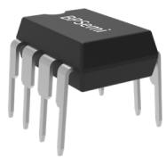
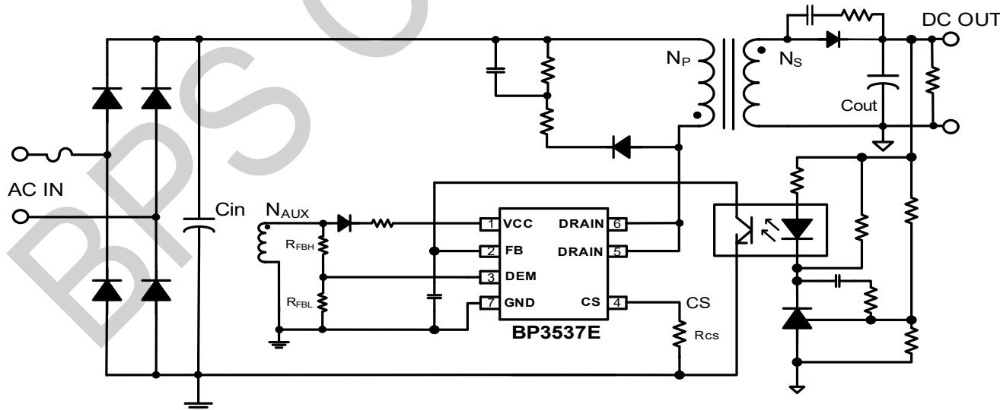
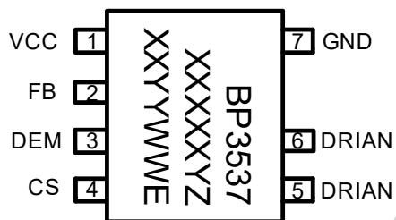
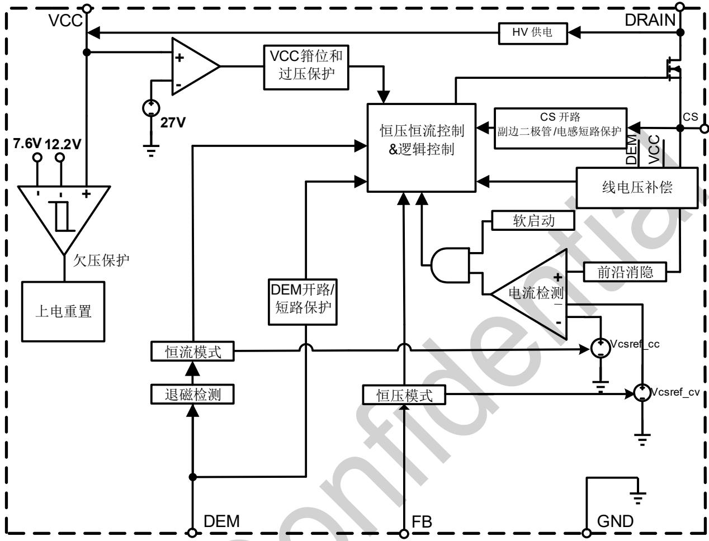
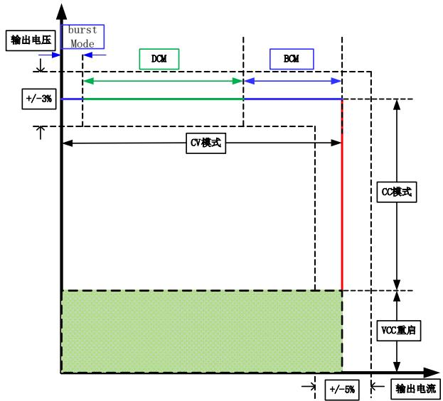
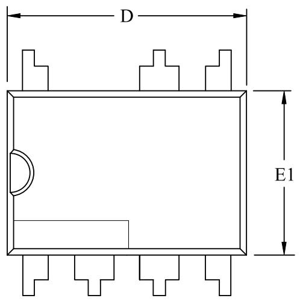
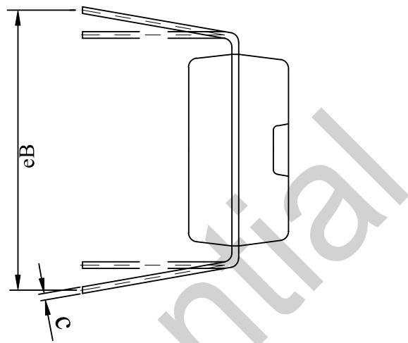
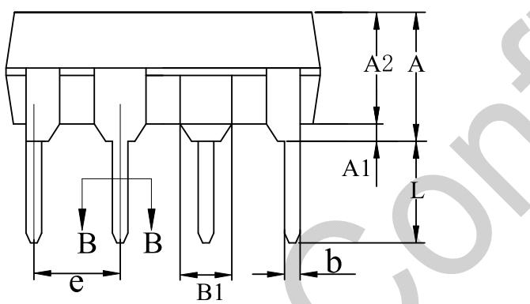
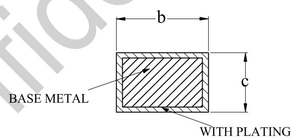

## BP3537E低功耗 SSR 隔离恒压恒流控制芯片

## 概述

BP3537E 是一款低功耗恒压恒流控制芯片。重载状态下芯片工在电感电流临界连续模式，中载状态下芯片工作在电感电流断续模式，轻载状态下芯片工作在间歇模式。

BP3537E 芯片集成⾼压启动和供电电路，启动后从辅助绕组给VCC供电，全程谷底开通，能有效降低系统待机功耗，提⾼效率和动态性能，并减小系统工作在轻载时的噪声。

BP3537E 具有良好的动态响应速度，启动时输出电压上升快，负载快速切换输出电压过冲或跌落少。

BP3537E 具有多重保护功能，包括输出开路/短路保护、芯片供电欠压/过压保护、CS 开路保护、副边⼆极管短路保护、逐周期限流、过温保护等。

BP3537E 采用 DIP-7 封装。

  
DIP-7 封装

## 特点

 低待机功耗

 接灯带负载斩波调光无闪烁、低噪声

 原边电流关机过冲小

 集成⾼压启动和供电电路

 集成 700V 功率管

 准谐振多模式控制

 ±5%输出电流精度

 启动后输出电压上升时间短

 保护功能

 过温保护

 DEM 开路保护

输出开路/短路保护

芯片供电欠压/过压保护

CS 开路保护

副边绕组和副边⼆极管短路保护

## 应用领域

 适配器电源

 LED 驱动电源

## 典型应用

  
图 1. BP3537E 典型应用电路  
注：该线路及参数仅供参考，实际应用电路和参数请通过试验充分验证。

## 定购信息

<table><tr><td>定购型号</td><td>封装</td><td>包装形式</td><td>打印</td></tr><tr><td>BP3537E</td><td>DIP-7</td><td>管装50颗/管</td><td>BP3537XXXXXYZXYYWWE</td></tr></table>

## 管脚封装

  
BP3537E：产品型号  
XXXXXY: 批次号  
XXYY: 内部标识

WW：周号

Z：预留

图 2. DIP-7 管脚封装图

## 管脚描述

<table><tr><td>管脚号</td><td>管脚名称</td><td>描述</td></tr><tr><td>1</td><td>VCC</td><td>芯片电源,必须就近接旁路电容到地</td></tr><tr><td>2</td><td>FB</td><td>副边光耦反馈输入端</td></tr><tr><td>3</td><td>DEM</td><td>退磁检测脚</td></tr><tr><td>4</td><td>CS</td><td>电流采样输入端,电流采样电阻接 CS 引脚和地之间</td></tr><tr><td>5,6</td><td>DRAIN</td><td>内置 MOS 管漏极</td></tr><tr><td>7</td><td>GND</td><td>芯片地</td></tr></table>

## 极限参数(注 1)

<table><tr><td>符号</td><td>参数</td><td>参数范围</td><td>单位</td></tr><tr><td> $V_{DRAIN}$ </td><td>内置 MOS 管漏极</td><td>-0.3~700</td><td>V</td></tr><tr><td> $V_{HV}$ </td><td>HV 端口电压范围</td><td>-0.3~750</td><td>V</td></tr><tr><td> $V_{CC}$ </td><td>VCC 电压</td><td>-0.3~30</td><td>V</td></tr><tr><td> $V_{DEM}$ </td><td>退磁检测引脚电压</td><td>-0.3~6</td><td>V</td></tr><tr><td> $V_{FB}$ </td><td>反馈输入引脚电压</td><td>-0.3~6</td><td>V</td></tr><tr><td> $V_{CS}$ </td><td>电流采样端电压</td><td>-0.3-6</td><td>V</td></tr><tr><td> $P_{DMAX}$ </td><td>功耗(注 2)</td><td>0.9</td><td>W</td></tr><tr><td> $\theta_{JA}$ </td><td>PN 结到环境的热阻(注 3)</td><td>80</td><td>°C/W</td></tr><tr><td> $T_J$ </td><td>工作结温范围</td><td>-40~150</td><td>°C</td></tr><tr><td> $T_{STG}$ </td><td>储存温度范围</td><td>-55~150</td><td>°C</td></tr></table>

注 1：极限参数是指超出该范围，有可能导致器件永久性损坏。极限参数为器件应⼒的额定值，⻓期工作在极限参数条件可能会影响器件的可靠性。  
注 2：温度升⾼最大功耗一定会减小，这也是由 TJMAX, θJA,和环境温度 TA所决定的。最大允许功耗为 $\mathsf { P } _ { \mathsf { D M A X } } = ( \mathsf { T } _ { \mathsf { J M A X } } - \mathsf { T } _ { \mathsf { A } } ) /$ θ 或是极限范围给出的数字中比较低的那个值。  
注 3：1平方英寸双层 PCB板，按照JEDEC 标准测试。

## 推荐工作范围(注 4)

<table><tr><td>符号</td><td>参数</td><td>参数范围</td><td>单位</td></tr><tr><td> $P_{OUT}$ </td><td>输出功率(输入电压 400V)</td><td> $\leqslant 45$ </td><td>W</td></tr></table>

注 4：开放式条件下，50℃环境温度、芯片表面温升为60℃时对应的最大连续输出功率。若实际应用中散热条件更优，则允许的最大功率可以更大。

电气参数(注 5 6)

<table><tr><td>符号</td><td>描述</td><td>条件</td><td>最小值</td><td>典型值</td><td>最大值</td><td>单位</td></tr><tr><td colspan="7">电源电压</td></tr><tr><td> $V_{CC\_OVP}$ </td><td> $V_{CC}$ 过压保护阈值</td><td></td><td></td><td>27</td><td></td><td>V</td></tr><tr><td> $V_{CC\_ON}$ </td><td> $V_{CC}$ 启动电压</td><td> $V_{CC}$ 上升</td><td>10.4</td><td>12</td><td>13.6</td><td>V</td></tr><tr><td> $V_{CC\_UVLO}$ </td><td> $V_{CC}$ 欠压保护阈值</td><td> $V_{CC}$ 下降</td><td>6.5</td><td>7.4</td><td>8.7</td><td>V</td></tr><tr><td> $I_{ch}$ </td><td> $V_{CC}$ 启动电流</td><td> $V_{CC}=0V$ </td><td>1.2</td><td>3</td><td>5.8</td><td>mA</td></tr><tr><td> $I_{OP}$ </td><td> $V_{CC}$ 工作电流</td><td> $V_{DEM}=1.9V, V_{CS}=1V$ </td><td>0.885</td><td>1</td><td>1.315</td><td>mA</td></tr><tr><td> $I_Q$ </td><td> $V_{CC}$ 静态电流</td><td> $V_{DEM}=2.2V, V_{CS}=1V$ </td><td>625</td><td>860</td><td>925</td><td>μA</td></tr><tr><td colspan="7">退磁检测</td></tr><tr><td> $V_{DEM\_OVP}$ </td><td>DEM过压保护阈值</td><td></td><td>2.4</td><td>2.6</td><td>2.9</td><td>V</td></tr><tr><td> $V_{DEM\_ZCD}$ </td><td>DEM过零检测阈值</td><td></td><td></td><td>0.1</td><td></td><td>V</td></tr><tr><td> $V_{DEM\_SHORT}$ </td><td>输出短路阈值</td><td></td><td></td><td>1.2</td><td></td><td>V</td></tr><tr><td> $T_{SAMPLE\_BIG}$ </td><td>采样时间(BCM)</td><td> $V_{CS}=0.55V$ </td><td>2.29</td><td>3.06</td><td>3.83</td><td>μs</td></tr><tr><td> $T_{SAMPLE\_SMALL}$ </td><td>采样时间(DCM)</td><td> $V_{CS}=0.1V$ </td><td>0.9</td><td>1.2</td><td>1.5</td><td>μs</td></tr><tr><td> $T_{DEMAG\_MAX}$ </td><td>最大退磁时间</td><td></td><td>143</td><td>202</td><td>257</td><td>μs</td></tr><tr><td> $T_{ON\_MAX}$ </td><td>最大开通时间</td><td></td><td>7</td><td>10</td><td>11</td><td>μs</td></tr><tr><td colspan="7">电流采样</td></tr><tr><td> $V_{REF\_CC}$ </td><td>恒流基准(BCM)</td><td></td><td>1.944</td><td>1.98</td><td>2.024</td><td>V</td></tr><tr><td> $T_{LEB}$ </td><td>前沿消隐时间</td><td></td><td></td><td>300</td><td></td><td>ns</td></tr><tr><td> $V_{OCP}$ </td><td>逐周期限流电压</td><td></td><td>0.52</td><td>0.55</td><td>0.58</td><td>mV</td></tr><tr><td colspan="7">功率MOS管</td></tr><tr><td> $BV_{DSS}$ </td><td>功率管击穿电压</td><td> $V_{GS}=0V/ I_{DS}=250μA$ </td><td>700</td><td></td><td></td><td>V</td></tr><tr><td> $I_{DSS}$ </td><td>功率管漏电流</td><td> $V_{GS}=0V, V_{DS}=700V$ </td><td></td><td></td><td>1</td><td>μA</td></tr><tr><td colspan="7">过温保护</td></tr><tr><td> $T_{OTP}$ </td><td>过热保护温度</td><td></td><td></td><td>135</td><td></td><td>°C</td></tr></table>

注 5：典型参数值为 25˚C 下测得的参数标准。

注 6：电气参数定义了器件在工作范围内并且在保证特定性能指标的测试条件下的直流和交流电参数规范。最小值和最大值由测试保证，典型值由设计、测试或统计分析保证。对于未给定上下限值的参数，该规范不予保证其精度，但其典型值合理反映了器件性能。

## 内部结构框图

  
图 3. BP3537E 内部框图

## 功能描述

BP3537E 是一款低功耗恒压恒流控制芯片，重载状态下芯片工在电感电流临界连续模式，中载状态下芯片工作在电感电流断续模式，轻载状态下芯片工作在间歇模式。BP3536G 采用特有的多模式准谐振控制，只需要极少的外围组件就可以达到优异的恒压恒流特性，特别适合于有恒压恒流需求的 LED 驱动器、中功率适配器。

## 启动

BP3537E 系统上电后，⺟线电压由 DRAIN 脚通过内部JFET 对 VCC 电容充电，当 V 电压达到芯片开启阈值 12V时，芯片内部控制电路开始工作。系统正常后，V 由辅助绕组通过⼆极管进⾏供电。

为了启动后输出电压快速建立，BP3536G 在开机后 20ms内短暂屏蔽原边恒流功能，原边电流只受 OCP 限制，从而缩短首次启动时输出电压的上升时间。

## 恒流控制，输出电流设置

BP3537E 芯片逐周期检测电感的峰值电流，CS 端连接到内部的峰值电流比较器的输入端，与内部阈值电压进⾏比较，当 CS 外部电压达到内部检测阈值时，功率管关断。

输出电流的表达式为：

$$
I _ {O U T} = \frac {1}{2} \times \frac {N _ {P}}{N _ {S}} \times 0. 1 7 5 \times \frac {V _ {\mathrm {RFF\_CC}}}{R _ {\mathrm{cs}}}
$$

其中， ${ \mathsf { N p } }$ 变压器主级的匝数，Ns 是变压器次级的匝数，Iout 是恒流输出， $V _ { R E F \_ C C }$ 是恒流基准电压，Rcs 是电流检测电阻。CS比较器的输出还包括一个300ns前沿消隐时间。

## BCM/DCM/Burst 模式控制

BP3537E 芯片采用 BCM/DCM/Burst 模式控制技术，能有效降低系统待机功耗，提⾼效率，并减小系统工作在轻载时的噪声。

## 线电压补偿设置

BP3537E 芯片内部的关断延迟，导致不同线电压下，电感的峰值电流有差异。线电压越⾼，电感峰值电流偏差越大输出电流就越大，影响CC精度。线电压补偿的目的是使电感峰值电流在不同线电压下保持原来预期值。

功率管导通时 DEM 钳位电路将镜像 MOSFET 导通时的 I 得补偿电阻RC上(RC接在芯片CS引脚和CS采样电阻之间)，产生ΔVCS，叠加到 CS 电压上 +ΔV 和参考电压进⾏比较，决定功率管关断时刻。

通过调节DEM上拉电阻 $R _ { \mathrm { D E M } }$ 可以决定线电压补偿的深度，推荐其取值范围如下：

$$
\frac {K \times N _ {a u x} \times R _ {c} \times L}{N _ {p} \times \varDelta t \times R _ {c s}} \leq R _ {D E M} <   \frac {V _ {b u l k} \times N _ {a u x}}{N _ {p} \times 3 \times 1 0 ^ {- 4}}
$$

其中 $\mathsf { V } _ { \sf b u l k }$ 是⺟线电压，芯片内部关断延时∆t(约 100ns)，K 是固定系数约为 0.00625，RC为 2.8kΩ。L 为变压器原边励磁电感值。

## 过压保护电阻设置

当 DEM 检测到的平台电压达到内部设定的开路保护阈值2.6V 时，系统进入开路保护。

$$
V _ {O V P} = \frac {2 . 6 * (R _ {D E M L} + R _ {D E M H})}{R _ {D E M L}} * \frac {N _ {S}}{N _ {a u x}} - \mathsf {V} _ {f}
$$

其中，VOVP是需要设定的过压保护点

## 保护功能

BP3537E 内置多种保护功能，包括输出开路/短路保护，VCC欠压/过压保护，CS开路保护、副边⼆极管/副边绕组短路保护、过温保护等。

## 输出短路保护

当输出短路时，DEM检测到的电压低于1.2V时，系统进入短路保护。短路工作150ms ，关断功率管，1.5s后系统重启。

## 输出开路保护

当 DEM 采样电压大于 2.6V 则触发输出过压保护，关断功率管，1.5s 后系统重启。

## VCC过压保护

当 VCC 电压大于 27V，则触发 VCC 过压保护，关断功率管。

## CS 开路保护

当CS⾼于3.3V超过20μs，则关断功率管，1.5s后系统重启。

## 副边二极管/副边电感短路保护

当 MOS 导通时，若经过屏蔽时间后 CS 电压大于阈值 1.4V，则关断功率管，作为本周期的功率管关断信号。若连续两个周期检测均大于阈值电压 1.4V，则触发故障保护，关断功率管，1.5s 后系统重启。

## PCB Layout 指南

在设计 BP3537EPCB时，需要遵循以下指南：

1) VCC 的旁路电容需要紧靠芯片 VCC 和 GND 引脚。

2) 接到DEM的分压电阻必须靠近DEM引脚，且节点要远离功率电感的动点。

3) 电流采样电阻的功率地线尽可能短，且要和芯片的地线及其它小信号的地线分头接到⺟线电容的地端。

4) 减小功率环路的面积，如功率电感、功率管、⺟线电容的环路面积，以及功率电感、续流⼆极管、输出电容的环路面积，以减小 EMI 辐射。

WITH PLATING

## 封装信息

  
DIP-7 封装外形尺寸

  
SECTION B-B

<table><tr><td rowspan="2">SYMBOL</td><td colspan="3">MILLIMETER</td></tr><tr><td>MIN</td><td>NOM</td><td>MAX</td></tr><tr><td>A</td><td>-</td><td>-</td><td>4.30</td></tr><tr><td>A1</td><td>0.40</td><td>-</td><td>-</td></tr><tr><td>A2</td><td>3.10</td><td>-</td><td>3.50</td></tr><tr><td>b</td><td>0.355</td><td>-</td><td>0.559</td></tr><tr><td>B1</td><td colspan="3">1.52REF</td></tr><tr><td>c</td><td>0.203</td><td>-</td><td>0.356</td></tr><tr><td>D</td><td>9.00</td><td>-</td><td>9.50</td></tr><tr><td>E1</td><td>6.20</td><td>-</td><td>6.70</td></tr><tr><td>e</td><td colspan="3">2.54BSC</td></tr><tr><td>eB</td><td>7.62</td><td>-</td><td>9.30</td></tr><tr><td>L</td><td>2.92</td><td>-</td><td>3.81</td></tr></table>

## NOTES:

1. ALL DIMENSIONS MEET JEDEC STANDARD MS-O12F

2. ALL DIMENSIONS DO NOT INCLUDE MOLD FLASH OR PROTRUSIONS

## 版本信息

<table><tr><td>版本</td><td>日期</td><td>记录</td></tr><tr><td></td><td></td><td></td></tr></table>

## 免责声明

晶丰明源尽⼒确保本产品规格书内容的准确和可靠，但是保留在没有通知的情况下，修改规格书内容的权利。

本产品规格书未包含任何针对晶丰明源或第三方所有的知识产权的授权。针对本产品规格书所记载的信息，晶丰明源不做任何明⽰或暗⽰的保证，包括但不限于对规格书内容的准确性、商业上的适销性、特定目的的适用性或者不侵犯晶丰明源或任何第三⼈知识产权做任何明⽰或暗⽰保证，晶丰明源也不就因本规格书本⾝及其使用有关的偶然或必然损失承担任何责任。

## 电子器件报废说明

该产品在生命周期结束后，由客⼾按照一般电子产品的报废流程进⾏处理。