## BP3599高性能 LLC半桥谐振电路控制器

## 概述

BP3599 是一款集成高压启动和供电的高性能 LLC 半桥谐振电路控制器。它通过产生50%占空比的互补驱动波形来驱动LLC半桥谐振变换器。BP3599 通过改变工作频率来调整输出电压或电流。LLC 半桥变换器具有很宽的感性工作区间，容易实现零电压开关(ZVS), 可实现更高效率和低 EMI。

BP3599 集成防容性开关机制，能够有效避免在启动、输出短路或者输出过载状态下的容性开关。

BP3599 也提供自动死区功能，避免进入硬开关，降低开关损耗，提升效率。

BP3599 内置了软启动功能，可有效减小在启动过程中的电流和电压过冲。

BP3599 也提供丰富的保护功能，可满足安规要求，保证电源设计的可靠性。

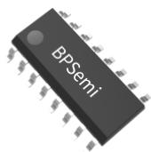  
SOP-16 封装

## 特点

◼ 高压启动和供电

◼ 50%对称占空比变频驱动，精准压控振荡器

◼ 原边恒流功能

◼ 软起动

◼ 容性模式保护

◼ 自动死区

◼ 可编程输入欠压保护

◼ 轻载间歇工作模式

◼ 保护功能

➢ 两级过流保护(OCP)

➢ 输出过载保护(OLP)

➢ 输出短路保护(SCP)

输出过压保护(OVP)

VCC 欠压保护 (VCC UVLO)

VCC 过压保护 (VCC OVP)

过温保护 (OTP)

输入欠压保护 (BROWN OUT)

## 应用领域

LED 照明

◼ AC-DC 适配器

## 典型应用

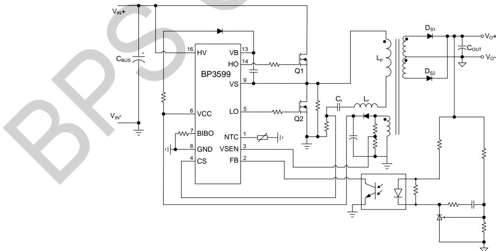  
图 1. BP3599 典型应用电路  
注：该线路及参数仅供参考，实际应用电路和参数请通过试验充分验证。

<table><tr><td>1</td><td>NTC</td><td>HV</td><td>16</td></tr><tr><td>2</td><td>FB</td><td>NC</td><td>15</td></tr><tr><td>3</td><td>VSEN</td><td>HO</td><td>14</td></tr><tr><td>4</td><td>CS</td><td>VB</td><td>13</td></tr><tr><td>5</td><td>LO</td><td>NC</td><td>12</td></tr><tr><td>6</td><td>VCC</td><td>NC</td><td>11</td></tr><tr><td>7</td><td>BIBO</td><td>NC</td><td>10</td></tr><tr><td>8</td><td>GND</td><td>VS</td><td>9</td></tr></table>

BP3599: 产品型号  
图 2. SOP-16 管脚封装图

## 定购信息

<table><tr><td>定购型号</td><td>封装</td><td>包装形式</td><td>打印</td></tr><tr><td>BP3599</td><td>SOP-16</td><td>卷盘3000颗/盘</td><td>BP3599XXXXXYZYWWZ</td></tr></table>

## 管脚封装

XXXXXY: 批次号

XY: 内部标示

WW: 周号

Z: 预留

## 管脚描述

<table><tr><td>管脚号</td><td>管脚名称</td><td>描述</td></tr><tr><td>1</td><td>NTC</td><td>外接 NTC,可单独设置过温降电流保护</td></tr><tr><td>2</td><td>FB</td><td>光耦反馈引脚</td></tr><tr><td>3</td><td>VSEN</td><td>辅助绕组电压检测,用于输出过压保护和短路保护</td></tr><tr><td>4</td><td>CS</td><td>谐振电路电流检测</td></tr><tr><td>5</td><td>LO</td><td>低压侧驱动输出</td></tr><tr><td>6</td><td>VCC</td><td>芯片供电,同时集成 VCC OVP 功能</td></tr><tr><td>7</td><td>BIBO</td><td>调节输入电压欠压</td></tr><tr><td>8</td><td>GND</td><td>芯片地</td></tr><tr><td>9</td><td>VS</td><td>高压侧驱动地,接半桥中点</td></tr><tr><td>10</td><td>NC</td><td>未连接</td></tr><tr><td>11</td><td>NC</td><td>未连接</td></tr><tr><td>12</td><td>NC</td><td>未连接</td></tr><tr><td>13</td><td>VB</td><td>高压侧驱动电源,VCC到VB需要接一个快恢复二极管,同时VB到VS之间接一个自举电容</td></tr><tr><td>14</td><td>HO</td><td>高压侧驱动输出</td></tr><tr><td>15</td><td>NC</td><td>未连接</td></tr><tr><td>16</td><td>HV</td><td>高压启动和供电及输入电压检测</td></tr></table>

极限参数(注 1)

<table><tr><td>符号</td><td>参数</td><td>参数范围</td><td>单位</td></tr><tr><td>HV</td><td>高压启动 JFET 电压</td><td>-0.3~700</td><td>V</td></tr><tr><td>VS</td><td>VS 引脚电压</td><td>-0.3~700</td><td>V</td></tr><tr><td> $V_{CC}$ </td><td>VCC 引脚电压</td><td>-0.3~30</td><td>V</td></tr><tr><td>VB</td><td>VB 引脚电压(相对于 VS)</td><td>-0.3~30</td><td>V</td></tr><tr><td>HO</td><td>HO 引脚电压(相对于 VS)</td><td>-0.3~30</td><td>V</td></tr><tr><td>NTC, FB, VSEN, CS, BIBO</td><td>芯片低压引脚电压</td><td>-0.3~6</td><td>V</td></tr><tr><td>LO</td><td>LO 引脚电压</td><td>-0.3~30</td><td>V</td></tr><tr><td> $P_{DMAX}$ </td><td>功耗(注 2)</td><td>0.75</td><td>W</td></tr><tr><td> $\theta_{JA}$ </td><td>结到环境的热阻(注 3)</td><td>87</td><td>°C/W</td></tr><tr><td> $T_J$ </td><td>工作结温范围</td><td>-40~150</td><td>°C</td></tr><tr><td> $T_{STG}$ </td><td>储存温度范围</td><td>-55~150</td><td>°C</td></tr><tr><td rowspan="2">ESD HBM</td><td>除 HV 引脚外(注 4)</td><td>2</td><td>kV</td></tr><tr><td>HV 引脚</td><td>1</td><td>kV</td></tr></table>

注 1：极限参数是指超出该范围，有可能导致器件永久性损坏。极限参数为器件应力的额定值，长期工作在极限参数条件可能会影响器件的可靠性。  
注 2：温度升高最大功耗一定会减小，这也是由 T , θ ,和环境温度T 所决定的。最大允许功耗为 $P _ { D M A X } = ( T _ { J M A X } - T _ { A } ) / \theta _ { J A }$ 或是极限范围给出的数字中比较低的那个值。  
注 3：1 平方英寸双层PCB 板，按照JEDEC标准测试。  
注 4：人体模型，100pF电容通过 1.5kΩ 电阻放电。

电气参数(注 5)

<table><tr><td>符号</td><td>描述</td><td>条件</td><td>最小值</td><td>典型值</td><td>最大值</td><td>单位</td></tr><tr><td colspan="7">电源电压 (VCC)</td></tr><tr><td> $V_{CC\_ON}$ </td><td>VCC 启动电压</td><td>VCC 上升</td><td>14</td><td>15.5</td><td>17</td><td>V</td></tr><tr><td> $V_{CC\_UVLO}$ </td><td>VCC 欠压保护阈值</td><td>VCC 下降</td><td>7</td><td>8.5</td><td>10</td><td>V</td></tr><tr><td> $V_{CC\_OVP}$ </td><td>VCC 过压保护阈值</td><td></td><td>26</td><td>28</td><td>30</td><td>V</td></tr><tr><td> $I_{QUIESCENT}$ </td><td>VCC 静态工作电流</td><td>无开关动作, $V_{CC}=13V$ </td><td>200</td><td>300</td><td>400</td><td>μA</td></tr><tr><td> $I_{CC}$ </td><td>工作电流</td><td> $C_L=100pF,$  $F_{OP}=50kHz,$  $V_{CC}=12V$ </td><td>0.45</td><td>0.62</td><td>1</td><td>mA</td></tr><tr><td> $V_{CC\_JFETON}$ </td><td>JFET 供电 VCC 电压</td><td></td><td>9</td><td>10.5</td><td>12</td><td>V</td></tr><tr><td colspan="7">JFET 启动和供电 (HV)</td></tr><tr><td> $I_{HV\_CHRG1}$ </td><td>JFET 充电电流@VCC&lt;1V</td><td> $V_{HV}=40V, V_{CC}=0V$ </td><td>0.45</td><td>0.65</td><td>0.75</td><td>mA</td></tr><tr><td> $I_{HV\_CHRG2}$ </td><td>JFET 充电电流@VCC&gt;1V</td><td> $V_{HV}=40V, V_{CC}=11V$ </td><td>3</td><td>4</td><td>5</td><td>mA</td></tr><tr><td colspan="7">高压侧驱动电源 (VB)</td></tr><tr><td> $V_{B\_ON}$ </td><td>VB 启动电压</td><td>VB 上升</td><td></td><td>8.5</td><td></td><td>V</td></tr><tr><td> $V_{B\_UVLO}$ </td><td>VB 欠压保护阈值</td><td>VB 下降</td><td></td><td>6.5</td><td></td><td>V</td></tr><tr><td> $I_{QUIESCENT-VB}$ </td><td>VB 静态工作电流</td><td>无开关动作</td><td>100</td><td>127</td><td>150</td><td>μA</td></tr><tr><td colspan="7">输入欠压保护设定 (BIBO)</td></tr><tr><td> $K_{BIBO}$ </td><td>HV 分压比</td><td></td><td>142.5</td><td>150</td><td>157.5</td><td>V</td></tr><tr><td> $V_{HYS}$ </td><td>输入欠压保护阈值回差</td><td></td><td></td><td>0.5</td><td></td><td>V</td></tr><tr><td> $I_{BIBO}$ </td><td>BIBO 阈值设定电流</td><td></td><td>18</td><td>20</td><td>22</td><td>μA</td></tr><tr><td> $T_{BUS\_BO}$ </td><td>BO 保护屏蔽时间</td><td></td><td></td><td>10</td><td></td><td>μs</td></tr><tr><td colspan="7">光耦输出反馈 (FB)</td></tr><tr><td> $V_{FB\_BURST}$ </td><td>进入 BURST 模式的 FB 电压</td><td></td><td>1.29</td><td>1.4</td><td>1.51</td><td>V</td></tr><tr><td> $V_{BURST\_HYS}$ </td><td>退出 BURST FB 回差电压</td><td></td><td></td><td>50</td><td></td><td>mV</td></tr><tr><td> $V_{FB\_OPEN}$ </td><td>FB 开路电压</td><td></td><td></td><td>5</td><td></td><td>V</td></tr><tr><td> $R_{FB}$ </td><td>FB 电阻</td><td></td><td></td><td>5</td><td></td><td>kΩ</td></tr><tr><td colspan="7">外置 NTC 过温保护 (NTC)</td></tr><tr><td> $I_{NTC}$ </td><td>NTC 设定电流</td><td></td><td>96</td><td>100</td><td>104</td><td>μA</td></tr><tr><td> $V_{NTC\_TH}$ </td><td>NTC 过温降电流保护阈值</td><td></td><td></td><td>0.8</td><td></td><td>V</td></tr><tr><td colspan="7">输出过压检测(VSEN)</td></tr><tr><td> $V_{VSEN\_OVP}$ </td><td>OVP 阈值电压</td><td></td><td></td><td>3</td><td></td><td>V</td></tr><tr><td> $T_{OVP\_DLY}$ </td><td>OVP 保护持续周期</td><td></td><td></td><td>8</td><td></td><td>Cycle</td></tr><tr><td> $V_{VSEN\_UVP}$ </td><td>UVP 阈值电压</td><td></td><td></td><td>1.3</td><td></td><td>V</td></tr><tr><td> $T_{UVP\_DLY}$ </td><td>UVP 保护延时</td><td></td><td></td><td>30</td><td></td><td>ms</td></tr><tr><td colspan="7">电流采样(CS)</td></tr><tr><td> $V_{CS\_OCP\_TH}$ </td><td>故障保护限流阈值</td><td></td><td></td><td>0.8</td><td></td><td>V</td></tr><tr><td> $T_{OCP\_DLY}$ </td><td>滤波时间</td><td></td><td></td><td>400</td><td></td><td>ns</td></tr><tr><td> $V_{CAPA}$ </td><td>容性检测电压</td><td></td><td></td><td>420</td><td></td><td>mV</td></tr><tr><td> $V_{CC\_REF}$ </td><td>原边恒流基准</td><td></td><td>145</td><td>153</td><td>161</td><td>mV</td></tr><tr><td colspan="7">栅极驱动(LO, HO-VS)</td></tr><tr><td> $V_{GATE}$ </td><td>驱动电压</td><td></td><td></td><td>12</td><td></td><td>V</td></tr><tr><td> $I_{SURCE}$ </td><td>最大驱动上拉电流</td><td> $V_{CC}=12,V_{GATE}=0$ </td><td></td><td>500</td><td></td><td>mA</td></tr><tr><td> $I_{SINK}$ </td><td>最大驱动下拉电流</td><td> $V_{CC}=12,V_{GATE}=VCC$ </td><td></td><td>1000</td><td></td><td>mA</td></tr><tr><td> $t_r$ </td><td>上升时间</td><td> $C_L=1nF, 10\%-90\%$ </td><td></td><td>45</td><td></td><td>ns</td></tr><tr><td> $t_f$ </td><td>下降时间</td><td> $C_L=1nF, 10\%-90\%$ </td><td></td><td>30</td><td></td><td>ns</td></tr><tr><td colspan="7">内部时间控制</td></tr><tr><td> $f_{MAX}$ </td><td>最高工作频率</td><td></td><td></td><td>300</td><td></td><td>kHz</td></tr><tr><td> $f_{BURST}$ </td><td>Burst 工作频率</td><td></td><td>170</td><td>180</td><td>190</td><td>kHz</td></tr><tr><td> $f_{MIN}$ </td><td>最低工作频率</td><td></td><td>40</td><td>50</td><td>60</td><td>kHz</td></tr><tr><td> $D_{DUTY}$ </td><td>占空比</td><td></td><td>49.5</td><td>50</td><td>50.5</td><td>%</td></tr><tr><td> $T_{SS}$ </td><td>软起动时间</td><td></td><td></td><td>15</td><td></td><td>ms</td></tr><tr><td> $T_{FAULT}$ </td><td>故障保护重启时间</td><td></td><td></td><td>500</td><td></td><td>ms</td></tr><tr><td colspan="7">过热调节部分</td></tr><tr><td> $T_{FB}$ </td><td>过热调节温度</td><td></td><td></td><td>130</td><td></td><td>°C</td></tr><tr><td> $T_{SD}$ </td><td>过热保护温度</td><td></td><td></td><td>150</td><td></td><td>°C</td></tr><tr><td> $T_{RST}$ </td><td>退出过热保护温度</td><td></td><td></td><td>130</td><td></td><td>°C</td></tr></table>

注 5：电气参数定义了器件在工作范围内并且在保证特定性能指标的测试条件下的直流和交流电参数规范。最小值和最大值由测试保证，典型值由设计、测试或统计分析保证。对于未给定上下限值的参数，该规范不予保证其精度，但其典型值合理反映了器件性能。

## 内部结构框图

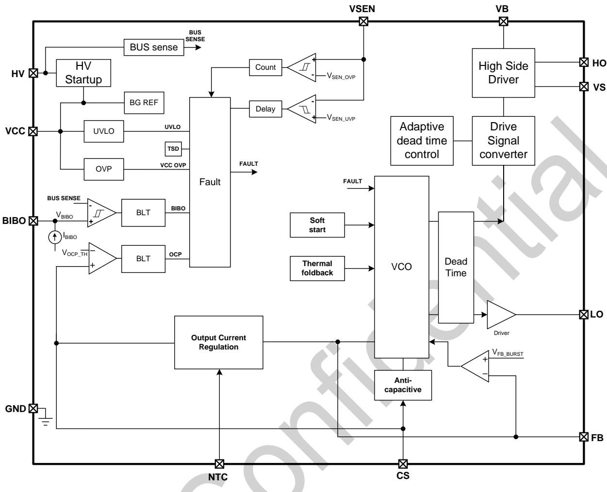  
图 3. BP3599 内部框图

## 功能描述

BP3599 是一款集成高压启动和供电的高性能 LLC 半桥谐振电路控制器。它通过产生 50%占空比的互补驱动波形来驱动LLC 半桥谐振变换器。BP3599 通过改变工作频率来调整输出电压或电流。LLC 半桥变换器具有很宽的感性工作区间，容易实现零电压开关(ZVS), 可实现更高效率和低 EMI。

## 启动

系统上电后，当 VCC 电压小于 1V 时，母线电压直接通过HV引脚以电流 $R t V \_ C H R G 1$ 对VCC电容充电。当 $\mathsf { V } _ { \mathsf { C C } }$ 电压大于1V 时，HV 电流变为 $\mathsf { I } _ { \mathsf { H V \_ C H R G 2 } }$ 。当 VCC 电压达到芯片开启阈值 $V _ { C C , O N }$ 时并且输入电压大于 BIBO 引脚设定的开启电压，则芯片内部控制电路开始工作。

芯片开始工作后，先进入软启动阶段，内部软起动信号 SS缓慢上升，直到和COMP信号交叉，这时反馈电流信号进入闭环。软起动信号用 15ms 从 0V 上升到 ${ 3 } \mathsf { V } ,$ 对应的频率从$\mathsf { f } _ { \mathsf { M A X } }$ 降到 $\mathsf { f } _ { \mathsf { M N } }$ 。随后环路接管后，FB电压下降，系统频率受闭环 FB 引脚电压控制。

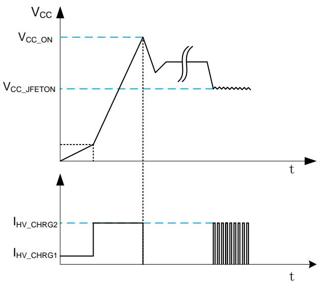

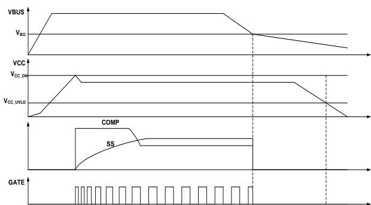

## 关机

关机后，系统检测到输入母线快速下降，而 VCC 电压因为MOSFET 驱动电流的消耗和副边反射电压的下降无法提供足够的能量，也可能会掉至 UVLO 电压。系统会触发输入电压欠压保护或者 VCC UVLO。

## 输出电流原边恒流调节

BP3599 可以工作在原边恒流控制模式，通过电阻检测原边谐振电流到 CS引脚进行原边恒流控制。

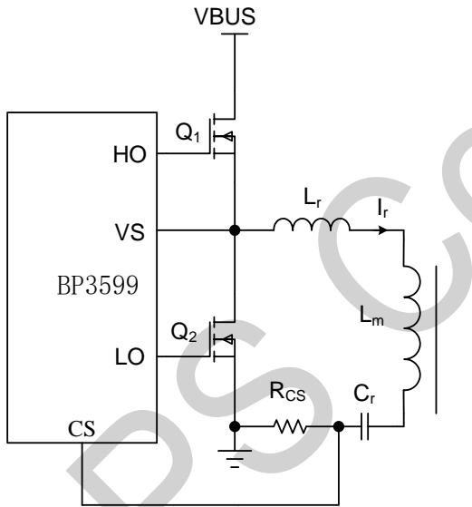

输出电流计算方法：

$$
\frac {I _ {O}}{N _ {P S}} R _ {C S} = V _ {R E F}
$$

其中，

$V _ { R E F }$ 为内部参考电压$\mathsf { R c s }$ 是采样电阻$N _ { P S }$ 是变压器匝比

过温调节

BP3599 提供过温调节功能。NTC 内部有一个上拉电流源$\mathsf { I } _ { \mathsf { N T C } } ( 1 0 0 \mu \mathsf { A } )$ 。若连接一个NTC电阻接到NTC 引脚，当温度过高时，NTC引脚电压下降，当电压达到 $\mathsf { V } _ { \mathsf { N T C } \_ \mathsf { T H } } ( 0 . 8 \mathsf { V } )$ 后每下降100mV, 电流基准下降25%，直到电流达到最低为止。

## 容性模式保护

BP3599 集成防容性保护功能，CS 采样谐振电流，提供双边防容性开关控制。当 $\mathsf { V } _ { \mathsf { C S } }$ 电压正向峰值高于 $\mathsf { V } _ { \mathsf { C A P A } } ( 4 2 0 \mathsf { m V } )$ 后在下降过程穿越 $\mathsf { V } _ { \mathsf { C A P A } } ( 4 2 0 \mathsf { m V } )$ 阈值处，HO 提前关断，经过一个自动死区，SW电压拉低， 开通。当 $\mathsf { V } _ { \mathsf { C S } }$ 电压负向峰值低于 $ { - } \mathsf { V } _ { \mathrm { C A P A } } (  { - } 4 2 0  { \mathrm { m V } } )$ $- V _ { \mathsf { C A P A } } ( -$ 自动死区，SW 电压升高，HO 开通。

这样能够确保开关管始终工作在感性状态，有效避免容性开关。

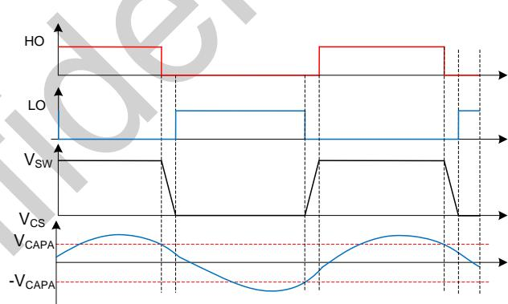

## BURST 功能

当系统进入轻载条件下，工作频率会逐渐升高，当空载时频率会升至最高 $\mathsf { f } _ { \mathsf { M A X } } ,$ 过高的频率会导致开关损耗增加，同时由于励磁电流的减少软开关条件有可能会丢失。为了克服这些问题，BP3599提供了BURST功能，在FB电压到达最低值 $V _ { F B _ { - } }$ 时控制器频率达到最高值，如果 FB 继续下降，则频率保持不变，当 $F B < V _ { F B \_ B \cup R S T }$ ，控制器进入 Burst 突发模式。当 $V _ { F B }$ 逐渐降低，小于 $V _ { F B \_ B \cup R S T }$ 时，上下管驱动HO或者LO同时停止，输出电压慢慢下降，然后 $V _ { F B }$ 电压上升到$V _ { F B \_ B \cup R S \top \_ E \times 1 \top }$ 时，驱动重新开始，驱动的顺序是 ${ \mathsf { H O } } , \mathsf { L O } ,$ 驱动会一直持续，直到 $V _ { F B } < V _ { F B \_ B \cup R S T }$ 驱动停止，这是一个BURST 周期 $T _ { \mathsf { B U R S T } }$ 。当负载再次降低时，T 会延长，反之则会缩短。

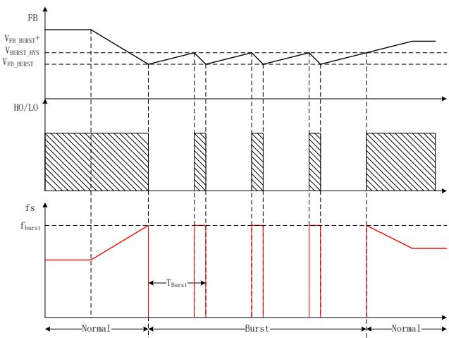

## 故障保护

## ⚫ 过流保护

当输出短路时，CS 电压迅速上升。若 CS 电压大于$\mathsf { V } _ { \mathsf { C S \_ O C P \_ T H } }$ 并持续几个周期时，系统进入故障保护状态。等待 $\mathsf { T } _ { \mathsf { F A U L } \mathsf { T } }$ 以后重新检测故障状态。

## ⚫ VCC OVP 保护

当 VCC 电压大于 ${ \mathsf { V C C } } _ { - } { \mathsf { O V P } }$ 并持续 $1 0 \mu \ s$ ，系统进入故障保护状态。等待 ${ \mathsf { T } } _ { \mathsf { F A U L T } }$ 以后重新检测故障状态。

## ⚫ VSEN OVP 保护

通过变压器辅助绕组可以检测副边输出电压，经过电阻分压后到 VSEN 引脚, 当 VSEN 电压超过 $V _ { \mathsf { V S E N \_ O V P } }$ 并且持续数个周期，系统进入故障保护状态。等待 T 以后重新检测故障状态。

## ⚫ VSEN UVP 保护 (输出过载)

通过变压器辅助绕组可以检测副边输出电压，经过电阻分压后到 $V _ { S E N }$ 引脚, 当 $V _ { S E N }$ 电压低于 $V _ { \mathsf { V S E N \_ U V P } } ,$ , 并且持续时间超过 30ms, 系统进入故障保护状态。等待 $F A U L T$ 以后重新检测故障状态。

## ⚫ 输入欠压保护

当输入电压小于 $\cdot V _ { \mathsf { B O } }$ 并持续10μs，系统停止工作，上下管都保持关断状态。 当输入电压大于 $V _ { \mathsf { B } | }$ 并持续 $1 0 \mu \ s$ ，系统进入正常工作状态。

内部 HV 分压电阻比为 1/150。BI 开启电压可由 BIBO 引脚外部电阻设置，计算公式如下：

$$
\mathrm {V_ {BI}} = \frac {1}{\mathrm {K_ {BIBO}}} * \mathrm {R_ {BIBO}} * \mathrm {I_ {BIBO}}
$$

其中，

$K _ { B \mid B O }$ 为内部 HV 分压电阻比(1/150)

$R _ { B \mid B O }$ 为 BIBO 引脚电阻

I 为 BIBO 阈值设定电流 $( 2 0 \mu \mathsf { A } )$

BO 关断电压可由如下公式计算：

$$
\mathrm {V_ {BO} = V_ {BI} - V_ {HYS} * 150}
$$

其中，

$\mathsf { V } _ { \mathsf { H Y S } }$ 为输入欠压保护阈值回差(0.5V)

## ⚫ 过热保护

BP3599具有过热调节功能，当芯片内部温度超过 $T _ { F B }$ 时降低恒流参考值，降低工作电流，避免芯片温度上升，以提高系统的可靠性。当芯片内部温度超过 $T _ { S D }$ ，立即停止工作，当结温下降到 TRST以后，系统重新开始工作。

## ⚫ PCB Layout 指南

在设计 BP3599 应用 PCB 时，需要遵循以下建议：

1) 减小大电流环路的面积，如变压器初级、功率管及谐振电容的环路面积，以及变压器次级、次级二极管、输出电容的环路面积，以减小 EMI 辐射；

2) 芯片地及控制信号参考地需和功率回路参考地隔开，芯片与控制信号地就近连至 VCC 电解地，再由 VCC 电解

3) VCC/VB 的旁路电容需要紧靠芯片的 VCC/VB 引脚和地；

4) 芯片信号采样、反馈及设置引脚(VSEN, CS, FB, NTCBIBO)电阻电容需紧靠芯片引脚和 GND；

5) VSEN 采样信号走线应尽量短，并远离高压信号及开关节点；

6) 谐振电流采样电阻的功率地线尽可能粗，谐振电流采样信号CS走线尽量短，远离高压信号和开关节点，CS引脚 RC 滤波电阻和电容都需紧靠 CS引脚；

7) 光耦反馈信号(FB 和 GND)需要并行差分走线到芯片引脚，GND 需接到靠近芯片端的 GND 走线或铜箔；

8) 输出 431 反馈控制电路需远离变压器输出绕组开关动点，反馈控制电路地就近连至输出电解地；

9) 原副边 Y电容 GND 需分别单点连接至 BUS电解 GND和输出电解 GND。

## 封装信息

SOP-16 封装外形尺寸  
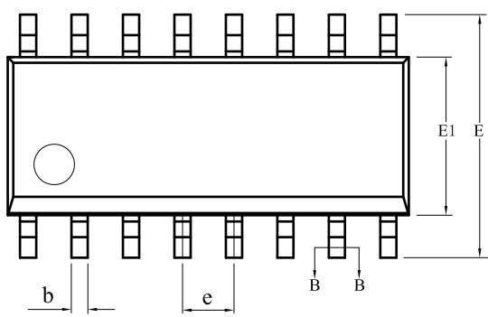

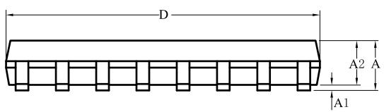

<table><tr><td rowspan="2">SYMBOL</td><td colspan="3">MILLIMETER</td></tr><tr><td>MIN</td><td>NOM</td><td>MAX</td></tr><tr><td>A</td><td>-</td><td>-</td><td>1.75</td></tr><tr><td>A1</td><td>0.10</td><td>-</td><td>0.25</td></tr><tr><td>A2</td><td>1.30</td><td>-</td><td>1.55</td></tr><tr><td>b</td><td>0.35</td><td>-</td><td>0.50</td></tr><tr><td>c</td><td>0.19</td><td>-</td><td>0.25</td></tr><tr><td>D</td><td>9.80</td><td>-</td><td>10.20</td></tr><tr><td>E</td><td>5.80</td><td>6.00</td><td>6.20</td></tr><tr><td>E1</td><td>3.80</td><td>3.90</td><td>4.00</td></tr><tr><td>e</td><td colspan="3">1.27BSC</td></tr><tr><td>L</td><td>0.40</td><td>—</td><td>0.80</td></tr></table>

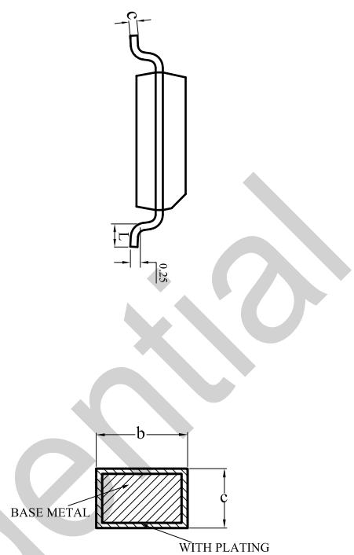  
SECTION B-B

## 版本信息

<table><tr><td>版本</td><td>日期</td><td>记录</td></tr><tr><td>Rev.1.0</td><td>2025-06</td><td>首次发行</td></tr><tr><td></td><td></td><td></td></tr><tr><td></td><td></td><td></td></tr></table>

## 免责声明

晶丰明源尽力确保本产品规格书内容的准确和可靠，但是保留在没有通知的情况下，修改规格书内容的权利。

本产品规格书未包含任何针对晶丰明源或第三方所有的知识产权的授权。针对本产品规格书所记载的信息，晶丰明源不做任何明示或暗示的保证，包括但不限于对规格书内容的准确性、商业上的适销性、特定目的的适用性或者不侵犯晶丰明源或任何第三人知识产权做任何明示或暗示保证，晶丰明源也不就因本规格书本身及其使用有关的偶然或必然损失承担任何责任。

## 电子器件报废说明

该产品在生命周期结束后，由客户按照一般电子产品的报废流程进行处理。