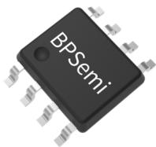
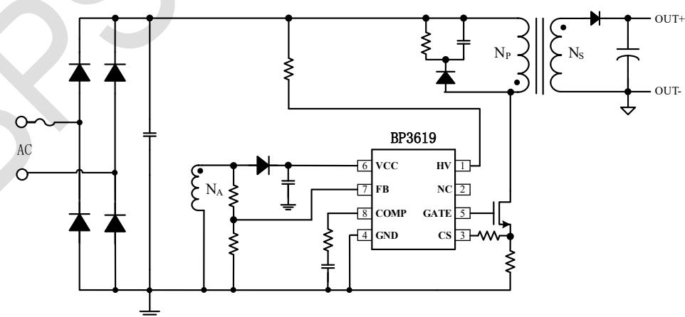
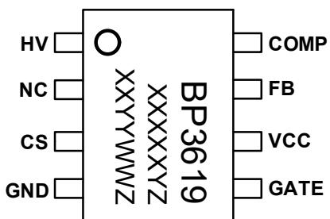
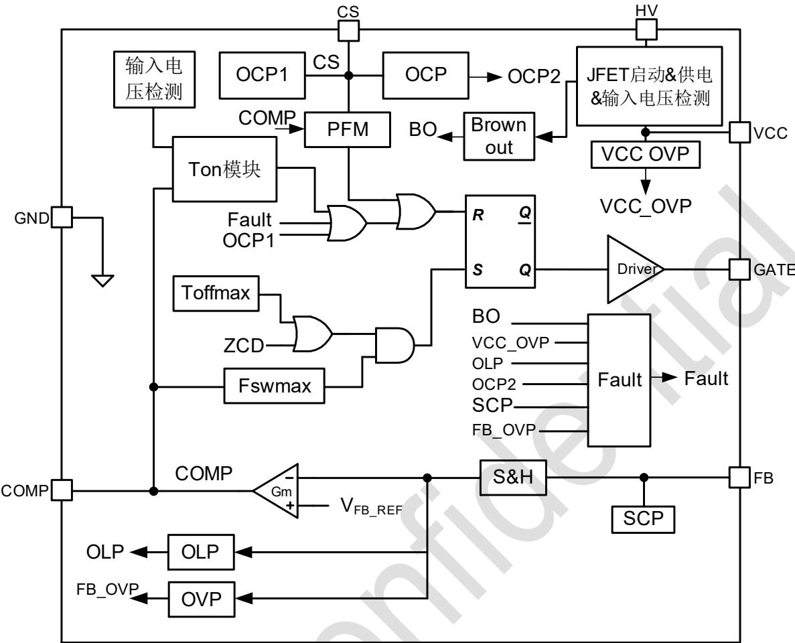
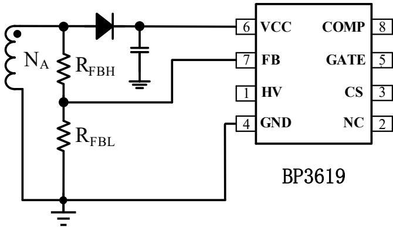
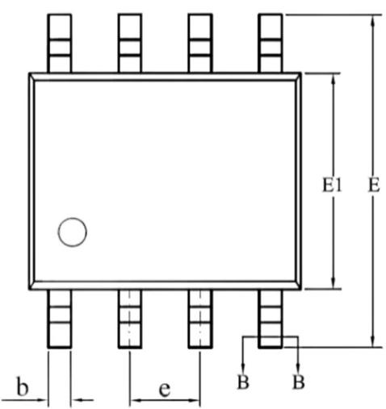
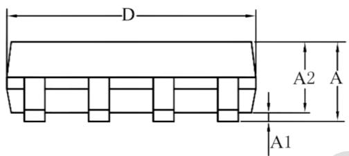
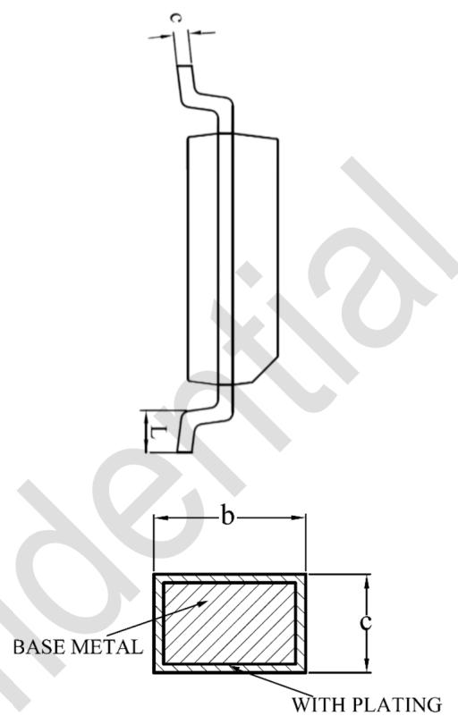

## 概述

BP3619 是一款高 PF 原边反馈恒压控制芯片。无需副边反馈光耦，只需要很少的外围器件可实现高精度恒压输出，降低了系统成本。

BP3619 控制的反激变换器工作在准谐振模式（BCM），可实现更高效率和更低 EMI。采用 Ton 时间控制机制，且内置 PF 和 THD 补偿，能实现高功率因数校正、低 THD 性能，并满足轻载下的新 ErP 分次电流谐波标准。

BP3619 集成高压启动、供电和输入检测电路。能有效加快启动时间，降低待机功耗和实现输入欠压保护功能，减少了外围元器件。BP3619 也集成多种保护功能，提高了电源的可靠性。
BP3619 采用 SOP-8 封装。

  
SOP-8 封装

## 特点

■ 原边反馈 CV 控制，无需光耦

■ 内置高压启动和供电，启动速度快

高精度恒压基准

■ 原边 MOSFET 谷底导通，开关损耗低

■ 高 PF(>0.9)，低 THD(<10%)@满载

■ 优异的线性调整率和负载调整率

■ 低启动电流<15μA

■ 低待机功耗（<100mW，@230Vac）

■ 保护功能

● 逐周期限流保护（Cycle-by-Cycle）

\- 过流保护

\- 输出短路保护、开路保护

\- $V_{cc}$ 欠压 (UVLO)

\- $V_{CC}$ 过压保护（ $V_{CC\_OVP}$ ）

\- 过温保护（OTP）

\- 电感/输出二极管短路保护

\- 过载保护（OLP）

\- 输入欠压保护（BROWN OUT）

## 应用领域

■ AC/DC 适配器

■ LED 照明

## 典型应用

  
图 1 BP3619 典型应用电路  
注：以上电路及参数仅供参考，实际的应用电路请在充分的实测基础上设定参数。

## 定购信息

<table><tr><td>定购型号</td><td>封装</td><td>包装形式</td><td>打印</td></tr><tr><td>BP3619</td><td>SOP-8</td><td>卷盘4,000/盘</td><td>BP3619XXXXXYZXYYWWZ</td></tr></table>

## 管脚封装

  
BP3619: 产品型号  
XXXXXY: 批次  
XXYY: 标识  
WW: 周号  
图 2 SOP-8 管脚封装图

Z: 预留

## 管脚描述

<table><tr><td>管脚号</td><td>管脚名称</td><td>描述</td></tr><tr><td>1</td><td>HV</td><td>高压启动和供电及输入电压检测</td></tr><tr><td>2</td><td>NC</td><td>未连接</td></tr><tr><td>3</td><td>CS</td><td>电流采样端</td></tr><tr><td>4</td><td>GND</td><td>芯片地</td></tr><tr><td>5</td><td>GATE</td><td>MOSFET 驱动</td></tr><tr><td>6</td><td>VCC</td><td>芯片供电电源</td></tr><tr><td>7</td><td>FB</td><td>退磁检测和输出电压检测</td></tr><tr><td>8</td><td>COMP</td><td>环路补偿</td></tr></table>

## 极限参数(注1)

<table><tr><td>符号</td><td>参数</td><td>参数范围</td><td>单位</td></tr><tr><td>HV</td><td>高压启动JEFT电压</td><td>-0.3~700</td><td>V</td></tr><tr><td> $V_{CC}$ </td><td> $V_{CC}$ 引脚电压</td><td>-0.3~30</td><td>V</td></tr><tr><td> $I_{CC}$ </td><td>芯片供电VCC电流</td><td>10</td><td>mA</td></tr><tr><td>GATE</td><td>GATE引脚电压</td><td>-0.3~30</td><td>V</td></tr><tr><td>CS</td><td>CS引脚电压</td><td>-0.3~6</td><td>V</td></tr><tr><td>FB</td><td>FB引脚电压</td><td>-0.3~6</td><td>V</td></tr><tr><td>COMP</td><td>COMP引脚电压</td><td>-0.3~6</td><td>V</td></tr><tr><td> $P_{DMAX}$ </td><td>功耗(注2)</td><td>0.45</td><td>W</td></tr><tr><td> $\theta_{JA}$ </td><td>PN结到环境的热阻(注3)</td><td>145</td><td>°C/W</td></tr><tr><td> $T_J$ </td><td>工作结温范围</td><td>-40~150</td><td>°C</td></tr><tr><td> $T_{STG}$ </td><td>储存温度范围</td><td>-55~150</td><td>°C</td></tr><tr><td>ESD</td><td>人体模型ESD(注4)</td><td>2</td><td>kV</td></tr></table>

注 1：最大极限值是指超出该工作范围，芯片有可能损坏。推荐工作范围是指在该范围内，器件功能正常，但并不完全保证满足个别性能指标。电气参数定义了器件在工作范围内并且在保证特定性能指标的测试条件下的直流和交流电参数规范。对于未给定上下限值的参数，该规范不予保证其精度，但其典型值合理反映了器件性能。

注2：温度升高最大功耗一定会减小，这也是由 $T_{JMAX}, \theta_{JA}$ 和环境温度 $T_A$ 所决定的。最大允许功耗为 $P_{DMAX} = (T_{JMAX} - T_A) / \theta_{JA}$ 或是极限范围给出的数字中比较低的那个值。

注3：1平方英寸双层PCB板，按照JEDEC标准测试。

注4：按照JEDEC标准测试，100pF电容通过 $1.5\mathrm{K}\Omega$ 电阻放电。

电气参数(注 5)（无特别说明情况下， $T_{A}=25^{\circ}C$ ）

<table><tr><td>符号</td><td>描述</td><td>条件</td><td>最小值</td><td>典型值</td><td>最大值</td><td>单位</td></tr><tr><td colspan="7">电源电压(Vcc)</td></tr><tr><td> $V_{CC\_CLAMP}$ </td><td> $V_{CC}$ 钳位电压</td><td>1mA</td><td>23</td><td>24</td><td>25</td><td>V</td></tr><tr><td> $V_{CC\_ON}$ </td><td> $V_{CC}$ 启动电压</td><td> $V_{CC}$ 上升</td><td>16</td><td>17</td><td>18</td><td>V</td></tr><tr><td> $V_{CC\_UVLO}$ </td><td> $V_{CC}$ 欠压保护阈值</td><td> $V_{CC}$ 下降</td><td>8</td><td>9</td><td>10</td><td>V</td></tr><tr><td> $V_{CC\_OVP}$ </td><td> $V_{CC}$ 过压保护阈值</td><td> $I_{CC}>10mA$ </td><td>26</td><td>27</td><td>28</td><td>V</td></tr><tr><td> $I_{QUIESCENT}$ </td><td> $V_{CC}$ 静态工作电流</td><td>无开关动作</td><td>260</td><td>295</td><td>330</td><td>μA</td></tr><tr><td> $I_{ST}$ </td><td> $V_{CC}$ 启动电流</td><td> $V_{CC\_ON}-1V$ </td><td>1</td><td>4</td><td>15</td><td>μA</td></tr><tr><td> $I_{CC}$ </td><td>工作电流</td><td> $C_L=100pF, F_{op}=15kHz$ </td><td>0.25</td><td>0.44</td><td>0.65</td><td>mA</td></tr><tr><td> $V_{CC\_JFETON}$ </td><td>JFET供电VCC电压</td><td></td><td>9</td><td>10.4</td><td>11</td><td>V</td></tr><tr><td colspan="7">JFET启动和供电</td></tr><tr><td> $I_{HV\_CHRG1}$ </td><td>JFET充电电流@ $V_{CC}<4V$ </td><td> $V_{HV}=40V, V_{CC}=0V$ </td><td>0.4</td><td>0.6</td><td>0.8</td><td>mA</td></tr><tr><td> $I_{HV\_CHRG2}$ </td><td>JFET充电电流@ $V_{CC}>4V$ </td><td> $V_{HV}=40V, V_{CC}=11V$ </td><td>3.6</td><td>4.8</td><td>10</td><td>mA</td></tr><tr><td colspan="7">输入欠压保护</td></tr><tr><td> $V_{BO}$ </td><td></td><td>持续18ms</td><td></td><td>65</td><td></td><td>Vac</td></tr><tr><td colspan="7">误差放大器(COMP)</td></tr><tr><td>Gm</td><td>跨导放大系数</td><td></td><td>35</td><td>50</td><td>65</td><td>μA/V</td></tr><tr><td> $V_{COMP}$ </td><td>COMP线性工作范围</td><td></td><td>0.4</td><td></td><td>3.4</td><td>V</td></tr><tr><td colspan="7">电压采样(FB)</td></tr><tr><td> $V_{REF}$ </td><td>内部恒压基准电压</td><td></td><td>1.2</td><td>1.235</td><td>1.27</td><td>V</td></tr><tr><td> $V_{FB\_ST}$ </td><td>启动阶段判断阈值</td><td></td><td>0.26</td><td>0.3</td><td>0.36</td><td>V</td></tr><tr><td> $V_{FB\_H1}$ </td><td>快速响应FB过高阈值</td><td></td><td>1.28</td><td>1.33</td><td>1.38</td><td>V</td></tr><tr><td> $I_{sink}$ </td><td>COMP快速下拉电流</td><td></td><td>5.8</td><td>6.2</td><td>6.7</td><td>mA</td></tr><tr><td> $V_{FB\_H2}$ </td><td>退出FB过高快速响应</td><td></td><td>1.2</td><td>1.25</td><td>1.3</td><td>V</td></tr><tr><td> $V_{FB\_L1}$ </td><td>退出FB过低快速响应</td><td></td><td>1.13</td><td>1.18</td><td>1.23</td><td>V</td></tr><tr><td> $V_{FB\_L2}$ </td><td>快速响应FB过低阈值</td><td></td><td>0.95</td><td>1.05</td><td>1.15</td><td>V</td></tr><tr><td> $I_{source}$ </td><td>COMP快速上拉电流</td><td></td><td>0.117</td><td>0.13</td><td>0.145</td><td>mA</td></tr><tr><td> $V_{FB\_OVP}$ </td><td>FB过压保护阈值</td><td></td><td></td><td>1.5</td><td></td><td>V</td></tr><tr><td> $I_{FB\_DET}$ </td><td>FB短路保护检测电流</td><td></td><td>85</td><td>100</td><td>115</td><td>μA</td></tr><tr><td> $T_{FB\_DET}$ </td><td>FB短路检测延时</td><td></td><td></td><td>0.1</td><td></td><td>ms</td></tr><tr><td> $V_{FB\_OPEN}$ </td><td>FB开路检测阈值</td><td></td><td></td><td>2.7</td><td></td><td>V</td></tr><tr><td> $V_{FB\_SHORT}$ </td><td>FB 短路检测阈值</td><td></td><td></td><td>0.35</td><td></td><td>V</td></tr><tr><td colspan="7">电流采样(CS)</td></tr><tr><td> $V_{OCP\_ST}$ </td><td>启动阶段逐周期限流</td><td></td><td>0.38</td><td>0.45</td><td>0.52</td><td>V</td></tr><tr><td> $V_{CS\_TH1}$ </td><td>逐周期限流阈值 1</td><td></td><td>0.6</td><td>0.7</td><td>0.8</td><td>V</td></tr><tr><td> $V_{CS\_TH2}$ </td><td>故障保护限流阈值 2</td><td></td><td>0.85</td><td>1</td><td>1.15</td><td>V</td></tr><tr><td> $T_{LEB1}$ </td><td>前沿消隐时间</td><td></td><td></td><td>300</td><td></td><td>ns</td></tr><tr><td> $V_{CS\_MIN}$ </td><td>PFM 模式最小 CS 电压</td><td></td><td></td><td>80</td><td></td><td>mV</td></tr><tr><td> $I_{CS\_DET}$ </td><td>谷底延时设定电流</td><td></td><td>85</td><td>100</td><td>115</td><td>μA</td></tr><tr><td> $T_{CS\_DET}$ </td><td>谷底延时设定检测延时</td><td></td><td></td><td>0.1</td><td></td><td>ms</td></tr><tr><td colspan="7">零电流检测</td></tr><tr><td> $V_{FB\_FALL}$ </td><td>退磁检测 FB 下降阈值</td><td>FB 下降</td><td></td><td>0.1</td><td></td><td>V</td></tr><tr><td> $V_{FB\_RISE}$ </td><td>退磁检测 FB 上升阈值</td><td>FB 上升</td><td></td><td>0.2</td><td></td><td>V</td></tr><tr><td colspan="7">栅极驱动(GATE)</td></tr><tr><td> $V_{GATE}$ </td><td>驱动电压</td><td></td><td></td><td>10</td><td></td><td>V</td></tr><tr><td> $I_{SURCE1}$ </td><td>最大驱动上拉电流</td><td></td><td></td><td>150</td><td></td><td>mA</td></tr><tr><td> $I_{SINK1}$ </td><td>最大驱动下拉电流</td><td></td><td></td><td>550</td><td></td><td>mA</td></tr><tr><td colspan="7">内部时间控制</td></tr><tr><td> $T_{ON\_MAX}$ </td><td>最大开通时间</td><td></td><td>14</td><td>18</td><td>22</td><td>μs</td></tr><tr><td> $T_{ON\_MIN}$ </td><td>最小开通时间</td><td></td><td></td><td>0.5</td><td></td><td>μs</td></tr><tr><td> $T_{DELAY}$ </td><td>开通延时</td><td></td><td></td><td>0.3</td><td></td><td>μs</td></tr><tr><td> $T_{OFF\_MAX\_ST}$ </td><td>启动最大关断时间</td><td></td><td>95</td><td>121</td><td>150</td><td>μs</td></tr><tr><td> $T_{ZCD\_MASK}$ </td><td>退磁检测屏蔽时间</td><td></td><td></td><td>3.5</td><td></td><td>μs</td></tr><tr><td> $T_{SHORT}$ </td><td>短路保护时间</td><td></td><td></td><td>50</td><td></td><td>ms</td></tr><tr><td> $T_{FAULT}$ </td><td>短路保护重启间隔时间</td><td></td><td></td><td>410</td><td></td><td>ms</td></tr><tr><td> $F_{SWMAX}$ </td><td>最大开关频率限值</td><td></td><td></td><td>120</td><td></td><td>kHz</td></tr><tr><td> $F_{SWMIN}$ </td><td>Skip mode 频率</td><td> $V_{Comp}<0.4V$ </td><td></td><td>200</td><td></td><td>Hz</td></tr><tr><td colspan="7">过热调节部分</td></tr><tr><td> $T_{REG}$ </td><td>过热保护温度</td><td></td><td></td><td>150</td><td></td><td>°C</td></tr><tr><td> $T_{HYS}$ </td><td>过热保护迟滞</td><td></td><td></td><td>30</td><td></td><td>°C</td></tr></table>

注5：规格书的最小、最大规范范围由测试保证，典型值由设计、测试或统计分析保证。

## 内部结构框图

  
图 3 BP3619 内部框图

## 功能描述

BP3619 是一款原边反馈恒压控制的单级反激 APFC 控制器，主要应用于高 PF 恒压输出的应用领域。

BP3619 采用原边反馈 CV 控制技术，无需副边反馈光耦，只需要很少的外围器件可实现高精度恒压输出。内置了 PF 和 THD 补偿，实现了高 PF、低 THD 性能。

## 启动

系统上电后，当 $V_{CC}$ 电压小于 4V 时，母线电压直接通过 HV 引脚以电流 $I_{HV\_CHRG1}$ 对 $V_{CC}$ 电容芯片。当 $V_{CC}$ 电压大于 4V 时，HV 电流变为 $I_{HV\_CHRG2}$ 。当 $V_{CC}$ 电压达到芯片开启阈值 $V_{CC\_ON}$ 时，芯片内部控制电路开始工作。当 FB 电压低于 $V_{FB\_ST}$ 时，系统处于启动阶段，此时 CS 峰值电流限值为 $V_{OCP\_ST}$ 。一旦当 FB 电压大于 $V_{FB\_ST}$ 后，限流为 $V_{CS\_TH1}$ 阈值。

## 关机

关机后，系统检测到输入母线快速下降，同时 FB 检测不到退磁信号，而 $V_{cc}$ 电压因为 MOSFET 驱动电流的消耗和副边反射电压的下降无法提供足够的能量，也可能会掉至 UVLO 电压。系统会触发输入电压欠压保护、短路保护和 $V_{cc\_uvlo}$ 三种保护中的其中一种。

## 输出电压设置和采样方法

原边反馈恒压控制能够省却副边反馈电路和光耦，从而降低了系统成本。为了在原边实现副边恒压控制，需要通过辅助绕组检测输出电压。

当 MOSFET 关断时，辅助绕组的电压为：

$$
V _ {A U X} = \left(V _ {O U T} + V _ {D F}\right) \times \frac {N _ {A}}{N _ {S}}
$$

其中：

$N_{A}$ 为辅助绕组的圈数；

$N_{s}$ 为副边绕组的圈数；

$V_{DF}$ 为输出续流二极管的正向压降；

  
图 4 FB 引脚示意图

输出电压计算方法：

$$
V _ {O U T} = \frac {V _ {R E F}}{\frac {R _ {F B L}}{R _ {F B H} + R _ {F B L}} \times \frac {N _ {A}}{N _ {S}}}
$$

其中，

$V_{REF}$ 为内部参考电压

$R_{FBL}$ 是反馈网络的下分压电阻

$R_{FBH}$ 是反馈网络的上分压电阻

## 负载动态响应优化

为了改善对负载动态变化的响应，控制器采用了优化设计。

当 FB 电压上升到 $V_{FB\_H1}$ 时，COMP 被拉低，控制器马上减小能量输出，当 FB 下降到 $V_{FB\_H2}$ ，COMP 回归正常状态。

当 FB 电压下降到 $V_{FB\_L2}$ 时，COMP 被拉高，控制器马上增加能量输出，当 FB 下降到 $V_{FB\_L1}$ ，COMP 回归正常状态。

## EMC 优化

谷底导通+限频控制，采用 NMOS 推挽驱动，有效抑制 MOS 开通时的源极电流震荡；采用分级驱动电流控制，在米勒平台区设置降低电流驱动。

## 保护功能

BP3619 内置多种保护功能，包括逐周期限流保护、过流保护、输出短路、开路保护、Vcc 过压保护、过温保护、过载保护、输入欠压保护、电感输出二极管短路保护等。

## 短路保护

BP3619 连续 50ms 检测不到退磁信号, 则进入短路保护状态。等待 $T_{FAULT}$ 以后重新检测故障状态。

## 逐周期限流保护

芯片逐周期检测电感的峰值电流，CS 端连接到的峰值电流比较器的输入端，与内部限流阈值电压进行比较，当 CS 电压达到内部检测阈值时，功率管保护并关断。

## 电感/输出二极管短路保护

当电感或输出二极管短路时，CS 电压迅速上升。若 CS 电压大于 $V_{CS\_TH2}$ ，系统进入故障保护状态。等待 $T_{FAULT}$ 以后重新检测故障状态。

## Vcc 过压保护

当 $V_{CC}$ 电压大于 $V_{CC\_OVP}$ 并持续 10μs，系统进入故障保护状态。等待 $T_{FAULT}$ 以后重新检测故障状态。

## 开路保护

当 FB 电压开关周期大于 $V_{FB\_OVP}$ ，系统进入故障保护状态。等待 $T_{FAULT}$ 以后重新检测故障状态。

## 过载保护

负载逐渐增加时，comp 逐渐增加到可调节范围极限值，输出电压开始下降，触发 FB 小于 1.176V 持续 $T_{FAULT}$ 系统进入故障保护状态，等待 $T_{FAULT}$ 以后重新检测故障状态。

## 输入欠压保护

当输入电压小于 $V_{BO}$ 并持续 18ms，系统进入故障保护状态。等待 $T_{FAULT}$ 以后重新检测故障状态。

## 过温保护

BP3619 具有过热调节功能,在驱动电源过热时立即停止开关,避免芯片温度上升,以提高系统的可靠性。芯片内部设定过热调节温度点为 $150^{\circ}$ C, 当结温下降到 $130^{\circ}$ C 以后, 系统重新开始工作。

## PCB Layout 指南

在设计 BP3619 应用 PCB 时，需要遵循以下建议：

1) VCC 的旁路电容需要紧靠芯片 VCC 和 GND 引脚。

2) FB 采样电阻需要尽量靠近芯片 FB 引脚，且 FB 节点要远离高压节点和噪声源。

3) 电流采样电阻的功率地线尽可能粗，且要离芯片的 GND 脚尽量近。

4) CS 引脚与采样电阻的连线需要尽量短，且靠近芯片，远离高压节点和噪声源。

5) Comp 脚电阻电容连线尽可能短，远离噪声源。

6) 减小功率环路的面积，如功率管、母线电容和输出二极管、输出电容的环路面积，以减小EMI辐射。

## 封装信息

  
SOP-8 封装外形尺寸

<table><tr><td rowspan="2">SYMBOL</td><td colspan="3">MILLIMETER</td></tr><tr><td>MIN</td><td>NOM</td><td>MAX</td></tr><tr><td>A</td><td>1.30</td><td>—</td><td>1.80</td></tr><tr><td>A1</td><td>0.10</td><td>—</td><td>0.25</td></tr><tr><td>A2</td><td>1.25</td><td>1.40</td><td>1.65</td></tr><tr><td>b</td><td>0.33</td><td>—</td><td>0.51</td></tr><tr><td>c</td><td>0.17</td><td>—</td><td>0.25</td></tr><tr><td>D</td><td>4.70</td><td>4.90</td><td>5.10</td></tr><tr><td>E</td><td>5.80</td><td>6.00</td><td>6.20</td></tr><tr><td>E1</td><td>3.70</td><td>3.90</td><td>4.10</td></tr><tr><td>e</td><td colspan="3">1.27BSC</td></tr><tr><td>L</td><td>0.40</td><td>—</td><td>1.00</td></tr></table>

  
SECTION B-B

## 版本信息

<table><tr><td>版本</td><td>日期</td><td>记录</td></tr><tr><td></td><td></td><td></td></tr><tr><td></td><td></td><td></td></tr><tr><td></td><td></td><td></td></tr><tr><td></td><td></td><td></td></tr><tr><td></td><td></td><td></td></tr><tr><td></td><td></td><td></td></tr></table>

## 免责声明

晶丰明源尽力确保本产品规格书内容的准确和可靠，但是保留在没有通知的情况下，修改规格书内容的权利。

本产品规格书未包含任何针对晶丰明源或第三方所有的知识产权的授权。针对本产品规格书所记载的信息，晶丰明源不做任何明示或暗示的保证，包括但不限于对规格书内容的准确性、商业上的适销性、特定目的的适用性或者不侵犯晶丰明源或任何第三人知识产权做任何明示或暗示保证，晶丰明源也不就因本规格书本身及其使用有关的偶然或必然损失承担任何责任。