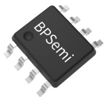
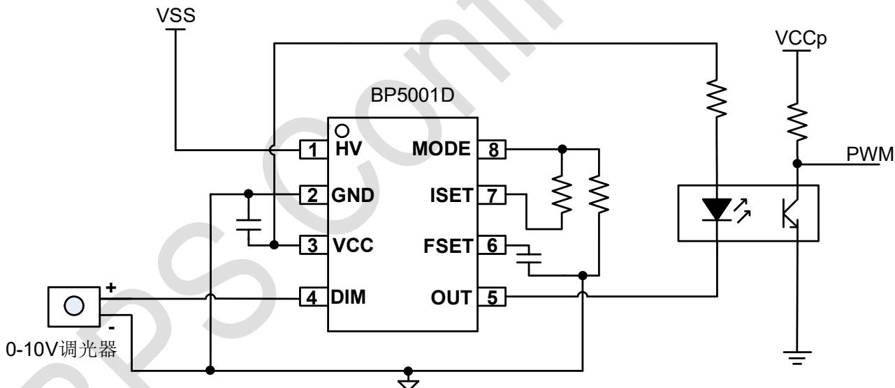
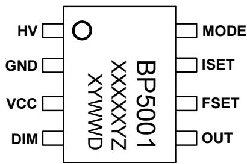
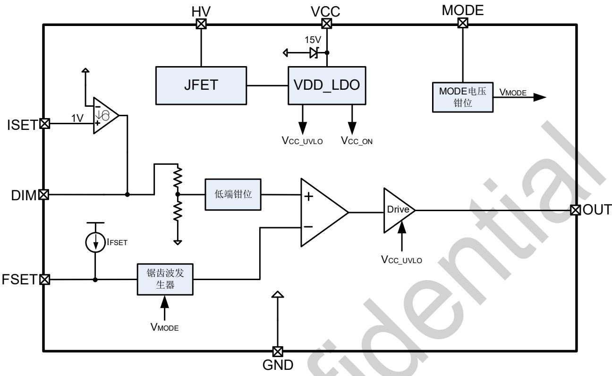
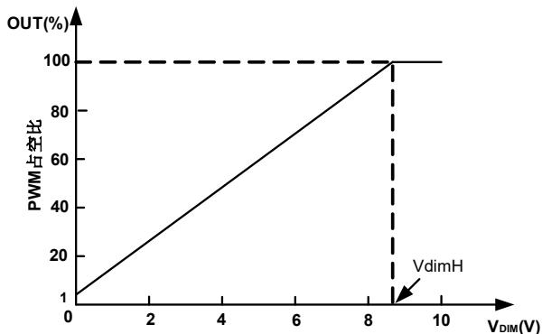
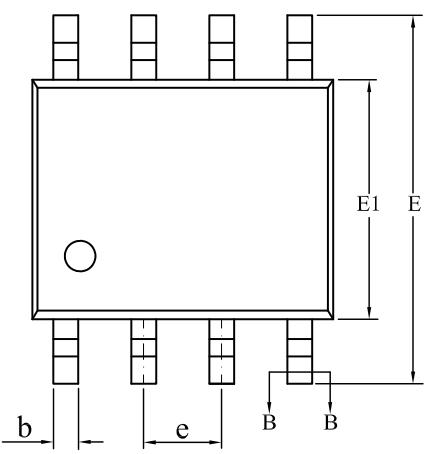
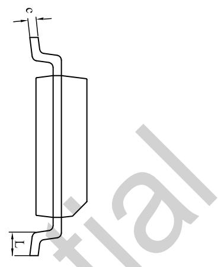
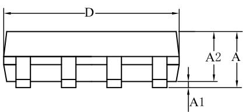
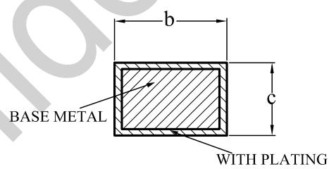

# BP5001D0\~10V 调光/电阻调光接口转换器

## 概述

BP5001D 是一款调光接口转换芯片，能够将调光端口的 0-10V信号、电阻阻值产生的电压信号转换为 PWM 信号。该 PWM 信号可以直接用来控制 LED 驱动芯片，或者经过光耦隔离，实现隔离调光应用。

BP5001D 通过外置频率设定脚，可灵活调节 PWM 频率，以适应不同类型的光耦。

BP5001D通过外置调光器电流设定脚，可实现对多种无源0-10V调光器的兼容。

BP5001D 采用 SOP-8 封装。

## 特点

 兼容 0-10V 调光器/电阻调光器

 集成 500V 高压 JFET 供电

 驱动无源 0-10V 调光器电流可调

 输出 PWM 频率可调

 100%亮度对应的调光电压可调

 集成过热保护

 采用 SOP-8 封装

## 应用领域

 0-10V 调光、无线智能调光

 LCD 背光照明

 可调光 LED 灯

## 典型应用

  
图 1 BP5001D 典型应用电路  
注：该线路及参数仅供参考，实际应用电路和参数请通过试验充分验证。

定购信息

<table><tr><td>定购型号</td><td>封装</td><td>包装形式</td><td>打印</td></tr><tr><td>BP5001D</td><td>SOP-8</td><td>卷盘4,000/盘</td><td>BP5001XXXXXYZXYWWD</td></tr></table>

## 管脚封装

  
BP5001D：产品型号  
XXXXXY：批次  
XY：标识  
WW：周号  
Z：预留  
图 2 管脚封装图

## 管脚描述

<table><tr><td>管脚号</td><td>管脚名称</td><td>描述</td></tr><tr><td>1</td><td>HV</td><td>高压输入脚</td></tr><tr><td>2</td><td>GND</td><td>芯片地</td></tr><tr><td>3</td><td>VCC</td><td>芯片低压供电脚</td></tr><tr><td>4</td><td>DIM</td><td>调光信号输入脚,接0-10V调光器或者电阻</td></tr><tr><td>5</td><td>OUT</td><td>PWM信号输出脚</td></tr><tr><td>6</td><td>FSET</td><td>PWM频率设置脚</td></tr><tr><td>7</td><td>ISET</td><td>DIM脚流出电流设置脚</td></tr><tr><td>8</td><td>MODE</td><td>用于设定100%占空比时对应的DIM脚电压</td></tr></table>

## 极限参数(注 1)

<table><tr><td>符号</td><td>参数</td><td>参数范围</td><td>单位</td></tr><tr><td> $V_{HV}$ </td><td>HV脚输入电压</td><td>-0.3~500</td><td>V</td></tr><tr><td> $V_{CC}, V_{DIM}, V_{OUT}$ </td><td>VCC, DIM, OUT脚输入电压</td><td>-0.3~20</td><td>V</td></tr><tr><td> $V_{FSET}, V_{ISET}, V_{MODE}$ </td><td>FSET, ISET, MODE脚输入电压</td><td>-0.3~6</td><td>V</td></tr><tr><td> $P_{DMAX}$ </td><td>功耗(注2)</td><td>0.45</td><td>W</td></tr><tr><td> $\theta_{JA}$ </td><td>结到环境的热阻(注3)</td><td>145</td><td>°C/W</td></tr><tr><td> $T_J$ </td><td>工作结温范围</td><td>-40~150</td><td>°C</td></tr><tr><td> $T_{STG}$ </td><td>储存温度范围</td><td>-55~150</td><td>°C</td></tr></table>

注 1：最大极限值是指超出该工作范围，芯片有可能损坏。推荐工作范围是指在该范围内，器件功能正常，但并不完全保证满⾜个别性能指标。电⽓参数定义了器件在工作范围内并且在保证特定性能指标的测试条件下的直流和交流电参数规范。对于未给定上下限值的参数，该规范不予保证其精度，但其典型值合理反映了器件性能。

注 2：温度升高最大功耗一定会减小，这也是由 ${ \mathsf { T } } _ { \mathsf { J M A X } } ,$ 一 $\partial _ { J A , i }$ 和环境温度 $\mathsf { T } _ { \mathsf { A } }$ 所决定的。最大允许功耗为P $\ J _ { \mathrm { M A X } } = \left( { \sf T } _ { \mathrm { J M A X } } - { \sf T } _ { \mathrm { A } } \right) / \theta _ { \mathrm { J } }$ A或是极限范围给出的数字中比较低的那个值。

注 3：1平方英寸双层 PCB板，按照JEDEC 标准测试。

电气参数(注 4)（无特别说明情况下， ${ \sf T } _ { \sf A } = 2 5 ^ { \circ } { \sf C } )$

<table><tr><td>符号</td><td>描述</td><td>条件</td><td>最小值</td><td>典型值</td><td>最大值</td><td>单位</td></tr><tr><td colspan="7">电源电压</td></tr><tr><td> $V_{HV}$ </td><td>JFET输入电压</td><td></td><td>16</td><td></td><td>500</td><td>V</td></tr><tr><td> $I_{JFET}$ </td><td>JFET最大电流</td><td> $V_{CC}$ 下降</td><td>4.5</td><td></td><td></td><td>mA</td></tr><tr><td> $V_{CC_ON}$ </td><td> $V_{CC}$ 启动电压</td><td> $V_{CC}$ 上升</td><td>7</td><td>8.2</td><td>9.4</td><td>V</td></tr><tr><td> $V_{CC_OP}$ </td><td> $V_{CC}$ 工作电压</td><td>HV=36V</td><td>10.8</td><td>12.8</td><td>14.8</td><td>V</td></tr><tr><td> $V_{CC_UVLO}$ </td><td> $V_{CC}$ 欠压保护阈值</td><td> $V_{CC}$ 下降</td><td>5.8</td><td>7</td><td>8.2</td><td>V</td></tr><tr><td colspan="7">调光输入/输出</td></tr><tr><td> $I_{DIM\_SOURCING\_MAX}$ </td><td>DIM脚最大上拉电流</td><td></td><td></td><td>250</td><td></td><td>μA</td></tr><tr><td rowspan="5"> $D_{OUT}$ </td><td> $D_{OUT\_0V}$ </td><td>HV=36V, $V_{DIM}$ =0V, $F_{SET}$ =4.7nF</td><td></td><td>0.4</td><td></td><td>%</td></tr><tr><td> $D_{OUT\_2V}$ </td><td>HV=36V, $V_{DIM}$ =2V, $F_{SET}$ =4.7nF</td><td>17.1</td><td>18</td><td>18.9</td><td>%</td></tr><tr><td> $D_{OUT\_4.5V}$ </td><td>HV=36V, $V_{DIM}$ =4.5V, $F_{SET}$ =4.7nF</td><td>41</td><td>43</td><td>45</td><td>%</td></tr><tr><td> $D_{OUT\_7V}$ </td><td>HV=36V, $V_{DIM}$ =7V, $F_{SET}$ =4.7nF</td><td>65.2</td><td>68.4</td><td>71.6</td><td>%</td></tr><tr><td> $D_{OUT\_max}$ </td><td>HV=36V, $V_{DIM}$ =10V, $F_{SET}$ =4.7nF</td><td>99.9</td><td>100</td><td>100</td><td>%</td></tr><tr><td colspan="7">频率,电流和模式设置</td></tr><tr><td> $I_{FSET}$ </td><td>FSET引脚充电电流</td><td>HV=18V</td><td>9</td><td>9.9</td><td>12</td><td>μA</td></tr><tr><td> $V_{ISET}$ </td><td>ISET引脚电压</td><td></td><td></td><td>1</td><td></td><td>V</td></tr><tr><td> $V_{MODE}$ </td><td>MODE引脚电压</td><td>HV=36V</td><td>0.86</td><td>0.9</td><td>0.94</td><td>V</td></tr><tr><td colspan="7">过热调节</td></tr><tr><td> $T_{SD}$ </td><td>过温关断点</td><td></td><td></td><td>150</td><td></td><td>°C</td></tr></table>

注 4：规格书的最小、最大规范范围由测试保证，典型值由设计、测试或统计分析保证。

## 内部结构框图

  
图 3 BP5001D 内部框图

## 功能描述

BP5001D 是一款调光接口转换芯片，能够将调光端口的10V 信号、电阻产生的电压信号转换为 PWM 信号信号可以直接用来控制 LED 驱动芯片，或者经过光耦隔离，实现隔离应用的可调光应用。

BP5001D 通过外置频率设定脚，可实现 PWM 频率的灵活调节。

BP5001D 通过外置调光器电流设定脚，可实现对多种无源 0-10V 调光器的兼容。

## 启动和供电

系统上电后，负载电压通过高压集成JFET给VCC电容充电，当 VCC 电压达到芯片开启阈值时，芯片内部振荡电路开始工作。但此时 OUT 脚会被默认拉高为高电平，保证前级电路能够正常工作。

为了能够提供 0-10V 调光器正常工作所需的电流，VCC 电压会被稳定在 12.8V 左右。

一旦 VCC 电压掉到 UVLO 电压，芯片停止工作，OUT 脚电压会被拉高。

## DIM脚电流设置

ISET 脚的电平固定为 1V。根据不同的无源调光器，用⼾可通过修改 ISET 脚的电阻，灵活设置 DIM 脚向调光器输出的供电电流，从而提高对调光器的兼容性。

DIM 脚输出电流的计算公式为：

$$
I _ {D I M} = \frac {1 V}{R _ {I S E T} + R _ {M O D E}} * 4
$$

其中，RMODE为 MODE 脚电阻；RISET为 ISET 脚电阻。DIM 脚最大电流约为 250μA。

## MODE脚电压设置

通过对 ISET 引脚的 1V 电平进⾏电阻分压，可获得 MODE 脚的电压。

$$
V _ {M O D E} = \frac {R _ {M O D E}}{R _ {I S E T} + R _ {M O D E}} * 1 V
$$

MODE 脚电压决定内部锯⻮波的最大值以及 DIM 电压低端钳位，并通过比较锯⻮波和 DIM电压，决定调光区间上下限及最小 PWM 占空比，最终输出具有最小占空比限制的PWM 波形。

调光区间上限和 MODE 电压的关系为：

$$
V _ {d i m H} = \frac {V _ {M O D E}}{0 . 0 9} = \frac {R _ {M O D E} * 1 V}{(R _ {I S E T} + R _ {M O D E}) * 0 . 0 9}
$$

其中， ${ \mathsf { R } } _ { \mathsf { M O D E } }$ 为 MODE 脚电阻； $\mathsf { R } _ { \mathsf { I S E T } }$ 为 ISET 脚电阻。

通过 $\mathsf { I } _ { \mathsf { D I M } }$ 和 $\mathsf { V } _ { \mathsf { d i m l } }$ 或 $\mathsf { V } _ { \mathrm { d i m H } }$ 可确定 ${ \mathsf { R } } _ { \mathsf { M O D E } }$ 和 $\mathsf { R } _ { \mathsf { I S E T o } }$

## DIM脚电压和PWM信号占空比关系

DIM 脚电压和 OUT 脚输出 PWM 信号占空比关系曲线如下：

  
其中， $\mathsf { V } _ { \mathrm { d i m H } }$ 为 OUT 脚输出 100%占空比时对应的 DIM脚电压。PWM 最小占空比固定为约 $1 \text{‰}$

## PWM频率设置

BP5001D 内部通过一个恒定的电流源对 FSET 脚上的电容充电，充电的时间⻓短由充电电流、充电电容和 MODE 脚电压

共同决定。

PWM 频率计算公式为：

$$
f _ {O U T} = \frac {2 * 1 0 ^ {- 6}}{C _ {F S E T} * \frac {R _ {M O D E}}{R _ {I S E T} + R _ {M O D E}}}
$$

其中， $\mathsf { C } _ { \mathsf { F S E T } }$ 为 $\mathsf { F } _ { \mathsf { S E T } }$ 脚电容，单位 nF；RMODE为 MODE 脚电阻；$\mathsf { R } _ { \mathsf { I S E T } }$ 为 $\mathsf { I } _ { \mathsf { S E T } }$ 脚电阻。fout 单位为 $\mathsf { H } z _ { \circ }$

OUT 脚 PWM 的 duty 大小，因芯片内部固有时间，在不同FSET 频率下，略有差异。

## 过热保护

BP5001D 内部集成过热保护功能，一旦芯片触发过温保护，OUT 脚会被拉高，通过减少 OUT 脚的驱动电流来减少芯片的损耗。

## PCB Layout 指南

在设计 BP5001DPCB时，需要遵循以下指南：

## 1) VCC 旁路电容

VCC 的旁路电容需要紧靠芯片 VCC 和 GND 引脚。

## 2) FSET 电容

频率设置电容需要尽量靠近芯片 FSET 引脚。

## 封装信息

  
SOP-8 封装外形尺寸

  
WITH PLATING

SECTION B-B

<table><tr><td rowspan="2">SYMBOL</td><td colspan="3">MILLIMETER</td></tr><tr><td>MIN</td><td>NOM</td><td>MAX</td></tr><tr><td>A</td><td>1.30</td><td>—</td><td>1.80</td></tr><tr><td>A1</td><td>0.05</td><td>—</td><td>0.25</td></tr><tr><td>A2</td><td>1.25</td><td>1.40</td><td>1.65</td></tr><tr><td>b</td><td>0.33</td><td>—</td><td>0.51</td></tr><tr><td>c</td><td>0.17</td><td>—</td><td>0.25</td></tr><tr><td>D</td><td>4.70</td><td>4.90</td><td>5.10</td></tr><tr><td>E</td><td>5.80</td><td>6.00</td><td>6.30</td></tr><tr><td>E1</td><td>3.70</td><td>3.90</td><td>4.10</td></tr><tr><td>e</td><td colspan="3">1.27BSC</td></tr><tr><td>L</td><td>0.40</td><td>—</td><td>1.00</td></tr></table>

## 版本信息

<table><tr><td>版本</td><td>日期</td><td>记录</td></tr><tr><td>Rev. 1.0</td><td>2022/6</td><td>首次发行</td></tr><tr><td>Rev. 1.1</td><td>2025/2</td><td>更新模板;IFSET上限从10.8改到12</td></tr><tr><td></td><td></td><td></td></tr><tr><td></td><td></td><td></td></tr><tr><td></td><td></td><td></td></tr><tr><td></td><td></td><td></td></tr></table>

## 免责声明

晶丰明源尽⼒确保本产品规格书内容的准确和可靠，但是保留在没有通知的情况下，修改规格书内容的权利。

本产品规格书未包含任何针对晶丰明源或第三方所有的知识产权的授权。针对本产品规格书所记载的信息，晶丰明源不做任何明⽰或暗⽰的保证，包括但不限于对规格书内容的准确性、商业上的适销性、特定⽬的的适用性或者不侵犯晶丰明源或任何第三⼈知识产权做任何明⽰或暗⽰保证，晶丰明源也不就因本规格书本⾝及其使用有关的偶然或必然损失承担任何责任。