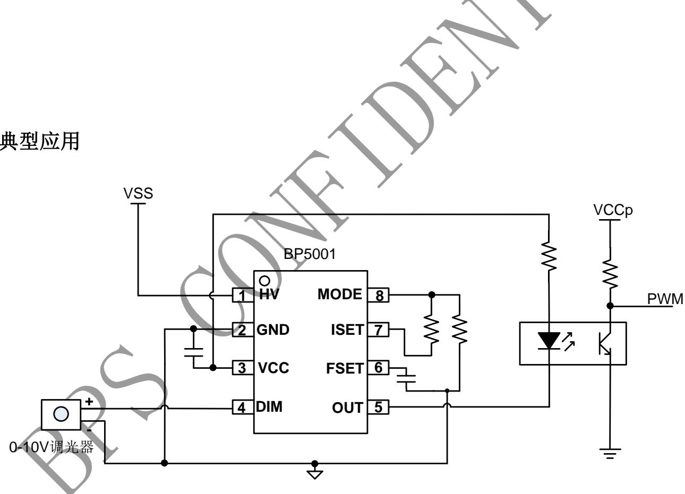
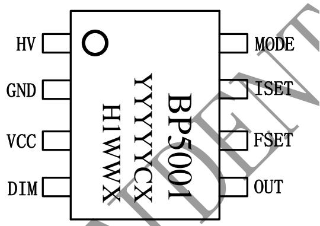
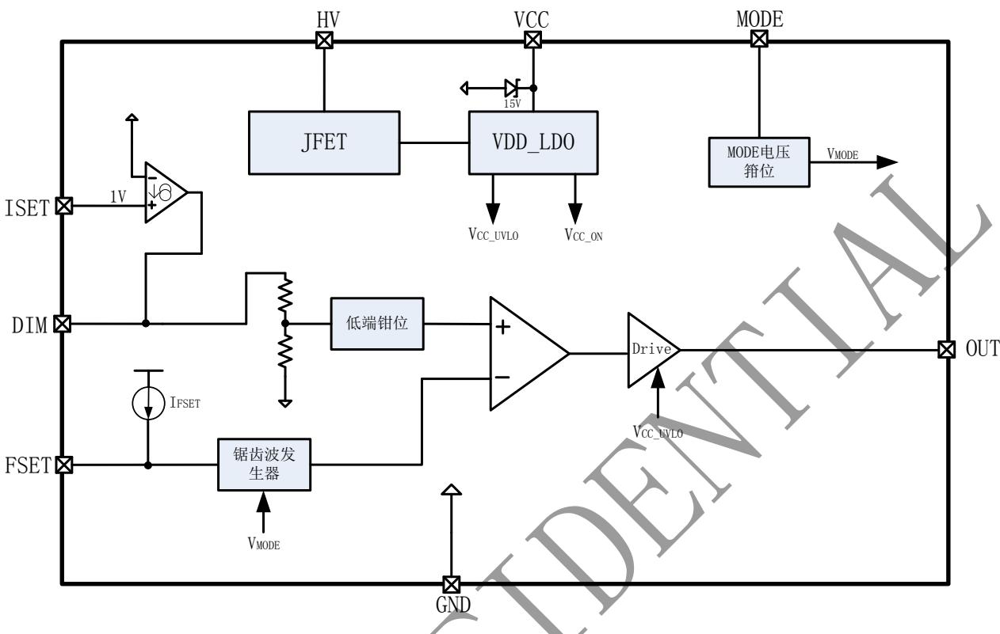
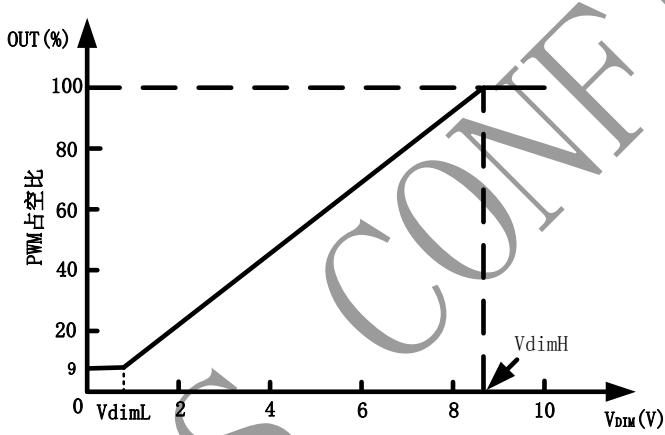
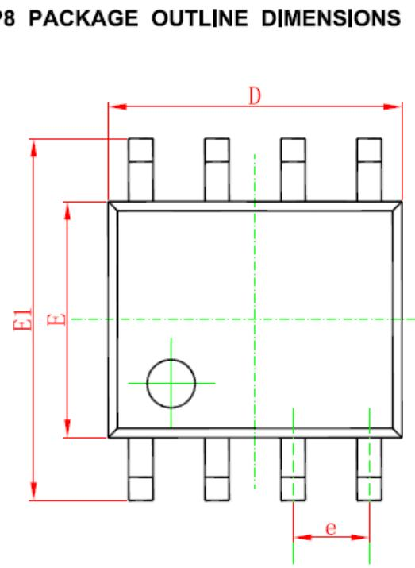
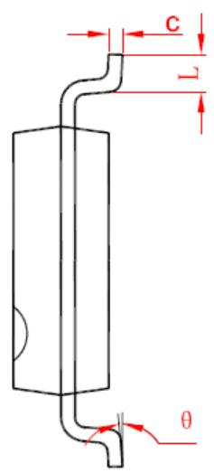
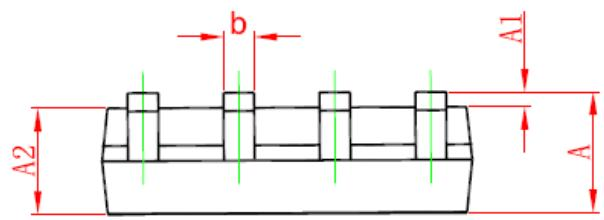

## 概述

BP5001 是一款调光接口转换芯片，能够将调光端口的 0/1-10V 信号、电阻阻值产生的电压信号转换为 PWM信号。该PWM信号可以直接用来控制 LED驱动芯片，或者经过光藕隔离，实现隔离应用的可调光应用。

BP5001 通过外置频率设定脚，可实现 PWM 的频率的灵活调节。

BP5001 通过外置调光器电流设定脚，可实现对多种无源0/1-10V调光器的兼容。

BP5001 采用 SOP-8 封装

## 特点

 兼容0/1-10V调光器/电阻调光器

 集成 500V 高压 JFET 供电

 驱动无源0/1-10V 调光器电流可调

 输出PWM频率可调

 100%亮度对应的调光电压可调

 集成过热保护

 采用 SOP-8 封装

## 应用

 LED内置/外置电源

 高性能灯具

## 典型应用

  
图 1 BP5001 典型应用图

## 定购信息

<table><tr><td>定购型号</td><td>封装</td><td>温度范围</td><td>包装形式</td><td>打印</td></tr><tr><td>BP5001</td><td>SOP-8</td><td>-40 °C到105 °C</td><td>4000pcs/盘</td><td>BP5001YYYYYCXH1WWX</td></tr></table>

## 管脚封装

YYYYY：Lot Number

C：供应商

WW：周号

X：补位

图2 管脚封装图

## 管脚描述

<table><tr><td>管脚号</td><td>管脚名称</td><td>描述</td></tr><tr><td>1</td><td>HV</td><td>高压输入脚</td></tr><tr><td>2</td><td>GND</td><td>芯片地</td></tr><tr><td>3</td><td>VCC</td><td>芯片低压供电脚</td></tr><tr><td>4</td><td>DIM</td><td>调光信号输入脚,接0/1-10V调光器或者电阻</td></tr><tr><td>5</td><td>OUT</td><td>PWM信号输出脚</td></tr><tr><td>6</td><td>FSET</td><td>PWM频率设置脚</td></tr><tr><td>7</td><td>ISET</td><td>DIM脚流出电流设置脚</td></tr><tr><td>8</td><td>MODE</td><td>用于设定100%占空比时对应的DIM脚电压</td></tr></table>

## 极限参数(注 1)

<table><tr><td>符号</td><td>参数</td><td>参数范围</td><td>单位</td></tr><tr><td> $V_{HV}$ </td><td>HV 脚输入电压</td><td>-0.3~500</td><td>V</td></tr><tr><td> $V_{CC}, V_{DIM}, V_{OUT}$ </td><td>VCC, DIM, OUT 脚输入电压</td><td>-0.3~20</td><td>V</td></tr><tr><td> $V_{FSET}, V_{ISET}, V_{MODE}$ </td><td>FSET, ISET, MODE 脚输入电压</td><td>-0.3~6</td><td>V</td></tr><tr><td> $P_{DMAX}$ </td><td>功耗(注 2)</td><td>0.45</td><td>W</td></tr><tr><td> $θ_{JA}$ </td><td>PN结到环境的热阻</td><td>145</td><td>°C/W</td></tr><tr><td> $T_J$ </td><td>工作结温范围</td><td>-40 to 150</td><td>°C</td></tr><tr><td> $T_{STG}$ </td><td>储存温度范围</td><td>-55 to 150</td><td>°C</td></tr></table>

注 1：最大极限值是指超出该工作范围，芯片有可能损坏。推荐工作范围是指在该范围内，器件功能正常，但并不完全保证满足个别性能指标。电气参数定义了器件在工作范围内并且在保证特定性能指标的测试条件下的直流和交流电参数规范。对于未给定上下限值的参数，该规范不予保证其精度，但其典型值合理反映了器件性能。

注 2：温度升高最大功耗一定会减小，这也是由 TJMAX, θJA,和环境温度 TA所决定的。最大允许功耗为 $\mathrm { P _ { D M A X } = \left( T _ { J M A X } - T _ { A } \right) / \Delta \theta _ { \mathrm { ~ J ~ } } }$ A或是极限范围给出的数字中比较低的那个值。 1

电气参数(注 3, 4) （无特别说明情况下， $\mathtt { V _ { C } } = 1 3 . 3 \mathtt { V } _ { : }$ $\mathrm { T _ { A } } = 2 5 \mathrm { \Omega } ^ { \circ } \mathrm { C } \mathrm { \Omega } )$

<table><tr><td>符号</td><td>描述</td><td>条件</td><td>最小值</td><td>典型值</td><td>最大值</td><td>单位</td></tr><tr><td colspan="7">电源电压</td></tr><tr><td> $V_{HV}$ </td><td>JFET输入电压</td><td></td><td>16</td><td></td><td>500</td><td>V</td></tr><tr><td> $I_{JFET}$ </td><td>JFET最大电流</td><td> $V_{CC}$ 下降</td><td>4.5</td><td></td><td></td><td>mA</td></tr><tr><td> $V_{CC_ON}$ </td><td> $V_{CC}$ 启动电压</td><td> $V_{CC}$ 上升</td><td></td><td>8.4</td><td></td><td>V</td></tr><tr><td> $V_{CC_OP}$ </td><td> $V_{CC}$ 工作电压</td><td></td><td></td><td>13.3</td><td></td><td>V</td></tr><tr><td> $V_{CC_UVLO}$ </td><td> $V_{CC}$ 欠压保护阈值</td><td> $V_{CC}$ 下降</td><td></td><td>7.4</td><td></td><td>V</td></tr><tr><td colspan="7">调光输入/输出</td></tr><tr><td> $I_{DIM\_SOURCING\_MAX}$ </td><td>DIM脚最大上拉电流</td><td></td><td></td><td>2</td><td></td><td>mA</td></tr><tr><td rowspan="4"> $D_{OUT}$ </td><td> $D_{OUT\_min}$ </td><td> $V_{DIM}=0.5V$ </td><td></td><td>9</td><td></td><td>%</td></tr><tr><td> $D_{OUT\_2V}$ </td><td> $V_{DIM}=2V$ </td><td></td><td>20</td><td></td><td>%</td></tr><tr><td> $D_{OUT\_7V}$ </td><td> $V_{DIM}=7V$ </td><td></td><td>70</td><td></td><td>%</td></tr><tr><td> $D_{OUT\_max}$ </td><td> $V_{DIM}=10.5V$ </td><td></td><td>100</td><td></td><td>%</td></tr><tr><td colspan="7">频率,电流和模式设置</td></tr><tr><td> $I_{FSET}$ </td><td>FSET引脚充电电流</td><td></td><td></td><td>9.5</td><td></td><td>uA</td></tr><tr><td> $V_{ISET}$ </td><td>ISET引脚电压</td><td></td><td></td><td>1</td><td></td><td>V</td></tr><tr><td colspan="7">过热调节</td></tr><tr><td> $T_{SD}$ </td><td>过温关断点</td><td></td><td></td><td>150</td><td></td><td>°C</td></tr></table>

注 3：典型参数值为 25˚C 下测得的参数标准。  
注 4：规格书的最小、最大规范范围由测试保证，典型值由设计、测试或统计分析保证。

图 3 BP5001 内部框图

## 内部结构框图

## 应用信息

BP5001 是一款调光接口转换芯片，能够将调光端口的 0/1-10V 信号、电阻产生的电压信号转换为PWM 信号。该PWM信号可以直接用来控制 LED驱动芯片，或者经过光耦隔离，实现隔离应用的可调光应用。

BP5001 通过外置频率设定脚，可实现 PWM 频率的灵活调节。

BP5001 通过外置调光器电流设定脚，可实现对多种无源 0/1-10V调光器的兼容。

## 1. 启动和供电

系统上电后，负载电压通过高压集成 JFET 给 V电容充电，当 $\mathrm { V _ { C C } }$ 电压达到芯片开启阈值时，芯片内部振荡电路开始工作。但此时 OUT 脚会被默认拉高为高电平，保证前级电路能够正常工作。

为了能够提供 0/1-10V 调光器正常工作所需的电

流，VCC电压会被稳定在13.3V左右。

一旦 VCC 电压掉到 UVLO 电压（7.4V），芯片停止工作，OUT脚电压会被拉高。

## 2. DIM 脚电流设置

ISET脚的电平固定为1V。根据不同的无源调光器，用户可通过修改ISET脚的电阻，灵活设置DIM脚向调光器输出的供电电流，从而提高对调光器的兼容性。

DIM 脚输出电流的计算公式为：

$$
I _ {D I M} = \frac {1 V}{R _ {I S E T} + R _ {M O D E}} * 4
$$

其中，RMODE 为 MODE 脚电阻；RISET 为 ISET 脚电阻。

## 3. MODE 脚电压设置

通过对 ISET 引脚的 1V 电平进行电阻分压，可获得 MODE脚的电压。

$$
V _ {M O D E} = \frac {R _ {M O D E}}{R _ {I S E T} + R _ {M O D E}} * 1 V
$$

MODE 脚电压决定内部锯齿波的最大值以及 DIM 电压低端箝位，并通过比较锯齿波和 DIM 电压，决定调光区间上下限及最小 PWM 占空比，最终输出具有最小占空比限制的 PWM波形。

调光区间上下限和MODE电压的关系为：

$$
V _ {d i m L} = V _ {M O D E} = \frac {R _ {M O D E} * 1 V}{(R _ {I S E T} + R _ {M O D E})}
$$

$$
V _ {d i m H} = \frac {V _ {M O D E}}{0 . 0 9} = \frac {R _ {M O D E} * 1 V}{\left(R _ {I S E T} + R _ {M O D E}\right) * 0 . 0 9}
$$

其中，RMODE为 MODE 脚电阻； $\mathrm { R } _ { \mathrm { I S E T } }$ 为 ISET脚电阻。

通过 $\operatorname { I } _ { \mathrm { D I M } }$ 和 $\mathrm { V _ { d i m L } }$ 或 $\mathrm { V _ { d i m H } }$ 可确定 $\mathrm { R _ { M O D E } }$ 和 $\mathrm { R } _ { \mathrm { I S E T } ^ { \mathrm { ~ < ~ } } }$

## 4. DIM脚电压和PWM信号占空比关系

DIM脚电压和OUT脚输出PWM信号占空比关系曲线如下：

其中， $\mathsf { V } _ { \mathrm { d i m } } \mathcal { \hat { Q } } \mathsf { J } \mathrm { O U T }$ 脚输出PWM 最小占空比时对应的DIM 脚电压，VdimH为 OUT 脚输出 100%占空比时对应的 DIM脚电压。PWM最小占空比固定为 9%。

## 5. PWM 频率设置

BP5001内部通过一个恒定的电流源对FSET脚上的电容充电，充电的时间长短由充电电流、充电电容和 MODE脚电压共同决定。

PWM 频率计算公式为：

$$
f _ {O U T} = \frac {2 * 1 0 ^ {- 6}}{C _ {F S E T} * \frac {R _ {M O D E}}{R _ {I S E T} + R _ {M O D E}}}
$$

其中， $\mathrm { C } _ { \mathrm { F S E T } }$ 为 FSET 脚电容,单位 nF；RMODE 为 MODE脚电阻； RISET为 ISET 脚电阻。 $\mathrm { \Phi _ { f o u t } }$ 单位为 Hz。

## 6. 过热保护

BP5001 内部集成过热保护功能，一旦芯片触发过温保护，OUT脚会被拉高，通过减少OUT脚的驱动电流来减少芯片的损耗。

## 7. PCB 设计

在设计 BP5001 PCB时，需要遵循以下指南：VCC 旁路电容

VCC 的旁路电容需要紧靠芯片 VCC和 GND引脚。FSET 电容

频率设置电容需要尽量靠近芯片 FSET引脚。

## 封装信息

<table><tr><td rowspan="2">Symbol</td><td colspan="2">Dimensions In Millimeters</td><td colspan="2">Dimensions In Inches</td></tr><tr><td>Min</td><td>Max</td><td>Min</td><td>Max</td></tr><tr><td>A</td><td>1.350</td><td>1.750</td><td>0.053</td><td>0.069</td></tr><tr><td>A1</td><td>0.100</td><td>0.250</td><td>0.004</td><td>0.010</td></tr><tr><td>A2</td><td>1.350</td><td>1.550</td><td>0.053</td><td>0.061</td></tr><tr><td>b</td><td>0.330</td><td>0.510</td><td>0.013</td><td>0.020</td></tr><tr><td>c</td><td>0.170</td><td>0.250</td><td>0.006</td><td>0.010</td></tr><tr><td>D</td><td>4.700</td><td>5.100</td><td>0.185</td><td>0.200</td></tr><tr><td>E</td><td>3.800</td><td>4.000</td><td>0.150</td><td>0.157</td></tr><tr><td>E1</td><td>5.800</td><td>6.200</td><td>0.228</td><td>0.244</td></tr><tr><td>e</td><td colspan="2">1.270 (BSC)</td><td colspan="2">0.050 (BSC)</td></tr><tr><td>L</td><td>0.400</td><td>1.270</td><td>0.016</td><td>0.050</td></tr><tr><td>θ</td><td> $0^{\circ}$ </td><td> $8^{\circ}$ </td><td> $0^{\circ}$ </td><td> $8^{\circ}$ </td></tr></table>