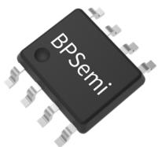
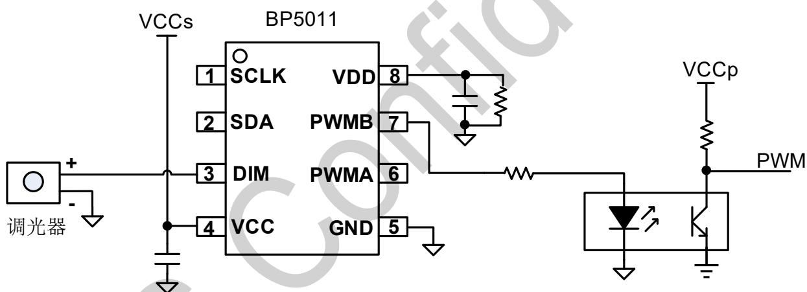
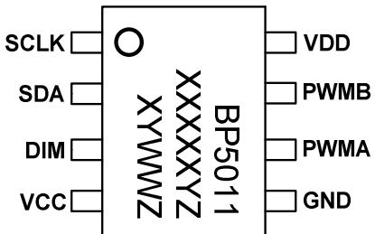
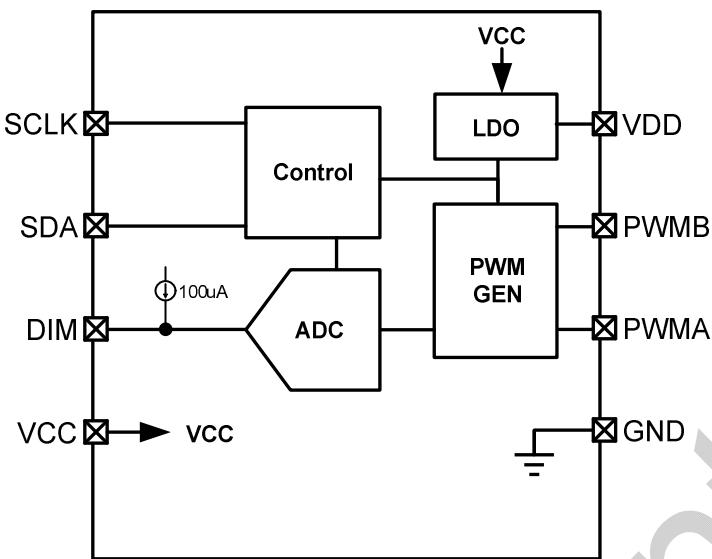
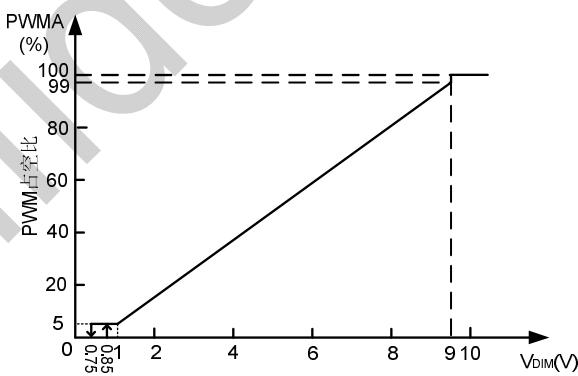
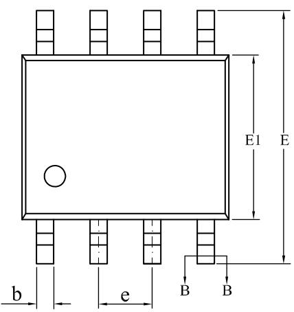
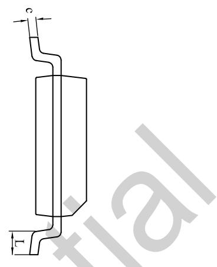
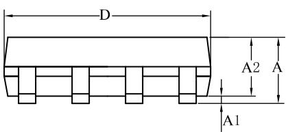
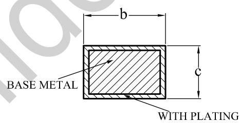

## 概述

BP5011 是一款三合一调光接口转换芯片，能够将调光端口的模拟电压或 PWM 信号直接转换为 PWM 信号。转换后的 PWM 信号可以直接用来控制 LED 驱动芯片，或者经过光耦隔离，实现隔离调光方案的应用。

BP5011 通过外置电阻，可灵活设置光耦的驱动电流。

BP5011 采用 SOP-8 封装。

  
SOP-8 封装

## 特点

 兼容 0-10V 调光器/电阻调光器/PWM 调光器

 极简的外围电路

 集成过热保护

 采用 SOP-8 封装

 ⽀持两路 PWM 互补输出

 ⽀持 Dim-to-off 调灭功能

## 应用领域

 0/1-10V 调光灯具

 路灯电源

## 典型应用

  
图 1 BP5011 典型应用电路

定购信息

<table><tr><td>定购型号</td><td>封装</td><td>包装形式</td><td>打印</td></tr><tr><td>BP5011</td><td>SOP-8</td><td>卷盘4,000/盘</td><td>BP5011XXXXXYZYWWZ</td></tr></table>

## 管脚封装

  
BP5011：产品型号  
图 2 管脚封装图

XXXXXY：批次

XY：标识

WW：周号

Z：预留

## 管脚描述

<table><tr><td>管脚号</td><td>管脚名称</td><td>描述</td></tr><tr><td>1</td><td>SCLK</td><td>内部引脚,应用时悬空</td></tr><tr><td>2</td><td>SDA</td><td>内部引脚,应用时悬空</td></tr><tr><td>3</td><td>DIM</td><td>调光信号输入脚,接0-10V调光器、电阻或PWM调光器</td></tr><tr><td>4</td><td>VCC</td><td>芯片供电。快速上下电需要确保VCC电压下降至1.5V以下,再进行上电;VCC电容电容根据实际测试选择。</td></tr><tr><td>5</td><td>GND</td><td>芯片地</td></tr><tr><td>6</td><td>PWMA</td><td>PWM输出A,DIM电压越高,PWMA占空比越大</td></tr><tr><td>7</td><td>PWMB</td><td>PWM输出B,与PWMA输出占空比互补</td></tr><tr><td>8</td><td>VDD</td><td>芯片内部数字电源,输出5V。必须要外挂一个滤波电容。</td></tr></table>

## 极限参数(注 1)

<table><tr><td>符号</td><td>参数</td><td>参数范围</td><td>单位</td></tr><tr><td>VCC</td><td>VCC输入电压</td><td>-0.3~40</td><td>V</td></tr><tr><td>DIM</td><td>DIM输入电压</td><td>-0.3~40</td><td>V</td></tr><tr><td>VDD</td><td>VDD输入电压</td><td>-0.3~5.5</td><td>V</td></tr><tr><td>PWMA</td><td>PWMA输入电压</td><td>-0.3~5.5</td><td>V</td></tr><tr><td>PWMB</td><td>PWMB输入电压</td><td>-0.3~5.5</td><td>V</td></tr><tr><td> $P_{DMAX}$ </td><td>功耗(注2)</td><td>0.45</td><td>W</td></tr><tr><td> $\theta_{JA}$ </td><td>结到环境的热阻(注3)</td><td>145</td><td>°C/W</td></tr><tr><td> $T_J$ </td><td>工作结温范围</td><td>-40~105</td><td>°C</td></tr><tr><td> $T_{STG}$ </td><td>储存温度范围</td><td>-55~150</td><td>°C</td></tr></table>

注 1：最大极限值是指超出该工作范围，芯片有可能损坏。推荐工作范围是指在该范围内，器件功能正常，但并不完全保证满⾜个别性能指标。电⽓参数定对于未给定上下限值的参数，该规范不予保证其精度，但其典型值合理反映了器件性能。

注 2：温度升高最大功耗一定会减小，这也是由 T , θ ,和环境温度T 所决定的。最大允许功耗为 $\mathsf { P } _ { \mathsf { D M A X } } = ( \mathsf { T } _ { \mathsf { J M A X } } - \mathsf { T } _ { \mathsf { A } } ) /$ θJA或是极限范围给出的数字中比较低的那个值。

注 3：1平方英寸双层 PCB板，按照JEDEC 标准测试。

电⽓参数(注 4)（无特别说明情况下， ${ \sf T } _ { \sf A } = 2 5 ^ { \circ } { \sf C } )$

<table><tr><td>符号</td><td>描述</td><td>条件</td><td>最小值</td><td>典型值</td><td>最大值</td><td>单位</td></tr><tr><td colspan="7">VCC 电源电压</td></tr><tr><td> $I_{CC\_QUIESCENT}$ </td><td>芯片静态工作电流</td><td> $V_{CC}=5V$ ,无开关动作</td><td></td><td>3.5</td><td>5</td><td>mA</td></tr><tr><td> $V_{CC\_OP}$ </td><td>VCC 工作电压</td><td> $V_{CC}$ 上升</td><td>11</td><td>12</td><td>40</td><td>V</td></tr><tr><td colspan="7">VDD 电压</td></tr><tr><td> $V_{DD}$ </td><td>VDD 输出电压</td><td></td><td>4.5</td><td>5</td><td>5.5</td><td>V</td></tr><tr><td> $I_{DD\_SOURCE}$ </td><td>VDD 最大输出电流</td><td></td><td>10</td><td></td><td>15</td><td>mA</td></tr><tr><td colspan="7">DIM 引脚输入</td></tr><tr><td> $I_{DIM\_SOURCING}$ </td><td>DIM 脚上拉电流</td><td></td><td>92</td><td>100</td><td>108</td><td>μA</td></tr><tr><td> $F_{PWM}$ </td><td>DIM 脚 PWM 频率范围</td><td></td><td>200</td><td></td><td>10000</td><td>Hz</td></tr><tr><td> $D_{PWM}$ </td><td>PWM 最大占空比</td><td></td><td></td><td></td><td>99.9</td><td>%</td></tr><tr><td> $V_{PWM\_ON}$ </td><td>PWM 高电平有效</td><td>PWM 上升</td><td></td><td></td><td>2</td><td>V</td></tr><tr><td> $V_{PWM\_OFF}$ </td><td>PWM 低电平有效</td><td>PWM 下降</td><td>1</td><td></td><td></td><td>V</td></tr><tr><td colspan="7">PWM 引脚输出</td></tr><tr><td> $V_{PWM\_H}$ </td><td>PWM 引脚高电平</td><td></td><td>4.5</td><td>5</td><td>5.5</td><td>V</td></tr><tr><td> $V_{PWM\_L}$ </td><td>PWM 引脚低电平</td><td></td><td></td><td></td><td>0.5</td><td>V</td></tr><tr><td> $I_{PWM}$ </td><td>PWM 驱动能力</td><td></td><td>5</td><td></td><td>10</td><td>mA</td></tr><tr><td> $F_{PWM}$ </td><td>PWM 频率</td><td></td><td>0.95</td><td>1</td><td>1.05</td><td>kHz</td></tr></table>

注 4：规格书的最小、最大规范范围由测试保证，典型值由设计、测试或统计分析保证。

## 内部结构框图

  
图 3 BP5011 内部框图

## 功能描述

BP5011 是一款调光接口转换芯片，能够将调光端口的 0-10V信号、电阻两端电压信号或者 PWM 信号转换为 PWM 信号。转换后的 PWM 信号可以直接用来控制 LED 驱动芯片，或者经过光耦隔离，实现隔离调光方案应用。

BP5011 的 PWM 频率固定为 1kHz，调光器驱动电流 100μA。可兼容无源 0-10V 调光器和电位器。

## 启动和供电

系统上电后，当 VCC 电压达到芯片开启阈值时，芯片内部振荡电路开始工作。为了能够提供 0-10V 调光器正常工作所需的电流，VCC 电压需大于 11V 左右。

一旦 VDD 电压掉到 UVLO 电压，芯片停止工作，PWM 脚电压会被拉低。

DIM脚电压和PWM信号占空比关系

DIM 脚电压和 OUT 脚输出 PWM 信号占空比关系曲线如下：

## PCB Layout 指南

在设计 BP5011 应用 PCB时，需要遵循以下建议：

1) VCC 的旁路电容需要紧靠芯片 VCC 和 GND 引脚，避免系统噪声干扰。

2) VDD 电容应靠近芯片引脚，避免系统噪声干扰。

3) 一般情况下建议在 DIM 引脚旁边放置一颗旁路电容， 滤除噪声。

WITH PLATING

## 封装信息

  
SOP-8 封装外形尺寸

  
SECTION B-B

<table><tr><td rowspan="2">SYMBOL</td><td colspan="3">MILLIMETER</td></tr><tr><td>MIN</td><td>NOM</td><td>MAX</td></tr><tr><td>A</td><td>1.30</td><td>—</td><td>1.80</td></tr><tr><td>A1</td><td>0.05</td><td>—</td><td>0.25</td></tr><tr><td>A2</td><td>1.25</td><td>1.40</td><td>1.65</td></tr><tr><td>b</td><td>0.33</td><td>—</td><td>0.51</td></tr><tr><td>c</td><td>0.17</td><td>—</td><td>0.25</td></tr><tr><td>D</td><td>4.70</td><td>4.90</td><td>5.10</td></tr><tr><td>E</td><td>5.80</td><td>6.00</td><td>6.30</td></tr><tr><td>E1</td><td>3.70</td><td>3.90</td><td>4.10</td></tr><tr><td>e</td><td colspan="3">1.27BSC</td></tr><tr><td>L</td><td>0.40</td><td>—</td><td>1.00</td></tr></table>

## 版本信息

<table><tr><td>版本</td><td>日期</td><td>记录</td></tr><tr><td>Rev.1.0</td><td>2020/12</td><td>首次发行</td></tr><tr><td>Rev.1.1</td><td>2020/12</td><td>更新内部框图</td></tr><tr><td>Rev.1.2</td><td>2021/04</td><td>更新 DIM 脚电压和 PWM 信号占空比曲线</td></tr><tr><td>Rev.1.3</td><td>2022/11</td><td>更新 VCC 部分参数</td></tr><tr><td>Rev.1.4</td><td>2024/06</td><td>删除电气参数表中的 VCC UVLO 和过温保护;更新电气参数表中参数。更新文档模板。</td></tr><tr><td>Rev.1.5</td><td>2025/02</td><td>更新管脚描述部分内容,要求“快速上下电需要确保 VCC 电压下降至 1.5V 以下”。</td></tr></table>

## 免责声明

晶丰明源尽⼒确保本产品规格书内容的准确和可靠，但是保留在没有通知的情况下，修改规格书内容的权利。

本产品规格书未包含任何针对晶丰明源或第三方所有的知识产权的授权。针对本产品规格书所记载的信息，晶丰明源不做任何明⽰或暗⽰的保证，包括但不限于对规格书内容的准确性、商业上的适销性、特定⽬的的适用性或者不侵犯晶丰明源或任何第三⼈知识产权做任何明⽰或暗⽰保证，晶丰明源也不就因本规格书本⾝及其使用有关的偶然或必然损失承担任何责任。