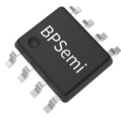
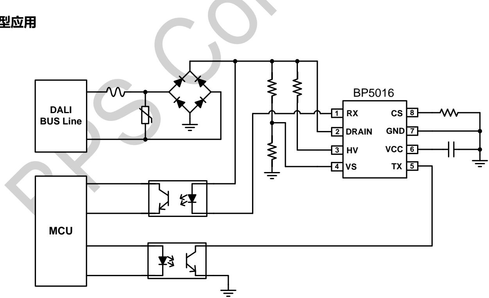
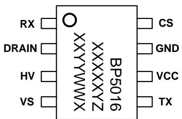
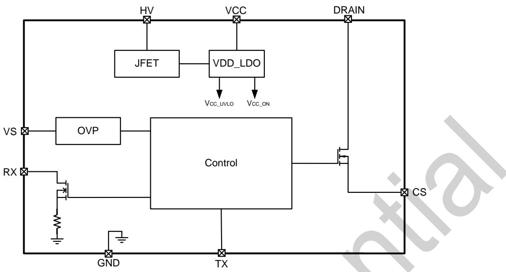
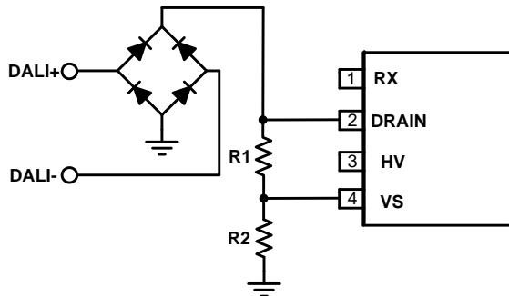
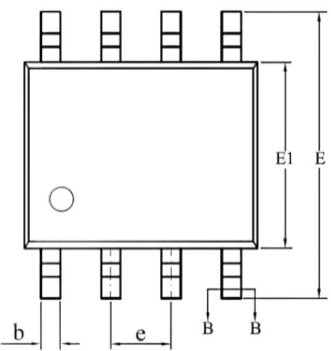
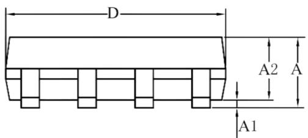
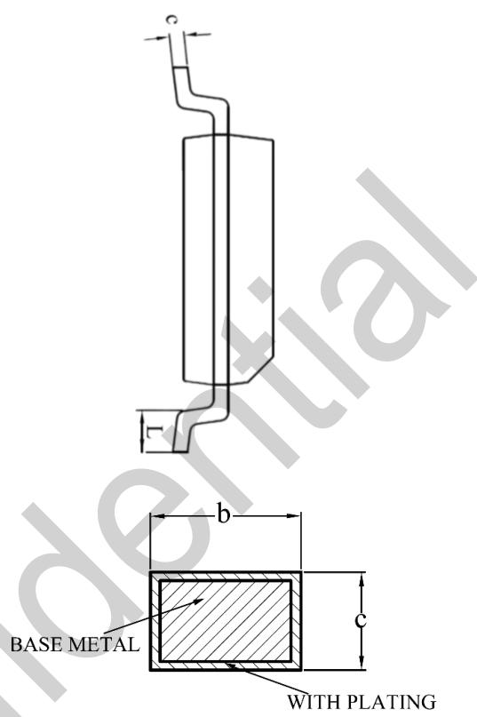

## 概述

BP5016 是一款高集成度，兼容 DALI 2.0 协议，支持 Push 调光功能的 DALI 通讯接口控制器。

BP5016 芯片集成高压供电方式，只需要很少的外围元件，即可实现电平转换功能，极大的节约了系统成本和体积。

BP5016具有多重保护功能，包括总线输入过压保护、CS过流保护和芯片温度过热调节等。

BP5016 采用 SOP-8 封装。

  
SOP-8 封装

## 特点

◼ 兼容 DALI 2.0 协议

◼ 支持 Push 调光功能

◼ 集成 700V 高压 JFET 供电

◼ 集成 650V 高压 MOS

◼ 高精度电流设置

◼ DALI 总线输入过压保护

◼ CS过流保护

◼ 芯片温度过热调节

◼ 采用 SOP-8 封装

## 应用领域

◼ DALI 调光

◼ 室内照明

◼ 户外照明

◼ 其它 LED 照明

## 典型应用

  
图 1. BP5016 典型应用电路

## 定购信息

<table><tr><td>定购型号</td><td>封装</td><td>包装形式</td><td>打印</td></tr><tr><td>BP5016</td><td>SOP-8</td><td>卷盘4000颗/盘</td><td>BP5016XXXXXYZXYYYWWX</td></tr></table>

## 管脚封装

  
BP5016：产品型号  
XXXXXYZ: 批次号  
XXYY: 标识  
WW：周号  
X：预留

图 2. SOP-8 管脚封装图

## 管脚描述

<table><tr><td>管脚号</td><td>管脚名称</td><td>描述</td></tr><tr><td>1</td><td>RX</td><td>信号接收端</td></tr><tr><td>2</td><td>DRAIN</td><td>内置高压 MOS 漏极</td></tr><tr><td>3</td><td>HV</td><td>高压供电输入端</td></tr><tr><td>4</td><td>VS</td><td>输入电压检测输入端</td></tr><tr><td>5</td><td>TX</td><td>信号发送端</td></tr><tr><td>6</td><td>VCC</td><td>芯片电源</td></tr><tr><td>7</td><td>GND</td><td>芯片地</td></tr><tr><td>8</td><td>CS</td><td>电流采样端</td></tr></table>

## 极限参数(注 1)

<table><tr><td>符号</td><td>参数</td><td>参数范围</td><td>单位</td></tr><tr><td>HV</td><td>高压供电输入端</td><td>-0.3~700</td><td>V</td></tr><tr><td>DRAIN</td><td>内置高压 MOS 漏极</td><td>-0.3~650</td><td>V</td></tr><tr><td>RX</td><td>信号接收端</td><td>-0.3~500</td><td>V</td></tr><tr><td>TX</td><td>信号发送端</td><td>-0.3~40</td><td>V</td></tr><tr><td>VCC</td><td>芯片电源端</td><td>-0.3~40</td><td>V</td></tr><tr><td>CS</td><td>电流采样端</td><td>-0.3~7</td><td>V</td></tr><tr><td>VS</td><td>输入电压信号采样端</td><td>-0.3~7</td><td>V</td></tr><tr><td> $P_{DMAX}$ </td><td>功耗(注2)</td><td>0.45</td><td>W</td></tr><tr><td> $\theta_{JA}$ </td><td>PN结到环境的热阻(注3)</td><td>145</td><td>°C/W</td></tr><tr><td> $T_J$ </td><td>工作结温范围</td><td>-40~150</td><td>°C</td></tr><tr><td> $T_{STG}$ </td><td>储存温度范围</td><td>-55~150</td><td>°C</td></tr></table>

注 大极 值 指超出该 作范 芯片有 能损坏 推荐 作范 指在该范 内 件功能 常 但并 完全保证满 别性能指标 电气参数定义了器件在工作范围内并且在保证特定性能指标的测试条件下的直流和交流电参数规范。对于未给定上下限值的参数，该规范不予保证其精度，但其典型值合理反映了器件性能。

注 2：温度升高最大功耗一定会减小，这也是由 TJMAX, θJA,和环境温度TA所决定的。最大允许功耗为PDMAX = (TJMAX - TA)/ θJA或是极限范围给出的数字中比较低的那个值。

注 3：1 平方英寸双层PCB 板，按照JEDEC标准测试。

电气参数(注 4) （无特别说明情况下， ${ \mathsf { V C C } } = 8 { \mathsf { V } } _ { \cdot }$ ${ \bar { \mathsf { T } } } _ { \mathsf { A } } = 2 5 ^ { \circ } { \mathsf { C } } )$

<table><tr><td>符号</td><td>描述</td><td>条件</td><td>最小值</td><td>典型值</td><td>最大值</td><td>单位</td></tr><tr><td colspan="7">电源</td></tr><tr><td> $I_{OP}$ </td><td>HV工作电流</td><td>无信号传输</td><td>210</td><td>240</td><td>270</td><td>μA</td></tr><tr><td> $V_{CC_ON}$ </td><td>VCC启动阈值</td><td></td><td>6.2</td><td>6.6</td><td>7.0</td><td>V</td></tr><tr><td> $V_{CC_UVLO}$ </td><td>VCC欠压阈值</td><td></td><td>4.8</td><td>5.1</td><td>5.4</td><td>V</td></tr><tr><td colspan="7">电流采样基准</td></tr><tr><td> $V_{CS_REF}$ </td><td>电流检测基准电压</td><td></td><td>0.47</td><td>0.5</td><td>0.53</td><td>V</td></tr><tr><td> $V_{CS_OCP}$ </td><td>CS逐周期限流阈值</td><td></td><td>0.7</td><td>0.8</td><td>0.9</td><td>V</td></tr><tr><td colspan="7">检测保护阈值</td></tr><tr><td> $V_{VS_OVP}$ </td><td>VS过压保护阈值</td><td></td><td>2.7</td><td>3</td><td>3.3</td><td>V</td></tr><tr><td> $V_{VS_TH}$ </td><td>VS信号检测阈值</td><td></td><td>0.5</td><td>0.53</td><td>0.56</td><td>V</td></tr><tr><td colspan="7">驱动</td></tr><tr><td> $I_{RX}$ </td><td>RX内置下拉电流</td><td></td><td>1.08</td><td>1.2</td><td>1.32</td><td>mA</td></tr><tr><td colspan="7">功率MOSFET</td></tr><tr><td> $R_{DS_ON}$ </td><td>功率管导通阻抗</td><td> $V_{GS}=10V/ I_{DS}=1.0A$ </td><td></td><td></td><td>5.7</td><td>Ω</td></tr><tr><td> $BV_{DSS}$ </td><td>功率管的击穿电压</td><td> $V_{GS}=0V/ I_{DS}=250μA$ </td><td>650</td><td></td><td></td><td>V</td></tr><tr><td> $I_{DSS}$ </td><td>功率管漏电流</td><td> $V_{GS}=0V/V_{DS}=650V$ </td><td></td><td></td><td>1</td><td>μA</td></tr><tr><td colspan="7">过热调节</td></tr><tr><td> $T_{REG}$ </td><td>过热调节点</td><td></td><td></td><td>140</td><td></td><td>°C</td></tr></table>

注 4：电气参数定义了器件在工作范围内并且在保证特定性能指标的测试条件下的直流电参数规范。最小值和最大值由测试保证，典型值由设计、测试或统计分析保证。对于未给定上下限值的参数，该规范不予保证其精度，但其典型值合理反映了器件性能。

## 内部结构框图

  
图 3. BP5016 内部框图

## 功能描述

BP5016是一款高集成度，兼容DAL2.0协议，支持Push调光功能的 DALI 通讯接口控制器。

BP5016 芯片集成高压供电方式，只需要很少的外围元件，即可实现电平转换功能，极大的节约了系统成本和体积。

## 启动

系统上电后，DALI 总线电压经整流后通过集成高压 JFET 给VCC 电容充电，当 VCC 电压达到芯片开启阈值时 ，芯片开始工作。

一旦 VCC 电压掉到 UVLO 电压，芯片停止工作。

## 信号传输

芯片主要通过RX信号接收引脚和TX信号发送引脚的逻辑控制经光耦隔离后实现 DALI 总线和单片机之间的信号传输。

## CS 脚电流设置

芯片CS脚用于设置高压功率MOS的导通工作电流，工作电流由外部 CS脚采样电阻决定。工作电流的计算公式为：

$$
I _ {\mathrm{DRAIN}} = \frac {V _ {C S \_ R E F}}{R _ {C S}} (m A)
$$

其中， $V _ { C S \_ R E F }$ 为电流检测基准电压；

$\mathsf { R c s }$ 为电流采样电阻阻值。

输入过压保护电阻设置

VS 引脚用来检测输入过压保护。OVP 的上下分压电阻比例可以设置为：

$$
V _ {O V P} = \frac {R 1 + R 2}{\mathrm{R} 2} \times V _ {V S \_ O V P}
$$

其中，R2 是 VS 下分压电阻；

R1 是 VS 上分压电阻；

VVS\_OVP 是芯片 VS 引脚过压保护阈值；

V 是输入电压过压保护设定点。

  
图 4. VS输入过压保护线路图

过热保护

BP5016 内部集成过热保护功能，一旦芯片触发过热保护，CS限流基准电压会降低，通过减小功率MOS的工作电流以降低芯片的损耗。

PCB Layout 指南

在设计 BP5016 PCB 时，需要遵循以下指南：

1) VCC电容需要尽量靠近芯片 VCC 和 GND 引脚。

2) 信号传输光耦引脚尽量靠近芯片 RX和 TX引脚。

3) VS 引脚电阻到芯片 GND 脚的连线应尽可能短，考虑Push 调光时 DRAIN 和 HV 端高压因素，VS 引脚电阻尽量远离 HV 和 DRAIN 引脚及走线。

4) 电流采样电阻到芯片 CS引脚的走线尽量短。

## 封装信息

<table><tr><td rowspan="2">SYMBOL</td><td colspan="3">MILLIMETER</td></tr><tr><td>MIN</td><td>NOM</td><td>MAX</td></tr><tr><td>A</td><td>1.30</td><td>—</td><td>1.80</td></tr><tr><td>A1</td><td>0.05</td><td>—</td><td>0.25</td></tr><tr><td>A2</td><td>1.25</td><td>1.40</td><td>1.65</td></tr><tr><td>b</td><td>0.33</td><td>—</td><td>0.51</td></tr><tr><td>c</td><td>0.17</td><td>—</td><td>0.25</td></tr><tr><td>D</td><td>4.70</td><td>4.90</td><td>5.10</td></tr><tr><td>E</td><td>5.80</td><td>6.00</td><td>6.20</td></tr><tr><td>E1</td><td>3.70</td><td>3.90</td><td>4.10</td></tr><tr><td>e</td><td colspan="3">1.27BSC</td></tr><tr><td>L</td><td>0.40</td><td>—</td><td>1.00</td></tr></table>

SOP-8 封装外形尺寸  
  
SECTION B-B

## 版本信息

<table><tr><td>版本</td><td>日期</td><td>记录</td></tr><tr><td>Rev. 0.9</td><td>2023/05</td><td>首次发行</td></tr><tr><td></td><td></td><td></td></tr><tr><td></td><td></td><td></td></tr><tr><td></td><td></td><td></td></tr></table>

## 免责声明

晶丰明源尽力确保本产品规格书内容的准确和可靠，但是保留在没有通知的情况下，修改规格书内容的权利。

本产品规格书未包含任何针对晶丰明源或第三方所有的知识产权的授权。针对本产品规格书所记载的信息，晶丰明源不做任何明示或暗示的保证，包括但不限于对规格书内容的准确性、商业上的适销性、特定目的的适用性或者不侵犯晶丰明源或任何第三人知识产权做任何明示或暗示保证，晶丰明源也不就因本规格书本身及其使用有关的偶然或必然损失承担任何责任。