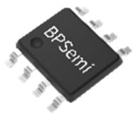
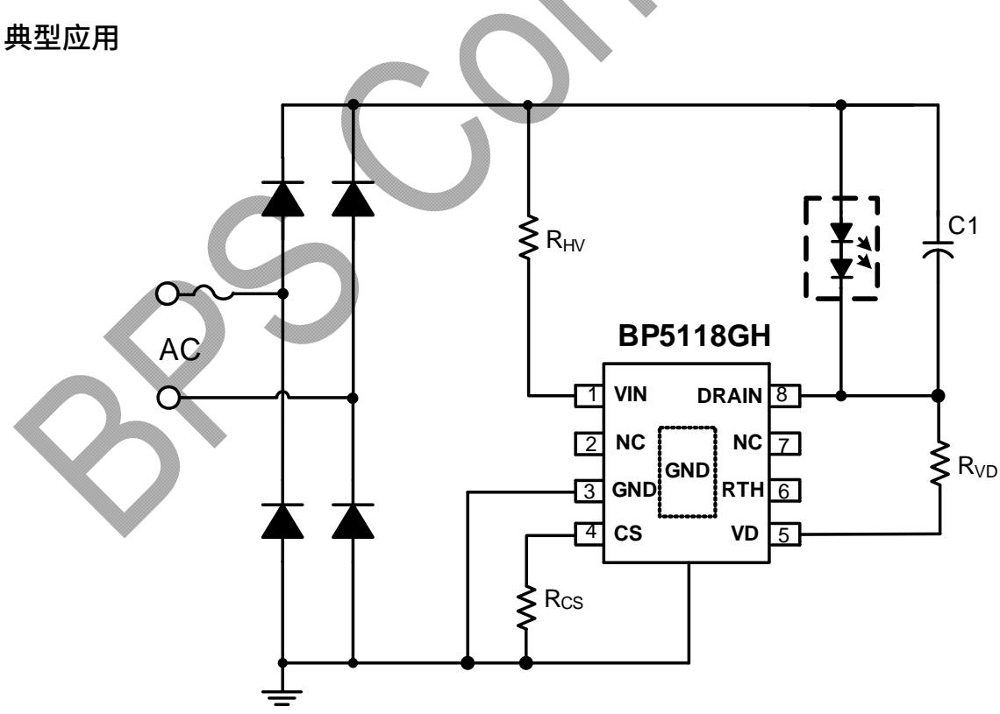
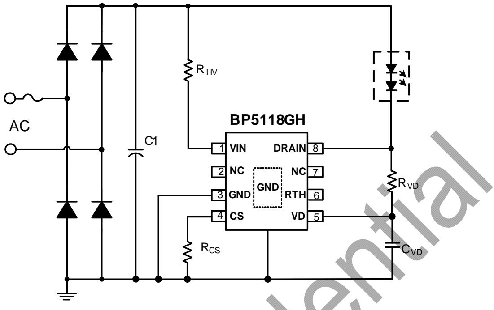
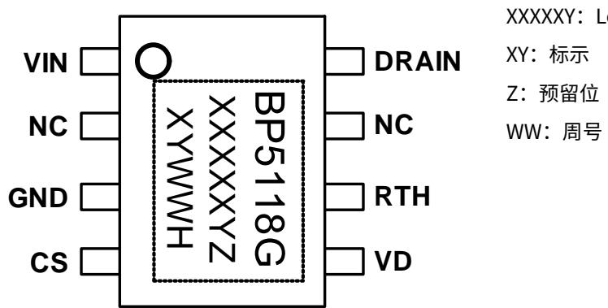
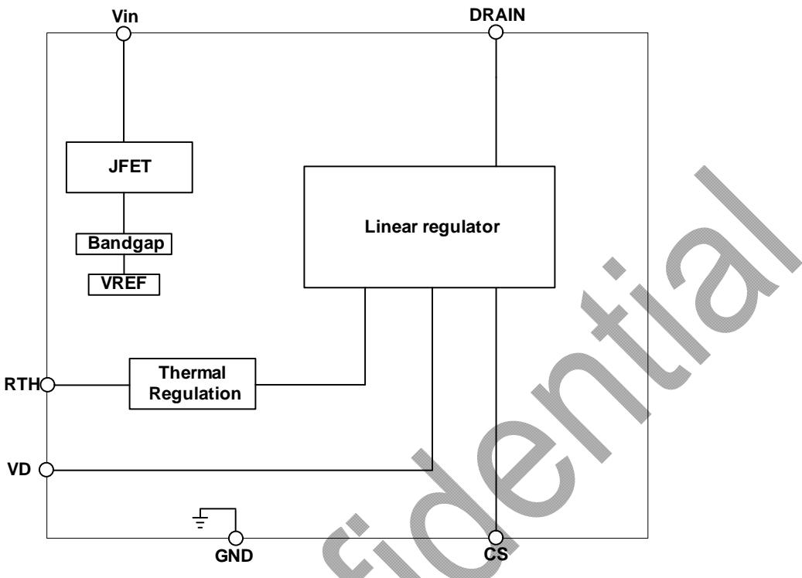
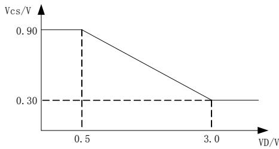
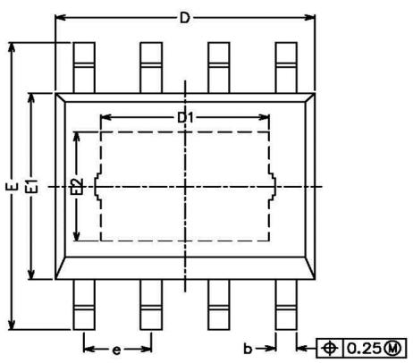
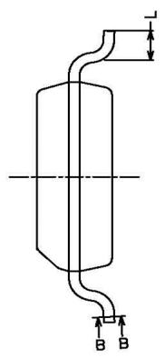
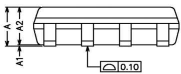
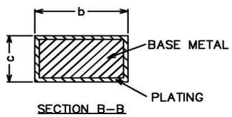

## 概述

BP5118GH 是一款高度集成、高精度单段线性 LED 恒流驱动芯片。主要用于市电输入的高功率因数的各类光源和灯具的驱动，同时具有良好的线性调整率。基于线性恒流技术的 BP5118GH，可以省去电解电容和磁性元件，有助于 LED 驱动器实现小体积、长寿命，并符合 EMI 标准。

BP5118GH 可以通过外部电阻精确地设定 LED 电流，芯片通过优化不同输入电压下的输入电流，可以减小芯片的损耗，优化系统效率。

BP5118GH 具有过温调节功能。当芯片温度过高时，将降低输出电流。

BP5118GH 采用 SOP8-EP 封装

## 特点

■ 外围电路简单，驱动器体积小

■ 良好的线性调整率

■ 内置 500V 高压 MOS 管

■ 集成高压启动线路，超快 LED 启动

■ ±5% LED 输出电流精度

■ LED 电流可外部设定

内置过温调节功能

■ 采用 SOP8-EP 封装

## 应用

■ GU10/E27 LED 球泡灯、筒灯

■ LED 吸顶灯

■ 其它 LED 照明

## 典型应用

  
图 1 BP5118GH HPF 典型应用图

  
图 2 BP5118GH LPF 典型应用图

## 定购信息

<table><tr><td>定购型号</td><td>封装</td><td>包装形式</td><td>打印</td></tr><tr><td>BP5118GH</td><td>SOP8_EP</td><td>编带4,000 颗/盘</td><td>BP5118GXXXXXYZYWWH</td></tr></table>

  
图 3 管脚封装图

## 管脚描述

<table><tr><td>管脚号</td><td>管脚名称</td><td>描述</td></tr><tr><td>1</td><td>VIN</td><td>芯片高压供电输入端</td></tr><tr><td>2</td><td>NC</td><td>悬空</td></tr><tr><td>3</td><td>GND</td><td>芯片地</td></tr><tr><td>4</td><td>CS</td><td>LED 电流采样端</td></tr><tr><td>5</td><td>VD</td><td>输入电压检测反馈端</td></tr><tr><td>6</td><td>RTH</td><td>过温调节设置端</td></tr><tr><td>7</td><td>NC</td><td>悬空</td></tr><tr><td>8</td><td>DRAIN</td><td>芯片内部线性恒流 MOS 漏极</td></tr><tr><td>衬底</td><td>GND</td><td>芯片地</td></tr></table>

## 极限参数(注1)

<table><tr><td>符号</td><td>参数</td><td>参数范围</td><td>单位</td></tr><tr><td>VIN</td><td>高压启动输入端</td><td>-0.3~500</td><td>V</td></tr><tr><td>DRAIN</td><td>500V芯片高压接口</td><td>-0.3~500</td><td>V</td></tr><tr><td>CS, VD, RTH</td><td>芯片低压接口</td><td>-0.3~7</td><td>V</td></tr><tr><td> $P_{DMAX}$ </td><td>功耗(注2)</td><td>1.25</td><td>W</td></tr><tr><td> $\theta_{JA}$ </td><td>PN结到环境的热阻</td><td>100</td><td>°C/W</td></tr><tr><td> $T_J$ </td><td>工作结温范围</td><td>-40 to 150</td><td>°C</td></tr><tr><td> $T_{STG}$ </td><td>储存温度范围</td><td>-55 to 150</td><td>°C</td></tr></table>

注 1：最大极限值是指超出该工作范围，芯片有可能损坏。推荐工作范围是指在该范围内，器件功能正常，但并不完全保证满足个别性能指标。电气参数定义了器件在工作范围内并且在保证特定性能指标的测试条件下的直流和交流电参数规范。对于未给定上下限值的参数，该规范不予保证其精度，但其典型值合理反映了器件性能。  
注2：温度升高最大功耗一定会减小，这也是由 $T_{JMAX}, \theta_{JA}$ ，和环境温度 $T_A$ 所决定的。最大允许功耗为 $P_{DMAX} = (T_{JMAX} - T_A) / \theta_{JA}$ 或是极限范围给出的数字中比较低的那个值。

## 电气参数(注 3,4) （无特别说明情况下，TA = 25 ℃）

<table><tr><td>符号</td><td>描述</td><td>条件</td><td>最小值</td><td>典型值</td><td>最大值</td><td>单位</td></tr><tr><td colspan="7">电源电压</td></tr><tr><td> $I_{OP}$ </td><td>工作电流</td><td></td><td></td><td>200</td><td>300</td><td>uA</td></tr><tr><td colspan="7">电流采样</td></tr><tr><td> $V_{CS}$ </td><td>输出电流检测阈值</td><td></td><td>855</td><td>900</td><td>945</td><td>mV</td></tr><tr><td> $V_{CS\_clamp}$ </td><td>输出电流检测阈值下钳位电压</td><td></td><td>285</td><td>300</td><td>315</td><td>mV</td></tr><tr><td colspan="7">功率 MOSFET</td></tr><tr><td> $BV_{DSS}$ </td><td>MOSFET 击穿电压</td><td> $V_{GS}=0V/ I_{DS}=250uA$ </td><td>500</td><td></td><td></td><td>V</td></tr><tr><td> $I_{DSS}$ </td><td>MOSFET 饱和电流</td><td></td><td></td><td>280</td><td></td><td>mA</td></tr><tr><td colspan="7">过热调节</td></tr><tr><td> $T_{REG1}$ </td><td>过热调节温度</td><td>RTH 接地</td><td></td><td>135</td><td></td><td>°C</td></tr><tr><td> $T_{REG2}$ </td><td>过热调节温度</td><td>RTH 悬空</td><td></td><td>150</td><td></td><td>°C</td></tr></table>

注3：典型参数值为 $25^{\circ} \mathrm{C}$ 下测得的参数标准。  
注4：规格书的最小、最大规范范围由测试保证，典型值由设计、测试或统计分析保证。

## 内部结构框图

  
图 4 BP5118GH 内部框图

## 应用信息

BP5118GH 是一款高精度、高效率单段线性 LED 恒流控制芯片，主要用于驱动由市电供电的高电压、低电流 LED 灯串。

## 1 供电

在系统上电后，VIN 通过内部的高压 JFET 给芯片供电，当芯片供电电压达到启动电压后，芯片开始工作。

## 2 驱动机制

BP5118GH 根据母线电压变化而改变流过 LED 灯的电流，因此可以在整个交流周期内，优化电源效率，从而提高 LED 的利用率和总输出流明数。在输入电压较低时，LED 电流相对较大；在输入电压较高时，LED 电流相对较低。

## 3 恒流控制，输出电流设置

BP5118GH 可以通过外部电阻精确设定 LED 电流。

LED 导通时，输出电流计算公式：

$$
I _ {L E D} = \frac {V _ {C S}}{R _ {C S}}
$$

由于散热能力的限制，建议低压 120Vac 输入时，推荐输入功率在 8W 左右，高压 220Vac 输入时，推荐输入功率在 10W 左右。

## 4 线补偿功能

VD 引脚内部集成 39K 下拉电阻, 当 VD 电压大于 0.5V 时, VCS 基准开始下降, VD 电压越大, VCS 基准越低, 最低降到 1/3。

  
图 5 VD 补偿曲线

## 5 过温调节功能

BP5118GH 具有过热调节功能，在驱动芯片过热时逐渐减小输出电流，从而控制输出功率和温升，使电源温度保持在设定值，以提高系统的可靠性。

## 6 增大输出电流

如需增大输出电流，可采取以下措施：

■ 采用铝基板 PCB

■ 增大衬底（GND）的覆铜面积；

■ 增大整个灯具的散热底座

## PCB 设计

在设计 BP5118GH PCB 板时，需要注意以下事项：

## 地线

电流采样电阻的功率地线尽可能短。地/Drain 的面积要尽可能大，以减小热阻，增强散热能力。

## 芯片散热片

BP5118GH 芯片底部有增强散热能力的散热片，在芯片内部已经连接到 GND 引脚。在设计 PCB 时，将 GND 散热衬底连接到 PCB 的地。为了达到良好的散热效果，需要将 GND 衬底连接的铜皮面积尽量大。

## 封装信息

<table><tr><td>SYMBOL</td><td>MIN</td><td>NOM</td><td>MAX</td></tr><tr><td>A</td><td>1.35</td><td>-</td><td>1.75</td></tr><tr><td>A1</td><td>0.00</td><td>-</td><td>0.15</td></tr><tr><td>A2</td><td>1.25</td><td>1.40</td><td>1.65</td></tr><tr><td>b</td><td>0.30</td><td>-</td><td>0.50</td></tr><tr><td>c</td><td>0.10</td><td>-</td><td>0.25</td></tr><tr><td>D</td><td>4.70</td><td>4.90</td><td>5.10</td></tr><tr><td>D1</td><td>3.02</td><td>-</td><td>3.50</td></tr><tr><td>E</td><td>5.80</td><td>-</td><td>6.40</td></tr><tr><td>E1</td><td>3.70</td><td>3.90</td><td>4.10</td></tr><tr><td>E2</td><td>2.1</td><td>-</td><td>2.6</td></tr><tr><td>L</td><td>0.40</td><td>0.60</td><td>1.25</td></tr><tr><td>e</td><td>1.17</td><td>1.27</td><td>1.37</td></tr></table>

版本信息

<table><tr><td>版本</td><td>日期</td><td>记录</td></tr><tr><td>Rev. 1.0</td><td>2021/07</td><td>首次发行</td></tr><tr><td></td><td></td><td></td></tr><tr><td></td><td></td><td></td></tr><tr><td></td><td></td><td></td></tr><tr><td></td><td></td><td></td></tr><tr><td></td><td></td><td></td></tr></table>

## 免责声明

晶丰明源尽力确保本产品规格书内容的准确和可靠，但是保留在没有通知的情况下，修改规格书内容的权利。

本产品规格书未包含任何针对晶丰明源或第三方所有的知识产权的授权。针对本产品规格书所记载的信息，晶丰明源不做任何明示或暗示的保证，包括但不限于对规格书内容的准确性、商业上的适销性、特定目的的适用性或者不侵犯晶丰明源或任何第三人知识产权做任何明示或暗示保证，晶丰明源也不就因本规格书本身及其使用有关的偶然或必然损失承担任何责任。