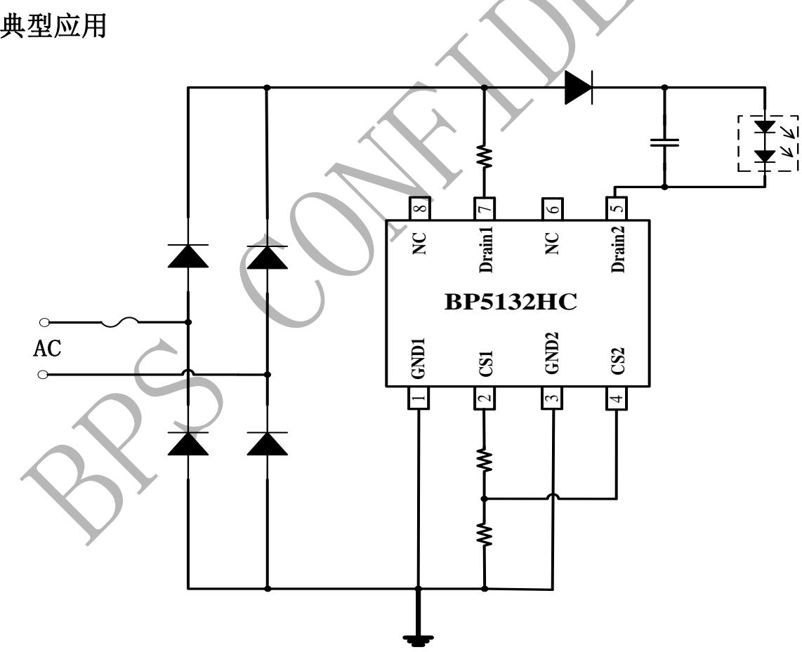
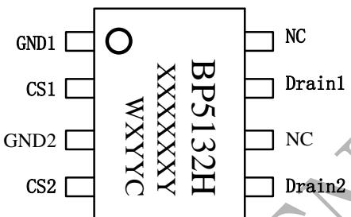
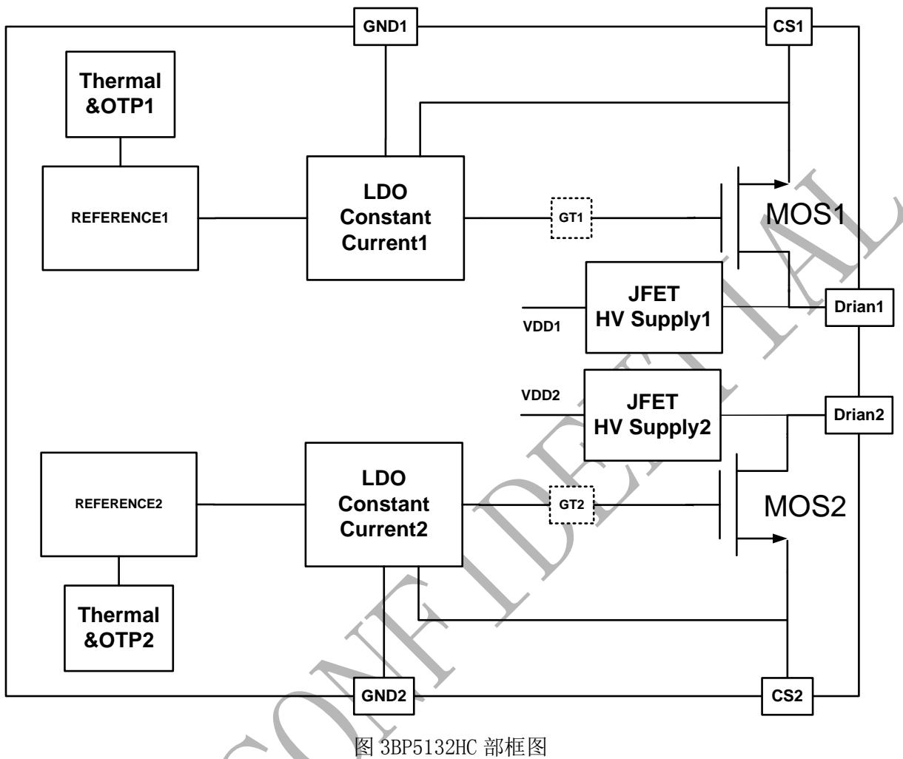
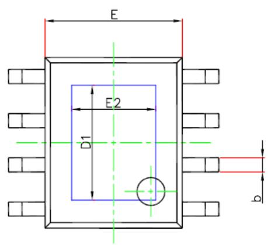
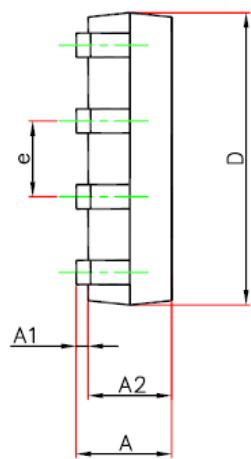
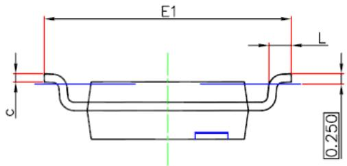

## 概述

BP5132HC 是一款高精度的线性可控硅 LED 控制芯片，集成了高压整流管和 JFET 高压供电功能。主要用于驱动由 120Vac供电的高电压、低电流 LED灯串。由于不需要磁性元件，LED 驱动器可以实现小体积、长寿命，并符合EMI 规定。

BP5132HC 可以通过外部电阻精确的设定 LED电流。

BP5132HC 具有过温调节功能。当输入电压过高，或者 LED 电流过大时，此功能将降低输出电流。

## 特点

◆ 兼容可控硅调光

◆ 外围电路非常简单，驱动器体积非常小

◆ 无需磁性元件

◆ 500V 高压 MOS 管

◆ 超快 LED 启动

◆ ±5% LED 输出电流精度

◆ LED电流可外部设定

◆ 过温调节功能

◆ 采用 ESOP8 封装

## 应用

◆ 北美可控硅调光驱动

◆ GU10/E27 LED 球泡灯、射灯

◆ LED 蜡烛灯,灯丝灯

◆ 其它 LED 照明

## 典型应用

  
图 1 BP5132HC 典型应用图

## 定购信息

<table><tr><td>定购型号</td><td>封装</td><td>温度范围</td><td>包装形式</td><td>打印</td></tr><tr><td>BP5132HC</td><td>ESOP8</td><td>-40 °C到105 °C</td><td>编带4000颗/盘</td><td>BP5132HXXXXXYWYYC</td></tr></table>

## 管脚封装

  
图 2-1 ESOP8 管脚封装图

XXXXXXY: lot code

WX: sign

YY：周号

## 管脚描述

<table><tr><td>管脚号</td><td>管脚名称</td><td>描述</td></tr><tr><td>1</td><td>GND1</td><td>芯片地 1</td></tr><tr><td>2</td><td>CS1</td><td>芯片电流采样引脚 1</td></tr><tr><td>3</td><td>GND2</td><td>芯片地 2</td></tr><tr><td>4</td><td>CS2</td><td>芯片电流采样引脚 2</td></tr><tr><td>5</td><td>Drain2</td><td>芯片 LED 接口端 2</td></tr><tr><td>6,8</td><td>NC</td><td>未连接</td></tr><tr><td>7</td><td>Drain1</td><td>芯片 LED 接口端 1</td></tr></table>

## 极限参数(注1)

<table><tr><td>符号</td><td>参数</td><td>参数范围</td><td>单位</td></tr><tr><td>D</td><td>500V芯片高压接口</td><td>500</td><td>V</td></tr><tr><td> $I_{D\_MAX}$ </td><td>漏极最大饱和电流@  $T_J\_max$ </td><td>80</td><td>mA</td></tr><tr><td>CS</td><td>芯片低压接口</td><td>-0.3~6</td><td>V</td></tr><tr><td> $P_{DMAX}$ </td><td>功耗(注2)</td><td>1.25</td><td>W</td></tr><tr><td> $\theta_{JA}$ </td><td>PN结到环境的热阻</td><td>100</td><td>°C/W</td></tr><tr><td> $T_J$ </td><td>工作结温范围</td><td>-40 to 150</td><td>°C</td></tr><tr><td> $T_{STG}$ </td><td>储存温度范围</td><td>-55 to 150</td><td>°C</td></tr></table>

注 1：最大极限值是指超出该工作范围，芯片有可能损坏。推荐工作范围是指在该范围内，器件功能正常，但并不完全保证满足个别性能指标。电气参数定义了器件在工作范围内并且在保证特定性能指标的测试条件下的直流和交流电参数规范。对于未给定上下限值的参数，该规范不予保证其精度，但其典型值合理反映了器件性能。

注 2：温度升高最大功耗一定会减小，这也是由 T , θ ,和环境温度 T 所决定的。最大允许功耗为 $\mathrm { P _ { D M X } = \left( T _ { J M X } - T _ { A } \right) / }$ θJA或是极限范围给出的数字中比较低的那个值。

电气参数(注3,4)（无特别说明情况下，TA=25℃）

<table><tr><td>符号</td><td>参数描述</td><td>条件</td><td>最小值</td><td>典型值</td><td>最大值</td><td>单位</td></tr><tr><td colspan="7">工作电流</td></tr><tr><td> $I_{CC}$ </td><td>静态工作电流</td><td>D=30V</td><td></td><td>180</td><td>320</td><td>uA</td></tr><tr><td colspan="7">电流采样</td></tr><tr><td> $V_{REF1}, V_{REF2},$ </td><td>电流基准</td><td>D=30V, Rcs=120Ω</td><td></td><td>600</td><td></td><td>mV</td></tr><tr><td colspan="7">过热调节</td></tr><tr><td> $T_{REG}$ </td><td>过热调节温度</td><td></td><td></td><td>150</td><td></td><td>°C</td></tr></table>

注 3：典型参数值为25˚C 下测得的参数标准。  
注 4：规格书的最小、最大规范范围由测试保证，典型值由设计、测试或统计分析保证。

内部结构框图

## 应用信息

BP5132HC 是一款高精度可控硅线性恒流 LED 控制芯片，主要用于驱动由120Vac供电的高电压、低电流 LED灯串。

## 1 供电

在系统上电后，D 端通过内部的高压 JFET 给芯片供电，当D端的电压超过10V之后芯片开始工作。

## 2 恒流控制，输出电流设置

BP5132HC可以通过外部电阻精确设定 LED电流。

LED 导通时，输出电流计算公式：

$$
I _ {L E D} = \frac {V r e f}{R c s}
$$

BP5132HC不适用于220Vac输入并且输出有电容的高 PF 应用；由于散热能力的限制，在 120V 市电输入时，建议将芯片输出电流设在 80mA以下。

## 3 调光控制

BP5132HC内部具备两路线性芯片,其中一路提供调光器的维持电流,另外一路实现 LED恒流输出;除此之外,芯片的两个取样电阻通过特殊的连接方式,实现了动态调整维持电流的控制方式。

## 4 过温调节功能

BP5132HC 具有过热调节功能，在驱动电源过热时逐渐减小输出电流，从而控制输出功率和温升，使电源温度保持在设定值，以提高系统的可靠性。

过热调节温度参考电气参数表。

## PCB 设计

在设计BP5132HC的PCB板时，需要注意以下事项：

## 地线

电流采样电阻的功率地线尽可能短。地/Drain 的面积要尽可能大，以减小热阻，增强散热能力。

## 芯片散热片

BP5132HC 芯片底部有增强散热能力的散热片。在设计 PCB 时，为了达到良好的散热效果，需要将散热片连接的铜皮面积尽量大。

## 封装信息

SOP8-EP (EXP PAD) PACKAGE OUTLINE DIMENSIONS  

  
晶丰明源专用

<table><tr><td rowspan="2">Symbol</td><td colspan="2">Dimensions In Millimeters</td><td colspan="2">Dimensions In Inches</td></tr><tr><td>Min</td><td>Max</td><td>Min</td><td>Max</td></tr><tr><td>A</td><td>1.350</td><td>1.700</td><td>0.053</td><td>0.067</td></tr><tr><td>A1</td><td>0.000</td><td>0.100</td><td>0.000</td><td>0.004</td></tr><tr><td>A2</td><td>1.350</td><td>1.550</td><td>0.053</td><td>0.061</td></tr><tr><td>c</td><td>0.170</td><td>0.250</td><td>0.007</td><td>0.010</td></tr><tr><td>E</td><td>3.800</td><td>4.000</td><td>0.150</td><td>0.157</td></tr><tr><td>E1</td><td>5.800</td><td>6.200</td><td>0.228</td><td>0.244</td></tr><tr><td>E2</td><td>2.313</td><td>2.513</td><td>0.091</td><td>0.099</td></tr><tr><td>L</td><td>0.400</td><td>1.270</td><td>0.016</td><td>0.050</td></tr><tr><td>b</td><td>0.330</td><td>0.510</td><td>0.013</td><td>0.020</td></tr><tr><td>D</td><td>4.700</td><td>5.100</td><td>0.185</td><td>0.201</td></tr><tr><td>D1</td><td>3.202</td><td>3.402</td><td>0.126</td><td>0.134</td></tr><tr><td>e</td><td colspan="2">1.270 BASIC</td><td colspan="2">0.050 BASIC</td></tr><tr><td>θ</td><td> $0^{\circ}$ </td><td> $8^{\circ}$ </td><td> $0^{\circ}$ </td><td> $8^{\circ}$ </td></tr></table>