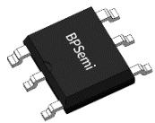
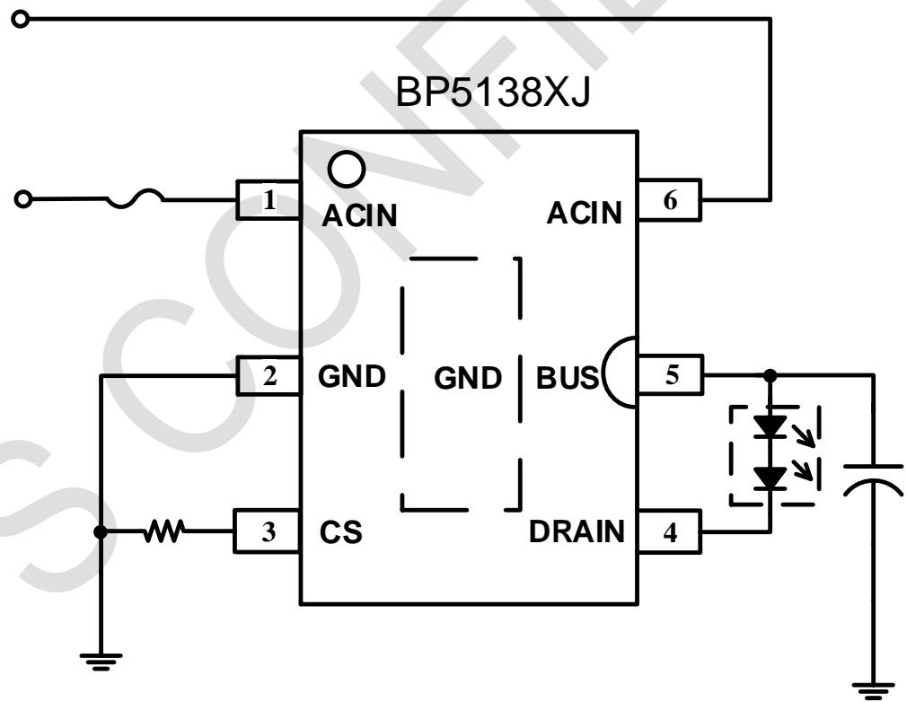
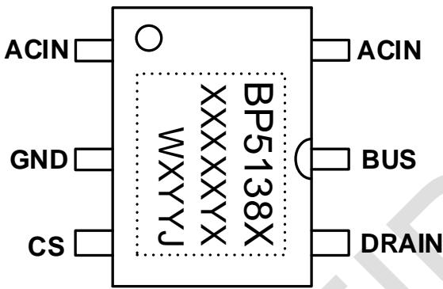
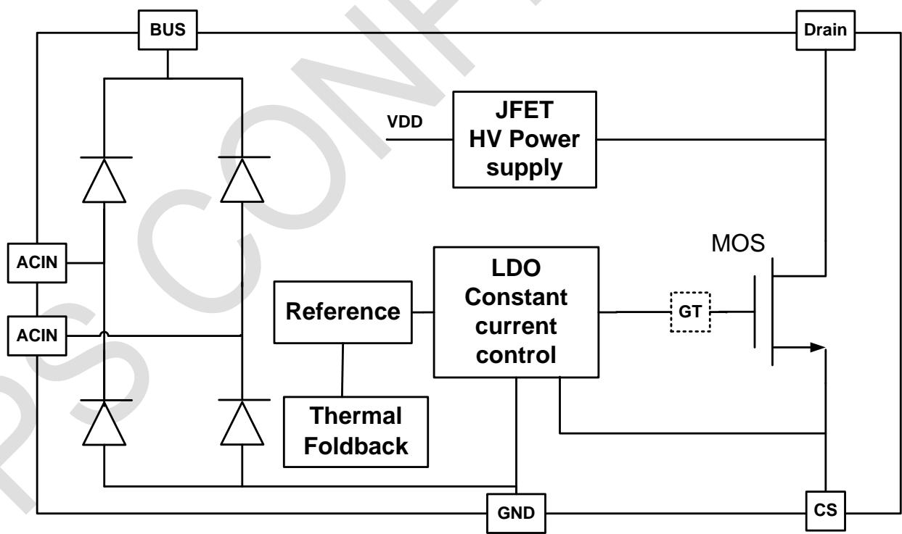
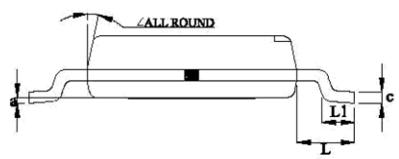
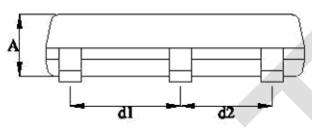
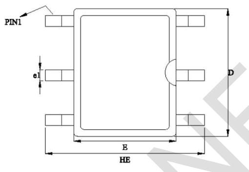
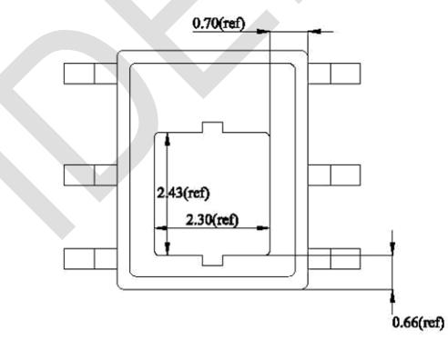

## 概述

BP5138XJ 是一款高精度的单段线性恒流 LED 控制芯片，集成了高压 MOS 管和 JFET 高压供电功能。主要用于驱动由市电供电的高电压、低电流 LED 灯串。由于不需要磁性元件，LED 驱动器可以实现小体积、长寿命，并符合 EMI 规定。

BP5138XJ 可以通过外部电阻精确的设定 LED 电流。

BP5138XJ 具有过温调节功能。当输入电压过高，或者 LED 电流过大时，此功能将降低输出电流。

BP5138XJ 采用 ESSOP6 封装。

## 特点

◆ 内置 800V 整流桥

◆ 外围电路非常简单，驱动器体积非常小

◆ 无需磁性元件

◆ 500V 高压 MOS 管，无需压敏电阻

◆ 超快 LED 启动

◆ ±5% LED 输出电流精度

◆ LED 电流可外部设定

◆ 过温调节功能

◆ 采用 ESSOP6 封装

## 应用

◆ GU10/E27 LED 球泡灯、射灯

LED 蜡烛灯

◆ 其它 LED 照明

## 典型应用

  
图 1 BP5138XJ 典型应用图

## 定购信息

<table><tr><td>定购型号</td><td>封装</td><td>包装形式</td><td>打印</td></tr><tr><td>BP5138XJ</td><td>ESSOP6</td><td>编带5000颗/盘</td><td>BP5138XXXXXXYWXYJ</td></tr></table>

## 管脚封装

  
图 2 BP5138XJ 管脚封装图

第一行：BP5138: 产品名
X: A/D

第二行：XXXXX: lot code
Y: 封装厂代码
X: 特殊字符

第三行：WX: sign
YY: 周号

## 管脚描述

<table><tr><td>管脚号</td><td>管脚名称</td><td>描述</td></tr><tr><td>1/6</td><td>ACIN</td><td>交流电压输入端</td></tr><tr><td>2</td><td>GND</td><td>芯片地</td></tr><tr><td>3</td><td>CS</td><td>芯片电流采样端,接采样电阻到地</td></tr><tr><td>4</td><td>Drain</td><td>内部高压功率 MOS 漏极</td></tr><tr><td>5</td><td>BUS</td><td>整流桥输出正,接输入电容和灯珠</td></tr><tr><td>衬底</td><td>GND</td><td>芯片地</td></tr></table>

极限参数(注1)

<table><tr><td>符号</td><td>参数</td><td colspan="2">参数范围</td><td>单位</td></tr><tr><td>ACIN/ACIN</td><td>整流桥最大耐压值</td><td colspan="2">-0.3~800</td><td>V</td></tr><tr><td>BUS</td><td>整流桥输出正最大耐压值</td><td colspan="2">-0.6~500</td><td>V</td></tr><tr><td>Drain</td><td>集成功率 MOS 高压接口</td><td colspan="2">-0.3~500</td><td>V</td></tr><tr><td>CS</td><td>芯片低压接口</td><td colspan="2">-0.3~6</td><td>V</td></tr><tr><td rowspan="2">ID_MAX</td><td rowspan="2">漏极最大饱和电流@ TJ_max</td><td>DJ</td><td>80</td><td rowspan="2">mA</td></tr><tr><td>AJ</td><td>60</td></tr><tr><td>TJ</td><td>工作结温范围</td><td colspan="2">-40 to 150</td><td>°C</td></tr><tr><td>TSTG</td><td>储存温度范围</td><td colspan="2">-55 to 155</td><td>°C</td></tr><tr><td></td><td>ESD (注2)</td><td colspan="2">2</td><td>KV</td></tr></table>

注1：最大极限值是指超出该工作范围，芯片有可能损坏。推荐工作范围是指在该范围内，器件功能正常，但并不完全保证满足个别性能指标。电气参数定义了器件在工作范围内并且在保证特定性能指标的测试条件下的直流和交流电参数规范。对于未给定上下限值的参数，该规范不予保证其精度，但其典型值合理反映了器件性能。  
注2：人体模型，100pF电容通过 $1.5\mathrm{K}\Omega$ 电阻放电。

电气参数(注 3,4)（无特别说明情况下，TA=25℃）

<table><tr><td>符号</td><td>参数描述</td><td>条件</td><td>最小值</td><td>典型值</td><td>最大值</td><td>单位</td></tr><tr><td colspan="7">工作电流</td></tr><tr><td> $I_{CC}$ </td><td>静态工作电流</td><td>D=30V</td><td></td><td>70</td><td>150</td><td>uA</td></tr><tr><td colspan="7">电流采样</td></tr><tr><td> $V_{REF}$ </td><td>电流基准</td><td>D=30V, Rcs=120Ω</td><td></td><td>600</td><td></td><td>mV</td></tr><tr><td colspan="7">过热调节</td></tr><tr><td> $T_{REG}$ </td><td>过热调节温度</td><td>-</td><td></td><td>150</td><td></td><td>°C</td></tr></table>

注3：典型参数值为 $25^{\circ}\mathrm{C}$ 下测得的参数标准。  
注4：规格书的最小、最大规范范围由测试保证，典型值由设计、测试或统计分析保证。

内部结构框图  
  
图 3 BP5138XJ 部框图

## 应用信息

BP5138XJ 是一款高精度单段线性恒流 LED 控制芯片，主要用于驱动由市电供电的高电压、低电流 LED 灯串。

## 供电

在系统上电后，Drain 端通过内部的高压 JFET 给芯片供电，当 Drain 端的电压超过 10V 之后芯片开始工作。

## 恒流控制，输出电流设置

BP5138XJ 可以通过外部电阻精确设定 LED 电流。

LED 导通时，输出电流计算公式：

$$
I _ {L E D} = \frac {V r e f}{R c s}
$$

由于散热能力的限制，在 220V 市电输入时，建议将 LED 电流设在 60mA/40mA(DJ/AJ)以下；在 110V 市电输入时，建议将 LED 电流设在 80mA/60mA(DJ/AJ)以下。

## 过温调节功能

BP5138XJ 具有过热调节功能，在驱动电源过热时逐渐减小输出电流，从而控制输出功率和温升，使电源温度保持在设定值，以提高系统的可靠性。

过热调节温度为芯片内部设定值(参照电气参数表)。

## PCB 设计

在设计BP5138XJ的PCB板时，需要注意以下事项：

## 地线

电流采样电阻的功率地线尽可能短。GND 的面积要尽可能大，以减小热阻，增强散热能力。

## 芯片散热片

部已经连接到 GND 引脚。在设计 PCB 时，将散热片连接到 PCB 的地。为了达到良好的散热效果，需要将散热片连接的 PCB 铜皮面积尽量大。

BP5138XJ 芯片底部有增强散热能力的散热片，在芯片内

## 封装信息

  
Side View

  
Side View

  
Top View

  
Bottom View

<table><tr><td>Unit</td><td></td><td>A</td><td>C</td><td>D</td><td>E</td><td>HE</td><td>d1</td><td>d2</td><td>e1</td><td>L</td><td>L1</td><td>a</td><td>∠</td></tr><tr><td rowspan="3">mm</td><td>max</td><td>1.20</td><td>0.25</td><td>4.90</td><td>4.00</td><td>6.00</td><td>2.05</td><td>1.70</td><td>0.45</td><td>1.15</td><td>0.63</td><td rowspan="3">0.2 (ref)</td><td rowspan="6"> $12^{\circ}$ </td></tr><tr><td>typ</td><td>1.10</td><td>0.20</td><td>4.70</td><td>3.80</td><td>5.90</td><td>2.00</td><td>1.65</td><td>0.40</td><td>1.05</td><td>/</td></tr><tr><td>min</td><td>1.00</td><td>0.15</td><td>4.50</td><td>3.60</td><td>5.80</td><td>1.95</td><td>1.60</td><td>0.35</td><td>0.95</td><td>0.23</td></tr><tr><td rowspan="3">mil</td><td>max</td><td>47</td><td>10</td><td>193</td><td>157</td><td>236</td><td>81</td><td>67</td><td>18</td><td>45</td><td>25</td><td rowspan="3">8 (ref)</td></tr><tr><td>typ</td><td>43</td><td>8</td><td>185</td><td>150</td><td>232</td><td>79</td><td>65</td><td>16</td><td>41</td><td>/</td></tr><tr><td>min</td><td>39</td><td>6</td><td>177</td><td>142</td><td>228</td><td>77</td><td>63</td><td>14</td><td>37</td><td>9</td></tr></table>

## 版本信息

<table><tr><td>版本</td><td>日期</td><td>记录</td></tr><tr><td>Rev. 1.0</td><td>2023/4</td><td>首次发行</td></tr><tr><td>Rev. 1.1</td><td>2023/5</td><td>修改封装管脚示意图,增加 1 号脚位标识</td></tr><tr><td></td><td></td><td></td></tr><tr><td></td><td></td><td></td></tr><tr><td></td><td></td><td></td></tr><tr><td></td><td></td><td></td></tr></table>

## 免责声明

晶丰明源尽力确保本产品规格书内容的准确和可靠，但是保留在没有通知的情况下，修改规格书内容的权利。

本产品规格书未包含任何针对晶丰明源或第三方所有的知识产权的授权。针对本产品规格书所记载的信息，晶丰明源不做任何明示或暗示的保证，包括但不限于对规格书内容的准确性、商业上的适销性、特定目的的适用性或者不侵犯晶丰明源或任何第三人知识产权做任何明示或暗示保证，晶丰明源也不就因本规格书本身及其使用有关的偶然或必然损失承担任何责任。