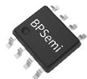
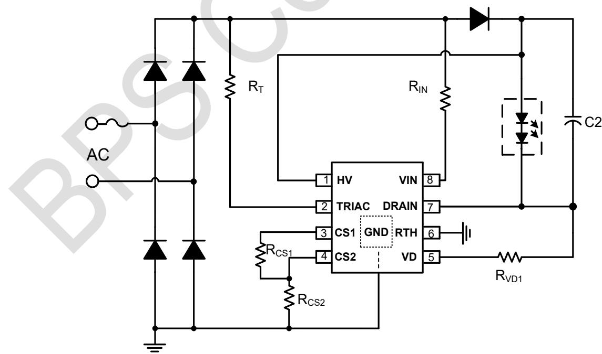
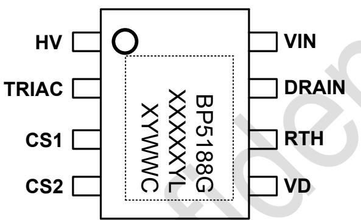
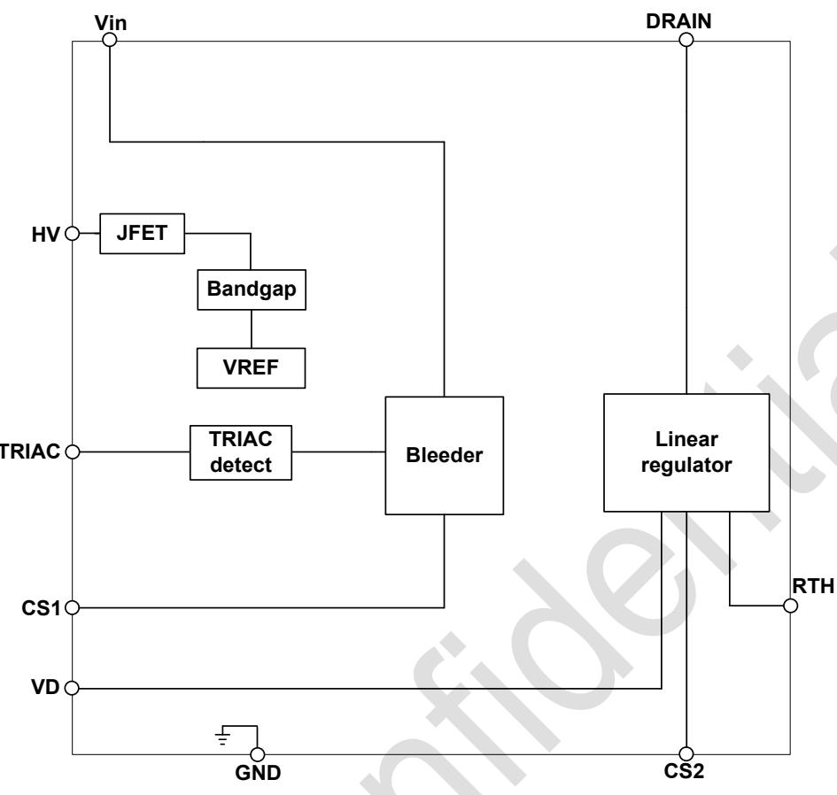
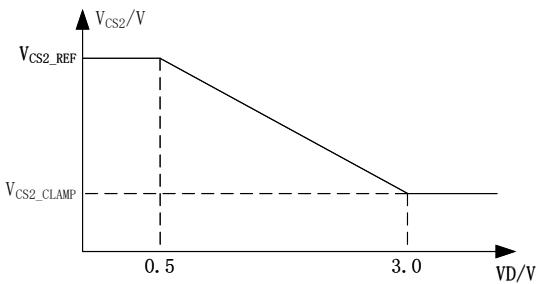
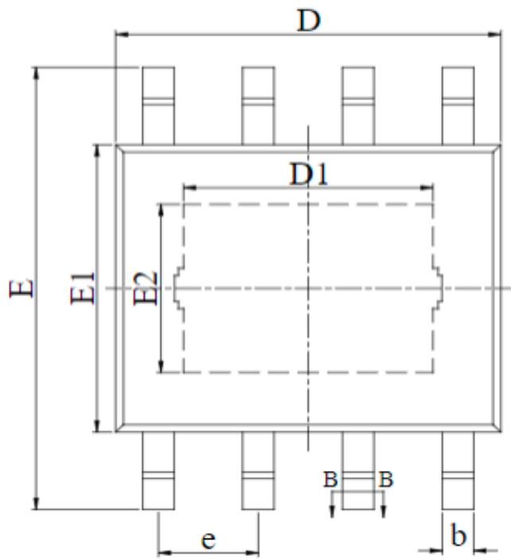
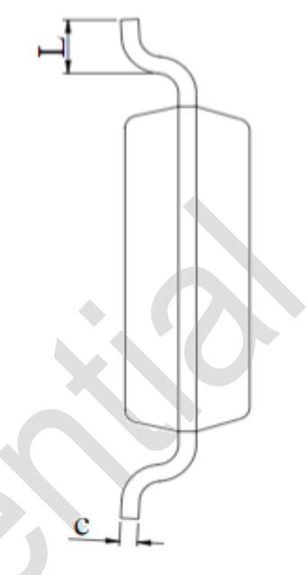
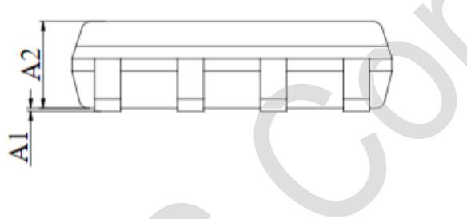
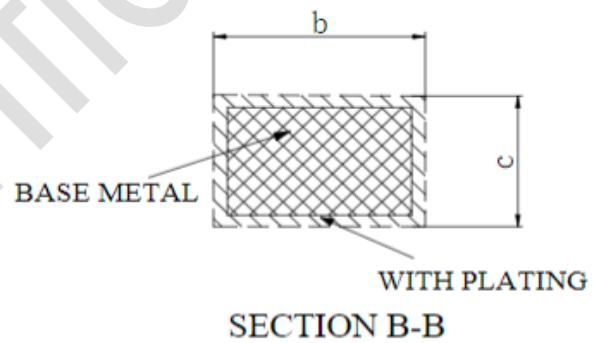

## 概述

BP5188GCL 是一款高度集成的、支持低压可控硅调光的高精度单段线性 LED 恒流驱动芯片。主要用于市电输入的高功率因数的各类光源和灯具的驱动， 同时具有良好的可控硅调光器兼容性。基于线性恒流技术的 BP5188GCL ，可以省去电解电容和磁性元件，有助于LED 驱动器实现小体积、长寿命，并符合 EMI 标准。

BP5188GCL 可以通过外部电阻精确地设定LED 电流，芯片通过优化不同输入电压下的输入电流，可以减小芯片的损耗，优化系统效率。

BP5188GCL 通过设定泄放电流，可以实现良好的可控硅调光器兼容性。

BP5188GCL 具有过温调节功能。当芯片温度过高时，将降低输出电流。

## 特点

◼ 外围电路简单，驱动器体积小

◼ 良好的可控硅调光兼容性

◼ 内置 350V 高压 MOS 管

◼ 母线电压变化±10% 仍可正常工作

◼ 集成高压启动线路，超快 LED 启动

◼ ±5% LED 输出电流精度

◼ LED 电流可外部设定

◼ 内置过温调节功能

◼ 采用 ESOP -8 封装

## 应用

◼ GU10/E27 LED 球泡灯、筒灯

◼ LED 吸顶灯

◼ 其它 LED 照明

## 典型应用

ESOP -8 封装  
  
图 1 BP5188GCL 典型应用图

## 定购信息

<table><tr><td>定购型号</td><td>封装</td><td>包装形式</td><td>打印</td></tr><tr><td>BP5188GCL</td><td>ESOP-8</td><td>编带4,000 颗/盘</td><td>BP5188GXXXXYLXYWWC</td></tr></table>

## 管脚封装

  
图 2 管脚封装图

BP5188GCL ：产品型号

XXXXXY ：批次号

XY：标示

WW ：周号

## 管脚描述

<table><tr><td>管脚号</td><td>管脚名称</td><td>描述</td></tr><tr><td>1</td><td>HV</td><td>芯片高压供电输入端</td></tr><tr><td>2</td><td>TRIAC</td><td>可控硅调光器检测</td></tr><tr><td>3</td><td>CS1</td><td>Bleeder 电流采样端</td></tr><tr><td>4</td><td>CS2</td><td>LED 电流采样端</td></tr><tr><td>5</td><td>VD</td><td>输入电压检测反馈端</td></tr><tr><td>6</td><td>RTH</td><td>芯片过温度调节点设置</td></tr><tr><td>7</td><td>DRAIN</td><td>芯片内部线性恒流 MOS 漏极</td></tr><tr><td>8</td><td>VIN</td><td>芯片高压供电输入端</td></tr><tr><td>衬底</td><td>GND</td><td>芯片地</td></tr></table>

## 极限参数(注 1)

<table><tr><td>符号</td><td>参数</td><td>参数范围</td><td>单位</td></tr><tr><td>VIN</td><td>芯片高压接口</td><td>-0.3~350</td><td>V</td></tr><tr><td>DRAIN</td><td>芯片高压接口</td><td>-0.3~350</td><td>V</td></tr><tr><td>HV</td><td>芯片高压接口</td><td>-0.3~350</td><td>V</td></tr><tr><td>TRIAC, CS1, CS2, VD</td><td>芯片低压接口</td><td>-0.3~7</td><td>V</td></tr><tr><td> $P_{DMAX}$ </td><td>功耗(注2)</td><td>1.25</td><td>W</td></tr><tr><td> $\theta_{JA}$ </td><td>PN结到环境的热阻</td><td>100</td><td>°C/W</td></tr><tr><td> $T_J$ </td><td>工作结温范围</td><td>-40 to 150</td><td>°C</td></tr><tr><td> $T_{STG}$ </td><td>储存温度范围</td><td>-55 to 150</td><td>°C</td></tr></table>

注 1：最大极限值是指超出该工作范围，芯片有可能损坏。推荐工作范围是指在该范围内，器件功能正常，但并不完全保证满足个别性能指标。电气参数定义了器件在工作范围内并且在保证特定性能指标的测试条件下的直流和交流电参数规范。对于未给定上下限值的参数，该规范不予证其精度，但其典型值合理反映了器件性能。

注 2：温度升高最大功耗一定会减小，这也是由T , θ ,和环境温度T 所决定的。最大允许功耗为 $P _ { D M A X } = ( T _ { J M A X } - T _ { A } ) /$ θ 或是极限范围给出的数字中比较低的那个值。

电气参数(注 3，4) （无特别说明情况下， ${ T _ { A } } \mathrm { { = } } 2 5 ^ { \circ } { \mathrm { C } } )$

<table><tr><td>符号</td><td>描述</td><td>条件</td><td>最小值</td><td>典型值</td><td>最大值</td><td>单位</td></tr><tr><td colspan="7">电源</td></tr><tr><td> $I_{OP}$ </td><td>芯片工作电流</td><td></td><td></td><td>200</td><td></td><td>μA</td></tr><tr><td colspan="7">电流采样</td></tr><tr><td> $V_{CS1}$ </td><td>输出电流检测阈值 1</td><td></td><td></td><td>240</td><td></td><td>mV</td></tr><tr><td> $V_{CS2}$ </td><td>输出电流检测阈值 2</td><td></td><td>855</td><td>900</td><td>945</td><td>mV</td></tr><tr><td> $V_{CS2\_clamp}$ </td><td>输出电流检测阈值 2 下钳位电压</td><td></td><td></td><td>255</td><td></td><td>mV</td></tr><tr><td colspan="7">VD 补偿</td></tr><tr><td> $V_{D1}$ </td><td>线补偿起点</td><td></td><td></td><td>0.5</td><td></td><td>V</td></tr><tr><td> $R_{VD}$ </td><td>VD 下拉电阻</td><td></td><td></td><td>36</td><td></td><td>kΩ</td></tr><tr><td colspan="7">功率 MOSFET</td></tr><tr><td> $BV_{DSS\_VIN}$ </td><td>VIN 击穿电压</td><td> $V_{GS}=0V/ I_{DS}=250μA$ </td><td>350</td><td></td><td></td><td>V</td></tr><tr><td> $I_{DSS\_VIN}$ </td><td>VIN 饱和电流</td><td></td><td></td><td>40</td><td></td><td>mA</td></tr><tr><td> $BV_{DSS}$ </td><td>MOSFET 击穿电压</td><td> $V_{GS}=0V/ I_{DS}=250μA$ </td><td>350</td><td></td><td></td><td>V</td></tr><tr><td> $I_{DSS}$ </td><td>MOSFET 饱和电流</td><td></td><td></td><td>280</td><td></td><td>mA</td></tr><tr><td colspan="7">过热调节</td></tr><tr><td> $T_{REG1}$ </td><td>过热调节温度 1</td><td>RTH 悬空</td><td></td><td>135</td><td></td><td>°C</td></tr><tr><td> $T_{REG2}$ </td><td>过热调节温度 2</td><td>RTH 接地</td><td></td><td>150</td><td></td><td>°C</td></tr></table>

注 4：规格书的最小、最大规范范围由测试保证，典型值由设计、测试或统计分析保证  
注 3：典型参数值为25˚C 下测得的参数标准。

## 内部结构框图

  
图 3 BP5188GCL 内部框图

## 应用信息

BP5188GCL 是一款高精度单段线性可控硅调光 LED 恒流控制芯片，主要用于驱动由市电供电的高电压、低电流LED灯串。BP5188GCL 也支持可控硅调光，调光过程中可实现单段 LED 灯串同步调光，从而使LED 亮度均匀变化。

## 1 供电

在系统上电后，芯片通过内部的高压 JFET 给芯片内部电路供电，当内部 VCC 电压达到启动电压后，芯片开始工作

## 2 驱动机制

BP5188GCL 根据母线电压变化而改变流过 LED 灯的电流，因此可以在整个交流周期内，优化电源效率，从而提高LED的利用率和总输出流明数。在输入电压较低时，LED 电流相对较大；在输入电压较高时，LED 电流相对较低。

## 3 泄放电流

BP5188GCL 支持可控硅调光，芯片通过 TRIAC 引脚检测输入是否带调光器，当芯片检测到有调光器时，芯片会自动打开泄放电流，提高可控硅调光器兼容性。当芯片检测到没有调光器时，芯片会关闭泄放电流，减小损耗，提高系统效率。通过 CS1 管脚的电阻值，可设置所需的泄放电流。

$$
I _ {B L E E D I N G} = \frac {V _ {C S 1 \_ R E F}}{R _ {C S 1} + R _ {C S 2}}
$$

## 4 恒流控制，输出电流设置

BP5188GCL 可以通过外部电阻精确设定LED 电流。

主功率管电流计算公式：

$$
I _ {L E D} = \frac {V _ {C S 2 \_ R E F}}{R _ {C S 2}}
$$

由于散热能力的限制，120Vac 输入时，最大输入功率在10W 左右。

当 VD 电压大于 0.5V 时， $\mathsf { V } _ { \mathsf { C S 2 } }$ 基准开始下降，VD 电压越大， $\mathsf { V } _ { \mathsf { C S 2 } }$ 基准越低，最低降到下钳位电压。

  
图 4 VD 线补偿曲线

## 5 过温调节功能

BP5188GCL 具有过热调节功能，在驱动电源过热时逐渐减小输出电流，从而控制输出功率和温升，使电源温度保持在设定值，以提高系统的可靠性。芯片过热调节点可以通过 RTH 引脚进行外部设定。

## 6 增大输出电流

如需增大输出电流，可采取以下措施：

⚫ 采用铝基板 PCB

⚫ 增大衬底（GND ）的覆铜面积

⚫ 增大整个灯具的散热底座

## 7 P CB 设计

在设计 BP5188GCL PCB 板时，需要注意以下事项：

## 地线

电流采样电阻的功率地线尽可能短。

## 芯片散热片

BP5188GCL 芯片底部有增强散热能力的散热片，在芯片内部已经连接到 GND 引脚。在设计 PCB 时，将 GND 散热衬底连接到 PCB 的地。为了达到良好的散热效果，需将GND 衬底连接的铜皮面积尽量大，且保持良好的接触。

## 封装信息

COMMON DIMENSIONS

<table><tr><td>SYMBOL</td><td>MIN</td><td>NOM</td><td>MAX</td></tr><tr><td>A1</td><td>0.00</td><td>—</td><td>0.15</td></tr><tr><td>A2</td><td>1.25</td><td>1.40</td><td>1.65</td></tr><tr><td>b</td><td>0.30</td><td>—</td><td>0.50</td></tr><tr><td>c</td><td>0.10</td><td>—</td><td>0.25</td></tr><tr><td>D</td><td>4.70</td><td>4.90</td><td>5.10</td></tr><tr><td>D1</td><td>3.02</td><td>—</td><td>3.50</td></tr><tr><td>E</td><td>5.80</td><td>—</td><td>6.40</td></tr><tr><td>E1</td><td>3.70</td><td>3.90</td><td>4.10</td></tr><tr><td>E2</td><td>2.10</td><td>—</td><td>2.60</td></tr><tr><td>e</td><td colspan="3">1.27 BSC</td></tr><tr><td>L</td><td>0.40</td><td>0.60</td><td>1.00</td></tr></table>

## 版本信息

<table><tr><td>版本</td><td>日期</td><td>记录</td></tr><tr><td>Rev.1.0</td><td>2025/08</td><td>首次发行</td></tr><tr><td>Rev.1.1</td><td>2025/11</td><td>删除典型应用图中 TRIAC 脚的下拉电阻</td></tr><tr><td></td><td></td><td></td></tr></table>

## 免责声明

晶丰明源尽力确保本产品规格书内容的准确和可靠，但是保留在没有通知的情况下，修改规格书内容的权利。

本产品规格书未包含任何针对晶丰明源或第三方所有的知识产权的授权。针对本产品规格书所记载的信息，晶丰明源不做任何明示或暗示的保证，包括但不限于对规格书内容的准确性、商业上的适销性、特定目的的适用性或者不侵犯晶丰明源或任何第三人知识产权做任何明示或暗示保证，晶丰明源也不就因本规格书本身及其使用有关的偶然或必然损失承担任何责任。

责任。

## 电子器件报废说明

该产品在生命周期结束后，由客户按照一般电子产品的报废流程进行处理。