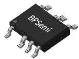
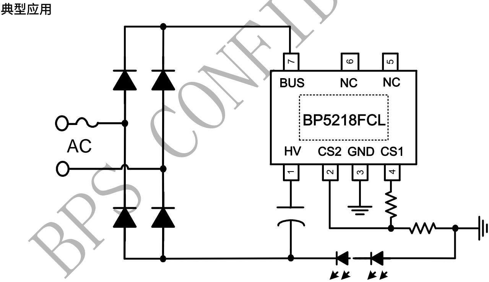
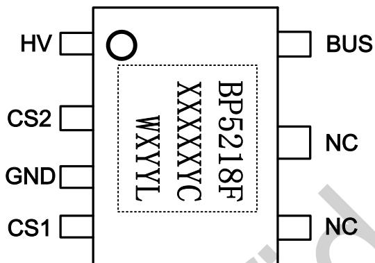
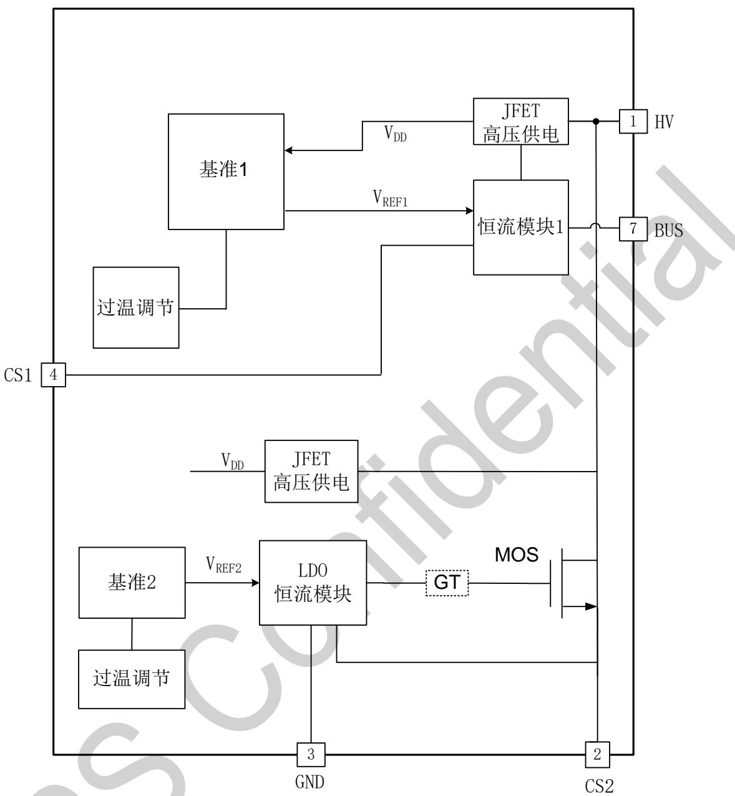
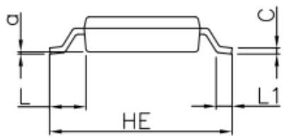
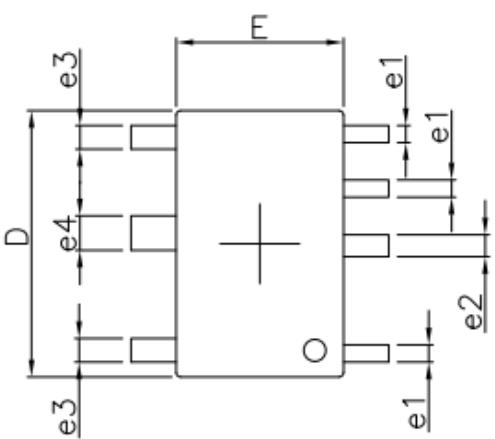
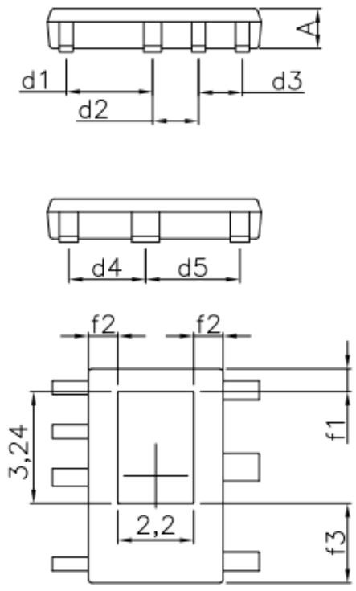

## BP5218FCL 满足 ERP 无频闪线性恒流 LED 控制芯片

## 概述

BP5218FCL 是一款无频闪的线性恒流 LED 控制芯片，集成了高压 MOS 管和 JFET 高压供电功能。主要用于高压输入的各类光源和灯具的驱动，能满足欧洲最新 ERP 标准。由于不需要磁性元件，LED 驱动器可以实现小体积、长寿命，并符合 EMI 规定。

BP5218FCL 可以通过外部电阻精确的设定 LED 电流 BP5218FCL 具有高精度的过温调节功能。当输入电压过高，或者 LED 电流过大时，此功能将降低输出电流。

BP5218FCL 采用 HSOP7 封装。

  
HSOP7 封装

## 特点

■ 满足欧洲新 ERP 标准

■ PF>0.5，无频闪

■ 无需压敏，抗浪涌 800V 以上

■ 外围电路非常简单，驱动器体积非常小

■ 无需磁性元件

■ 超快LED启动

■ ±5% LED 输出电流精度

■ LED 电流可外部设定

■ 过温调节功能

■ 采用 HSOP7 封装

## 应用领域

■ GU10/E27 LED 球泡灯、射灯

■ LED 蜡烛灯、灯丝灯

其它 LED 照明

## 典型应用

  
图 1 BP5218FCL 典型应用图

定购信息

<table><tr><td>定购型号</td><td>封装</td><td>包装形式</td><td>打印</td></tr><tr><td>BP5218FCL</td><td>HSOP7</td><td>编带5000颗/盘</td><td>BP5218FXXXXYCWXYYL</td></tr></table>

## 管脚封装

  
XXXXXY: 批次号  
图 2 BP5218FCL 管脚封装图

WX: 标示

YY: 周号

## 管脚描述

<table><tr><td>管脚号</td><td>管脚名称</td><td>描述</td></tr><tr><td>1</td><td>HV</td><td>芯片电解电容正端接口</td></tr><tr><td>2</td><td>CS2</td><td>电流采样端 2</td></tr><tr><td>3</td><td>GND</td><td>芯片地</td></tr><tr><td>4</td><td>CS1</td><td>电流采样端 1</td></tr><tr><td>5,6</td><td>NC</td><td>空脚</td></tr><tr><td>7</td><td>BUS</td><td>母线</td></tr><tr><td></td><td>衬底</td><td>芯片地</td></tr></table>

## 极限参数(注1,2,3)

<table><tr><td>符号</td><td>参数</td><td>参数范围</td><td>单位</td></tr><tr><td>HV,BUS</td><td>500V芯片高压接口</td><td>-0.3~500</td><td>V</td></tr><tr><td>CS1,CS2</td><td>芯片低压接口</td><td>-0.3~6</td><td>V</td></tr><tr><td> $I_{BUS\_MAX}$ </td><td>漏极最大饱和电流@  $T_{J\_max}$ </td><td>60</td><td>mA</td></tr><tr><td> $I_{HV to CS2\_MAX}$ </td><td>漏极最大饱和电流@  $T_{J\_max}$ </td><td>60</td><td>mA</td></tr><tr><td> $T_J$ </td><td>工作结温范围</td><td>-40 to 150</td><td>°C</td></tr><tr><td> $T_{STG}$ </td><td>储存温度范围</td><td>-55 to 150</td><td>°C</td></tr><tr><td></td><td>ESD (注3)</td><td>2</td><td>KV</td></tr></table>

注1：最大极限值是指超出该工作范围，芯片有可能损坏。推荐工作范围是指在该范围内，器件功能正常，但并不完全保证满足个别性能指标。电气参数定义了器件在工作范围内并且在保证特定性能指标的测试条件下的直流和交流电参数规范。对于未给定上下限值的参数，该规范不予保证其精度，但其典型值合理反映了器件性能。  
注2：温度升高最大功耗一定会减小，这也是由 $T_{JMAX}, \theta_{JA}$ 和环境温度 $T_A$ 所决定的。最大允许功耗为 $P_{DMA}X = (T_{JMAX} - T_A) / \theta_{JA}$ 或是极限范围给出的数字中比较低的那个值。

注3：按照JEDEC标准测试，100pF电容通过 $1.5\mathrm{K}\Omega$ 电阻放电。

电气参数(注 4,5)（无特别说明情况下， $T_{A}=25^{\circ}C$ ）

<table><tr><td>符号</td><td>描述</td><td>条件</td><td>最小值</td><td>典型值</td><td>最大值</td><td>单位</td></tr><tr><td colspan="7">工作电流</td></tr><tr><td> $I_{CC}$ </td><td>静态工作电流</td><td>HV=30V</td><td></td><td>135</td><td></td><td>uA</td></tr><tr><td colspan="7">电流采样</td></tr><tr><td> $V_{REF1}$ </td><td>电流基准1</td><td>BUS=HV=30V, $R_{CS1}$ =120Ω</td><td>860</td><td>890</td><td>920</td><td>mV</td></tr><tr><td> $V_{REF2}$ </td><td>电流基准2</td><td>HV=30V, $R_{CS2}$ =120Ω</td><td></td><td>600</td><td></td><td>mV</td></tr><tr><td colspan="7">过热调节</td></tr><tr><td>TREG</td><td>过热调节温度</td><td>-</td><td></td><td>140</td><td></td><td>°C</td></tr></table>

注4：典型参数值为 $25^{\circ}\mathrm{C}$ 下测得的参数标准。  
注5：规格书的最小、最大规范范围由测试保证，典型值由设计、测试或统计分析保证。

## 内部结构框图

  
图 3 BP5218FCL 内部结构框图

## 应用信息

BP5218FCL 是一款无频闪的线性恒流 LED 控制芯片，主要用于高压输入的各类光源和灯具的驱动，能够满足欧洲新 ERP 标准。

## 1 供电

在系统上电后，HV 通过内部的高压 JFET 给芯片供电，当 HV 的电压超过 10V 之后芯片开始工作。

## 2 恒流控制，输出电流设置

BP5218FCL 可以通过外部电阻精确设定 LED 电流。

当母线电压大于 LED 电压，母线给 LED 提供电流；当母线电压小于灯珠电压时，电解电容给 LED 放电。输出电流计算公式：

$$
I _ {\mathrm{LED}} = \frac {\mathrm{Vref2}}{\mathrm{Rcs2}}
$$

## 3 过温调节功能

BP5218FCL 具有过热调节功能，在驱动电源过热时逐渐减小输出电流，从而控制输出功率和温升，使电源温度保持在设定值，以提高系统的可靠性。

## 封装信息

  
背面
Bottom View

<table><tr><td rowspan="2">SYMBOL</td><td colspan="3">MILLIMETER</td><td rowspan="2">SYMBOL</td><td colspan="3">MILLIMETER</td></tr><tr><td>min</td><td>typ</td><td>max</td><td>min</td><td>typ</td><td>max</td></tr><tr><td>A</td><td>1.05</td><td>1.15</td><td>1.25</td><td>e1</td><td>0.35</td><td>0.40</td><td>0.45</td></tr><tr><td>C</td><td>0.15</td><td>0.20</td><td>0.22</td><td>e2</td><td>0.46</td><td>0.51</td><td>0.56</td></tr><tr><td>D</td><td>6.0</td><td>6.2</td><td>6.4</td><td>e3</td><td>0.50</td><td>0.55</td><td>0.60</td></tr><tr><td>E</td><td>3.70</td><td>3.9</td><td>4.1</td><td>e4</td><td>0.75</td><td>0.80</td><td>0.85</td></tr><tr><td>HE</td><td>5.9</td><td>6.0</td><td>6.1</td><td>L</td><td>0.95</td><td>1.05</td><td>1.15</td></tr><tr><td>d1</td><td>2.46</td><td>2.51</td><td>2.56</td><td>L1</td><td>0.40</td><td>/</td><td>0.80</td></tr><tr><td>d2</td><td>1.28</td><td>1.33</td><td>1.38</td><td>f1</td><td>0.61</td><td>0.66</td><td>0.71</td></tr><tr><td>d3</td><td>1.22</td><td>1.27</td><td>1.32</td><td>f2</td><td>0.80</td><td>0.85</td><td>0.90</td></tr><tr><td>d4</td><td>2.18</td><td>2.23</td><td>2.28</td><td>f3</td><td>2.25</td><td>2.30</td><td>2.35</td></tr><tr><td>d5</td><td>2.68</td><td>2.73</td><td>2.78</td><td>a</td><td colspan="3">0.2(ref)</td></tr></table>

## 免责声明

晶丰明源尽力确保本产品规格书内容的准确和可靠，但是保留在没有通知的情况下，修改规格书内容的权利。

本产品规格书未包含任何针对晶丰明源或第三方所有的知识产权的授权。针对本产品规格书所记载的信息，晶丰明源不做任何明示或暗示的保证，包括但不限于对规格书内容的准确性、商业上的适销性、特定目的的适用性或者不侵犯晶丰明源或任何第三人知识产权做任何明示或暗示保证，晶丰明源也不就因本规格书本身及其使用有关的偶然或必然损失承担任何责任。