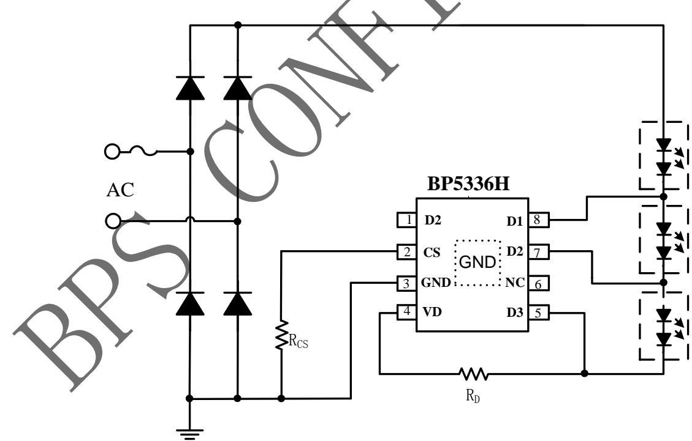
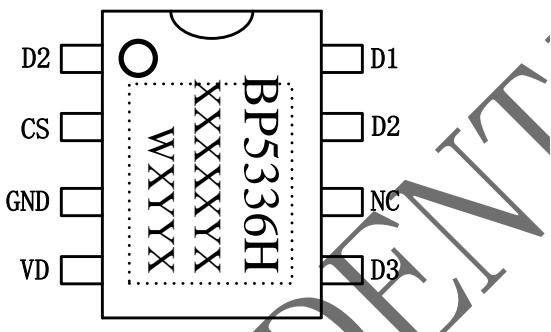
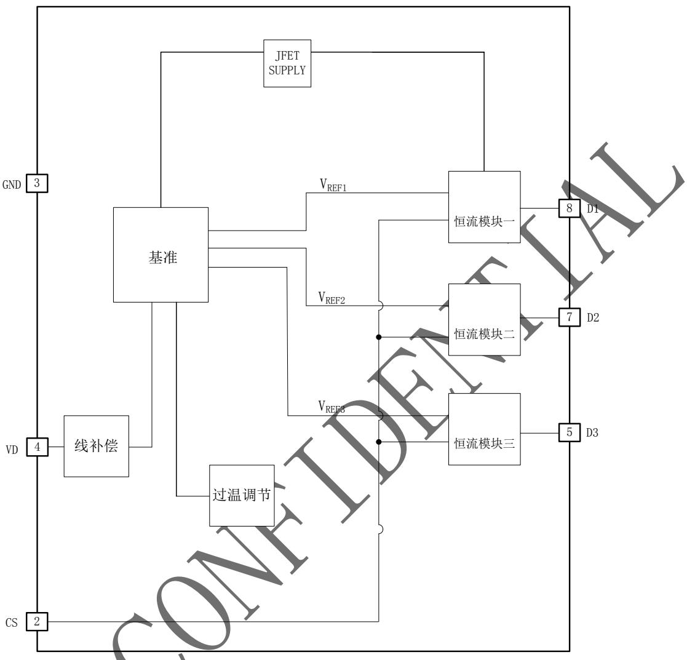
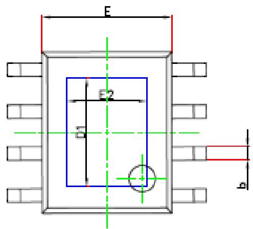
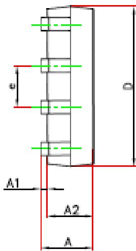
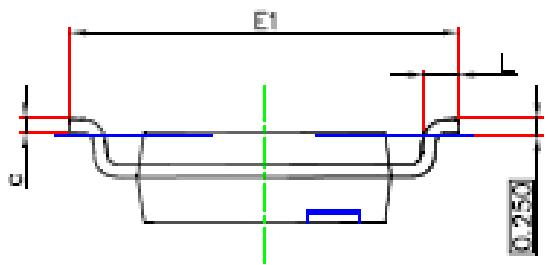

## 概述

BP5336H是一款高精度分段线性恒流LED控制芯片，集成了高压整流管和 JFET 高压供电功能。主要用于驱动由市电供电的高电压、低电流LED灯串。由于不需要电解电容和磁性元件，LED 驱动器可以实现小体积、长寿命，并符合 EMI规定。

BP5336H 可以通过外部电阻精确的设定 LED 电流，芯片通过优化分段导通时的电流，有利于减小THD。

BP5336H 具有过温调节功能。当输入电压过高，或者 LED电流过大时，此功能将降低输出电流。

BP5336H 集成了输入线电压补偿功能，在输入线电压过高时，BP5336H 将按照外置的补偿电阻减小输出电流，保证输入功率基本不随线电压变化。

BP5336H 内部优化了打线，在多芯片并联时方便走线，节省跳线电阻。

## 特点

◆ 外围电路非常简单，驱动器体积非常小

◆ 无需电解电容和磁性元件

◆ 700V 高压 MOS 管

◆ 多芯片并联使用时可节省跳线电阻

◆ 母线电压变化±20%仍可工作

◆ 超快 LED 启动

◆ LED电流可外部设定

◆ 输入线电压补偿功能

◆ 内置过温降电流功能

◆ 采用 SOP8-EP 封装

## 应用

◆ GU10/E27 LED 球泡灯、射灯

◆ LED 蜡烛灯

◆ 其它 LED 照明

## 典型应用

  
图 1 BP5336H 典型应用图

## 定购信息

<table><tr><td>定购型号</td><td>封装</td><td>温度范围</td><td>包装形式</td><td>打印</td></tr><tr><td>BP5336H</td><td>SOP8-EP</td><td>-40 °C到105 °C</td><td>编带4,000颗/盘</td><td>BP5336HXXXXXYWXYYYX</td></tr></table>

## 管脚封装

  
图 2 管脚封装图

XXXXXY: Lot Code

WX: 标号

YY：周号

## 管脚描述

<table><tr><td>管脚号</td><td>管脚名称</td><td>描述</td></tr><tr><td>1</td><td>D2</td><td>第二段LED灯接口端</td></tr><tr><td>2</td><td>CS</td><td>电流采样端,接采样电阻到地</td></tr><tr><td>3,散热片</td><td>GND</td><td>芯片地</td></tr><tr><td>4</td><td>VD</td><td>外部功率MOS管的漏极信号输入端,通过电阻接到外部功率MOS管的漏极</td></tr><tr><td>5</td><td>D3</td><td>第三段LED灯接口端</td></tr><tr><td>6</td><td>NC</td><td>悬空</td></tr><tr><td>7</td><td>D2</td><td>第二段LED灯接口端</td></tr><tr><td>8</td><td>D1</td><td>第一段LED灯接口端</td></tr></table>

## 极限参数(注 1)

<table><tr><td>符号</td><td>参数</td><td>参数范围</td><td>单位</td></tr><tr><td>D1, D2, D3</td><td>700V芯片高压接口</td><td>700</td><td>V</td></tr><tr><td>CS, VD</td><td>芯片低压接口</td><td>-0.3~6</td><td>V</td></tr><tr><td> $P_{DMAX}$ </td><td>功耗(注2)</td><td>1</td><td>W</td></tr><tr><td> $\theta_{JA}$ </td><td>PN结到环境的热阻</td><td>60</td><td>°C/W</td></tr><tr><td> $T_J$ </td><td>工作结温范围</td><td>-40 to 150</td><td>°C</td></tr><tr><td> $T_{STG}$ </td><td>储存温度范围</td><td>-55 to 150</td><td>°C</td></tr><tr><td></td><td>ESD (注3)</td><td>2</td><td>KV</td></tr></table>

注 1：最大极限值是指超出该工作范围，芯片有可能损坏。推荐工作范围是指在该范围内，器件功能正常，但并不完全保证满足个别性能指标。电气参数定义了器件在工作范围内并且在保证特定性能指标的测试条件下的直流和交流电参数规范。对于未给定上下限值的参数，该规范不予保证其精度，但其典型值合理反映了器件性能。注 $2 \colon$ ：温度升高最大功耗一定会减小，这也是由 TJMAX, θJA,和环境温度 TA所决定的。最大允许功耗为 $\mathrm { P _ { D M X } = \left( T _ { J M X } - T _ { A } \right) / }$ θJA或是极限范围给出的数字中比较低的那个值。

注 3：人体模型， $1 0 0 \mathrm { p F }$ 电容通过 1.5KΩ 电阻放电。

## 推荐工作范围

<table><tr><td>符号</td><td>参数</td><td>参数范围</td><td>单位</td></tr><tr><td> $I_{LED}$ </td><td>LED输出电流 @Vout=250V输入电压:176~265Vac</td><td>&lt;40</td><td>mA</td></tr><tr><td> $I_{LED}$ </td><td>LED输出电流 @Vout=132V输入电压:108~132Vac</td><td>&lt;80</td><td>mA</td></tr></table>

电气参数(注 4, 5)（无特别说明情况下，TA=25℃）

<table><tr><td>符号</td><td>参数描述</td><td>条件</td><td>最小值</td><td>典型值</td><td>最大值</td><td>单位</td></tr><tr><td colspan="7">工作电流</td></tr><tr><td> $I_{CC}$ </td><td>静态工作电流</td><td>D1=30V</td><td></td><td>100</td><td></td><td>uA</td></tr><tr><td colspan="7">电流采样</td></tr><tr><td> $V_{REF1}$ </td><td>第一电流基准</td><td>D1=30V, Rcs=120Ω</td><td>342</td><td>360</td><td>378</td><td>mV</td></tr><tr><td> $V_{REF2}$ </td><td>第二电流基准</td><td>D1, D2=30V, Rcs=120Ω</td><td>404</td><td>425</td><td>446</td><td>mV</td></tr><tr><td> $V_{REF3}$ </td><td>第三电流基准</td><td>D1, D3=30V, Rcs=120Ω</td><td>475</td><td>500</td><td>525</td><td>mV</td></tr><tr><td colspan="7">过热调节</td></tr><tr><td> $T_{REG}$ </td><td>过热调节温度</td><td></td><td></td><td>140</td><td></td><td>°C</td></tr></table>

注 4：典型参数值为25˚C 下测得的参数标准。

注 5：规格书的最小、最大规范范围由测试保证，典型值由设计、测试或统计分析保证。

## 内部结构框图

  
图 3 BP5336H 内部框图

## 应用信息

BP5336H是一款高精度分段线性恒流LED控制芯片，主要用于驱动由市电供电的高电压、低电流 LED灯串。

## 1 供电

在系统上电后，D1通过内部的高压 JFET给芯片供电，当 D1的电压超过10V之后芯片开始工作。

## 2 驱动机制

BP5336H根据母线电压变化而改变接入的LED灯数，因此可以在整个交流周期内，增加 LED 被点亮的时间，从而提高 LED 的利用率和总输出流明数。在输入电压较低时，会有部分 LED 点亮；在输入电压较高时，大部分或全部 LED都点亮。

BP5336H 可以自动适应不同的 LED 灯串正向压降，无需外部电阻设置灯串切换电压。根据输入交流电压的高低（110V，220V），只需要选择合适的正向压降的 LED灯串。

## 3 恒流控制，输出电流设置

BP5336H 可以通过外部电阻精确设定 LED电流。

LED 分段导通时，每段输出电流计算公式：

$$
I _ {L E D n} = \frac {V r e f _ {n}}{R c s}
$$

其中，n=1,2,3。分别为各段的基准。

## 4 过温调节功能

BP5336H 具有过热调节功能，在驱动电源过热时逐渐减小输出电流，从而控制输出功率和温升，使电源温度保持在设定值，以提高系统的可靠性。过热调节温度为芯片内部设定值 140℃。

## 5 输入线电压补偿功能

当第三段 LED亮起时，为了减小损耗，BP5336H根据 D3端的电压高低来减小LED电流，减小的幅度通过外置VD到D3的电阻设置。关系式如下所述：

$$
V _ {R E F 3} = 0. 5 - \frac {1 . 2 6 K \Omega}{R _ {D}} * (V _ {D 3} - 1)
$$

R :线电压补偿电阻.

## PCB 设计

在设计 BP5336H PCB 板时，需要注意以下事项：

## 地线

电流采样电阻的功率地线尽可能短。地和 Drain的铺铜面积要尽可能大，以减小热阻，增强散热能力。

BP5336H 芯片底部有增强散热能力的散热片，在芯片内部已经连接到 GND 引脚。在设计 PCB 时，将散热片连接到 PCB 的地。为了达到良好的散热效果，需要将散热片连接的铜皮面积尽量大。

## 封装信息

SOP8-EP (EXP PAD) PACKAGE OUTLINE DIMENSIONS  

  
晶丰明源专用

<table><tr><td rowspan="2">Symbol</td><td colspan="2">Dimensions In Millimeters</td><td colspan="2">Dimensions In Inches</td></tr><tr><td>Min</td><td>Max</td><td>Min</td><td>Max</td></tr><tr><td>A</td><td>1.350</td><td>1.700</td><td>0.053</td><td>0.067</td></tr><tr><td>A1</td><td>0.000</td><td>0.100</td><td>0.000</td><td>0.004</td></tr><tr><td>A2</td><td>1.350</td><td>1.550</td><td>0.053</td><td>0.061</td></tr><tr><td>c</td><td>0.170</td><td>0.250</td><td>0.007</td><td>0.010</td></tr><tr><td>E</td><td>3.800</td><td>4.000</td><td>0.150</td><td>0.157</td></tr><tr><td>E1</td><td>5.800</td><td>6.200</td><td>0.228</td><td>0.244</td></tr><tr><td>E2</td><td>2.313</td><td>2.513</td><td>0.091</td><td>0.099</td></tr><tr><td>L</td><td>0.400</td><td>1.270</td><td>0.016</td><td>0.050</td></tr><tr><td>b</td><td>0.330</td><td>0.510</td><td>0.013</td><td>0.020</td></tr><tr><td>D</td><td>4.700</td><td>5.100</td><td>0.185</td><td>0.201</td></tr><tr><td>D1</td><td>3.202</td><td>3.402</td><td>0.126</td><td>0.134</td></tr><tr><td>e</td><td colspan="2">1.270 BASIC</td><td colspan="2">0.050 BASIC</td></tr><tr><td>θ</td><td> $0^{\circ}$ </td><td> $8^{\circ}$ </td><td> $0^{\circ}$ </td><td> $8^{\circ}$ </td></tr></table>