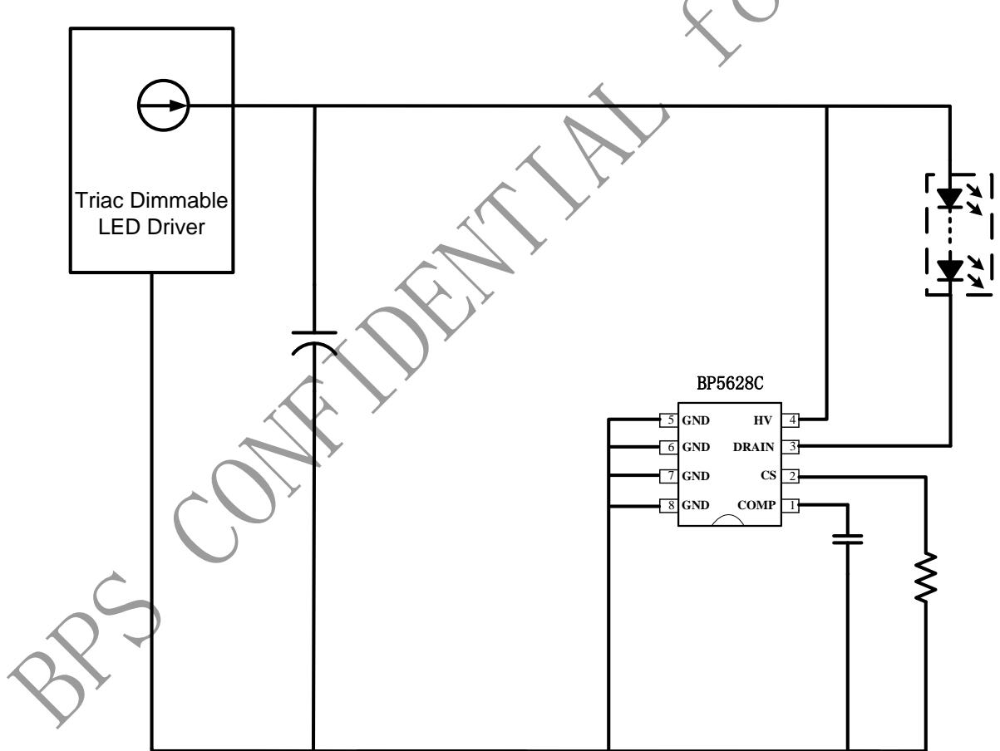
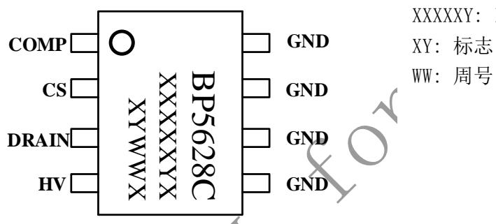
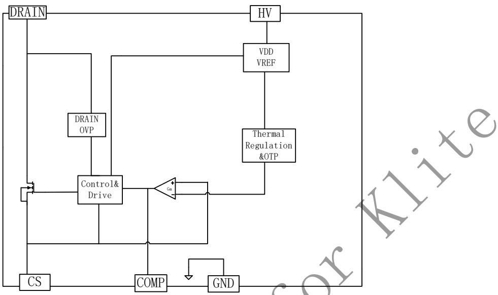
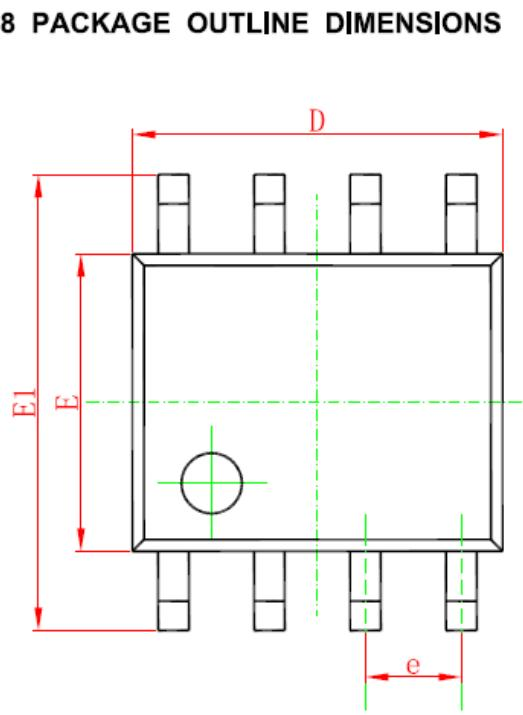
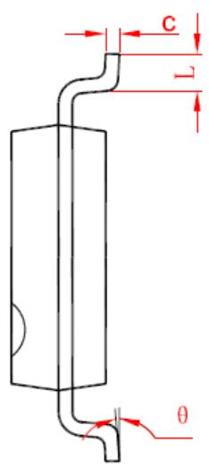
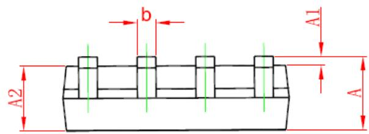

## 概述

BP5628C是一款调光全程LED电流纹波消除控制芯片，主要用于配合可控硅调光、有源功率因数校正 LED 驱动器，消除输出 100/120Hz 低频纹波电流。BP5628C采用高效率的驱动机制，能够自动适应不同的LED输出电压和电流，消除 LED电流纹波的同时，确保功率MOS管的损耗最低。

BP5628C具有多重保护功能，包括MOS管漏极过压保护，芯片过温调节保护和过热保护等。

BP5628C 采用 SOP-8 封装。

## 特点

◼ 集成 500V JFET 供电

◼ 内置去纹波LDO

◼ 固定的 DRAIN 脚 OVP 保护电压

◼ 外围元器件简单

◼ 芯片过温调节保护功能

◼ 采用 SOP-8 封装

## 应用

◼ LED 灯丝灯

◼ LED 球泡灯

◼ 其它 LED 照明

## 典型应用

  
图 1 BP5628C 典型应用图

## 定购信息

<table><tr><td>定购型号</td><td>封装</td><td>温度范围</td><td>包装形式</td><td>打印</td></tr><tr><td>BP5628C</td><td>SOP-8</td><td>-40 °C到105 °C</td><td>编带4,000颗/盘</td><td>BP5628CXXXXXYXXYWWX</td></tr></table>

## 管脚封装

XXXXXY: lot code

XY: 标志

WW: 周号

图 2 管脚封装图

## 管脚描述

<table><tr><td>管脚号</td><td>管脚名称</td><td>描述</td></tr><tr><td>1</td><td>COMP</td><td>环路补偿点,接电容到地</td></tr><tr><td>2</td><td>CS</td><td>电流采样脚</td></tr><tr><td>3</td><td>DRAIN</td><td>引脚功率管漏极</td></tr><tr><td>4</td><td>HV</td><td>功率管漏极</td></tr><tr><td>5,6,7,8</td><td>GND</td><td>芯片地</td></tr></table>

## 极限参数(注 1)

<table><tr><td>符号</td><td>参数</td><td>参数范围</td><td>单位</td></tr><tr><td>DRAIN</td><td>内置 MOSFET 漏极</td><td>-0.3~43</td><td>V</td></tr><tr><td>HV</td><td>芯片供电引脚</td><td>-0.3~500</td><td>V</td></tr><tr><td>COMP</td><td>环路补偿点,接电容到地</td><td>-0.3~6</td><td>V</td></tr><tr><td>CS</td><td>电流采样脚</td><td>-0.3~6</td><td>V</td></tr><tr><td> $P_{DMAX}$ </td><td>功耗(注 2)</td><td>0.45</td><td>W</td></tr><tr><td> $θ_{JA}$ </td><td>PN结到环境的热阻</td><td>145</td><td>°C/W</td></tr><tr><td> $T_J$ </td><td>工作结温范围</td><td>-40 to 150</td><td>°C</td></tr><tr><td> $T_{STG}$ </td><td>储存温度范围</td><td>-55 to 150</td><td>°C</td></tr></table>

注 1：最大极限值是指超出该工作范围，芯片有可能损坏。推荐工作范围是指在该范围内，器件功能正常，但并不完全保证满足个别性能指标。电气参数定义了器件在工作范围内并且在保证特定性能指标的测试条件下的直流和交流电参数规范。对于未给定上下限值的参数，该规范不予保证其精度，但其典型值合理反映了器件性能。注 2：温度升高最大功耗一定会减小，这也是由 TJMAX, θJA,和环境温度 TA所决定的。最大允许功耗为 $\mathrm { P _ { D M A X } } = \left( \mathrm { T _ { J M A X } } - \mathrm { T _ { \it A } } \right) / \mathrm { ~ \theta ~ }$ JA或是极限范围给出的数字中比较低的那个值。

电气参数(注 3, 4) （无特别说明情况下， ${ \tt V } _ { \tt C } = 9 \mathrm { ~ \tt V } ,$ $\mathrm { T _ { A } } = 2 5 \mathrm { ~ \textdegree C } )$

<table><tr><td>符号</td><td>描述</td><td>条件</td><td>最小值</td><td>典型值</td><td>最大值</td><td>单位</td></tr><tr><td colspan="7">电源供电</td></tr><tr><td> $V_{HV}$ </td><td>JFET工作电压范围</td><td></td><td>7</td><td></td><td>500</td><td>V</td></tr><tr><td> $I_{CC}$ </td><td>静态工作电流</td><td>HV=40V</td><td></td><td>140</td><td>200</td><td>uA</td></tr><tr><td colspan="7">OVP保护</td></tr><tr><td> $V_{DRAIN\_OVP}$ </td><td>DRAIN过压保护电压</td><td></td><td></td><td>10</td><td></td><td>V</td></tr><tr><td colspan="7">环路补偿</td></tr><tr><td> $V_{COMP\_MAX}$ </td><td>COMP脚最大工作电压</td><td></td><td>5.5</td><td></td><td></td><td>V</td></tr><tr><td> $Gm_{OTA}$ </td><td>OTA Gm</td><td></td><td></td><td>50</td><td></td><td>uA/V</td></tr><tr><td colspan="7">电流检测</td></tr><tr><td> $V_{REF}$ </td><td>CS参考电压</td><td></td><td></td><td>240</td><td></td><td>mV</td></tr><tr><td colspan="7">功率管</td></tr><tr><td> $V_{BV}$ </td><td>MOS管击穿电压</td><td></td><td>43</td><td></td><td></td><td>V</td></tr><tr><td> $I_{DS}$ </td><td>MOS饱和电流</td><td></td><td></td><td>500</td><td></td><td>mA</td></tr><tr><td> $R_{DS\_ON}$ </td><td>MOS管导通电阻</td><td> $I_{D}=100mA$ </td><td></td><td>2</td><td></td><td>Ω</td></tr><tr><td colspan="7">过温调节</td></tr><tr><td> $T_{REG}$ </td><td>温度调节点</td><td></td><td></td><td>155</td><td></td><td>°C</td></tr><tr><td> $T_{SD}$ </td><td>过温保护点</td><td></td><td></td><td>175</td><td></td><td>°C</td></tr><tr><td> $T_{SD\_Hyst}$ </td><td>过温保护迟滞</td><td></td><td></td><td>30</td><td></td><td>°C</td></tr></table>

注 3：典型参数值为 25˚C 下测得的参数标准。

注 4：规格书的最小、最大规范范围由测试保证，典型值由设计、测试或统计分析保证。

## 内部结构框图

  
图 3 BP5628C 内部框图

## 应用信息

BP5628C是一款调光全程LED电流纹波消除控制芯片，主要用于配合可控硅调光、有源功率因数校正 LED 驱动器，消除输出 100/120Hz 低频纹波电流。BP5628C采用高效率的驱动机制，能够自动适应不同的LED输出电压和电流，消除 LED电流纹波的同时，确保功率MOS管的损耗最低。BP5628C具有多重保护功能，包括MOS管漏极过压保护，芯片过温调节保护和过热保护等。

## 启动和供电

BP5628C 通过 HV 管脚给芯片内部 VDD 供电，当 VDD充电至启动电压时芯片开始工作。

## 采用电阻计算

采样电阻计算公式：

$$
R c s \approx \frac {2 4 0 \mathrm{mV} * 0 . 6}{I o u t}
$$

其中，Iout是LED输出电流

BP5628C会自适应的调整LED 电流，使LED电流等于前级输出电流的平均值。

## 保护功能

BP5628C 具有多重保护功能，包括 MOS管漏极过压保护，芯片过温调节保护和过热保护等。

## 芯片过温调节保护

芯片进入过温调节点后，芯片会降低内部基准，控制内部 MOS 导通程度，芯片逐渐退出去纹波功能，从而控制温升，以提高系统的可靠性。

## PCB 设计

在设计 BP5628C PCB时，需要遵循以下原则：

## 补偿电容

COMP的补偿电容需要紧靠芯片 COMP 和 GND 引脚。

## 地线

电流采样电阻的功率地线尽可能短，且要和芯片的地线及其它小信号的地线分开接到前级输出电容的地端。

## 散热

应尽可能的扩大 BP5628C DRAIN 及 GND 管脚所连接的铜箔面积，以减小热阻，增强散热能力。

## 封装信息

<table><tr><td rowspan="2">Symbol</td><td colspan="2">Dimensions In Millimeters</td><td colspan="2">Dimensions In Inches</td></tr><tr><td>Min</td><td>Max</td><td>Min</td><td>Max</td></tr><tr><td>A</td><td>1.350</td><td>1.750</td><td>0.053</td><td>0.069</td></tr><tr><td>A1</td><td>0.100</td><td>0.250</td><td>0.004</td><td>0.010</td></tr><tr><td>A2</td><td>1.350</td><td>1.550</td><td>0.053</td><td>0.061</td></tr><tr><td>b</td><td>0.330</td><td>0.510</td><td>0.013</td><td>0.020</td></tr><tr><td>c</td><td>0.170</td><td>0.250</td><td>0.006</td><td>0.010</td></tr><tr><td>D</td><td>4.700</td><td>5.100</td><td>0.185</td><td>0.200</td></tr><tr><td>E</td><td>3.800</td><td>4.000</td><td>0.150</td><td>0.157</td></tr><tr><td>E1</td><td>5.800</td><td>6.200</td><td>0.228</td><td>0.244</td></tr><tr><td>e</td><td colspan="2">1.270 (BSC)</td><td colspan="2">0.050 (BSC)</td></tr><tr><td>L</td><td>0.400</td><td>1.270</td><td>0.016</td><td>0.050</td></tr><tr><td>θ</td><td> $0^{\circ}$ </td><td> $8^{\circ}$ </td><td> $0^{\circ}$ </td><td> $8^{\circ}$ </td></tr></table>

<table><tr><td>重要声明</td></tr><tr><td>晶丰明源尽力确保本产品规格书内容的准确和可靠,但是保留在没有通知的情况下,修改规格书内容的权利。</td></tr><tr><td>本产品规格书未包含任何针对晶丰明源或第三方所有的知识产权的授权。针对本产品规格书所记载的信息,晶丰明源不做任何明示或暗示的保证,包括但不限于对规格书内容的准确性、商业上的适销性,特定目的的适用性或者不侵犯晶丰明源或任何第三人知识产权做任何明示或暗示保证,晶丰明源也不就因本规格书本身及其使用有关的偶然或必然损失承担任何责任。</td></tr></table>