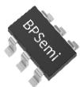
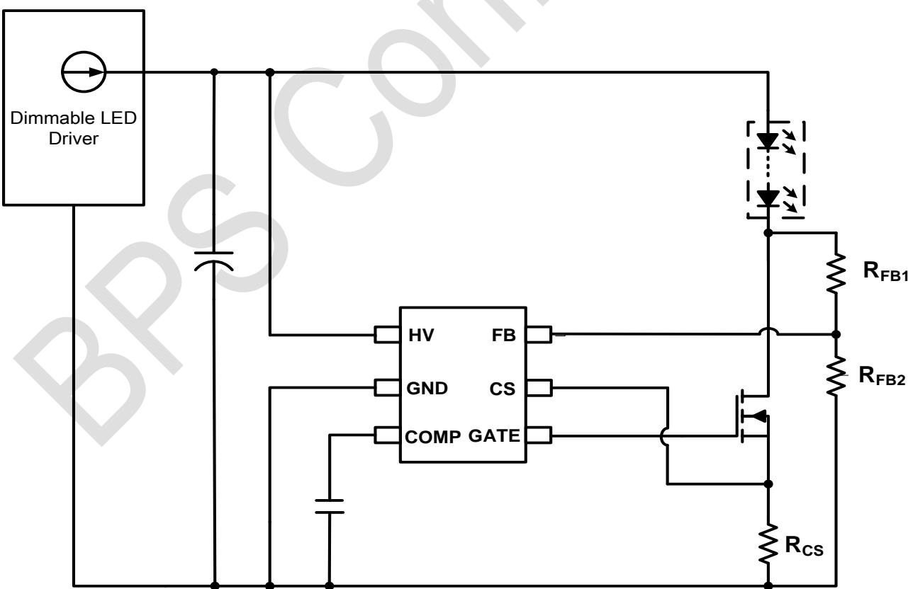
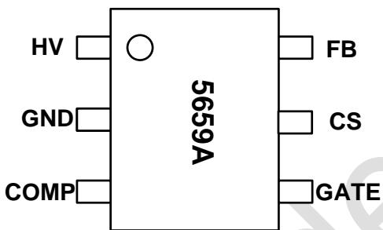
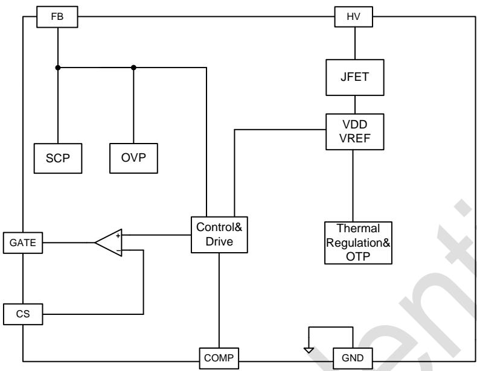
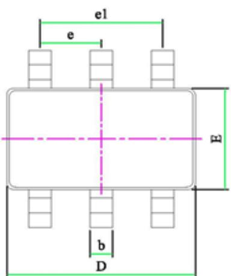
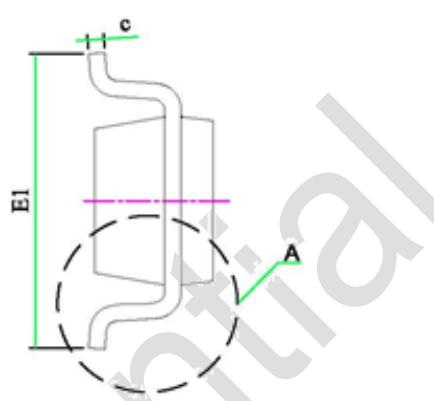
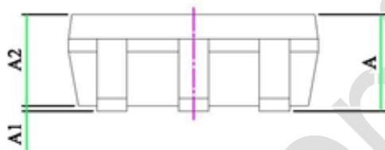
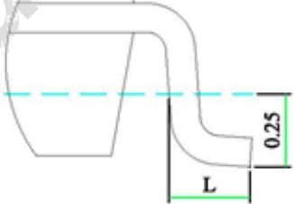

## 概述

BP5659A 是一款调光全程 LED 电流纹波抑制控制芯片，主要用于配合可控硅调光、有源功率因数校正 LED 驱动器，抑制输出低频纹波电流。BP5659A 采用高效率的驱动机制，能够自动适应不同的 LED 输出电压和电流，抑制LED 电流纹波的同时，确保功率 MOS管的损耗较低。

BP5659A 具有多重保护功能，包括 MOS管漏极过压保护，短路保护，芯片过温调节保护等。

BP5659A 采用 SOT23-6 封装。

  
SOT23-6

## 特点

◼ 集成 500V JFET 供电

◼ OVP 保护电压可调

◼ 短路保护电压可调

◼ 外围元件少

◼ 过温调节保护功能

◼ 采用 SOT23-6 封装

## 应用

◼ LED 球泡灯

LED 面板灯

◼ 其它 LED 照明

## 典型应用

  
图 1 .BP5659A 典型应用图

## 定购信息

<table><tr><td>定购型号</td><td>封装</td><td>包装形式</td><td>打印</td></tr><tr><td>BP5659A</td><td>SOT23-6</td><td>编带3,000 颗/盘</td><td>5659A</td></tr></table>

## 管脚封装

  
图 2. 管脚封装图

## 管脚描述

<table><tr><td>管脚号</td><td>管脚名称</td><td>描述</td></tr><tr><td>1</td><td>HV</td><td>高压供电</td></tr><tr><td>2</td><td>GND</td><td>芯片地</td></tr><tr><td>3</td><td>COMP</td><td>环路补偿脚</td></tr><tr><td>4</td><td>GATE</td><td>功率管栅极驱动输出端</td></tr><tr><td>5</td><td>CS</td><td>输出电流反馈端</td></tr><tr><td>6</td><td>FB</td><td>功率管漏极检测反馈输入端</td></tr></table>

## 极限参数(注 1)

<table><tr><td>符号</td><td>参数</td><td>参数范围</td><td>单位</td></tr><tr><td>HV</td><td>芯片供电引脚</td><td>-0.3~500</td><td>V</td></tr><tr><td>GATE</td><td>功率管栅极驱动输出端</td><td>-0.3~20</td><td>V</td></tr><tr><td>CS</td><td>输出电流反馈端</td><td>-0.3~6</td><td>V</td></tr><tr><td>FB</td><td>功率管漏极检测反馈输入端</td><td>-0.3~6</td><td>V</td></tr><tr><td>COMP</td><td>环路补偿脚</td><td>-0.3~6</td><td>V</td></tr><tr><td> $P_{DMAX}$ </td><td>功耗(注2)</td><td>0.3</td><td>W</td></tr><tr><td> $\theta_{JA}$ </td><td>PN结到环境的热阻</td><td>240</td><td>°C/W</td></tr><tr><td> $T_J$ </td><td>工作结温范围</td><td>-40 to 150</td><td>°C</td></tr><tr><td> $T_{STG}$ </td><td>储存温度范围</td><td>-55 to 150</td><td>°C</td></tr></table>

注 1：最大极限值是指超出该工作范围，芯片有可能损坏。推荐工作范围是指在该范围内，器件功能正常，但并不完全保证满足个别性能指标。电气参数定义了器件在工作范围内并且在保证特定性能指标的测试条件下的直流和交流电参数规范。对于未给定上下限值的参数，该规范不予保证其精度，但其典型值合理反映了器件性能。  
注 2：温度升高最大功耗一定会减小，这也是由 TJMAX, θJA,和环境温度 TA所决定的。最大允许功耗为 $\mathsf { P } _ { \mathsf { D M A X } } = ( \mathsf { T } _ { \mathsf { J M A X } } - \mathsf { T } _ { \mathsf { A } } ) / \mathsf { \Omega } \Theta _ { \mathsf { J A } }$ 或是极限范围给出的数字中比较低的那个值。

电气参数(注 3, 4) （无特别说明情况下，VHV =40 V, TA =25 ℃）

<table><tr><td>符号</td><td>描述</td><td>条件</td><td>最小值</td><td>典型值</td><td>最大值</td><td>单位</td></tr><tr><td colspan="7">电源供电</td></tr><tr><td> $V_{HV}$ </td><td>JFET 工作电压范围</td><td></td><td>16</td><td></td><td>500</td><td>V</td></tr><tr><td>ICC</td><td>静态工作电流</td><td>HV=40V</td><td></td><td>150</td><td>200</td><td>uA</td></tr><tr><td colspan="7">FB 设置</td></tr><tr><td> $V_{FB\_OVP1}$ </td><td>FB 过压保护电压阈值 1</td><td>CS=0.2V</td><td></td><td>2.0</td><td></td><td>V</td></tr><tr><td> $V_{FB\_OVP2}$ </td><td>FB 过压保护电压阈值 2</td><td>CS=0V</td><td></td><td>0.5</td><td></td><td>V</td></tr><tr><td> $V_{FB\_CLAMP}$ </td><td>LED 短路保护 FB 引脚钳位电压</td><td></td><td>4.2</td><td>5.3</td><td>6.4</td><td>V</td></tr><tr><td> $I_{FB\_OCP}$ </td><td>LED 短路保护 FB 过流保护电流阈值</td><td></td><td>130</td><td>160</td><td>190</td><td>uA</td></tr><tr><td colspan="7">CS 基准</td></tr><tr><td> $V_{CS\_LMT}$ </td><td>CS 电压限值</td><td></td><td></td><td>0.2</td><td></td><td>V</td></tr><tr><td colspan="7">过温调节</td></tr><tr><td> $T_{REG}$ </td><td>温度调节点</td><td></td><td></td><td>150</td><td></td><td>°C</td></tr></table>

注 3：典型参数值为 25˚C下测得的参数标准。  
注 4：规格书的最小、最大规范范围由测试保证，典型值由设计、测试或统计分析保证。

## 内部结构框图

  
图 3. BP5659A 内部框图

## 应用信息

BP5659A 是一款调光全程 LED 电流纹波抑制控制芯片主要用于配合可控硅调光、有源功率因数校正 LED 驱动器，抑制输出低频纹波电流。BP5659A 采用高效动机制，能够自动适应不同的 LED 输出LED 电流纹波的同时，确保功率 MOS管的损耗较BP5659A 具有多重保护功能，包括 MOS管漏极过压保护，短路保护，芯片过温调节保护等。

## 启动和供电

BP5659A 通过 HV 引脚给芯片内部 VDD 供电，当 VDD充电至启动电压时芯片开始工作。

## 环路带宽调节

BP5659A 的 COMP 引脚可以支持通过不同电容值调节输出环路带宽，电容值越小环路带宽越高，输出纹波越大，反应速度越快，动态调节效果越好。

## 电流采样电阻计算

CS采样电阻根据输出电流设定：

$$
R _ {C S} \approx \frac {V _ {C S \_ L M T}}{I _ {O U T}}
$$

## 其中：

$I _ { O U T }$ 是前级输出平均电流， $V _ { C S \_ L M T }$ 是芯片内部基准电压。

## 漏极电压控制

BP5659A 通过控制 DRAIN 电压实现去频闪功能。正常去频闪时，DRAIN 的平均电压如下：

$$
V _ {D \_ A V G} \approx 0. 5 \cdot (0. 5 + 7. 4 \cdot V _ {C S}) \cdot \left(1 + \frac {R _ {U}}{R _ {D}}\right)
$$

其中：

$V _ { C S }$ 是 CS 引脚平均电压， $R _ { U }$ 是 FB 上分压电阻； $R _ { D }$ 是 FB下分压电阻。

## 保护功能

BP5659A 具有多重保护功能，包括 MOS管漏极过压保护，输出短路保护，芯片过温调节保护等。

## 芯片过温调节保护

芯片进入过温调节点后，芯片会降低内部基准，控制内部MOS 导通程度，芯片逐渐退出纹波抑制功能，从而控制

温升，以提高系统的可靠性。

## MOS 管漏极过压保护

当前级能量快速增加时，芯片DRAIN 电压也会快速上升，当DRAIN电压在FB引脚的分压达到芯片内置OVP 电压阈值时，去频闪电流快速增加，使DRAIN电压钳位在OVP电压点，防止过高电压将芯片击穿同时抑制输出电流过冲现象。过压保护值按下式设定：

$$
V _ {D \_ O V P} \approx (0. 5 + 7. 4 \cdot V _ {C S}) \cdot \left(1 + \frac {R _ {U}}{R _ {D}}\right)
$$

其中：

$V _ { C S }$ 是 CS 引脚平均电压， $R _ { U }$ 是 FB 上分压电阻； $R _ { D }$ 是 FB下分压电阻。

## 输出短路保护

当 LED 短路时，去频闪 MOS的漏极电压快速上升，达到前级输出电压，而 FB 电压被内部箝位，当钳位电路的电流超过短路保护阈值时，芯片进入短路保护状态，降低系统功耗，提高可靠性。短路保护值按照下式设定：

$$
V _ {D \_ S C P} \approx V _ {F B \_ C L P} \cdot \left(1 + \frac {R _ {U}}{R _ {D}}\right) + I _ {F B \_ S C P} \cdot R _ {U}
$$

其中：

$R _ { U }$ 是 FB 上分压电阻； $R _ { D }$ 是 FB 下分压电阻； $I _ { F B \_ S C P }$ 为芯片内部短路保护基准电流。 $V _ { F B \_ C L P }$ 为短路保护时 FB 引脚的内部箝位电压。

## PCB 设计

在设计 BP5659A PCB 时，需要遵循以下原则：

## 散热

应尽可能的扩大去频闪外置 MOS 漏极的铜箔面积，以减小热阻，增强散热能力。

## 抗干扰

FB 引脚，CS引脚，COMP 引脚走线尽量短，外围电阻靠近芯片。

## 封装信息

<table><tr><td rowspan="2">SYMBOL</td><td colspan="3">MILLIMETER</td></tr><tr><td>MIN</td><td>NOM</td><td>MAX</td></tr><tr><td>A</td><td>-</td><td>-</td><td>1.45</td></tr><tr><td>A1</td><td>-</td><td>-</td><td>0.15</td></tr><tr><td>A2</td><td>0.89</td><td>-</td><td>1.30</td></tr><tr><td>D</td><td>2.80</td><td>-</td><td>3.03</td></tr><tr><td>E</td><td>1.50</td><td>1.60</td><td>1.73</td></tr><tr><td>E1</td><td>2.60</td><td>2.80</td><td>3.00</td></tr><tr><td>L</td><td>0.30</td><td>0.45</td><td>0.60</td></tr><tr><td>b</td><td>0.30</td><td>0.40</td><td>0.50</td></tr><tr><td>c</td><td>0.09</td><td>0.15</td><td>0.20</td></tr><tr><td>e</td><td>0.85</td><td>-</td><td>1.05</td></tr><tr><td>e1</td><td>1.80</td><td>1.90</td><td>2.00</td></tr></table>

DETAIL A

## 版本信息

<table><tr><td>版本</td><td>日期</td><td>记录</td></tr><tr><td>Rev. 1.0</td><td>2021/06</td><td>首次发行</td></tr><tr><td>Rev. 1.1</td><td>2024/08</td><td>更新 GATE 电压范围</td></tr><tr><td></td><td></td><td></td></tr><tr><td></td><td></td><td></td></tr><tr><td></td><td></td><td></td></tr><tr><td></td><td></td><td></td></tr></table>

## 免责声明

晶丰明源尽力确保本产品规格书内容的准确和可靠，但是保留在没有通知的情况下，修改规格书内容的权利。

本产品规格书未包含任何针对晶丰明源或第三方所有的知识产权的授权。针对本产品规格书所记载的信息，晶丰明源不做任何明示或暗示的保证，包括但不限于对规格书内容的准确性、商业上的适销性、特定目的的适用性或者不侵犯晶丰明源或任何第三人知识产权做任何明示或暗示保证，晶丰明源也不就因本规格书本身及其使用有关的偶然或必然损失承担任何责任。