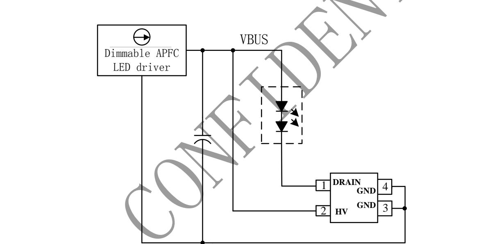
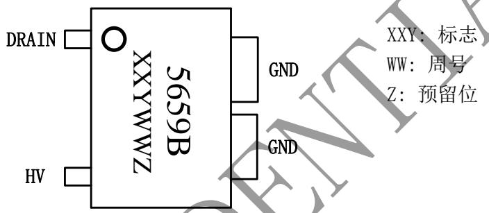
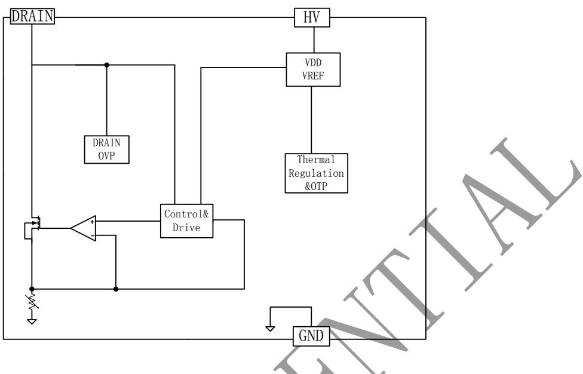
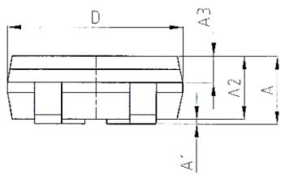
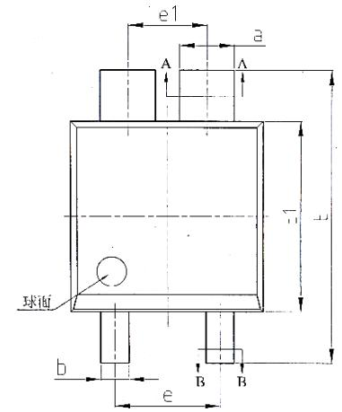
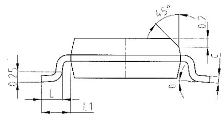
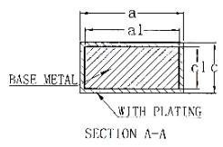
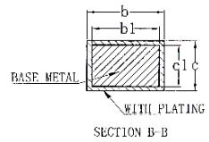
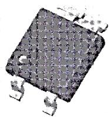

## 概述

BP5659B是一款调光全程LED电流纹波消除控制芯片，主要用于配合可控硅调光、有源功率因数校正 LED 驱动器，消除输出低频纹波电流。BP5659B采用高效率的驱动机制，能够自动适应不同的 LED输出电压和电流，消除 LED电流纹波的同时，确保功率 MOS管的损耗最低。

BP5659B 具有多重保护功能，包括MOS管漏极过压保护，芯片过温调节保护等。

BP5659B 采用 SOT33-3 封装。

## 特点

◼ 集成 500V JFET 供电

◼ 内置去纹波LDO

◼ 固定的 DRAIN 脚 OVP 保护电压

◼ 无需外围元件

◼ 芯片过温调节保护功能

◼ 采用 SOT33-3 封装

## 应用

◼ LED 灯丝灯

◼ LED 球泡灯

◼ 其它 LED 照明

## 典型应用

  
图 1 BP5659B 典型应用图

## 定购信息

<table><tr><td>定购型号</td><td>封装</td><td>温度范围</td><td>包装形式</td><td>打印</td></tr><tr><td>BP5659B</td><td>SOT33-3</td><td>-40 °C到105 °C</td><td>编带15,000颗/盘</td><td>5659BXXYWWZ</td></tr></table>

## 管脚封装

XXY: 标志

WW: 周号

Z: 预留位

图2 管脚封装图

## 管脚描述

<table><tr><td>管脚号</td><td>管脚名称</td><td>描述</td></tr><tr><td>1</td><td>DRAIN</td><td>功率管漏极</td></tr><tr><td>2</td><td>HV</td><td>高压供电</td></tr><tr><td>3</td><td>GND</td><td>芯片地</td></tr></table>

## 极限参数(注 1)

<table><tr><td>符号</td><td>参数</td><td>参数范围</td><td>单位</td></tr><tr><td>DRAIN</td><td>内置 MOSFET 漏极</td><td>-0.3~40</td><td>V</td></tr><tr><td>HV</td><td>芯片供电引脚</td><td>-0.3~500</td><td>V</td></tr><tr><td> $P_{DMAX}$ </td><td>功耗(注 2)</td><td>0.35</td><td>W</td></tr><tr><td> $\theta_{JA}$ </td><td>PN结到环境的热阻</td><td>170</td><td>°C/W</td></tr><tr><td> $T_J$ </td><td>工作结温范围</td><td>-40 to 150</td><td>°C</td></tr><tr><td> $T_{STG}$ </td><td>储存温度范围</td><td>-55 to 150</td><td>°C</td></tr></table>

注 1：最大极限值是指超出该工作范围，芯片有可能损坏。推荐工作范围是指在该范围内，器件功能正常，但并不完全保证满足个别性能指标。电气参数定义了器件在工作范围内并且在保证特定性能指标的测试条件下的直流和交流电参数规范。对于未给定上下限值的参数，该规范不予保证其精度，但其典型值合理反映了器件性能。

注 2：温度升高最大功耗一定会减小，这也是由 T , θ ,和环境温度 T 所决定的。最大允许功耗为 $\mathrm { P _ { D M A X } } = \left( \mathrm { T } _ { \mathrm { J M A X } } - \mathrm { T } _ { \mathrm { A } } \right) / \mathrm { ~ \theta ~ }$ JA或是极限范围给出的数字中比较低的那个值。

电气参数(注 3, 4) （无特别说明情况下， $\mathrm { V _ { H V } = 4 0 \Delta V , ~ T _ { A } = 2 5 \Delta ^ { \circ } C ) }$

<table><tr><td>符号</td><td>描述</td><td>条件</td><td>最小值</td><td>典型值</td><td>最大值</td><td>单位</td></tr><tr><td colspan="7">电源供电</td></tr><tr><td> $V_{HV}$ </td><td>JFET 工作电压范围</td><td></td><td>16</td><td></td><td>500</td><td>V</td></tr><tr><td> $I_{CC}$ </td><td>静态工作电流</td><td>HV=15V</td><td></td><td>80</td><td>110</td><td>uA</td></tr><tr><td colspan="7">OVP 保护</td></tr><tr><td> $V_{DRAIN\_OVP}$ </td><td>DRAIN 过压保护电压</td><td></td><td></td><td>22</td><td></td><td>V</td></tr><tr><td colspan="7">功率管</td></tr><tr><td> $V_{BV}$ </td><td>MOS 管击穿电压</td><td></td><td>40</td><td></td><td></td><td>V</td></tr><tr><td> $I_{D\_MAX}$ </td><td>MOS 管饱和电流</td><td>DRAIN=10V</td><td></td><td>150</td><td></td><td>mA</td></tr><tr><td colspan="7">过温调节</td></tr><tr><td> $T_{REG}$ </td><td>温度调节点</td><td></td><td></td><td>140</td><td></td><td>°C</td></tr></table>

注 3：典型参数值为 25˚C 下测得的参数标准。  
注 4：规格书的最小、最大规范范围由测试保证，典型值由设计、测试或统计分析保证。

## 内部结构框图

  
图 3 BP5659B 内部框图

## 应用信息

BP5659B是一款调光全程LED电流纹波消除控制芯片，主要用于配合可控硅调光、有源功率因数校正 LED 驱动器，消除输出低频纹波电流。BP5659B采用高效率的驱动机制，能够自动适应不同的 LED输出电压和电流，消除 LED电流纹波的同时，确保功率 MOS管的损耗最低。

BP5659B 具有多重保护功能，包括MOS管漏极过压保护，芯片过温调节保护等。

## 启动和供电

BP5659B 通过 HV 管脚给芯片内部 VDD 供电，当 VDD充电至启动电压时芯片开始工作。

## 保护功能

BP5659B 具有多重保护功能，包括MOS管漏极过压保护，芯片过温调节保护等。

## 芯片过温调节保护

芯片进入过温调节点后，芯片会降低内部基准，控制内部 MOS 导通程度，芯片逐渐退出去纹波功能，从而控制温升，以提高系统的可靠性。

## MOS 管漏极过压保护

当前级能量快速增加时，芯片 DRAIN 电压也会快速上升，当 DRAIN 电压达到芯片内置 OVP 电压阈值时，芯片电流快速增加，使 DRAIN 电压钳位在OVP 电压点，防止过高电压将芯片击穿。

## PCB 设计

在设计 BP5659B PCB时，需要遵循以下原则：

## 散热

应尽可能的扩大 BP5659B GND 管脚所连接的铜箔面积，以减小热阻，增强散热能力。

## 封装信息

<table><tr><td rowspan="2">SYMBOL</td><td colspan="3">MILLIMETER</td></tr><tr><td>MIN</td><td>NOM</td><td>MAX</td></tr><tr><td>A</td><td>—</td><td>—</td><td>1.15</td></tr><tr><td>A1</td><td>0.05</td><td>—</td><td>0.15</td></tr><tr><td>A2</td><td>0.90</td><td>0.95</td><td>1.00</td></tr><tr><td>A3</td><td>0.35</td><td>0.40</td><td>0.45</td></tr><tr><td>a</td><td>0.72</td><td>—</td><td>0.80</td></tr><tr><td>a1</td><td>0.71</td><td>0.74</td><td>0.77</td></tr><tr><td>b</td><td>0.36</td><td>—</td><td>0.44</td></tr><tr><td>b1</td><td>0.35</td><td>0.38</td><td>0.41</td></tr><tr><td>c</td><td>0.15</td><td>—</td><td>0.19</td></tr><tr><td>c1</td><td>0.14</td><td>0.15</td><td>0.16</td></tr><tr><td>D</td><td>2.50</td><td>2.60</td><td>2.70</td></tr><tr><td>E1</td><td>2.50</td><td>2.60</td><td>2.70</td></tr><tr><td>E</td><td>3.80</td><td>4.00</td><td>4.20</td></tr><tr><td>e</td><td colspan="3">1.42 BSC</td></tr><tr><td>c1</td><td colspan="3">1.06 BSC</td></tr><tr><td>L</td><td>0.40</td><td>0.50</td><td>0.60</td></tr><tr><td>L1</td><td colspan="3">0.70REF.</td></tr><tr><td>θ</td><td>0</td><td>—</td><td> $8^{\circ}$ </td></tr></table>

