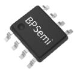
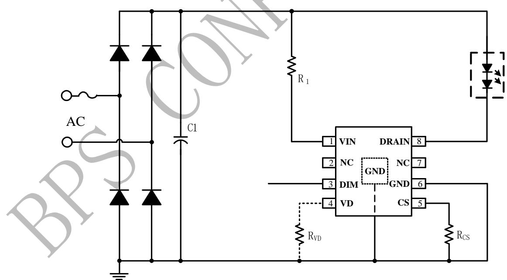
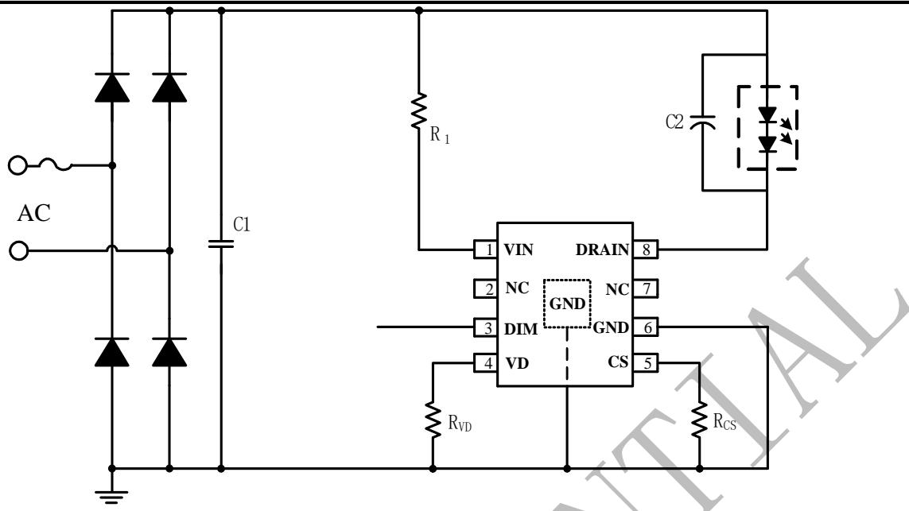
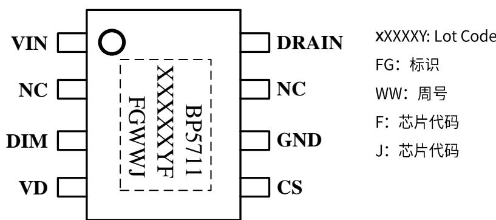
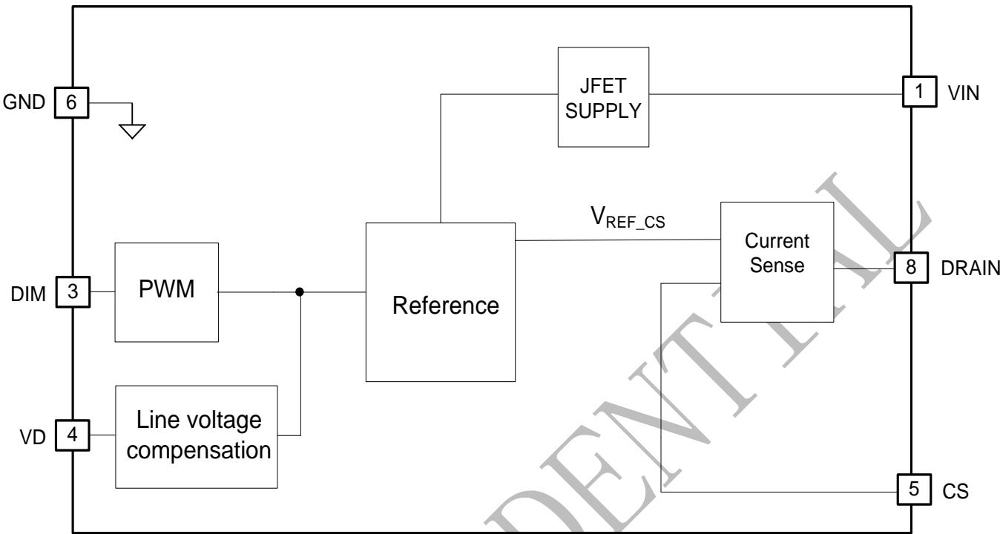
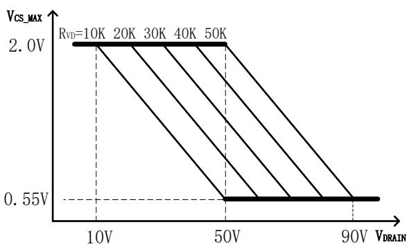
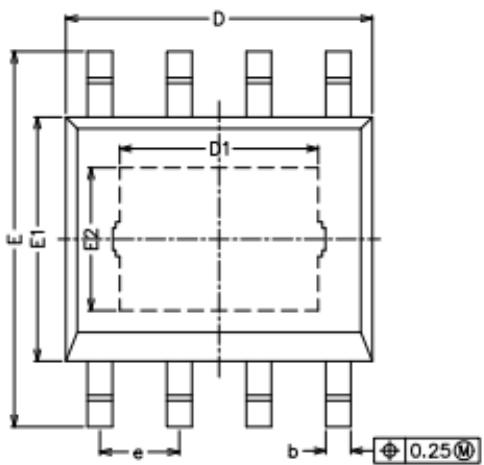
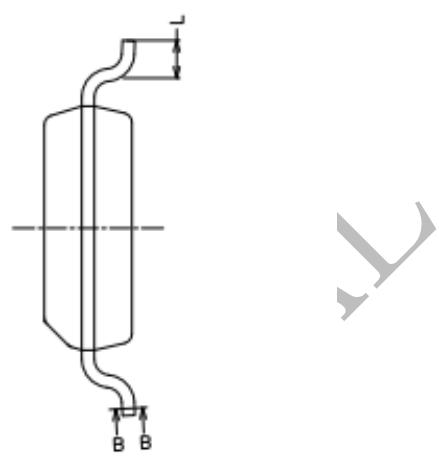
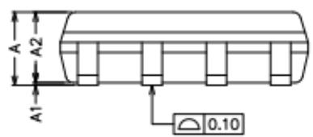
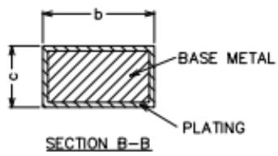

## 概述

BP5711FJ 是一款高度集成的高精度线性可调光 LED 恒流驱动芯片，主要用于市电输入的各类调光光源和灯具的驱动。基于线性恒流技术的BP5711FJ，可以省去磁性元件，有助于LED驱动器实现小体积、低成本，并符合EMI标准。

BP5711FJ支持PWM 调光信号，可以搭配常见的调光模块实现调光功能。

BP5711FJ具有过温调节功能。当输入电压过高或者LED电流过大导致芯片温度过高时，将降低输出电流

BP5711FJ集成了闭环恒流功能，输入电压在一定范围内波动时，输出电流基本不变。

  
ESOP8

## PWM 转模拟调光线性 LED 恒流驱动

## 特点

外围电路简单，驱动器体积小

◆ 支持 1%-100%的 PWM 调光信号输入

◆ 内置 500V 高压 MOS 管

◆ 母线电压变化±20%仍可正常工作

集成高压启动线路，超快LED 启动

◆±5% LED 输出电流精度

LED 电流可外部设定

内置过温降电流功能

输入线电压补偿功能

采用 SOP8-EP封装

## 应用

智能LED 灯丝灯

智能LED 球泡灯

其它智能LED照明

## 典型应用

  
图 1 BP5711FJ 低 PF 典型应用图

  
图 2 BP5711FJ 高 PF 典型应用图

## 定购信息

<table><tr><td>定购型号</td><td>封装</td><td>温度范围</td><td>包装形式</td><td>打印</td></tr><tr><td>BP5711FJ</td><td>ESOP_8</td><td>-40 °C到 105 °C</td><td>编带4,000 颗/盘</td><td>BP5711XXXXYFFGWWJ</td></tr></table>

## 管腳封装

  
图 2 管脚封装图

## 管脚描述

<table><tr><td>管脚号</td><td>管脚名称</td><td>描述</td></tr><tr><td>1</td><td>VIN</td><td>高压启动输入端</td></tr><tr><td>2</td><td>NC</td><td>无连接</td></tr><tr><td>3</td><td>DIM</td><td>PWM调光信号输入端</td></tr><tr><td>4</td><td>VD</td><td>线电压补偿</td></tr><tr><td>5</td><td>CS</td><td>LED 灯串电流设定,通过电阻连接到地</td></tr><tr><td>6</td><td>GND</td><td>芯片地</td></tr><tr><td>7</td><td>NC</td><td>无连接</td></tr><tr><td>8</td><td>DRAIN</td><td>内置功率 MOS 管漏极</td></tr><tr><td>衬底</td><td>GND</td><td>芯片地</td></tr></table>

极限参数(注1)

<table><tr><td>符号</td><td>参数</td><td>参数范围</td><td>单位</td></tr><tr><td>VIN, DRAIN</td><td>内部高压MOSFET漏极电压</td><td>500</td><td>V</td></tr><tr><td>IDRAIN</td><td>DRAIN饱和电流</td><td>200</td><td>mA</td></tr><tr><td>CS, VD</td><td>芯片低压接口</td><td>-0.3~7</td><td>V</td></tr><tr><td>DIM</td><td>PWM 调光信号输入端</td><td>-0.3~24</td><td>V</td></tr><tr><td>PDMAX</td><td>功耗(注 2)</td><td>1.25</td><td>W</td></tr><tr><td>θJA</td><td>PN 结到环境的热阻</td><td>100</td><td>°C/W</td></tr><tr><td>TJ</td><td>工作结温范围</td><td>-40 to 150</td><td>°C</td></tr><tr><td>TSTG</td><td>储存温度范围</td><td>-55 to 150</td><td>°C</td></tr></table>

注1：最大极限值是指超出该工作范围，芯片有可能损坏。推荐工作范围是指在该范围内，器件功能正常，但并不完全保证满足个别性能指标。电气参数定义了器件在工作范围内并且在保证特定性能指标的测试条件下的直流和交流电参数规范。对于未给定上下限值的参数，该规范不予保证其精度，但其典型值合理反映了器件性能

注2：温度升高最大功耗一定会减小，这也是由JJMAX.θJA,和环境温度TA所决定的。最大允许功耗为 PDMAX=(TIMAX-TA)/θJA 或是极限范围给出的数字中比较低的那个值。

## 芯片适用范围

此芯片不适合做高压输入高PF应用。

电气参数(注3，4) （无特别说明情况下，VIN=30V TA=25°C）

<table><tr><td>符号</td><td>参数描述</td><td>条件</td><td>最小值</td><td>典型值</td><td>最大值</td><td>单位</td></tr><tr><td colspan="7">芯片供电(VIN管脚)</td></tr><tr><td>ICC</td><td>静态工作电流</td><td>VVIN=30V</td><td></td><td>200</td><td></td><td>uA</td></tr><tr><td>BVDVIN</td><td>VIN管脚击穿电压</td><td></td><td>500</td><td></td><td></td><td>V</td></tr><tr><td colspan="7">内部MOSFET漏极(DRAIN管脚)</td></tr><tr><td>BVDVDRAIN</td><td>DRAIN击穿电压</td><td></td><td>500</td><td></td><td></td><td>V</td></tr><tr><td>IDRAIN</td><td>DRAIN MOS饱和电流</td><td></td><td></td><td>200</td><td></td><td>mA</td></tr><tr><td colspan="7">电流采样(CS管脚)</td></tr><tr><td rowspan="2">VREF_1</td><td rowspan="2">电流设置基准</td><td>VIN, VDRAIN=30V,RCS=120Ω, VD悬空</td><td></td><td>900</td><td></td><td>mV</td></tr><tr><td>RVD=10k~50kΩ</td><td></td><td>300</td><td></td><td>mV</td></tr><tr><td colspan="7">调光信号输入端(DIM管脚)</td></tr><tr><td>VADMIN_H</td><td>PWM调光信号高电平</td><td></td><td></td><td>2.5</td><td></td><td>V</td></tr><tr><td>VADMIN_L</td><td>PWM调光信号低电平</td><td></td><td></td><td>0.7</td><td></td><td>V</td></tr><tr><td>FPWM</td><td>PWM调光信号频率范围</td><td></td><td>0.5</td><td></td><td>10</td><td>KHz</td></tr><tr><td>RPD</td><td>DIM引脚下拉电阻</td><td></td><td></td><td>3.5</td><td></td><td>KΩ</td></tr><tr><td colspan="7">过热调节</td></tr><tr><td>TREG</td><td>过热调节温度起点</td><td></td><td></td><td>150</td><td></td><td>°C</td></tr></table>

注3：典型参数值为25℃下测得的参数标准。  
注4：规格书的最小最大规范范围由测试保证，典型值由设计、测试或统计分析保证

## 内部结构框图

  
图 3 BP5711FJ 内部框图

## 应用信息

BP5711FJ 是一款高精度线性恒流 LED 驱动芯片，主要用于驱动由市电供电的高电压、低电流LED灯珠串。

## 1 供电

在系统上电后，VIN 通过内部的高压 JFET给芯片供电。

## 2 恒流控制，输出电流设置

BP5711FJ可以通过外部电阻精确设定LED 电流。

输出电流计算公式：

$$
I _ {L E D} = \frac {V _ {R E F}}{R _ {C S}}
$$

其中VREF为恒流的基准。

在低 PF 应用中，建议将 VD 引脚悬空，芯片 CS 基准为900mV;在高 PF应用中，推荐VD 对地接10K\~50K电阻，芯片 CS 基准为 300mV。高 PF 应用时，如果 VD 悬空，会出现不恒流以及调光功能异常的现象。

由于散热能力的限制，铝基板应用低压120Vac输入时，最大输入功率在 9W 左右，高压 220Vac 输入时，最大输入功率在10W左右。

## 3 线补偿调节功能

在高 PF 应用中，推荐 VD 对地接 10K\~50K 电阻，VD 电阻越大补偿对应DRAIN电压起点越高，补偿越小。

  
图 4 BP5711FJ VD 补偿曲线

## 4 过温调节功能

BP5711FJ具有过热调节功能，在驱动电源过热时逐渐减小输出电流，从而控制输出功率和温升，使电源温度保持在设定值，以提高系统的可靠性。

## 5 调光

BP5711FJ支持PWM调光信号输入、模拟调光信号输出，PWM 引脚对地内置 3.5K下拉电阻。PWM 调光信号占空比控制LED 输出电流。PWM 的高电平幅值建议设置在2.5V以上。

## 6 PCB 设计

在设计 BP5711FJPCB 板时，需要注意以下事项：

地线

电流采样电阻的功率地线尽可能短。

GND 和芯片底部的散热铜片面积要尽可能大，以减小热阻增强散热能力。

VIN/DRAIN

高压走线需要尽量远离低压元器件和走线。

## 封装信息

<table><tr><td rowspan="2">SYMBOL</td><td colspan="3">MILLIMETER</td></tr><tr><td>MIN</td><td>NOM</td><td>MAX</td></tr><tr><td>A</td><td>1.35</td><td>-</td><td>1.75</td></tr><tr><td>A1</td><td>0.00</td><td>-</td><td>0.15</td></tr><tr><td>A2</td><td>1.25</td><td>1.40</td><td>1.65</td></tr><tr><td>b</td><td>0.30</td><td>-</td><td>0.50</td></tr><tr><td>c</td><td>0.10</td><td>-</td><td>0.25</td></tr><tr><td>D</td><td>4.70</td><td>4.90</td><td>5.10</td></tr><tr><td>D1</td><td>3.02</td><td>-</td><td>3.50</td></tr><tr><td>E</td><td>5.80</td><td>-</td><td>6.40</td></tr><tr><td>E1</td><td>3.70</td><td>3.90</td><td>4.10</td></tr><tr><td>E2</td><td>2.1</td><td>-</td><td>2.6</td></tr><tr><td>L</td><td>0.40</td><td>0.60</td><td>1.25</td></tr><tr><td>e</td><td>1.17</td><td>1.27</td><td>1.37</td></tr></table>

## 版本信息

<table><tr><td>版本</td><td>日期</td><td>记录</td></tr><tr><td>Rev. 0.9</td><td>2021/4</td><td>升级 1.0</td></tr><tr><td></td><td></td><td></td></tr><tr><td></td><td></td><td></td></tr><tr><td></td><td></td><td></td></tr><tr><td></td><td></td><td></td></tr><tr><td></td><td></td><td></td></tr></table>

## 免责声明

晶丰明源尽力确保本产品规格书内容的准确和可靠，但是保留在没有通知的情况下，修改规格书内容的权利。

本产品规格书未包含任何针对晶丰明源或第三方所有的知识产权的授权。针对本产品规格书所记载的信息，晶丰明源不做任何明示或暗示的保证，包括但不限于对规格书内容的准确性、商业上的适销性、特定目的的适用性或者不侵犯晶丰明源或任何第三人知识产权做任何明示或暗示保证，晶丰明源也不就因本规格书本身及其使用有关的偶然或必然损失承担任何责任。