## Description

The BP5768D is a five-channel high -precisio dimmable constant -current linear LED driver. It is targeted for tunable warm/cold/color smart lightin application，B P5768D m eets the new European ERP standards

The BP5768D integrates five-channel (OUT1 /2/3/4/5) 500V/90mA MOSFET. It achieves output current adjustment with 1024 gray-scale level and eliminat flicker during dimming proces

The BP5768D integrates thermal regulation functi to reduce output current at hot temperature, make system reliable and prevent overheatin.

The BP5768D is available in ESOP-8 package.

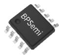  
ESSOP -10

## Features

◼ M eets the new European ERP standards

◼ Pst LM<1 ，SVM <0.4，D F>0.7

◼ Support 0.1% dimming

◼ Five channelswith separate contro

Integrated with 90mA/500V MOS FET fo each channel

Independent maximum output current setting for each channel

1024 gray-scalelevel output current adjustment for each channel

◼ I2C controlled for smart dimmin g

Ultralow quiescent current with 100uA in

◼ Thermal regulation function

◼ Available in ESSOP -10 package

## Applications

\- Smart LED bulbs

◼ Smart filament LED bulb

## Typical Application

◼ O ther smart LED lamps

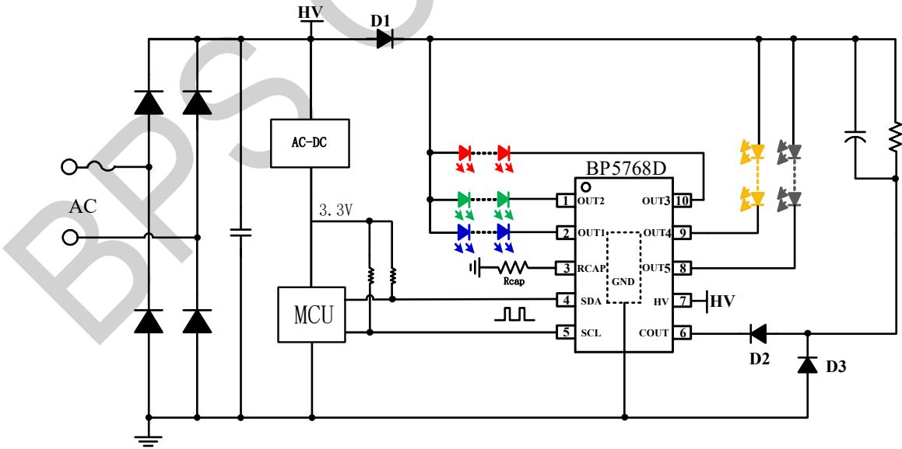  
Figure1. BP5768D Typical Applicati

Ordering Information

<table><tr><td>Part Number</td><td>Package</td><td>Package Method</td><td>Marking</td></tr><tr><td>BP5768D</td><td>ESSOP-10</td><td>Tape4,000 pcs/Reel</td><td>BP5768XXXXXYXXXXWWD</td></tr></table>

## P in Configuration and Marking Information

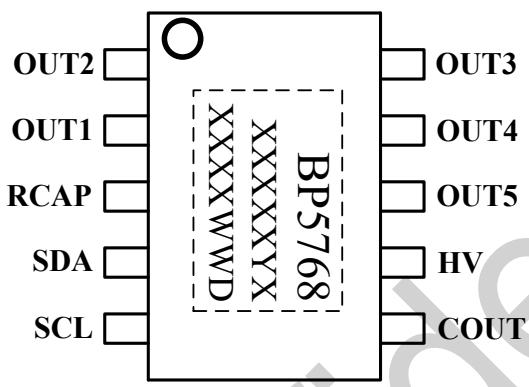  
Figure2: Pin configurati

## P in Definitio

<table><tr><td>Pin NO.</td><td>Name</td><td>Description</td></tr><tr><td>1</td><td>OUT2</td><td>Constant current output pin 2 (Green recommended)</td></tr><tr><td>2</td><td>OUT1</td><td>Constant current output pin 1 (Blue recommended)</td></tr><tr><td>3</td><td>RCAP</td><td>Current sense, connect resistor to GND</td></tr><tr><td>4</td><td>SDA</td><td>Data input pin (1kΩ external pull-up resistor to Vcc required)</td></tr><tr><td>5</td><td>SCL</td><td>Clock input pin (1kΩ external pull-up resistor to Vcc required)</td></tr><tr><td>6</td><td>COUT</td><td>Drain for COUT Current sense</td></tr><tr><td>7</td><td>HV</td><td>High voltage power supply input pin</td></tr><tr><td>8</td><td>OUT5</td><td>Constant current output pin 5 (Cold-white recommended)</td></tr><tr><td>9</td><td>OUT4</td><td>Constant current output pin 4 (Warm-white recommended)</td></tr><tr><td>10</td><td>OUT3</td><td>Constant current output pin 3 (Red recommended)</td></tr><tr><td>EPAD</td><td>GND</td><td>Ground</td></tr></table>

Absolute Maximum Ratings ( N ote 1)

<table><tr><td>Symbol</td><td>Parameters</td><td>Range</td><td>Units</td></tr><tr><td>OUT1/2/3/4/5</td><td>OUT1/2/3/4/5 pin voltage</td><td>-0.3~500</td><td>V</td></tr><tr><td>IOUT1/2/3/4/5_MAX</td><td>OUT1/2/3/4/5 pin current</td><td>90</td><td>mA</td></tr><tr><td>ID_COUT_MAX</td><td>COUT pin current</td><td>250</td><td>mA</td></tr><tr><td>HV</td><td>High voltage power supply input pin</td><td>-0.3~500</td><td>V</td></tr><tr><td>COUT</td><td>COUT pin voltage</td><td>-0.3~550</td><td>V</td></tr><tr><td>SDA</td><td>Data input pin</td><td>-0.3~7</td><td>V</td></tr><tr><td>Rcap</td><td>Low voltage pins</td><td>-0.3~7</td><td>V</td></tr><tr><td>SCL</td><td>Clock input pin</td><td>-0.3~7</td><td>V</td></tr><tr><td> $P_{DMAX}$ </td><td>Power dissipation (note2)</td><td>1.22</td><td>W</td></tr><tr><td> $\theta_{JA}$ </td><td>Thermal resistance (Junction to Ambient)</td><td>102</td><td>°C/W</td></tr><tr><td> $\theta_{JC}$ </td><td>Thermal resistance from junction to the case (note3)</td><td>45</td><td>°C/W</td></tr><tr><td>TJ</td><td>Operating junction temperature</td><td>-40 to 150</td><td>°C</td></tr><tr><td>TSTG</td><td>Storage temperature range</td><td>-55 to 150</td><td>°C</td></tr></table>

Note 1: Stresses beyond those listed under “absolute maximum ratings” may cause permanent damage to the device. Under “recommended operating conditions” the device operation is assured, but some particular parameter may not be achieved. The electrical characteristics table defines the operation range of the device, the electrical characteristics is assured on DC and AC voltage by test program. For the parameters without minimum and maximum value in the EC table, the typical value defines the operation range, the accuracy is not guaranteed by spec

Note 2: The maximum power dissipation decrease if temperature rise, it is decided by TJMAX, θJA, and environment temperature (TA). The maximum power dissipation is the lower one between PDMAX = (TJMAX - TA)/ 0JA and the number listed in the maximum table.

Note 3: The thermal resistance data from the chip junction to the housing is a simulated value, typically on the high side, and is provided for reference only

Electrical Characteristics (Notes 4, 5) (Unless otherwise specified, HV =50 V and TA =25 ℃)

<table><tr><td>Symbol</td><td>Parameter</td><td>Conditions</td><td>Min</td><td>Typ</td><td>Max</td><td>Units</td></tr><tr><td colspan="7">Supply Voltage Section (HV)</td></tr><tr><td>HV_OP</td><td>HV operation range</td><td></td><td>15</td><td></td><td>500</td><td>V</td></tr><tr><td>HV_ON</td><td>HV supply on voltage</td><td></td><td>5.5</td><td>7.1</td><td>8.5</td><td>V</td></tr><tr><td>IOP</td><td>Quiescent current in operation mode</td><td>Iout1/2/3/4/5=1 5mA</td><td>230</td><td>285</td><td>345</td><td>μA</td></tr><tr><td>IOP_SLEEP</td><td>Quiescent current in sleep mode</td><td></td><td>30</td><td>60</td><td>91</td><td>μA</td></tr><tr><td>BVDSS</td><td>Breakdown voltage</td><td></td><td>500</td><td></td><td></td><td>V</td></tr><tr><td colspan="7">Current Sense</td></tr><tr><td>VREF_RCAP</td><td>Ref. for Rcap</td><td>HV=30V, RRCAP=300Ω</td><td>623</td><td>660</td><td>696</td><td>mV</td></tr><tr><td colspan="7">Power MOSFET(OUT1/2/3/4/5)</td></tr><tr><td>IOUT</td><td>Maximum current range (Note 6)</td><td>PWM=100%</td><td>5</td><td></td><td>90</td><td>mA</td></tr><tr><td>IOUT_MIN</td><td>Minimum dimming percentage</td><td></td><td></td><td>0.1</td><td></td><td>%</td></tr><tr><td>VOUT</td><td>Inflection point voltage for constant current</td><td>Iout=30mA</td><td></td><td></td><td>6</td><td>V</td></tr><tr><td>BVDSS</td><td>Breakdown voltage</td><td></td><td>500</td><td></td><td></td><td>V</td></tr><tr><td colspan="7">I2C Interface Section</td></tr><tr><td>VSUP</td><td>I2C interface supply voltage</td><td></td><td>3.1</td><td>3.3</td><td>3.5</td><td>V</td></tr><tr><td>R_SDA</td><td>SDA internal pullup resistor</td><td></td><td>12</td><td>15</td><td>18</td><td>kΩ</td></tr><tr><td>R_SCL</td><td>SCL internal pullup resistor</td><td></td><td>12</td><td>15</td><td>18</td><td>kΩ</td></tr><tr><td>VH_SDA</td><td>SDA high logic level</td><td></td><td>1.8</td><td></td><td></td><td>V</td></tr><tr><td>VL_SDA</td><td>SDA low logic level</td><td></td><td>0</td><td></td><td>1.6</td><td>V</td></tr><tr><td>VH_SCL</td><td>SCL high logic level</td><td></td><td>1.8</td><td></td><td></td><td>V</td></tr><tr><td>VL_SCL</td><td>SCL low logic level</td><td></td><td>0</td><td></td><td>1.6</td><td>V</td></tr><tr><td>F_SDA</td><td>SDA input frequency</td><td></td><td></td><td>200</td><td>300</td><td>kHz</td></tr><tr><td>F_SCL</td><td>SCL input frequency</td><td></td><td></td><td>200</td><td>300</td><td>kHz</td></tr><tr><td>T_LOW</td><td>SCL low logic level time</td><td></td><td>1.5</td><td></td><td></td><td>μS</td></tr><tr><td>T_HIGH</td><td>SCL high logic level time</td><td></td><td>1.5</td><td></td><td></td><td>μS</td></tr><tr><td>T_N</td><td>Noise elimination time</td><td></td><td></td><td>100</td><td></td><td>nS</td></tr><tr><td>T_AA</td><td>SCL time between falling edge and effective output</td><td></td><td></td><td></td><td>100</td><td>nS</td></tr><tr><td>T_HD.STA</td><td>Start hold time</td><td></td><td>250</td><td></td><td></td><td>nS</td></tr><tr><td>T_SU.STA</td><td>Start setup time</td><td></td><td>250</td><td></td><td></td><td>nS</td></tr><tr><td>T_HD.DAT</td><td>Data hold time</td><td></td><td>250</td><td></td><td></td><td>nS</td></tr><tr><td>T_SU.DAT</td><td>Data setup time</td><td></td><td>250</td><td></td><td></td><td>nS</td></tr><tr><td>TR</td><td>Input rising time</td><td></td><td></td><td></td><td>150</td><td>nS</td></tr><tr><td>TF</td><td>Input falling time</td><td></td><td></td><td></td><td>150</td><td>nS</td></tr><tr><td>TSU.STO</td><td>Stop setup time</td><td></td><td>250</td><td></td><td></td><td>nS</td></tr><tr><td colspan="7">Thermal Regulation Section</td></tr><tr><td> $T_{REG}$ </td><td>Thermal Regulation Temperature</td><td>Junction temperature</td><td></td><td>150</td><td></td><td>°C</td></tr></table>

Note 4: production testing of the chip is performed at 25C

Note 5: the maximum and minimum parameters specified are guaranteed by test, the typical value are guaranteed by design, characterization and statistical analysis

Note 6: the maximum output current is tested under VD=15V (VD refers to the drain voltage of MOSFET)

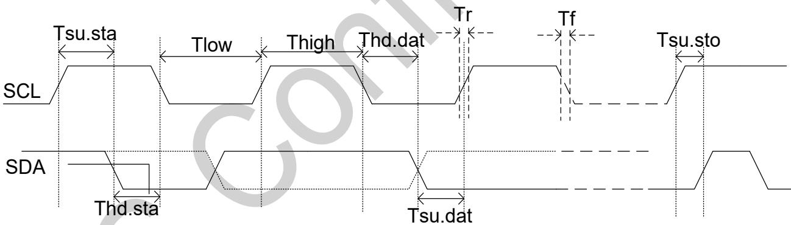  
Figure3:SCL and SDA input waveform

## Internal Block Diagram

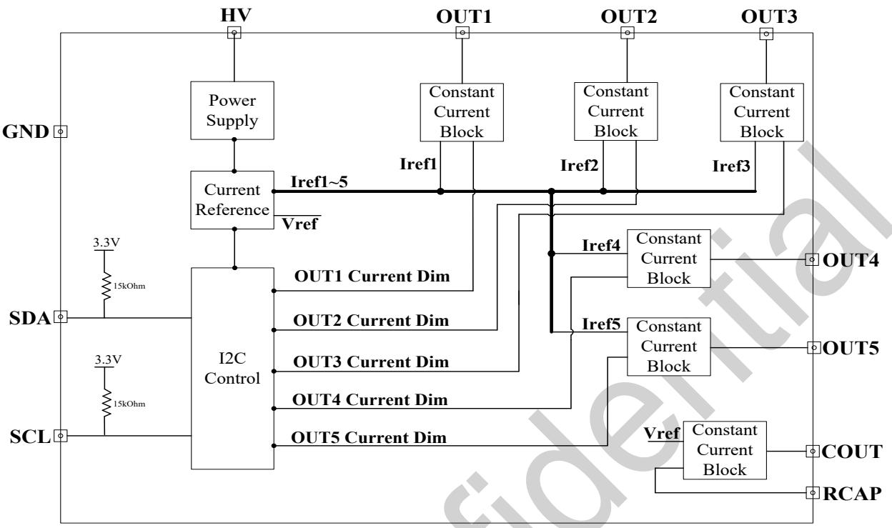  
Figure4:Internal Block Diagra

## Application Information

The BP5768D is a five-channel high -precision dimmable constant -current linear LED driver which is targeted for tunable warm/cold/color smart lighting applicatio.

## 1. Start Up

The IC has 1mA pull -down current during start-up process. When the HV voltage is higher than 8V, t supply module of SDA and SCK starts to work. Whe the HV voltage is higher than 9.8V, the IC start work and wait for the signal of SDA and SCL. If there’s no signal of SDA and SCL, the IC enters mode and the quiescent currentis about 85μA. If th signal of SDA and SCL is effective, the IC quits from sleep mode and achieve s smart dimming via I 2C protocol.

## 2. The D escription of I2C P rotocol

The IC integrates I2C protocol module and it is a t line communication protocol. It has two control signals: clock signal SCL and data signal SDA. SCL and SDA pins of BP5857D integrate 15kΩpull-up resistors.The user can configuratethe two signals achieve smarting dimming control. The protocol contains start, stop, data transmission and acknowledgment control. The detailed protocol as following

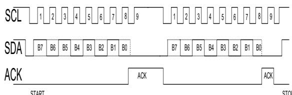  
Figure5:SCL, SDA input signa

## 2.1 Start and Stop Status Contro

The IC are in idle statuswhen data signal (SDA) and clock signal (SCL)at high logic level. When SCL i high logic level and SDA is at falling edge (log high→low), it is the START condition. Otherwise, w hen SCL is at high logic level and SDA is at ri edge (logic level: low →high), it is the STOP condit As shown in figure 6, 9 periods (8Bit+1ACK) of S compose one Byte transmission. If addressing is processed, total 17 bytes can be input. The minimum time for Tsu.sta，Thd.sta，Tsu.sto，Thd.sto is 250ns.

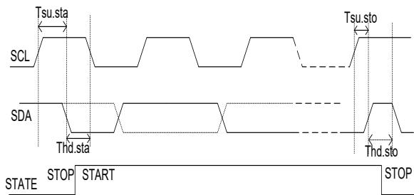  
Figure6:START, STOP status

## 2.2 Data Transmission Control

I2C is a serial bit transmission protocol and it transfers one bit by every clock pulse. When SCL i high logic level, SDA must keep stable. When SCL at low logic level, SDA could change status. When SCL is at the rising edge, the data is written in register. The IC generates the acknowledgement signal ACK at the 9th clock after 8 bits transmissi The ACK signal will pulldown the SDA pin. In othe words, the IC internally generates an extra resp signal after every byte transmission. As shown i figure 7, In order to avoid signal disturbance, Data\_IN is on ly effective when IC is reading SDA signal. The signal must be latched by register a the latching control signal is DATA\_LATCH. Tsam.d is the sampling anti-noise time, which is about 200n Tlat.dat is the latching anti-noise time, which is about 200ns. Tsu.dat and Thd.dat must be larger than 250ns. Both Tlow and Thigh higher than 1.5μs i recommended.

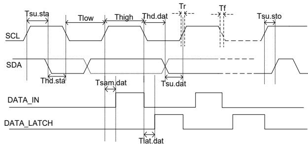  
Figure7:Transmission control diagram

Every 8 bits compose one Byte during transmission. The following table shows the control signal for every bit.All the effective information is execut the top 17 bytes. The 18 th (Byte17 ) is the setup information for skipping to Byte1. The bytes after Byte17 are the repeating setup of Byte1-Byte16. I conclusion, the effective bytes are 17 bytes befo STOP action.

<table><tr><td>Byte sequence</td><td>Operation content</td></tr><tr><td>Byte0</td><td>Identification bit+sleep mode+addressing for next byte</td></tr><tr><td>Byte1</td><td>OUT1-OUT5 output current enable setup</td></tr><tr><td>Byte2</td><td>OUT1 current range (maximum output current) setup</td></tr><tr><td>Byte3</td><td>OUT2 current range setup</td></tr><tr><td>Byte4</td><td>OUT3 current range setup</td></tr><tr><td>Byte5</td><td>OUT4 current range setup</td></tr><tr><td>Byte6</td><td>OUT5 current range setup</td></tr><tr><td>Byte7-8</td><td>OUT1 current gray-level setup</td></tr><tr><td>Byte9-10</td><td>OUT2 current gray-level setup</td></tr><tr><td>Byte11-12</td><td>OUT3 current gray-level setup</td></tr><tr><td>Byte13-14</td><td>OUT4 current gray-level setup</td></tr><tr><td>Byte15-16</td><td>OUT5 current gray-level setup</td></tr><tr><td>Byte17</td><td>Skip to Byte1: output current enable setup</td></tr><tr><td>Byte18</td><td>OUT1 current range setup</td></tr><tr><td>Byte19</td><td>OUT2 current range setup</td></tr></table>

1.B yte0 (addressing byte) descriptio

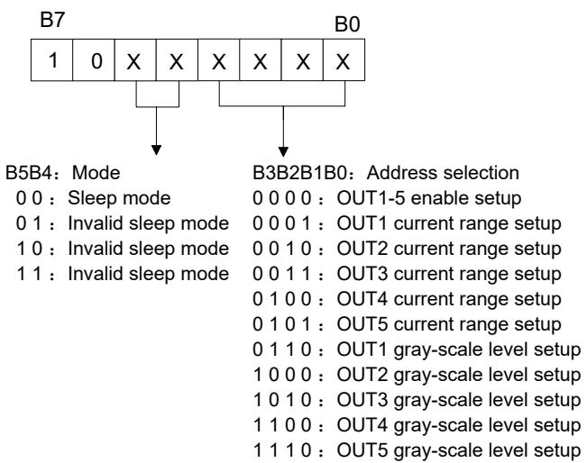  
Figure8:Byte0 setup informatio

Byte0 is mainly the mode setting and addressing the chip. B[7:6] = 10 are the identification bits of byte0 . B[5:4]are the mode control bits . The IC ente sleep mode when B[5:4]=00. Byte1\~Byte16 are forbidden to write in sleep mode, so it isnecessary to turn off OUT1\~OUT5 before setting the sleep mode. B[4:0] is the addressing byte. The detaile instruction is shown in figur

2.B yte1 (output enable byte) descriptio  
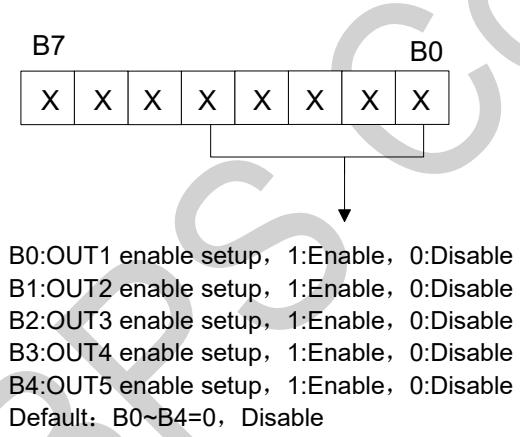  
Figure9:Byte1 setup information

Byte1 is the enable byte of the OUT 1-OUT 5 channels. B[7:5] is invalid bit which can be any input. The description of B[4:0] is given in fi

3.B yte2 (output current range setup) descriptio

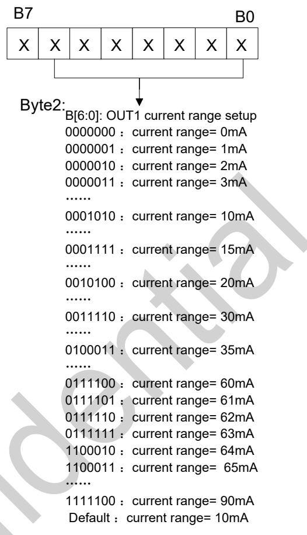  
Figure10: Byte2 setup informatio

Byte2 is the setting byte of OUT1 current range (maximum output current) and the setup rules ar presented in figure 10. If B[5]\~B[0] =1, it represen 32mA, 16mA, 8 mA , 4mA, 2mA and 1mA respectively. If B[6]=1, it refers to 30mA(not 64mA). The setting o B[7] will not affect the setting of currentrange . Th default current range of out1 is 10mA.

## 4.B yte3-Byte6 (OUT2\~OUT5 output current range setup bytes) descriptio

Byte3 -B yte6 are the setting bytes of current rang (maximum output current) of OUT 2-OUT 5 correspondingly. Same as the description of Byte figure 10, the default current range of OUT2-OUT 5 i 10mA.

## 5.B yte7-8 (OUT1 current grey -scale level setup byte) description

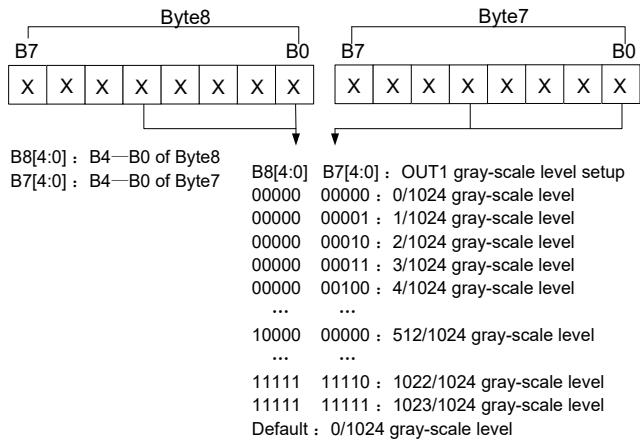  
Figure11: Byte7 -Byte8 setup informatio

In figure11, the detailed setup information of By-Byte8 is presented. Byte7 -byte8 set gray-scale leve of OUT1. The grayscale of OUT1 can be adjusted by 1024 levels. B[4:0] of Byte8 and B[4:0] of Byte7 determine the output grayscale of OUT1 together. Shown in figure 11, the default output grayscale zero.

## 6.B yte9-16 (OUT2\~5 current grey -scale level setu byte ) description

B yte9-10 are thecurrent grey-scale level setup by of OUT2. B yte11-12 are the current grey-scale leve setup byte of OUT3. B yte13-14 are thecurrent greyscale level setup byteof OUT4. B yte15-16 are the current grey-scale level setup byteof OUT5. Their gray-scale level setting method is as same as OUT 1 in figure 1

## 2.3 Application Example

nges status from normal operation mode to sleep mode, it should be note that the output of the channel must be turned of before entering sleep mode . The output will be unstable if the channels are not turned off in advance as Byte1\~Byte16 are forbidden to write i sleep mode. The example for entering sleep mode as following

M CU program:

Start1: 10110000 (write byte0, normal mode, sele byte1)

00000000 (write byte1, set OUT 1\~5 output disable) Stop1 。

Start2：10000000 （w rite byte0， B5B4=00 and entersleep mode ）

Stop 2。

Select OUT1 -5 to output together. The maximum current of OUT1\~3 is 40mA with 2/1024 grayscale o OUT1, 512/1024 grayscale of OUT2 and 1022/1024 grayscale of OUT3. The maximum curren t of OUT14\~5 is 60mA with 512/1024 grayscale of OUT4 and 1022/1024 grayscale of OUT5:

Start：10110000 （w rite byte0 ，normal operationmode ，select byte1）

00011111 （w rite byte1，set OUT1\~ 5 output enable）

00101000 （w rite byte2 ，set OUT1 current range:40mA ）

00101000 （w rite byte3 ，set OUT 2 current range:40mA ）

00101000 （w rite byte4 ，set OUT 3 current range:40mA ）

00111100 （w rite byte5 ，set OUT 4 current range:60mA ）

00111100 （w rite byte6 ，set OUT 5 current range:60mA ）

10100010 （w rite byte7）

10100000 （ w rite byte8 ， byte7 and byte8 set thegrayscale 2/1024 of OUT1 together）

10100000 （w rite byte9）

10110000 （w rite byte10，byte9 and byte10 set thegrayscale 512/1024 of OUT2 together）

10111110 （w rite byte11）

10111111 （w rite byte12，byte11 and byte12 set thgrayscale1022/1024 of OUT3 together）

10100000 （w rite byte13）

10110000 （w rite byte14，byte13 and byte14 set thegrayscale512/1024 of OUT4 together）

10111110 （w rite byte15）

10111111 （w rite byte16，byte15 and byte16 set thgrayscale1022/1024 of OUT5 together）

## Stop 。

Select OUT4 -5 to output together. The maximum current of OUT4\~5 is 60mA with 2/1024 grayscale of OUT 4, 512/1024 grayscale of OUT5. After 1mS, th grayscale of OUT4 is changed to 512/1024 and the grayscale of OUT5 turns to 2/1024 :

Start1：101 10000 （w rite byte0 ，normal operationmode ，select byte1）

000 11000 （ w rite byte1 ， set OUT1\~3 disable andOUT4\~5 enable ）

00000000 （w rite byte2，set OUT 1 current range:0mA ）

00000000 （w rite byte3，set OUT 2 current range:0mA ）

00000000 （w rite byte4，set OUT 3 current range:0mA ）

00111100 （ w rite byte5 ， set OUT 4 currentrange:60mA ）

00111100 （ w rite byte6 ， set OUT 5 currentrange:60mA ）

Stop1

Start2：101 11100 （w rite byte0 ，normal operationmode ，select byte13）

10100010 （w rite byte13）

10100000 （w rite byte14，byte13 and byte14 set thgrayscale2/1024 of OUT4 together）

10100000 （w rite byte15）

10110000 （w rite byte16，byte15 and byte16et thgrayscale512/1024 of OUT5 together）

## Stop2

Start3：101 11100 （w rite byte0 ，normal operation

mode ，select byte13）

10100000 （w rite byte13）

10110000 （w rite byte14，byte13 and byte14 set thgrayscale512/1024 of OUT4 together）

10100010 （w rite byte15）

10100000 （w rite byte16，byte15 and byte16 set thgrayscale2/1024 of OUT5 together）

Stop3

## 3. The Current configuration

BP 5768D supports high precision COUT current se by external resistors.

When Vbus>V cap , Current for COUT defined as：

$$
\mathrm{I} _ {\mathrm{CAP}} = \frac {\mathrm{V} _ {\text { ref\_RCAP }}}{\mathrm{R} _ {\mathrm{RCAP}}}
$$

## 4. Compensation for line voltag

the VREF\_RCAP referencevoltage is reduced throu HV pin to reduce the charge current of COUT . HV and VREF\_ The relationship of RCAP is as foll

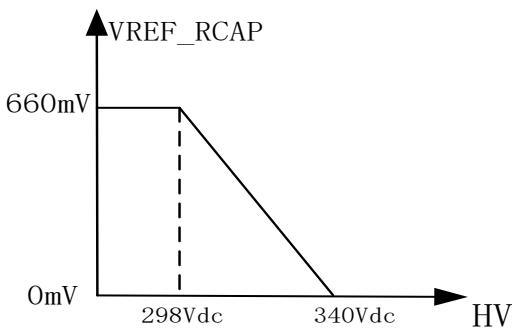  
Figure12.HV and VREF\_ RCAP

## 5. Thermal regulation

BP5768D has thermal regulation function to bala the power delivering and temperature increasing. To improve the system reliability, the output cu will decrease after the BP5768D temperature reaches over temperature protection poin.

## 6. Selection of key components

As shown in the typical application diagram of BP 5768 D in Figure 1, the diode D1 behind the rectifier bridge and the diode D2 / D3 connected COUT pin need to use fast recovery di

## 7.PCB Layout design

Suggestion for BP5768D PCB layout：

## Exposed Pad

BP5768D uses ESOP -8 package to improve the thermal dissipation. Put the ground copper of exposed pad as large as possible for better ther resistance and power dissipatio

## SDA and SCL Signal Wire

The wires from MCU signal output to SDA and SCL pins of BP5768D should be as short as possible . Avoid the interference of other noise to the digit signal on PCB .

## HV Pin Routing

Pin2(HV) is the high voltage pin. Keep these high voltage pin and traces as far away as possible fr low voltage components and traces (e.g., SDA, SC etc.).

## Package Information

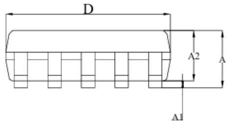

ESSOP - 10 POD (unit:mm)  
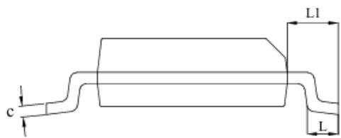

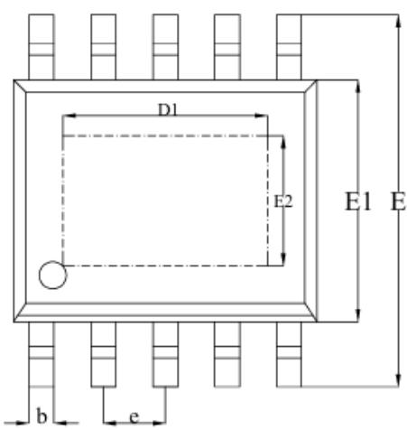

<table><tr><td rowspan="2">SYMBOL</td><td colspan="3">MILLIMETER</td></tr><tr><td>MIN</td><td>NOM</td><td>MAX</td></tr><tr><td>A</td><td>1.35</td><td>1.49</td><td>1.70</td></tr><tr><td>A1</td><td>0.00</td><td>0.04</td><td>0.08</td></tr><tr><td>A2</td><td>1.35</td><td>1.45</td><td>1.55</td></tr><tr><td>b</td><td>0.30</td><td>0.40</td><td>0.50</td></tr><tr><td>c</td><td>0.18</td><td>0.20</td><td>0.25</td></tr><tr><td>D</td><td>4.70</td><td>4.90</td><td>5.10</td></tr><tr><td>D1</td><td>3.10</td><td>3.30</td><td>3.50</td></tr><tr><td>E</td><td>5.80</td><td>6.00</td><td>6.20</td></tr><tr><td>E1</td><td>3.80</td><td>3.90</td><td>4.00</td></tr><tr><td>E2</td><td>1.90</td><td>2.10</td><td>2.30</td></tr><tr><td>e</td><td colspan="3">1.00BSC</td></tr><tr><td>L</td><td>0.40</td><td>0.60</td><td>0.80</td></tr><tr><td>L1</td><td colspan="3">1.05REF</td></tr></table>

## Revision Information

<table><tr><td>Revision</td><td>Date</td><td>Notes</td></tr><tr><td>Rev.1.0</td><td>2022/4</td><td>Preliminary</td></tr><tr><td>Rev.1.1</td><td>2026/2</td><td>1、add the $\theta_{JC}$ 2、correct the dimming depth to 0.1% in EC table</td></tr><tr><td></td><td></td><td></td></tr><tr><td></td><td></td><td></td></tr><tr><td></td><td></td><td></td></tr></table>

## Disclaimer

The information provided in this datasheet is believed to be accurate and reliable. However, Power Semiconductor (BPS) reserves the right to make changes at any time without prior no

No license, to any intellectual property right owned by BPS or any other third party, is gr this document. BPS provides information in this datasheet “AS IS” and with all faults, an no warranty, express or implied, including but not limited to, the accuracy of the informatio provided in this datasheet, merchantability, fitness of a specific purpose, or non-infringement of intellectual property rights of BPS or any other third party. BPS disclaims any and all lia arising out of this datasheet or use of this datasheet, including without limitation consequen incidental damages.

## Electronic device scrap descriptio

After the end of its life cycle, the product is processed by the customer in accordance wit process of general electronic produc