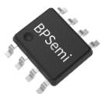
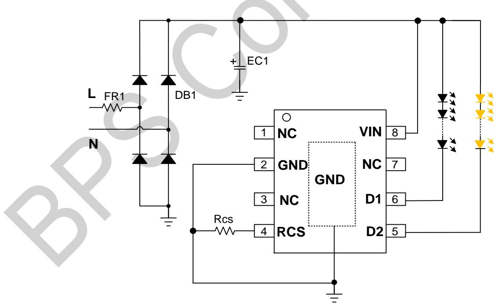
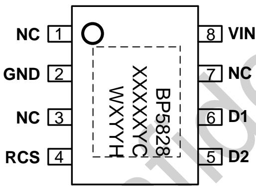
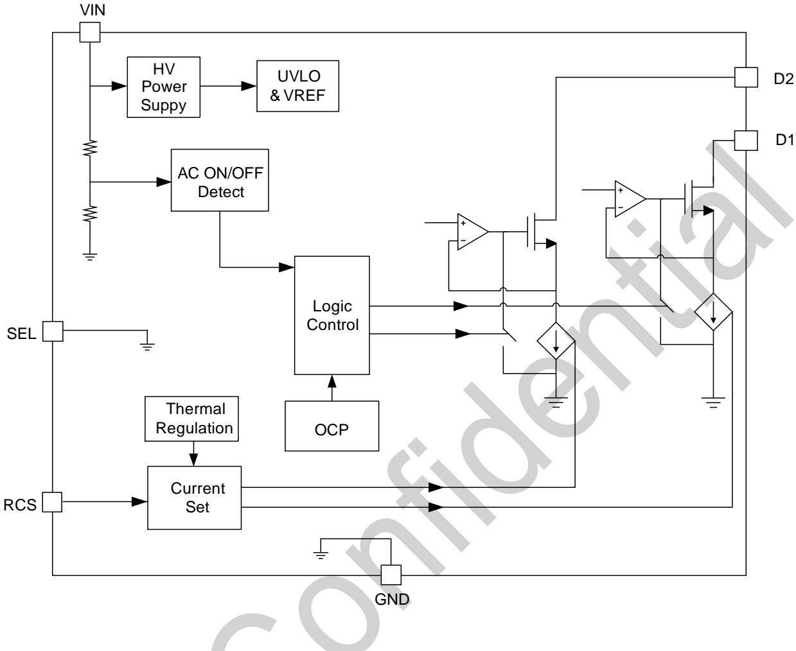
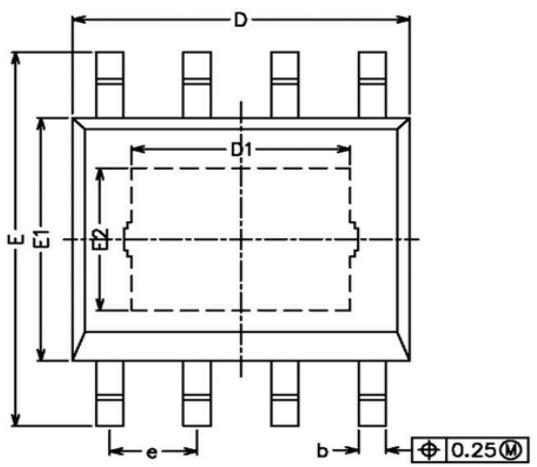
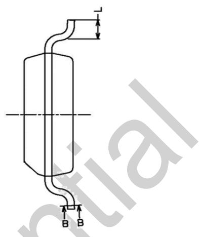
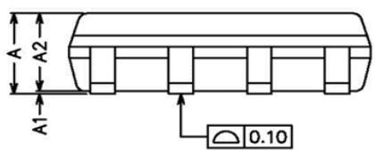
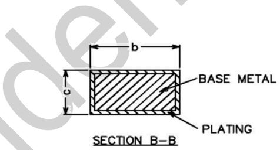

## 开关调色线性恒流驱动芯片

## 概述

BP5828CH 是一款专用于墙壁开关调色的线性 LED 恒流驱动芯片，集成了高压 MOS 管和 JFET 高压供电功能。主要用于驱动由市电供电的高电压、低电流 LED 灯串。由于不需要磁性元件，LED 驱动器可以实现小体积、长寿命，并符合 EMI 规定。

BP5828CH 通过打开和关闭电源开关, 依次切换芯片内部两路恒流输出的通断状态, 以及通过调节外围 CS 电阻, 达到不同功率的调色效果。

BP5828CH 采用 ESOP8 封装。

## 特点

◆ 外围电路非常简单，驱动器体积非常小

◆ 无需磁性元件

◆ 500V 内置高压 MOS 管

◆ 超快 LED 启动

◆ ±5% LED 输出电流精度

◆ LED 电流可外部设定

◆ 过温调节功能

◆ 7 秒内可实现开关切换

◆ 采用 ESOP8 封装

## 应用

◆ GU10/E27 LED 球泡灯

LED 筒灯/射灯

◆ 其它 LED 照明

## 典型应用

  
图 1 BP5828CH 典型应用图

## 定购信息

<table><tr><td>定购型号</td><td>封装</td><td>包装形式</td><td>打印</td></tr><tr><td>BP5828CH</td><td>ESOP8</td><td>编带4000颗/盘</td><td>BP5828XXXXXCXXXXXH</td></tr></table>

## 管脚封装

  
图 2 ESOP8 管脚封装图

## 管脚描述

<table><tr><td>管脚号</td><td>管脚名称</td><td>描述</td></tr><tr><td>1, 3, 7</td><td>NC</td><td>芯片悬空端</td></tr><tr><td>2, 衬底</td><td>GND</td><td>芯片地</td></tr><tr><td>4</td><td>Rcs</td><td>输出电流设计引脚</td></tr><tr><td>5</td><td>D2</td><td>恒流输出端口 2</td></tr><tr><td>6</td><td>D1</td><td>恒流输出端口 1</td></tr><tr><td>8</td><td>VIN</td><td>芯片高压供电脚</td></tr></table>

## 极限参数(注1)

<table><tr><td>符号</td><td>参数</td><td>参数范围</td><td>单位</td></tr><tr><td>D1, D2</td><td>高压输出端口</td><td>-0.3~500</td><td>V</td></tr><tr><td>VIN</td><td>高压供电端口</td><td>-0.3~500</td><td>V</td></tr><tr><td>CS</td><td>芯片低压引脚</td><td>-0.3~7</td><td>V</td></tr><tr><td>ID_MAX</td><td>漏极最大饱和电流@TJ_MAX Vds=10V</td><td>35</td><td>mA</td></tr><tr><td>PD_MAX</td><td>功耗(注2)</td><td>1.25</td><td>W</td></tr><tr><td> $\theta_{JA}$ </td><td>PN结到环境的热阻</td><td>100</td><td>°C/W</td></tr><tr><td> $T_J$ </td><td>工作结温范围</td><td>-40 to 150</td><td>°C</td></tr><tr><td> $T_{STG}$ </td><td>储存温度范围</td><td>-55 to 150</td><td>°C</td></tr></table>

注1：最大极限值是指超出该工作范围，芯片有可能损坏。推荐工作范围是指在该范围内，器件功能正常，但并不完全保证满足个别性能指标。电气参数定义了器件在工作范围内并且在保证特定性能指标的测试条件下的直流和交流电参数规范。对于未给定上下限值的参数，该规范不予保证其精度，但其典型值合理反映了器件性能。  
注2：温度升高最大功耗一定会减小，这也是由 $T_{JMAX}, \theta_{JA}$ ，和环境温度 $T_A$ 所决定的。最大允许功耗为 $P_{DMAX} = (T_{JMAX} - T_A) / \theta_{JA}$ 或是极限范围给出的数字中比较低的那个值。

## 推荐工作范围

<table><tr><td>符号</td><td>参数</td><td>参数范围</td><td>单位</td></tr><tr><td> $I_{LED}$ </td><td>LED 输出电流 @220V</td><td>&lt;35</td><td>mA</td></tr></table>

电气参数(注 3, 4)（无特别说明情况下，Vin=30V， $T_{A}=25^{\circ}C$ ）

<table><tr><td>符号</td><td>描述</td><td>条件</td><td>最小值</td><td>典型值</td><td>最大值</td><td>单位</td></tr><tr><td> $I_{JFET}$ </td><td>JFET 最大电流</td><td></td><td>5</td><td></td><td></td><td>mA</td></tr><tr><td> $I_{VIN}$ </td><td>静态工作电流</td><td></td><td></td><td>110</td><td></td><td>uA</td></tr><tr><td> $I_{VIN\_STANDBY}$ </td><td>低待机电流</td><td></td><td></td><td>30</td><td></td><td>uA</td></tr><tr><td> $V_{CS}$ </td><td>CS 脚基准</td><td></td><td></td><td>585</td><td></td><td>mV</td></tr><tr><td>D</td><td>两通道之间的输出电流偏差</td><td></td><td></td><td>±5</td><td></td><td>%</td></tr><tr><td> $T_{off}$ </td><td>最短开关切换时间</td><td></td><td></td><td>100</td><td></td><td>mS</td></tr><tr><td> $T_{reset}$ </td><td>状态清除时间</td><td></td><td></td><td>7</td><td></td><td>S</td></tr><tr><td> $V_{dss}$ </td><td>D1, D2 的耐压</td><td></td><td>500</td><td></td><td></td><td>V</td></tr><tr><td> $I_{sat}$ </td><td>D1,D2 的饱和电流</td><td>Tj=130°C Vds=10V</td><td>35</td><td></td><td></td><td>mA</td></tr><tr><td> $T_{REG}$ </td><td>过热调节温度</td><td>芯片结温</td><td></td><td>130</td><td></td><td>°C</td></tr></table>

注3：典型参数值为 $25^{\circ}C$ 下测得的参数标准。  
注4：规格书的最小、最大规范范围由测试保证，典型值由设计、测试或统计分析保证。

## 内部结构框图

  
图3 内部框图

## 应用信息

BP5828CH 是一款开关调节色温的 LED 恒流驱动芯片，集成了高压 MOS 管和 JFET 高压供电功能。主要用于驱动由市电供电的高电压、低电流 LED 灯串。

## 1、供电

在系统上电后，VIN 通过内部的高压 JFET 直接给芯片供电。

## 2、模式选择

BP5821CH 是固定输出调色模式，不支持外部选择模式功能。

默认的调色温状态是： $D2 \rightarrow D1 \rightarrow (D1 + D2) / 2$ 。

## 3、调色温

当 BP5828CH 在调节色温应用中，可根据开启关闭电源开关，依次改变两路输出端口开关状态，实现两路不同颜色LED灯的交替亮灭，从而实现调节色温的目的。

芯片输出电流通过 CS 电阻进行调节，CS 计算公式如下：开关第一次开启（D2 开启，D1 关断），输出电流（单位：mA）

$$
I _ {\mathrm{D2}} = \frac {5 8 5}{R c s} \cdot 5 0 0
$$

开关第二次开启(D1 开启, D2 关断), 输出电流(单位:mA)

$$
I _ {\mathrm{D1}} = \frac {5 8 5}{R c s} \cdot 5 0 0
$$

开关第三次开启（D1，D2 开启），输出电流（单位:mA）

$$
I _ {\mathrm{D1}} = I _ {\mathrm{D2}} = \frac {2 8 2 . 5}{R c s} \cdot 5 0 0
$$

## 4、系统开关切换和复位时间

BP5828CH 内置 7 秒的复位计时。在检测到开关关断后 7秒范围内，如果芯片检测到开关切换的动作，状态才会切换。如果关断时间超过 7 秒没有检测到开关切换动作，则芯片进入复位，恢复到初始状态。

为了在墙壁开关断开时，芯片内部状态能够保持到内部计时器需要的7秒时间，需要选取输入电容的容量，确保在输入断电后足以维持芯片HV脚上的电压在10V以上的时间超过7秒。输入电容过小，则有可能复位时间短于芯片内部的7秒计时。建议电容取值2.2uF及以上，耐压值400V。

## 5、过温调节功能

BP5828CH 具有过温调节功能，在驱动电源过热时逐渐减小输出电流，从而控制输出功率和温升，使电源温度保持在设定值，以提高系统的可靠性。

## 6、PCB 设计

在设计 BP5828CHPCB 板时，需要注意以下事项：

a. IC 远离 LED 灯珠，以防灯珠产生的热量导致 IC 过热。
b. 芯片底部有增强散热能力的散热片，在芯片内部已经连接到 GND 引脚。在设计 PCB 时，为了达到良好的散热效果，增加芯片衬底的铺铜。

c. 芯片衬底的铺铜到芯片的 D1/D2 端口的距离在 1.2mm 以上。

## 封装信息

<table><tr><td>SYMBOL</td><td>MIN</td><td>NOM</td><td>MAX</td></tr><tr><td>A</td><td>1.35</td><td>-</td><td>1.75</td></tr><tr><td>A1</td><td>0.00</td><td>-</td><td>0.15</td></tr><tr><td>A2</td><td>1.25</td><td>1.40</td><td>1.65</td></tr><tr><td>b</td><td>0.30</td><td>-</td><td>0.50</td></tr><tr><td>c</td><td>0.10</td><td>-</td><td>0.25</td></tr><tr><td>D</td><td>4.70</td><td>4.90</td><td>5.10</td></tr><tr><td>D1</td><td>3.02</td><td>-</td><td>3.50</td></tr><tr><td>E</td><td>5.80</td><td>-</td><td>6.40</td></tr><tr><td>E1</td><td>3.70</td><td>3.90</td><td>4.10</td></tr><tr><td>E2</td><td>2.1</td><td>-</td><td>2.6</td></tr><tr><td>L</td><td>0.40</td><td>0.60</td><td>1.25</td></tr><tr><td>e</td><td>1.17</td><td>1.27</td><td>1.37</td></tr></table>

## 免责声明

晶丰明源尽力确保本产品规格书内容的准确和可靠，但是保留在没有通知的情况下，修改规格书内容的权利。

本产品规格书未包含任何针对晶丰明源或第三方所有的知识产权的授权。针对本产品规格书所记载的信息，晶丰明源不做任何明示或暗示的保证，包括但不限于对规格书内容的准确性、商业上的适销性、特定目的的适用性或者不侵犯晶丰明源或任何第三人知识产权做任何明示或暗示保证，晶丰明源也不就因本规格书本身及其使用有关的偶然或必然损失承担任何责任。