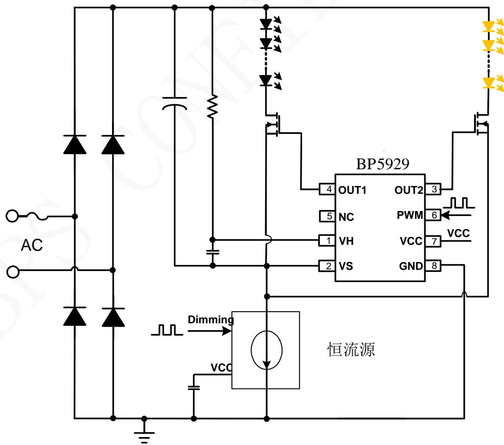
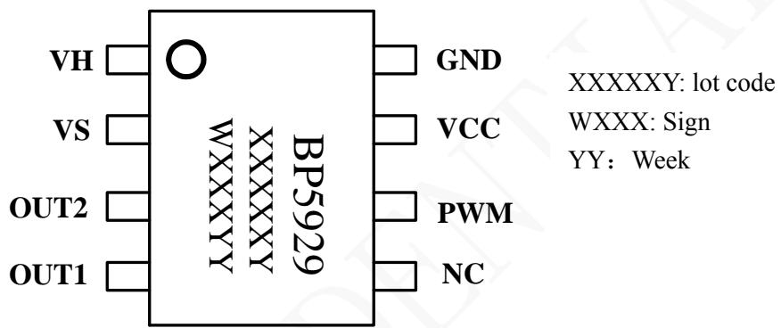
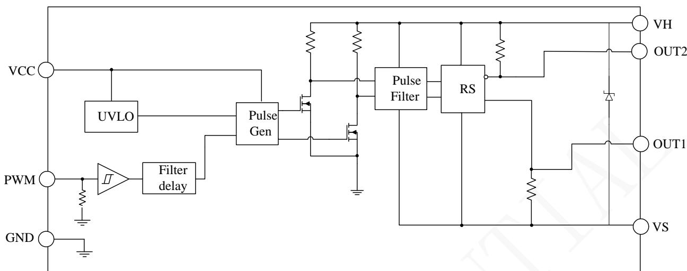
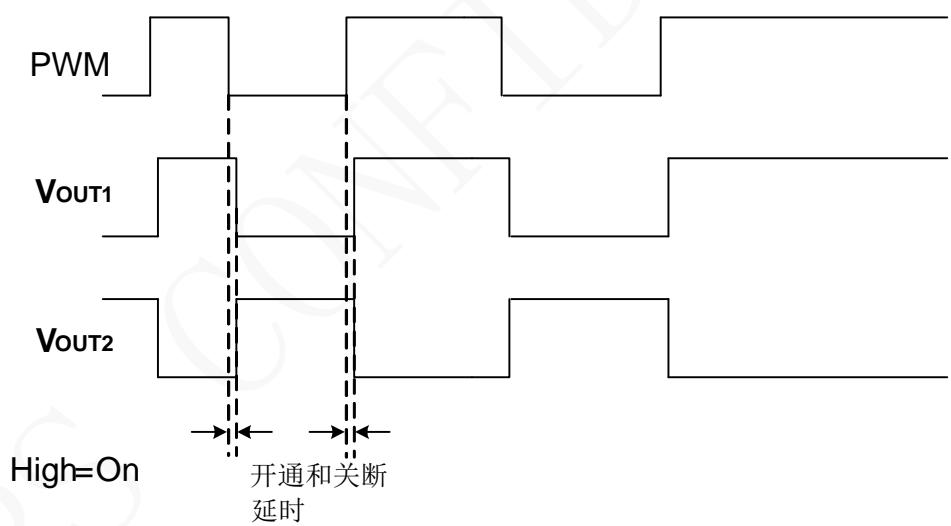
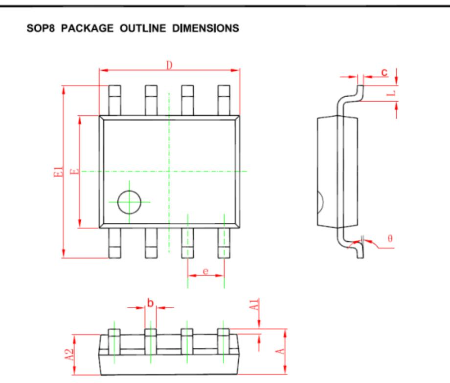

## 概述

BP5929 是一款可驱动两路 MOSFET 的高性能无极调色控制芯片，通过调节输入 PWM信号的占空比来调整两路LED光源的发光比例，从而达到调色目的。两路LED输出电流互补，在调色过程中总电流不变，等于恒流源的电流。

BP5929 可以兼容幅值为 3.3V/5V 的 PWM 信号。浮动的高压侧对 GND 耐压可以达到 600V，能够广泛适应于各种 LED 恒流驱动电路。

## 特点

◼ 无极双路互补调色

◼ 高压侧对 GND 耐压 600V

◼ 兼容 3.3V/5V 输入 PWM 信号

◼ 兼容 10kHz 以下的 PWM 信号

◼ VH 和 VS 之间内置 11V 稳压管

◼ 低待机功耗

◼ 采用 SOP8 封装

## 应用

◼ LED 调光调色智能灯泡

◼ 其他LED 智能照明

## 典型应用

  
图 1. BP5929 典型应用图

## 定购信息

<table><tr><td>定购型号</td><td>封装</td><td>温度范围</td><td>包装形式</td><td>打印</td></tr><tr><td>BP5929</td><td>SOP8</td><td>-40 °C to 105 °C</td><td>编带4000 颗/盘</td><td>BP5929XXXXYWXXXXYY</td></tr></table>

## 管脚封装

  
图2 管脚封装图

## 管脚描述

<table><tr><td>管脚号</td><td>管脚名称</td><td>描述</td></tr><tr><td>1</td><td>VH</td><td>高压侧供电端</td></tr><tr><td>2</td><td>VS</td><td>高压侧浮地</td></tr><tr><td>3</td><td>OUT2</td><td>输出GATE信号2</td></tr><tr><td>4</td><td>OUT1</td><td>输出GATE信号1</td></tr><tr><td>5</td><td>NC</td><td>未接</td></tr><tr><td>6</td><td>PWM</td><td>PWM 信号输入端</td></tr><tr><td>7</td><td>VCC</td><td>低压供电端</td></tr><tr><td>8</td><td>GND</td><td>芯片地</td></tr></table>

## 极限参数(注 1)

<table><tr><td>符号</td><td>参数</td><td>参数范围</td><td>单位</td></tr><tr><td>VH</td><td>芯片高压供电端</td><td>600</td><td>V</td></tr><tr><td>VS</td><td>高压侧浮地</td><td>VH-11</td><td>V</td></tr><tr><td>OUT1,OUT2</td><td>输出GATE信号</td><td>VS+20</td><td>V</td></tr><tr><td>VCC</td><td>芯片低压供电接口</td><td>-0.3~20</td><td>V</td></tr><tr><td>PWM</td><td>PWM调光接口</td><td>-0.3~20</td><td>V</td></tr><tr><td> $P_{DMAX}$ </td><td>功耗(注2)</td><td>0.45</td><td>W</td></tr><tr><td> $\theta_{JA}$ </td><td>PN结到环境的热阻</td><td>145</td><td>°C/W</td></tr><tr><td> $T_J$ </td><td>工作结温范围</td><td>-40 to 150</td><td>°C</td></tr><tr><td> $T_{STG}$ </td><td>储存温度范围</td><td>-55 to 150</td><td>°C</td></tr></table>

注 1：最大极限值是指超出该工作范围，芯片有可能损坏。推荐工作范围是指在该范围内，器件功能正常，但并不完全保证满足个别性能指标。电气参数定义了器件在工作范围内并且在保证特定性能指标的测试条件下的直流和交流电参数规范。对于未给定上下限值的参数，该规范不予保证其精度，但其典型值合理反映了器件性能。

注 2：温度升高最大功耗一定会减小，这也是由 T , θ ,和环境温度 T 所决定的。最大允许功耗为 $\mathrm { { P _ { D M A X } } \ = \ \left( T _ { \mathrm { { J M A X } } } \ - \ \bar { \ T } _ { \mathrm { { A } } } \right) / }$

电气参数 ( 注 3, 4) (无特别说明情况下, $\mathrm { V _ { C C } = V _ { H S } = 1 1 V }$ $\mathrm { T } _ { \mathrm { A } } { = } 2 5 ^ { \circ } \mathrm { C } )$

<table><tr><td>符号</td><td>描述</td><td>条件</td><td>最小值</td><td>典型值</td><td>最大值</td><td>单位</td></tr><tr><td colspan="7">电源电压</td></tr><tr><td> $V_{CC\_ON}$ </td><td> $V_{CC}$ 开启电压</td><td></td><td></td><td>5.2</td><td>8</td><td>V</td></tr><tr><td> $V_{CC\_UVLO}$ </td><td> $V_{CC}$ 关断电压</td><td></td><td>2.5</td><td>4.0</td><td></td><td>V</td></tr><tr><td> $V_{CC\_HYS}$ </td><td> $V_{CC}$ 开启和关断电压迟滞</td><td></td><td></td><td>1.2</td><td></td><td>V</td></tr><tr><td> $I_{QCC}$ </td><td>低压侧静态工作电流</td><td>PWM=0V</td><td></td><td>17</td><td>30</td><td>uA</td></tr><tr><td> $I_{QHS}$ </td><td>高压侧静态工作电流</td><td>PWM=3.3V</td><td></td><td>24</td><td>50</td><td>uA</td></tr><tr><td> $I_{LK}$ </td><td>高压侧对GND漏电流</td><td>VH=VS=500V</td><td></td><td></td><td>10</td><td>uA</td></tr><tr><td> $V_{Zener}$ </td><td>VH和VS之间稳压管电压</td><td> $I_{HS}=100\mu A$ </td><td>8</td><td>11</td><td>15</td><td>V</td></tr><tr><td colspan="7">PWM</td></tr><tr><td>PWM_H</td><td>PWM高电平</td><td></td><td>2.1</td><td></td><td></td><td>V</td></tr><tr><td>PWM_L</td><td>PWM低电平</td><td></td><td></td><td></td><td>0.8</td><td>V</td></tr><tr><td>PWM_HYS</td><td>PWM迟滞</td><td></td><td></td><td>0.7</td><td></td><td>V</td></tr><tr><td> $R_{PWM}$ </td><td>PWM下拉电阻</td><td></td><td></td><td>0.5</td><td></td><td>MΩ</td></tr><tr><td colspan="7">OUT1,OUT2</td></tr><tr><td>Isource</td><td>拉电流</td><td></td><td></td><td>20</td><td></td><td>mA</td></tr><tr><td>Isink</td><td>灌电流</td><td></td><td></td><td>50</td><td></td><td>mA</td></tr><tr><td colspan="7">内部时间控制</td></tr><tr><td> $T_{ON1}$ </td><td>开通延时1</td><td> $V_S=0V$ </td><td></td><td>400</td><td>650</td><td>nS</td></tr><tr><td> $T_{OFF1}$ </td><td>关断延时1</td><td> $V_S=0V or 500V$ </td><td></td><td>400</td><td>650</td><td>nS</td></tr><tr><td> $T_{ON2}$ </td><td>开通延时2</td><td> $V_S=0V$ </td><td></td><td>400</td><td>650</td><td>nS</td></tr><tr><td> $T_{OFF2}$ </td><td>关断延时2</td><td> $V_S=0V or 500V$ </td><td></td><td>400</td><td>650</td><td>nS</td></tr><tr><td>MT_TON</td><td>开通延时匹配</td><td> $|T_{ON1}-T_{ON2}|$ </td><td></td><td></td><td>80</td><td>nS</td></tr><tr><td>MT_TOFF</td><td>关断延时匹配</td><td> $|T_{OFF1}-T_{OFF2}|$ </td><td></td><td></td><td>80</td><td>nS</td></tr></table>

注 3：典型参数值为 25˚C 下测得的参数标准。  
注 4：规格书的最小、最大规范范围由测试保证，典型值由设计、测试或统计分析保证。

## 内部结构框图

  
图 3. BP5929 内部框图  
PWM调光调色时序图

  
图 4. PWM调光调色时序图

## 应用信息

BP5929 是一款可驱动两路 MOSFET 的高性能无极调色控制芯片，通过调节输入 PWM信号的占空比来调整两路LED光源的发光比例，从而达到调色目的。两路LED输出电流互补，在调色过程中总电流不变。

## 启动

系统上电后，芯片低压侧由外部供电线路通过VCC 脚对芯片内部供电，当 VCC 脚电压低于芯片开启阈值时，默认OUT1 低电平，OUT2高电平。当 VCC 脚电压高于芯片开启阈值时，OUT1 和OUT2 受外部的PWM信号控制，芯片高压侧由外部线路通过 ${ \pmb R } _ { H }$ 电阻向 VH 电容充电给芯片高压侧供电。 $\scriptstyle R _ { H }$ 电阻和VH电容的选择应满足下面条件：（推荐 VH 电容 10 nF）

$$
I _ {V H} = \frac {V _ {L E D} - 1 1}{R _ {H}}
$$

$I _ { V H }$ 为芯片高压侧的供电电流，应大于 50 uA，小于 800uA。

## PWM 调色原理

BP5929 由外部的 PWM 信号对双路 LED 进行色温的调整，当 V 高于 PWM\_H 时, OUT1 输出高电平, 驱动 MOSFET 导通点亮 LED,同时 OUT2输出低电平；当 V 低于 PWM\_L 时, OUT2输出高电平, 驱动 MOSFET 导通点亮 LED,同时OUT1 输出低电平。

BP5929 可以兼容幅值为 3.3V/5V 的 PWM 信号。PWM高电平需要大于2.1V，PWM低电平需要小于 0.8V。

## PCB 设计

在设计 BP5929 PCB 时，需要遵循以下指南：

## GND 路径：

尽量减小GND的铜箔长度以减小各种寄生参数减低铜箔上的噪声。

浮地脚VS 的铜箔要尽可能的短和宽。

## 供电电容

低压端的 VCC 电容要尽量靠近 VCC 脚，VH 和之间的高压端供电电容也要尽量的靠近 。

## PWM 信号线

从 MCU 的信号输出到BP5929 的PWM引脚走线尽量短。避免 PCB 上其他噪声信号对 PWM 信号的干扰。

## 封装信息

<table><tr><td rowspan="2">Symbol</td><td colspan="2">Dimensions In Millimeters</td><td colspan="2">Dimensions In Inches</td></tr><tr><td>Min</td><td>Max</td><td>Min</td><td>Max</td></tr><tr><td>A</td><td>1.350</td><td>1.750</td><td>0.053</td><td>0.069</td></tr><tr><td>A1</td><td>0.100</td><td>0.250</td><td>0.004</td><td>0.010</td></tr><tr><td>A2</td><td>1.350</td><td>1.550</td><td>0.053</td><td>0.061</td></tr><tr><td>b</td><td>0.330</td><td>0.510</td><td>0.013</td><td>0.020</td></tr><tr><td>c</td><td>0.170</td><td>0.250</td><td>0.006</td><td>0.010</td></tr><tr><td>D</td><td>4.700</td><td>5.100</td><td>0.185</td><td>0.200</td></tr><tr><td>E</td><td>3.800</td><td>4.000</td><td>0.150</td><td>0.157</td></tr><tr><td>E1</td><td>5.800</td><td>6.200</td><td>0.228</td><td>0.244</td></tr><tr><td>e</td><td colspan="2">1.270 (BSC)</td><td colspan="2">0.050 (BSC)</td></tr><tr><td>L</td><td>0.400</td><td>1.270</td><td>0.016</td><td>0.050</td></tr><tr><td>θ</td><td> $0^{\circ}$ </td><td> $8^{\circ}$ </td><td> $0^{\circ}$ </td><td> $8^{\circ}$ </td></tr></table>

重要声明

晶丰明源尽力确保本产品规格书内容的准确和可靠，但是保留在没有通知的情况下，修改规格书内容的权利。

本产品规格书未包含任何针对晶丰明源或第三方所有的知识产权的授权。针对本产品规格书所记载的信息，晶丰明源不做任何明示或暗示的保证，包括但不限于对规格书内容的准确性、商业上的适销性，特定目的的适用性或者不侵犯晶丰明源或任何第三人知识产权做任何明示或暗示保证，晶丰明源也不就因本规格书本身及其使用有关的偶然或必然损失承担任何责任。