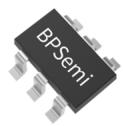
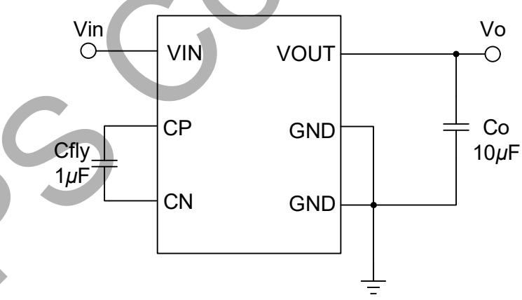
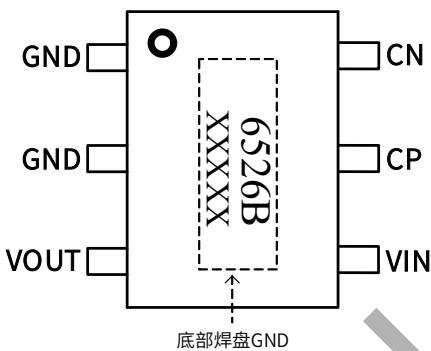
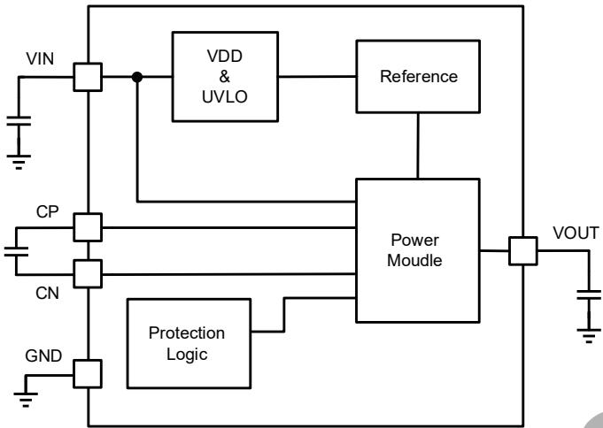
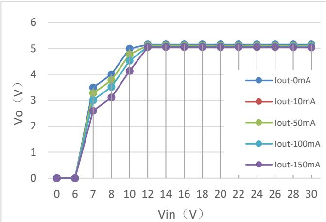
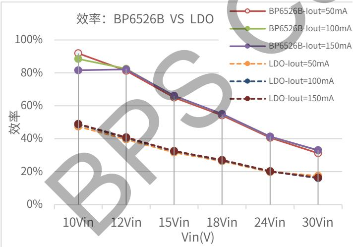
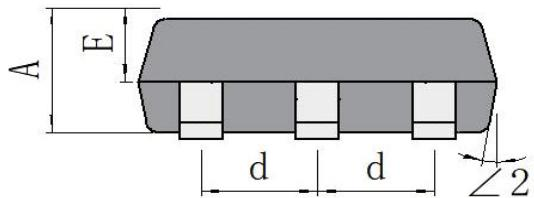
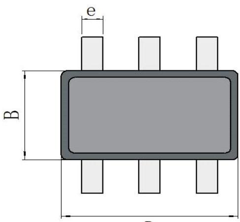
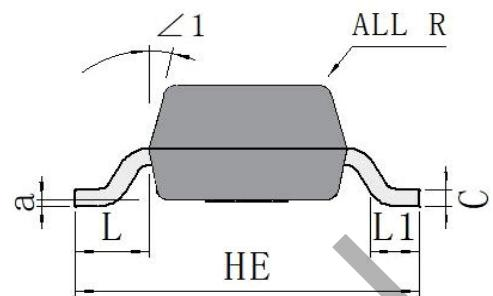
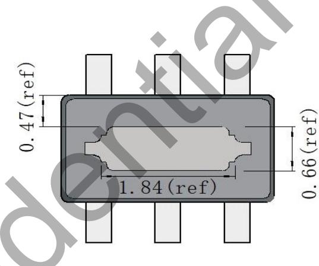

## BP6526B高效智能转换器

## 概述

BP6526B是一款高效智能转换器，固定输出电压 $5 V _ { \circ }$

当输入电压范围在 12\~13V 时，最大输出电流 110mA。

当输入电压范围在 13\~30V 时，最大输出电流 150mA。

BP6526B相比传统线性 LDO 效率显著提升。

外围无需储能电感，有利于优化系统体积和成本。

BP6526B集成多种保护功能。

BP6526B 使用 ESOT-26 封装。

  
ESOT-26 封装

## 特点

 输入电压 12\~30V

 固定输出 5V

 最大输出电流 150mA

 无需储能电感

 改善 EMI 性能的抖频技术

 保护功能

输出短路保护(SCP)

输出过载保护(OLP）

输出过压保护(OVP)

过温保护(OTP)

## 应用领域

DC/DC 辅助电源

## 典型应用

  
图 1. BP6526B 典型应用电路

XXXXX：批次号

## 定购信息

<table><tr><td>定购型号</td><td>封装</td><td>包装形式</td><td>印章</td></tr><tr><td>BP6526B</td><td>ESOT-26</td><td>卷盘3,000只/盘</td><td>6526BXXXXX</td></tr></table>

## 管脚封装

  
图 2.管脚封装图

## 管脚描述

<table><tr><td>管脚号</td><td>管脚名称</td><td>描述</td></tr><tr><td>1,2</td><td>GND</td><td>芯片地</td></tr><tr><td>3</td><td>VOUT</td><td>电源输出端</td></tr><tr><td>4</td><td>VIN</td><td>电源输入端</td></tr><tr><td>5</td><td>CP</td><td>Fly 电容正端</td></tr><tr><td>6</td><td>CN</td><td>Fly 电容负端</td></tr><tr><td>底部焊盘</td><td>GND</td><td>芯片地</td></tr></table>

## 输入输出规格

<table><tr><td>型号</td><td>输入规格</td><td>最大输出规格(注1)</td></tr><tr><td rowspan="2">BP6526B</td><td>12~13V</td><td>5V 100mA</td></tr><tr><td>13~30V</td><td>5V 150mA</td></tr></table>

注 1：充分散热条件下

## 极限参数(注 2)

<table><tr><td>符号</td><td>参数</td><td>参数范围</td><td>单位</td></tr><tr><td> $V_{VIN}$ </td><td>VIN 引脚电压</td><td>-0.3~30</td><td>V</td></tr><tr><td> $V_{CP}$ </td><td>CP 引脚电压</td><td>-0.3~12</td><td>V</td></tr><tr><td> $V_{CN}$ </td><td>CN 引脚电压</td><td>-0.3~6</td><td>V</td></tr><tr><td> $V_{VOUT}$ </td><td>VOUT 引脚电压</td><td>-0.3~6</td><td>V</td></tr><tr><td> $P_{Dmax}$ </td><td>功耗(注 3)</td><td>0.83</td><td>W</td></tr><tr><td> $\theta_{JA}$ </td><td>结到环境热阻(注 4)</td><td>120</td><td>°C/W</td></tr><tr><td> $T_J$ </td><td>工作结温范围</td><td>-20 to 125</td><td>°C</td></tr><tr><td> $T_{STG}$ </td><td>储存温度范围</td><td>-55 to 150</td><td>°C</td></tr><tr><td> $T_{STG}$ </td><td>储存温度范围</td><td>-55 to 150</td><td>°C</td></tr></table>

注 2：极限参数是指超出该范围，有可能导致器件永久性损坏。极限参数为器件应⼒的额定值，⻓期⼯作在极限参数条件可能会影响器件的可靠性。  
注 3：温度升高最大功耗一定会减小，这也是由 TJMAX, θJA,和环境温度TA所决定的。最大允许功耗为PDMAX = (TJMAX - TA)/ θJA或是极限范围给出的数字中比较低的那个值。  
注 4：1平方英寸双层 PCB板，按照JEDEC 标准测试。

电气参数(注 5)

<table><tr><td>符号</td><td>描述</td><td>条件</td><td>最小值</td><td>典型值</td><td>最大值</td><td>单位</td></tr><tr><td rowspan="2"> $V_{in}$ </td><td rowspan="2">输入电压</td><td> $I_{out}=110mA$ </td><td>12</td><td></td><td>30</td><td>V</td></tr><tr><td> $I_{out}=150mA$ </td><td>13</td><td></td><td>30</td><td></td></tr><tr><td> $V_{out}$ </td><td>输出电压</td><td></td><td>4.75</td><td>5</td><td>5.25</td><td>V</td></tr><tr><td> $I_Q$ </td><td>静态工作电流</td><td> $I_{out}=0, Vin=30V$ </td><td></td><td></td><td>250</td><td>μA</td></tr><tr><td> $F_{sw}$ </td><td>开关频率</td><td></td><td></td><td>400</td><td></td><td>kHz</td></tr><tr><td> $T_{OTP}$ </td><td>过热保护温度</td><td></td><td></td><td>145</td><td></td><td>°C</td></tr><tr><td> $T_{OTP\_HYS}$ </td><td>过热保护迟滞</td><td></td><td></td><td>40</td><td></td><td>°C</td></tr></table>

注 5：电气参数定义了器件在⼯作范围内并且在保证特定性能指标的测试条件下的直流和交流电参数规范。最小值和最大值由测试保证，典型值由设计、测试或统计分析保证。对于未给定上下限值的参数，该规范不予保证其精度，但其典型值合理反映了器件性能。

## 内部结构框

  
图 3. BP6526B 内部框图

## 功能描述

BP6525B 是一款高效智能转换器，相比传统线性 LDO 效率显著提升。外围无需储能电感，有利于优化系统体积和成本。BP6526B 拥有丰富的保护功能以提高系统可靠性。

## 控制模式

控制模式为固定频率（约 400kHz），固定占空比(约 50%)的 On-Off 控制。

输出电压经内部分压电阻分压后与内部检测阈值电压比较，当输出电压高于检测阈值电压则停止开关，输出电压低于内部检测阈值电压则开始开关。

## 输出短路保护

BP6526B 通过检测输出电压判断输出短路故障。

当Vo<1.2V且持续5ms后，进入短路保护状态，芯⽚停止开关并保持约500ms后， 自动重置检测输出电压，如果输出短路状态移除，芯⽚自⾏恢复到正常工作状态。

## 输出过载保护

BP6526B 通过检测输出电压判断输出过载故障。

当 Vo<2.5V 且持续 25ms 后，进入过载保护状态，停止开关并保持约500ms后，自动重置检测输出电压，如果输出过载状态移除，芯⽚自⾏恢复到正常工作状态。

## 输出过压保护

BP6526B 通过检测输出电压判断输出过压故障。

并保持约500ms后，自动重置检测输出电压，如果输出过压状态移除，芯⽚自⾏恢复到正常工作状态。

## 过温保护

BP6526B内置过温保护电路，当结温达到过温保护阈值TOTP时，芯⽚会停止工作，直到结温下降到 TOTP-TOTP\_HYST时，芯⽚自⾏恢复正常状态。

## 抖频

BP6526B 设计抖频功能以改善 EMI 表现。

## 应用指南

## 负载特性与效率

在输入电压较低（<13V）的应用中，输出电流过大可能导致输出电压低于5V，请根据实际输出电流确认输出电压能否满足应用需求。

在不同输出电流下，输入电压Vin与输出电压Vo的特性曲线示意图，请参考图 4。

  
图 4. BP6526B 输出特性示意图

BP6526B 的系统效率大约是传统线性 LDO的 2 倍。在输入电压较高时请注意加强 BP6526B 的散热能⼒。不同输出电流下的效率特性示意图，请参考图 5。

  
图 5. BP6526B vs. 传统线性 LDO 效率特性示意图

## PCB Layout 建议

1) BP6526B 的底部焊盘与 GND 相连，是重要的散热途径。建议在 GND引脚和底部焊盘上充分铺铜以加强散热。

2) 输入电容尽量靠近 VIN 和 GND 引脚以避免噪声干扰。

3) ⻜电容（Cfly）尽量靠近 CP 和 CN 引脚以避免噪声干扰并改善 EMI 表现。

4) 输出电容（Co）尽量靠近 VOUT 和 GND 引脚以减小输出纹波并改善 EMI 表现。

## 封装信息

D  

底视图

bottom view  
单位：mm

<table><tr><td>Unit</td><td></td><td>A</td><td>B</td><td>C</td><td>HE</td><td>D</td><td>d</td><td>E</td><td>e</td><td>L</td><td>L1</td><td>a</td><td>R</td><td>∠1</td><td>∠2</td></tr><tr><td rowspan="3">mm</td><td>max</td><td>1.05</td><td>1.80</td><td>0.20</td><td>2.90</td><td>3.12</td><td>1.00</td><td>0.65</td><td>0.40</td><td>0.70</td><td>0.60</td><td rowspan="3">0.2 (ref)</td><td rowspan="3">R0.1 (ref)</td><td rowspan="6">12°</td><td rowspan="6">10°</td></tr><tr><td>typ</td><td>0.95</td><td>1.60</td><td>0.15</td><td>2.80</td><td>2.92</td><td>0.95</td><td>0.55</td><td>0.35</td><td>0.60</td><td>/</td></tr><tr><td>min</td><td>0.85</td><td>1.40</td><td>0.10</td><td>2.70</td><td>2.72</td><td>0.90</td><td>0.45</td><td>0.30</td><td>0.50</td><td>0.20</td></tr><tr><td rowspan="3">mil</td><td>max</td><td>41</td><td>71</td><td>8</td><td>114</td><td>123</td><td>39</td><td>26</td><td>16</td><td>28</td><td>24</td><td rowspan="3">8 (ref)</td><td rowspan="3">R4 (ref)</td></tr><tr><td>typ</td><td>37</td><td>63</td><td>6</td><td>110</td><td>115</td><td>37</td><td>22</td><td>14</td><td>24</td><td>/</td></tr><tr><td>min</td><td>33</td><td>55</td><td>4</td><td>106</td><td>107</td><td>35</td><td>18</td><td>12</td><td>20</td><td>8</td></tr></table>

## 版本信息

<table><tr><td>版本</td><td>日期</td><td>记录</td></tr><tr><td>Rev.1.0</td><td>2025.03</td><td>首次发行</td></tr></table>

## 免责声明

晶丰明源尽⼒确保本产品规格书内容的准确和可靠，但是保留在没有通知的情况下，修改规格书内容的权利。

本产品规格书未包含任何针对晶丰明源或第三方所有的知识产权的授权。针对本产品规格书所记载的信息，晶丰明源不做任何明示或暗示的保证，包括但不限于对规格书内容的准确性、商业上的适销性、特定⽬的的适用性或者不侵犯晶丰明源或任何第三⼈知识产权做任何明示或暗示保证，晶丰明源也不就因本规格书本⾝及其使用有关的偶然或必然损失承担任何责任。

## 电子器件报废说明

该产品在⽣命周期结束后，由客⼾按照⼀般电子产品的报废流程进⾏处理。