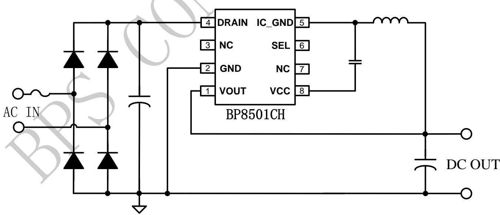
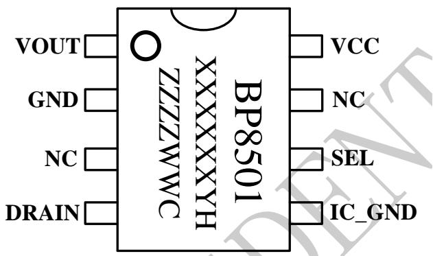
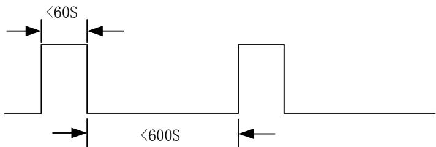
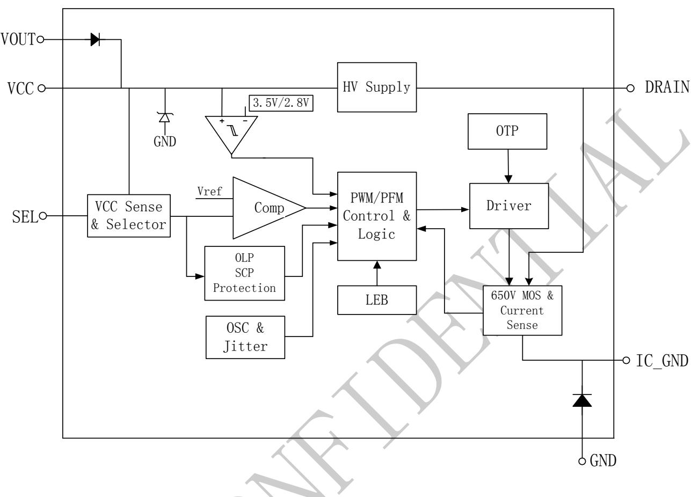
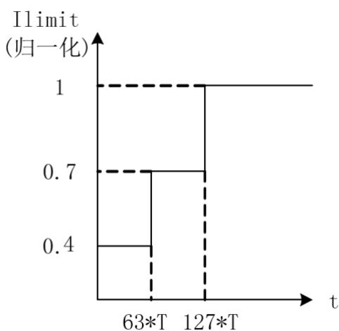
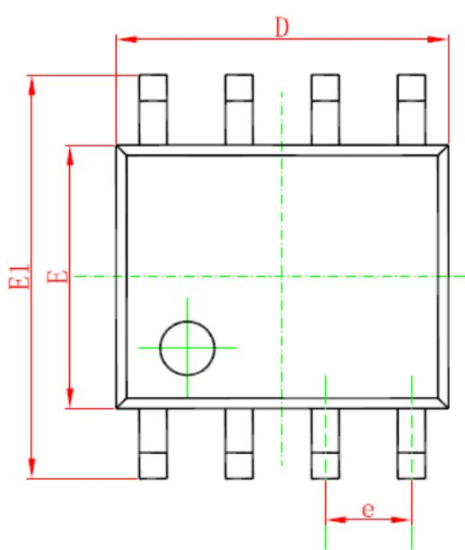
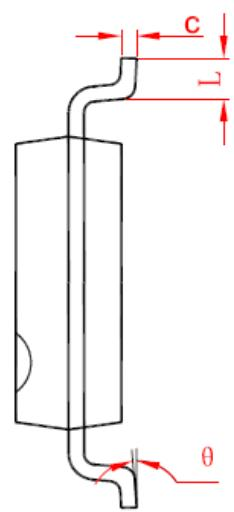
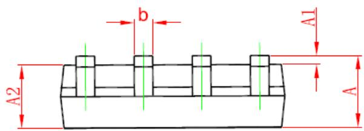

## 概述

BP8501CH 是一款高集成度低待机功耗的非隔离降压型恒压驱动芯片。适用于 85Vac\~265Vac全电压输入的非隔离电源。

BP8501CH芯片内部集成650V功率开关和电流采样，以及续流二极管，采用独有的电压电流控制技术，不需要外部环路补偿电容，即可实现优异的恒压特性，极大的节约了系统成本和体积。

BP8501CH 芯片采用多模式控制技术，并从输出电压经过芯片内部供电二极管给VCC供电，有效降低系统待机功耗，提高效率，并减小系统工作在轻载时的噪声。

BP8501CH 采用 SOP-8 封装。

## 特点

 低待机功耗 <20mW

 固定3.3V 或5V输出电压，可选择

 支持直接输出3.3V

 内部集成650V 功率管

 集成高压启动和供电电路

 减小音频噪声的降幅调制技术

 改善EMI的抖频技术

 内置软启动

 保护功能

➢ 过载保护

➢ 短路保护

➢ 过温保护

➢ 逐周期限流

## 应用

 辅助电源

## 典型应用

  
图 1 BP8501CH 典型应用

## 定购信息

<table><tr><td>定购型号</td><td>封装</td><td>温度范围</td><td>包装形式</td><td>打印</td></tr><tr><td>BP8501CH</td><td>SOP-8</td><td>-40°C 到 105°C</td><td>编带4000pcs/盘</td><td>BP8501XXXXXYHZZZWWC</td></tr></table>

## 管脚封装

  
XXXXXY: lot code  
ZZZZ: 标识  
WW：周号  
图2 管脚封装图

## 管脚描述

<table><tr><td>管脚号</td><td>管脚名称</td><td>描述</td></tr><tr><td>1</td><td>VOUT</td><td>输出电压端</td></tr><tr><td>2</td><td>GND</td><td>输出电压参考地</td></tr><tr><td>3,7</td><td>NC</td><td>无连接</td></tr><tr><td>4</td><td>DRAIN</td><td>芯片内部高压功率管的漏极</td></tr><tr><td>5</td><td>IC_GND</td><td>芯片地</td></tr><tr><td>6</td><td>SEL</td><td>输出电压选择端。接VCC:输出3.3V;接IC_GND:输出5V</td></tr><tr><td>8</td><td>VCC</td><td>芯片电源端</td></tr></table>

## 极限参数，参考 IC\_GND(注 1)

<table><tr><td>符号</td><td>参数</td><td>参数范围</td><td>单位</td></tr><tr><td> $V_{DS}$ </td><td>内部高压功率管漏极到源极峰值电压</td><td>-0.3~650</td><td>V</td></tr><tr><td>VCC</td><td>VCC电压</td><td>-0.3~7</td><td>V</td></tr><tr><td> $I_{CC\_MAX}$ </td><td>VCC引脚最大电源电流</td><td>10</td><td>mA</td></tr><tr><td>SEL</td><td>输出电压选择端</td><td>-0.3~7</td><td>V</td></tr><tr><td>GND</td><td>输出电压参考地(相对IC_GND)</td><td>-650~+0.3</td><td>V</td></tr><tr><td>VOUT</td><td>输出电压端(相对GND)</td><td>-0.3~7</td><td>V</td></tr><tr><td> $P_{DMAX}$ </td><td>功耗(注2)</td><td>0.45</td><td>W</td></tr><tr><td> $\theta_{JA}$ </td><td>PN结到环境的热阻</td><td>145</td><td>°C/W</td></tr><tr><td> $T_J$ </td><td>工作结温范围</td><td>-40 to 150</td><td>°C</td></tr><tr><td> $T_{STG}$ </td><td>储存温度范围</td><td>-55 to 150</td><td>°C</td></tr><tr><td></td><td>ESD(注3)</td><td>2</td><td>kV</td></tr></table>

注 1：最大极限值是指超出该工作范围，芯片有可能损坏。推荐工作范围是指在该范围内，器件功能正常，但并不完全保证满足个别性能指标。电气参数定义了器件在工作范围内并且在保证特定性能指标的测试条件下的直流和交流电参数规范。对于未给定上下限值的参数，该规范不予保证其精度，但其典型值合理反映了器件性能。  
注 2：温度升高最大功耗一定会减小，这也是由 TJMAX, θJA,和环境温度 $\mathrm { T } _ { \mathrm { A } }$ 所决定的。最大允许功耗为 $\mathrm { \Delta P _ { D M A X } = ( T _ { J M A X } - T _ { A } ) / }$ $\theta _ { \mathrm { J A } }$ 或是极限范围给出的数字中比较低的那个值。  
注 ${ \mathfrak { 3 } } { \mathfrak { z } }$ ：人体模型，100pF 电容通过 1.5KΩ 电阻放电。

## 极限输出功率表

<table><tr><td>输出电流</td><td>测试条件描述</td><td>限值范围Vout=3.3V</td><td>限值范围Vout=5V</td><td>单位</td></tr><tr><td>持续输出电流</td><td rowspan="2">输入电压85Vac-265Vac</td><td>60</td><td>60</td><td>mA</td></tr><tr><td>脉冲输出电流</td><td>100</td><td>100</td><td>mA</td></tr><tr><td>IC峰值电流</td><td>内部MOS管限制最大电流</td><td>140</td><td>140</td><td>mA</td></tr></table>

  
图 3 瞬时脉冲示意图

电气参数(注 4, 5)（无特别说明情况下， $\mathrm { \bf T } _ { \mathrm { A } } { = } 2 5 \mathrm { \mathcal { C } } { ) }$

<table><tr><td>符号</td><td>描述</td><td>条件</td><td>最小值</td><td>典型值</td><td>最大值</td><td>单位</td></tr><tr><td colspan="7">电源电压</td></tr><tr><td> $V_{CC}$ </td><td> $V_{CC}$ 引脚稳态电压</td><td>SEL= VCC</td><td>3.44</td><td>3.51</td><td>3.58</td><td>V</td></tr><tr><td> $V_{CC}$ </td><td> $V_{CC}$ 引脚稳态电压</td><td>SEL= GND</td><td>5.31</td><td>5.41</td><td>5.52</td><td>V</td></tr><tr><td> $V_{CC\_ON}$ </td><td> $V_{CC}$ 开启电压</td><td>Rising</td><td></td><td>3.5</td><td></td><td>V</td></tr><tr><td> $V_{CC\_OFF}$ </td><td> $V_{CC}$ 关断电压</td><td>Falling</td><td></td><td>2.8</td><td></td><td>V</td></tr><tr><td> $V_{CC\_HYS}$ </td><td> $V_{CC}$ 引脚电压迟滞</td><td></td><td></td><td>0.7</td><td></td><td>V</td></tr><tr><td> $V_{CC\_CHRG}$ </td><td> $V_{CC}$ 充电开启电压</td><td>Falling</td><td></td><td>2.9</td><td></td><td>V</td></tr><tr><td> $V_{CLAMP}$ </td><td> $V_{CC}$ 引脚箝位电压</td><td> $I_{CLAMP}=2mA$ </td><td></td><td>6.2</td><td></td><td>V</td></tr><tr><td rowspan="2"> $V_{CC\_OLP}$ </td><td rowspan="2"> $V_{CC}$ 过载保护电压</td><td>SEL= VCC</td><td></td><td>3.0</td><td></td><td>V</td></tr><tr><td>SEL= GND</td><td></td><td>3.5</td><td></td><td>V</td></tr><tr><td> $I_{OP}$ </td><td> $V_{CC}$ 工作电流</td><td> $V_{DRAIN}=40V$ </td><td></td><td>140</td><td>200</td><td>uA</td></tr><tr><td> $I_{cc}$ </td><td> $V_{CC}$ 启动电流</td><td></td><td></td><td>3.5</td><td></td><td>mA</td></tr><tr><td colspan="7">振荡器</td></tr><tr><td> $F_{OSC\_MAX}$ </td><td>最大开关频率</td><td></td><td>30</td><td>35</td><td>40</td><td>kHz</td></tr><tr><td> $D_{MAX}$ </td><td>最大占空比</td><td></td><td></td><td>64</td><td></td><td>%</td></tr><tr><td colspan="7">电流采样</td></tr><tr><td> $I_{LIMIT\_3.3V}$ </td><td>DC 电流限值</td><td>Vout=3.3V</td><td></td><td>145</td><td></td><td>mA</td></tr><tr><td> $I_{LIMIT\_5V}$ </td><td>DC 电流限值</td><td>Vout=5V</td><td></td><td>145</td><td></td><td>mA</td></tr><tr><td> $T_{LEB}$ </td><td>前沿消隐时间</td><td></td><td></td><td>350</td><td></td><td>ns</td></tr><tr><td> $T_{ILD}$ </td><td>电流限流延迟</td><td></td><td></td><td>100</td><td></td><td>ns</td></tr><tr><td colspan="7">功率管</td></tr><tr><td> $R_{DS\_ON\_3.3V}$ </td><td>功率管导通阻抗</td><td>Vout=3.3V, $I_{DS}$ =50mA</td><td></td><td>25</td><td></td><td>Ω</td></tr><tr><td> $R_{DS\_ON\_5V}$ </td><td>功率管导通阻抗</td><td>Vout=5V, $I_{DS}$ =50mA</td><td></td><td>25</td><td></td><td>Ω</td></tr><tr><td> $BV_{DSS}$ </td><td>功率管的击穿电压</td><td> $V_{GS}$ =0V/ $I_{DS}$ =250uA</td><td>650</td><td></td><td></td><td>V</td></tr><tr><td> $V_{DS\_SUP}$ </td><td>漏极供电电压</td><td></td><td>24</td><td></td><td></td><td>V</td></tr><tr><td colspan="7">续流二极管</td></tr><tr><td> $V_{BR1}$ </td><td>二极管击穿电压</td><td> $I_{R}$ =5uA</td><td>600</td><td></td><td></td><td>V</td></tr><tr><td> $V_{F1}$ </td><td>二极管导通压降</td><td> $I_{F}$ =300mA</td><td></td><td></td><td>1.7</td><td>V</td></tr><tr><td> $dIF_{AV1}$ </td><td>最大平均导通电流</td><td></td><td>300</td><td></td><td></td><td>mA</td></tr><tr><td> $T_{RR1}$ </td><td>反向恢复时间</td><td> $I_{F}$ =300mA, $I_{R}$ =600mA, $I_{RR}$ =150mA</td><td></td><td></td><td>35</td><td>ns</td></tr><tr><td colspan="7">VCC 供电二极管</td></tr><tr><td> $V_{BR2}$ </td><td>二极管击穿电压</td><td> $I_{R}$ =5uA</td><td>600</td><td></td><td></td><td>V</td></tr><tr><td> $V_{F2}$  $\text{IF}_{\text{AV2}}$ </td><td>二极管导通压降最大平均导通电流</td><td> $I_{F}$ =100mA</td><td>100</td><td></td><td>1.7</td><td>VmA</td></tr><tr><td colspan="7">过热保护</td></tr><tr><td> $T_{SD}$ </td><td>过热调节温度</td><td></td><td></td><td>150</td><td></td><td>°C</td></tr><tr><td> $T_{SD\_HYS}$ </td><td>过热保护温度迟滞</td><td></td><td></td><td>40</td><td></td><td>°C</td></tr></table>

注 4：典型参数值为25˚C 下测得的参数标准。  
注 5：规格书的最小、最大规范范围由测试保证，典型值由设计、测试或统计分析保证。

## 内部结构框图

  
图 4 BP8501CH 内部框图

## 应用信息

BP8501CH 是一款高压输入的超低待机功耗降压型恒压驱动芯片，采用特有的多模式控制，芯片内部集成 650V 功率开关和输出电压采样电阻，以及续流二极管，只需要极少的外围组件就可以达到优异的恒压特性。特别适合于辅助电源应用。

## 启动

系统上电后，母线电压直接通过 Drain 端对 $\mathrm { V _ { C C } }$ 电容充电，当 $\mathrm { V _ { C C } }$ 电压达到芯片开启阈值时，芯片内部控制电路开始工作。BP8501CH 内置 6V稳压管，用于钳位 $\mathrm { V _ { C C } }$ 电压。芯片正常工作时，需要的 $\mathrm { V _ { C C } }$ 电流极低，所以无需辅助绕组供电。

## 软启动

芯片具有软启动功能，在软启动过程中，会分段增加原边峰值电流以减小开关应力，每一次重启都会经历软启动的过程。

## 输出电感

BP8501CH 可工作于 CCM、DCM 等多种工作模式，对于电感的选择包括感量、峰值电流以及平均电流。最终根据电感价格、电感尺寸以及系统效率来决定电感的大小。小感量电感可以减小尺寸、降低价格以及改善系统动态响应，但是，同时会增大电感的峰值电流和输出纹波并且降低系统效率。相反的，大感量电感可以提高效率，因为需要更多线圈数，物理体积也会更大，动态响应也会变的更慢。综合电感价格、尺寸、系统效率以及动态响应，推荐电感纹波电流系数 r 不小于 25%，工作在CCM模式下，然后，根据输入/输出电压、系统开关频率、满载输出电流以及推荐的电感纹波电流 $\Delta \mathrm { { I L } }$ 估算电感感量、峰值电流

$$
\mathrm{L} = \frac {V _ {O U T} (V _ {I N} - V _ {O U T})}{V _ {I N} * F * \Delta I _ {L}}
$$

其中

$$
\Delta I _ {L} = I _ {o u t} * r
$$

## 峰值电流

当电流纹波系数 r 确定后，就可以计算出峰值电流大小

$$
I _ {L \_ P E A K} = I _ {O \_ M A X} + \frac {\Delta I _ {L}}{2}
$$

$$
I _ {L \_ V A L L Y} = I _ {O \_ M A X} - \frac {\Delta I _ {L}}{2}
$$

同样由芯片的 I 参数可推算出最大的过载电流。

## 输入电容的选择

输入电容的用处在于输入电压以及 MOSFET 开关尖峰的滤波。由于降压转换器的输入电流是非连续的，需要电容对交流电流进行吸收，以保证平稳的输入电压。另外，输入电容需要能承受足够的电流波纹。输入纹波电流有效值估算如下：

$$
I _ {I N \_ R M S} = I _ {O \_ M A X} \times \sqrt {D \times (1 - D)}
$$

$$
D = \frac {V _ {O U T}}{V _ {I N}}
$$

为了减小噪声，建议输入电容选择电解电容。

## 输出电容的选择

输出电容的作用是输出电压的滤波以及输出动态电流的供应。当输出电流恒定时，输出纹波主要由输出电容的ESR以及容量决定 。

$$
V _ {R I P P L E} = V _ {R I P P L E \_ E S R} + V _ {R I P P L E \_ C}
$$

$$
V _ {R I P P L E \_ E S R} = \Delta I _ {L} \times E S R
$$

$$
V _ {R I P P L E \_ C} = \frac {\Delta I _ {L}}{8 \times C _ {O U T} \times f s w}
$$

## 假负载选择

飘高。假负载阻值过大会导致空载时输出电压飘高，而阻值过小会影响实际的带载能力，也会增大系统的待机功耗。因此需要合理的设置假负载阻值，推荐为 1Kohm。

## 多模式控制

BP8501CH 芯片采用 PWM/PFM 多模式控制技术，能有效降低系统待机功耗，提高效率，并减小系统工作在轻载时的噪声。

## 输出电压过载、短路保护

通过 引脚来实现输出电压的过载和短路保护, 当 VCC 电压低于设定电压且保持 440ms，芯片即实现输出过载保护。保护后，功率 MOS 关断，芯片振荡器工作在最低频率为4KHz，保护发生后，芯片会定时 760ms 重新检测 VCC 电压，如果过载、短路解除，则正常工作，如未解除，继续保护。

## 其它保护功能

BP8501CH 内置多种保护功能，包括过温保护，

逐周期限流等。

PCB 设计

在设计 BP8501CH PCB 时，需要遵循以下建议：旁路电容

VCC的旁路电容需要紧靠芯片 VCC和 IC\_GND 引脚。

芯片 IC\_GND

增加 IC\_GND 引脚的敷铜面积以提高芯片散热。

芯片 IC\_GND 输出电感之间的走线应该短粗,防止形成发射天线影响EMI辐射。

功率环路的面积

减小功率环路的面积，如输入母线电容、芯片DRAIN 引脚以及 IC\_GND 之间的环路，输出电容、输出电感、芯片内部续流二极管之间的环路以减小 EMI辐射。

DRAIN 引脚

DRAIN引脚尽量远离低压引脚和元器件。

## 封装信息

SOP8 PACKAGE OUTLINE DIMENSIONS  

<table><tr><td rowspan="2">Symbol</td><td colspan="2">Dimensions In Millimeters</td><td colspan="2">Dimensions In Inches</td></tr><tr><td>Min</td><td>Max</td><td>Min</td><td>Max</td></tr><tr><td>A</td><td>1.350</td><td>1.750</td><td>0.053</td><td>0.069</td></tr><tr><td>A1</td><td>0.100</td><td>0.250</td><td>0.004</td><td>0.010</td></tr><tr><td>A2</td><td>1.350</td><td>1.550</td><td>0.053</td><td>0.061</td></tr><tr><td>b</td><td>0.330</td><td>0.510</td><td>0.013</td><td>0.020</td></tr><tr><td>c</td><td>0.170</td><td>0.250</td><td>0.006</td><td>0.010</td></tr><tr><td>D</td><td>4.700</td><td>5.100</td><td>0.185</td><td>0.200</td></tr><tr><td>E</td><td>3.800</td><td>4.000</td><td>0.150</td><td>0.157</td></tr><tr><td>E1</td><td>5.800</td><td>6.200</td><td>0.228</td><td>0.244</td></tr><tr><td>e</td><td colspan="2">1.270 (BSC)</td><td colspan="2">0.050 (BSC)</td></tr><tr><td>L</td><td>0.400</td><td>1.270</td><td>0.016</td><td>0.050</td></tr><tr><td>θ</td><td> $0^{\circ}$ </td><td> $8^{\circ}$ </td><td> $0^{\circ}$ </td><td> $8^{\circ}$ </td></tr></table>